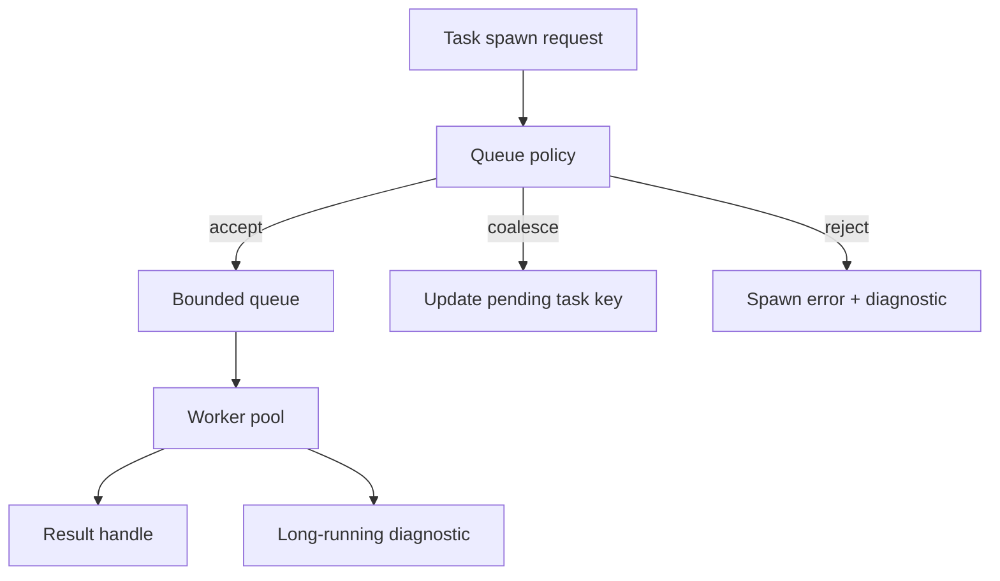

# ADR 0052: Task Backpressure, Cancellation, and Long-Running Diagnostics

**Status**: Accepted
**Date**: 2026-07-09
**Refines**: ADR 0008, ADR 0042, ADR 0048

## Context

`nara_tasks` gives nara an engine-owned task model, deterministic execution, handles, cancellation, and stats.
The next missing contract is backpressure.
Asset reload storms, bulk import, image decoding, procedural generation, and future editor jobs can enqueue work faster than workers can finish it.
An unbounded channel turns overload into memory growth and stale results.

## Decision

Task pools use bounded queues, explicit spawn outcomes, cooperative cancellation, and long-running diagnostics.

Rules:

- Each task kind has queue capacity, running capacity, and overload policy.
- Spawn returns a structured outcome: accepted, coalesced, rejected, or cancelled-before-start.
- Reload/import tasks may provide a coalesce key so newer work replaces older pending work when safe.
- Long-running tasks report age and stage through diagnostics without requiring the task to finish.
- Cancellation is cooperative and should be checked by long-running work units.
- `TaskStats` includes queued, running, completed, failed, cancelled, rejected, coalesced, oldest queued age, and oldest running age.
- Deterministic mode still exercises queue policy; it should not silently bypass backpressure tests.
- Background tasks still never mutate `World` directly.

## Alternatives Considered

### Option A: Keep unbounded queues

**Pros**: Simple API and no rejected spawns.

**Cons**: Reload storms and bulk import can grow memory and waste CPU on stale work.

**Decision**: Rejected.

### Option B: Block spawn when the queue is full

**Pros**: Natural backpressure in synchronous code.

**Cons**: Blocking the main app schedule can freeze the frame loop and editor.

**Decision**: Rejected as the default.

### Option C: Bounded queues with explicit overload outcomes

**Pros**: Keeps the main loop responsive and makes overload observable.

**Cons**: Callers must decide how to handle rejection or coalescing.

**Decision**: Chosen.

## Success Metrics

| Metric | Target | Measurement |
|---|---:|---|
| Bounded queues | Queue length cannot exceed configured capacity | Unit tests |
| Overload visibility | Rejected/coalesced spawns update stats and diagnostics | Unit tests |
| Reload storms | Repeated reload requests coalesce by source/generation when safe | Asset tests |
| Long task visibility | Old running tasks emit diagnostics with age | Task tests |
| Determinism | Deterministic mode follows the same capacity policy | Deterministic tests |

## Risks and Mitigations

| Risk | Severity | Likelihood | Mitigation |
|---|---|---:|---|
| Rejection drops important work | High | Medium | Use typed overload policies per task class and require caller tests. |
| Coalescing hides needed intermediate states | Medium | Medium | Allow coalesce only for idempotent or superseding work such as reload generations. |
| Too many diagnostics under overload | Medium | Medium | Dedupe overload diagnostics through ADR 0048. |
| Capacity defaults are wrong | Medium | Medium | Make defaults conservative and expose settings through project/runtime configuration later. |

## Consequences

- `TaskPools::spawn` should eventually return a spawn outcome rather than assuming acceptance.
- Asset reload/import should use coalesce keys and generation checks together.
- Runtime diagnostics must include task queue and age context.

## Open Questions

- Which default capacities should be used for IO, compute, and async-compute pools?
- Should task priority exist before networking/scripting introduces latency-sensitive work?
- Should completed task results also have retention limits?

