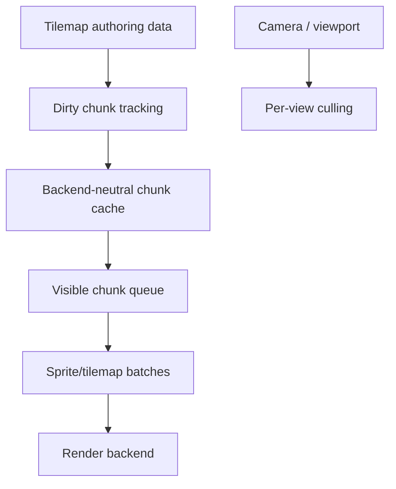

# ADR 0053: Visibility, Culling, and Tilemap Render Cache

**Status**: Superseded
**Date**: 2026-07-09
**Refines**: ADR 0005, ADR 0032, ADR 0040
**Superseded By**: [ADR 0096](0096-evidence-gated-render-scaling-and-upload-policy.md)

## Context

Tilemaps are an early 2D feature, but they can become the first large-scene performance wall.
Dirty chunk records exist, yet extraction can still traverse all cells and emit per-view sprite items every frame.
That is acceptable for small examples and wrong as a mature engine contract.

## Decision

Visibility, culling, and tilemap chunk caching are render-domain contracts, not backend shortcuts.

Rules:

- Tilemap authoring data remains stable scene data; render caches are runtime-only.
- Tilemaps are divided into chunks for extraction and cache invalidation.
- Dirty chunks rebuild cache data; clean chunks are reused.
- Per-view culling happens before queueing visible tile chunks.
- Static and dynamic tilemap data may use different cache paths when mutation frequency justifies it.
- Backend-neutral chunk cache data should describe visible quads/instances/material keys, not wgpu buffers.
- GPU buffer or mesh caches live in the backend and follow ADR 0040/0054 lifetime policy.
- Small tilemaps may use simple paths internally, but public architecture must not require all-cell expansion every frame.

## Alternatives Considered

### Option A: Expand all tile cells every frame

**Pros**: Simple and deterministic.

**Cons**: Scales poorly with large maps and multiple cameras.

**Decision**: Rejected as the long-term contract.

### Option B: Store backend GPU meshes in tilemap components

**Pros**: Fast draw path for one backend.

**Cons**: Leaks backend handles into authoring data and breaks serialization/backend replacement.

**Decision**: Rejected.

### Option C: Backend-neutral chunk cache plus backend-owned GPU cache

**Pros**: Keeps data ECS/serialization safe while avoiding full per-frame expansion.

**Cons**: Requires cache invalidation, culling tests, and memory policy.

**Decision**: Chosen.

## Success Metrics

| Metric | Target | Measurement |
|---|---:|---|
| Culling | Off-camera chunks do not enter visible tile queues | Unit tests |
| Dirty rebuild | Editing a cell rebuilds only affected chunks | Unit tests |
| Cache reuse | Clean chunks are reused across frames | Unit tests |
| Backend isolation | Tilemap components contain no backend handles | Serialization review |
| Multi-view behavior | Multiple cameras produce independent visible chunk sets | Render tests |

## Risks and Mitigations

| Risk | Severity | Likelihood | Mitigation |
|---|---|---:|---|
| Cache invalidation becomes subtle | High | Medium | Key cache by tilemap revision, chunk coordinate, tileset/material generation, and layout-affecting settings. |
| Memory grows for large worlds | Medium | Medium | Combine chunk cache with eviction and visibility stats. |
| Static/dynamic split arrives too early | Medium | Low | Start with one cache path and add split only when mutation pressure appears. |
| Culling conflicts with editor gizmos | Medium | Medium | Keep editor overlays in separate phases and do not hide selected/offscreen diagnostic data. |

## Consequences

- `nara_sprite_render` should stop treating tilemap lowering as always-full expansion before large maps are a target.
- Future 3D visibility/culling can share vocabulary with 2D chunk visibility.
- Render diagnostics should expose tilemap chunk counts, visible counts, and cache rebuild counts.

## Open Questions

- What default tile chunk size should Phase 1 use?
- Should chunk caches live in `nara_tilemap` or `nara_sprite_render`?
- Which benchmark or fixture should define the first tilemap scale target?
