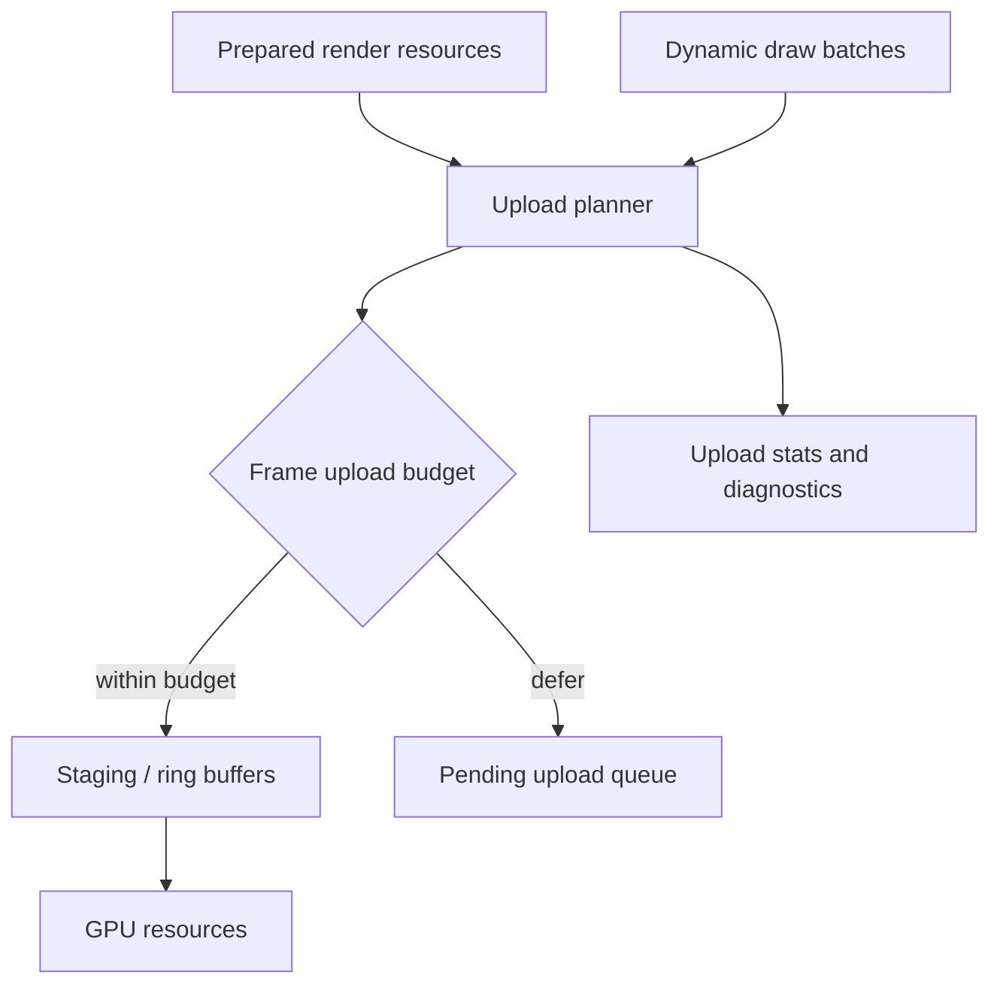

# ADR 0054: GPU Upload Budget and Buffer Allocation Policy

**Status**: Accepted
**Date**: 2026-07-09
**Refines**: ADR 0033, ADR 0040
**Refined By**: [ADR 0096](0096-evidence-gated-render-scaling-and-upload-policy.md)

## ADR 0096 Refinement

Backend ownership, finite admission, pressure statistics, and device-epoch invalidation remain
Accepted. Ring/staging buffers, a pending upload queue, universal deferral, and submitter priority
are candidate mechanisms selected only after a measured workload proves the need. Different
resource classes may require different explicit overload behavior.

## Context

Render resource lifetime covers cache identity and eviction, but GPU upload work needs its own budget.
The current sprite path can pack batches and create buffers per frame.
That is acceptable for first pixels, but a mature renderer needs predictable upload cost, staging reuse, and diagnostics before UI text, tilemap chunks, editor overlays, and future 3D all compete for GPU bandwidth.

## Decision

GPU upload and dynamic buffer allocation are budgeted backend responsibilities.

Rules:

- Backends own staging buffers, ring buffers, dynamic vertex/index buffers, and GPU upload queues.
- Upload planning records requested bytes, uploaded bytes, deferred bytes, buffer allocations, buffer reuses, and upload failures.
- Per-frame upload budgets are explicit and observable. Defaults may be generous in Phase 1 but must exist as policy.
- Dynamic batches should reuse buffers or suballocate from ring/staging buffers when practical; per-batch buffer creation is a transitional implementation detail, not the contract.
- Uploads may be deferred when budget is exceeded, provided the backend reports the deferred work and preserves last-good resources when available.
- Device loss clears backend-owned upload/cache state and reports recovery status.
- Render resource cache eviction and upload budgets share stats vocabulary so tooling can show memory and bandwidth pressure together.

## Alternatives Considered

### Option A: Create buffers and upload everything every frame

**Pros**: Simple and predictable code.

**Cons**: Poor scaling, high allocation churn, and no way to diagnose upload spikes.

**Decision**: Rejected as the long-term contract.

### Option B: Unlimited staging buffers

**Pros**: Avoids dropped/deferred uploads.

**Cons**: Turns overload into memory growth and hides performance cliffs.

**Decision**: Rejected.

### Option C: Budgeted uploads with reusable staging

**Pros**: Makes cost observable and gives editor/runtime tools a stable pressure signal.

**Cons**: Requires more backend bookkeeping and tests.

**Decision**: Chosen.

## Success Metrics

| Metric | Target | Measurement |
|---|---:|---|
| Upload observability | Backend status reports requested, uploaded, and deferred bytes | Render tests |
| Allocation reuse | Dynamic buffers are reused or suballocated across frames when possible | Unit/smoke tests |
| Budget behavior | Exceeding budget defers or rejects uploads with diagnostics | Unit tests |
| Device recovery | Device loss clears upload/cache state without corrupting prepared resources | Backend tests |
| Tooling readiness | Upload stats can be surfaced in debug overlay/editor | Tooling model tests |

## Risks and Mitigations

| Risk | Severity | Likelihood | Mitigation |
|---|---|---:|---|
| Budget deferral creates missing visuals | High | Medium | Preserve last-good resources and report skipped/deferred frame reasons. |
| Ring buffer code becomes backend-specific complexity | Medium | Medium | Keep the public contract in stats/policy; backend implementation can evolve. |
| Premature optimization slows Phase 1 | Medium | Medium | Start with policy and stats, then replace per-frame allocations where tests show churn. |
| Multiple submitters compete unfairly | Medium | Medium | Track upload class/domain in stats and add priority only when needed. |

## Consequences

- `nara_render_wgpu` should grow upload stats before more submitters and glyph/tilemap caches land.
- `RenderBackendStatus` or a render diagnostics resource should expose upload budget pressure.
- Future text glyph atlas uploads and tilemap chunk uploads must use the same vocabulary.

## Open Questions

- Should upload budget live in `nara_render` as backend-neutral settings or in each backend?
- What units should Phase 1 expose first: bytes, allocations, or both?
- Should deferred uploads skip a frame or synchronously exceed budget in debug builds?
