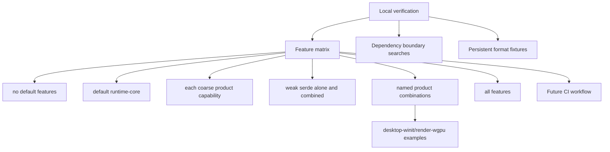

# ADR 0055: Feature Matrix, Boundary Checks, and Compatibility Fixtures

**Status**: Accepted
**Date**: 2026-07-09
**Refines**: ADR 0014, ADR 0044, ADR 0051
**Refined By**: ADR 0079: Root Product Capabilities and Placeholder Domain Retirement

## Context

ADR 0014 defines local quality gates and says they apply to CI when CI exists.
The repository does not need GitHub Actions immediately, but the quality matrix still needs to be a machine-readable contract.
Feature combinations, backend boundary searches, and persistent-format fixtures should not depend on human memory.

## Decision

nara keeps CI setup optional for now, but defines a CI-ready local verification matrix and compatibility fixture policy.

Rules:

- The local matrix is the source of truth before CI exists.
- Future CI mirrors the local matrix instead of inventing a separate policy.
- Required gates include formatting, no-default and default dependency trees, workspace tests, every
  coarse product capability, weak-serde-only and serde-combined checks, named product combinations,
  all-features, desktop-winit/render-wgpu examples, backend dependency boundary searches, and
  persistent-format fixture tests.
- The matrix asserts dependency membership as well as successful compilation: no-default activates
  no product domain, default activates only `runtime-core`, runtime UI excludes sprite/tilemap,
  base wgpu excludes sprite/UI submitters, and server installation remains stricter than compiled
  input support.
- Boundary searches cover `wgpu`, `winit`, `egui`, `notify`, and future backend-only dependencies.
- Persistent format fixtures are part of compatibility testing and belong to ADR 0051's envelope/migration policy.
- CI should be introduced when the project starts accepting external contributions, when release artifacts exist, or when local verification drift becomes common.
- Until CI exists, plan Verification Contracts must name the local gates they require.

## Alternatives Considered

### Option A: No machine-readable matrix until CI exists

**Pros**: No process overhead.

**Cons**: Agents and humans choose different local checks and compatibility fixtures are forgotten.

**Decision**: Rejected.

### Option B: Add full GitHub Actions immediately

**Pros**: Enforces gates on every push.

**Cons**: The user explicitly deferred CI, and early engine refactors may churn feature sets quickly.

**Decision**: Deferred.

### Option C: CI-ready local matrix now, CI workflow later

**Pros**: Gives implementation plans a stable quality contract without forcing CI infrastructure yet.

**Cons**: Local discipline is still required until CI lands.

**Decision**: Chosen.

## Success Metrics

| Metric | Target | Measurement |
|---|---:|---|
| Matrix clarity | Plans can reference a single local quality matrix | Plan review |
| Feature coverage | no-default, default, each coarse capability, weak serde, named products, and all-features are named | Verification docs |
| Dependency truth | Every matrix entry matches ADR 0079's declared direct product-domain closure | `cargo tree` assertions |
| Boundary safety | Backend dependency searches are standard gates | Local runs |
| Fixture compatibility | Persistent format fixtures are part of verification | Golden tests |
| CI readiness | A future workflow can mirror the local matrix directly | CI implementation review |

## Risks and Mitigations

| Risk | Severity | Likelihood | Mitigation |
|---|---|---:|---|
| Local gates are skipped | Medium | Medium | Require plan Verification Contracts to list gates and record unavailable checks. |
| Feature matrix grows slow | Medium | Medium | Split expensive smoke tests from fast check/test gates later. |
| Successful checks hide accidental dependencies | High | Medium | Assert dependency trees and facade visibility for the named capability matrix. |
| Boundary searches produce false positives | Low | Medium | Keep allowlists explicit and review them with backend ADRs. |
| CI arrives with different semantics | Medium | Low | Treat this ADR as the CI source of truth. |

## Consequences

- Plans should keep naming local verification gates even when CI is deferred.
- A future `xtask` or script can encode the product capability and dependency-tree matrix without
  changing the policy.
- Golden fixtures become part of compatibility, not just one-off tests.

## Open Questions

- Should the local matrix be encoded as an `xtask` before adding GitHub Actions?
- Which feature names should become mandatory as the workspace grows?
- Should boundary searches use a checked allowlist file instead of raw `rg` commands?
