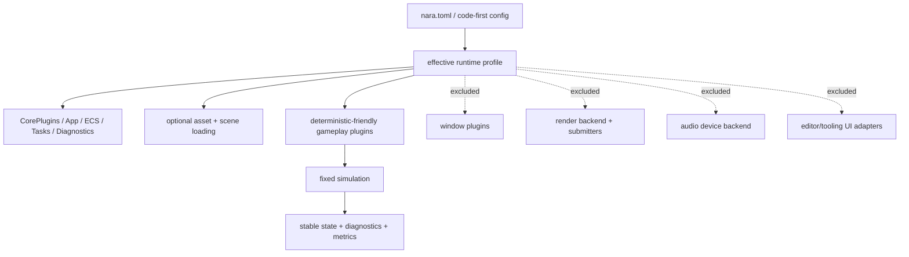
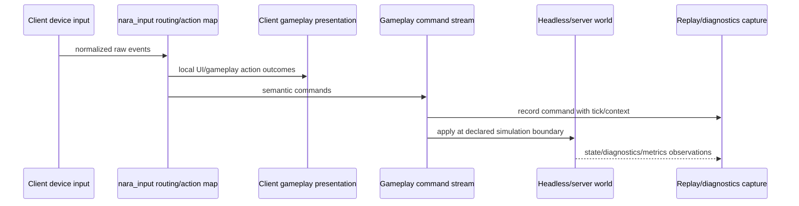

# ADR 0056: Headless Runtime and Dedicated Server Readiness

**Status**: Accepted
**Date**: 2026-07-09
**Refines**: ADR 0003, ADR 0024, ADR 0027, ADR 0028, ADR 0035, ADR 0041, ADR 0042,
ADR 0046, ADR 0048
**Refined By**: ADR 0057: Authoritative Fixed-Tick and Command Ingress; ADR 0058: Stable Runtime
Identity and Entity References; ADR 0068: Global Resource Budgets, Metrics, and Diagnostic Privacy;
ADR 0079: Root Product Capabilities and Placeholder Domain Retirement

## Context

nara does not need networking or a production dedicated server in Phase 1, but server readiness
affects decisions that are already being made: plugin groups, project profiles, input semantics,
stable entity identity, diagnostics, and which systems are allowed to run without a window.

If the desktop/game-client profile becomes the implicit default for all runtime work, a later
dedicated server will require expensive untangling. The server does not need rendering, windows,
audio playback, editor panels, or raw keyboard/mouse input. It does need deterministic-friendly
simulation, scene/save/replication identity, command-oriented gameplay input, bounded tasks, and
machine-readable diagnostics.

This ADR does not add networking. It defines the runtime boundary that keeps networking and
dedicated server work possible without forcing it into core.

## Decision

nara treats headless runtime and dedicated-server readiness as first-class profile constraints.

Rules:

- A server profile must not install window, render, audio-device, editor, UI-toolkit adapter, or
  raw-input plugins/resources by default.
- A server profile may install core runtime, tasks, diagnostics, asset identity/loading,
  scene/prefab spawning, deterministic-friendly gameplay, and domain services that explicitly
  support headless operation.
- Server task pools are real bounded threaded workers. Deterministic-friendly behavior comes from
  stable admission/application ordering and fixed simulation boundaries, not caller-thread or inline
  execution.
- Server fixed time uses `PreserveDebt` with a configured hard debt limit. Exceeding the limit is a
  structural frame failure; server policy never silently switches to `DiscardExcess`.
- `MinimalPlugins` remains a small headless foundation, but it is not the whole server product
  profile. `HeadlessRuntimePlugins` and `ServerPlugins` compose the richer products explicitly.
- `runtime-core` compiles `nara_input` for the local/headless product and gameplay mapping, but
  compiled availability never implies installation. `ServerPlugins` remains free of raw input even
  when a host binary compiled desktop, rendering, or tooling capabilities for other profiles.
- File-backed projects lower `nara.toml` profiles such as `headless`, `server`, `editor`, `dev`,
  and `release` into a runtime preset plus additive capabilities. Host composition validates the
  normalized request against the compiled product ceiling, the resolved plan's required product
  capabilities against that request, and plugin service requirements/conflicts separately before
  applying ordinary resources or groups. Code-first embedding may construct the same request
  manually.
- Server-authoritative gameplay systems should run in fixed or explicitly declared simulation
  stages and should avoid presentation-only `Update`/render assumptions.
- Client physical input eventually lowers into semantic gameplay commands or action outcomes before
  it crosses replay, networking, AI-agent, or server-authoritative boundaries. Server gameplay
  systems should not depend on raw keyboard, mouse, pointer, window, or UI events.
- Scene loading, save data, replay, and future replication use stable identity bridges such as
  `SceneEntityId`, persistent runtime IDs, asset refs, component type IDs, and future network IDs.
  Runtime `Entity` values are local implementation handles and must not appear in persistent,
  replay, or replication data.
- Networking remains a future optional domain crate/plugin, for example `nara_net`. Core crates may
  define schema, command, identity, time, and diagnostics seams, but sockets, protocols, transport
  sessions, and replication algorithms do not move into core ECS or `nara_app`.
- Server diagnostics and metrics are first-class outputs. They flow through structured runtime
  diagnostics and future metrics snapshots, not only through editor UI or ad hoc log lines.
- Headless asset and project loading follows the same untrusted-input, asset-root containment,
  import-cache, and migration policies as desktop/editor profiles. Importers must not require GPU
  resources unless they are render-backend preparation systems.

## Input and Command Boundary

The command boundary is intentionally semantic, not transport-specific. A local single-player game,
a replay harness, an AI test driver, and a future network client can all produce the same command
shape without making gameplay systems know about physical devices.

## Alternatives Considered

### Option A: Ignore dedicated server until networking exists

**Pros**: Simplest near-term scope.

**Cons**: Plugin groups, input APIs, persistent identity, diagnostics, and runtime profiles would
likely encode desktop-client assumptions that are expensive to remove later.

**Decision**: Rejected.

### Option B: Treat the server as a separate binary with private runtime rules

**Pros**: Keeps client runtime simpler and lets a server evolve independently.

**Cons**: Splits `App`/schedule semantics, duplicates diagnostics and manifest lowering, and makes
client/server simulation drift likely.

**Decision**: Rejected.

### Option C: First-class headless/server profile readiness without networking implementation

**Pros**: Preserves scope while forcing the important seams to stay clean: plugin composition,
input command boundaries, stable identity, diagnostics, and deterministic-friendly simulation.

**Cons**: Adds policy that will not be fully exercised until networking/replay/server tooling
exists.

**Decision**: Chosen.

## Success Metrics

| Metric | Target | Measurement |
|---|---:|---|
| Headless profile isolation | Server/headless plugin groups compile without `winit`, `wgpu`, egui, or audio-device adapters | Feature/dependency search |
| Installed input isolation | `ServerPlugins` installs no raw-input plugin/resource even when `nara_input` is compiled | Plugin/resource inspection |
| Deterministic-friendly simulation | Server-ready gameplay systems can run from fixed simulation stages without render/window resources | Headless smoke tests |
| Non-blocking background work | A blocked worker does not execute on or block the fixed-tick caller | Task/server integration tests |
| Input abstraction | Gameplay command/action data can be produced without raw keyboard/mouse/window events | Input/action-map tests |
| Stable identity | Scene/save/replay/replication-facing data avoids runtime `Entity` values | Serialization and boundary tests |
| Optional networking | No core crate depends on networking transports or protocol crates | Dependency review |
| Operations visibility | Server diagnostics/metrics can be queried without editor UI or tracing subscriber | Runtime diagnostics tests |

## Risks and Mitigations

| Risk | Severity | Likelihood | Mitigation |
|---|---|---:|---|
| Server policy over-constrains single-player ergonomics | Medium | Medium | Keep raw input observations available locally, but recommend commands for scalable gameplay boundaries. |
| "Deterministic-friendly" is mistaken for full lockstep determinism | High | Medium | Keep ADR 0024 wording: fixed-step friendly, no Phase 1 cross-platform lockstep guarantee. |
| Presets and capabilities become confusing | Medium | Medium | Keep runtime policy presets narrow, product capabilities additive, and normalized composition inspectable. |
| Gameplay systems accidentally require render/window resources | High | Medium | Add headless smoke tests and plugin capability checks before server work begins. |
| Metrics becomes another diagnostics queue | Medium | Medium | Treat metrics as structured observation data with retention/export policy, aligned with ADR 0048. |

## Consequences

- Manifest profiles lower headless, server, editor, dev, release, and custom settings without adding
  side effects or ambient IO to `nara_project`; host composition preflights them before any plugin
  installation or resource mutation.
- Product bundles distinguish `MinimalPlugins`, `HeadlessRuntimePlugins`, `ServerPlugins`,
  `Runtime2dPlugins`, runtime UI, window, wgpu backend, and tooling groups without a fixed desktop
  wgpu bundle.
- Input action-map work should reserve a gameplay command output layer, not only retained
  `ButtonInput` state and UI routing decisions.
- Save/replay/replication work should converge on a shared stable identity vocabulary instead of
  inventing incompatible IDs per domain.
- Runtime diagnostics and future metrics must be usable from CLI/headless processes and not require
  editor UI.

## Open Questions

- Which metrics should exist before a real server: tick time, fixed catch-up, task queue depth,
  diagnostic counts, asset load states, or entity/component counts?
