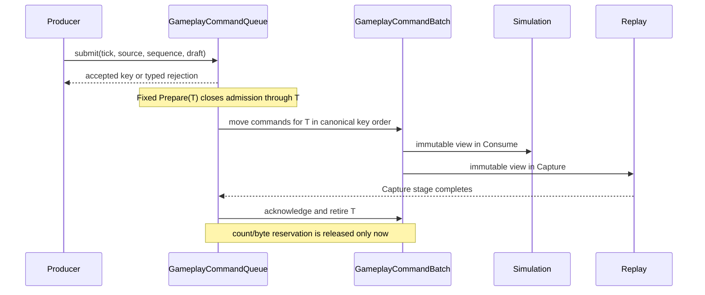

# ADR 0057: Authoritative Fixed-Tick and Command Ingress

**Status**: Accepted
**Date**: 2026-07-10
**Last Revised**: 2026-07-16
**Refines**: ADR 0023: Event, Message, and Command Model; ADR 0024: Determinism,
Fixed Update, and Replay Policy; ADR 0036: Event, Message, and Resource Queue Lifetime;
ADR 0039: Main Loop, Time Domains, Pause, and Runtime State; ADR 0056: Headless Runtime
and Dedicated Server Readiness
**Refined By**: ADR 0076: Play Runtime Debug Control and Observation

## Context

The first gameplay command bridge stores commands in one frame-scoped `Vec`. Local actions append
during `PreUpdate`, every fixed iteration reads the same vector, and `CoreStage::Last` clears it.
Consequently, a frame with no fixed step loses accepted intent, while a frame with multiple fixed
steps exposes the same command repeatedly. Arrival-assigned saturating sequence numbers, optional
fixed ticks, unbounded payloads, and live queue serialization also prevent a truthful replay or
server-authoritative contract.

Bevy and Godot both provide useful zero-to-many fixed-step schedule boundaries, but neither engine's
ordinary message/input channel supplies nara's required tick admission, producer sequence,
deduplication, byte budget, or acknowledgement semantics. This decision therefore defines a
domain-owned command ingress rather than adopting a generic event buffer.

## Decision

nara separates command construction, submission, admission, observation, capture, and retirement.
The authoritative key is:

```text
(non-zero authoritative tick, canonical source, non-zero source sequence)
```

Source sequence uniqueness is required within `(tick, source)`. A producer may use a stream-global
monotonic sequence, and the local action bridge does so, but reuse on another tick is valid. A
duplicate is the complete key; the first accepted command wins and is never replaced, evicted, or
coalesced.



### Values and durable shape

- `GameplayCommandDraft` contains command type, optional stable target vocabulary, and payload.
- `GameplayCommandSubmission` adds authoritative tick, `GameplayCommandIngressSource`, and source
  sequence. It is the validated public ingress and deserialization shape. The ingress source type
  intentionally excludes `LocalAction`; only the engine-owned action mapper can allocate that
  reserved source stream.
- `GameplayCommandEnvelope` is created only by admission. Its fields are immutable through public
  APIs and it is serializable for replay capture.
- Runtime `GameplayCommandQueue` and `GameplayCommandBatch` state is not serializable.
- `GameplayCommandTime`, frame provenance, optional/zero ticks, arrival sequence, and runtime
  `Entity` values are not part of the command contract.

Sources are producer streams, not action names or security principals. The canonical order is an
explicit rank followed by the validated UTF-8 source ID: local action, test driver, replay stream,
AI driver, then external producer. `LocalAction` is one reserved stream; its source sequence
preserves the already deterministic action/binding iteration order. Adding or reordering source
kinds requires an ADR update rather than relying on Rust enum declaration order.

Serde validation is the semantic inner boundary, not an allocation firewall. A file, replay,
network, package, or other untrusted adapter must enforce the encoded byte, nesting-depth, and
container-count budgets from ADR 0049 before deserializing a submission. It must not feed an
unbounded reader directly into serde and rely on post-allocation string/value validation.

Caller-supplied source labels do not prove authentication or authorization. A future networking
adapter must bind an authenticated peer/session to a host-issued source before submission.

Targets are structurally validated and bounded at U4. Scene-instance selection, world existence,
lookup authority, unload, and tombstone behavior remain owned by the runtime identity work in U8.
`nara_gameplay` does not depend on `nara_scene` and does not convert durable targets into runtime
`Entity` values.

### Tick state machine and terminal failure

While healthy, the queue maintains two monotonic watermarks and at most one active batch:

```text
acknowledged_through <= closed_through <= acknowledged_through + 1
active batch exists iff closed_through == acknowledged_through + 1
pending command ticks are strictly greater than closed_through
```

At `FixedUpdateSet::Prepare` for tick `T`, admission first advances `closed_through` to `T`, then
moves exactly the `T` bucket into the active batch. Closing first is essential: a submission made
during simulation or capture for `T` is late rather than becoming an orphaned pending command.

The public fixed sets are ordered as follows:

```text
PreUpdate: ResolveActions -> MapLocalActions (target closed_through + 1)
Fixed Prepare: Admit
Fixed Simulate: Consume
Fixed Finalize: Capture -> Acknowledge
Update / Last: no gameplay command cleanup
```

Every accepted key enters at most one active batch and is retired once after Capture for a
successfully completed tick. Multiple read-only systems may observe that batch. This is not a
claim of one business handler, durable crash recovery, or transactional exactly-once execution
across a process failure.

An empty healthy tick still has an active `GameplayCommandBatch` for `T`; therefore `Consume` and
`Capture` run once for every authoritative fixed tick, including ticks with no commands.

Any command lifecycle invariant failure is terminal for that runtime instance. The queue records
the first fault as sticky state, rejects later submissions with `LifecycleFaulted`, and rejects
later admission/acknowledgement with `Poisoned`. If a batch was visible when the fault occurred, its
commands move into queue-owned quarantine and the public batch becomes inactive before any later
consumer can observe it. `Consume` and `Capture` are gated on a current healthy batch, so they do
not execute after admission failure or against a stale batch. Pending and quarantined commands stay
retained and budgeted; there is no in-place recovery or acknowledgement path. The owning runtime
must be discarded and rebuilt from a known-good boundary.

`GameplayCommandPlugin` bridges engine-owned action-mapping loss and Admit/Acknowledge lifecycle
failure into the current App-owned `RuntimeFaultReporter` before a managed frame or exact step can
report success. The first such fault is sticky for that runtime generation. Malformed, late,
duplicate, over-budget, future-horizon, or other policy-rejected external submissions remain typed
producer rejections and do not fault an otherwise healthy runtime.

### Bounds, validation, and overload

`nara_gameplay` owns immutable queue limits using the unit-safe scalar types from `nara_core`.
Defaults are finite and constructors reject settings above domain hard ceilings:

| Limit | Default | Hard ceiling |
|---|---:|---:|
| Action-command bindings | 4,096 | 4,096 |
| Retained commands | 4,096 | 65,536 |
| Retained logical bytes | 4 MiB | 64 MiB |
| One command | 64 KiB | 512 KiB |
| Payload fields | 64 | 256 |
| Payload logical bytes | 32 KiB | 256 KiB |
| Payload key | 256 bytes | 256 bytes |
| Payload string | 128 KiB | 128 KiB |
| Future tick horizon | 600 | 1,000,000 |

Healthy live usage includes pending commands plus the active batch. Poisoned live usage includes
pending commands plus quarantine. Moving a command into the batch does not release capacity;
acknowledgement is the only normal retirement boundary, and poison deliberately keeps reservations
until the runtime is disposed. All size arithmetic, tick increments, and sequence increments use
checked operations. Saturation is permitted only for observation counters.

Logical bytes are a deterministic admission weight, not allocator resident memory or serialized
length. They comprise fixed one-byte variant tags, eight-byte integer/float/tick/sequence scalars,
one byte for booleans, and UTF-8 lengths for command/source/target IDs, payload keys, and payload
strings. Item limits separately bound container/node overhead.

For a healthy queue, submission rejection precedence is stable:

1. structural, finite-value, and per-command validation;
2. late tick;
3. future horizon;
4. duplicate key;
5. live item capacity;
6. live byte capacity.

A poisoned queue is the only precedence exception: it returns `LifecycleFaulted` before inspecting
new input because that runtime can no longer admit authoritative work.

Validation and checked candidate accounting complete before queue content, watermarks, retained
usage, or the local sequence allocator changes. A rejection may increment bounded statistics but
does not partially retain the command. NaN and positive/negative infinity are rejected before
retention. Overload rejects the newest submission; it never silently drops an older authoritative
intent.

Canonical delivery order is deterministic for an accepted set. Under overload, which concurrently
submitted command reaches the queue first remains scheduler/adapter dependent. Deterministic replay
must capture accepted/rejected outcomes, while transports that require deterministic arbitration
must collect and sort a bounded batch before calling ingress.

### Channel lifetime contract

| Resource | Producer | Consumer | Retention and cleanup | Replay/diagnostic role |
|---|---|---|---|---|
| `GameplayCommandQueue` | Engine-owned local action mapper and explicit test/replay/AI/external adapters | `Admit` system | Accepted intent remains until its target tick is acknowledged; overload rejects rather than evicts; terminal poison retains pending plus quarantined work until runtime disposal | Typed rejection, lifecycle-fault, quarantine, and numeric stats are the U4 observation surface; U31 bridges them to runtime diagnostics/pressure |
| `GameplayCommandBatch` | `Admit` at fixed Prepare | Simulation in current-gated `Consume`, replay/debug taps in current-gated `Capture` | Exactly one healthy active tick, including an empty batch; engine-owned `Acknowledge` retires after Capture; poison hides and quarantines the batch | Canonical replay capture point; not a frame event and not read after fixed Finalize |

## Alternatives Considered

### Option A: Bounded ordered ingress plus one tick batch (Chosen)

**Pros**: Explicit tick closure, natural duplicate detection and stable ordering, bounded future
retention, one immutable simulation/replay view, and auditable acknowledgement.

**Cons**: More state and API surface than a frame event vector; producers must supply stable source
identity and sequence.

**Decision**: Chosen because it directly represents the authoritative lifecycle.

### Option B: Bevy messages with per-reader cursors

**Pros**: Existing ECS substrate, familiar readers, low implementation cost.

**Cons**: Retention is update-based, unread values may be dropped, readers acknowledge
independently, and there is no tick/source/sequence dedupe or byte budget.

**Decision**: Rejected for authoritative commands; messages remain suitable for ordinary
notifications with their own declared lifetime.

### Option C: Frame vector or arrival-ordered deque

**Pros**: Minimal code and preserves call arrival order.

**Cons**: Loses zero-tick intent, repeats across catch-up ticks unless ad hoc clearing is added,
cannot provide canonical cross-source order, and makes duplicate/future accounting expensive or
ambiguous.

**Decision**: Rejected and removed without a compatibility shim.

### Option D: One queue per source with a k-way merge

**Pros**: Natural per-source backpressure and sequence tracking.

**Cons**: Unbounded source lifecycle, substantially more fairness/budget state, and no current
transport requirement that justifies the complexity.

**Decision**: Deferred to a future transport adapter if a measured use case appears.

## Consequences

- Fixed gameplay consumers must join `GameplayCommandSet::Consume`; replay/debug taps join
  `GameplayCommandSet::Capture`. Both sets execute only while the batch belongs to the current
  healthy tick.
- `CoreStage::Last` no longer owns gameplay command cleanup.
- Public producers use `GameplayCommandIngressSource`; they cannot impersonate the reserved local
  action stream. `ActionCommandMap::bind` and `bind_action` are fallible at the binding limit.
- The local input bridge retains semantic commands across pause/zero-tick frames without extending
  the lifetime of raw input observations.
- Persistent prototype command JSON using frame/time fields must be rewritten to the canonical
  submission shape. No compatibility reader or cache rebuild is retained because nara is
  unreleased and no repository fixture uses the draft shape.
- U8 may replace the temporary scene/persistent target vocabulary with the world identity domain;
  U4 establishes no lookup dependency that would obstruct that change.
- U31 consumes typed rejection/stat snapshots but does not move diagnostic policy into gameplay.
- Managed exact stepping uses the same `Admit -> Consume -> Capture -> Acknowledge` sets and fault
  bridge as an ordinary fixed tick; it does not provide a second command lifecycle.

## Success Metrics

| Metric | Target | Measurement |
|---|---:|---|
| Zero-tick retention | One local action submitted before zero fixed steps appears once at the next authoritative tick | AE2 app test |
| Catch-up delivery | A command for tick 1 is absent from ticks 2 and 3 in the same frame | `nara_gameplay` fixed-stage tests |
| Deterministic order | Reversing arrival order for the same accepted key set produces identical batches | Pure queue and server replay tests |
| Bounded retention | Healthy pending plus active, or poisoned pending plus quarantine, never exceed configured limits; exact boundary accepts and boundary + 1 rejects | Queue limit and poison-quarantine tests |
| Invalid ingress | Zero tick/sequence, invalid IDs/targets, NaN/Inf, late, future, and duplicate submissions are rejected without partial retention | Constructor, serde, and queue tests |
| Lifecycle ownership | Capture observes a current healthy batch before Ack; a fault is sticky, quarantines active work, and gates consumers; no command cleanup system exists in `CoreStage::Last` | Schedule, poison, and stale-contract checks |
| Runtime fault bridge | Engine-owned mapping/Admit/Acknowledge failure faults the current generation before success, while producer-visible validation/policy rejection does not | Managed runtime integration tests |

## Risks and Mitigations

| Risk | Severity | Likelihood | Mitigation |
|---|---|---:|---|
| A client chooses a source ID to influence ordering | High | Medium | Treat source as a label, not authority; future authenticated adapters issue/bind it before ingress |
| Active or faulted commands escape the memory budget | High | Medium | Account pending plus active while healthy and pending plus quarantine after poison; release only at successful Ack or runtime disposal |
| A new source variant changes replay order | High | Low | Manual canonical rank with tests; require an ADR change for ordering changes |
| An external producer impersonates local input | High | Medium | Exclude `LocalAction` from the public ingress source type and reserve its sequence allocator for the engine mapper |
| Lifecycle failure exposes stale commands | High | Low | Sticky terminal poison, queue-owned quarantine, and current-batch run conditions fail closed; rebuild the runtime rather than recovering in place |
| Untrusted serde input allocates before semantic bounds reject it | High | Medium | Require ADR 0049 encoded byte/depth/count limits in every concrete file/replay/network adapter before deserialization |
| Ack runs before replay capture | High | Low | Chain `Capture -> Acknowledge` inside fixed Finalize and test both views |
| Scene-local target is mistaken for global runtime identity | High | Medium | Limit U4 to structural validation; U8 owns instance-aware lookup, unload, and tombstones |
| Exactly-once wording implies crash transactions | Medium | Medium | Scope the guarantee to one batch/retirement in a successfully completed tick |

## Open Questions

- A versioned replay file envelope, checksum, snapshot cadence, and crash recovery remain deferred
  to [OQ-018](../open-questions.md#oq-018-persistent-replay-artifact-and-checkpoint-policy).
- Cross-source fairness under sustained overload remains adapter policy; add a bounded sorted batch
  submission API only when a transport demonstrates the need.
