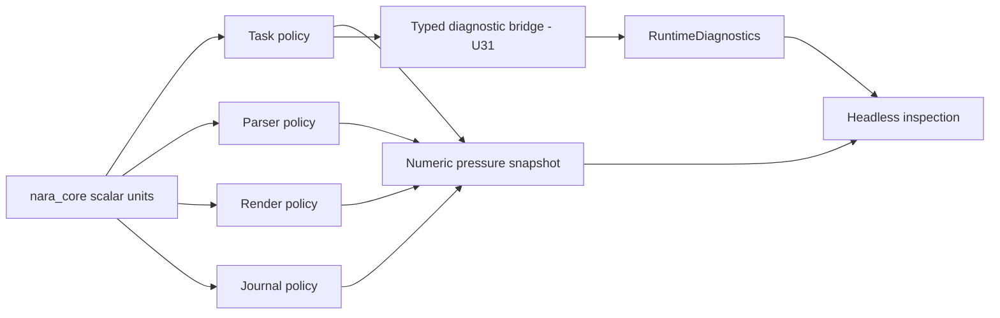

# ADR 0068: Global Resource Budgets, Metrics, and Diagnostic Privacy

**Status**: Accepted
**Date**: 2026-07-10
**Refines**: ADR 0009, ADR 0048, ADR 0049, ADR 0056

## Context

Engine domains need bounded work and observable overload, but their policies are not interchangeable.
A task queue rejects work, an untrusted parser stops decoding, a render uploader defers bytes, and a
recovery journal refuses an oversized transaction. Promoting those policies into one global budget
manager would erase important invariants. At the same time, diagnostics can become a second data leak
if producers forward runtime errors, credentials, user paths, or environment values as strings.

nara therefore needs shared unit vocabulary and headless observations without shared enforcement or
an unbounded free-text metrics channel.

## Decision

`nara_core` owns only unit-safe non-zero scalar limits such as `ItemLimit`, `ByteLimit`, `DepthLimit`,
and `TimeLimit`. Each producer domain owns its budget structure, admission policy, and overload
outcome. `nara_diagnostic` owns bounded privacy-safe diagnostic aggregation and independent numeric
pressure snapshots; it never enforces producer policy.

### Diagnostic identity and safe text

- Diagnostic code, domain, producer, field key, pressure source ID, and pressure metric ID are
  validated source-authored `&'static str` identities. Runtime text cannot enter those identities.
  Public identifiers are the separate dynamic exception: a bounded ASCII alphanumeric locator
  grammar with `_-./`, uppercase support, normalized slash segments, and explicit rejection of
  absolute paths, URLs, credential syntax, sensitive shapes, and oversized values. Identity is never
  truncated.
- `SafeSummary` and `SafeDisplayText` accept only validated `&'static str`; there is no constructor
  from owned or borrowed runtime text. This makes error display, environment values, and formatted
  paths ineligible by API shape.
- Configured summary/display truncation is deterministic at a UTF-8 scalar boundary and reports both
  truncated field count and removed byte count. If the first scalar does not fit, the retained value
  is the fixed safe non-empty `?` marker. An oversized project-relative field is dropped and counted
  instead of retaining a prefix that could change path meaning. A hard pre-publication cap prevents
  oversized static literals or project-relative fields from creating an unbounded draft first.

### Field classification

- `Public` fields contain a validated public identifier, integer, boolean, or validated static
  display text.
- `ProjectRelative` fields contain a lexically normalized relative path. Absolute Unix paths,
  Windows drive paths, UNC paths, device paths, parent traversal, backslashes, URL schemes, controls,
  Unicode bidi/format separators, sensitive-shaped values, and oversized values are rejected before
  allocation.
- `Sensitive` and `Secret` constructors accept no raw value. Storage contains only field key, class,
  and the fixed `[REDACTED]` marker: no raw data, digest, derived hash, or original length.
- No blanket `Error`, `Display`, debug, map, or string conversion exists. Producer bridges must lower
  typed data field by field.
- Constructor checks are defense in depth, not a claim that arbitrary high-entropy secrets can be
  recognized lexically. Trusted composition bridges remain responsible for choosing the correct
  class; U31 must exercise source-specific raw-value canaries.
- All stored data fields are private. Entries and snapshots implement serialization output only;
  they do not implement an unbounded deserialization input path.
- Local report severity remains sticky after rejection or eviction. Bounded report merge carries the
  source's logical accounting once, republishes retained entries under target limits, and adds only
  new target-side budget effects.

### Runtime publication, retention, and pressure

- `RuntimeDiagnosticDraft` is hard-bounded before publication.
  `RuntimeDiagnostics::publish(draft, frame)` applies configured field/text limits, explicit dedupe,
  sequence allocation, count/byte eviction, and saturating statistics atomically.
- Dedupe policy is `None`, `Code`, or `CodeAndFields`. Identity implicitly includes producer, domain,
  code, and severity. Field-aware identity also includes field class and concrete value variant so
  equal text in identifier, static display, and project-relative fields cannot collide.
  Sensitive/secret fields are excluded and the internal key is not serialized. Oversized entries
  are rejected before any dedupe lookup or retained-state mutation.
- Count/byte eviction and frame-window expiry are deterministic. Runtime diagnostics and pressure
  snapshots use sorted `(expires_at, identity)` indexes, replace the prior expiry key atomically on
  dedupe/source replacement, and pop only keys due at the retention watermark. Expiry is
  `last_frame + window + 1`; overflow means no `u64` watermark can reach that expiry. Diagnostic
  order tombstones compact only after they exceed live entries, so cleanup is amortized and order
  storage remains bounded. Manual retention disables expiry, not count/byte limits. Readers cannot
  arbitrarily clear retained data.
- `RuntimePressureSnapshots` is independent from diagnostics. A source publishes one atomic latest
  snapshot containing stable metric IDs, `Gauge` or `Counter`, `u64` values, and one of `Count`,
  `Items`, `Bytes`, `Depth`, `Nanoseconds`, or `Frames`.
- Pressure source and per-source measurement counts are bounded. A rejected replacement preserves
  the previous snapshot. Frame-window expiry and manual retention are typed and observable through
  saturating statistics.
- Pressure APIs expose no callbacks, commands, automatic throttling, or `should_reject` decision.
  They report what a domain already decided; they do not decide for it.
- `DiagnosticsPlugin` installs both resources and one named `CoreStage::First` retention system in
  headless/server-compatible form. Producers in the same stage must run after
  `DiagnosticCleanupSet::Retention`. The plugin installs neither a tracing subscriber nor a global
  panic hook.

### Non-goals

- No global budget manager, global admission policy, or cross-domain fairness algorithm.
- No free-text metric labels, floating-point measurements, histogram aggregation, alerting, or
  exporter protocol in the foundation core.
- No capture of raw errors, panic payloads, credentials, host paths, environment values, or secret
  fingerprints.
- No producer bridges in this unit. U31 owns asset, watcher, task, window, render, project, and editor
  lowering plus their source-specific privacy tests.
- No gameplay or deterministic replay decisions based on diagnostics or pressure snapshots.

## Alternatives Considered

### Option A: One global resource budget manager

**Pros**: One configuration surface and one apparent overload policy.

**Cons**: Task admission, parser termination, GPU deferral, and journal durability have different
atomicity and recovery invariants. A shared manager would either be shallow or own every domain.

**Decision**: Rejected until at least two domains demonstrate identical complete invariants.

### Option B: Free-text diagnostic events for metrics and pressure

**Pros**: Minimal API surface.

**Cons**: Loses numeric units and latest-value replacement, floods the event buffer, and invites
runtime strings and secrets into dedupe/logging.

**Decision**: Rejected.

### Option C: Domain policy plus shared scalar units and separate observations

**Pros**: Preserves deep domain ownership while giving headless tools consistent bounded data.

**Cons**: Each domain must explicitly publish both typed outcomes and numeric observations.

**Decision**: Chosen.

## Consequences

- `nara_diagnostic` directly depends on `nara_core` scalar limits but does not own a global budget
  policy.
- Producer migrations must replace dynamic messages with stable summaries and classified fields.
- Tooling can inspect pressure without parsing diagnostics or requiring tracing.
- U31 remains required before ADR 0048's named domain coverage is complete.
- Privacy failures are API-design failures, not sink configuration mistakes; tests cover Debug,
  serialization, tracing, and dedupe surfaces.

## Success Metrics

| Metric | Target | Measurement |
|---|---:|---|
| Identity integrity | Invalid/oversized identity fails without truncation | Constructor tests |
| Secret retention | Sensitive/secret raw values have no storage path | API review and canary tests |
| Bounded diagnostics | Draft, entry, field, text, count, and byte limits hold | Boundary tests |
| Deterministic retention | Count, byte, and frame expiry select the same oldest data | Unit tests |
| Atomic pressure | Rejected replacement preserves the prior source snapshot | Unit tests |
| Headless operation | Resources and cleanup work without UI/tracing/backend | App integration test |
| Domain coverage | Named producers publish classified bridges and metrics | U31 integration tests |

## Risks and Mitigations

| Risk | Severity | Likelihood | Mitigation |
|---|---|---:|---|
| Explicit classification slows migrations | Medium | High | Treat the friction as the privacy boundary; reuse stable field keys and typed helpers, not string shims. |
| Pressure snapshots are mistaken for policy | High | Medium | Keep APIs numeric and observational; prohibit policy callbacks and decision helpers. |
| Static summaries lose detail | Medium | Medium | Keep typed domain errors locally and publish stable identifiers for drill-down. |
| Per-domain budgets drift | Medium | Medium | Share scalar units now; promote a structure only after two domains prove identical invariants. |
| Frame-window cleanup is not installed or ordered first | Medium | Low | `DiagnosticsPlugin` owns both resources and the named `First` retention set; integration tests exercise an explicitly ordered producer. |
