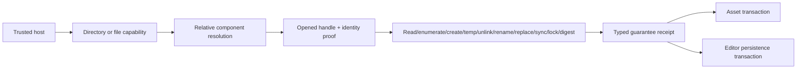

# ADR 0070: Capability-Oriented Filesystem Substrate

**Status**: Accepted
**Date**: 2026-07-10
**Refines**: [ADR 0035](0035-project-manifest-and-runtime-settings-authority.md),
[ADR 0049](0049-untrusted-project-input-and-parse-budget-policy.md),
[ADR 0050](0050-asset-root-symlink-junction-and-package-trust-policy.md)
**Refined By**: ADR 0079: Root Product Capabilities and Placeholder Domain Retirement

## Context

Assets, editor saves, recovery journals, import caches, and future exports need the same small set of
host filesystem primitives. Duplicating path containment, temporary-file, replacement, sync, lock,
and digest algorithms in each domain would reproduce security races and make durability claims
inconsistent.

A shared crate must not become a global virtual filesystem or own asset/editor transactions. It also
cannot promise one portable strength: Windows, Linux, macOS, BSD, network filesystems, and custom
mounts expose different identity, relative-open, replacement, and directory-sync guarantees.

## Decision

nara introduces `nara_fs`, a low-level platform adapter for capability-bound primitives. Domain
crates retain transaction state, retry policy, budgets, diagnostics, and publication semantics.

### Authority and path model

- A host issues opaque directory or file capabilities. Project content cannot construct, widen,
  serialize, or recover ambient authority from them.
- Relative inputs are non-empty validated components. Absolute paths, prefixes, `.`, `..`, empty
  components, embedded separators, and platform aliases are rejected before platform access.
- Capability methods return opened handles, identities, or typed receipts. No method returns a raw
  path carrying an authorization claim.
- Strict operations use handle-relative resolution with no-follow/reparse and beneath-root
  constraints. If the platform adapter cannot prove a required constraint, it returns
  `Unsupported` or `Unproven`; it never falls back to canonicalize-and-open.
- Adapter-wide capability matrices are conservative. Proof that depends on a concrete root handle,
  runtime kernel, sandbox, volume, or filesystem is stored on the issued capability and exposed by
  `DirectoryCapability::resolution_tier`; a compile-target check alone cannot report it as proven.
- `Unsupported` means the adapter, platform, or filesystem explicitly lacks the required primitive.
  `Unproven` means the primitive may exist, but sufficient evidence was unavailable for this object
  or runtime environment. Both fail closed for strict operations.

### Independent guarantee axes

One broad "safe" flag is forbidden. Results report independent guarantees:

| Axis | Required vocabulary |
|---|---|
| Resolution | `HandleBound`, `OpenedHandleOnly`, `CooperativeTrusted`, `Unsupported`, `Unproven` |
| Identity | live-handle/session object identity, capability generation, link count, object kind, and proof availability |
| Replacement parent authorization | `HandleBound`, `CooperativeTrusted`, `Unsupported`, `Unproven` |
| Replacement source binding | `HandleBound`, `NameBound`, `Unsupported` |
| Publication atomicity | `AtomicNameSwitch`, `NonAtomic`, `Unsupported`, `Unproven` |
| Conflict protection | `StrongCompareAndSwap`, `CooperativeLocked`, `DetectOnly`, `None`, `Unsupported`, `Unproven` |
| Durability progress | `DataSynced`, `FileMetadataSynced`, `NamePublished`, and `ParentDirectorySynced`, each achieved, unsupported, or unknown |
| Locking | advisory/cooperative or platform-enforced, with process scope and release ownership explicit |

These axes are independent. A handle-relative `renameat` may have handle-bound parent authorization
and atomic name publication while providing only detect-only conflict protection. Detect-only may
observe a stale expected identity before or after replacement, but it must not claim that it
atomically prevented overwriting a concurrent writer. Ordinary POSIX `renameat` plus a pre-check is
not compare-and-swap. Advisory locks provide cooperative protection only when all nara writers use
the same protocol. Durability receipts report completed OS-visible stages; they do not claim that
physical media has persisted data the operating system reported as synced.

### Strict untrusted/recovery policy

- Open only regular files with a single link and directories needed for handle traversal.
- Reject symbolic links, junctions, magic links, and all reparse points by default. A reparse tag is
  accepted only after a tag-specific policy and adversarial tests prove that it cannot redirect,
  virtualize, or fetch content outside the capability contract. Unsupported network-volume identity
  and device/volume/mount transitions that cannot be proved absent also fail closed.
- Starting from the root capability, open each component handle-relative, validate the declared
  traversal constraints, and record scoped identity evidence for each opened object. The returned
  leaf handle is the access object; callers never reopen by name.
- Treat object identity as scoped to the live handle/session and capability generation. Native file
  IDs or inode values may be reused after deletion/close and must not become persistent trust IDs.
- Exclusive temporary creation occurs in the verified target directory and returns a handle.
- Cleanup must be bound to that same temporary handle. Unix has no portable unlink-by-handle
  primitive, so the foundation never emulates it with `stat(name)` followed by `unlink(name)`: explicit discard
  reports `Unsupported`, drop closes the handle, and the name remains a recoverable orphan. A later
  bounded recovery workflow may remove it only through a primitive whose guarantee is explicit.
- Streaming digest reads are bounded by the calling domain and compare length and digest without
  publishing partial output.
- Handle-bound authorization is not a content snapshot. A caller requiring immutable input verifies
  an expected digest during the read or copies into an engine-owned immutable candidate before use.

### Platform evidence matrix

- **Windows reference contract:** Windows 10 version 1809 or later, or the corresponding Windows
  Server 2019 or later API baseline, on x86-64 using local NTFS or ReFS volumes. Strict traversal
  uses `NtCreateFile` relative to a directory handle with
  `FILE_OPEN_REPARSE_POINT`; every reparse tag is rejected, including symbolic links and junctions.
  Live identity requires `FILE_ID_INFO`, `FILE_STANDARD_INFO`, attribute-tag inspection, absence of
  `FILE_REMOTE_DEVICE`, and an NTFS/ReFS filesystem name. Remote redirectors, local custom
  filesystems, missing identity queries, multi-link regular files, and cross-volume transitions are
  `Unproven`, never strict. Replacement uses `NtSetInformationFile` with
  `FileRenameInformationEx`; success binds the candidate handle and parent handle, while directory
  synchronization remains `Unsupported`. Older Windows releases are outside the supported matrix
  and a failed native replacement never produces a receipt. The default unprivileged gate injects
  symbolic-link, mount-point, and unknown reparse-tag facts at the platform seam and exercises the
  public capability-open validation chain. Live symlink and junction integration cases remain
  explicit privileged tests and must be run by the corresponding Windows job rather than silently
  skipped or treated as default-gate evidence.
- **Linux reference contract:** Linux kernel 5.6 or later on x86-64. The adapter-wide matrix reports
  strict resolution as `Unproven`; each root capability probes `openat2` with beneath-root,
  no-magic-link, no-symlink, and no-cross-device flags before strict authority is issued. `ENOSYS`,
  `EINVAL`, or `EOPNOTSUPP` is `Unsupported`; a runtime policy that returns `EPERM` is `Unproven`.
  Strict live identity is currently limited to local ext, XFS, Btrfs, tmpfs, OverlayFS, and NTFS3
  filesystem types. Other, remote, or custom filesystem types fail closed. `st_dev` is only a
  cross-check and never substitutes for `openat2` mount evidence. The currently implemented generic
  Unix replacement remains `NameBound`, so strict replacement is rejected until RGF-U27 adds and
  proves its narrower dedicated no-replace primitive; that primitive does not upgrade the generic
  replacement tier.
- **RGF-U27 project-creation publication contract:** The first publicly supported
  same-capability directory no-replace implementation is narrower than the general reference
  matrices above: x86-64 Windows on a probed local NTFS workspace and x86-64 Linux 5.6 or later on a
  probed local ext4 workspace. Windows
  uses the handle-bound `FileRenameInformationEx` no-replace form against the live parent handle;
  Linux uses `renameat2` with `RENAME_NOREPLACE` against the same live parent directory descriptor.
  Both bind the unpredictable sibling staging directory, validated absent child name, parent
  capability generation/identity, and same-volume or same-mount proof into a typed publication
  receipt. Collision, identity drift, unsupported filesystem behavior, or any native result that
  cannot prove atomic no-replace publication returns `Unsupported` or `Unproven`; neither adapter
  falls back to a destination precheck followed by ordinary rename. Hosted Windows and Linux jobs
  must prove those two exact combinations before the project-creation candidate is documented as
  available. ReFS, XFS, Btrfs, tmpfs, OverlayFS, NTFS3, macOS, and other combinations remain
  `Unsupported` or `Unproven` for project creation until a dedicated live job supplies equivalent
  evidence; injected platform-seam tests alone do not broaden public support.
- **macOS and other Unix contract:** no current adapter proves absence of same-device mount
  traversal. Strict untrusted/recovery directory capabilities therefore return `Unproven`.
  Host-selected trusted mode may use no-follow `openat` and name-bound `renameat`, but receipts keep
  those weaker tiers explicit.
- **Other targets:** native filesystem authority is `Unsupported`; compiling the crate does not
  create a permissive path fallback.
- Directory flush support varies. Receipts report which data, file-metadata, name-publication, and
  parent-directory-sync stages completed, were unsupported, or remain unknown; callers do not infer
  directory durability from file flush success.

### Implemented foundation and downstream ownership

The implemented foundation supplies the shared authority substrate required to start downstream work: host-handle import,
validated relative components, capability-specific resolution evidence, live identity, exclusive
same-directory temporary creation, truthful replacement tiers, file/directory sync reporting,
locking, positional reads, and bounded digest verification. Windows handle-bound temporary discard
is included; Unix discard deliberately leaves a recoverable orphan rather than risking deletion of
the wrong name.

Three reserved public operations remain explicitly `Unsupported` and are not counted as implemented
foundation capability:

| Reserved primitive | First owning unit | Completion rule |
|---|---|---|
| Handle-bound directory enumeration | A concrete asset/indexing host | Implement platform enumeration and return name plus scoped observation from `nara_fs`; `nara_asset` must not enumerate ambient paths. |
| Same-capability non-overwrite rename | RGF-U27 first-party project creation | Add the Windows/Linux platform primitives and a typed source/parent/conflict publication receipt in `nara_fs`; project creation owns staging and validation policy, while later asset rename workflows reuse the primitive. |
| Relative identity-guarded unlink and orphan reclamation | Proposed ADR 0091 persistence/recovery | Add a platform-specific exact-object or explicitly weaker recovery primitive in `nara_fs`; editor persistence/recovery must not reproduce `stat + unlink`. |

This deferral does not treat static `Unsupported` values as successful evidence. RGF-U3 is the
first production consumer of bounded host-issued file authority for `nara.toml`. RGF-U12 reuses the
same root/open/identity boundary for the startup content closure. RGF-U27 owns the first bounded
same-capability no-replace directory-publication consumer and must extend this shared primitive
before accepting a generated project destination. Future indexing, asset rename, and ADR 0091
persistence/recovery work reuse or extend the primitives here; downstream domain crates are
prohibited from copying those platform algorithms.

## Alternatives Considered

### Option A: Keep platform code in each domain

**Pros**: Each domain can optimize its immediate workflow.

**Cons**: Security and durability algorithms drift, and fixes must be repeated across asset, editor,
cache, and export code.

**Decision**: Rejected.

### Option B: Adopt a portable capability crate as complete proof

**Pros**: Smaller local implementation and ergonomic ambient-authority isolation.

**Cons**: A portable facade alone cannot prove Windows reparse chains, same-device mounts,
replacement compare-and-swap, or directory durability for nara's strict policy.

**Decision**: Rejected as the proof authority; a dependency may assist implementation behind
`nara_fs` if each guarantee remains independently verified.

### Option C: Narrow platform adapter with explicit guarantee tiers (Chosen)

**Pros**: Centralizes dangerous primitives, exposes honest platform evidence, and lets domains build
transactions without duplicating native algorithms.

**Cons**: Some host/filesystem combinations must fail closed, and native integration tests are
required.

**Decision**: Chosen.

## Consequences

- `nara_fs` is the only shared owner of native relative open, identity, directory enumeration,
  temporary creation, relative unlink, same-capability rename/non-overwrite rename, replacement,
  sync, lock, and digest primitives. Directory entries pair relative names with scoped object
  observations; they are not ambient paths or durable identities.
- `nara_asset`, `nara_tooling_fs`, and future export code own their workflows but must not duplicate a
  platform algorithm already provided by `nara_fs`.
- Platform support is a matrix of proven capabilities, not a binary crate-compiles claim.
- A host may import an already-opened file into an `OpenedHandleOnly` capability when strict child
  resolution is unavailable; that grants access only to that object, not its siblings or parent.
- Tests must distinguish strict security evidence from trusted/cooperative functionality.

## Success Metrics

| Metric | Target | Measurement |
|---|---:|---|
| Ambient authority | Domain APIs cannot construct capabilities from unchecked paths | Compile/API tests |
| Honest support | Missing proof returns `Unsupported`/`Unproven` with no permissive fallback | Negative platform tests |
| Race resistance | Root/intermediate/leaf replacement cannot escape a handle-bound operation | Adversarial integration tests |
| Shared primitives | Asset and editor adapters reuse `nara_fs` without moving domain policy into it | Dependency review |
| Receipt truth | Replacement and durability receipts never overstate platform guarantees | Failure-injection tests |

## Risks and Mitigations

| Risk | Severity | Likelihood | Mitigation |
|---|---|---:|---|
| Native APIs are unstable or incompletely wrapped | High | Medium | Keep unsafe/native code isolated, test supported OS/filesystem pairs, and return unsupported elsewhere. |
| Capability API becomes a general VFS | Medium | Medium | Expose primitives and evidence only; keep source lookup and transactions in domain crates. |
| Cooperative lock is mistaken for exclusion | High | Medium | Encode the locking and replacement guarantee in types and receipts. |
| Directory sync differs by filesystem | Medium | High | Report the observed durability tier and let persistence policy decide whether it is sufficient. |
| Strict mode rejects developer setups | Medium | Medium | Permit host-selected trusted tiers without changing strict package/recovery defaults. |

## Revisit Triggers

- A macOS/BSD host broker or native mount-identity primitive can prove strict no-mount traversal.
- A supported Unix platform gains a practical unlink-by-handle primitive, or nara adopts unnamed
  temporary files plus handle-bound publication for that platform.
- Supporting a Windows filesystem beyond local NTFS/ReFS gains identity, reparse, replacement, and
  failure-injection evidence equivalent to the reference contract above.
