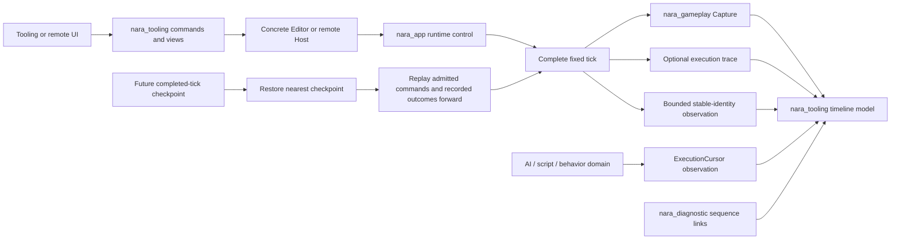

# ADR 0076: Play Runtime Debug Control and Observation

**Status**: Accepted
**Date**: 2026-07-11
**Last Revised**: 2026-07-14
**Refines**: [ADR 0024](0024-determinism-fixed-update-and-replay-policy.md),
[ADR 0034](0034-editor-play-mode-world-boundary.md),
[ADR 0039](0039-main-loop-time-pause-and-runtime-state.md),
[ADR 0042](0042-runtime-service-and-backend-boundary.md),
[ADR 0057](0057-authoritative-fixed-tick-and-command-ingress.md), and
[ADR 0058](0058-stable-runtime-identity-and-entity-references.md)
**Proposed Refinement Under Evaluation**: ADR 0082 and ADR 0084 jointly propose concrete Host-owned
runtime/start-attempt authority; that owner split and its state names are not current authority while
either ADR remains Proposed.

## Context

nara already has several foundations for a high-quality runtime debugging experience:

- explicit real, virtual, fixed, and render-interpolation time domains;
- a monotonic authoritative fixed tick with `Prepare`, `Simulate`, and `Finalize` boundaries;
- admitted gameplay commands that remain visible through `Consume` and `Capture` before engine-owned
  acknowledgement;
- isolated Play Mode world creation, stable scene authoring IDs, reflected component schemas,
  structured diagnostics, and bounded background work;
- a planned RGF-U5 runtime host whose paused single-step contract is exactly one complete fixed tick.

The legacy U8 identity slice removed allocator-local entity observations: `ScenePlaySession` now retains a
stable scene-instance handle and tooling captures a bounded `WorldIdentitySnapshot`. The Play
session still owns a bare `World` rather than a scheduled, closeable `App`, and the identity-only
snapshot intentionally contains no component payload. There is no stable system execution trace,
component-state diff, checkpoint contract, or domain-neutral representation of an interpreted
AI/script instruction cursor.

These gaps can easily produce misleading APIs. A Rust ECS entity has no intrinsic "current source
line". A Bevy schedule node is not a durable system identity. A component diff observed after a
system does not prove which command caused it. A reverse-looking debugger can be implemented by
restoring an earlier checkpoint and replaying forward without supporting reverse machine execution.
The architecture must preserve those distinctions.

## Evidence and Prior Art

- The [7 Billion Humans product page](https://tomorrowcorporation.com/7billionhumans) describes one
  explicit language executed by many workers. The
  [official gameplay image](https://shared.akamai.steamstatic.com/store_item_assets/steam/apps/792100/ss_a9863d36d08c6022ba9efcf77ebeba1bf66a0fb6.1920x1080.jpg)
  shows stop/pause/step-style controls, speed control, worker markers beside numbered instructions,
  and synchronized world state. These materials do not establish source breakpoints, reverse
  execution, or historical restoration.
- The [2025 Jai demonstration at 10:47](https://www.youtube.com/watch?v=IdpD5QIVOKQ&t=647s)
  reports an approximately 2.3-second full build of an approximately 300,000-line game on the
  demonstrated machine. At [17:40](https://www.youtube.com/watch?v=IdpD5QIVOKQ&t=1060s), the speaker
  explicitly distinguishes it from incremental compilation and calls it a clean rebuild. This is
  strong evidence for low-friction full-build iteration, not for replacing machine code inside a
  running process or automatically migrating runtime state.
- Bevy's `Stepping` implementation in
  `repo-ref/bevy/crates/bevy_ecs/src/schedule/stepping.rs` computes a per-run skip set around one
  schedule cursor. Skipped nodes are treated as completed by the executors, independent systems can
  cross an intuitive breakpoint under multithreaded execution, and repeated fixed-schedule runs in
  one render frame do not mean "one complete fixed tick". It is useful prior art, not nara's product
  contract.
- Godot separates scene-tree pause, game-view next-frame, script-VM line stepping, remote scene
  observation, resource reload, and native extension reload. In particular,
  `repo-ref/godot/scene/debugger/scene_debugger.cpp` steps a rendered frame, while
  `repo-ref/godot/modules/gdscript/gdscript_vm.cpp` can step source lines because GDScript owns an
  explicit VM instruction stream.

## Decision

nara adopts a layered Play-runtime debugging contract. Complete fixed-tick control, execution
observation, domain instruction cursors, historical recovery, and native code iteration are related
user experiences but remain separate engine capabilities.

The Host node in the following diagram is the proposed ADR 0082/0084 owner. The accepted debugging
layers do not depend on that proposal being current authority.

### Runtime control

`nara_app` owns the accepted execution semantics. The current implementation keeps the local Play
controller in `nara_tooling`. Under the joint ADR 0082/0084 proposal, a concrete
Editor/headless/remote Host would instead own the live runtime and any unpublished start attempt,
while `nara_tooling` would own UI-neutral lifecycle commands, views, observation policy, and
projections. Tooling data would contain no `RuntimeInstance`, start-attempt owner, native lease, or
process handle. RGF-U17 must prove this split before it can replace the current authority.

The stable semantic operations are:

- **Pause** is an app-frame time policy, not a freeze of every clock field or of the `World`. On a
  successful paused frame, `RealTime` advances from the runner-supplied delta; `VirtualTime` has
  zero delta and unchanged elapsed time while its frame counter advances; no fixed tick runs; and
  existing fixed pending time, whole-tick debt, and sub-tick remainder remain unchanged. Declared
  non-fixed stages, real-time polling, diagnostics, tooling communication, backend health, and
  shutdown work continue under their explicit pause policies.
- **Resume** returns the host to normal elapsed-time planning.
- **Set time scale** changes simulation pacing through the existing validated virtual-time policy.
  It is distinct from a future replay-view scrub or playback rate.
- **Step fixed tick** is legal only from a stable paused state and uses a dedicated exact-step frame
  plan rather than temporary resume or ordinary elapsed-time catch-up. For fixed timestep `H`,
  `RealTime` advances from the actual runner delta, `VirtualTime` advances by exactly `H` as an
  explicit step override, and `FixedTime` advances one tick and `H` elapsed time. The plan injects
  and consumes the same `H`, so pre-existing pending time, whole-tick debt, and remainder are
  unchanged; render interpolation remains unchanged. Time scale, maximum real delta, per-frame
  fixed-step caps, debt limits, and discard policy cannot change the step count or discard retained
  debt. The operation runs the complete fixed `Prepare -> Simulate -> Finalize` transaction,
  includes gameplay command `Admit -> Consume -> Capture -> Acknowledge`, rotates trackers at the
  declared app boundary exactly once, preserves the configured paused/time-scale state, and
  returns to paused.
- **Stop** requests finite service shutdown and runtime disposal. A host reports clean completion
  only after its bounded close contract succeeds. Under ADR 0084's proposed state vocabulary,
  timeout or shutdown failure remains `Stopping` or `CloseIncomplete` rather than pretending that
  the runtime reached `Stopped`.

Control commands take effect only at nara-owned main-thread safe points. The first product slice
does not pause inside an executing Rust system and does not expose render-frame stepping as fixed
simulation stepping.

As an ADR 0084 evidence target, RGF-U5 keeps unpublished start-attempt states separate from
published runtime states. A proposed start attempt owns `Starting`, `Retiring`, and
`RetirementIncomplete`; only success yields a `RuntimeInstance`. The proposed published runtime
owns `Running`, `Paused`, `Stepping`, `Faulted`, `Stopping`, `CloseIncomplete`, and `Stopped`.
These names do not become current authority until joint ADR 0082/0084 acceptance.

Runtime Inspector edits use generation-stamped, schema-gated safe-point commands. The first form is
a one-shot runtime component patch whose value may be overwritten by later simulation; it is not a
retained "override" layer. Persistent write-back remains ADR 0034's explicit Apply Changes flow:
under the proposed owner split, the Host requests a bounded scene/edit-capable export at a safe
point; the current local controller performs the equivalent export directly. In either topology,
tooling derives a candidate `ScenePatchDocument`, and normal revision validation and undo apply it
to the edit document. No UI or tooling model receives unrestricted `World` access.

### Observation snapshots and timelines

`nara_tooling` owns bounded, UI-agnostic observation and timeline models. `nara_reflect` supplies
schema metadata and component encoding; it does not own history, sampling cadence, or debugger UI.

The allocator-local `WorldSnapshot { entities: Vec<Entity> }` has been deleted rather than
preserved behind a compatibility layer. The initial replacement is
`WorldIdentitySnapshot`: it records an optional world-domain ID, a hard locator limit, semantically
sorted `WorldEntityLocator` values, total and identified entity counts, runtime-only count-only
entities, and explicit returned/omitted locator counts. Dual scene and persistent axes do not
double-count an entity. A moved identity domain or stale registration fails capture rather than
publishing an ambiguous snapshot. RGF-U1 adds local Inspector filtering through schema `inspect`
eligibility, but a general component-observation payload and host disclosure policy remain a later
evidence-driven slice.

The observation model follows these rules:

- Every detailed entity observation uses the legacy U8 world/runtime stable identity vocabulary. A
  runtime-only/internal entity without a stable observation locator is omitted or represented by
  aggregate counts; the identity domain may instead define a world-scoped non-persistent locator. It must not be
  assigned a persistent identity merely for tooling. Runtime `Entity`, Bevy `NodeId`, backend
  handles, and process pointers never enter snapshot, diff, breakpoint, replay, or remote-tooling
  records.
- A snapshot identifies the Play-host generation and the latest fully completed authoritative fixed
  tick. An in-progress system-step session, if one is added later, is not a completed-tick snapshot.
- Component observation is schema-aware and capability-gated. `Inspect` eligibility is necessary
  but does not authorize remote disclosure, logging, or persistent capture. The host observation
  profile applies an independent allowlist/redaction policy before encoding. `nara_reflect` codecs
  remain the value authority; tooling cannot serialize arbitrary Rust memory.
- Count, byte, depth, per-value, and retention budgets are mandatory. Truncation, rejection, and
  dropped-history counts are explicit observation data.
- Sensitive values follow ADR 0048/0068 classification. A failure observation links to a bounded
  diagnostic sequence/identity instead of embedding arbitrary error strings or secrets.
- Diffs are derived between compatible snapshots with the same host/topology/schema generations.
  A generation mismatch invalidates the diff instead of silently comparing unrelated identities.

The first useful timeline is `admitted commands -> completed fixed tick -> observed component
changes and diagnostics`. It is correlation unless a domain explicitly records consumption or
production evidence. System access metadata describes potential access, not actual causality.
Tooling must label unproven relationships as "observed during" or "correlated with", never "caused
by".

High-frequency execution trace storage is separate from `RuntimeDiagnostics`. The diagnostics bus
reports debugger faults, truncation, pressure, and linked failures; it is not a component-payload or
per-system event log.

### System stepping and breakpoints

Exact fixed-tick stepping is the initial product contract. System stepping and schedule breakpoints
are a later debug-executor capability and must not be aliases for Bevy's public `Stepping` resource.

Before nara exposes system stepping, a separate ADR must define:

- nara-owned system identity and topology generations instead of persistent Bevy `NodeId` or Rust
  `TypeId` values;
- actual outcomes such as `Attempted`, `Ran`, `ConditionSkipped`, and `Failed`;
- a strict execution mode that prevents independent parallel systems from crossing a breakpoint;
- an explicit open-tick transaction that atomically advances/publishes the new fixed tick before
  its first system, then cannot advance to another tick, acknowledge its command batch, publish a
  completed checkpoint, or clear final trackers until the whole fixed tick completes or the Play
  host is discarded.

Conditional breakpoints may initially target stable tick, command, entity, diagnostic, or domain
cursor predicates. Arbitrary Rust closures are not serializable breakpoint identities.

### Domain execution cursors

The engine cannot infer a per-entity program counter from ordinary Rust ECS systems. AI, scripting,
behavior-tree, animation-state-machine, quest, and similar interpreter domains may publish an
optional `ExecutionCursor` observation protocol.

The protocol is semantic rather than source-line based and contains, at minimum:

- the U8 stable subject identity;
- a stable domain/program or behavior ID plus program generation;
- an opaque stable instruction/node/state ID;
- an execution state such as running, blocked, completed, or failed;
- an optional bounded, inspect-capable held/local-data projection;
- an optional source-map reference for UI line/node highlighting;
- an optional structured diagnostic link for failure.

Held/local-data projections and source-map references pass through the same host observation
allowlist, redaction, and byte/depth limits as component observations before remote transport,
logging, or persistence. A source-map reference uses a stable program/source identity and an
optional validated project-relative locator; it never embeds an absolute host path, credential,
unclassified URL, or arbitrary source contents.

The producing domain owns cursor advancement, instruction identity, source mapping, held-data
meaning, and failure semantics. `nara_tooling` only normalizes and presents observations. Absence of
a cursor means "this domain did not provide an instruction position", not "the entity is at a Rust
source line".

### Historical navigation and checkpoint recovery

nara does not claim reverse machine execution. A future backwards step or scrub operation restores
the nearest compatible completed-tick checkpoint and replays admitted commands plus explicitly
recorded nondeterministic service outcomes forward.

The following constraints are fixed now:

- `GameplayCommandSet::Capture` is a recording seam, not a checkpoint safe point. `nara_app`
  publishes a `FixedTickCompleted` observation boundary only after one fixed schedule returns and
  its final deferred work is applied, before another fixed tick may begin. That publication does
  not alone certify checkpoint eligibility: the app-frame transaction can still be open, and
  gameplay/service validators must prove acknowledgement, health, and quiescence.
- The initial checkpoint slice captures only at a stable paused `AppFrameCompleted` boundary after
  fixed-frame accounting and all later Core stages complete. A completed-tick publication never
  clears `World` trackers; zero, one, or many fixed ticks in one app frame share one tracker
  retention window, so per-tick history must not be inferred from Bevy change/removal trackers.
- A checkpoint is rejected while the gameplay queue is poisoned or quarantined, a batch is active,
  or its closed/acknowledged watermarks do not prove completion for the target tick. Any retained
  future commands and queue sequence/watermark state that affect later admission must participate
  in the checkpoint contract.
- Replay registration is explicit and deny-by-default. Scene/save/inspect/replicate capability does
  not automatically make a component, resource, or service checkpoint state, and a whole-`World`
  memory dump is never the format.
- Tick logs retain the original authoritative command tick/source/sequence keys, including an
  explicit empty record for a tick with no commands. Replay disables live authoritative producers;
  it does not rewrite every command as a newly sourced replay command.
- Deterministic RNG capture includes stable stream identity, algorithm/version, seed, and current
  state or draw cursor. A seed alone is insufficient, and entity-local streams cannot derive from
  runtime `Entity` or unstable query order.
- Threads, task closures, GPU/audio/window handles, file watchers, sockets, and other native service
  state are not serialized as ECS values. Each service must declare whether it is deterministic and
  rebuilt, externally recorded and re-injected, presentation-only and suppressed, or unsupported.
- Checksums, when added, are computed from canonical semantic records and stable ordering, not raw
  memory, allocator IDs, hash-map iteration, or backend handles.
- Restore compatibility is fail-closed across incompatible engine/build, schema, plugin topology,
  project, runtime profile, or program generations.
- Replay/checkpoint participation registers canonical semantic time state and the execution mode.
  It does not serialize frame-internal implementation fields such as an open fixed-frame flag,
  steps-this-frame, capped, or discarded status as if they were stable persistent state.
- Component diffs are observations and are not applied backwards as inverse mutations.
- Restore never mutates the current `World` backwards in place. It constructs a fresh isolated
  `App` in replay mode, restores explicitly registered semantic state, rebuilds declared derived
  services, replays forward to the target, and arrives paused; the previous host is stopped or
  discarded through its normal lifecycle.
- ADR 0024's deterministic-friendly scope remains: no cross-platform bit-exact replay guarantee is
  implied.

Every participating service selects one recovery class. Missing classification fails closed:

| Recovery class | Contract |
|---|---|
| `DeterministicRecompute` | Capture stable semantic state/configuration identity and recompute from the same recorded inputs. |
| `RecordedOutcome` | Record a stable request/result identity, typed outcome, generation/version guards, and application tick; disable the live producer during replay. |
| `RebuildDerived` | Serialize no backend state; rebuild derived caches/handles from restored semantic ECS/assets. |
| `PresentationOnly` | Suppress or restart external presentation effects; exclude them from authoritative checksums. |
| `Unsupported` | Reject checkpoint capture while authoritative state for this service is active. |

The first replay slice rejects checkpoints while an authoritative background result is outstanding.
It does not attempt to serialize worker threads, closures, task handles, or partially completed
native operations. Rendering/GPU caches are rebuilt, audio history is not replayed as external side
effects, live file watching is disabled, and content/generation changes invalidate compatibility.

Replay storage is always bounded even before default numbers exist. At minimum it limits encoded
and decoded bytes, entity/component/value counts, value depth/string bytes, retained checkpoints,
tick-log records, total retained bytes, maximum forward-replay distance, and capture/restore/replay
time. A checkpoint plus its following command/outcome records is one retention segment; eviction
cannot leave logs without the checkpoint they depend on. Failure or timeout publishes no partial
segment and preserves the last valid one.

The persistent artifact envelope, exact checkpoint contents, cadence, compression, checksum
algorithm, service outcome catalog, storage budget, and crash-recovery policy remain deferred. The
legacy U8 identity and RGF-U1 schema/envelope prerequisites are implemented; RGF-U5 runtime-host
work and a concrete persistent replay workflow with representative size and latency measurements
are still required.

### Native Rust code iteration

Asset and data reload remain separate existing capabilities. This ADR does not promise native Rust
machine-code hot replacement or automatic runtime-state migration.

The preferred near-term code iteration path is:

1. compile a complete new build;
2. stop or discard the isolated Play host;
3. construct a fresh host from the validated edit snapshot/profile;
4. when a compatible checkpoint contract exists, restore supported semantic state and replay
   forward.

Native dynamic-library or function hot patching requires a separate ADR after a real workflow
demonstrates that rebuild-and-restart misses its latency target. That decision must own ABI
stability, code quiescence, worker/thread and callback retirement, native-handle ownership,
versioned state extraction/migration, two-phase publication, and failure rollback.

### Proposed Ownership Refinement

The first row below is accepted. The concrete Host/tooling split is the non-authoritative ADR
0082/0084 target that RGF-U17 must prove before it replaces the current local tooling controller.

| Owner | Owns | Must not own |
|---|---|---|
| `nara_app` | Pause/resume/time-scale execution semantics, exact complete fixed-tick step, safe points, app lifecycle and bounded close | Timeline UI, component-history policy, replay file format |
| Concrete Editor/headless/remote Host (proposed) | Live runtime/start-attempt ownership, platform/process authority, driving, stop-first replacement | Tooling presentation policy, second schedule authority, mutable document truth |
| `nara_tooling` (after proposed split) | UI-neutral commands and views, bounded snapshots/diffs/timelines, filters, disclosure policy, and Apply Changes models | Live runtime/start-attempt ownership, direct scheduler mutation, arbitrary world serialization, native backend state |
| `nara_gameplay` | Immutable admitted command batch and `Capture` seam | Debugger lifecycle or replay persistence |
| `nara_identity` | World/instance/persistent identity vocabulary, allocator/index, bidirectional lookup, remap and tombstones | Snapshot/history retention, debugger UI or replay file policy |
| `nara_reflect` | Stable component IDs, schema capabilities, canonical component encoding | Sampling cadence, history retention or causality policy |
| `nara_diagnostic` | Debugger faults, pressure/truncation reports and safe diagnostic links | High-frequency execution trace or component payload storage |
| Interpreter/AI/script domains | Program identity/generation, instruction cursor, held-data projection and domain failure semantics | Global tooling UI or runtime-host lifecycle |
| Future replay domain | Artifact/checkpoint policy, canonical checksums, compatibility and restore/forward-replay orchestration | Native service handles or editor UI |

## Alternatives Considered

### Option A: Layered fixed-tick control, bounded observation, domain cursors, and checkpoint-forward history (Chosen)

**Pros**: Fits nara's existing fixed tick and command transaction, remains useful without a script
VM, supports headless/AI tooling, and makes future history honest without claiming reverse CPU
execution.

**Cons**: Requires stable runtime identity and schema work before rich component diffs, and does not
deliver source-line stepping for arbitrary Rust code.

**Decision**: Chosen.

### Option B: Expose Bevy `Stepping` directly as nara's debugger

**Pros**: Reuses an existing schedule cursor and breakpoint API.

**Cons**: Its cursor and node IDs are schedule-local, skipped nodes are treated as completed,
independent systems may cross breakpoints, and partial fixed-schedule execution can split nara's
command transaction. It does not provide history, state diffs, or entity instruction cursors.

**Decision**: Rejected as a product contract; implementation ideas may inform a future strict debug
executor.

### Option C: Snapshot every system and reverse by applying component diffs backwards

**Pros**: Appears to provide immediate system-level history and direct backwards stepping.

**Cons**: Deferred commands and native services do not have general inverses, snapshots can be
unbounded, uninstrumented causality remains unknown, and inverse writes can violate system/domain
invariants.

**Decision**: Rejected. Completed-tick checkpoints plus forward replay are the recovery model.

### Option D: Prioritize native Rust hot swap and automatic state migration

**Pros**: Could minimize iteration latency when it works.

**Cons**: Rust ABI, active threads/tasks, callbacks, trait objects, statics, and native handles make
transparent replacement unsafe without a deliberately narrow module ABI and transactional
migration protocol. Fast compilation evidence does not solve runtime replacement.

**Decision**: Deferred behind measured rebuild-and-restart pressure and a separate ADR.

## Success Metrics

| Metric | Target | Measurement |
|---|---:|---|
| Exact single step | One request from `Paused` completes exactly one fixed tick and returns to `Paused` | RGF-U5 integration tests |
| Command integrity | A stepped tick completes `Admit -> Consume -> Capture -> Acknowledge` exactly once | `nara_gameplay`/host integration tests |
| Lifecycle honesty | Stop timeout/failure never reports `Stopped`; startup failure publishes no host | RGF-U5 state-machine tests |
| Stable observation | Snapshot/diff/remote records contain no runtime `Entity`, Bevy `NodeId`, or backend handle | `nara_tooling` snapshot tests and `tests/stable_runtime_identity.rs` |
| Bounded/privacy-safe capture | Every observation path enforces declared count/byte/depth/retention and field capability limits | Hostile/budget tests |
| Cursor honesty | A subject is highlighted only from a domain-provided stable cursor/source map | Domain/tooling tests |
| Causality honesty | Uninstrumented command/system/change links are labeled correlation, not causation | Model/API tests and UI review |
| Historical recovery | A future same-build compatible checkpoint restores and forward-replays to the expected canonical checksum | Replay integration tests before enabling persistence |

## Risks and Mitigations

| Risk | Severity | Likelihood | Mitigation |
|---|---|---:|---|
| "Single step" accidentally means one rendered frame | High | Medium | Name the command fixed-tick step and test exact clock/command lifecycle transitions. |
| Debug stepping corrupts an open command batch | High | Medium | Keep system stepping out of the first slice; require an explicit open-tick transaction before adding it. |
| Parallel systems cross a claimed breakpoint | High | Medium | Require a strict debug executor/barrier and never expose Bevy's topology prefix as a causal stop. |
| Snapshot capture leaks secrets or exhausts memory | High | Medium | Capability-gate fields, apply hard budgets, report truncation, and link diagnostics rather than copying arbitrary errors. |
| Runtime identities alias across worlds or reloads | High | Medium | Depend on the legacy U8 domain-global allocation, world/host generation, remap, and tombstone invariants. |
| Timeline correlation is presented as causality | Medium | High | Encode evidence strength in the model and reserve causal claims for explicit instrumentation. |
| Replay silently diverges through service state | High | Medium | Require per-service replay classification, semantic checksums, and fail-closed compatibility. |
| Hot reload leaves old code or callbacks alive | Critical | Medium | Do not claim native hot swap; require a future quiescence/ABI/migration/rollback ADR. |

## Consequences

- Legacy U8 makes stable identity usable by tooling snapshots, command targets, and future domain
  cursors/checkpoints without fixing allocator width or persistent replay format prematurely.
- RGF-U1 exposes conservative `inspect` eligibility and canonical component encoding to the local
  Inspector. It does not authorize arbitrary or remote component-state capture.
- RGF-U5 must replace the bare Play `World` with an isolated `App`, add an exact single-fixed-tick
  execution path independent of existing debt, preserve always-on real-time work, and close services
  finitely.
- `WorldSnapshot` is removed. `WorldIdentitySnapshot` is the bounded identity-only base; a future
  host-owned observation slice may add disclosure-filtered schema-aware component values rather
  than restoring a raw-entity view.
- A future system-step implementation requires its own executor/topology ADR. A future persistent
  replay artifact requires its own format/checkpoint ADR. Native Rust hot replacement requires a
  separate ABI and migration ADR.
- UI adapters may reproduce the valuable synchronized code/world experience of interpreter-driven
  games only when a domain supplies explicit cursor and source-map data.
