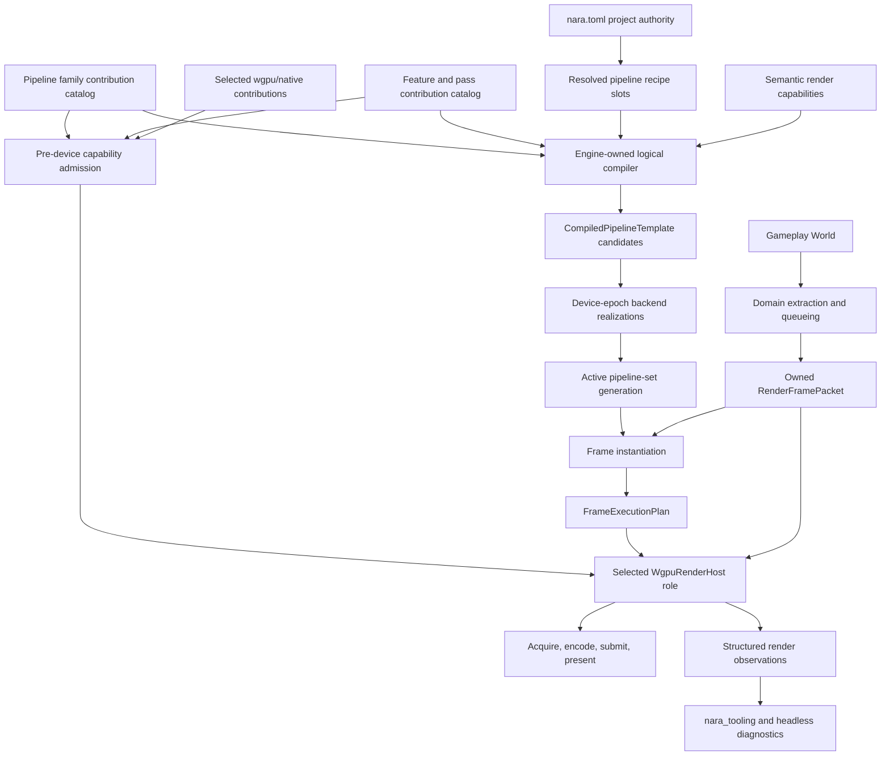

# ADR 0077: Render Pipeline Recipes, Graph Compilation, and Backend Encoding

**Status**: Accepted
**Date**: 2026-07-11
**Last Revised**: 2026-07-15
**Refines**: [ADR 0017](0017-render-graph-policy.md),
[ADR 0032](0032-render-backend-integration-boundary.md), and
[ADR 0040](0040-render-resource-lifetime-and-submitter-ownership.md)

## Context

nara already separates gameplay authoring, backend-neutral render extraction, domain-owned queueing,
and the wgpu adapter. `RenderPassPlan` makes the current clear/world/UI/gizmo order explicit, but it
is intentionally a static phase plan. It does not model logical resource reads and writes,
transient or history lifetimes, computed ordering, cross-target dependencies, pass culling, or
capability lowering.

The next architecture boundary must satisfy several product goals at once:

- simple projects get a complete default renderer without authoring a graph;
- projects may select different pipeline policies per view, similar to choosing a renderer or
  pipeline asset;
- external packages may add portable render features or provide a complete pipeline family through
  the same public contribution path as first-party renderers;
- advanced integrations retain both a narrow scoped encoding escape hatch and an explicitly
  selected, epoch-scoped raw-wgpu/native path without turning ordinary plugins into queue owners;
- browser WebGPU, native desktop, mobile, editor viewports, and future render workers use the same
  product-facing contract;
- pipeline configuration, shader changes, and feature parameters can be validated, inspected, and
  switched atomically;
- the engine can later add a real resource graph without changing gameplay components.

Unity demonstrates that useful programmability is a permission gradient rather than one unlimited
callback: pipeline assets configure a renderer, renderer features contribute declared passes,
RenderGraph owns scheduling and resources, and unsafe passes trade optimization and observability
for control. Current Bevy demonstrates that ECS schedules are useful for pass execution order, but
schedule topology alone does not define resource lifetimes or a data-driven pipeline asset. Godot
similarly separates product-facing compositor effects from its lower-level rendering device graph.

This ADR fixes the ownership and vocabulary before nara fixes a public Rust graph API.

## Terminology

| Term | Meaning |
|---|---|
| Render backend | The concrete GPU implementation. nara uses wgpu rather than defining a second RHI. |
| Pipeline family | A code-provided rendering policy with compatible material, lighting, feature, and frame-topology assumptions, such as the portable 2D family or a future high-fidelity family. |
| Pipeline family contribution | A first-party or external code contribution that defines one stable family ID, default logical topology, material/lighting/view compatibility, semantic capability policy, and editor-facing output contract. The exact Rust trait shape remains deferred. |
| Pipeline recipe/profile | Versioned, inspectable project data selecting a family, feature instances, parameters, quality policy, and capability fallbacks. |
| Render feature | A stable-ID code provider that contributes parameters, pass declarations, queue inputs, and capability requirements to a family. |
| Frame pass / graph pass | A declarative unit with stable identity, logical resource access, ordering constraints, side effects, and portability metadata. |
| Render phase | A category of queued render items, such as opaque, transparent, UI, or gizmo. A phase is not a frame pass. |
| Material technique | A future material/shader implementation for a family, phase, and feature set. It is not the pipeline recipe. |
| Backend render pass | A wgpu command-encoding concept owned by the selected wgpu Render Host; the stock owner is `nara_render_wgpu`. It is not persistent authoring data. |
| Compiled pipeline template | A reusable backend-neutral result derived from recipe, providers, and semantic capabilities. Frame packets do not participate in its identity. |
| Frame execution plan | A backend-neutral frame-local instantiation of a captured active pipeline-set snapshot against current views, targets, batches, and dynamic extents. |
| Device-epoch backend realization | The wgpu shader, pipeline, layout, retained physical resource, and cache state paired with a logical template for exactly one live host/device epoch. |
| Wgpu/native interop contribution | An explicitly selected trusted-native contribution invoked by the owning wgpu Host inside declared epoch and scheduling boundaries; it may use exact wgpu/native APIs and retained epoch resources without becoming a second target or queue authority. |
| Render Host Adapter | The exclusively selected execution authority for one device domain, including Device/Queue ownership, target transactions, physical resources, submission, presentation, recovery, diagnostics, and finite teardown. |
| Semantic render output | A stable-purpose output or strategy exposed to tooling without a GPU handle, such as final color, depth, motion, normals, a debug view, or a declared CPU/GPU picking route. |

## Decision

nara adopts an engine-owned pipeline compiler with data-driven recipes, declared feature/pass
contributions, backend-neutral frame packets, and one selected wgpu execution authority per device
domain.

### wgpu is the RHI

- nara does not define a parallel `Device`, `Texture`, `Buffer`, `CommandEncoder`, or `Queue`
  abstraction that mirrors wgpu.
- The selected wgpu Render Host owns exact `wgpu::Features`, `wgpu::Limits`, downlevel and surface
  capabilities, native handles, command encoding, and submission. `nara_render_wgpu` is the stock
  implementation of that role.
- Core and domain crates expose stable rendering intent and semantic capability requirements, not
  raw wgpu types.
- A speculative generic render-backend trait remains rejected. A second concrete backend would
  require a new ADR and measured product need.
- The browser contract targets WebGPU. nara does not maintain a separate WebGL2 compatibility
  pipeline or silently lower to WebGL2.

### Pipeline recipes and families

- A project has an effective default pipeline recipe resolved through the existing `nara.toml`
  project-settings authority. A view may explicitly select another compatible recipe.
- A recipe selects a stable pipeline-family ID, feature instances, parameter values, quality
  policy, and capability fallback policy. Each resolved recipe/template slot has stable identity
  and generation. Every feature instance has an ID unique within that recipe.
- Recipe order provides deterministic iteration and tie-breaking only; it does not override declared
  dependency topology.
- Recipes store stable public IDs and semantic asset references. They do not store Rust `TypeId`,
  function pointers, runtime `Entity`, frame-local view indices, wgpu enum discriminants, or GPU
  handles.
- The persistent recipe envelope and exact Rust data types remain deferred until a real recipe is
  implemented. They must follow ADR 0049 parse budgets and ADR 0051 envelope policy. Compilation
  also enforces decoded expansion budgets before backend allocation, including bounded feature
  instances, passes, logical resources, edges, fallback variants, specializations, and diagnostics.
- A family owns compatibility rules between its material techniques, feature catalog, view inputs,
  and default frame topology. A family is not a GPU backend.
- First-party and external families enter one typed family-contribution/catalog path. A contribution
  uses a stable family ID and declares default logical topology, material/lighting/visibility/view
  assumptions, compatible feature policy, semantic requirements and fallbacks, and editor-facing
  output/picking support. A recipe or view selects exactly one compatible family; multiple family
  definitions may coexist in the immutable catalog.
- Root composition binds the selected family generation before recipe compilation. It must not use
  package-specific match arms or a first-party allowlist, and the stock family must not rely on a
  private registration path unavailable to external packages.
- The first product family is portable and WebGPU-baseline oriented. A high-fidelity family is
  introduced only when real material, lighting, and frame-topology differences justify it.
- This ADR freezes family ownership and selection, not a `PipelineFamilyProvider` trait, object-safe
  factory, material schema, or public render schedule. The first independent HDR-like family tracer
  chooses the smallest Rust shape that satisfies this contract.

### Feature and pass provider catalog

- Typed render contributions declare providers under stable engine- or package-owned IDs. Package
  composition and direct code-first render helpers lower through the same catalog builder before
  activation. Runtime plugin hooks may install their extraction/queue systems, but they cannot bind
  a hidden provider definition after the catalog and plan are closed.
- A static contributed pass/resource declaration identity is derived from recipe/template identity,
  pipeline family, provider ID, feature instance ID, and provider-local ID. Repeating one provider
  is valid only through distinct feature instance IDs.
- A frame execution instance adds the owned packet's view identity and any target/resource-scope
  occurrence to its static declaration identity. Multiple views or recipe slots therefore cannot
  collide while instantiating the same provider declaration.
- A provider declares its recipe parameter schema, pass contributions, logical resource accesses,
  capability requirements, fallback variants, queue inputs, and diagnostic identity.
- Recipe data selects registered providers; it never serializes executable callbacks.
- Missing, duplicate, conflicting, or incompatible providers fail validation with structured
  diagnostics. They do not silently disappear from a compiled pipeline.
- Rust provider code changes require recompilation or a future separately designed native-module
  boundary. Recipe parameters and shader/material data may use normal asset reload policy.

### Owned frame packet

- Extraction and domain queueing produce an owned, backend-neutral `RenderFramePacket` boundary.
- A packet may contain owned views, domain batches, upload payloads, semantic resource keys,
  generations, and frame metadata. Large immutable payloads may use bounded shared ownership.
- External render domains can contribute bounded owned typed packet sections without adding a
  package-specific variant to a central core enum. Section eligibility, producer/consumer identity,
  version, budget, and retirement are declared through the render contribution catalog; the public
  path is not an untyped `Any` or string lookup. The exact Rust carrier waits for the first external
  family/feature tracer.
- A packet does not borrow the gameplay `World` and does not contain `Surface`, `SurfaceTexture`,
  `Device`, `Queue`, command encoders, backend cache entries, or platform window objects.
- Packet ownership preserves the option to execute on the browser's local GPU executor, a future
  native render worker, or an editor-owned render host without changing gameplay authoring.
- The current main-world extraction model remains valid. A retained second render ECS world is an
  internal optimization, not a public pipeline contract.
- Packet producer, consumer, budget, rejection, and retirement rules must follow ADR 0036 before
  packets cross an asynchronous or threaded boundary.

### Template compilation and frame instantiation

`nara_render` owns validation and compilation from recipe plus providers plus semantic capabilities
into an inspectable `CompiledPipelineTemplate`. A frame packet does not participate in template
identity. When recipe, provider-catalog, schema, shader-interface, or semantic-capability generation
has not changed, static template validation and compilation are reused rather than repeated per
frame.

Each active recipe slot holds one complete logical-template generation plus its device-realized
generation. At the frame boundary, the execution coordinator captures an immutable snapshot of all
recipe slots selected by that frame's views. Publication during execution affects only a later
frame; one frame never mixes old and new generations of a slot.

Each frame instantiates that pipeline-set snapshot against current packet views, targets, batches,
dynamic extents, and enabled frame-local work to produce a backend-neutral `FrameExecutionPlan`.
Exact type names and whether the plan owns or indexes packet sections remain implementation
decisions; it may not borrow the gameplay `World` or contain GPU objects.

The compiler owns:

- stable pass and logical-resource identity validation;
- ordering, cycle detection, and target/view compatibility;
- declared read, write, attachment, copy, and side-effect validation;
- required, optional, and fallback capability resolution;
- logical lifetime and external-ownership declarations, with possible future forms including
  transient, retained/history, imported target, or persistent-cache resources;
- optimization eligibility and reasons work cannot be culled, reordered, aliased, or combined;
- deterministic template and specialization identity;
- decoded expansion budgets and bounded compilation diagnostics.

The listed lifetime and optimization forms are non-exhaustive vocabulary, not frozen enum variants
or algorithms. The first graph-only vertical slice decides the concrete resource schema, aliasing,
merging, barrier, and execution-queue models.

The compiler does not expose physical textures, barriers, heap offsets, bind groups, or command
encoders as project data. The selected Host's backend lowering maps logical resources and passes
onto wgpu objects.

The current `RenderPassPlan` remains a Phase 1 transitional static phase-order plan. It is neither a
persistent recipe nor the frame-local `FrameExecutionPlan` defined by this ADR, and it must not grow
compatibility scaffolding into a partial graph. When the first graph-only vertical slice lands,
nara may replace or delete it rather than preserve parallel pre-1.0 APIs.

### Frame and target transactions

One frame execution coordinator owns the global pass/resource dependency order, command-encoding
order, and queue-submission order across all targets. A target lease owns only external-target
acquisition/import, its final-consumer boundary, and presentation/publication.

1. capture the immutable selected pipeline-set snapshot and instantiate one frame-wide dependency
   plan;
2. resolve every ordered view and pass that contributes to each target;
3. acquire or import each external target at most once;
4. apply explicit clear/load, viewport, scissor, and composition semantics;
5. encode cross-target dependencies and perform one or more globally ordered submissions;
6. present or publish each external target once after its final consumer.

An external target handle never enters `RenderFramePacket` or recipe data. Multiple views targeting
one window do not independently acquire, clear, and present that window. Offscreen images and editor
viewport targets use the same transaction vocabulary as surfaces.

### Capability model

- Root composition closes a pre-device capability request from the selected Render Host policy,
  family, features, target policy, and wgpu/native interop contributions before a Device exists. Portable
  contributions express semantic required/optional/fallback needs; backend-specific contributions
  may additionally express exact wgpu feature/limit requirements tied to Nara's supported wgpu
  version and an explicit portability class.
- After adapter selection and before `request_device`, the selected wgpu Host lowers that closed
  request against exact adapter support into one inspectable device-request plan. Supported,
  requested, enabled, rejected, and fallback-selected facts remain distinct observations.
- The backend retains the complete exact wgpu capability snapshot for lowering and advanced
  diagnostics.
- `nara_render` defines only stable semantic requirements needed by recipes and providers.
- A requirement is classified as required or optional and carries an explicit fallback policy:
  disable the feature, substitute a named variant, or reject compilation.
- Capability lowering is deterministic and inspectable. A pass is never silently omitted.
- Raw `wgpu::Limits` and feature bitsets are not serialized into project files.
- Capability tiers are added only from measured pipeline needs; nara does not invent a comprehensive
  hardware taxonomy in advance.
- Activating a structurally different composition that needs capabilities absent from the live
  Device cannot silently widen it. The Host rejects that candidate or constructs and publishes a
  fresh Host/device generation under ADR 0078 while the old generation follows its normal
  last-good/retirement policy.

### Extension permission levels

The levels are cumulative authoring choices, not first-party trust tiers:

1. Recipe configuration is the default extension path and remains fully portable and inspectable.
2. Any number of declared feature/pass contributions may add graph work but do not own target
   acquisition, graph compilation, global resource lifetime, queue submission, or presentation.
3. Any number of pipeline families may be registered; each recipe/view selects exactly one
   compatible family generation. First-party and external families use the same catalog and
   compiler input.
4. An advanced scoped encoding pass may receive a short-lived command context after declaring its
   resource scope and ordering contract. This standard escape hatch does not expose `Device`,
   `Queue`, target leases, engine caches, owned engine resource handles, or cloneable wgpu resource
   views. It exposes a non-cloneable callback-scoped encoding facade plus host-managed opaque keys
   for the declared resource bindings.
5. An explicitly selected trusted-native wgpu/native interop contribution may receive exact
   host/device-epoch access at a Host-declared execution slot. It may own registered persistent GPU
   resources for that epoch and, when its declared mode requires it, use Device/Queue or native
   interop APIs. It declares logical resource reads/writes and one queue mode. Host-submit mode
   returns stamped command work for the Host's global submission order. Direct-submit mode forces
   the Host to close and submit all graph predecessors before entering the callback; the interop
   submission completes queue ordering before any successor is encoded/submitted. Direct work is
   an observable opaque barrier, is never inferred to be portable or freely reorderable, and may
   not retain target leases or become a second frame-wide execution authority.
6. Exactly one Render Host Adapter is selected for each live device domain. This is the replacement
   level for integrations that must own Device/Queue, target acquisition, submission, presentation,
   recovery, or placement rather than run inside the selected Host.

Opaque keys are bound to the captured plan generation and current host/device epoch. The facade
rejects undeclared, stale, cross-generation, cross-epoch, or out-of-callback use before encoding;
provider code cannot resolve a key into an independently retained backend handle.

Scoped encoding passes are marked in compiled observations. The compiler must conservatively
disable or explain optimizations it can no longer prove, including culling, aliasing, pass merging,
or reordering.

An interop contribution's retained resources, async results, callbacks, and encoded work carry the
owning host/device epoch. Device loss invalidates them before a new epoch can execute, and finite
retirement is a registered Host obligation. If an integration cannot obey the selected Host's callback,
submission-barrier, target, recovery, or teardown rules, it must supply the exclusively selected
Render Host Adapter instead of quietly becoming a second queue owner.

Every selected Host candidate declares which interop contract versions, backend modes, queue modes,
and resource-binding rules it supports. Composition matches each selected interop contribution to
that support before device admission and applies a declared fallback or rejects. A direct native
queue outside the selected wgpu Queue requires an explicit synchronization protocol or whole-Host
ownership; callback entry/exit alone never proves a GPU dependency.

Raw wgpu access is absent from gameplay preludes and the portable render-provider Interface.
"Trusted" means the user explicitly selected native in-process code with ambient process authority;
it does not mean first-party, signed, sandboxed, or allowlisted. This ADR freezes reachable
capability, explicit selection, cardinality, and lifecycle obligations, but not final public trait,
factory, session, or callback type names. Because raw wgpu handles are cloneable, the Host can
validate registered/returned work but cannot type-contain malicious native code that retains a raw
handle outside the declared slot.

### Reload, failure, and observation

- Recipe, parameter, provider, schema, semantic-capability, or shader-interface changes first build
  a backend-neutral logical template candidate. A shader-content reload whose validated interface
  is unchanged reuses the logical template and starts only a backend-realization candidate.
- The host realizes every required statically knowable shader module, pipeline, layout, and
  generation-retained backend resource for the current device epoch. Only after logical compilation
  and required backend realization both succeed does nara atomically publish one complete recipe
  slot generation containing the template and its backend realization. A coordinated multi-slot
  change publishes one pipeline-set generation only after all required slots succeed.
- Dynamic target formats or extents, frame-transient resources, and explicitly lazy specializations
  are resolved during bounded frame instantiation/execution. Their failure skips the affected
  target or frame with a structured reason, or selects an already declared same-epoch fallback; it
  never partially mutates the active generation.
- During ordinary reload on the same live device epoch, failure at either candidate stage preserves
  the previous complete active generation. After a device-epoch change, the previous backend
  realization is invalid: nara may retain the logical template, but affected rendering remains in
  recovering/skipped state until a complete realization for the new epoch succeeds. Optional lazy
  variants must use declared fallback behavior and cannot partially replace the active generation.
- Template generation, backend-realization generation, device epoch, selected variants, fallback
  decisions, disabled features, pass/resource edges, lifetimes, cache pressure, and CPU/GPU timing
  eligibility are structured observations.
- `nara_tooling` consumes stable `RenderPlanSnapshot` and `RenderExecutionSnapshot`-style data, not
  GPU handles or backend pointers. Exact type names remain an implementation decision.
- Runtime and editor viewports consume the same compiled pipeline semantics. Editor overlays are
  explicit feature/pass contributions rather than a second hidden renderer.
- Every family selected for an editor viewport declares a final-color target contract and an
  overlay-composition point. It also declares one supported picking strategy and any optional
  semantic outputs or capture routes, such as depth, object ID, motion, normals, or custom debug
  views. Object-ID rendering is not mandatory when a CPU/gizmo or another declared strategy
  provides equivalent picking.
- Semantic outputs declare stable purpose, producer, availability/fallback, color/format meaning,
  lifetime, visibility, and bounded capture/readback policy. Tooling may request and observe them
  through stable backend-neutral identities; it does not receive their physical texture, buffer,
  fence, or native handle. A family that cannot satisfy a Host profile's required viewport outputs
  rejects during admission instead of becoming an editor black box.
- Important failures bridge into the ADR 0048 runtime diagnostics bus and remain observable in
  headless operation.

### Crate ownership

| Owner | Responsibility |
|---|---|
| `nara_render` | Recipe vocabulary, semantic capabilities/outputs, owned extensible frame packet, family/feature catalog contracts, plan/graph validation, compiled observations. |
| Domain render crates and external render packages | Extract domain data, contribute typed packet sections, queue/sort/batch items, and declare family/feature/pass policy through public render contribution contracts. |
| `nara_render_wgpu` | First-party default wgpu Render Host Adapter, exact capabilities, physical resource allocation, pipelines, encoding, submission, presentation, device-domain caches, and Host-managed wgpu/native interop sessions. |
| External wgpu/native Adapter crates | Explicitly selected epoch-scoped interop contributions or replacement Render Host Adapters bound to Nara's exact supported wgpu/backend contract; never gameplay-facing or a second RHI. |
| `nara_app` | Declared extraction/prepare/queue/render stages and runtime lifecycle; it does not own GPU policy. |
| `nara_tooling` | UI-agnostic plan/execution inspection and editor commands; it does not own graph compilation. |

New crates are introduced only when implementation size or dependency isolation creates real
pressure. The decision does not require an empty `nara_render_graph` crate now.

## Alternatives Considered

### Option A: Keep one hard-coded renderer with fixed insertion hooks

**Pros**: Smallest initial implementation and easiest default path.

**Cons**: Hooks accumulate implicit resource and ordering contracts, make cross-target composition
fragile, and cannot provide Unity-like pipeline families without backend changes.

**Decision**: Rejected as the long-term extension model. The current `RenderPassPlan` remains a
transitional implementation.

### Option B: Expose raw wgpu as the primary scriptable render pipeline

**Pros**: Maximum Rust control with almost no wrapper code.

**Cons**: Couples plugins and project policy to wgpu versions, prevents safe graph optimization,
weakens WebGPU portability, and makes editor/headless inspection incomplete.

**Decision**: Rejected as the default path. Exact wgpu remains available only through the explicit
scoped-encoding, epoch-scoped interop, or replacement Render Host levels defined above.

### Option C: Copy Bevy's complete RenderApp bundle as the public model

**Pros**: Mature extraction and native pipelined-rendering precedent; pass-as-system composition is
familiar to ECS users.

**Cons**: Adds entity synchronization and a second ECS lifecycle before nara needs them. A schedule
does not itself define logical resources, transient lifetimes, or a serializable recipe. Bevy's
SubApp ownership also conflicts with nara-owned app lifecycle.

**Decision**: Rejected only as one indivisible public bundle. A retained render World and SubApp
ownership remain deferred internal optimizations. A smaller public render execution/scheduling
kernel is a separate decision: add it only if the clean-room family, interop, and Host tracers prove
that the typed packet/provider/compiler seams cannot reach equivalent results without one.

### Option D: Engine-owned compiler with layered render capabilities

**Pros**: Gives simple projects a complete default, supports external features and full families,
keeps project data stable, supports WebGPU and editor inspection, and provides explicit interop and
whole-Host upgrade paths for physical optimization.

**Cons**: Requires a provider catalog, validation model, stable identities, diagnostics, and an
eventual real resource graph.

**Decision**: Chosen.

## Success Metrics

| Metric | Target | Measurement |
|---|---:|---|
| Default usability | The portable default family renders without project-authored graph nodes | Windowed example and plugin-group test |
| External renderer usability | A game selects an external complete renderer with one package/product-preset action and one project/view recipe choice; it does not manually register the package's internal family, features, packet sections, or Host bindings | Clean-room author task and editor selection snapshot |
| Backend isolation | No core/domain recipe, packet, or persistent type imports `wgpu` | Dependency-boundary search |
| Target transaction | One external target is acquired and presented at most once per target frame despite multiple views | Multi-view backend integration test |
| Global execution order | An offscreen-to-surface dependency is encoded and submitted in frame-wide order; target leases cannot submit independently | Cross-target integration and API-boundary tests |
| Capability transparency | Every unsupported required feature rejects or selects its declared fallback with a structured reason | Compiler capability matrix tests |
| Atomic reload | On the same live epoch, candidate failure leaves the prior complete slot or coordinated pipeline-set generation active | Last-good reload and backend-realization tests |
| Epoch recovery | A new epoch never executes the prior realization; logical templates may be reused only while rendering waits for complete new-epoch realization | Device-loss recovery tests |
| Per-view policy | Two views can select different compatible recipes without replacing the GPU backend | Multi-view pipeline test |
| Frame coherence | A frame captures one immutable pipeline-set snapshot and never mixes generations during concurrent reload publication | Reload-race integration test |
| Inspectability | Compiled observations expose stable pass IDs, resource edges, selected variants, and scoped-encoding/interop limitations without GPU handles | Tooling snapshot tests |
| Template reuse | Unchanged recipe, provider, schema, shader-interface, and semantic-capability generations do not revalidate or recompile the static template each frame | Compile-count instrumentation test |
| Expansion bounds | Encoded and decoded recipe expansion limits reject oversized candidates before backend allocation | Boundary and hostile-input matrix tests |
| Packet openness | An external render domain contributes a bounded typed packet section without a core enum edit, public `Any`, or per-frame string lookup | Renamed-dependency packet tracer and source-diff gate |
| Pre-device admission | Selected Host, family, feature, target, and interop requirements close before `request_device`; tests distinguish supported/requested/enabled/fallback states and never try to widen a live Device | Adapter capability matrix and reconstruction test |
| Escape containment | The normal scoped-encoding-pass API exposes no device, queue, target lease, cloneable resource view, or owned engine handle; undeclared/stale keys and escaped facade borrows are rejected | API review, runtime scope checks, and compile-fail tests where practical |
| Portable feature parity | Independent packages contribute extraction/packet data, material/queue policy, post-process passes, and editor-only gizmo/overlay work without editing `nara_render_wgpu` or requiring a public second render World | Clean-room external-package tracer and dependency/API audit |
| Pipeline family parity | An independent HDR-like family owns different material/lighting assumptions and full frame topology, is selected by recipe, exposes final color plus a picking strategy, and needs no `nara_render` or stock-backend edit | Renamed-dependency family/editor tracer and source-diff gate |
| Wgpu/native interop parity | An independent contribution requests a non-baseline pre-device capability, creates retained epoch resources, performs declared compute or native work, and rebuilds or retires correctly across device loss without editing the stock Host | Interop conformance, loss/recovery, and portability tests |
| Interop GPU order | Host-submit work joins global submission order; direct-submit work declares resource access and observes predecessor-flush -> interop-submit -> successor order | Instrumented command/queue ordering and hazard tests |
| Host/interop compatibility | Every selected interop contribution matches a declared contract/backend/queue/resource-binding mode from the selected Host or follows its explicit fallback/rejection policy | Host/interop compatibility matrix |
| Render Host parity | An independent replacement Host is explicitly selected as the sole device/queue/target authority and passes target transaction, submission, recovery, diagnostics, and finite-close suites without a first-party allowlist | Replacement-Host clean-room fixture and exclusive-authority tests |
| Editor semantic compatibility | External families provide final-color/overlay contracts, one picking strategy, and declared optional capture outputs without exposing GPU handles | Editor viewport, picking, and bounded-capture tracer |

## Risks and Mitigations

| Risk | Severity | Likelihood | Mitigation |
|---|---|---:|---|
| Recipe schema freezes before a real pipeline exists | High | Medium | Freeze ownership and semantics now; defer exact persistent and Rust shapes to the first implementation. |
| `RenderPassPlan` grows into a second partial graph | High | High | Keep it transitional and replace it under the pre-1.0 policy when a graph-only slice arrives. |
| Semantic capabilities merely rename every wgpu feature | Medium | Medium | Add semantic requirements only from concrete family/provider needs; retain exact values in the backend snapshot. |
| Scoped encoding passes become the normal plugin path | High | Medium | Keep them out of normal preludes, require declared scope, and expose lost optimizations in diagnostics. |
| Raw interop silently becomes a second queue authority | Critical | Medium | Require declared resource access, Host-submit or predecessor-flushing direct-submit mode, bind retained work to one epoch, and require whole-Host replacement for independent target/submission ownership. |
| First-party renderer uses private family or Host hooks | Critical | Medium | Require one public contribution/selection path and independent renamed-dependency tracers for each promised permission level. |
| Recipe flexibility makes defaults difficult to support | High | Medium | Ship explicit engine-owned portable family bundles and validate family/feature compatibility. |
| Legal recipes amplify into excessive graph work | High | Medium | Enforce decoded feature/pass/resource/edge/variant/diagnostic budgets before realization. |
| Graph compilation adds per-frame cost | Medium | Medium | Separate cached templates from bounded frame instantiation and key them by recipe, provider, schema, shader-interface, semantic-capability, and generation identity. |
| Editor requirements fork the runtime renderer | High | Medium | Require editor targets and overlays to consume the same captured template/backend-realization generations, backend-neutral `FrameExecutionPlan`, and target-transaction semantics. |
| A custom family renders but cannot participate in the editor | High | Medium | Require final-color/overlay semantics and one declared picking strategy at Editor Host admission; keep optional capture outputs explicit. |

## Consequences

- `RenderPassPlan` remains valid for the current renderer but is explicitly transitional.
- The next submitter-extension work should target provider/packet contributions rather than add
  sprite/UI/text/3D parameters directly to `nara_render_wgpu` systems.
- Omitting a public Bevy-style `RenderApp` is justified only after the portable-feature, complete-
  family, wgpu/native-interop, replacement-Host, and editor-semantic clean-room tracers jointly
  prove equivalent reachable capability through Nara's typed seams. A feature-only tracer cannot
  establish renderer parity.
- The first real graph implementation must be driven by at least two concrete target/resource
  flows, such as the current SDR surface path plus HDR/offscreen editor composition.
- Project-facing pipeline data can evolve independently from wgpu versions and native backends.
- Pipeline family selection, logical template compilation, device-epoch realization, frame
  instantiation, and execution become separate observable states rather than one backend draw
  function.
- This ADR does not implement a full graph, shader DSL, material file format, high-fidelity family,
  async compute, pass fusion, physical alias allocator, render worker, or second render world.
- First-party support policy and defaults may differ, but first-party families, interop modules, and
  Host candidates do not receive private extension authority unavailable to an external package.

## Deferred Decisions

- Exact recipe envelope and Rust API, triggered by the first configurable portable pipeline.
- Concrete logical resource and graph node schema, lifetime enum, execution queues, aliasing,
  merging, and barrier algorithms, triggered by the first intermediate texture or cross-target
  dependency that static planning cannot express.
- Color space, transfer function, HDR display, tone-mapping, and alpha contracts, triggered before
  the first HDR output family or persistent color-bearing project format.
- Shared editor/process render-host ownership, triggered by the first offscreen editor viewport that
  must outlive or be shared across isolated Play runtimes.
- Native parallel encoding or retained render world, triggered only by profiling evidence.
- Material-technique and shader-reflection contracts, triggered by reusable material assets and a
  second real family/technique combination.
- Exact Rust shapes for family contributions, typed packet sections, interop sessions, and Render
  Host selection, chosen by their independent clean-room tracers. Their capability, cardinality,
  selection, and lifecycle guarantees are not deferred.

## Citations

- [ADR 0017: Render Graph Policy](0017-render-graph-policy.md)
- [ADR 0040: Render Resource Lifetime and Submitter Ownership](0040-render-resource-lifetime-and-submitter-ownership.md)
- [Unity URP RenderGraph introduction](https://docs.unity3d.com/6000.0/Documentation/Manual/urp/render-graph-introduction.html)
- [Unity URP unsafe passes](https://docs.unity3d.com/6000.0/Documentation/Manual/urp/render-graph-unsafe-pass.html)
- [Unity `RenderPipelineAsset`](https://docs.unity3d.com/6000.0/Documentation/ScriptReference/Rendering.RenderPipelineAsset.html)
- [Unity `RenderPipeline`](https://docs.unity3d.com/6000.0/Documentation/ScriptReference/Rendering.RenderPipeline.html)
- [Unity native plug-in interface](https://docs.unity3d.com/6000.0/Documentation/Manual/native-plugin-interface.html)
- [Bevy renderer schedule at `f6c6e6eebb94`](https://github.com/bevyengine/bevy/blob/f6c6e6eebb94/crates/bevy_render/src/renderer/mod.rs)
- [Bevy `RenderDevice`](../../../repo-ref/bevy/crates/bevy_render/src/renderer/render_device.rs)
- [Bevy `RenderQueue`](../../../repo-ref/bevy/crates/bevy_render/src/renderer/mod.rs)
- [Bevy per-view core schedules at `f6c6e6eebb94`](https://github.com/bevyengine/bevy/blob/f6c6e6eebb94/crates/bevy_core_pipeline/src/schedule.rs)
- [Godot compositor effect contract at `c939bf3791`](https://github.com/godotengine/godot/blob/c939bf3791/doc/classes/CompositorEffect.xml)
- [Godot rendering device graph at `c939bf3791`](https://github.com/godotengine/godot/blob/c939bf3791/servers/rendering/rendering_device_graph.h)
- [Render Extension Capability Interface Design](../render-extension-capability-interface-design.md)
