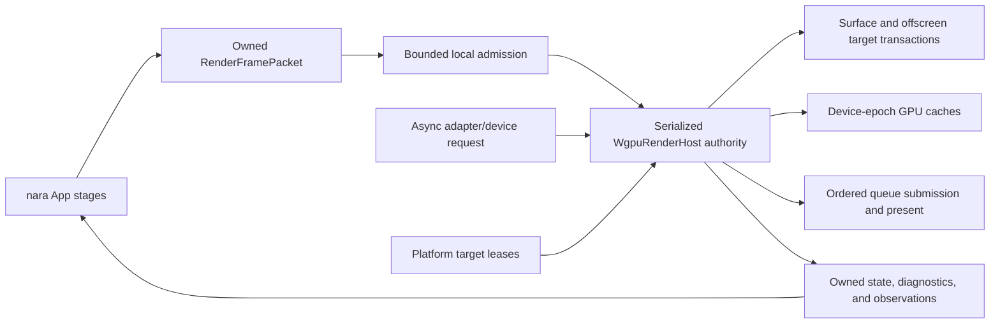
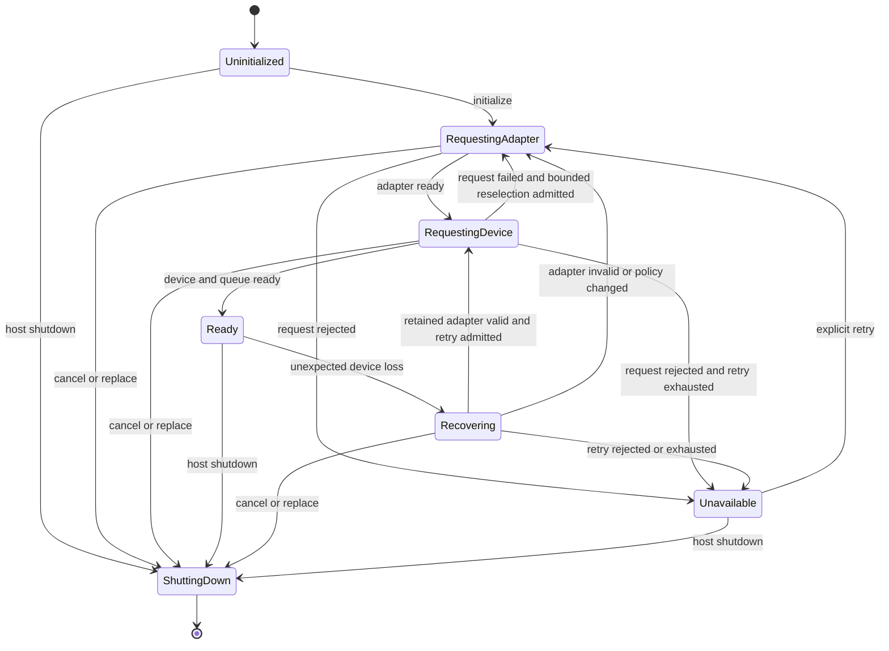

# ADR 0078: Render Host Affinity, WebGPU Initialization, and Device Recovery

**Status**: Accepted
**Date**: 2026-07-11
**Refines**: [ADR 0032](0032-render-backend-integration-boundary.md),
[ADR 0040](0040-render-resource-lifetime-and-submitter-ownership.md), and
[ADR 0042](0042-runtime-service-and-backend-boundary.md)

## Context

The Phase 1 wgpu backend stores `Instance`, `Adapter`, `Device`, `Queue`, surfaces, pipelines, and
texture caches in an ordinary ECS `Resource`. It initializes the adapter and device through
`pollster::block_on` from the render system. This is sufficient for the current native examples but
does not satisfy the browser WebGPU contract.

wgpu 30 browser objects are `!Send` and `!Sync` by default. The WebGPU backend contains JavaScript
agent-local `Rc` and `Cell` state, while Bevy ECS ordinary resources require `Send + Sync`.
Consequently, `cargo check -p nara_render_wgpu --target wasm32-unknown-unknown` fails at the
`WgpuRenderBackend: Resource` boundary. The wgpu
`fragile-send-sync-non-atomic-wasm` feature only asserts thread traits for non-atomic single-threaded
WASM and explicitly does not make browser GPU objects safe to share across agents.

Adapter and device requests are asynchronous browser promises. Surface acquisition, configuration,
and presentation also have target-local lifetime rules. Device loss is distinct from surface loss:
a lost surface may be recreated, while a lost device invalidates every device-domain pipeline,
bind group, texture, buffer, encoder, cache entry, and configured surface state.

The current backend records surface outcomes, but a generic backend error marks the backend
unavailable and the next frame may create a new device without first clearing old device-domain
objects. That can mix resources from different devices. The architecture must make affinity,
initialization, target transactions, recovery, and teardown one coherent ownership contract.

## Decision

nara uses one serialized GPU execution authority, represented conceptually as `WgpuRenderHost`, to
own all wgpu native state and consume owned backend-neutral frame packets.

Serialized authority means that one owner orders mutable host state, target operations,
device-domain transitions, cache publication, submission, and presentation. It does not require
every native host to remain on one OS thread for its entire lifetime. Browser WebGPU is stricter: a
live host is bound to the JavaScript agent and local executor selected by its platform adapter and
is never moved across agents. A native adapter declares whether its host is OS-thread-affine,
executor-affine, or may migrate only while quiescent under an adapter-proven protocol.

### GPU execution authority

- Exactly one execution authority owns each live wgpu instance/device domain, surface set, physical
  cache set, queue-submission order, and device epoch.
- The platform adapter declares and enforces the authority's call-site constraints. Browser WebGPU
  uses one JavaScript agent and local executor. Native backends may use the runner thread or a
  render worker when their adapter proves that placement and any quiescent migration are legal.
- The public render contract does not require the host or its handles to implement `Send` or `Sync`.
- The host is not stored as an ordinary `Send + Sync` ECS resource on targets where wgpu objects do
  not satisfy those traits.
- Host storage is an adapter detail. The first corrective implementation may use a non-send ECS
  resource driven on the platform-local executor; a future runner- or editor-owned host may live
  outside the gameplay world while consuming the same owned packet contract.
- nara does not manually implement `Send`/`Sync` for browser wgpu objects and does not enable
  `fragile-send-sync-non-atomic-wasm` as an architectural workaround.
- Platform raw-handle providers do not grant permission to call platform APIs from an arbitrary
  thread. Surface creation and use require the placement authority declared by the platform
  adapter.

### Initialization state machine

Initialization is modeled as a non-blocking state machine:

- Browser adapter/device requests run on a local async executor such as `spawn_local`; the render
  stage never blocks the browser event loop with `pollster::block_on`.
- Native implementations may resolve the same state machine using a runner-controlled blocking or
  asynchronous adapter only where blocking is safe. The public lifecycle remains state-based.
- Initialization completion, failure, cancellation, and retry are owned results integrated through
  declared host/app stages. No async task mutates the gameplay `World` directly.
- An initialization generation rejects stale completions after retry, shutdown, target change, or
  host replacement.
- Device callbacks are correlated with host generation, initialization generation, and, after
  device creation, the assigned device epoch before they may change current state.
- An explicit replacement does not drive the old host through recovery. The old authority enters
  `ShuttingDown`; a new authority starts its own initialization generation independently.
- `wgpu::DeviceLostReason::Destroyed` is expected completion only when shutdown or replacement
  invalidated that host generation before destroying the device. It does not retry or publish a
  device-fault diagnostic. Every uncorrelated `Destroyed` callback and every other loss reason is
  unexpected and enters `Recovering`.
- The backend publishes a semantic capability snapshot only after adapter/device selection. Pipeline
  compilation cannot assume capabilities before the snapshot is current.
- Initialization failure is structured and inspectable. It does not create placeholder GPU objects
  or silently disable the renderer.

### Browser and platform support policy

- Browser builds target WebGPU. The wgpu `webgl` feature and a WebGL2-specific pipeline are not part
  of nara's supported fallback contract.
- Lack of browser WebGPU produces a typed unavailable state and diagnostic rather than silent
  rendering degradation.
- The host may be bound to a browser Window agent or a Worker using an `OffscreenCanvas`, provided
  the owning platform adapter establishes that deployment and never moves live GPU objects between
  agents.
- Native wgpu backends remain selected by wgpu. nara does not expose Vulkan, Metal, Direct3D, or
  GLES objects through its product-facing render API.
- Backend selection and adapter/device limits remain exact wgpu concerns; pipeline recipes consume
  the semantic capability lowering defined by ADR 0077.

### Frame packet and target ownership

- `RenderFramePacket` contains owned backend-neutral data only. It never contains `Surface`,
  `SurfaceTexture`, `TextureView`, `Device`, `Queue`, an encoder, or a configured platform target.
- Surface/offscreen acquisition, configuration, presentation, and discard remain inside the host's
  target transactions. The frame-wide execution coordinator from ADR 0077 owns encoding and
  submission order across every target transaction; an individual target lease cannot submit.
- A target is acquired at most once for one target frame and is presented or published only after
  its final consumer declared by the captured `FrameExecutionPlan`.
- The host must not reconfigure a surface while a prior acquired texture from that surface remains
  live. Every success, skip, error, cancellation, and shutdown path presents or discards acquired
  textures according to wgpu's contract.
- Surface acquisition is one result channel with `Success`, `Suboptimal`, `Timeout`, `Occluded`,
  `Outdated`, `Lost`, and `Validation` outcomes. Success and suboptimal acquisition produce the
  target texture; suboptimal also schedules bounded reconfiguration after the texture retires.
  Timeout and occlusion may skip a target frame, outdated triggers reconfiguration, lost recreates
  the surface from a still-valid platform lease, and validation follows typed target-error policy.
- Out-of-memory and device-loss signals arrive through device callbacks or other device operations,
  not as invented surface-acquisition variants. The host processes the surface and device channels
  independently even when both report during the same target frame; device policy then determines
  how any concurrently acquired texture is retired.
- Platform target leases keep the underlying window/canvas authority alive. Surfaces and acquired
  textures are retired before the lease or platform window is released.

### Device epoch and recovery

Every successfully created device establishes a monotonically increasing device epoch scoped to its
host authority. An authority never reuses an epoch value; non-reused host identity plus epoch
prevents a replacement authority from colliding with the retired host's device domain.

Every `Device`, `Queue`, object created by or validated for them, configured surface state, acquired
or imported GPU target view, physical cache entry, backend realization, and device-dependent
asynchronous or encoded result belongs to exactly one host/epoch pair. Backend-neutral
`CompiledPipelineTemplate`, logical specialization identity, `FrameExecutionPlan`, and
`RenderFramePacket` do not acquire an epoch merely because a device is replaced. Device-realized
pipeline/cache keys combine their logical identity with the host/epoch and exact backend capability
or target-format identity they require.

The `Instance`, reusable `Surface` object, retained policy-compatible `Adapter`, and platform target
leases are not device objects and do not become epoch-owned merely because they participate in
recovery. Configured surface state is epoch-owned because its compatibility was established against
a particular device. Adapter/device request completions use initialization generation; results
produced for an assigned device additionally use its epoch.

On unexpected device loss, the recovering host:

1. stops accepting work for the failed epoch;
2. records the first device failure and publishes a structured recovery transition;
3. discards or retires every acquired target frame;
4. invalidates configured surface state, pipelines, bind groups, samplers, textures, buffers,
   upload arenas, transient pools, query sets, and backend pipeline caches from the old epoch;
5. rejects stale upload, mapping, device-realization, encoding, query, or submission results carrying
   the old epoch; initialization results remain guarded by their separate initialization generation;
6. reuses the retained adapter to request a new device when that adapter is still valid and still
   satisfies target and selection policy;
7. returns to `RequestingAdapter` only when capabilities or target policy require reselection, the
   adapter is invalid, or a retained-adapter device request fails;
8. reuses backend-neutral logical templates when their semantic capability identity remains valid,
   otherwise recompiles a complete logical candidate, then realizes and atomically activates the
   new device-side generation under ADR 0077;
9. rebuilds backend objects from last-good backend-neutral prepared resources and compiled intent.

Old-epoch objects are never submitted to a new device. Recovery does not mutate imported artifacts
or gameplay assets. Last-good prepared resources remain the rebuilding source unless their own
domain has invalidated them.

Surface loss does not automatically advance the device epoch. Device loss always invalidates the
entire device domain, even when the surface still exists.

### Errors and diagnostics

- The host registers device-lost and uncaptured-error callbacks where wgpu supports them.
- Backend callbacks produce bounded owned observations; they do not retain arbitrary errors, URLs,
  shader source, platform paths, or secret values in summaries.
- `RenderBackendStatus` remains the low-cardinality current-state projection. Detailed typed host
  outcomes bridge into ADR 0048 runtime diagnostics and numeric pressure snapshots.
- Diagnostics distinguish initialization failure, capability rejection, target skip, surface loss,
  device loss, recovery failure, validation failure, out-of-memory policy, stale result rejection,
  and shutdown timeout.
- Expected `Destroyed` completion is observable teardown metadata, not a device-fault diagnostic.
- Recovery and retry are bounded. Repeated failure does not create an unbounded per-frame retry or
  log loop.

### Shutdown and replacement

- Shutdown first closes frame-packet admission and cancels or invalidates outstanding initialization
  generations.
- The host finishes or abandons acquired target transactions, stops new submissions, and observes
  finite completion policy for in-flight work.
- Device-domain caches and surfaces are retired before target leases and platform windows.
- Host replacement creates a new authority with an independent initialization generation and
  allocates its own epoch only after device creation. The old authority reaches `ShuttingDown`
  rather than `Recovering`.
- A shared target lease transfers only after the old host has retired its acquired textures,
  surfaces, and callbacks. Browser GPU objects never move between JavaScript agents. Native host
  placement or quiescent migration follows the platform adapter's declared authority rules.
- Plugin cleanup remains fallible and finite under ADR 0010. Cleanup failure is reported without
  pretending that backend-native resources remain reusable.

### Native parallelism

The single execution authority serializes mutable host state, target configuration/acquisition,
device-epoch transitions, cache publication, submission order, and presentation. It does not forbid:

- parallel gameplay extraction or domain preparation;
- background shader translation and candidate preparation that return owned results;
- native parallel command encoding when wgpu traits, graph dependencies, and profiling justify it;
- multiple independent hosts/devices in a future explicitly designed multi-adapter deployment.

Any future parallel encoder path returns epoch-stamped command work to the owning host for ordered
validation and submission. Native parallelism is an optimization over this contract, not a separate
public renderer.

## Alternatives Considered

### Option A: Enable `fragile-send-sync-non-atomic-wasm`

**Pros**: Keeps `WgpuRenderBackend` as an ordinary ECS resource with the smallest source change.

**Cons**: Encodes the absence of WASM atomics as thread safety, cannot support browser threads or
agent transfer, and contradicts the actual JavaScript object ownership model.

**Decision**: Rejected.

### Option B: Wrap all GPU state in `Arc<Mutex<_>>`

**Pros**: Satisfies ordinary resource bounds on native targets and appears to centralize mutation.

**Cons**: Does not make browser objects transferable or thread-safe, obscures executor affinity,
adds locking to the hot path, and still permits calls from the wrong platform thread.

**Decision**: Rejected.

### Option C: Create separate unrelated native and browser renderer architectures

**Pros**: Each target can use locally convenient storage, scheduling, and initialization.

**Cons**: Duplicates lifecycle, recovery, capability, and diagnostics policy; portable features can
diverge; editor and test coverage cannot reason about one renderer contract.

**Decision**: Rejected. Storage adapters may differ, but they implement one host/packet lifecycle.

### Option D: Move a mandatory render service outside every App immediately

**Pros**: Naturally supports process-level editor sharing and makes GPU ownership independent from
the gameplay world.

**Cons**: Forces runner/editor service composition before nara has an offscreen editor viewport or
multiple runtime consumers. It would enlarge the first corrective slice.

**Decision**: Deferred. The owned packet and host authority make this an internal migration later.

### Option E: Serialized host authority with browser affinity, async state, and device epochs

**Pros**: Matches browser WebGPU ownership, keeps one cross-platform lifecycle, makes recovery
explicit, supports structured diagnostics, and preserves native optimization options.

**Cons**: Requires a non-send/local service seam, async lifecycle integration, generation checks,
and comprehensive target/device recovery tests.

**Decision**: Chosen.

## Success Metrics

| Metric | Target | Measurement |
|---|---:|---|
| Browser compilation | `nara_render_wgpu` compiles for `wasm32-unknown-unknown` without the fragile Send/Sync feature | Feature-matrix cargo check |
| Native compilation | Existing native wgpu examples and crate checks remain green | Native feature-matrix checks |
| Non-blocking browser init | Browser code contains no render-stage `pollster::block_on`; state progresses through owned async results | Source boundary check and browser smoke test |
| Authority enforcement | Browser wrong-agent access and native calls outside adapter-declared placement are unrepresentable or fail before a platform call | API review and adapter tests |
| Target transaction | Each target is acquired and presented at most once per target frame, including multiple views | Instrumented multi-view test |
| Epoch isolation | No old-epoch cache entry, upload result, pipeline, or command work reaches a replacement device | Device-loss/replacement tests |
| Recovery completeness | Device loss clears every old-epoch device-domain resource class while preserving rebuildable prepared data | Fake/injected recovery integration test |
| Expected destruction | A generation-invalidated `Destroyed` callback completes teardown without retry or a device-fault diagnostic; an uncorrelated one recovers | Shutdown/replacement race tests |
| Adapter reuse | Recovery requests a device from a still-compatible adapter before bounded adapter reselection | Recovery transition tests |
| Surface/device orthogonality | All seven surface-acquisition outcomes are tested independently from injected device-loss and out-of-memory signals | Combined surface/device state-machine tests |
| Finite failure | Initialization, retry, recovery, and shutdown remain bounded and observable | Failure-injection tests |

## Risks and Mitigations

| Risk | Severity | Likelihood | Mitigation |
|---|---|---:|---|
| Browser local/non-send host conflicts with the current App wrapper | High | High | Add a narrow local-service/non-send integration seam; do not weaken ordinary resource bounds globally. |
| Host storage choice leaks into public render APIs | High | Medium | Keep `RenderFramePacket`, host states, and observations owned; treat ECS versus runner storage as adapter detail. |
| Recovery misses one GPU resource class | Critical | Medium | Centralize all physical caches under the device epoch and maintain an exhaustive recovery registry/test matrix. |
| Retry loops consume every frame | High | Medium | Use bounded retry policy, explicit user/runner retry, and sticky diagnostics. |
| Browser main-thread assumptions block Worker rendering | Medium | Medium | Specify JavaScript-agent affinity rather than hard-code main-thread ownership. |
| Native affinity is frozen more tightly than the backend requires | Medium | Medium | Standardize serialized authority, let platform adapters declare placement, and require quiescence before any supported migration. |
| Native performance is limited by a simplistic single-thread implementation | Medium | Low initially | Keep packet preparation parallel and add epoch-stamped native encoding only after profiling. |
| Process-level editor sharing is delayed | Medium | Medium | Preserve the owned packet seam so the host can move outside an App without changing gameplay data. |
| Surface teardown races window destruction | Critical | Medium | Use target leases and enforce acquired texture -> surface -> lease/window teardown order. |

## Consequences

- `WgpuRenderBackend` cannot remain the long-term ordinary-resource contract for browser targets.
- Browser WebGPU initialization becomes an explicit local async lifecycle rather than a conditional
  blocking call inside rendering.
- Surface state and device state have separate failure/recovery paths.
- Every Device/Queue-dependent object, configured surface state, acquired GPU target, physical cache
  entry, backend realization, and device-dependent asynchronous or encoded result requires
  host/device-epoch identity.
- `RenderFramePacket`, `CompiledPipelineTemplate`, and backend-neutral `FrameExecutionPlan` remain
  free of acquired target and GPU object lifetimes.
- The first implementation may remain single-threaded on native and browser. That is a deployment
  choice, not the permanent public contract.
- WebGL2, persistent wgpu pipeline-cache blobs, multi-adapter rendering, browser Worker deployment,
  native parallel command encoding, and shared editor host placement remain deferred.

## Deferred Decisions

- Whether the first host lives in a Bevy ECS non-send resource or a runner-owned local service,
  provided both preserve this ownership and packet contract.
- Browser Window versus Worker/`OffscreenCanvas` deployment, triggered by an actual host product and
  input/window integration requirement.
- Native render-worker and parallel encoding topology, triggered by profiling that shows material
  simulation/render overlap or command-encoding pressure.
- Process-level editor host sharing, triggered by multiple isolated edit/play runtimes requiring the
  same device and offscreen targets.
- Multi-adapter, explicit multi-device, and external GPU interop, each requiring a separate ADR.
- Persistent backend pipeline-cache blobs, triggered by measured compile latency and a safe
  adapter/driver/version invalidation design.

## Citations

- [wgpu 30 feature definitions](https://github.com/gfx-rs/wgpu/blob/v30/wgpu/Cargo.toml)
- [wgpu 30 browser backend Send/Sync policy](https://github.com/gfx-rs/wgpu/blob/v30/wgpu/src/backend/webgpu.rs)
- [wgpu 30 example framework initialization](https://github.com/gfx-rs/wgpu/blob/v30/examples/features/src/framework.rs)
- [wgpu 30 device-loss reasons](https://docs.rs/wgpu/30.0.0/wgpu/enum.DeviceLostReason.html)
- [WebGPU adapter request](https://www.w3.org/TR/webgpu/#dom-gpu-requestadapter)
- [WebGPU device request](https://www.w3.org/TR/webgpu/#dom-gpuadapter-requestdevice)
- [wgpu current surface outcomes](https://docs.rs/wgpu/30.0.0/wgpu/enum.CurrentSurfaceTexture.html)
- [wgpu surface configuration contract](https://docs.rs/wgpu/30.0.0/wgpu/struct.Surface.html#method.configure)
- [ADR 0032: Render Backend Integration Boundary](0032-render-backend-integration-boundary.md)
- [ADR 0040: Render Resource Lifetime and Submitter Ownership](0040-render-resource-lifetime-and-submitter-ownership.md)
