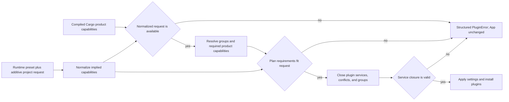

# ADR 0079: Root Product Capabilities and Placeholder Domain Retirement

**Status**: Accepted
**Date**: 2026-07-11
**Refines**: ADR 0001, ADR 0030, ADR 0035, ADR 0044, ADR 0046, ADR 0055, ADR 0056,
ADR 0070

## Context

The root `nara` package currently declares `default = []`, but a fresh no-default dependency tree
still compiles 24 direct engine crates. That tree includes image, render, sprite, tilemap, runtime
UI, tooling, window, and the unused audio placeholder. Feature flags only gate four adapters, so the
root dependency graph does not describe the product a host selected.

Runtime composition has the inverse problem. `ProjectPluginPlan` is a mutually exclusive enum that
mixes execution policy, authoring domains, and platform adapters. `Runtime2dPlugins` installs runtime
UI, `DesktopWgpuPlugins` fixes several independent capabilities into one bundle, and the wgpu crate
unconditionally compiles sprite and UI submitters. A missing backend feature is discovered only
after `apply_project_settings` has inserted resources and plugins into `App`.

These are three different questions:

1. Which product code was compiled into this binary?
2. Which capabilities did a project request from that compiled ceiling?
3. Which plugin closure did the host install into this `App`?

Treating them as one enum creates false defaults, partial setup failures, and dependency coupling.
The current `nara_audio` crate shows the related ownership failure: it is a 20-line placeholder with
no plugin, state machine, service adapter, or production consumer, yet every root build compiles and
exports it.

## Decision

nara uses nested product capability closures:



After normalization, the product-capability invariant is:

```text
required product capabilities of the resolved plugin plan
    <= normalized requested product capabilities
    <= compiled Cargo product capabilities
```

These product sets use stable semantic capability IDs. They are not identical to the general
plugin `provides`/`requires` vocabulary: a plugin plan may close over internal service capabilities
that project data cannot request directly. Composition validates that service-capability closure
separately, including requirements, conflicts, and group membership. A Cargo feature is the
compile-time upper bound, not a request to install plugins. A project request is declarative data,
not authority to compile code or mutate an app. Plugin metadata remains the runtime inspection and
dependency contract.

### Root Cargo capabilities

All root engine-domain dependencies become optional. The root feature vocabulary is deliberately
coarser than the crate graph:

| Feature | Implies | Direct root domain dependencies added |
|---|---|---|
| `runtime-core` | - | `nara_app`, `nara_asset`, `nara_core`, `nara_diagnostic`, `nara_ecs`, `nara_fs`, `nara_gameplay`, `nara_identity`, `nara_input`, `nara_project`, `nara_reflect`, `nara_scene`, `nara_tasks`, `nara_transform`, `nara_window` |
| `runtime-2d` | `runtime-core` | `nara_image`, `nara_material`, `nara_render`, `nara_sprite`, `nara_sprite_render`, `nara_tilemap` |
| `runtime-ui` | `runtime-core` | `nara_image`, `nara_material`, `nara_render`, `nara_ui`, `nara_ui_render` |
| `tooling` | `runtime-core` | `nara_tooling` |
| `asset-watch` | `runtime-core` | `nara_asset_watch` |
| `desktop-winit` | `runtime-core` | `nara_winit`; backend-neutral `nara_window` is already core |
| `render-wgpu` | `runtime-core` | `nara_render`, base `nara_render_wgpu` |
| `tooling-egui` | `tooling` | `nara_tooling_egui` |
| `serde` | no product capability | Weakly forwards serialization into already activated domains only |

`default = ["runtime-core"]`. A no-default build activates no product domain. `serde` alone must not
activate an optional domain. `runtime-ui` does not imply `runtime-2d`: an UI-only product must not
compile sprite or tilemap code. `runtime-core` includes the input compilation capability because
the local/headless product and `nara_gameplay` depend on it; this does not permit `ServerPlugins` to
install raw-input resources.

The old root feature names `winit`, `wgpu`, and `egui` are removed rather than aliased. Feature-gated
root modules and preludes expose only compiled capabilities. The gameplay prelude remains
backend-free and does not expand merely because an adapter feature is active.

### Project requests and plugin composition

`ProjectPluginPlan` is replaced by two independent concepts:

- a small runtime preset for execution policy, initially minimal, local headless, or server;
- an additive project capability set for 2D, runtime UI, tooling, asset watching, and selected host
  adapters.

Presets may imply capabilities, but normalization produces one inspectable set. Explicit and preset
forms that mean the same product must resolve identically. Project content may request less than the
host compiled; it cannot request more or raise host trust.

Composition first builds a pure resolved plan. Before any resource insertion, schedule mutation,
plugin installation, or lifecycle transition it validates:

- requested capabilities are present in the compiled set;
- every implied capability is present;
- plugin requirements, conflicts, and group membership close successfully;
- platform adapters have their required backend-neutral domains;
- the selected runtime preset obeys headless/server exclusions.

Any failure returns a structured, matchable `PluginError` that identifies the unavailable or invalid
capability. The same `App` remains usable for a later valid composition attempt. Diagnostics and task
settings are not installed early as a workaround because that would already be mutation.

### Product plugin groups

`MinimalPlugins`, `HeadlessRuntimePlugins`, and `ServerPlugins` remain runtime-policy groups under
`runtime-core`. `ServerPlugins` never installs raw input even though the binary may compile input.

`Runtime2dPlugins` owns transform/render/image/material/sprite/tilemap product composition and no
runtime UI. A separate runtime-UI group owns runtime UI authoring and submission. Desktop winit,
wgpu, and egui groups are additive adapter groups available only under their corresponding compiled
capability. The fixed `DesktopWgpuPlugins` product bundle is removed; project capability
normalization composes the same pieces without hiding their closure.

The base wgpu adapter owns clear/target/backend operation without permanently compiling every
submitter. `nara_render_wgpu` uses internal optional `sprite-submitter` and `ui-submitter` features.
Their shared backend-private quad representation must not make UI depend on the sprite/tilemap
domain. Root weak feature forwarding activates a submitter only when both its domain capability and
`render-wgpu` are active.

### Project manifest ingest

File-backed composition opens and bounds `nara.toml` through a host-issued `nara_fs` capability.
It passes an immutable byte or UTF-8 candidate into `nara_project`. The project crate owns parsing,
diagnostics, profile overlays, and lowering only; it exposes no ambient `File::open` or authorized
raw-path API. This is the project-manifest application of ADR 0070, not a general VFS owned by
`nara_project`.

### Placeholder retirement and crate admission

RGF-U3 deletes `nara_audio` from workspace membership, the root facade/prelude, and the lockfile. ADR
0030 remains the direction for a future audio vertical slice. No empty `audio` capability is
reserved.

A new engine crate requires a real production consumer and at least two of these demonstrated
benefits:

- dependency or platform isolation;
- cohesive deep ownership of a non-trivial state machine or policy;
- independent optionality, testing, or release pressure;
- multiple consumers that would otherwise duplicate the contract.

Modules may deepen inside an existing crate before these conditions hold. A placeholder crate is
deleted when it loses its consumer or cannot justify the boundary; an accepted future ADR alone is
not an implementation consumer.

#### Proc-macro crate admission evidence

RGF-U2 admits `nara_ecs_derive` and `nara_reflect_derive` through concrete production use rather
than facade presence:

- engine domains and the independent `reference-game` consume `nara_ecs_derive` through the
  public `nara_ecs::Component` and root facade exports;
- the independent `reference-game` uses `nara_reflect_derive` for Player, Enemy, Weapon, and
  Projectile persistent providers, canonical scene/patch round trips, and catalog lineage;
- each proc-macro crate isolates `syn`, `quote`, `proc-macro2`, and `proc-macro-crate` from
  runtime libraries, satisfying dependency isolation;
- each crate owns independent compile diagnostics and dependency-path resolution pressure. UI tests
  cover invalid declarations, while `tests/derive_dependency_fixtures.rs` compiles locked
  independent projects that rename the root `nara` and `nara_ecs` packages.

The root `nara` facade is the distribution boundary, not the production consumer. These derives
generate native component/provider declarations only; they do not own catalog publication,
registry state, dynamic ECS storage, scripting schemas, or generated sidecars.

## Alternatives Considered

### Option A: Keep flat mandatory root dependencies and adapter-only features

**Pros**: Requires no facade gating or project-manifest migration.

**Cons**: `default = []` continues to misrepresent compile cost, unused product domains remain
mandatory, and unavailable project capabilities still fail after partial mutation.

**Decision**: Rejected.

### Option B: Add one root Cargo feature per crate

**Pros**: Gives maximum dependency-tree control and mirrors workspace topology exactly.

**Cons**: Exposes internal crate decomposition as product configuration, creates an unbounded and
mostly invalid feature matrix, and makes project authors resolve engine-internal dependency closure.

**Decision**: Rejected.

### Option C: Add a Bevy-style internal aggregator crate

**Pros**: Centralizes re-exports and feature wiring behind one implementation package.

**Cons**: Duplicates the existing root facade, adds another shallow ownership layer, and solves
neither project-request validation nor plugin preflight. nara does not have Bevy's compatibility
pressure or crate count.

**Decision**: Rejected.

### Option D: Coarse compiled capabilities plus preflighted additive composition

**Pros**: Aligns compile cost, facade visibility, project requests, and installed plugins without
exposing every crate; keeps server installation stricter than the compiled binary; removes shallow
placeholder ownership.

**Cons**: Requires a breaking feature/profile migration, disciplined weak forwarding, and a real
feature-combination test matrix.

**Decision**: Chosen.

## Success Metrics

| Metric | Target | Measurement |
|---|---|---|
| No-default ceiling | No engine product-domain dependency is activated | `cargo tree` and no-default check |
| Default ceiling | Only the declared `runtime-core` closure is active; no image/render/sprite/tilemap/UI/tooling/watch/platform adapter/audio crate | Dependency-tree assertion |
| Weak serde | Serde alone activates no product capability; enabled domains serialize when combined | Feature-matrix checks |
| Product combinations | Every single coarse feature, named product combination, and all-features build compiles | Local and hosted Cargo matrix |
| Pre-mutation rejection | Missing compiled capability leaves resources, plugins, groups, schedules, and lifecycle unchanged | Composition integration test |
| Product request closure | A resolved plan requiring an unrequested product capability is rejected before mutation and a later valid request succeeds | Composition integration test |
| Plugin service closure | A missing service requirement or declared conflict is rejected before mutation and a later valid plan succeeds | Plugin-plan integration test |
| Server isolation | Server installs no raw-input/window/render/tooling/backend resources even when those crates were compiled | Plugin/resource inspection test |
| Submitter isolation | Base wgpu does not compile sprite/UI submitters; 2D and UI enable only their own submitter closure | Feature-tree checks |
| Placeholder retirement | Active workspace, facade, prelude, and lockfile contain no `nara_audio` | Stale-symbol search |
| Crate admission | Every new workspace crate names a real consumer and at least two admission benefits | Architecture review |

## Risks and Mitigations

| Risk | Severity | Likelihood | Mitigation |
|---|---|---:|---|
| Feature combinations become combinatorial | High | Medium | Keep capabilities product-sized; test singles, named products, weak-serde, and all-features rather than arbitrary powersets. |
| Compile, product, and plugin service closures drift | Critical | Medium | Resolve one inspectable composition, compare its required product capabilities with the normalized request and compiled ceiling, then verify its separate service closure and installed group snapshots in tests. |
| Capability failure still mutates `App` indirectly | Critical | Medium | Run all compile/request/requirement/conflict checks before settings, diagnostics, tasks, schedules, or plugins are touched. |
| UI still pulls sprite/tilemap through a shared backend helper | High | High initially | Introduce a backend-private quad representation and assert dependency trees for UI-only and 2D-only products. |
| Server safety is confused with compiled input support | High | Medium | Test installed resources/plugins independently from Cargo membership; keep server group exclusions authoritative. |
| Coarse capabilities hide a useful smaller product | Medium | Low | Add a capability only for a demonstrated product consumer and a measurable dependency or platform boundary. |
| Deleting audio appears to reject the domain | Medium | Medium | Retain ADR 0030 and OQ-014; recreate a crate only with a real import/intent/service/backend vertical slice. |
| Breaking names burden downstream users | Medium | High | Ship one migration entry covering features, plugin/profile data, groups, examples, and cache/source actions; keep no aliases. |

## Consequences

- `default` means the runtime-core product rather than an empty feature list over a broad mandatory
  graph.
- Hosts can compile a superset while projects and plugin groups install a strict subset.
- Capability mismatch becomes retryable pre-mutation setup failure instead of partial app state.
- Runtime 2D, runtime UI, platform adapters, tooling adapters, and backend submitters become
  independently inspectable product choices.
- Root facade items are conditionally visible according to compiled product capabilities.
- `ProjectPluginPlan`, legacy adapter feature names, `DesktopWgpuPlugins`, and the `nara_audio`
  placeholder are intentionally breaking deletions.
- ADR 0030 remains future architecture; it no longer implies a live crate.

## Deferred Decisions

- The first real audio decoder/mixer/device backend and whether its product capability is split
  between stable intent and device playback.
- Dynamic plugin loading, native module ABI compatibility, and runtime acquisition of capabilities
  not compiled into the host.
- Per-target deployment presets beyond the named local/headless/server policies.
- Automated minimization of the full Cargo feature powerset beyond the required named matrix.

## Citations

- [Cargo features](https://doc.rust-lang.org/cargo/reference/features.html)
- [ADR 0001: Runtime Workspace Boundaries](0001-runtime-workspace-boundaries.md)
- [ADR 0030: Audio Strategy](0030-audio-strategy.md)
- [ADR 0035: Project Manifest and Runtime Settings Authority](0035-project-manifest-and-runtime-settings-authority.md)
- [ADR 0044: Root Facade and Prelude Layering Policy](0044-root-facade-and-prelude-layering-policy.md)
- [ADR 0046: Plugin Metadata and Default Plugin Groups](0046-plugin-metadata-and-default-plugin-groups.md)
- [ADR 0055: Feature Matrix, Boundary Checks, and Compatibility Fixtures](0055-feature-matrix-boundary-checks-and-compatibility-fixtures.md)
- [ADR 0056: Headless Runtime and Dedicated Server Readiness](0056-headless-runtime-and-dedicated-server-readiness.md)
- [ADR 0070: Capability-Oriented Filesystem Substrate](0070-capability-oriented-filesystem-substrate.md)
- `Cargo.toml`
- `src/lib.rs`
- `crates/nara_project/src/manifest.rs`
- `crates/nara_render_wgpu/Cargo.toml`
- `crates/nara_audio/src/lib.rs`
