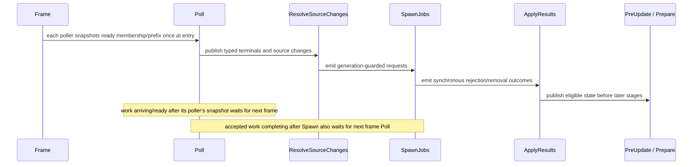

# ADR 0080: Domain-Owned TaskUpdate Integration Sets

**Status**: Accepted
**Date**: 2026-07-11
**Refines**: ADR 0007, ADR 0008, ADR 0033, ADR 0042, ADR 0052

## Context

ADR 0008 correctly established `CoreStage::TaskUpdate` as the first main-thread integration point
for background work. Its initial implementation also placed
`TaskUpdateSet::{Poll, CoalesceAssetChanges, SpawnAssetJobs, ApplyAssetResults}` in `nara_app` and
configured that chain from `nara_tasks::TaskPlugin`.

Those set names are not application or task-executor concepts. They describe the asset/watch/image
workflow. The current ownership forces the app crate to know asset vocabulary and makes the generic
task crate configure business scheduling for domains it does not depend on. Future physics,
scripting, editor, or networking integration would either enlarge the global enum or reuse phases
whose same-frame semantics do not match.

The stage boundary and the domain phase boundary solve different problems:

- `nara_app` decides when background results may integrate with the main world;
- `nara_tasks` decides how work is admitted, executed, cancelled, observed, ordered, and shut down;
- each business domain decides how its typed terminals and synchronous outcomes move through its
  state machine.

The asset chain already has load-bearing frame semantics. Moving only the enum without documenting
them could make a terminal visible one frame too early or too late.

## Decision

`nara_app` owns `CoreStage::TaskUpdate` and no business-domain system set. `nara_tasks` owns bounded
execution mechanics and configures no business-domain system set. Domains own their integration set
vocabulary and ordering.

The first domain-owned vocabulary is:

```text
nara_asset::AssetTaskUpdateSet
  Poll
  ResolveSourceChanges
  SpawnJobs
  ApplyResults
```

`AssetPlugin` configures these sets as one chained order inside `CoreStage::TaskUpdate`. The names
describe outcomes rather than one implementation: each Poll system captures one immutable ready
membership or queue prefix from its source at system entry, ResolveSourceChanges coalesces and
lowers source events, SpawnJobs attempts bounded work, and ApplyResults commits eligible typed
outcomes under generation/version and ordered-prefix guards. Task pollers snapshot ready terminal
IDs; watcher pollers atomically take the queue prefix present at entry.



### Ownership

- `nara_app` exports `CoreStage::TaskUpdate`. It does not export `TaskUpdateSet` or an alias.
- `nara_tasks::TaskPlugin` installs task pools and owns finite cleanup. It exposes typed terminal
  handles, cancellation, ordered integration helpers, and statistics without configuring asset or
  other domain sets.
- `nara_asset` exports `AssetTaskUpdateSet` and `AssetPlugin` configures its chain.
- `nara_asset_watch` joins `AssetTaskUpdateSet::Poll` after translating platform events into typed
  asset source changes.
- Asset source resolution joins `ResolveSourceChanges`.
- `nara_image` polls typed reload terminals in Poll, attempts new work in SpawnJobs, and commits
  eligible results in ApplyResults.
- The root facade exposes `AssetTaskUpdateSet` only through `advanced_prelude` or the asset module;
  ordinary gameplay prelude users do not need business integration phases.

Other domains may define their own `SystemSet` vocabulary when they have a concrete multi-phase
integration contract. Merely using `nara_tasks` does not justify a new global phase. Separate domain
sets have no implicit order relative to one another; composition declares a cross-domain relation
only when a real data dependency requires it.

### Frame-boundary semantics

`Poll` is an ordered set, not one atomic instant. Each poller captures exactly one immutable ready
membership or queue prefix when that system begins and consumes only that snapshot during the
invocation. A task poller records ready terminal IDs; a watcher poller atomically takes the prefix
already queued. Work that becomes ready or arrives after that poller's snapshot, including while
another Poll system is still running, waits until that poller executes in the next app frame. This
gives each poller a deterministic cutoff without inventing a domain-wide barrier across independent
sources.

The asset chain has three exact cases:

1. A typed terminal in its poller's entry snapshot is observed in that app frame. ApplyResults
   evaluates generation and expected-version eligibility against the state current at commit time.
   An eligible outcome not blocked by a missing ordered-stream predecessor must apply before
   same-frame `PreUpdate` and render Prepare. A stale or superseded outcome is retired/discarded and
   counted under domain policy; only a predecessor-blocked eligible outcome remains buffered.
2. A worker terminal that becomes ready after its poller's entry snapshot cannot enter
   ApplyResults directly. This includes completion during Poll and completion after SpawnJobs; its
   earliest observation and apply opportunity is the next app frame.
3. A synchronous rejection, cancellation-before-admission, source removal, or equivalent outcome
   produced by the main-thread SpawnJobs system enters the domain apply queue directly. If it is
   current-generation, expected-version eligible, and predecessor-unblocked at commit time,
   ApplyResults must apply it later in the same frame; if it has become stale, ApplyResults retires
   it. It is not an asynchronous worker completion and does not need to masquerade as one.

Apply systems continue to enforce expected generation/version, ordered-prefix, and last-good asset
policy. Schedule ordering does not authorize stale results or partial publication.

### Migration

U33 deletes `nara_app::TaskUpdateSet` without a compatibility alias, migrates every app/task/asset/
watch/image caller, and updates canonical ADR and facade vocabulary in one unit. Tests first
characterize current same-frame and next-frame behavior so the move is ownership-only unless this
ADR explicitly changes a case. Stale-symbol checks cover live Rust source, facade exports, examples,
tests, and current-policy ownership statements. ADR migration explanations and immutable historical
engineering-memory records may retain the old name as evidence.

## Alternatives Considered

### Option A: Keep the asset-named global enum in `nara_app`

**Pros**: No public symbol migration and one obvious global ordering chain.

**Cons**: The foundational app crate owns asset business language, future domains either pollute the
same enum or adopt false semantics, and dependency direction is inverted conceptually.

**Decision**: Rejected.

### Option B: Move all integration phases into `nara_tasks`

**Pros**: Keeps task-related names in one crate and removes them from `nara_app`.

**Cons**: Execution mechanics still own domain policy, every task consumer inherits phases it may
not need, and the task crate becomes a type-erased workflow coordinator.

**Decision**: Rejected.

### Option C: Use one generic global Poll/Spawn/Apply chain for every domain

**Pros**: Provides a small reusable vocabulary and predictable high-level order.

**Cons**: Implies cross-domain ordering and same-frame visibility that may not exist, hides source
resolution as an asset-specific phase, and makes unrelated domains share a synchronization barrier.

**Decision**: Rejected.

### Option D: Keep the app stage and let domains own integration sets

**Pros**: Preserves one explicit main-thread boundary, restores dependency ownership, keeps typed
domain state machines inspectable, and allows each domain to specify only the ordering it proves.

**Cons**: Advanced composition may need explicit cross-domain set ordering, and users extending a
domain must import its schedule vocabulary rather than one global enum.

**Decision**: Chosen.

## Success Metrics

| Metric | Target | Measurement |
|---|---|---|
| App ownership | `nara_app` exports the stage but contains no asset integration-set vocabulary | Source/API search |
| Task ownership | `TaskPlugin` configures no business-domain set | Plugin schedule inspection test |
| Asset ownership | `AssetPlugin` exports and configures the complete four-set chain | Focused asset tests |
| Same-frame terminal | A current-generation, expected-version eligible, predecessor-unblocked terminal in its poller's entry snapshot applies before same-frame PreUpdate/Prepare | Integration test |
| During-Poll cutoff | Work becoming ready or entering a queue after its poller's entry snapshot is not observed until the next app frame | Controlled race and queue-prefix tests |
| Next-frame async result | Work accepted after its poller's snapshot never applies until the next frame Poll | Controlled task test |
| Same-frame rejection | An eligible synchronous SpawnJobs rejection/removal applies in that frame | Failure-path integration test |
| Stale retirement | An outcome that becomes stale after Poll but before ApplyResults is retired once rather than buffered or retried | Apply-time generation race test |
| Consumer migration | Watcher, resolver, image spawn/poll/apply, facade, live source, tests, and current-policy docs use only `AssetTaskUpdateSet`; migration/history evidence may name the old symbol | Scoped stale-symbol search |
| Domain independence | An unrelated domain set has no dependency edge relative to assets unless composition declares one | Schedule graph/ambiguity inspection test |

## Risks and Mitigations

| Risk | Severity | Likelihood | Mitigation |
|---|---|---:|---|
| Set migration changes frame visibility | Critical | Medium | Characterize entry-snapshot, during-Poll completion, post-Spawn completion, synchronous outcome, and predecessor-blocked cases before moving symbols, then retain those assertions after migration. |
| Multiple plugins configure the chain differently | High | Medium | Make `AssetPlugin` the single owner and test duplicate/idempotent plugin composition. |
| Async completion bypasses Poll into same-frame Apply | High | Medium | Keep worker terminals behind the poll-owned typed queue; only explicitly synchronous main-thread outcomes use the direct apply queue. |
| Stale observed work is buffered forever | High | Medium | Re-check generation/version at ApplyResults, retire stale/superseded work with accounting, and buffer only eligible ordered-prefix work missing a predecessor. |
| Independent domains accidentally rely on insertion order | High | Medium | Declare no implicit cross-domain order and require a named composition relation plus integration test for real dependencies. |
| Advanced set type leaks into gameplay prelude | Medium | Medium | Export through the asset module and `advanced_prelude` only. |
| Domain-owned sets duplicate generic mechanics | Medium | Low | Keep typed terminal ordering/cancellation/backpressure helpers in `nara_tasks`; domain sets own only workflow policy. |

## Consequences

- The main-thread integration point remains stable and visible in `nara_app`.
- `nara_tasks` becomes a deeper execution module with no asset scheduling knowledge.
- Asset/watch/image ordering is named and configured by its actual owner.
- `nara_app::TaskUpdateSet` is a breaking deletion; the canonical replacement for asset consumers is
  `nara_asset::AssetTaskUpdateSet`.
- Same-frame visibility is a domain contract rather than an accidental consequence of where a
  global enum lives.
- Future task-consuming domains do not add variants to an app-global business workflow.

## Deferred Decisions

- Whether a second production domain proves a smaller shared integration-set pattern without
  centralizing domain policy.
- Cross-domain ordering between asset availability and future script, physics, networking, or audio
  result integration, triggered by an actual typed data dependency.
- Moving TaskUpdate integration onto a render/service host; this ADR retains the current main-world
  stage boundary.

## Citations

- [ADR 0007: Asset Identity and Import Pipeline](0007-asset-identity-and-import-pipeline.md)
- [ADR 0008: Runtime Concurrency and Task Pools](0008-runtime-concurrency-and-task-pools.md)
- [ADR 0033: Asset Import and Render Resource Preparation Seam](0033-asset-import-and-render-resource-preparation-seam.md)
- [ADR 0042: Runtime Service and Backend Boundary](0042-runtime-service-and-backend-boundary.md)
- [ADR 0052: Task Backpressure, Cancellation, and Long-Running Diagnostics](0052-task-backpressure-cancellation-and-long-running-diagnostics.md)
- `crates/nara_app/src/lib.rs`
- `crates/nara_tasks/src/runtime.rs`
- `crates/nara_asset/src/reload.rs`
- `crates/nara_asset_watch/src/lib.rs`
- `crates/nara_image/src/lib.rs`
