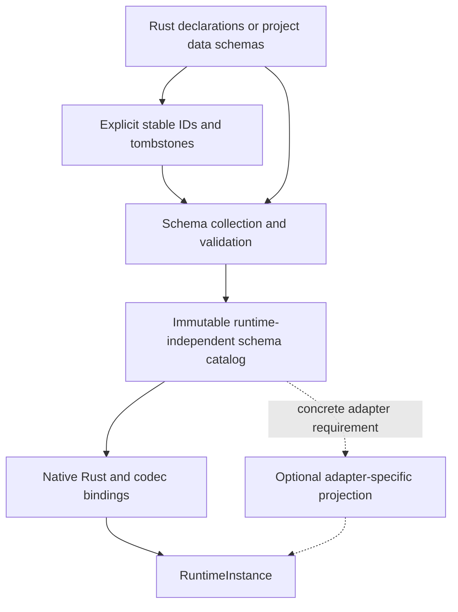
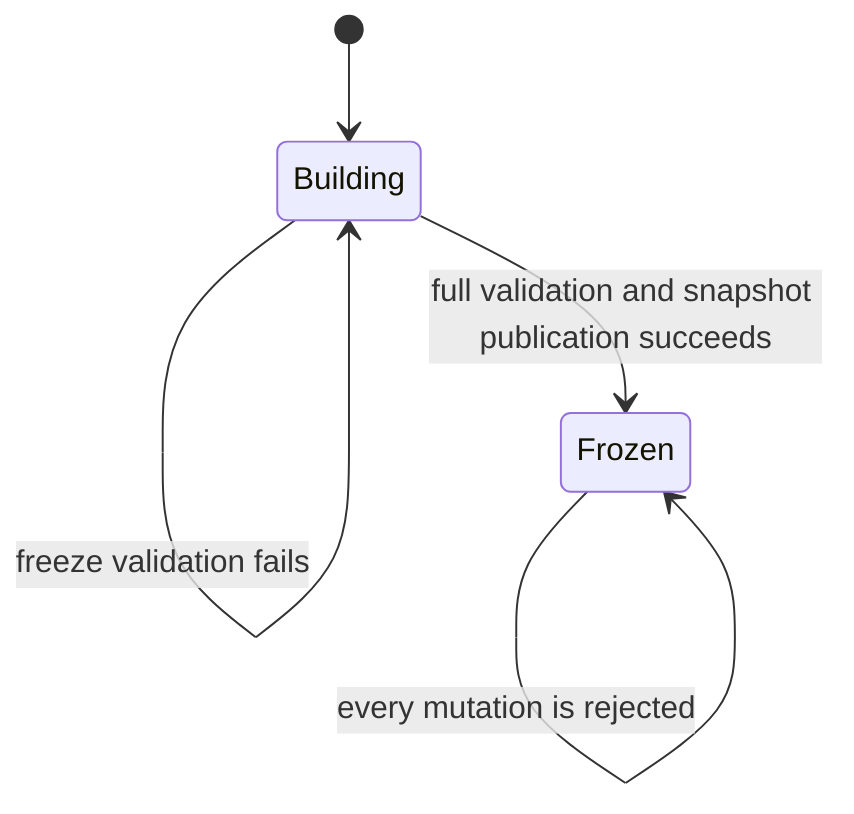

# ADR 0081: Schema Source, Stable Identity, Catalog, and Runtime Binding

**Status**: Accepted
**Date**: 2026-07-12
**Last Revised**: 2026-07-18
**Implemented Slices**: RGF-U1 canonical catalog and native binding boundary on 2026-07-12; RGF-U2
native Rust derive authoring and public headless consumer on 2026-07-13; RGF-U12 World-independent
content/fingerprint handoff on 2026-07-18; RGF-U29 explicit persistent composition and guarded
target-World eligibility on 2026-07-18
**Refines**: ADR 0011, ADR 0045, ADR 0051
**Refined By**: [ADR 0095](0095-plugin-owned-specialized-domains-and-project-configuration.md)
**Related**: ADR 0034, ADR 0058, ADR 0076

## ADR 0095 Refinement

A schema owner's durable identity/version/tombstone lineage is distinct from one product recipe's
composed catalog fingerprint. Omitting an optional plugin from a composition does not tombstone its
types and must not prevent later reactivation of the same compatible owner lineage. Runtime still
requires a complete frozen native binding registry. Lossless authoring with known-but-unbound or
unknown schema remains Proposed under ADR 0090; until admitted, missing schema fails closed rather
than creating placeholders.

## Context

ADR 0011 made `ComponentTypeId` independent from Rust type names, but the first implementation still
mixes four different concerns in `ComponentRegistry`:

- persistent component identity and field paths;
- exported schema metadata;
- Rust `TypeId` and `rust_type_path` bindings;
- Bevy reflection, codecs, and migration closures.

That shape is not suitable for the canonical version-1 schema catalog required by ADR 0051. A Rust
type path is process/toolchain binding metadata rather than persistent identity, and a name-based
field path changes when an author renames a field. Nara's Rust-first product direction still needs
scene, prefab, save, inspector, and patch data to survive refactors and runtime reconstruction.

The schema catalog must therefore become stable before it becomes persistent. This ADR only closes
the identity, authority, catalog, binding, and freeze boundaries needed by RGF-U1. It does not
select a scripting language or implement dynamic ECS components.

## Decision

Nara separates schema declaration authority, compiled semantic authority, and runtime binding
authority.

### Authority Layers

1. Native Rust declarations and project data formats own semantic declarations. Stable IDs and
   tombstones should be explicit in their source when practical; an engine-managed,
   version-controlled sidecar is allowed only when an authoring format cannot retain them safely.
2. A validated immutable catalog is the semantic authority consumed by runtimes, tools, validators,
   and code generators. The catalog is derived and rebuildable from the declaration source plus its
   identity sidecar.
3. A runtime binding registry maps catalog identities to Rust/Bevy types, codecs, migration code, or
   a future dynamic representation. Runtime binding metadata is not persistent schema identity.

No layer may silently manufacture a replacement identity from a Rust path, display name, field
name, or current runtime `ComponentId`.

### Stable Type and Field Identity

- `ComponentTypeId` remains the stable identity for the component-role slice of the schema catalog.
  It is an opaque, bounded string. Existing built-in reverse-domain IDs become permanent tokens;
  their resemblance to names does not make them renameable aliases.
- Every catalog field has a `ComponentFieldId`. It is opaque, bounded, unique within its owning
  component type, never reused, and retained as a tombstone after deletion.
- Type and field display names are mutable aliases. Renaming an alias does not change an ID and does
  not require a persistent field-reference migration.
- `ComponentFieldPath` locates data inside the current version's `ComponentValue`. It is a codec and
  value-layout locator, not durable field identity.
- Persistent patch operations and other durable field references use
  `ComponentTypeId + ComponentFieldId`. The active schema resolves that identity to the current
  value path before validation or mutation.
- Moving a field between owning types, splitting or merging fields, or changing semantics requires
  an explicit migration. A storage-path change that preserves one field ID is handled by the
  component value migration and current catalog mapping.
- Durable field writes carry the component schema version that defines their value semantics.
  Stable identity alone cannot upgrade an old field value: until a dedicated field-value migration
  contract exists, writes from an older component version are rejected. Whole-component values use
  the registered component migration chain; identity-only field removal may resolve against the
  current catalog.
- Identity allocation and tombstone persistence for generated or adapter-owned schemas belong to
  the concrete generator or adapter. RGF-U1 establishes the catalog contract but does not invent a
  universal source language or sidecar format.

The version-1 wire representation uses validated strings for type and field IDs. This ADR does not
require UUIDs or numeric IDs; a later encoding change requires a new catalog format version rather
than reinterpretation of version 1.

### Runtime-Independent Persistent Catalog

The persistent catalog contains only stable semantic data:

- catalog format version and a separate catalog generation/fingerprint seam;
- type IDs, aliases, schema versions, roles, and capabilities;
- field IDs, aliases, current value locators, value kinds, defaults, and capabilities;
- retained type and field tombstones needed to prove non-reuse.

The catalog must not contain Rust `TypeId`, `rust_type_path`, Bevy `ComponentId`, codec closures,
function pointers, VM handles, or backend-native values. Rust paths may remain non-persistent debug
metadata on a native binding.

The first RGF-U1 catalog contains only component-role declarations. Plain values, data assets,
commands, and events may later reuse the same stable identity discipline when a real persistent
format needs it; this ADR does not require one universal project type system.

The version-1 catalog does not encode Bevy required-component closures, component lifecycle hooks,
or observers. Its generation/fingerprint therefore cannot certify a persistent binding whose
durable composition, defaults, or construction side effects depend on those mechanisms.

Eligibility is therefore two-phase:

1. provider validation/freeze registers the native component in an isolated scratch ECS registry
   when necessary and rejects required-component or intrinsic `ComponentHooks` metadata that can
   participate in persistent insertion/removal; and
2. every actual persistent apply flushes deferred work, records the post-flush rejection baseline,
   and takes one exclusive target `World` borrow. A fresh-target apply rechecks real `ComponentInfo`
   values plus matching event-global/component-global lifecycle observers before allocation and
   retains exclusivity through allocation and persistent insertion. An apply to an already existing
   or reserved target additionally checks entity and entity+component scopes before its first
   persistent mutation. Rejection leaves the applicable post-flush baseline unchanged.

The second check rejects late required/hook registration and active `Add`/`Insert`/`Discard`/
`Remove`/`Despawn` observers that insertion, replacement, removal, or despawn could trigger for the
affected persistent apply. Across fresh- and existing-target paths it covers event-global,
component-global, entity, and entity+component observer scopes rather than inspecting only
component-targeted entries, and it inspects target-World
`ComponentInfo` hooks so `World::register_component_hooks*` cannot bypass provider-freeze checks.
In the current Bevy substrate, replacement is not a sixth lifecycle event: it triggers `Discard`
for the old value followed by `Insert` for the new value, so both caches are part of the check.
Post-publication World-local hooks and runtime observers are allowed. A later persistent apply
rejects while a matching hook remains installed; for a matching observer it may instead wait for an
explicit Host safe point that disables that observer. Runtime-only ECS components, unrelated
custom-event observers, and post-spawn runtime projections remain free to use Bevy-local mechanisms
outside document truth.

A content snapshot may certify bounded document/schema decoding and the explicit persistent set; it
does not certify a future target `World`'s observer or component-registration topology. Runtime
construction and every direct persistent-spawn path own the second check.

Any future catalog-derived persistent composition must add stable `ComponentTypeId` dependencies,
bounded deterministic closure and cycle rules, default/override/removal semantics, migrations, and
unavailable-provider behavior to a versioned fingerprint. It must agree across Scene, Prefab,
Inspector, migration, and direct persistent-spawn paths. ADR 0006 defines the current explicit-set
rule and OQ-043 owns the future carrier decision.

File `format_version`, catalog generation/fingerprint, per-type schema version, and
`engine_min_version` are distinct axes. None may be reused as another axis.

### Capabilities and Whole-Value Access

Component and field capability defaults are empty. Canonical version 1 contains exactly `scene`,
`inspect`, `edit`, `asset_ref`, and `entity_ref`. The first three are component-and-field
eligibility gates. `asset_ref` and `entity_ref` are field-only value-kind markers and are rejected
at component scope. Save, animation, replication, scripting, diagnostics, and runtime-only state do
not have speculative wire capabilities; a concrete domain consumer must admit each future value.

An operation is eligible only when both the component and every touched field grant the required
capability. Whole-value encode/apply paths must prove complete declared-field coverage and reject
unknown or ineligible fields. A mixed-capability value returns a projection-required error rather
than silently filtering fields. Field-level patch operations are the explicit projection path.

`inspect` is eligibility only. It does not replace the host disclosure/redaction policy required by
ADR 0076.

### Freeze and Runtime Ownership

Each runtime-owned registry has a one-way state transition:

- Component owners register schemas and bindings only during plugin `build`.
- The reflection/schema registry plugin owns `freeze` in plugin `finish`. Schema provider plugins
  require that owner, so its build creates the registry before providers register and its finish
  freezes before the app can become `Ready`.
- Freeze atomically validates identity uniqueness/non-reuse, aliases, fields, capability scope,
  defaults, migrations, and required runtime bindings. Failure publishes no frozen snapshot and
  causes normal fallible plugin finish failure.
- Frozen registries expose no unchecked mutable Bevy type registry, codec table, migration table,
  schema, or capability path.
- A structural catalog change builds and validates a fresh `RuntimeInstance`; an active runtime is
  never unfrozen or modified in place. Presentation-only UI state may live outside the frozen
  catalog, but catalog aliases themselves change only in a new catalog generation.

### Implemented RGF-U2 Rust Authoring Slice

Native Rust components may derive `PersistentComponent` beside `Component`. The declaration
provides explicit component and field IDs, aliases, schema version, capabilities, and retained field
tombstones once; the derive generates the native `PersistentComponentProvider`, schema, decoder,
and encoder. Runtime-only components continue to derive only `Component` and remain absent from
the persistent catalog.

Component-owning plugins call `validate_persistent_component::<T>` during read-only preflight and
`register_persistent_component::<T>` during build. Validation performs the same complete schema
and binding checks as registration without mutation. The registry owner still freezes the complete
candidate during plugin finish; the derive cannot publish, replace, or unfreeze a catalog.

The first admitted field types are `i64`, `u64`, `Vec2`, and `EntityReference`.
Entity references require `entity_ref`; `asset_ref`, collections, generics, enums, tuple
structs, and arbitrary nested Rust types remain rejected until a production consumer proves their
codec and schema contract.

The independent `reference-game` is the public production consumer. Its four components use only
root exports, freeze against a committed predecessor catalog, round-trip through canonical
`SceneDocument` and stable-ID `ScenePatchDocument` files, and materialize into a live world.
Locked renamed-dependency fixtures verify root and ECS derive path resolution.

This slice does not admit dynamic non-Rust component storage, a universal schema compiler, generated
schema sidecars, a scripting ABI, or adapter-owned catalog projection.

### Implemented RGF-U12 Content Fingerprint Slice

`ProjectContentLoader` consumes the frozen `SchemaValidationInput` carried by the matching
`RuntimePlan`. Scene and prefab component values decode and validate against that registry, while
`collect_declared_asset_references` traverses only fields whose frozen schema declares
`asset_ref`. Unknown fields, undeclared reference shapes, incompatible providers, and a changed
catalog reject before snapshot publication.

The immutable `ProjectContentSnapshot` carries the same opaque project lineage, catalog
fingerprint, and schema generation together with the explicit expanded stable-ID document set,
content revision, and content digest. It stores no native type/codec binding and does not certify a
future target `World`'s required-component, hook, or observer topology. RGF-U29 now supplies the
separate provider-freeze and per-apply target-World eligibility proof; U24 later compares the fresh
runtime registry before materialization.

### Implemented RGF-U29 Persistent Apply Slice

Persistent codecs produce `PreparedComponentCandidate`, which has no public apply operation. A
frozen `ComponentRegistry` alone may bind the candidate's stable component identity, Rust type,
registration function, and target-World validator into `PreparedComponent`. Building registries
expose no applicable candidate, and compile-fail coverage prevents external construction of the
bound type.

Provider validation rejects Scene-capable component types with Bevy required-component metadata or
intrinsic lifecycle hooks. Each real persistent apply then flushes deferred registration and checks
the target World under one exclusive borrow. Fresh targets cover real component metadata plus
event-global/component-global Add, Insert, Discard, Remove, and Despawn observers before allocation;
existing or reserved targets also cover entity and entity+component scopes before mutation.

Private target receipts and a World-global bidirectional stable/runtime binding authority preserve
identity across target retirement and reject missing authority, collisions, temporal rebinding, and
cross-World use. Asset preparation separately declares whether it may need `AssetServer`, so an
asset-free value neither rejects an unrelated resource observer nor inserts the resource.

The Bevy-version-coupled hook and observer probes remain in `nara_ecs::__private`. Runtime-only
components and post-publication runtime behavior remain valid; later persistent work rechecks the
current topology. This slice proves pre-mutation rejection, not rollback of arbitrary lifecycle or
native-service side effects.

### Persistent File Boundary

A complete file envelope belongs only to a top-level file. Embedded semantic records do not repeat
file generator or minimum-engine metadata. In particular, `PrefabInstance` embeds a versioned patch
record, while a standalone scene-patch file wraps that record in the shared ADR 0051 envelope.

The RGF-U1 compatibility matrix contains exactly four version-1 kinds: scene, prefab, scene patch,
and component schema catalog. There is no speculative document migration registry while all
matrices are version-1-only.

## Alternatives Considered

### Option A: Keep the Rust-bound, name-path catalog

**Pros**: Smallest immediate change and preserves current tests.

**Cons**: Freezes `rust_type_path` and rename-sensitive paths into canonical version 1 and
guarantees another persistent-format reset after an ordinary Rust refactor.

**Decision**: Rejected.

### Option B: Use stable type IDs but retain name-based durable field paths

**Pros**: Preserves most patch APIs and component registrations.

**Cons**: A field rename changes durable addresses, forces unnecessary migrations, and contradicts
the non-reused field identity contract.

**Decision**: Rejected.

### Option C: Separate stable field IDs from current value locators

**Pros**: Alias and storage-path changes can preserve identity, catalogs remain independent from
process-local Rust/Bevy bindings, and patches resolve through one validated authority.

**Cons**: Requires a breaking patch/schema API migration and explicit IDs for every built-in field.

**Decision**: Chosen.

### Option D: Implement dynamic ECS lowering and a universal scripting host in RGF-U1

**Pros**: Proves the full product direction immediately.

**Cons**: Couples persistence foundation work to unproven non-Rust component, query, scripting,
and reload requirements and exceeds RGF-U1's dependency evidence.

**Decision**: Rejected for RGF-U1 and retained as a later evidence-driven slice.

## Success Metrics

| Metric | Target | Measurement |
|---|---:|---|
| Rename-safe identity | Type/field alias changes preserve stable IDs and durable patch targets | Catalog and patch tests |
| Runtime independence | Canonical catalog fixtures contain no process-local Rust/Bevy/codec identity | Golden-file tests and stale search |
| Non-reuse | Duplicate or tombstoned type/field IDs fail before catalog publication | Registry freeze tests |
| Frozen authority | Every schema, binding, codec, and migration mutation fails after freeze | Registry state-machine tests |
| Whole-value safety | Mixed-capability whole values never reach encode/apply | Projection gate tests |
| Runtime isolation | Structural catalog changes require a fresh runtime snapshot | Plugin/runtime lifecycle tests |
| Composition truth | A catalog fingerprint cannot remain valid while an unmodeled Bevy requirement or hook changes persistent spawn semantics | Persistent-binding eligibility and scene composition tests |
| Scope control | Dynamic ECS and universal scripting-host APIs are absent from RGF-U1 | API and dependency review |

## Risks and Mitigations

| Risk | Severity | Likelihood | Mitigation |
|---|---|---:|---|
| Human-readable IDs are accidentally treated as aliases | High | Medium | Validate and document IDs as opaque permanent tokens; expose aliases separately. |
| Field-ID registration becomes verbose | Medium | High | Allow explicit named presets/builders, but never infer identity or capability from Rust fields. |
| Freeze order depends on plugin installation accidents | High | Medium | Require the registry-owner plugin through plugin metadata and reject registration outside build. |
| Catalog and native bindings diverge | High | Medium | Freeze validates complete binding coverage for native component declarations. |
| Required components or hooks change runtime meaning without changing the catalog | Critical | Medium | Reject hook/require-dependent persistent bindings until the behavior is stable-ID modeled and fingerprinted. |
| Future dynamic representation pressures the v1 catalog | Medium | Medium | Keep runtime layout and `ComponentId` outside the persistent catalog. |
| Tombstone policy grows without a source compiler | Medium | Low | RGF-U1 models and validates tombstones; the later compiler owns allocation and sidecar persistence. |

## Consequences

- ADR 0011's namespaced strings remain valid only as opaque permanent component IDs, not as mutable
  type names.
- `ComponentSchema` and the persistent catalog must lose `rust_type_path`; native binding metadata
  retains it outside the wire model.
- `ComponentFieldId` becomes the durable patch and schema reference; `ComponentFieldPath` becomes a
  current value-layout locator.
- Existing built-in registrations must declare IDs, aliases, capabilities, and value locators
  explicitly before RGF-U1 freezes the registry.
- Existing bare scene/prefab/patch readers and the Rust-bound catalog are prototype shapes and must
  not survive as hidden version-1 compatibility readers.
- Dynamic non-Rust components, per-World dynamic `ComponentId`, `RuntimeSchemaRecord`, generated
  schema sidecars, scripting adapters, and adapter-specific hot replacement require separate,
  evidence-backed decisions.
