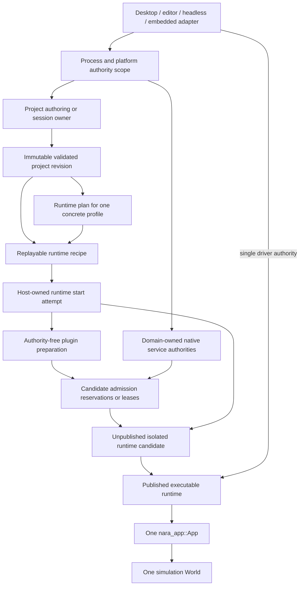

# ADR 0082: Process Host Authority and Runtime Construction Topology

**Status**: Proposed
**Date**: 2026-07-13
**Last Revised**: 2026-07-21
**Owner**: Product composition and executable hosts
**Admission Trigger**: RGF-U3, RGF-U4, and RGF-U12 prove bounded settings, pure profile planning,
and immutable startup content; RGF-U26 freezes the task-equivalent manual counterfactual and
RGF-U24 supplies concrete headless Host and U26 reversal evidence before RGF-U17/RGF-U13 diffuse it
into Editor and desktop Hosts, and RGF-U23 decides this ADR independently
before checking compatibility with the executable-runtime decision
**Revisit Trigger**: A second concurrent runtime or platform-affine service proves that the proposed
scope graph cannot express required sharing or shutdown ordering
**Related**: ADR 0035, ADR 0042, ADR 0050, ADR 0070, ADR 0078, ADR 0079, ADR 0084, ADR 0094

## Context

Nara already assigns important responsibilities to the correct domains:

- the executable host obtains filesystem and platform authority;
- `nara_project` parses and lowers project data without performing runtime side effects;
- domain services and backend adapters own native handles, threads, and queues;
- product, plugin, service, requirement, and conflict closure must validate before `App` mutation;
- an isolated runtime owns simulation state and is rebuilt for structural changes.

Those rules are distributed across several ADRs. They do not yet form one authority and lifetime
graph that answers these product-level questions:

- Which authority may open project files, create native services, and construct runtimes?
- Which state may be shared across runtime generations, and which state must be isolated?
- When does an initialized runtime candidate become visible to an editor, runner, or server?
- In what order do runtime sessions, surfaces, windows, workers, and process services close?
- Can code-first embedded applications use the same engine without adopting a mandatory editor or
  project-host object model?

Leaving these answers implicit would make the editor, desktop runner, headless runner, and future
export tooling grow separate construction and shutdown semantics. Conversely, selecting a public
universal `EngineHost` or process-global service hub before there are multiple consumers would
freeze speculative APIs.

## Trial Evidence

RGF-U24 implements one bounded private headless `ProjectHost` behind the public `HeadlessRun`
action. It binds one authorized project root, immutable plan/content lineage, a fresh start epoch,
one obligation ledger, an unpublished candidate, atomic runtime publication, exact fixed-tick
driving, and retryable cleanup. The same committed task and three failure cuts match the U26 manual
counterfactual without exposing a universal Host/factory Interface or moving project authority into
`nara_app`.

RGF-U13 adds the desktop parent/child path and RGF-U17 adds the Editor path: concrete Hosts own
runtime construction, parent lifetime, control, and finite retirement while gameplay/tooling do not
receive process or native authority. This evidence still does not establish a shared process
service scope, multi-runtime sharing, package/build Host topology, or final public placement of
advanced types. The independent U23 decision remains required, so this ADR stays Proposed.

## Decision

If accepted, nara will use an explicit authority and lifetime scope graph for product hosts. This
ADR selects process/project authority placement, service-authority placement, and parent/child
lifetime rules. ADR 0084 exclusively owns the executable-runtime candidate's internal startup,
publication, fault, and close state machine. This ADR does not require public Rust types with the
conceptual names shown below.



### Authority Scopes

The conceptual scopes have these contracts:

| Scope | Owns | Must not become |
|---|---|---|
| Process/platform authority | OS event-loop access, host-issued filesystem capabilities, and domain-native authority creation | A global gameplay service locator |
| Project/session owner | Project documents, workspace state, selected profile, and immutable validated revisions | An ECS resource or backend owner |
| Runtime recipe | Validated project revision, resolved composition plan, scene snapshot, and versioned immutable inputs needed to reconstruct a runtime | A captured `World`, active task, native handle, or one-shot closure |
| Domain service authority | Native handles, affinity, queues, workers, and backend diagnostics for one domain | Persistent project data or generic cross-domain registry |
| Executable runtime | The lifecycle state delegated to ADR 0084 around one runtime generation and one `App` | A second scheduler or plugin authority beside `App` |
| `App` | Plugin lifecycle, schedules, time, the simulation `World`, and main-thread integration | Project workspace, filesystem authority, or process-global service hub |

These are scopes and roles, not required public structs, traits, crates, or fields. A standalone
binary may collapse several scopes into one private owner. The ownership rules and lifetime order
must remain observable even when the implementation is compact.

Concrete root composition also closes every authority role admitted by its owning decision before
it starts a runtime:

- one selected Platform/Runner Adapter drives each admitted process/runtime-driver scope and
  supplies platform events, elapsed time, wake/close behavior, and process-affine target authority;
- the stock render execution authority owns each selected GPU device domain under ADR 0078 and ADR
  0094; this proposal does not admit a replacement Render Host role;
- zero or more domain service Adapters own separately declared service authorities.

Those cardinalities belong to their domain contracts, not ordinary plugin replacement slots. For
each role separately admitted by its owning ADR, a first-party default and an external compiled
candidate use the same explicit selection and conformance path; neither a crate path nor a
first-party ID is admission policy. A future package may aggregate admitted Platform/Runner,
service, runtime-plugin, and separately admitted render roles behind one product-level choice. ADR
0094 keeps replacement Render Host authority candidate-only until its own production workflow and
decision admit it. The exact split between platform display/window ownership and runtime driving
must be proven by concrete Adapters rather than frozen as one giant trait.

### Host Admission and Runtime Delegation

The Host prepares validated immutable inputs, begins one owned construction attempt, and issues
authority only when that attempt requests it:

```mermaid
sequenceDiagram
    participant Host as Executable host
    participant Project as Project authority
    participant Service as Domain services
    participant Start as ADR 0084 runtime start attempt
    participant Consumer as Editor / runner

    Host->>Project: Read bounded bytes through host-issued capability
    Project-->>Host: Immutable validated project revision
    Host->>Host: Resolve capability, plugin, service, conflict, and order closure
    Host->>Service: Pure service admission preflight
    Service-->>Host: Validated dependency DAG and admission requirements
    Host->>Start: Begin with recipe and immutable admission requirements
    Start->>Start: Establish the obligation ledger and logical publication reservation
    Start->>Start: Prepare repeatable plugin instances under the ledger without Host authority
    loop Each required reservation
        Start->>Start: Open an attempt-owned acquisition guard
        Start->>Service: Request one inactive reservation through a Host-selected domain Adapter
        Service-->>Start: Atomically fill that guard or return typed rejection
    end
    alt ADR 0084 reaches its final boundary
        Start-->>Consumer: Atomically publish-and-promote one executable runtime generation
    else ADR 0084 start attempt fails
        Start-->>Host: Typed startup and shutdown report; publish nothing
    end
```

- Project parsing and lowering are side-effect-free. File-backed input enters only through a
  capability issued by the executable host. The bounded settings candidate also supplies one
  opaque project/settings/profile lineage; cached content and composition values must carry that
  lineage rather than consulting a process-global "current project" lookup.
- Compiled capability, project request, implied capability, plugin/service requirement, conflict,
  replacement, ordering, and service-admission closure are pure inspectable candidates before
  `App` mutation or candidate lease acquisition. A resolved plugin plan stores static declarations,
  canonical configuration, and repeatable typed materializers, never an installed/live plugin
  object. Each start attempt privately materializes fresh plugin owners.
- Root selection resolves each admitted external Platform/Runner or service candidate before
  authority acquisition. A replacement Render Host participates only after ADR 0094 or an explicit
  successor separately admits that role. A normal runtime plugin cannot change these choices from
  `build`; external packages use the typed contribution path of each role that actually exists,
  without a stock-root package match or first-party allowlist.
- The Host creates the `RuntimeStartAttempt`, its obligation ledger, and its exclusive logical
  publication reservation before any fallible plugin preparation or candidate reservation. The
  attempt completes authority-free plugin preparation under that ledger, then requests inactive
  reservations through the concrete Host's domain Adapters. Before each fallible request, the
  attempt opens the acquisition guard that will own the result. Success fills that guard atomically,
  so every earlier owner is already attempt-owned if a later acquisition rejects.
- Host-issued candidate reservations are inactive authority tokens or leases. They reserve required
  external capacity and affinity but do not start gameplay-facing service work. ADR 0084 owns their
  binding, activation, runtime-scoped session retirement, and failure shutdown.
- The host has no parallel path that constructs or publishes a runnable `App`. It delegates the
  complete unpublished-candidate transaction to one ADR 0084 runtime start attempt.
- Atomic runtime publish-and-promote and the internal ordering among plugin lifecycle, registry
  freeze, service activation, scene spawn, startup, and publication preflight are exclusively
  defined by ADR 0084. ADR 0082 admits no promoted-but-unpublished Host state.
- The same immutable revision and recipe may construct a later runtime generation. Each attempt
  receives fresh plugin owners as well as fresh mutable world, queue, task, clock, identity-domain,
  backend-session, and control state. Stable definition/configuration identity does not authorize
  sharing plugin-instance state.

This ADR does not require a public object-safe `RuntimeFactory`. The first concrete headless,
desktop, and Editor roots may begin attempts directly from their private `RuntimeRecipe`. A factory
Interface becomes justified only when two genuinely substitutable producers share one caller; a
test double or three loops consuming the same concrete root is not that evidence. In-process versus
child-process Play remains an Adapter/deployment choice behind the concrete Editor Host.

The integrated runtime path has exactly one driver route: the selected Platform/Runner Adapter
drives `RuntimeInstance`. The separate code-first `App::set_runner`/`App::run` path may remain for
direct embedding, but an App carrying that raw runner is not also admitted into ADR 0084's managed
runtime path.

### Service Sessions and Sharing

Every native service declares:

- its domain owner and owner scope;
- thread or JavaScript-agent affinity;
- admission and runtime-facing session or lease type;
- time, pause, and fault behavior;
- diagnostics and pressure observation;
- close initiation, progress polling, deadline, and dependency order.

Runtime code receives typed domain sessions, leases, semantic intent/results, or stable ECS
projections. It does not receive an unbounded global service locator.

This ADR does not require render, audio, task, asset, or other services to be process-global. A
service may be runtime-local until a concrete multi-runtime or platform constraint proves that a
shared authority is necessary. Shared mutable service state must still expose isolated,
generation-stamped runtime sessions.

### Outer-Scope Shutdown and Replacement

Child scopes close before their parent authorities:

```text
stop runtime admission
  -> request and drive ADR 0084 runtime close to an observable terminal result
  -> release project/session ownership
  -> release domain authorities after all issued runtime leases retire
  -> release process/platform authorities
```

- ADR 0084 owns the order and terminal semantics inside the executable runtime, including `App`,
  runtime work, and runtime-scoped service sessions. This ADR owns only the outer parent-scope rule.
- A host must keep the runtime owner and its parent authorities alive while runtime close is pending
  or failed. It cannot release a parent authority or publish a conflicting replacement around live
  child leases.
- Product code does not use destructor completion as evidence that either runtime or outer-scope
  shutdown succeeded.
- Surface, acquired frame, and render-target state retire before the provider/window lease they
  depend on. ADR 0078 continues to own render affinity and device-epoch details.
- Desktop, editor, and headless adapters drive the same runtime contract. A platform event loop is
  a driver and authority provider, not a second source of simulation mutation; it drives the
  executable runtime boundary and does not retain a raw `App` path that bypasses runtime control,
  fault, or close state.

### Deliberately Unfrozen

This proposal does not select:

- a public `EngineHost`, `ProjectContext`, `ServiceHub`, or universal host trait;
- a new host crate or object-safe service registry;
- mandatory process-global render, audio, task, or asset services;
- in-process versus child-process Play as the only deployment model;
- renderer worker placement, browser-agent implementation, or executor technology;
- an asset-database sharing and residency policy;
- a dynamic plugin ABI, script VM, physics API, or audio backend API.

It also does not freeze one universal `PlatformRunnerAdapter` or `RenderHostAdapter` Rust trait.
This proposal may admit Platform/Runner selection and conformance after its alternate-runner
evidence. It does not fix external replacement Render Host availability, selection, or cardinality;
ADR 0094 owns that separate admission. The first independent clean-room implementations of an
admitted role choose its smallest concrete API.

Those choices require concrete consumers. They may be implemented privately without changing the
scope and lifetime rules in this ADR.

## Alternatives Considered

### Option A: Make `App` and `World` the Complete Process Control Plane

**Pros**: Fewest concepts and a convenient standalone embedding model.

**Cons**: Project documents, editor state, filesystem authority, platform-affine handles, runtime
reconstruction, and future multiple runtimes become mixed into the simulation owner.

**Decision**: Rejected as the product-wide topology. A private standalone host may still collapse
scopes while preserving their authority rules.

### Option B: Use a Process-Global Singleton Service Registry

**Pros**: Services are easy to locate and naturally outlive individual scenes.

**Cons**: Permissions and shutdown order become hidden, tests and concurrent projects interfere,
and the registry tends to become a Godot-style global control plane.

**Decision**: Rejected.

### Option C: Use Explicit Scopes, Replayable Recipes, and Unpublished Candidates

**Pros**: Matches Rust ownership, supports editor and headless products, makes fresh restart and
failure publication explicit, and permits later service sharing without requiring it now.

**Cons**: Requires typed leases, explicit close dependencies, and more lifecycle tests.

**Decision**: Proposed.

### Option D: Run Every Play Runtime in a Child Process

**Pros**: Strong isolation and simple reclamation of leaked process-local state.

**Cons**: Adds IPC, embedded viewport, debugging, packaging, and iteration costs before they are
justified.

**Decision**: Deferred as an adapter or deployment option, not selected as the only topology.

## Success Metrics

| Metric | Target | Measurement |
|---|---:|---|
| Pre-mutation project rejection | Every invalid manifest/content/composition candidate fails before `App` or service-session creation | RGF-U3/U4/U12/U24 project-start tests |
| Recipe coherence | Separately cached content and composition values with different project lineage or schema fingerprints reject before candidate construction | RGF-U12/U24 mismatch tests |
| Fresh plugin preparation | Two starts from one plan retain definition/configuration identity but share no plugin-instance state | RGF-U4/U24 preparation tests |
| Early topology value | The minimal Host path closes named authority/fault gaps without exceeding the author-concept, caller-glue, or state limits versus RGF-U26's independently frozen task-equivalent manual raw-App path | RGF-U26 baseline plus RGF-U24 reversal matrix and independent review |
| Runtime delegation | Every Host begins one owned ADR 0084 start attempt from a complete recipe/admission-requirement set; the attempt owns every later reservation and no Host publishes a raw `App` | Host integration and static API audit |
| Parent lifetime | Project and process/service authorities remain alive until every child runtime is `Stopped` and every issued lease retires; failed retirement retains its parent | Instrumented host lifetime test |
| Cross-host parity | Editor, desktop, and headless hosts drive the same declared frame/fixed-tick contract | Reference-game semantic snapshot tests |
| Least privilege | Server composition creates no window, render, audio-device, editor, or raw-input session | Feature/service boundary tests |
| Embedded path | A code-first minimal `App` runs without a project file or public universal host object | Standalone compile/runtime test |
| Admitted external authority parity | For every authority role separately admitted by its owning ADR, a clean-room external candidate can be selected without a stock-root package match or first-party allowlist and becomes the sole owner of its declared scope | Role-specific renamed-dependency fixtures, source-diff gates, and conformance suites; replacement Render Host remains outside this ADR |

## Risks and Mitigations

| Risk | Severity | Likelihood | Mitigation |
|---|---|---:|---|
| Conceptual scopes become a giant public `EngineHost` | High | Medium | Keep names conceptual; admit public types only through concrete product workflows. |
| Host and runtime both become scheduler authorities | Critical | Medium | Keep schedules, time, plugins, and `World` mutation exclusively in one `App`. |
| Atomic publication is mistaken for external rollback | High | Medium | Specify unpublished candidate plus shutdown evidence, not arbitrary side-effect rollback. |
| Shared services leak mutable state across runtimes | High | Medium | Default to isolation; require generation-stamped typed sessions for admitted sharing. |
| Outer authority is released around a failed runtime close | High | Medium | Retain parent scopes until ADR 0084 reports `Stopped` and every child lease has retired. |
| Recipe captures runtime-only state | High | Medium | Restrict recipes to validated immutable inputs and reconstructible factories. |
| Cached plan and content values come from different project revisions | High | Medium | Carry one opaque settings/profile lineage on both and reject mismatches before candidate creation. |
| Replayable composition reuses a stateful plugin object | High | Medium | Store repeatable definitions and materialize a fresh candidate-local plugin owner per attempt. |
| Scope graph over-designs products not yet built | Medium | Medium | Bind acceptance to RGF-U3/U4/U12/U24/U17/U13 and keep service placement and public APIs unfrozen. |

## Consequences

If accepted:

- ADR 0035 remains the project parsing and settings authority but participates in one explicit host
  construction sequence.
- ADR 0042 remains the domain service boundary and gains explicit owner-scope and admission
  declarations; ADR 0084 owns runtime-scoped activation and close.
- ADR 0078 remains the render affinity/device authority; this ADR does not force a process-shared
  renderer.
- ADR 0094 separately decides whether any replacement Render Host role exists; this ADR cannot
  promote that candidate mechanism into product authority.
- ADR 0079 remains the capability and plugin composition authority; its closure becomes a required
  input to runtime construction.
- ADR 0084 exclusively owns candidate-internal construction order, atomic publish-and-promote,
  runtime-scoped session retirement, the runtime state machine, exact step, faults, close, and
  restart semantics.
- Foundation documentation may show this scope graph only after the proposal is accepted; until
  then the existing Accepted ADRs remain authoritative.

## Admission Evidence

Acceptance requires all Host-authority success metrics owned by RGF-U3/U4/U12/U24, U26's pre-Host
manual baseline and U24 reversal verdict, plus the Editor/desktop outer-host subsets of
RGF-U17/RGF-U13. RGF-U23
reviews this topology on its own metrics and records an independent merits verdict. A would-accept
verdict remains conditional until the compatibility review shows that Hosts delegate executable
lifecycle to an Accepted ADR 0084 or explicit Accepted successor and that no public universal
Host/service Interface was admitted without a second concrete consumer. Only then may this ADR be
promoted to Accepted for product use. ADR 0084 may be accepted or rejected independently; a
rejected or still-Proposed executable-runtime dependency blocks product use of this topology until
an Accepted compatible successor exists, rather than forcing both ADRs to share one decision
status.

## Citations

- Bevy App and runner ownership: `repo-ref/bevy/crates/bevy_app/src/app.rs`,
  `repo-ref/bevy/crates/bevy_winit/src/state.rs`
- Godot service/main-loop construction and teardown: `repo-ref/godot/main/main.cpp`
- Godot editor child-process Play evidence: `repo-ref/godot/editor/run/editor_run.cpp`
- Active product proof: [Reference-Game-Driven Foundation Plan](../../plans/2026-07-12-001-refactor-reference-game-driven-foundation-plan.md)
