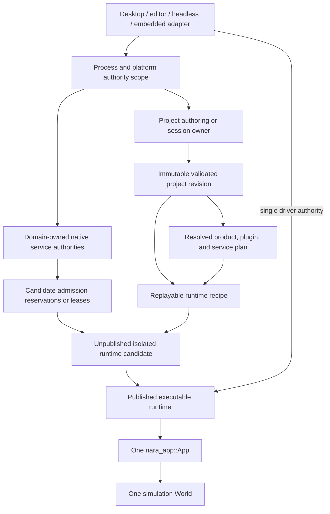

# ADR 0082: Process Host Authority and Runtime Construction Topology

**Status**: Proposed
**Date**: 2026-07-13
**Owner**: Product composition and executable hosts
**Admission Trigger**: RGF-U3 and RGF-U5 prove one project-boot and fresh-runtime workflow through
the public facade without ambient authority or partial runtime publication
**Revisit Trigger**: A second concurrent runtime or platform-affine service proves that the proposed
scope graph cannot express required sharing or shutdown ordering
**Related**: ADR 0035, ADR 0042, ADR 0050, ADR 0070, ADR 0078, ADR 0079

## Context

Nara already assigns important responsibilities to the correct domains:

- the executable host obtains filesystem and platform authority;
- `nara_project` parses and lowers project data without performing runtime side effects;
- domain services and backend adapters own native handles, threads, and queues;
- product, plugin, service, requirement, and conflict closure must validate before `App` mutation;
- an isolated runtime owns simulation state and is rebuilt for structural changes.

Those rules are distributed across several ADRs. They do not yet form one authority and lifetime
graph that answers these product-level questions:

- Which authority may open project files, create native services, and construct runtimes?
- Which state may be shared across runtime generations, and which state must be isolated?
- When does an initialized runtime candidate become visible to an editor, runner, or server?
- In what order do runtime sessions, surfaces, windows, workers, and process services close?
- Can code-first embedded applications use the same engine without adopting a mandatory editor or
  project-host object model?

Leaving these answers implicit would make the editor, desktop runner, headless runner, and future
export tooling grow separate construction and shutdown semantics. Conversely, selecting a public
universal `EngineHost` or process-global service hub before there are multiple consumers would
freeze speculative APIs.

## Decision

If accepted, nara will use an explicit authority and lifetime scope graph for product hosts. This
ADR selects process/project authority placement, service-authority placement, and parent/child
lifetime rules. ADR 0084 exclusively owns the executable-runtime candidate's internal startup,
publication, fault, and close state machine. This ADR does not require public Rust types with the
conceptual names shown below.



### Authority Scopes

The conceptual scopes have these contracts:

| Scope | Owns | Must not become |
|---|---|---|
| Process/platform authority | OS event-loop access, host-issued filesystem capabilities, and domain-native authority creation | A global gameplay service locator |
| Project/session owner | Project documents, workspace state, selected profile, and immutable validated revisions | An ECS resource or backend owner |
| Runtime recipe | Validated project revision, resolved composition plan, scene snapshot, and versioned immutable inputs needed to reconstruct a runtime | A captured `World`, active task, native handle, or one-shot closure |
| Domain service authority | Native handles, affinity, queues, workers, and backend diagnostics for one domain | Persistent project data or generic cross-domain registry |
| Executable runtime | The lifecycle state delegated to ADR 0084 around one runtime generation and one `App` | A second scheduler or plugin authority beside `App` |
| `App` | Plugin lifecycle, schedules, time, the simulation `World`, and main-thread integration | Project workspace, filesystem authority, or process-global service hub |

These are scopes and roles, not required public structs, traits, crates, or fields. A standalone
binary may collapse several scopes into one private owner. The ownership rules and lifetime order
must remain observable even when the implementation is compact.

### Host Admission and Runtime Delegation

The host prepares authority-bearing inputs and delegates candidate construction as one operation:

```mermaid
sequenceDiagram
    participant Host as Executable host
    participant Project as Project authority
    participant Service as Domain services
    participant Factory as ADR 0084 runtime factory
    participant Consumer as Editor / runner

    Host->>Project: Read bounded bytes through host-issued capability
    Project-->>Host: Immutable validated project revision
    Host->>Host: Resolve capability, plugin, service, conflict, and order closure
    Host->>Service: Pure service admission preflight
    Service-->>Host: Validated dependency DAG and admission requirements
    Host->>Service: Reserve inactive candidate admission tokens or leases
    Host->>Factory: Revision, plan, recipe, and host-issued reservations
    alt ADR 0084 publishes a runtime
        Factory-->>Consumer: Published executable runtime generation
    else ADR 0084 candidate startup fails
        Factory-->>Host: Typed startup and cleanup report; publish nothing
    end
```

- Project parsing and lowering are side-effect-free. File-backed input enters only through a
  capability issued by the executable host.
- Compiled capability, project request, implied capability, plugin/service requirement, conflict,
  replacement, ordering, and service-admission closure are pure inspectable candidates before
  `App` mutation or candidate lease acquisition.
- Host-issued candidate reservations are inactive authority tokens or leases. They reserve required
  external capacity and affinity but do not start gameplay-facing service work. ADR 0084 owns their
  binding, activation, runtime-scoped session retirement, and failure cleanup.
- The host has no parallel path that constructs or publishes a runnable `App`. It delegates the
  complete unpublished-candidate transaction to the ADR 0084 runtime factory.
- Atomic runtime publication and the internal ordering among plugin lifecycle, registry freeze,
  service activation, scene spawn, and startup are exclusively defined by ADR 0084.
- The same immutable revision and recipe may construct a later runtime generation. Mutable world,
  queue, task, clock, identity-domain, backend-session, and control state are never reused.

### Service Sessions and Sharing

Every native service declares:

- its domain owner and owner scope;
- thread or JavaScript-agent affinity;
- admission and runtime-facing session or lease type;
- time, pause, and fault behavior;
- diagnostics and pressure observation;
- close initiation, progress polling, deadline, and dependency order.

Runtime code receives typed domain sessions, leases, semantic intent/results, or stable ECS
projections. It does not receive an unbounded global service locator.

This ADR does not require render, audio, task, asset, or other services to be process-global. A
service may be runtime-local until a concrete multi-runtime or platform constraint proves that a
shared authority is necessary. Shared mutable service state must still expose isolated,
generation-stamped runtime sessions.

### Outer-Scope Shutdown and Replacement

Child scopes close before their parent authorities:

```text
stop runtime admission
  -> request and drive ADR 0084 runtime close to an observable terminal result
  -> release project/session ownership
  -> release domain authorities after all issued runtime leases retire
  -> release process/platform authorities
```

- ADR 0084 owns the order and terminal semantics inside the executable runtime, including `App`,
  runtime work, and runtime-scoped service sessions. This ADR owns only the outer parent-scope rule.
- A host must keep the runtime owner and its parent authorities alive while runtime close is pending
  or failed. It cannot release a parent authority or publish a conflicting replacement around live
  child leases.
- Product code does not use destructor completion as evidence that either runtime or outer-scope
  shutdown succeeded.
- Surface, acquired frame, and render-target state retire before the provider/window lease they
  depend on. ADR 0078 continues to own render affinity and device-epoch details.
- Desktop, editor, and headless adapters drive the same runtime contract. A platform event loop is
  a driver and authority provider, not a second source of simulation mutation.

### Deliberately Unfrozen

This proposal does not select:

- a public `EngineHost`, `ProjectContext`, `ServiceHub`, or universal host trait;
- a new host crate or object-safe service registry;
- mandatory process-global render, audio, task, or asset services;
- in-process versus child-process Play as the only deployment model;
- renderer worker placement, browser-agent implementation, or executor technology;
- an asset-database sharing and residency policy;
- a dynamic plugin ABI, script VM, physics API, or audio backend API.

Those choices require concrete consumers. They may be implemented privately without changing the
scope and lifetime rules in this ADR.

## Alternatives Considered

### Option A: Make `App` and `World` the Complete Process Control Plane

**Pros**: Fewest concepts and a convenient standalone embedding model.

**Cons**: Project documents, editor state, filesystem authority, platform-affine handles, runtime
reconstruction, and future multiple runtimes become mixed into the simulation owner.

**Decision**: Rejected as the product-wide topology. A private standalone host may still collapse
scopes while preserving their authority rules.

### Option B: Use a Process-Global Singleton Service Registry

**Pros**: Services are easy to locate and naturally outlive individual scenes.

**Cons**: Permissions and shutdown order become hidden, tests and concurrent projects interfere,
and the registry tends to become a Godot-style global control plane.

**Decision**: Rejected.

### Option C: Use Explicit Scopes, Replayable Recipes, and Unpublished Candidates

**Pros**: Matches Rust ownership, supports editor and headless products, makes fresh restart and
failure publication explicit, and permits later service sharing without requiring it now.

**Cons**: Requires typed leases, explicit close dependencies, and more lifecycle tests.

**Decision**: Proposed.

### Option D: Run Every Play Runtime in a Child Process

**Pros**: Strong isolation and simple reclamation of leaked process-local state.

**Cons**: Adds IPC, embedded viewport, debugging, packaging, and iteration costs before they are
justified.

**Decision**: Deferred as an adapter or deployment option, not selected as the only topology.

## Success Metrics

| Metric | Target | Measurement |
|---|---:|---|
| Pre-mutation project rejection | Every invalid manifest/composition candidate fails before `App` or service-session creation | RGF-U3 project-composition tests |
| Runtime delegation | Every host passes one complete revision/plan/reservation set through the ADR 0084 factory; no host publishes a raw `App` | Host integration and static API audit |
| Parent lifetime | Project and process/service authorities remain alive until every child runtime is `Stopped` and every issued lease retires; failed retirement retains its parent | Instrumented host lifetime test |
| Cross-host parity | Editor, desktop, and headless hosts drive the same declared frame/fixed-tick contract | Reference-game semantic snapshot tests |
| Least privilege | Server composition creates no window, render, audio-device, editor, or raw-input session | Feature/service boundary tests |
| Embedded path | A code-first minimal `App` runs without a project file or public universal host object | Standalone compile/runtime test |

## Risks and Mitigations

| Risk | Severity | Likelihood | Mitigation |
|---|---|---:|---|
| Conceptual scopes become a giant public `EngineHost` | High | Medium | Keep names conceptual; admit public types only through concrete product workflows. |
| Host and runtime both become scheduler authorities | Critical | Medium | Keep schedules, time, plugins, and `World` mutation exclusively in one `App`. |
| Atomic publication is mistaken for external rollback | High | Medium | Specify unpublished candidate plus cleanup evidence, not arbitrary side-effect rollback. |
| Shared services leak mutable state across runtimes | High | Medium | Default to isolation; require generation-stamped typed sessions for admitted sharing. |
| Outer authority is released around a failed runtime close | High | Medium | Retain parent scopes until ADR 0084 reports `Stopped` and every child lease has retired. |
| Recipe captures runtime-only state | High | Medium | Restrict recipes to validated immutable inputs and reconstructible factories. |
| Scope graph over-designs products not yet built | Medium | Medium | Bind acceptance to RGF-U3/U5 and keep service placement and public APIs unfrozen. |

## Consequences

If accepted:

- ADR 0035 remains the project parsing and settings authority but participates in one explicit host
  construction sequence.
- ADR 0042 remains the domain service boundary and gains explicit owner-scope and admission
  declarations; ADR 0084 owns runtime-scoped activation and close.
- ADR 0078 remains the render affinity/device authority; this ADR does not force a process-shared
  renderer.
- ADR 0079 remains the capability and plugin composition authority; its closure becomes a required
  input to runtime construction.
- ADR 0084 exclusively owns candidate-internal construction order, atomic publication,
  runtime-scoped session retirement, the runtime state machine, exact step, faults, close, and
  restart semantics.
- Foundation documentation may show this scope graph only after the proposal is accepted; until
  then the existing Accepted ADRs remain authoritative.

## Admission Evidence

Acceptance requires all host-authority success metrics owned by RGF-U3 and the outer-host subset of
RGF-U5, plus a review showing that hosts delegate executable lifecycle to ADR 0084 and no public
universal host/service API was admitted without a second concrete consumer.

## Citations

- Bevy App and runner ownership: `repo-ref/bevy/crates/bevy_app/src/app.rs`,
  `repo-ref/bevy/crates/bevy_winit/src/state.rs`
- Godot service/main-loop construction and teardown: `repo-ref/godot/main/main.cpp`
- Godot editor child-process Play evidence: `repo-ref/godot/editor/run/editor_run.cpp`
- Active product proof: [Reference-Game-Driven Foundation Plan](../../plans/2026-07-12-001-refactor-reference-game-driven-foundation-plan.md)
