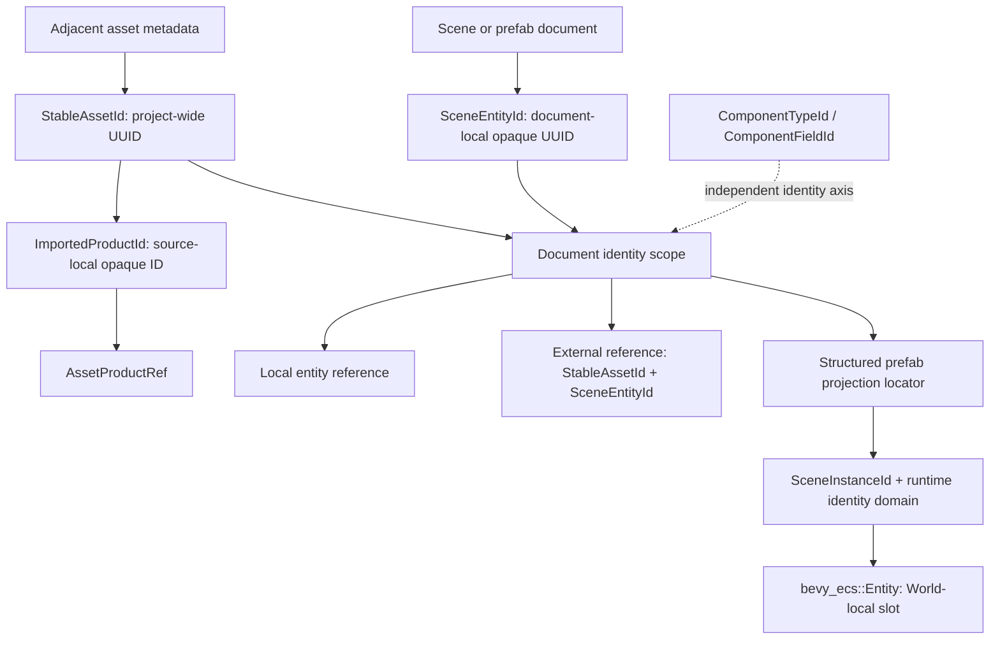

# ADR 0083: Durable Project Asset and Document Entity Identity

**Status**: Proposed
**Date**: 2026-07-13
**Owner**: `nara_asset`, `nara_identity`, `nara_scene`, and authoring hosts
**Admission Trigger**: Reference-game fixtures prove asset move, multi-product rename/reorder,
entity rename/reparent, subtree/prefab duplicate, and cross-document reference preservation through
public tooling
**Revisit Trigger**: Measured project scale, merge behavior, or package indexing proves that the
scoped asset/product/document identity cannot remain bounded or collision-safe
**Related**: ADR 0006, ADR 0007, ADR 0011, ADR 0038, ADR 0043, ADR 0051, ADR 0058, ADR 0081,
ADR 0087

## Context

Nara correctly separates persistent identity from runtime `bevy_ecs::Entity`, runtime `AssetId`,
and native handles. Two persistent identity layers are nevertheless incomplete:

- `StableAssetId` is already a UUID stored by asset metadata, but the metadata also stores the
  current path, creating two authorities for a movable asset.
- A single source can produce multiple durable products, but names, array indexes,
  `ArtifactLabel`, and content digests do not provide rename/reorder-stable product identity.
- `SceneEntityId` is a validated path-like string. Its syntax allows hierarchy-looking values and
  prefab expansion currently constructs `anchor/source_entity` strings in the same type.

Display names, hierarchy paths, source-document identities, prefab projection locations, runtime
instance identities, and schema identities have different lifetimes. Treating them as one string
creates high migration cost when an entity is renamed, reparented, duplicated, converted from a
prefab projection, or referenced from another document.

Unity demonstrates a useful two-level model: a metadata GUID identifies an asset, a local file ID
identifies an object within that asset, and a runtime instance ID remains separate. Godot similarly
distinguishes resource UIDs from scene-local node IDs, while its path-based references show the
rename cost that nara should avoid.

## Decision

If accepted, nara will use scoped durable project identity:



The identities have these meanings:

| Identity | Representation | Scope | Persistent |
|---|---|---|---:|
| `StableAssetId` | Non-nil 128-bit UUID | One project asset across moves and renames | Yes |
| `ImportedProductId` | Primary token or non-nil opaque 128-bit ID | One logical imported product within a source asset | Yes |
| Product reference | `StableAssetId + ImportedProductId` | Project or package | Yes |
| `SceneEntityId` | Non-nil opaque 128-bit UUID | One source scene or prefab document | Yes |
| Local entity reference | `SceneEntityId` | The containing document | Yes |
| External document entity reference | `StableAssetId + SceneEntityId` | Project or package | Yes |
| Prefab projection locator | Structured anchor and source-chain values | One authoring/runtime projection | As provenance, not as a source entity ID |
| `SceneInstanceId` and persistent runtime ID | Existing ADR 0058 runtime axes | One runtime timeline/domain | Only in their declared runtime formats |
| `bevy_ecs::Entity` | Allocator index and generation | One `World` | No |
| Component and field IDs | ADR 0011/0081 catalog tokens | Schema catalog | Yes, independently |

### Asset Metadata Identity

`StableAssetId` remains the project-wide identity of scene, prefab, image, material, and other
project assets. An adjacent `.meta` record owns the stable UUID and importer settings. It does not
own the asset's current path.

```text
source path + adjacent .meta
              |
              v
Project asset database: StableAssetId <-> current AssetPath
```

- Moving or renaming an asset moves its source and `.meta` together. The stable ID does not change.
- Duplicating an asset creates a new stable asset ID. Copying a `.meta` verbatim is not a valid
  duplicate operation.
- Two live assets with the same stable ID reject candidate database publication atomically. The
  host never selects the first path silently.
- A known asset that loses its metadata reports an identity-loss conflict. It is not silently
  assigned a replacement identity that would break references.
- A new unmanaged file may receive metadata only through an explicit editor/import-host
  transaction before it becomes a published project asset.
- Packaged runtimes resolve stable IDs through a package/artifact index and do not depend on author
  directory sidecars.
- The current path may be retained as diagnostic or recovery evidence outside equality and
  resolution authority. It is not duplicated as an authoritative field inside `.meta`.

### Imported Product Identity

`ImportedProductId` identifies one logical output of an importer within its owning
`StableAssetId`. It supports models, atlases, fonts, compound documents, and other sources that
produce more than one independently referencable runtime product.

- Every source has a reserved `Primary` product. Additional products use non-nil opaque IDs scoped
  to that source asset.
- A persistent product reference is `StableAssetId + ImportedProductId`. Neither half alone
  identifies an auxiliary product.
- Display names, source object names, array order, `ArtifactLabel`, cache location, recipe digest,
  and content digest are projections or cache data, never durable product identity.
- Reimport preserves product IDs when the importer can prove semantic continuity. Rename and
  reorder do not change an ID. Ambiguous reconciliation rejects publication or requires an explicit
  remap; it does not silently bind an old reference to a different product.
- Duplicating a source asset creates a new `StableAssetId` and may preserve its internal product-ID
  pattern because the enclosing asset scope changes. Extracting a product into an independent
  source creates a new asset identity and requires an explicit reference-remap transaction.
- ADR 0087 owns dependency discovery, importer reconciliation, artifact-group publication, and
  cache generation. This ADR owns only the persistent product identity semantics.

### Document-Local Entity Identity

`SceneEntityId` identifies one authored entity record inside one source scene or prefab document.
It is not a name, hierarchy path, runtime entity, prefab instance location, or globally meaningful
object ID.

- The canonical wire form is a lowercase hyphenated non-nil UUID string. New authoring operations
  generate random UUIDs without a central project allocator.
- `Name`, parent relation, sibling order, and display aliases are mutable authoring data. Renaming
  or reparenting does not change `SceneEntityId`.
- Ordinary authoring APIs do not expose "rename ID". Rekeying is an explicit whole-document
  transaction or crash-recoverable whole-project migration that rewrites every affected reference
  under the migration protocol below.
- An ID must not be intentionally reused within a document lineage. Scene files do not accumulate
  an unbounded permanent entity-tombstone catalog; deleted-reference diagnostics and authoring
  history own any retained deletion evidence.
- Document parsing rejects nil IDs and duplicate active IDs before publishing a candidate.

### Duplicate, Copy, and Conversion

Identity changes follow operation scope:

| Operation | Asset ID | Entity IDs | Reference behavior |
|---|---|---|---|
| Rename/move asset | Preserve | Preserve | No durable rewrite |
| Rename/reparent entity | Preserve | Preserve | No durable rewrite |
| Duplicate entity or subtree in one document | Preserve | Allocate all-new IDs for copies | Rewrite references within the copied closure; preserve references to outside targets |
| Duplicate a scene/prefab asset | Allocate a new asset ID | May preserve local IDs because the document scope changed | Existing external references continue targeting the original asset |
| Merge records from another document | Preserve target asset ID | Allocate/remap every colliding imported ID | Rewrite all imported local references atomically |
| Convert prefab projection to local | Preserve containing asset ID | Allocate new local IDs | Rewrite converted-subgraph references and provenance atomically |

Subtree duplication and conversion preflight a complete injective remap before mutation. A missing
target, incomplete rewrite, duplicate ID, or budget failure publishes no partial duplicate.

### Local and Cross-Document References

Persistent entity-reference semantics are:

```text
Local {
  entity: SceneEntityId
}

External {
  document: StableAssetId
  entity: SceneEntityId
}
```

- Local references resolve only against the containing source document.
- External references require the expected asset kind and target entity to validate. Identity does
  not imply that a runtime automatically loads or streams the target document.
- A project-relative path may remain an authoring shorthand or diagnostic hint. It does not
  participate in equality and is not the durable authority for an external entity reference.
- This UUID-only rule applies to persistent references that target an entity inside another
  document. It does not make every ordinary asset reference UUID-only: non-entity-bearing asset
  inputs may continue to use the `AssetRef::Path` or `AssetRef::StableId` policy owned by
  `nara_asset`.
- Persistent runtime/save identities remain separate. They are not reused as scene-document IDs.

The exact Rust owner of the composite reference may be selected during implementation to preserve
the crate dependency graph. This ADR does not require moving `StableAssetId` into a particular
crate or introducing a universal identity crate dependency.

### Prefab Projection Identity

An expanded prefab entity is a projection of a source entity, not a newly authored source record.
Its locator is structured provenance:

```text
PrefabProjectionLocator {
  root_scene_instance,
  anchor: SceneEntityId,
  source_chain: [
    { source_asset: StableAssetId, source_entity: SceneEntityId },
    ... nested source steps
  ]
}
```

- `anchor/source_entity` may remain a human-readable diagnostic rendering of this locator. It is
  not constructed as another `SceneEntityId`.
- Two instances may share source asset/entity IDs while their anchor and runtime-instance axes keep
  their projections distinct.
- Prefab source movement preserves `StableAssetId`, so provenance does not change.
- Nested prefab depth and encoded locator size remain bounded by persistent-input budgets.
- Apply-back continues to route through source, anchor, override, or convert-to-local provenance;
  runtime `Entity` never becomes a durable shortcut.

### Pre-1.0 Migration

Acceptance requires a canonical version-1 reset rather than a permanent dual reader:

1. Give every scene and prefab asset a stable asset ID.
2. Derive deterministic migration IDs as UUIDv5 values from `document StableAssetId + old
   path-like SceneEntityId`.
3. Preflight the complete project graph and all entity IDs, parent edges, local/external references,
   patch targets, prefab overrides, and workspace references in memory before replacing a source
   file.
4. Stage a complete new project generation plus its index under one migration transaction ID.
   Replace each individual file only through a required atomic-replace receipt from `nara_fs` and
   fail closed where that guarantee cannot be proven; do not claim one physical transaction across
   independent files.
5. Use a durable journal and commit marker, or an equivalently proven generation switch, so reopen
   after any crash point deterministically resumes or recovers to a complete old or new project
   graph. A partially replaced set is never published as the active project generation.
6. Replace string-composed prefab projection IDs with structured provenance and validate the staged
   complete project reference graph before committing its generation/index.
7. Perform source rewriting only in an explicit offline/editor migration. Runtime loading never
   silently writes project files.
8. Delete obsolete readers and fixtures after the committed generation is proven readable, update
   canonical golden fixtures, and record the break in the migration guide.

UUIDv5 is only the deterministic migration mechanism. New entities use random UUIDs.

## Alternatives Considered

### Option A: Keep Path-Like `SceneEntityId`

**Pros**: Human-readable files and no immediate rewrite of prefab namespace strings.

**Cons**: Identity remains visually and operationally coupled to names/hierarchy, source identity
is mixed with projection location, and nested prefab/cross-document operations need repeated string
rewrite rules.

**Decision**: Rejected.

### Option B: Give Every Authored and Runtime Object One Global UUID

**Pros**: One apparent reference form and no document-local composite.

**Cons**: Conflates source records, prefab projections, runtime instances, save identities, and ECS
slots. Provenance and instance isolation are still required, so the global UUID does not remove the
hard problem.

**Decision**: Rejected.

### Option C: Use Asset UUID Plus Document-Local Opaque UUID and Structured Projection

**Pros**: Stable across rename/move/reparent, supports offline generation and merges, matches mature
GUID-plus-local-ID practice, and preserves ADR 0058 runtime isolation.

**Cons**: Requires one breaking project rewrite and relies on tooling/`Name` for readability.

**Decision**: Proposed.

### Option D: Use Path or Content Hash as Identity

**Pros**: Avoids explicit random identifiers or sidecars.

**Cons**: Moves or content edits change identity, making stable references and importer settings
unreliable.

**Decision**: Rejected.

## Success Metrics

| Metric | Target | Measurement |
|---|---:|---|
| Rename/reparent stability | Entity ID, patch target, and reference bytes remain unchanged | Scene-authoring integration tests |
| Asset move stability | Moving source plus `.meta` rewrites zero stable references | Project asset-database test |
| Product stability | Renaming or reordering importer outputs rewrites zero durable product references | Multi-product importer fixture |
| Product conflict rejection | Duplicate or ambiguous product IDs reject the candidate artifact group | Hostile importer fixture |
| Duplicate correctness | Every subtree copy has an injective remap and correct internal/external reference partition | Duplicate transaction tests |
| Prefab distinction | Equal source IDs in two instances produce distinct structured projection locators | Nested-prefab tests |
| Conflict rejection | Nil/duplicate asset or entity IDs reject publication before document/database mutation | Hostile fixture tests |
| Cross-document diagnostics | Missing asset, wrong asset kind, and missing entity are distinct typed failures | Reference-resolution tests |
| Runtime separation | Persistent files contain no runtime `Entity`, `AssetId`, `SceneInstanceId`, or backend handle | Format fixtures and source audit |
| Migration recovery | Every injected write/crash point reopens to a validated complete old or new generation; no mixed graph becomes active | Offline migration journal/commit fault matrix |
| Product proof | Reference game passes asset move, entity rename/reparent, prefab duplicate, and external-reference flows | Independent-workspace tests |

## Risks and Mitigations

| Risk | Severity | Likelihood | Mitigation |
|---|---|---:|---|
| UUIDs make source files harder to read | Medium | High | Keep `Name` and tooling paths as display data; show compact aliases in diagnostics. |
| Copied `.meta` creates duplicate asset IDs | High | Medium | Reject duplicate project candidates and provide an explicit duplicate/repair transaction. |
| Partial subtree remap corrupts references | Critical | Medium | Preflight a complete injective remap and publish atomically. |
| External references create implicit streaming promises | High | Medium | State that identity resolution does not load; defer streaming/ownership policy. |
| Random IDs are accidentally reused intentionally | Medium | Low | Hide raw constructors from ordinary authoring and reject active duplicates. |
| Structured prefab provenance grows without bound | High | Low | Apply depth/item/byte budgets before materializing a locator. |
| Multi-file migration crashes after partial replacement | Critical | Medium | Preflight in memory, stage a generation, journal every replace, commit through one durable marker, and prove old-or-new recovery at each crash point. |
| Migration becomes a permanent compatibility layer | High | Medium | Use the pre-1.0 canonical reset policy and delete obsolete readers after rewrite. |
| Stable ID type ownership creates a crate cycle | High | Low | Choose Rust ownership during implementation; freeze semantics, not dependency placement. |
| Importer reconciliation aliases the wrong product | Critical | Medium | Require explicit continuity evidence, validate the full candidate product set, and reject ambiguity. |

## Consequences

If accepted:

- this ADR refines ADR 0006 by replacing only the current path-like wire representation of
  `SceneEntityId` with a document-local opaque UUID; its dimension-neutral document model remains
  authoritative;
- this ADR refines ADR 0038 by replacing only string-composed projection IDs and entity-bearing
  external `AssetRef + SceneEntityId` references with structured projection provenance and
  `StableAssetId + SceneEntityId`; its authoring provenance and write-back rules remain
  authoritative;
- this ADR refines ADR 0007 by removing current-path authority from `.meta` and adding stable
  source-local imported-product identity while retaining asset-import ownership and ordinary
  path-or-stable-ID asset references;
- ADR 0058 retains runtime identity domains and tombstones; source-document and projection locators
  become explicit inputs to that runtime mapping;
- ADR 0011 and ADR 0081 schema IDs remain an independent identity space;
- scene, prefab, patch, tooling-workspace, and golden-fixture data require one coordinated pre-1.0
  rewrite before this proposal may become authoritative.

No existing ADR is superseded as a whole by this decision. While this ADR remains Proposed it is
non-authoritative. Acceptance must add `Refines: ADR 0006, ADR 0007, ADR 0038` here, reciprocal
`Refined By: ADR 0083` metadata to those ADRs, and the corresponding migration record in one
change.

## Admission Evidence

Acceptance requires every success metric above, including a committed predecessor/current fixture
pair for the migration, a multi-product importer fixture, and the independent reference-game
product proof. Passing UUID unit tests alone is insufficient.

## Citations

- Unity asset metadata and GUID model: <https://docs.unity3d.com/Manual/AssetMetadata.html>
- Godot resource UID mapping: `repo-ref/godot/core/io/resource_uid.h`
- Godot scene-local unique IDs: `repo-ref/godot/scene/resources/packed_scene.cpp`
- Godot path-reference rename repair pressure: `repo-ref/godot/editor/docks/scene_tree_dock.cpp`
- Bevy runtime/template identity contrast: `repo-ref/bevy/crates/bevy_ecs/src/template.rs`
