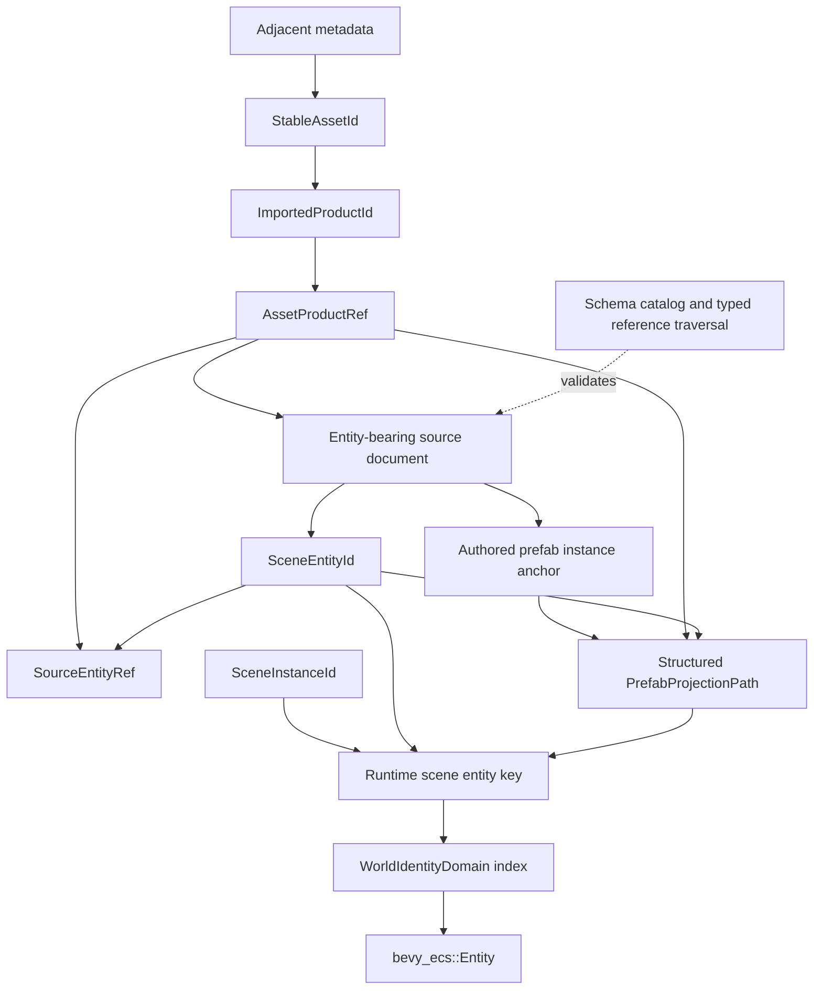

# ADR 0083: Durable Project Asset and Document Entity Identity

**Status**: Proposed
**Date**: 2026-07-13
**Last Revised**: 2026-07-21
**Owner**: `nara_asset`, `nara_identity`, `nara_scene`, persistent document owners, and authoring
hosts
**Admission Trigger**: One production-shaped identity tracer proves two entity-bearing products
from one source, repeated and nested prefab instances, prefab-internal references, one explicit
outer binding, cross-document references, deterministic copy-closure remapping, a read-only package
collision, and crash-recoverable pre-1.0 migration through public tooling
**Revisit Trigger**: Measured project scale, package composition, merge behavior, or imported-product
reconciliation proves that the scoped identity and indexed lowering model cannot remain bounded or
collision-safe
**Related**: ADR 0006, ADR 0007, ADR 0011, ADR 0038, ADR 0043, ADR 0049, ADR 0051, ADR 0058,
ADR 0081, ADR 0087, ADR 0089, ADR 0090, ADR 0091

## Context

Nara already separates persistent identity from runtime `bevy_ecs::Entity`, runtime `AssetId`, and
native handles. Its current project identity is still transitional:

- `StableAssetId` is stored in adjacent asset metadata, but metadata also stores the current path,
  creating two potential authorities for a movable asset.
- One source may publish multiple products, but names, array indexes, `ArtifactLabel`, Rust types,
  and content digests do not provide rename/reorder-stable product identity.
- `SceneEntityId` remains a path-like string. Prefab expansion manufactures values such as
  `anchor/source_entity` in the same type, mixing source identity with projected location.
- Persistent `SceneLocal` references can currently escape a prefab and resolve against its eventual
  containing runtime instance without declaring an outer binding.
- Reference-game systems compare authored ID text such as `player` and `enemy-anchor/enemy`, making
  an identity token carry gameplay meaning.

These ambiguities become expensive once users move assets, import compound files, instantiate the
same scene or prefab more than once, copy a package, merge branches, or edit content while a schema
provider is unavailable.

Unity provides the closest mature precedent: persistent references combine an asset GUID with a
file-local ID and lower separately to a runtime instance ID. Godot now combines resource UIDs,
scene-local node IDs, readable paths, ownership, and instance state, while its remaining path-repair
logic demonstrates why heuristic reference rewriting is incomplete. Bevy strongly demonstrates
that `Entity`, `AssetIndex`, `Handle`, and runtime scene scopes cannot serve as durable authoring
identity. None of those engines supplies Nara's package collision, cross-document entity,
copy-closure, or crash-recovery contract; Nara must decide those semantics explicitly.

## Decision

If accepted, Nara will use separate, scoped identities connected through explicit provenance and
Host-owned lowering. It will not introduce one universal object UUID.



Names below describe semantic roles. This ADR does not freeze public Rust type names, crate
placement, or constructors.

| Identity axis | Meaning | Equality scope | Persistent use |
|---|---|---|---|
| `StableAssetId` | One logical source asset across move, rename, reimport, and compatible package update | One composed content universe | Project/package source and product references |
| `ImportedProductId` | One logical product across reimport | All product kinds within one `StableAssetId` | Complete product/document selection |
| `AssetProductRef` | `StableAssetId + ImportedProductId` | One product or entity-bearing document | Asset, document, and provenance references |
| `SceneEntityId` | One authored entity record | One entity-bearing `AssetProductRef` | Local entity and source-record selection |
| Source entity reference | `AssetProductRef + SceneEntityId` | One authored source record | Cross-document authoring, patching, and provenance |
| Prefab projection path | Root authored anchor plus an exact bounded source chain | One projected authoring location | Selection, override routing, diagnostics, and write-back provenance |
| Runtime scene entity key | Local `SceneEntityId` or structured prefab projection path | One `SceneInstanceId` | Runtime lookup only |
| `SceneInstanceId` | One live or recorded instantiation of a document | One `WorldIdentityDomain` timeline | Runtime/replay formats declared by ADR 0058, never project documents |
| `bevy_ecs::Entity` | Allocator slot and generation | One `World` allocation history | Never persistent |

`StableAssetId`, `ImportedProductId`, and `SceneEntityId` use non-nil opaque identifiers. Their
generation algorithm is not public behavior, except for the exact deterministic pre-1.0 migration
defined below. Canonical version-1 UUID text is lowercase and hyphenated where the owning format
encodes one directly.

### Asset Identity and Collision Domain

`StableAssetId` identifies a logical source asset independently of its path.

```text
source path + adjacent metadata
              |
              v
Project asset database: StableAssetId <-> current AssetPath
```

- Adjacent metadata owns the stable ID and importer settings. It does not own the current path.
- The project asset database owns the current path projection and rejects one active ID at multiple
  paths before publishing a candidate generation.
- Moving or renaming an asset moves source and metadata through one recoverable Host operation. It
  changes no durable reference.
- A known asset that loses metadata enters an identity-loss conflict. Nara does not silently mint a
  replacement and strand existing references.
- A new unmanaged file receives metadata only through an explicit authoring/import transaction
  before it becomes published project content.
- Packaged runtimes resolve IDs through package/catalog indexes rather than authoring sidecars.
- Paths and display names may remain bounded diagnostic or recovery hints. They never override a
  present stable ID or participate in equality.

All project assets and all resolved dependency or mounted package assets visible in one composed
content generation share one `StableAssetId` collision domain. Package name, release, origin, and
mount generation are provenance, not an extra equality field for ordinary asset references.

- Any active collision rejects composition before catalog publication, including project content
  colliding with a read-only package or two read-only packages colliding with each other.
- Nara never selects the first path, uses mount precedence as identity resolution, or rewrites an
  immutable package silently.
- A compatible package update preserves IDs for the same logical assets. Removed targets remain
  typed unavailable/missing references rather than rebinding to another asset.
- Vendoring or forking package content while the original remains visible is an explicit closure
  import: allocate new asset IDs and atomically rewrite references inside the imported closure.

### Imported Product and Document Identity

`ImportedProductId` identifies one logical output of an importer within its owning source asset.
It supports compound models, atlases, fonts, generated data, and sources that publish more than one
scene or prefab document.

- Every source reserves a `Primary` product. Auxiliary products use non-nil opaque IDs.
- The product-ID namespace covers all product kinds under one source. Scoping by expected Rust type
  is insufficient.
- A candidate product descriptor binds the product ID to expected product kind and schema lineage.
  Wrong kind/schema is distinct from missing identity.
- Product names, source names, array order, labels, cache paths, recipe digests, and content hashes
  are projections or evidence; none is durable product identity.
- Reimport preserves an ID only when semantic continuity is proven. Rename and reorder alone do not
  change it. Duplicate IDs, kind drift, or ambiguous continuity reject the complete candidate group
  or require an explicit remap transaction.
- Removing a product does not authorize rebinding its ID to a different logical product. ADR 0087
  owns the bounded continuity/retirement evidence and candidate-group publication mechanism.
- Duplicating a source preserves its internal product-ID pattern only under the newly allocated
  enclosing `StableAssetId`.

An entity-bearing document is identified by `AssetProductRef`, not `StableAssetId` alone. This
allows two scene/prefab products from one source to contain the same document-local entity ID
without aliasing.

### Document-Local Entity Identity

`SceneEntityId` identifies one authored entity record inside one entity-bearing
`AssetProductRef`. It is not a name, hierarchy path, prefab projection, runtime entity, singleton
role, gameplay tag, or globally meaningful object ID.

- `Name`, parent relation, sibling order, and display aliases are mutable data. Rename or reparent
  changes none of the identity/reference bytes.
- Opaque ID bytes carry no gameplay meaning. Gameplay selection uses typed marker/role components,
  named command targets, or explicit references; display uses `Name` or a tooling projection.
- Ordinary authoring operations do not expose an in-place "rename ID" command. Rekeying is an
  explicit document/project transaction with complete reference rewriting.
- Official creation and duplication tools never intentionally allocate a live or known-retired ID
  for a different entity. Active duplicates reject before publication.
- Undo, branch revert, or explicit restore may restore the same logical entity with its old ID.
  Without an admitted durable lineage catalog, the format does not claim to prove unlimited
  historical non-reuse after arbitrary manual edits.
- Deleting a target preserves typed reference bytes and produces missing/deleted diagnostics. It
  does not clear or retarget references silently.

### Authoring Reference Forms

Every persistent entity reference is explicitly versioned and discriminated. The following forms
are illustrative:

```text
Local {
  entity: SceneEntityId
}

ExternalSource {
  document: AssetProductRef
  entity: SceneEntityId
}

PrefabOuterBinding {
  binding: prefab-source-local binding identity
}
```

- `Local` resolves against the containing source document. During prefab expansion it remaps to the
  same projection chain with the referenced source entity as the terminal step.
- `ExternalSource` names an authored source record. It neither loads a document nor chooses among
  zero, one, or several runtime instances.
- A reusable prefab may refer to its own source records normally. Intentional access to an entity
  outside that prefab uses an explicit binding declared by the prefab and supplied by the instance
  anchor, an explicit instance override, or another separately admitted injection contract. It
  never relies on eventual `SceneLocal` lookup in the containing runtime scene.
- Missing document/product, unavailable package, wrong kind/schema, deleted entity, unloaded
  runtime instance, and ambiguous instance selection remain distinct typed outcomes.
- Authoring may preserve an unresolved typed reference with diagnostics when its owning format and
  schema are understood. Runtime spawn fails before `World` mutation when a required reference
  cannot be lowered.

All remappable persistent entity references must be structurally represented by the canonical wire
model and completely enumerable through the frozen schema/reference catalog. Untyped strings,
opaque blobs, map keys, callbacks, or unavailable-schema payloads cannot claim automatic reference
repair. ADR 0090 may permit bounded lossless opening of unavailable data, but duplicate, rekey,
merge, flatten, migration, or runtime spawn fails when complete traversal cannot be proven.

Persistent document serialization rejects `bevy_ecs::Entity`, runtime `AssetId`, `AssetIndex`,
`Handle<T>`, `SceneInstanceId`, `WorldIdentityDomainId`, backend handles, and other process-local
identity. It does not warn and substitute an empty entity or default handle.

### Prefab Projection Identity

An expanded prefab entity is a projection of a source entity, not a new authored source record.
Persistent provenance uses the containing document plus a structured path:

```text
PrefabProjectionPath {
  root_anchor: SceneEntityId
  source_chain: [
    { source_document: AssetProductRef,
      source_entity: SceneEntityId },
    ...
    { source_document: AssetProductRef,
      source_entity: SceneEntityId }
  ]
}
```

The containing root document is supplied by context. Every non-terminal source entity is an
authored nested-prefab anchor whose declared source must match the next step. This distinguishes
multiple instances of the same source without manufacturing another `SceneEntityId`.

- `anchor/source_entity` may remain a readable diagnostic rendering. It is not parsed or stored as
  a `SceneEntityId`.
- The same source-local reference in two prefab instances lowers under each instance's distinct
  projection path.
- Prefab-internal references remap through the complete projection chain before publication.
- Explicit outer bindings lower through the instance anchor's declared binding table; absent or
  ambiguous bindings reject the candidate.
- Source move preserves `StableAssetId`; rename/reparent inside a source preserves
  `SceneEntityId`; neither operation changes projection identity.
- Nested depth, step count, and encoded size follow persistent-input budgets.
- Override, apply-back, convert-to-local, duplicate, merge, and export preflight complete injective
  identity/reference remaps before mutating authoring or runtime state.

`SceneInstanceId` is never part of persistent project provenance. Runtime lookup adds it only after
the authored key is complete:

```text
RuntimeEntityReference::Scene {
  instance: SceneInstanceId,
  key: Local(SceneEntityId) | Projected(PrefabProjectionPath)
}
    -> WorldIdentityDomain index
    -> bevy_ecs::Entity
```

### Duplicate, Copy, Move, and Restore

Identity behavior is determined by the user operation, not by incidental file-copy mechanics:

| Operation | Asset/product/entity identity | Reference behavior |
|---|---|---|
| Move or rename source asset | Preserve all IDs | Rewrite no durable reference; update path projection |
| Rename or reparent entity | Preserve entity ID | Rewrite no identity/reference bytes |
| Duplicate entity/subtree in one document | Preserve asset/product; allocate all-new copied entity IDs | Rewrite references inside copied closure; preserve targets outside closure |
| Duplicate one source asset | Allocate new asset ID; preserve source-local product/entity IDs under new scope | Rewrite self/inside-copy external references to copy; outside references still target original |
| Copy a directory/package/project closure | Allocate a complete new asset-ID map; preserve source-local IDs under mapped assets | Rewrite references whose targets are inside copied closure; preserve references to outside targets |
| Merge/move records between documents | Preserve target document; allocate/remap collisions | Rewrite every moved local/source/projection reference atomically |
| Convert prefab projection to local | Preserve containing asset/product; allocate new local entity IDs | Rewrite converted-subgraph references and remove provenance atomically |
| Restore same logical source/entity | Preserve prior identity when lineage is proven | Restore prior references; do not treat as a new duplicate |
| Vendor/fork mounted package content | Allocate new asset IDs for imported closure | Rewrite imported closure; never mutate mounted original |

For a whole-source duplicate, preserving product/entity IDs is deterministic because their enclosing
scope changes. The word "may" is not part of the contract. Copying a metadata file verbatim does
not create a valid duplicate.

Every duplicate/copy operation first builds a complete injective mapping for assets, products,
entities, projection steps, overrides, patches, and declared references. A missing target,
unavailable schema, duplicate identity, incomplete traversal, budget failure, or persistence
failure publishes no partial copy.

### Runtime Lowering and Performance

Persistent identities are authoring, import, package, load, migration, and diagnostic keys. They
are not the per-frame gameplay lookup representation.

Before the first target-`World` allocation or persistent component insertion, the Host must:

1. capture one committed project/content generation and complete schema/reference catalog;
2. validate asset/product/document identity uniqueness, expected kinds, package availability, and
   the full typed reference closure;
3. expand and validate prefab projection paths and explicit outer bindings;
4. build a complete injective local/projected-key to runtime-entity allocation plan;
5. allocate and apply only after the candidate is internally closed.

Runtime systems resolve through indexed or batch maps owned by the relevant Host/domain and then
use `bevy_ecs::Entity`, typed component queries, dense batch indices, or backend-local keys on hot
paths. Cooked content may lower durable keys to validated dense indexes while retaining provenance
for diagnostics. Repeated whole-scene scans, path comparison, or UUID/string comparison per frame
is not an accepted implementation strategy.

### Pre-1.0 Migration

Acceptance requires a canonical version-1 reset rather than a permanent dual reader.

1. Assign a non-nil `StableAssetId` to every source asset and a stable product ID to every product.
2. Identify every entity-bearing document by `AssetProductRef`.
3. Map each old path-like `SceneEntityId` to UUIDv5 using the document's `StableAssetId` UUID as
   namespace and the exact decoded old ID UTF-8 bytes as the name. Equal local UUID results in two
   products are valid because `AssetProductRef` provides the enclosing scope.
4. Reconstruct old `anchor/source` projections from validated prefab documents and expansion
   provenance. Do not split strings on `/`; old source IDs may themselves contain several path
   segments.
5. Preflight the complete project graph, schemas, entity IDs, parent edges, references, patches,
   overrides, workspace selections, and package availability in memory. Unknown or unavailable
   reference-bearing schema blocks migration.
6. Delegate staging, transaction fencing, replacement receipts, committed project snapshot,
   recovery journal, and old-or-new publication to ADR 0091 or a compatible Accepted successor.
   This ADR does not create a second journal or physical cross-file atomicity claim.
7. Validate the fully staged identity/reference graph before publishing the new generation/index.
8. Runtime loading never rewrites source files. Migration is an explicit offline/editor command.
9. After the new committed generation is proven readable, remove obsolete readers and fixtures,
   update golden fixtures, and record the breaking format change.

If ADR 0091 remains Proposed, this ADR's migration activation remains blocked. Identity semantics
may be reviewed independently, but no plan may implement or advertise crash-safe project migration
without a compatible Accepted persistence contract.

## Alternatives Considered

### Option A: Keep Path-Like `SceneEntityId`

**Pros**: Human-readable files and no immediate replacement of prefab namespace strings.

**Cons**: Rename, reparent, nested prefab, cross-document reference, and copy operations continue to
depend on heuristic string rewriting. Source identity and projection location remain conflated.

**Decision**: Rejected.

### Option B: Give Every Authored and Runtime Object One Global UUID

**Pros**: One apparent reference form.

**Cons**: Still cannot distinguish product scope, prefab instance provenance, runtime instance,
world timeline, or ECS allocation. It assigns durable identity to transient objects without
removing the need for scoped indexes.

**Decision**: Rejected.

### Option C: Scoped Asset, Product, Entity, Projection, and Runtime Identity

**Pros**: Stable across move/rename/reparent/reimport, supports compound documents and repeated
instances, preserves runtime ECS performance, and gives copy/migration operations complete keys.

**Cons**: Requires one breaking project rewrite, explicit provenance/bindings, and more tooling
projection for readable diagnostics.

**Decision**: Proposed.

### Option D: Omit Product Identity and Require Entity Documents to Be `Primary`

**Pros**: External references remain `StableAssetId + SceneEntityId` and the first implementation
is smaller.

**Cons**: Prevents a compound source from publishing multiple entity-bearing products and creates a
wire-format break as soon as a real importer needs that workflow.

**Decision**: Rejected. The product axis is part of the complete document key.

### Option E: Add Package Identity to Every Asset Equality Key

**Pros**: Two packages can carry colliding asset UUIDs without immediate admission failure.

**Cons**: Moving, vendoring, or rehoming content changes identity; project/package references become
environment-dependent; collisions are hidden rather than diagnosed.

**Decision**: Rejected. Package provenance participates in diagnostics and admission, not ordinary
asset equality.

### Option F: Use Path or Content Hash as Identity

**Pros**: Avoids explicit random identifiers or sidecars.

**Cons**: Moves or content edits change identity and make stable references/import settings
unreliable.

**Decision**: Rejected.

## Success Metrics

| Metric | Target | Measurement |
|---|---:|---|
| Asset move stability | Moving source plus metadata rewrites zero durable references | Public Host move fixture |
| Product/document uniqueness | Two entity-bearing products from one source resolve independently | Compound importer fixture |
| Rename/reparent stability | Entity and reference bytes remain unchanged | Scene/prefab golden diff |
| Reimport continuity | Rename/reorder preserves IDs; ambiguity/kind drift publishes nothing | Import reconciliation fixture |
| Package collision safety | Project/package and package/package ID collisions fail before composition publication | Read-only package fixture |
| Copy determinism | Every single-source and closure copy follows the declared ID/remap table | Copy transaction matrix |
| Reference completeness | All declared entity references are enumerated; unavailable schema blocks rewrite | Schema/reference traversal fixture |
| Prefab distinction | Repeated and nested instances produce distinct projection keys with shared source IDs | Nested-prefab fixture |
| Outer binding honesty | Prefab-to-containing-scene reference resolves only through explicit binding/override | Reference-game enemy target tracer |
| Runtime instance safety | A source reference never chooses between multiple scene instances | Multi-instance lookup fixture |
| Runtime isolation | Project files contain no runtime/process-local identities | Negative format fixtures and source audit |
| Pre-mutation failure | Missing/invalid references fail before first target-World mutation | Hostile spawn fixture |
| Gameplay opacity | Randomizing all authored entity UUIDs changes no gameplay/replay outcome | Reference-game role/reference fixture |
| Hot-path cost | Runtime frame work uses ECS/dense indexes, not path/UUID scans | Benchmark and profile assertion |
| Migration recovery | Every injected failure reopens old, new, or explicit recovery-required state; never mixed | ADR 0091 fault matrix |
| Text stability | No-op save changes no ID, reference, record order, or unrelated canonical region | Golden roundtrip fixture |
| Merge behavior | Clean semantic cases merge; delete/edit, duplicate-ID, and override conflicts remain explicit | Three-way merge fixtures |

## Risks and Mitigations

| Risk | Severity | Likelihood | Mitigation |
|---|---|---:|---|
| Opaque IDs reduce source readability | Medium | High | Keep names/paths as display projections and show stable locators in diagnostics. |
| Product ID silently aliases after reimport | Critical | Medium | Bind kind/schema lineage, retain continuity evidence, and reject ambiguous candidate groups. |
| Read-only package collision strands content | High | Medium | Reject composition with provenance diagnostics; require explicit vendor/fork remap. |
| Copy closure misses a hidden reference | Critical | Medium | Require typed complete traversal; block on unavailable schema; preflight atomically. |
| Prefab source reference escapes into outer scene implicitly | High | High | Require explicit outer binding/override and include the reference-game case in admission. |
| Source identity is mistaken for a live instance | High | Medium | Keep source and runtime reference forms distinct; require explicit `SceneInstanceId` lowering. |
| Unlimited non-reuse is promised without lineage evidence | High | Medium | Limit the guarantee to official tools and known lineage; admit a bounded lineage policy separately if needed. |
| UUIDs enter hot gameplay paths | High | Medium | Build indexed lowering once and use `Entity`/dense keys thereafter; benchmark the tracer. |
| Migration publishes a mixed project graph | Critical | Medium | Use ADR 0091 committed snapshots, fence, receipts, and recovery; do not invent another journal. |
| Stable IDs are mistaken for automatic merge correctness | High | High | Provide semantic merge fixtures and preserve explicit unresolved conflicts. |
| Identity types create crate cycles | High | Low | Freeze semantics now; select physical type ownership only after dependency review. |

## Consequences

If accepted:

- ADR 0006 remains the dimension-neutral explicit ECS document model; this ADR replaces only the
  path-like `SceneEntityId` representation and adds complete scoped identity semantics.
- ADR 0007 retains ordinary `AssetRef::Path`/`AssetRef::StableId` policy and runtime typed handles;
  this ADR removes path authority from metadata and defines source/product identity.
- ADR 0038 retains source/anchor/override/write-back provenance; this ADR replaces string-composed
  projected IDs and incomplete cross-document references with structured product-aware locators.
- ADR 0058 retains runtime identity domains, `SceneInstanceId`, runtime lookup, fork/restore, and
  tombstones. Source/product/projection keys are inputs to that runtime lowering, not aliases.
- ADR 0081 retains schema identity and catalog authority. Persistent identity axes remain distinct
  from component/field IDs.
- ADR 0087 owns importer continuity evidence and artifact-group publication; it must use the
  source-local product semantics selected here.
- ADR 0089 owns runtime scene load/activate/unload/travel and explicit instance selection.
- ADR 0090 may own lossless unavailable-schema authoring, but it cannot claim duplicate/remap/
  flatten/migration correctness without complete reference traversal.
- ADR 0091 owns persistent publication, recovery, and concurrent-writer semantics for identity
  rewrites.
- Reference-game authored IDs, gameplay role selection, prefab outer references, fixtures, patches,
  overrides, and workspace selections require one coordinated pre-1.0 rewrite.

No public `IdentityService`, generic provider interface, universal object registry, crate move, or
implementation plan is authorized by this proposal. While it remains Proposed, the current
path-like/string-composed implementation remains implementation truth.

No Accepted ADR is superseded as a whole. Acceptance must add `Refines: ADR 0006, ADR 0007,
ADR 0038` here, reciprocal `Refined By: ADR 0083` metadata to those ADRs, the implementation-ledger
transition, and the migration record in one reviewed change.

## Admission Evidence

Acceptance requires the complete success-metric matrix, not UUID parsing/equality tests. The minimum
production-shaped tracer must include all of the following in one coherent project workflow:

1. one compound source publishing at least two entity-bearing products;
2. two instances of one prefab and one nested instance of the same source under another anchor;
3. one prefab-internal reference and one explicit outer binding replacing the reference-game's
   implicit enemy-to-player lookup;
4. one cross-document source reference observed while its target is available, unavailable, and
   instantiated more than once;
5. single-asset, subtree, directory/closure, and package-vendor duplication with exact remap proofs;
6. project/package and package/package collisions involving immutable mounted content;
7. importer rename, reorder, removal, restoration, kind drift, duplicate ID, and ambiguous
   continuity cases;
8. complete known-schema migration plus unavailable-schema, missing-package, duplicate-ID, malformed
   old projection, and crash/failure cases;
9. randomized reference-game entity IDs with unchanged gameplay, replay, snapshots, and editor
   selection;
10. a measured runtime proving durable identifiers are lowered before frame-critical work.

ADR 0083 remains `Proposed` until this evidence exists and ADR 0087/0091, or compatible Accepted
successors, supply the product-publication and project-transaction prerequisites.

## Citations

- Primary-source audit and complete acceptance matrix:
  `docs/knowledge/engineering/2026-07/2026-07-21T131219Z-durable-asset-product-document-and-prefab-identity-source-audit-b2dbf3a231bc48cfae0676217c3cdd72.md`
- Unity 6.0 asset metadata:
  <https://docs.unity3d.com/6000.0/Documentation/Manual/AssetMetadata.html>
- Unity 6.0 direct-reference GUID and local-file-ID model:
  <https://docs.unity3d.com/6000.0/Documentation/Manual/assets-direct-reference.html>
- Unity 6.0 `GlobalObjectId`:
  <https://docs.unity3d.com/6000.0/Documentation/ScriptReference/GlobalObjectId.html>
- Unity 6.0 importer product identifiers:
  <https://docs.unity3d.com/6000.0/Documentation/ScriptReference/AssetImporters.AssetImportContext.AddObjectToAsset.html>
- Unity 6.0 prefab overrides and Smart Merge:
  <https://docs.unity3d.com/6000.0/Documentation/Manual/PrefabInstanceOverrides.html>,
  <https://docs.unity3d.com/6000.0/Documentation/Manual/SmartMerge.html>
- Godot pinned source commit `c939bf3791ce40ff70e0ee29f06486da1ebb6a84`:
  `repo-ref/godot/core/io/resource_uid.cpp`,
  `repo-ref/godot/scene/resources/packed_scene.cpp`,
  `repo-ref/godot/editor/docks/scene_tree_dock.cpp`
- Bevy pinned source commit `f6c6e6eebb94e81c090614f19039319e9acb3c85`:
  `repo-ref/bevy/crates/bevy_ecs/src/entity/mod.rs`,
  `repo-ref/bevy/crates/bevy_world_serialization/src/dynamic_world.rs`,
  `repo-ref/bevy/crates/bevy_asset/src/id.rs`,
  `repo-ref/bevy/crates/bevy_gltf/src/label.rs`
