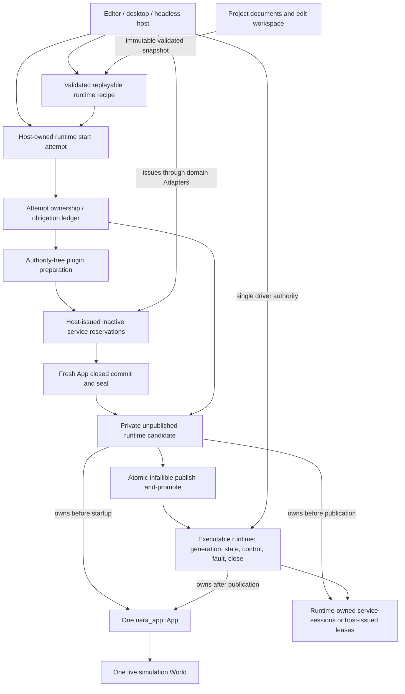
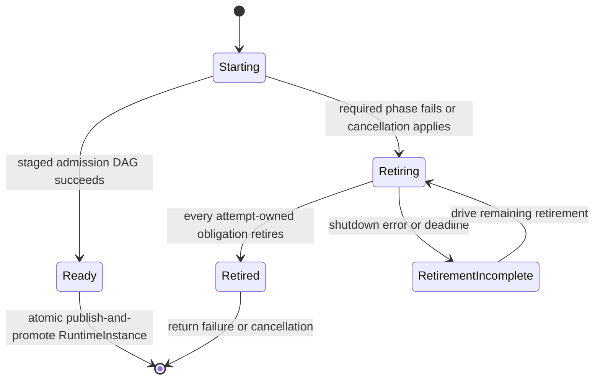
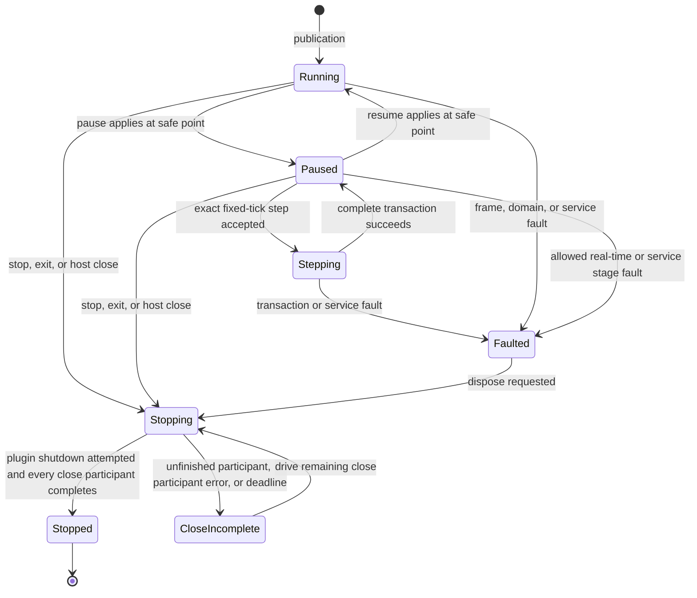

# ADR 0084: Executable Runtime Ownership and Isolation

**Status**: Accepted
**Date**: 2026-07-13
**Last Revised**: 2026-08-02
**Owner**: `nara_app` and concrete executable hosts
**Admission Trigger**: RGD-U2 through RGD-U6 replaced the plan/World behavior split, removed
process-global runtime contention, and proved three-Host parity, external Runner authority, and
fresh session reconstruction. RGD-U7 independently accepted this bounded authority at `5ebc45e`.
The post-registry-authority review found a direct fault-bridge bypass at `088e233`; the repaired
implementation independently retained this bounded authority at `27cbd12`.
**Revisit Trigger**: A concrete embedded or multi-runtime workflow proves that a thin lifecycle owner
cannot preserve `App` as the sole schedule/world authority
**Related**: ADR 0003, ADR 0008, ADR 0034, ADR 0039, ADR 0042, ADR 0052, ADR 0057, ADR 0058,
ADR 0076, ADR 0081, ADR 0082
**Decision Evidence**:
[RGD-U7 refreshed Runtime and Host decision matrix](../../knowledge/engineering/decisions/2026-07/2026-07-28T214815Z-rgd-u7-refreshed-runtime-and-host-independent-decision-matrix-cb08ecb6f5054f938f8a6d7de30941e4.md),
the historical [RGD-U7 decision matrix](../../knowledge/engineering/decisions/2026-07/2026-07-23T074018Z-rgd-u7-runtime-and-host-independent-decision-matrix-e2e5ea1ed4cf4e28860cedb32f0e7e48.md),
and the historical [RGF-U23 independent decision matrix](../../knowledge/engineering/decisions/2026-07/2026-07-21T112729Z-rgf-u23-runtime-and-host-independent-decision-matrix-a5b3266847924dfc93667c72c8929550.md)

## Context

`nara_app::App` already owns the simulation `World`, plugin lifecycle, schedules, runner contract,
startup state, and time transaction. Before RGF-U17, `ScenePlaySession` owned only a bare `World`;
tooling pause was an enum rather than execution control, and Stop could remove that world without
proving that tasks or native services closed. RGF-U17 removed that baseline through a concrete
Editor trial before RGF-U23's historical Proposed verdict and the later RGD-U7 decision.

A `World` is an ECS state container, not an executable game instance. A complete runtime boundary
also needs:

- one driver authority and main-thread safe points;
- startup candidate publication and a runtime generation;
- pause, resume, exact fixed-step, fault, stop, and restart semantics;
- propagation of schedule, gameplay-transaction, task, and service faults;
- runtime-scoped service leases and finite close evidence;
- a replayable host-owned recipe for fresh reconstruction;
- identical behavior when driven by editor, desktop, or headless hosts.

ADR 0076 contains runtime control as one part of a much larger observation/debug/replay direction.
This decision isolates the executable lifecycle contract without selecting system stepping,
checkpoint formats, replay persistence, or native code hot patching.

## Trial Evidence

RGF-U5 implements the code-first subset in `nara_app`: sealed-App admission, an unpublished
candidate, startup-before-promotion, non-reused generations, safe-point controls, exact fixed-tick
stepping, sticky typed faults, explicit move-only close obligations, and retryable finite close.
`nara_winit` drives that runtime instead of raw `App`; the runtime remains a thin owner around one
App and imports no project, content, tooling, window, or renderer policy.

RGF-U26 freezes the equivalent manual reference-game task and failure cuts. RGF-U24 then adds one
private product start attempt and obligation ledger, completes guarded scene/startup work while the
candidate is unpublished, and linearizes final fault observation plus owner/visibility transfer
through a single-use `RuntimePublicationSlot`. `HeadlessRun` hides that choreography, preserves
fresh generations, and retains incomplete cleanup for later bounded drives. Product and manual
paths prove the same plan, command, authoritative first tick, pre-owner rejection, late-hook
rejection, and incomplete-retirement custody semantics.

At the U23 review point this evidence was intentionally incomplete. U13 supplied desktop product
parity and U17 supplied Editor ownership, but U23 had not accepted the runtime and Host proposals
or their compatibility. Its Proposed verdict is historical evidence, not current authority.

RGF-U17 adds the Editor trial: root `EditorProjectSession` owns preparation, start attempts,
published runtime generations, controls, close evidence, and retirement while `nara_tooling` and
egui retain only UI-neutral commands/views/results. Cancel during Starting retains the attempt until
retirement, normal cleanup continues across frames, close failure prevents false-success Restart,
and runtime edit/Apply Changes execute at generation-stamped safe points. Together with U13 this
completes the named product-path evidence input.

RGF-U23 independently reviewed the earlier revision at `f7e5ee2` and retained this ADR as
Proposed. RGD-U2 then bound composition, candidate, and runtime safe points to one exact frozen
behavior snapshot. RGD-U3 replaced process-global reporter/schedule contention with bounded
per-runtime routes. RGD-U4, U5, and U6 supplied the missing reconstruction, three-Host, and
renamed-dependency external-Runner evidence. RGD-U7 independently re-reviewed all metrics and
accepted this bounded Runtime authority without admitting a universal topology or public Runner
SPI.

The accepted scope remains only already-compiled, Host-trusted code-first and RGF paths. Project
data does not authorize Cargo resolution, build scripts, proc macros, native packages/importers, or
in-process Play; broader activation remains owned by OQ-031 or an Accepted successor.

Later product hardening changed the executable evidence after the first RGD-U7 decision. The
refresh removes public executable-registry replacement authority, checks one private Registry
instance at direct and managed schedule boundaries, preserves receipt-backed Editor persistence,
bounded reload terminality, and paused input transitions, and re-runs the complete serial product
suites. The first independent refresh at `088e233` found that direct code could temporarily replace
and restore the reporter or selected fallback handler while preserving final identity. Commit
`27cbd12` closes that ordinary mutation path with structural revision hooks and rolling,
Bevy-semantic change epochs at direct and managed safe points, including maintenance observers.
This detects structural writes and in-place writes tracked by Bevy change detection. Explicit
`bypass_change_detection`, manual change-tick rewriting, unsafe/raw ECS mutation, and equivalent
trusted-native escape hatches are outside this integrity guarantee. The final review retained every
metric without expanding the trust scope or introducing a universal Runtime/Host interface.

## Decision

One executable runtime is a thin lifecycle owner around exactly one `nara_app::App`.



The conceptual names `RuntimeCandidate` and `RuntimeInstance` may be used by implementation and
plans, but this ADR freezes their unpublished/published ownership contract, not final public type
names or module layout.

The conceptual name `RuntimeStartAttempt` denotes the unique Host-owned operation that owns the
ledger, prepared owners, reservations, and any partial App before candidate admission. Only after
the App is successfully committed and sealed does the attempt contain a private
`RuntimeCandidate`, which it retains until publication or terminal retirement. It is not a Cargo
build handle, a cloneable reference, a tooling-view value, or a second active runtime. A concrete
Host may keep the type private or advanced; ordinary game authors and `nara_tooling` models do not
need it.

### Ownership

- An unpublished `RuntimeCandidate` exclusively owns one sealed, unstarted `App` plus every
  explicitly registered runtime close obligation. Admission rejects an active hook, an
  already-started App, a raw runner that can bypass runtime driving, or any first-party or
  third-party obligation-bearing declaration whose owner was not registered. Arbitrary App/World
  resources are caller-owned by default; the runtime cannot infer shutdown semantics from their
  Rust types. Immediate runtime-local cleanup may remain in the once-only plugin shutdown hook;
  owners that require Host-issued authority, asynchronous progress, or waitable close must register
  a typed close obligation before App sealing.
  After successful startup and every fallible publication precondition, one atomic, infallible
  publish-and-promote move makes the same owner the Host-visible executable runtime. No
  promoted-but-unpublished owner or fallible hook exists across that boundary. `App` remains the
  only owner of schedules, plugin lifecycle, time domains, and simulation-`World` mutation.
  This no-runnable-session assertion applies to a concrete Host publication slot. Advanced
  code-first use of `ReadyRuntimeCandidate::promote()` may instead receive an already faulted
  `RuntimeInstance` when a fault wins its final race; that owner remains observable and closeable,
  but it is not a Host-published runnable session.
- The executable runtime does not register systems or plugins, expose a second scheduler, or keep a
  second time model. It delegates frame/fixed execution to its `App`.
- The host owns project/edit documents, validated settings, the runtime recipe, and reconstruction
  authority. Those values do not become mutable runtime ECS state.
- Each runtime has a non-reused generation. Runtime-owned identity domains, time debt, command and
  task queues, mutable assets, backend sessions, control requests, and faults are not shared across
  generations. Deliberately shared caller-owned resources remain outside the runtime's isolation and
  `Stopped` proof unless the caller explicitly transfers a close obligation at App sealing.
- Immutable, version-stamped project/schema/catalog snapshots may be shared only when the runtime
  recipe proves the same project revision and every consumer treats them as immutable.
- Active runtime inspection and mutation use bounded observation and safe-point commands. Tooling
  does not retain unrestricted mutable access to the runtime `World`.
- The concrete Host owns the `RuntimeStartAttempt`, the published `RuntimeInstance`, and any
  stop-first replacement intent. `nara_tooling` owns commands, views, observation policy, and Apply
  Changes models; it does not store either authority-bearing owner. This leaves in-process and
  child-process Play as replaceable Host Adapters rather than public tooling topologies.
- The platform event loop remains host-owned. It supplies events and elapsed real time through the
  runtime drive contract rather than becoming a second runtime owner. It does not retain `&mut App`
  or invoke `App::run_once` behind runtime control, fault, and close state.
- The selected Platform/Runner Adapter may be first-party or external. It is chosen before runtime
  candidate construction, drives `RuntimeInstance` through the same public control/drive/close
  contract, and cannot be replaced from a plugin hook. External candidates are not filtered by
  crate path or first-party ID.

### Construction and Publication

On the integrated product path, ADR 0082 or an explicit successor supplies one lineage-compatible
immutable project revision, resolved composition plan, replayable recipe, and immutable
service-admission requirements. A code-first caller may instead supply a directly configured sealed
App without a raw installed runner and without adopting those outer scopes. In either path, the
concrete owner begins one `RuntimeStartAttempt`, reserves its exclusive logical publication
slot/epoch, and establishes one
ownership/obligation ledger before the first fallible preparation, hook, or acquisition. This ADR
then owns the complete staged admission DAG and admits a sealed App plus that ledger into an
unpublished candidate before registry/scene/startup work:

1. verify that revision, plan, recipe, compiled capabilities, and service requirements describe one
   generation and the already validated dependency DAG;
2. under the existing ledger, privately materialize a fresh move-only plugin owner from every
   repeatable definition, preserve its exact definition/configuration key, and retain no
   installed/live plugin object in the recipe;
3. request host-issued and runtime-local inactive reservations through concrete domain Adapters,
   transferring each successful acquisition directly into the start attempt;
4. construct one fresh `App`, commit plugin build/finish, seal it, then move it and the complete
   registered ledger into one unpublished `RuntimeCandidate`;
5. freeze required schema/registry state through candidate-scoped admission;
6. bind and initialize required service sessions from the reserved authorities in dependency order;
7. preflight and spawn the selected scene snapshot;
8. complete startup schedules, initial diagnostics/status, stale-revision checks, and every other
   fallible publication precondition inside the candidate;
9. atomically and infallibly publish-and-promote the candidate into the Host's visible runtime slot
   only after every required predecessor succeeds.

These are dependency stages, not permission to consume a service early. Plugin build/finish may
declare service requirements but cannot use an active gameplay-facing session; scene spawn and
startup may consume a session only after its activation predecessor has succeeded. A future domain
may subdivide a stage, but it must preserve the ledger -> pure-validation/plugin-preparation ->
inactive-reservation -> App commit/seal -> candidate/freeze -> service-activation -> scene -> startup/
publication-preflight -> atomic publish-and-promote dependency edges.

Failure before publication returns a typed startup and shutdown report and publishes no runnable
session. Before step 4 completes, the start attempt retires its partial App, prepared owners,
inactive reservations, and other obligations directly through the ledger; no
`RuntimeCandidate` exists. After step 4, the start attempt retains the candidate and retires its
App, activated sessions, and remaining resources through the same ledger in reverse admitted
dependency order. The final boundary is one ownership and visibility cut: it consumes the
candidate directly into the Host's visible `RuntimeInstance` slot, keeps the complete ledger and
`App` under that owner, and leaves the attempt with access to neither. There is no separately
fallible promotion or final-publication phase. Publication atomicity does not claim that arbitrary
external effects are reversible, and the ledger remains shutdown/fault traversal rather than a
service locator.

That cut compare-consumes the attempt's non-reused publication epoch and exclusive slot exactly
once. A stale epoch, duplicate call, conflicting slot owner, cancelled attempt, or completion that
arrives after cancellation rejects before consuming the candidate and cannot make a runtime
visible.

### Start-Attempt and Runtime State Machines

Startup belongs to the unpublished `RuntimeStartAttempt`, not to a partially published
`RuntimeInstance`:



`Ready` is consumed exactly once by the atomic publish-and-promote boundary into the only visible
runtime generation. A
`RetirementIncomplete` attempt remains owned and cannot yield a runtime or permit a conflicting child
lease until retirement succeeds or the process authority is torn down.

The published `RuntimeInstance` begins at `Running`:



`Stopped -> Starting` is not a transition on the same object. Restart is a concrete Host operation
that stops the old runtime, refreshes the exact recipe if required, and begins a distinct start
attempt with a new generation.

Driving incomplete retirement or close polls only unfinished participants. It never invokes a
once-only plugin shutdown hook or already-attempted owner a second time; an unrecoverable failure
may remain incomplete until process authority is torn down.

A once-only plugin shutdown hook failure is terminal teardown evidence rather than an unfinished
close participant. If every separately registered close obligation completes, the runtime reaches
the `Stopped` ownership state, while the active Stop/RetryClose ticket records
`Failed(CloseFailed)` and a platform Host returns a distinct teardown error. `Stopped` therefore
proves ownership terminality, not that every teardown hook succeeded.

Control has two observable layers:

```text
request result: Accepted | Rejected
operation result: Pending | Applied | Failed
```

- Control requests apply only at declared safe points. Rejected requests make no partial change.
- Stop is idempotent. A Stop requested during a system or fixed transaction waits for the current
  transaction boundary before close begins.
- Restart while a start attempt, `Stepping`, `Stopping`, or incomplete retirement owns authority is
  rejected. The Host may retain one pending restart intent and continue it after the current owner
  reaches an allowed terminal state.
- A `Faulted` runtime executes no further gameplay frame. It permits bounded observation and close.

### Frame, Pause, and Exact Step

- The host provides real elapsed time; the runtime delegates one app-frame transaction to `App`.
- `Running` uses ADR 0039 normal bounded fixed catch-up and frame semantics.
- `Paused` continues explicitly allowed real-time work such as task polling, diagnostics, window
  housekeeping, asset observation, and backend liveness. It does not advance ordinary virtual or
  fixed simulation.
- Exact step is accepted only from stable `Paused`. It executes one complete fixed
  `Prepare -> Simulate -> Finalize` transaction and one gameplay
  `Admit -> Consume -> Capture -> Acknowledge` transaction, then returns to `Paused` only on
  success.
- Exact step preserves pre-existing whole-tick debt, sub-tick remainder, interpolation state,
  pause state, and time scale. It does not mean one render frame.
- Change/removal trackers rotate at the same complete transaction boundary defined by `App`; a
  wrapper cannot add a second tracker rotation.

### Fault Semantics

- The first structured runtime fault is sticky. Later observations may add bounded diagnostics but
  do not replace fault provenance.
- Engine-owned fallible execution may attach a validated static diagnostic code, safe summary, and
  producer origin to that fault. Unknown third-party errors retain only the generic fault kind and
  source; arbitrary error text and dynamic scheduler context are not runtime diagnostic authority.
- Gameplay ingress poison, active-batch invariant failure, admission/acknowledgement failure,
  fallible system failure, required task integration failure, and required service failure move the
  runtime to `Faulted`; they are not discarded or represented only by logs.
- A system or service fault may occur after partial runtime mutation. Nara does not claim in-place
  rollback. The failed generation is observed and discarded through normal close.
- Panic recovery is not part of this decision. A future panic-containment contract must state
  unwind, process-abort, thread, native callback, and invariant consequences explicitly.
- Logs and tracing may mirror runtime faults but are not the queryable source of truth.

### Close and Restart

- `Plugin::shutdown` may complete immediate non-blocking teardown or initiate close work. It must not
  hide an unbounded wait from the host.
- Waiting services expose pollable, deadline-bound close participants. The host can continue
  pumping allowed real-time/platform work while close progresses.
- Only completion of every registered close participant permits `Stopped`. A timeout, unfinished
  worker owner, live native lease, or participant failure remains `CloseIncomplete` and prevents a
  conflicting replacement. A terminal plugin hook failure remains separately observable after
  ownership reaches `Stopped`. Abnormal Drop may transfer an unfinished owner to process-owned
  quarantine, but that fallback is never clean-stop evidence.
- `Drop` is best effort and cannot be used as product evidence that a runtime stopped cleanly.
- Editor Close Scene, external reload, Restart, a second Start Play, and editor exit all obey
  stop-first. Failure retains the faulted or incomplete owner and diagnostics instead of silently
  removing it.
- A fresh restart contains none of the old mutable world, queue, task, time, service, backend, or
  identity-domain state.
- This ADR owns retirement of runtime-scoped sessions and host-issued candidate leases. ADR 0082
  owns whether the parent process/domain authority may outlive or be shared by later runtimes.

### Deliberately Deferred

This decision does not define:

- system-by-system stepping or schedule topology exposure;
- persistent checkpoints, replay artifacts, or backward debugging;
- compatible native function hot patching or state migration;
- a public universal runtime trait;
- a public object-safe runtime factory before two genuinely substitutable producers exist;
- concurrent multi-driver execution;
- a second render ECS world or Bevy `SubApp` as the Play runtime boundary.

This does not defer external runner reachability. The managed path guarantees explicit
Platform/Runner Adapter selection and one driver authority; only the exact trait/object/factory
shape remains evidence-driven. Direct `App::set_runner` plus `App::run` is a separate embedding path
and cannot be combined with managed-runtime admission for the same App.

## Alternatives Considered

### Option A: Make `App` the Complete Runtime Owner

**Pros**: Fewest types; `App` already owns the world, schedules, runner, and plugins.

**Cons**: Builder/configuration, active generation, host leases, fault/close state, and restart
recipe accumulate in one public object. Faulted/stopped ownership and unpublished candidates become
hard to represent.

**Decision**: Rejected for the product lifecycle while preserving `App` as the deep execution
module.

### Option B: Wrap One `App` in a Thin Executable Runtime Owner

**Pros**: Keeps one execution authority, gives editor/headless/desktop a shared lifecycle, and makes
generation, fault, control, close, and fresh reconstruction explicit.

**Cons**: The wrapper can drift into a second `App` if its scope is not constrained.

**Decision**: Accepted.

### Option C: Let Each Host Own `App`, Services, and Control Independently

**Pros**: Minimal common infrastructure and maximum platform freedom.

**Cons**: Editor, desktop, and headless semantics diverge; bare-world Play, destructor shutdown, and
silent session replacement remain possible.

**Decision**: Rejected.

### Option D: Use Bevy `SubApp` as the Runtime Boundary

**Pros**: Reuses a mature App-owned secondary world/update mechanism.

**Cons**: A `SubApp` is a sub-pipeline within one owning App, not an isolated Play generation,
project recipe, service-shutdown owner, or fresh restart boundary.

**Decision**: Rejected for executable-runtime ownership. Internal render extraction may still use
an equivalent private optimization later.

## Success Metrics

| Metric | Target | Measurement |
|---|---:|---|
| Startup publication | Failure in plugin/freeze/startup/spawn/service/publication-preflight phases publishes no runtime session; the final publish-and-promote cut is infallible and compare-consumes one current attempt epoch | Start-attempt fault-injection, stale/duplicate/late-epoch, and binary publication-cut tests |
| Ownership handoff | Every registered obligation is owned exactly once: retired by the start attempt before candidate admission, retired through the candidate afterward, or moved by the atomic publication cut into the visible runtime | Attempt/candidate-admission, publication-cut, and close-order tests |
| App admission | Unsealed, already-started, raw-runner, or declared obligation-bearing Apps without registration reject before candidate admission; arbitrary resources remain caller-owned | Code-first admission tests |
| Play execution | Editor Play runs startup and scheduled systems through `App`, with no bare-`World` session owner | Tooling integration and static API audit |
| Driver parity | Editor, desktop, and headless use one frame/fixed transaction for the same command stream | Reference-game semantic snapshot tests |
| Driver authority | First-party and renamed-dependency external Platform/Runner Adapters are explicitly selected, drive `RuntimeInstance`, and cannot call raw `App::run_once` behind it or coexist with an installed raw App runner | Clean-room runner, boundary, mutual-exclusion, and static-audit tests |
| Exact step | One accepted request advances exactly one complete fixed/gameplay transaction and returns to `Paused` | RGF-U5 exact-step tests |
| Fault closure | Every named gameplay/system/task/service failure reaches sticky runtime `Faulted` | Fault matrix tests |
| Runtime isolation | Two generations share no mutable World/queue/task/time/service/backend/identity state | Reconstruction tests |
| Finite close | Never-completing shutdown does not block the host and never reports `Stopped` | Deadline/shutdown fixture |
| Stop-first workspace | Close/reload/restart/second Play/editor exit cannot silently drop or replace a live/failed owner | Workspace state-machine tests |
| API authority | Runtime wrapper exposes no system/plugin registration or independent schedule/time API | Public API and dependency review |
| Early ownership value | The minimal candidate/runtime path closes named fault/ownership gaps without exceeding the public-concept, caller-glue, or lifecycle-state limits against the independently frozen manual counterfactual | RGF-U26 baseline plus RGF-U24 reversal matrix and independent review |

## Risks and Mitigations

| Risk | Severity | Likelihood | Mitigation |
|---|---|---:|---|
| Runtime wrapper becomes a second `App` | Critical | Medium | Prohibit schedule/plugin/time ownership; delegate exactly one `App`. |
| Plugin and runtime states drift | High | Medium | Treat plugin lifecycle as a startup/close sub-state, not a second product state machine. |
| Startup atomicity is mistaken for rollback | High | Medium | Promise unpublished candidate plus shutdown report, not reversal of external effects. |
| Attempt, candidate admission, or publication loses or double-owns a close obligation | Critical | Medium | Establish one ledger before fallible work, retain partial state in the attempt, move it once with the sealed App into the candidate, and atomically publish-and-promote the same owner; the attempt retains no published copy or intermediate owner. |
| Faulted system leaves a partially mutated World | High | Medium | Stop execution, preserve first fault, observe if safe, and discard the generation. |
| Direct tooling access bypasses safe points | High | High | Replace unrestricted Play-world mutation with commands and bounded observations. |
| Shutdown freezes editor or server | High | Medium | Use pollable close participants and deadlines; keep host pumping. |
| Recipe captures one-shot/runtime data | High | Medium | Restrict it to validated immutable inputs and reconstructible factories. |
| Platform event-loop constraints leak into runtime | Medium | Medium | Keep the event loop in the host/driver and pass normalized input/time/control. |
| Embedded shared resources invalidate isolation claims | High | Medium | Treat arbitrary resources as caller-owned, require explicit transfer for runtime close obligations, and scope isolation/Stopped evidence to registered runtime-owned state. |
| The wrapper adds more concepts than the failures justify | High | Medium | Freeze U26's task-equivalent manual raw-App path before Host implementation, then make U24 compare the same content, plan, command, fixed-tick task, and failure cuts before Editor/desktop diffusion; reject or simplify if the ordinary concept or ownership comparison fails. |

## Consequences

With this decision:

- ADR 0003 remains authoritative for `App`, plugin, schedule, and world ownership;
- ADR 0034's isolated Play decision remains, but its bare `World` session becomes an obsolete
  transitional implementation;
- ADR 0039 remains the time/frame transaction authority;
- ADR 0057 remains the fixed-tick gameplay transaction authority and its faults must reach runtime
  failure;
- ADR 0076 retains observation, cursor, stepping research, checkpoint, replay, and hot-patch scope;
  this ADR becomes the canonical runtime lifecycle subset;
- ADR 0081 structural catalog replacement uses a fresh runtime recipe/generation rather than
  unfreezing an active registry;
- ADR 0082 owns the accepted outer process/project scope, service-authority placement, and
  parent/child lifetime rules. This ADR independently owns the executable-runtime node: candidate
  stages, publication, runtime-scoped session retirement, fault, close, and restart.

No existing ADR is superseded by this decision. It accepts no universal Host/Runner SPI, script
runtime, or replacement Render Host role.

## Admission Evidence

RGF-U5 implemented the code-first candidate/runtime trial; RGF-U24 added the concrete headless
Host/candidate trial and U26 reversal matrix; RGF-U17 and RGF-U13 added Editor and desktop evidence.
RGF-U23 reviewed that revision at `f7e5ee2` and retained this proposal because its behavior
registry, fault route, parity/Runner, and reconstruction evidence was incomplete.

RGD-U2 through RGD-U6 repaired those named gaps without shrinking the metrics: one frozen
behavior snapshot now binds composition, candidates, and managed safe points; fallible Bevy
execution uses per-runtime routes; fresh sessions include service/backend/identity state; public
Headless/Desktop/Editor paths share one semantic command oracle; and a renamed-dependency external
package drives one concrete managed runtime without a Runner SPI. RGD-U7 recorded independent
Runtime, Host, and compatible-pair reviews at the exact refreshed revisions. The accepted scope is
only already-compiled, Host-trusted code. Project data still does not authorize Cargo resolution,
build scripts, proc macros, native packages/importers, or in-process Play.

After subsequent source corrections invalidated that executable review baseline, the RGD-U2
authority refresh at `b4d105c` removed the public Registry resource contract and closed its direct
plus managed replacement bypasses. The initial refreshed RGD-U7 review at `088e233` exposed the
separate fault-bridge bypass described above; it is historical review input, not closure evidence.
The repaired matrix and verification at `27cbd12` independently retain the Runtime, Host, and
compatible-pair verdicts. Hosted CI, baseline, candidate, and publication evidence remain separate
downstream gates; this decision does not authorize them.

SRT-U3 at `05c67b6` implements the bounded engine-classified fault detail above and proves that
classified product Startup failure remains inside the unpublished candidate, prevents Host
publication, and retains its owner through finite retirement. This is an implementation refinement
of the accepted sticky-fault and startup-publication boundary, not a new Host or Runner role.

## Citations

- Bevy App ownership: `repo-ref/bevy/crates/bevy_app/src/app.rs`
- Bevy SubApp scope: `repo-ref/bevy/crates/bevy_app/src/sub_app.rs`
- Godot explicit main-loop lifecycle: `repo-ref/godot/core/os/main_loop.h`
- Godot SceneTree runtime boundary: `repo-ref/godot/scene/main/scene_tree.h`
- Active implementation slice: [Reference-Game-Driven Foundation Plan](../../plans/2026-07-12-001-refactor-reference-game-driven-foundation-plan.md)
