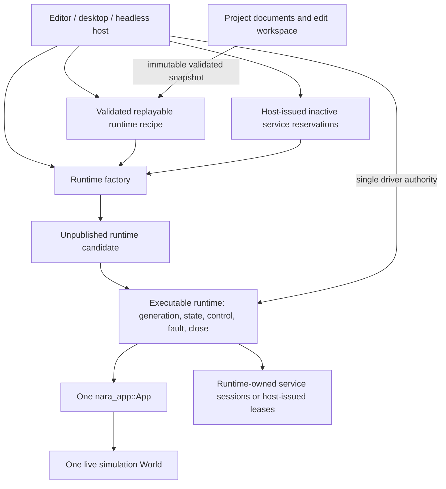
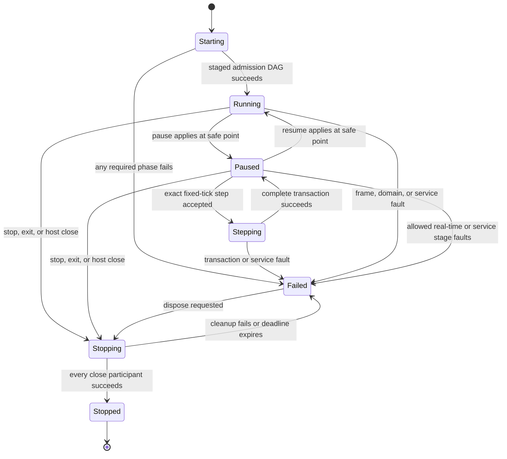

# ADR 0084: Executable Runtime Ownership and Isolation

**Status**: Proposed
**Date**: 2026-07-13
**Owner**: `nara_app`, executable hosts, and `nara_tooling`
**Admission Trigger**: RGF-U5 replaces the bare Play `World` and proves the same driven runtime,
fault, exact-step, restart, and bounded-stop contract in editor, desktop, and headless products
**Revisit Trigger**: A concrete embedded or multi-runtime workflow proves that a thin lifecycle owner
cannot preserve `App` as the sole schedule/world authority
**Related**: ADR 0003, ADR 0008, ADR 0034, ADR 0039, ADR 0042, ADR 0052, ADR 0057, ADR 0058,
ADR 0076, ADR 0081, ADR 0082

## Context

`nara_app::App` already owns the simulation `World`, plugin lifecycle, schedules, runner contract,
startup state, and time transaction. `ScenePlaySession`, however, currently owns only a bare
`World`; tooling pause is an enum rather than execution control, and Stop can remove that world
without proving that tasks or native services closed.

A `World` is an ECS state container, not an executable game instance. A complete runtime boundary
also needs:

- one driver authority and main-thread safe points;
- startup candidate publication and a runtime generation;
- pause, resume, exact fixed-step, fault, stop, and restart semantics;
- propagation of schedule, gameplay-transaction, task, and service faults;
- runtime-scoped service leases and finite close evidence;
- a replayable host-owned recipe for fresh reconstruction;
- identical behavior when driven by editor, desktop, or headless hosts.

ADR 0076 contains runtime control as one part of a much larger observation/debug/replay direction.
This proposal isolates the executable lifecycle contract without selecting system stepping,
checkpoint formats, replay persistence, or native code hot patching.

## Decision

If accepted, one executable runtime will be a thin lifecycle owner around exactly one
`nara_app::App`.



The conceptual name `RuntimeInstance` may be used by implementation and plans, but this ADR
freezes the ownership contract, not the final public type name or module layout.

### Ownership

- The executable runtime exclusively owns one `App`. `App` remains the only owner of schedules,
  plugin lifecycle, time domains, and simulation-`World` mutation.
- The executable runtime does not register systems or plugins, expose a second scheduler, or keep a
  second time model. It delegates frame/fixed execution to its `App`.
- The host owns project/edit documents, validated settings, the runtime recipe, and reconstruction
  authority. Those values do not become mutable runtime ECS state.
- Each runtime has a non-reused generation. Runtime-local identity domains, time debt, command and
  task queues, mutable assets, backend sessions, control requests, and faults are not shared across
  generations.
- Immutable, version-stamped project/schema/catalog snapshots may be shared only when the runtime
  recipe proves the same project revision and every consumer treats them as immutable.
- Active runtime inspection and mutation use bounded observation and safe-point commands. Tooling
  does not retain unrestricted mutable access to the runtime `World`.
- The platform event loop remains host-owned. It supplies events and elapsed real time through the
  same drive contract rather than becoming a second runtime owner.

### Construction and Publication

ADR 0082 supplies an immutable validated project revision, resolved composition plan, replayable
recipe, and any host-issued inactive candidate reservations. This ADR then owns the complete staged
admission DAG inside the unpublished candidate:

1. verify that revision, plan, recipe, compiled capabilities, and reservations describe one
   generation and the already validated service dependency DAG;
2. acquire any runtime-local inactive reservations that were not host-issued;
3. construct one fresh `App`, commit plugin build/finish, and freeze required schema/registry state;
4. bind and initialize required service sessions from the reserved authorities in dependency order;
5. preflight and spawn the selected scene snapshot;
6. complete startup schedules and publish initial diagnostics/status inside the candidate;
7. publish the runtime generation only after every required predecessor succeeds.

These are dependency stages, not permission to consume a service early. Plugin build/finish may
declare service requirements but cannot use an active gameplay-facing session; scene spawn and
startup may consume a session only after its activation predecessor has succeeded. A future domain
may subdivide a stage, but it must preserve the pure-validation -> inactive-reservation ->
App/freeze -> service-activation -> scene -> startup -> publication dependency edges.

Failure before publication returns a typed startup and cleanup report. It publishes no runnable
session. Activated sessions, inactive reservations, `App` work, and other candidate resources
retire in reverse admitted dependency order. Publication atomicity does not claim that arbitrary
external effects are reversible.

### Runtime State Machine



`Stopped -> Starting` is not a transition on the same object. Restart is a host operation that
stops the old owner and constructs a new runtime with a new generation.

Control has two observable layers:

```text
request result: Accepted | Rejected
operation result: Pending | Applied | Failed
```

- Control requests apply only at declared safe points. Rejected requests make no partial change.
- Stop is idempotent. A Stop requested during a system or fixed transaction waits for the current
  transaction boundary before close begins.
- Restart during `Starting`, `Stepping`, or `Stopping` is rejected. The host may request restart
  after the current operation reaches an allowed terminal/control state.
- A failed runtime executes no further gameplay frame. It permits bounded observation and close.

### Frame, Pause, and Exact Step

- The host provides real elapsed time; the runtime delegates one app-frame transaction to `App`.
- `Running` uses ADR 0039 normal bounded fixed catch-up and frame semantics.
- `Paused` continues explicitly allowed real-time work such as task polling, diagnostics, window
  housekeeping, asset observation, and backend liveness. It does not advance ordinary virtual or
  fixed simulation.
- Exact step is accepted only from stable `Paused`. It executes one complete fixed
  `Prepare -> Simulate -> Finalize` transaction and one gameplay
  `Admit -> Consume -> Capture -> Acknowledge` transaction, then returns to `Paused` only on
  success.
- Exact step preserves pre-existing whole-tick debt, sub-tick remainder, interpolation state,
  pause state, and time scale. It does not mean one render frame.
- Change/removal trackers rotate at the same complete transaction boundary defined by `App`; a
  wrapper cannot add a second tracker rotation.

### Fault Semantics

- The first structured runtime fault is sticky. Later observations may add bounded diagnostics but
  do not replace fault provenance.
- Gameplay ingress poison, active-batch invariant failure, admission/acknowledgement failure,
  fallible system failure, required task integration failure, and required service failure rise to
  runtime `Failed`; they are not discarded or represented only by logs.
- A system or service fault may occur after partial runtime mutation. Nara does not claim in-place
  rollback. The failed generation is observed and discarded through normal close.
- Panic recovery is not part of this proposal. A future panic-containment contract must state
  unwind, process-abort, thread, native callback, and invariant consequences explicitly.
- Logs and tracing may mirror runtime faults but are not the queryable source of truth.

### Close and Restart

- `Plugin::cleanup` may complete immediate non-blocking cleanup or initiate close work. It must not
  hide an unbounded wait from the host.
- Waiting services expose pollable, deadline-bound close participants. The host can continue
  pumping allowed real-time/platform work while close progresses.
- Only successful retirement of every participant permits `Stopped`. A timeout, detached worker,
  live native lease, or cleanup error remains `Failed` and prevents a conflicting replacement.
- `Drop` is best effort and cannot be used as product evidence that a runtime stopped cleanly.
- Editor Close Scene, external reload, Restart, a second Start Play, and editor exit all obey
  stop-first. Failure retains the failed owner and diagnostics instead of silently removing it.
- A fresh restart contains none of the old mutable world, queue, task, time, service, backend, or
  identity-domain state.
- This ADR owns retirement of runtime-scoped sessions and host-issued candidate leases. ADR 0082
  owns whether the parent process/domain authority may outlive or be shared by later runtimes.

### Deliberately Deferred

This proposal does not define:

- system-by-system stepping or schedule topology exposure;
- persistent checkpoints, replay artifacts, or backward debugging;
- compatible native function hot patching or state migration;
- a public universal runtime trait;
- concurrent multi-driver execution;
- a second render ECS world or Bevy `SubApp` as the Play runtime boundary.

## Alternatives Considered

### Option A: Make `App` the Complete Runtime Owner

**Pros**: Fewest types; `App` already owns the world, schedules, runner, and plugins.

**Cons**: Builder/configuration, active generation, host leases, fault/close state, and restart
recipe accumulate in one public object. Failed/stopped ownership and unpublished candidates become
hard to represent.

**Decision**: Rejected for the product lifecycle while preserving `App` as the deep execution
module.

### Option B: Wrap One `App` in a Thin Executable Runtime Owner

**Pros**: Keeps one execution authority, gives editor/headless/desktop a shared lifecycle, and makes
generation, fault, control, close, and fresh reconstruction explicit.

**Cons**: The wrapper can drift into a second `App` if its scope is not constrained.

**Decision**: Proposed.

### Option C: Let Each Host Own `App`, Services, and Control Independently

**Pros**: Minimal common infrastructure and maximum platform freedom.

**Cons**: Editor, desktop, and headless semantics diverge; bare-world Play, destructor cleanup, and
silent session replacement remain possible.

**Decision**: Rejected.

### Option D: Use Bevy `SubApp` as the Runtime Boundary

**Pros**: Reuses a mature App-owned secondary world/update mechanism.

**Cons**: A `SubApp` is a sub-pipeline within one owning App, not an isolated Play generation,
project recipe, service-shutdown owner, or fresh restart boundary.

**Decision**: Rejected for executable-runtime ownership. Internal render extraction may still use
an equivalent private optimization later.

## Success Metrics

| Metric | Target | Measurement |
|---|---:|---|
| Startup publication | Failure in plugin/freeze/startup/spawn/service phases publishes no runtime session | Factory fault-injection tests |
| Play execution | Editor Play runs startup and scheduled systems through `App`, with no bare-`World` session owner | Tooling integration and static API audit |
| Driver parity | Editor, desktop, and headless use one frame/fixed transaction for the same command stream | Reference-game semantic snapshot tests |
| Exact step | One accepted request advances exactly one complete fixed/gameplay transaction and returns to `Paused` | RGF-U5 exact-step tests |
| Fault closure | Every named gameplay/system/task/service failure reaches sticky runtime `Failed` | Fault matrix tests |
| Runtime isolation | Two generations share no mutable World/queue/task/time/service/backend/identity state | Reconstruction tests |
| Finite close | Never-completing cleanup does not block the host and never reports `Stopped` | Deadline/cleanup fixture |
| Stop-first workspace | Close/reload/restart/second Play/editor exit cannot silently drop or replace a live/failed owner | Workspace state-machine tests |
| API authority | Runtime wrapper exposes no system/plugin registration or independent schedule/time API | Public API and dependency review |

## Risks and Mitigations

| Risk | Severity | Likelihood | Mitigation |
|---|---|---:|---|
| Runtime wrapper becomes a second `App` | Critical | Medium | Prohibit schedule/plugin/time ownership; delegate exactly one `App`. |
| Plugin and runtime states drift | High | Medium | Treat plugin lifecycle as a startup/close sub-state, not a second product state machine. |
| Startup atomicity is mistaken for rollback | High | Medium | Promise unpublished candidate plus cleanup report, not reversal of external effects. |
| Failed system leaves a partially mutated World | High | Medium | Stop execution, preserve first fault, observe if safe, and discard the generation. |
| Direct tooling access bypasses safe points | High | High | Replace unrestricted Play-world mutation with commands and bounded observations. |
| Cleanup freezes editor or server | High | Medium | Use pollable close participants and deadlines; keep host pumping. |
| Recipe captures one-shot/runtime data | High | Medium | Restrict it to validated immutable inputs and reconstructible factories. |
| Platform event-loop constraints leak into runtime | Medium | Medium | Keep the event loop in the host/driver and pass normalized input/time/control. |

## Consequences

If accepted:

- ADR 0003 remains authoritative for `App`, plugin, schedule, and world ownership;
- ADR 0034's isolated Play decision remains, but its bare `World` session becomes an obsolete
  transitional implementation;
- ADR 0039 remains the time/frame transaction authority;
- ADR 0057 remains the fixed-tick gameplay transaction authority and its faults must reach runtime
  failure;
- ADR 0076 retains observation, cursor, stepping research, checkpoint, replay, and hot-patch scope;
  this ADR becomes the canonical runtime lifecycle subset;
- ADR 0081 structural catalog replacement uses a fresh runtime recipe/generation rather than
  unfreezing an active registry;
- ADR 0082 remains the sole authority for outer process/project scopes, service-authority placement,
  and parent/child lifetimes. This ADR is the sole authority for its executable-runtime node:
  candidate stages, publication, runtime-scoped session retirement, fault, close, and restart.

No existing ADR is marked superseded while this proposal remains non-authoritative. Acceptance
must add reciprocal refinement metadata and update implementation evidence.

## Admission Evidence

RGF-U5 may implement an evidence-producing trial of this Proposed contract. Acceptance still
requires the complete public workflow and every success metric above through a separate admission
review; the existence of a wrapper does not make the ADR authoritative. A wrapper type, state enum,
or bare-world adapter without scheduled execution, fault propagation, and finite shutdown is
insufficient.

## Citations

- Bevy App ownership: `repo-ref/bevy/crates/bevy_app/src/app.rs`
- Bevy SubApp scope: `repo-ref/bevy/crates/bevy_app/src/sub_app.rs`
- Godot explicit main-loop lifecycle: `repo-ref/godot/core/os/main_loop.h`
- Godot SceneTree runtime boundary: `repo-ref/godot/scene/main/scene_tree.h`
- Active implementation slice: [Reference-Game-Driven Foundation Plan](../../plans/2026-07-12-001-refactor-reference-game-driven-foundation-plan.md)
