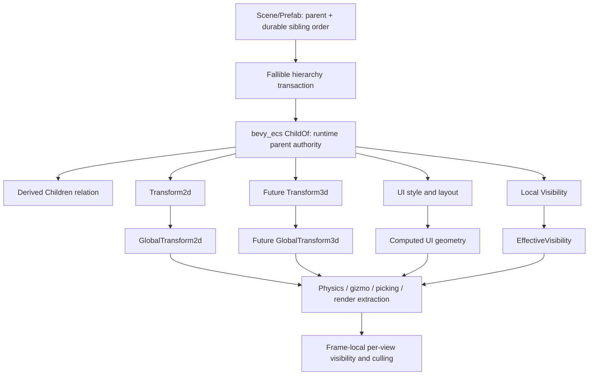
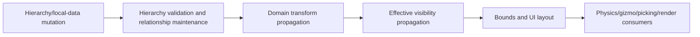

# ADR 0085: Hierarchy, Transform, and Visibility Semantics

**Status**: Proposed
**Date**: 2026-07-13
**Owner**: `nara_scene`, `nara_transform`, `nara_ui`, and render extraction domains
**Admission Trigger**: A future hierarchy-consuming product slice plus a focused 3D/UI design spike
prove hierarchy mutation, reparenting, transform propagation, effective visibility, and stable
sibling order without domain-specific topology copies
**Revisit Trigger**: A concrete world-space UI, mixed 2D/3D hierarchy, or streaming workflow proves
that continuous domain participation or one shared topology cannot express required behavior
**Related**: ADR 0005, ADR 0006, ADR 0018, ADR 0022, ADR 0025, ADR 0032, ADR 0034, ADR 0053

## Context

Nara uses ECS hierarchy data, dimension-specific authoring transforms, and a nara-owned runtime UI.
The current implementation is still transitional:

- custom `Parent` is the runtime parent authority while `Children` is rebuilt in `PostUpdate`;
- direct runtime parent insertion can create missing-parent or cyclic graphs that document
  validation would reject;
- `GlobalTransform2d` exists without a propagation system, so sprite and camera extraction consume
  local transforms and ignore ancestors;
- reparent patches change the parent edge without stating whether local or world pose is preserved;
- scene `Visibility` and `UiNode.visible` are separate authoring authorities;
- UI and render tie-break behavior can depend on runtime entity/query order.

These semantics affect every scene, prefab, UI tree, physics adapter, animation target, editor
gizmo, camera, renderer, and future 3D feature. They must be decided before persistent content and
domain-specific workarounds make a later change expensive. Culling algorithms and spatial caches
remain separate performance decisions.

## Decision

If accepted, nara will use one validated, deterministically ordered ECS hierarchy forest as the
shared topology. 2D, 3D, and UI share topology and effective hierarchy visibility while owning
separate local/global spatial projections.



### One Hierarchy Authority

- `SceneEntityRecord.parent` plus durable sibling order is the persistent document authority.
- Runtime hierarchy uses the `bevy_ecs` relationship substrate. `ChildOf` is the only runtime
  parent-edge authority; `Children` is the relationship-derived target collection and is not
  independently mutable application state.
- Nara does not maintain a second custom `Parent`/`Children` graph or rebuild children from a
  query at the end of a frame.
- Hierarchy forms a forest: an entity has at most one parent; missing targets, self-parenting,
  cross-world edges, and cycles are invalid.
- Document loading and runtime hierarchy transactions preflight the complete affected edge set and
  publish atomically. Failure leaves the old graph unchanged.
- Nara-owned hierarchy commands preflight and return typed errors without mutation. Advanced direct
  `ChildOf` insertion uses Bevy substrate semantics: self-parent and missing-target edges may be
  removed immediately by relationship hooks before a later propagation barrier can observe the
  attempted edge. Nara does not promise precise rejected-edge provenance from an uninstrumented
  direct substrate mutation. An adapter that exposes such mutation must either capture a structured
  diagnostic at its mutation/hook boundary or document the automatically normalized low-level
  behavior.
- Propagation barriers detect residual cycles/corruption and missing or inconsistent derived state,
  fault before extraction publishes a partial frame packet, and never invent provenance for an edge
  that a substrate hook already removed.
- Because Bevy `Children` is a `linked_spawn` relationship target, any normal despawn of a parent
  immediately despawns its linked subtree, including direct `World`/entity despawn outside a
  nara-owned hierarchy API. Preserving children requires an explicit detach, promote, or reparent
  transaction before despawning the parent.

### Durable Sibling Order

Sibling order is explicit durable authoring data because editor trees and retained UI need a stable
order. It is not inferred from runtime `Entity`, query iteration, hash-map order, or the timing of
component insertion.

- A scene/prefab document assigns one deterministic order among siblings. The exact version-1
  field/operation representation is selected with the format implementation and must support
  atomic insert, move, duplicate, and reparent.
- Editor hierarchy presentation and UI source-order tie-breaking consume this order.
- Core system execution does not inherit sibling order; schedules remain explicit.
- World rendering does not inherit sibling order; render layers, depth/sort keys, and stable source
  order remain explicit render-domain data.

### Spatial Domains and Propagation

Authoring and derived transforms are separated by domain:

| Domain | Persistent local authority | Runtime-derived projection |
|---|---|---|
| 2D world | `Transform2d` | `GlobalTransform2d` |
| Future 3D world | `Transform3d` | `GlobalTransform3d` |
| Runtime UI | UI layout/style inputs | Computed rect and UI-global geometry |

- `Transform2d` and future `Transform3d` remain separate user-facing components. Nara does not
  force 2D authoring through a universal 3D transform.
- Each spatial domain shares hierarchy traversal, validation, dirty-root tracking, and scheduling
  infrastructure, but owns its local/global math and diagnostics.
- Propagation follows a continuous participating chain. A non-participating parent is a boundary
  for that spatial domain; traversal does not skip it to inherit from a more distant ancestor.
  The first participating descendant after that boundary becomes a new domain root and computes
  `global = local`. Intentional grouping entities add the domain's identity local transform or an
  explicit future domain-boundary marker.
- A discontinuity may produce a tooling diagnostic but is not itself a runtime fault unless the
  participating component's contract explicitly requires continuous inheritance.
- UI does not implicitly consume `Transform2d`; world-space UI requires an explicit adapter and a
  concrete workflow.
- Render extraction, physics adapters, gizmos, picking, and spatial queries consume the appropriate
  global projection. They do not recompute parent matrices independently.

For 2D and 3D transform chains:

```text
root_global = root_local
child_global = parent_global * child_local
```

Global projections are runtime-only derived state. They do not serialize into scene/prefab data or
become an Apply Changes source unless a specific authoring operation converts them back to local
data.

### Reparent Semantics

The low-level hierarchy operation has one deterministic meaning: change the topology and preserve
the authored local values (`KeepLocal`). Higher-level editor/runtime commands must explicitly
select `KeepLocal` or `KeepWorld`; they do not use a default boolean parameter.

`KeepWorld` is a fallible transform-domain transaction:

```text
new_local = inverse(new_parent_global) * old_global
```

- The transaction captures the old global pose, validates the target graph, computes a candidate
  local transform, then commits edge and local value together.
- A singular/non-invertible parent global transform rejects the transaction.
- If matrix composition produces shear or another value that the domain's authored TRS type cannot
  represent within its declared tolerance, the transaction rejects rather than approximating and
  silently drifting.
- A hierarchy-only entity may use `KeepLocal`; `KeepWorld` requires participation in the selected
  spatial domain and a determinable old global/domain root. If the new parent does not participate
  in that domain, the moved entity becomes a new domain root and its prospective parent transform
  is the identity; `KeepWorld` still fails if the old global cannot be determined.
- Editor drag-and-drop may request `KeepWorld`, but a failure leaves parent and local transform
  unchanged and returns a structured diagnostic.

### Visibility Layers

Nara has one hierarchy-level authoring visibility source:

```text
root effective = local != Hidden
child effective = parent effective && local != Hidden
```

- Local `Visibility::{Visible, Hidden}` is persistent authoring intent. Absence uses the domain's
  documented visible default.
- Runtime-only `EffectiveVisibility` is derived through the complete shared topology. A child
  cannot force itself visible through a hidden parent.
- `UiNode.visible` or equivalent parallel authoring booleans are retired when this proposal is
  implemented. UI, world rendering, picking, hit testing, focus, and accessibility consume the
  shared effective result.
- `Hidden` suppresses presentation, picking/hit testing, focus, and accessibility exposure. It
  does not delete UI layout, stop gameplay simulation, pause tasks, or disable scripts/systems.
- Future `DisplayNone`, gameplay `Active/Enabled`, editor-force-visible, and process/pause states
  are different contracts and must not overload hierarchy visibility.

Per-view visibility remains frame-local:

```text
EffectiveVisibility
  && render layers / camera mask
  && target and viewport policy
  && bounds, frustum, occlusion, or domain culling
```

One entity may be visible to one view and culled from another. Per-view results do not collapse
into a persistent or world-global boolean. ADR 0053 continues to own culling scale and cache policy.

### Propagation Barriers

Named scheduling barriers establish derived-state freshness:



- Startup completes propagation before the first consumer/extract pass.
- The complete fixed transaction and variable update paths run the named barriers before consumers
  that declare fresh global/effective state.
- Extract always observes one internally consistent hierarchy, global-transform, and effective-
  visibility snapshot for that app frame.
- Nara does not promise immediate recomputation after arbitrary component mutation. Systems that
  require fresh derived values join after the relevant named barrier.
- A residual relationship or propagation invariant faults before extraction publishes a partial
  frame packet. Hook-rejected direct mutations follow the mutation-boundary provenance rule above.

## Alternatives Considered

### Option A: Give 2D, 3D, and UI Separate Hierarchies

**Pros**: Each domain can optimize its own relation and ordering rules.

**Cons**: Deletion, provenance, editor selection, prefab expansion, reparenting, and visibility
diverge. Cross-domain composition needs synchronization among multiple graphs.

**Decision**: Rejected.

### Option B: Keep Custom `Parent` and Rebuild `Children` in `PostUpdate`

**Pros**: Small change from the current implementation and simple component shapes.

**Cons**: Duplicates the ECS substrate, permits frame-internal disagreement, performs full scans,
and does not make cycles or missing parents failure-atomic.

**Decision**: Rejected.

### Option C: Use One Validated Relationship Forest with Domain-Specific Projections

**Pros**: One provenance/deletion/order authority, mature relationship maintenance, simple editor
model, and separate 2D/3D/UI authoring semantics over shared traversal.

**Cons**: Requires migration from current components and explicit domain-boundary behavior.

**Decision**: Proposed.

### Option D: Give Every Entity One Universal 3D Transform and Visibility Stack

**Pros**: One transform propagation implementation and Unity-like uniformity.

**Cons**: Adds 3D authoring overhead to 2D/UI, mixes layout and world space, and contradicts nara's
dimension-aware 2D-first API.

**Decision**: Rejected for authoring. Internal traversal utilities remain shared.

### Option E: Default Reparent to `KeepWorld`

**Pros**: Matches common editor drag behavior and preserves visible placement when representable.

**Cons**: Singular parents and TRS shear make the operation fallible; a hidden boolean default can
silently modify authored local values.

**Decision**: Rejected as the low-level default. `KeepWorld` remains an explicit transaction.

## Success Metrics

| Metric | Target | Measurement |
|---|---:|---|
| Owned graph validity | Documents and nara-owned runtime transactions atomically reject missing parent, self-parent, cross-world edge, and arbitrary-depth cycle | Scene and hierarchy hostile tests |
| Direct substrate behavior | Hook-normalized self/missing-parent mutations and residual cycle/corruption cases never reach extraction as a partial graph; diagnostics claim only captured provenance | ECS relationship/hook and barrier tests |
| Relationship consistency | Insert/replace/remove parent updates derived children in the same mutation boundary | ECS relationship tests |
| Transform correctness | Three-level 2D hierarchy produces correct globals on startup and before same-frame extraction | Transform/render integration tests |
| Reparent behavior | KeepLocal, representable KeepWorld, singular-parent failure, and shear-unrepresentable failure are all deterministic | Reparent transaction matrix |
| Domain isolation | 2D, 3D spike, and UI share topology without implicit transform conversion or ancestor skipping | Cross-domain hierarchy tests |
| Visibility inheritance | Hidden ancestor suppresses an entire world/UI subtree while UI layout and simulation state remain present | UI/render/input tests |
| Multi-view correctness | One entity can be visible in one view and absent in another without mutating global effective visibility | Multi-camera frame-packet test |
| Stable order | Equivalent documents/runtime allocations produce the same sibling/UI source order with no `Entity`-bit tie-break | Canonical fixture and replay test |
| Freshness | Parent/local/visibility changes cannot reach extraction with one-frame-stale derived state | Schedule-barrier tests |
| Subtree lifecycle | Despawn-subtree, explicit detach, and reparent leave no dangling relation or stale derived state | Lifecycle integration tests |

## Risks and Mitigations

| Risk | Severity | Likelihood | Mitigation |
|---|---|---:|---|
| Shared topology becomes shared spatial semantics | High | Medium | Keep local/global projection types and domain boundaries separate. |
| Direct ECS mutation bypasses owned validation | High | High | Prefer fallible APIs, capture diagnostics at exposed mutation boundaries, validate residual invariants before consumers, and never claim hook provenance that was not observed. |
| KeepWorld silently loses precision | High | Medium | Reject singular or non-representable matrix decomposition atomically. |
| Persistent sibling order causes merge churn | Medium | Medium | Select a move-friendly explicit representation and verify canonical fixture stability. |
| Hidden is confused with disabled simulation | High | Medium | Keep visibility, layout participation, and gameplay activation as distinct types/contracts. |
| Relationship hooks introduce recursive-despawn surprises | High | Medium | Document linked-subtree default and require explicit detach/promote operations. |
| Full-tree propagation becomes a performance bottleneck | Medium | Medium | Preserve dirty-root/index seams and optimize only after reference-game measurements. |
| 3D assumptions are frozen from a 2D-only implementation | High | Medium | Require a focused 3D hierarchy/transform design spike before acceptance. |

## Consequences

If accepted:

- ADR 0005 keeps separate 2D/3D authoring transforms while sharing hierarchy infrastructure;
- ADR 0006 keeps ECS hierarchy and document truth but replaces the custom runtime parent/children
  implementation with the relationship substrate and durable sibling order;
- ADR 0018 and ADR 0022 keep their coordinate conventions;
- ADR 0025 keeps nara-owned runtime UI but removes a parallel UI visibility authority;
- ADR 0053 remains responsible for bounds, culling, tilemap chunking, and cache pressure, not
  hierarchy effective visibility;
- sprite, camera, physics, gizmo, and render extraction migrate from local to appropriate global
  spatial projections;
- current `sync_children`, local-only extraction, and visibility duplication become transitional
  implementation details to remove without compatibility aliases.

No old ADR becomes superseded while this proposal remains non-authoritative. Acceptance must add
reciprocal refinement metadata and record component/format breaks in the migration guide.

## Admission Evidence

Acceptance requires the complete hierarchy/reparent/visibility test matrix, a future product slice
that actually consumes nested hierarchy, and a focused 3D/UI design spike. The current flat-arena
first playable may provide pressure and baseline evidence, but it is not acceptance evidence for
inherited hierarchy or visibility. A propagation system that only makes a flat sprite example pass
is insufficient.

## Citations

- Bevy relationship hierarchy: `repo-ref/bevy/crates/bevy_ecs/src/hierarchy.rs`
- Bevy transform propagation and reparent commands: `repo-ref/bevy/crates/bevy_transform/src/plugins.rs`,
  `repo-ref/bevy/crates/bevy_transform/src/commands.rs`
- Bevy authored/inherited/per-view visibility split: `repo-ref/bevy/crates/bevy_camera/src/visibility/mod.rs`
- Godot Node2D reparent behavior: `repo-ref/godot/scene/2d/node_2d.cpp`
- Godot CanvasItem transform boundary and visibility inheritance: `repo-ref/godot/scene/main/canvas_item.cpp`
