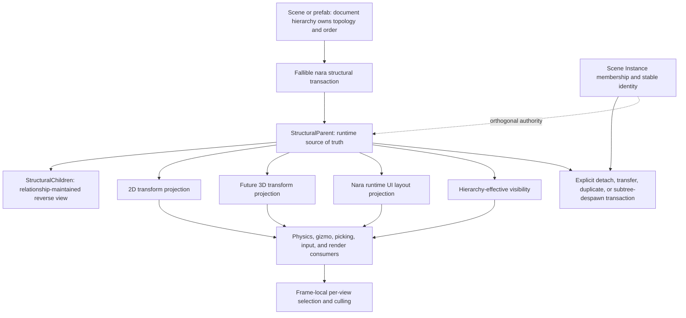
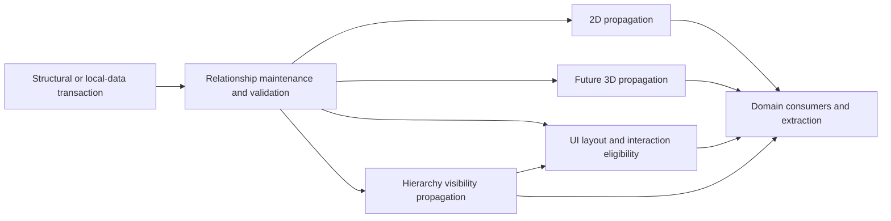

# ADR 0085: Hierarchy, Transform, and Visibility Semantics

**Status**: Proposed
**Date**: 2026-07-13
**Last Revised**: 2026-07-22
**Owner**: `nara_scene`, `nara_transform`, `nara_ui`, and render extraction domains
**Admission Trigger**: A hierarchy-consuming product slice plus focused 3D, runtime-UI,
lifecycle, identity, and physics tracers prove one canonical structural parent relation, independent
domain projections, exact ownership cleanup, deterministic order, reparenting, and visibility
without turning structure into a universal object tree or lifetime owner
**Revisit Trigger**: A concrete workflow requires two independent authorable structural parents for
one runtime entity, requires supported cross-ownership parent edges, or proves that the Bevy
relationship substrate cannot maintain the required structural facts and deterministic order
**Related**: ADR 0005, ADR 0006, ADR 0018, ADR 0022, ADR 0025, ADR 0032, ADR 0034, ADR 0053
(Superseded), ADR 0058, ADR 0084, ADR 0089, ADR 0096, ADR 0097, OQ-034
**Proposed Refinement Under Evaluation**: If accepted, this ADR refines ADR 0038 by defining
ordered document hierarchy and instance-override-owned authoring provenance. ADR 0038 remains
authoritative while this ADR is Proposed.
**Accepted Extracted Slice**: [ADR 0100](0100-runtime-structural-hierarchy-and-completed-2d-transform-projection.md)
accepts only the dedicated non-linked runtime structural ownership boundary, one-way document
lowering, distinct local/global 2D authority, and completed-consumer invariant. This ADR remains
Proposed for persistent order, runtime/editor reparent semantics, visibility, prefab provenance,
UI projection details, physics, and 3D.
**Transform Model Authority**: ADR 0097 is Accepted and owns separate 2D/3D base TRS plus
post-affine residual semantics. This Proposed ADR may define hierarchy transactions only in terms
of that accepted transform model.

## Context

Nara uses ECS hierarchy data, dimension-specific authoring transforms, and a nara-owned runtime UI.
The current implementation is still transitional:

- custom `Parent` is the runtime parent authority while `Children` is rebuilt in `PostUpdate`;
- direct runtime parent insertion can create missing-parent or cyclic graphs that document
  validation would reject;
- `GlobalTransform2d` exists without a propagation system, so sprite and camera extraction consume
  local transforms and ignore ancestors;
- reparent patches change the parent edge without stating whether local or world pose is preserved;
- scene `Visibility` and `UiNode.visible` are separate authoring authorities;
- UI and render tie-break behavior can depend on runtime entity/query order.

These semantics affect scenes, prefabs, runtime UI, physics adapters, animation targets, editor
gizmos, cameras, render extraction, and future 3D features. They must be decided before persistent
content and domain-specific workarounds make a later change expensive. Culling algorithms and
spatial caches remain separate performance decisions.

The source audit behind this proposal found a narrower boundary than "one tree for everything."
Bevy demonstrates useful immediate relationship maintenance, but its built-in hierarchy also
couples the relation to recursive despawn and linked cloning. Bevy UI and Godot demonstrate that a
canonical structural relation can feed private, non-identical domain projections. Nara's own Scene
Instance and stable-identity contracts require lifecycle and provenance to remain orthogonal to
structure.

## Decision

If accepted, nara will use one validated, deterministically ordered **structural parent relation**
for Nara-authored runtime ECS entities inside one `World`. It is the authoring and editor topology
authority only. It is not a universal object tree, a scene-membership relation, or an implicit
lifetime owner.

2D transforms, future 3D transforms, nara runtime UI, visibility, and consumers derive their own
projections from those structural facts. A projection may be non-isomorphic and may own private
indexes or trees. Illustrative names such as `StructuralParent`, `StructuralChildren`, and
`DespawnSubtree` in this ADR describe roles; this Proposed ADR does not freeze public identifiers.



### Scope and Non-Goals

The canonical relation covers entities in one Nara runtime ECS `World` that participate in Nara's
structural authoring topology. An entity has zero or one structural parent.

Participation is explicit. Every entity stored by a scene or prefab document participates by that
document's contract. A runtime `Entity` is not a structural root merely because it lacks a parent;
runtime-only participation requires an explicit admit, move, or retire operation so unrelated ECS
entities do not enter root order, editor hierarchy, or retained-UI source order accidentally.
Those operation names describe roles and do not freeze the public Interface.

It does not require these structures to adopt the relation:

- egui, dear-imgui-rs, another third-party game UI, or the editor toolkit's own widget tree;
- virtualized/generated UI layout nodes that do not have persistent ECS entity identity;
- skeleton bones, animation graphs, physics joints/constraints, navigation links, or render graphs;
- Scene Instance membership, prefab provenance, Gameplay State scope, or region residency;
- input/accessibility indexes or frame-local and per-view render structures;
- references across `World` or Runtime Generation boundaries.

Those domains may maintain graphs, trees, indexes, or lifecycle scopes with their own semantics.
They do not become competing structural-parent authorities or competing cleanup owners.

### Structural Authority and Validation

- `SceneDocument` and `PrefabDocument` each own one document-level ordered hierarchy as the sole
  persistent topology and order authority. Conceptually it contains ordered roots and parent-owned
  ordered child lists. Exact serialized field and container names remain format-implementation
  details.
- `SceneEntityRecord` owns entity content, not another parent edge. Every persisted entity appears
  exactly once as either a root or one parent's child; duplicate membership, absent membership,
  missing entities, self-parenting, and cycles are invalid.
- Runtime hierarchy uses a Nara-defined relationship over the `bevy_ecs` relationship substrate.
  Its target does **not** opt into `linked_spawn`.
- The parent component is runtime source of truth. The relationship-maintained reverse child
  collection and ordered-root projection are derived state and are not independently mutable
  application state.
- Nara does not keep a second custom parent/children graph or rebuild all children from a query at
  the end of a frame.
- The relation forms a forest: a participating entity has at most one parent; missing targets,
  self-parenting, and cycles are invalid.
- Document loading and Nara-owned editor/runtime transactions preflight the complete affected edge,
  order, ownership-scope, and transform-conversion change, then publish atomically. A predictable
  failure leaves the old relation and authored values unchanged.
- Nara-owned runtime transactions accept stable document identity or World/generation-bound entity
  evidence before promising cross-World or cross-generation rejection. A bare `bevy_ecs::Entity`
  contains no World identity; raw relationship insertion can only interpret its bits in the current
  `World` and cannot diagnose a numerically aliased entity from another `World`.
- Advanced direct relationship insertion follows the raw Bevy substrate boundary. Hooks may
  normalize a missing current-World target or self-reference, and a later barrier may detect a
  residual cycle or inconsistency, but Nara does not invent rejected-edge provenance that the input
  never carried.
- A residual invariant violation faults before a domain publishes derived state or extraction
  publishes a partial frame packet.

Here, failure-atomic means every predictable rejection occurs before the first owned write and
Nara-managed consumers observe one committed revision after the documented completion barrier. It
does not claim rollback across arbitrary raw Bevy hooks, observers, panics, or direct substrate
mutation outside the transaction Interface.

The custom relation deliberately trades automatic compatibility with Bevy plugins hard-coded to
Bevy's built-in `ChildOf`/`Children` for Nara's explicit lifecycle and identity semantics. Such a
plugin needs an adapter or explicit participation in Nara's structural relation; it is not silently
treated as compatible.

### Lifecycle, Ownership, and Duplication

Structure and lifetime are separate:

- Low-level parent despawn detaches surviving children because the relationship is non-linked. The
  children become structural roots until an explicit transaction says otherwise.
- Raw despawn of a scene-managed entity is still an invariant violation because it bypasses stable
  identity and Scene Instance membership retirement, even though relationship maintenance can
  detach its children safely.
- An explicit, fallible subtree-despawn transaction computes the structural closure, validates its
  actual lifecycle ownership, and retires only an admitted set. Editor hierarchy Delete may invoke
  this visible command by default and route undoable authoring deletes through normal scene patches.
- An authoring delete is explicitly a subtree operation rather than a single-entity operation with
  hidden recursive behavior. Its inverse retains a bounded snapshot of authoritative entity
  records, internal hierarchy, and the removed root's stable relative placement. The patch-format
  implementation may select an insert/restore encoding, but it must not reconstruct order from IDs
  or perform one full-document validation per restored descendant.
- Runtime Scene Instance unload always retires exact membership. It never calls subtree despawn,
  expands through structural descendants, or crosses another ownership scope implicitly. ADR 0089
  version 1 rejects parent edges across unload-ownership scopes until an explicit detach, reparent,
  transfer, or adoption contract proves broader behavior.
- Gameplay State scope, future region residency, and other lifecycle axes keep their own explicit
  cleanup rules. Structural ancestry alone grants none of them deletion authority.
- Duplicate/clone is a Nara-owned transaction. It allocates and remaps stable scene identity and
  entity references, defines sibling order, preserves or changes prefab provenance deliberately,
  and assigns the intended Scene Instance owner. It does not inherit Bevy linked-cloning policy.

### Prefab Provenance and Ordered Expansion

Structural movement does not silently change document ownership or prefab provenance:

- A prefab override expresses hierarchy edits against source-relative `SceneEntityId` values before
  expansion. A source-relative root remains a prefab root in the override and becomes an instance
  anchor child only during namespaced expansion.
- Expanded `anchor/source_entity` projection IDs never enter scene or prefab source authority.
  Moving a projection outside its instance, moving a scene-local entity under a projection, or
  crossing instance ownership requires an explicit override, source edit, adoption, or
  convert-to-local operation rather than an ordinary structural move.
- An entity added by a prefab instance override is instance-override-owned. It is neither a source
  prefab entity nor an ordinary scene-local entity; its identity, later edits, and removal remain
  owned by that override. The format implementation must reserve a collision-safe source-relative
  identity rule before this class is admitted.
- Version 1 composes an anchor's children as two deterministic, non-interleaved segments: expanded
  prefab roots in source/override order, followed by scene-local children in scene order. A future
  workflow that requires arbitrary interleaving must define provenance, write-back, and migration
  semantics before changing this rule.

### Deterministic Root and Sibling Order

Sibling and root order is explicit data because editor trees and retained UI need stable ordering.
It is never inferred from runtime `Entity`, query iteration, hash-map order, relationship-hook
timing, or allocation order.

- A scene/prefab document hierarchy records one deterministic root sequence and one deterministic
  child sequence per parent. `SceneDocument.entities` and `PrefabDocument.entities` remain
  canonical content collections sorted independently of hierarchy order.
- Authoring and owned runtime moves express stable relative placement equivalent to `First`,
  `Last`, `Before(stable_anchor)`, or `After(stable_anchor)`. The moving entity is removed from its
  old sibling sequence before the destination is interpreted. A relative anchor must exist in the
  prospective destination sequence and may not be the moving entity; stale or wrong-parent anchors
  reject rather than silently falling back to the end.
- The exact serialized operation names remain versioned format details, but the representation must
  support atomic admit, move, duplicate, reparent, subtree removal, and inverse restoration without
  persisting an array index, runtime ID, query order, or provider identity.
- Runtime-only roots and children also use explicit generation-local insert/move semantics. If
  promoted into authored data, they receive durable order explicitly.
- Editor hierarchy presentation and UI source-order tie-breaking consume this order.
- Core system execution does not inherit sibling order; schedules remain explicit.
- World rendering does not inherit sibling order; render layers, depth/sort keys, and stable render
  source order remain render-domain data.
- Because the unreleased parent-only format never stored semantic order, the breaking format unit
  follows ADR 0043's canonical-version reset policy. Repository fixtures and explicit source
  rewrites may derive initial per-parent order from stable IDs, but Nara does not claim to recover
  user order that the old format never represented.

### Domain Projections and Spatial Propagation

Authoring inputs and derived projections remain domain-owned:

| Domain | Persistent/local authority | Runtime-derived projection |
|---|---|---|
| 2D world | `Transform2d` | `GlobalTransform2d` |
| Future 3D world | `Transform3d` | `GlobalTransform3d` |
| Nara runtime UI | UI layout/style inputs | Computed layout, clipping, and UI-global geometry |
| Hierarchy visibility | Local visibility intent | Hierarchy-effective visibility |

- `Transform2d` and future `Transform3d` remain separate user-facing components. Nara does not
  force 2D authoring or UI layout through a universal 3D transform.
- Each domain owns its math, participation rules, traversal/cache implementation, dirty tracking,
  diagnostics, and completion barrier. Domains share canonical structural facts, not necessarily
  one traversal implementation, dirty-root store, or physical topology cache.
- A domain projection must state one of four behaviors at a structural node: participate
  continuously, stop at an incompatible parent, explicitly flatten a named authoring-only node, or
  cross an explicit top-level/bridge rule. Default non-participation is a boundary; a domain does
  not silently skip arbitrary ancestors and invent spatial inheritance.
- A spatial top-level marker breaks only the named spatial projection. It does not automatically
  break structural visibility, clipping, lifecycle, provenance, or another domain's inheritance.
- Nara runtime UI may build a private layout tree, flatten explicit ghost/authoring-only nodes,
  materialize virtual nodes, and maintain indexes for layout, hit testing, focus, accessibility,
  or clipping. These projections are rebuildable derived state, not a second scene authority.
- World-space UI uses an explicit adapter and anchor/constraint relation. It does not gain a second
  structural parent or make UI layout implicitly consume `Transform2d`.
- Render extraction, physics adapters, gizmos, picking, and spatial queries consume the relevant
  completed global/effective projection. They do not each recompute an incompatible parent chain.
- Version-1 dynamic physics bodies remain domain roots with identity effective scale. Parented
  dynamic-body support requires later evidence for fixed-tick world-pose authority, solver-to-local
  writeback timing, parent motion, scale/shear limits, and singular/post-affine domain admission.

For a continuous 2D or 3D transform chain:

```text
root_global = root_local
child_global = parent_global * child_local
```

Global projections are runtime-only derived state. They do not serialize into scene/prefab data or
become an Apply Changes source unless a specific authoring transaction converts them back to local
data.

### Move and Reparent Semantics

The low-level relationship operation has one deterministic meaning: change structure and preserve
authored local values (`KeepLocal`). It never silently rewrites transform or layout data.

Nara-owned higher-level transactions select domain behavior explicitly:

- Editor drag-reparent for 2D and future 3D defaults to requesting `KeepWorld`, because preserving
  visible placement is the expected authoring workflow. The request remains fallible and visible
  to the user.
- Runtime commands must select `KeepLocal` or a domain-specific `KeepWorld`; they do not rely on a
  hidden boolean default.
- UI reparent is a layout operation. It does not promise world-pose preservation unless a concrete
  world-space UI adapter defines that conversion.
- Hierarchy-only entities support `KeepLocal`; `KeepWorld` requires a selected spatial domain and a
  determinable old and prospective global projection.

`KeepWorld` is a transient authoring or runtime-domain intent, not persistent patch data. Authoring
tooling compiles that intent against one base document revision into final facts: one structural
move plus the explicitly computed local component value in the same `ScenePatchDocument`. Patch
replay, prefab override application, undo, redo, migration, and AI-authored patches never
re-evaluate a historical `KeepWorld` request against a different ancestor state.

For a spatial `KeepWorld` transaction:

```text
new_local = inverse(new_effective_parent_global) * old_global
```

The transaction captures the old global pose, validates structure and ownership scope, resolves
the new domain parent/boundary, computes a representable candidate local value, and commits edge,
order, and local value together. A runtime operation may consume a cached global projection only
when its freshness contract proves the same structural/local revision; otherwise it recomputes the
affected chain privately or rejects. It never preserves a known-stale global cache.

For `Transform2d` and future `Transform3d`, the domain applies ADR 0097's base-TRS plus
post-affine residual rules. `KeepWorldExact` may materialize a finite bounded post-affine residual
to preserve a valid affine result; `KeepWorldTrs` rejects a residual-requiring result. A singular
effective parent, missing projection, non-finite value, ownership violation, or unsupported
physics/domain constraint rejects the whole transaction before publication. The decomposition and
recomposition tolerance is engine-owned rather than caller-configurable persistent policy. No
operation silently approximates or downgrades to `KeepLocal`.

The first concrete 2D integration may expose one hierarchy-only `KeepLocal` entry point and one
2D-specific fallible move entry point. This ADR does not admit a `ReparentBehavior` provider,
universal projection trait, public arbitrary World-edit callback, or stable prospective
`HierarchyPlan`. A second production-shaped domain consumer may later prove that such a shared
planning seam has real leverage.

### Visibility Layers

Participating Nara entities use one hierarchy-level persistent local visibility intent and one
runtime-only hierarchy-effective result:

```text
root effective = local != Hidden
child effective = parent effective && local != Hidden
```

- Absence of local visibility uses the documented visible default. A visible child cannot override
  a hidden structural ancestor; this Godot-like rule is an explicit Nara UX choice rather than an
  assumption inherited from Bevy.
- A spatial top-level or layout-root boundary does not automatically break visibility inheritance.
- `UiNode.visible` or an equivalent parallel Nara authoring boolean is retired when this proposal
  is implemented. External UI toolkits retain their own visibility models.
- Hidden suppresses world/UI presentation, picking/hit testing, focus, and accessibility exposure.
  At the named visibility/input barrier, UI hover, press, focus, and capture that are no longer
  eligible are cancelled or retired explicitly.
- Hidden does not delete UI layout, stop gameplay simulation, pause tasks, unload a scene, or
  disable scripts/systems. Future display-none, gameplay active/enabled, editor-force-visible, and
  process/pause states remain separate contracts.

Per-view selection remains frame-local:

```text
HierarchyEffectiveVisibility
  && domain eligibility
  && render layers / camera mask
  && target and viewport policy
  && bounds, frustum, occlusion, or domain culling
```

One entity may be selected by one view and culled from another. Per-view results do not collapse
into persistent or World-global visibility. ADR 0096 owns evidence-gated culling scale and cache
admission; it does not preselect a chunk-cache topology.

### Freshness and Scheduling Barriers

Each projection owner exposes a named semantic completion barrier. Composition orders only the
barriers needed by installed domains; this ADR does not require a universal propagation system.



- Startup completes every installed required projection before its first consumer.
- A consumer that requires fresh global/effective data joins after the relevant named barrier.
- Extraction observes one internally consistent structural, spatial, UI, and visibility revision
  for that frame; it does not publish a mixture of old and new projections.
- Nara does not promise immediate recomputation after arbitrary mutation. Mutation after a domain's
  barrier becomes visible at that domain's next documented safe point.
- Fixed-tick physics world-pose publication and writeback, if later admitted, use physics-owned
  ordering rather than a variable-frame transform shortcut.
- A residual relationship or projection invariant faults before affected consumers publish partial
  output.

## Alternatives Considered

### Option A: Give 2D, 3D, and UI Separate Mutable Authoring Hierarchies

**Pros**: Each domain can optimize its relation and order independently.

**Cons**: Editor structure, scene/prefab parent truth, stable order, reparenting, and shared
visibility can diverge. Cross-domain composition needs synchronization among authoring graphs.

**Decision**: Rejected. Private derived projections remain allowed.

### Option B: Keep Custom `Parent` and Rebuild `Children` in `PostUpdate`

**Pros**: Small change from the current implementation and simple component shapes.

**Cons**: Duplicates relationship maintenance, permits frame-internal disagreement, performs full
scans, and does not make cycles or missing parents failure-atomic.

**Decision**: Rejected.

### Option C: Use Bevy's Built-in `ChildOf`/`Children`

**Pros**: Mature immediate maintenance and direct compatibility with Bevy code that targets the
built-in hierarchy.

**Cons**: `Children` opts into `linked_spawn`, coupling parent structure to recursive despawn and
linked cloning. Those implicit policies bypass Nara's Scene Instance ownership, stable identity,
prefab provenance, deterministic duplication, and exact unload semantics.

**Decision**: Rejected for Nara's canonical structural relation.

### Option D: Use a Nara Non-Linked Relationship with Domain Projections

**Pros**: Reuses mature relationship maintenance while keeping structure, lifecycle, identity, and
domain execution separate. It supports one editor hierarchy and independent 2D/3D/UI semantics.

**Cons**: Requires explicit subtree operations, Nara-owned duplicate semantics, migration from the
current components, and adapters for Bevy plugins hard-coded to the built-in hierarchy.

**Decision**: Proposed.

### Option E: Give Every Entity One Universal 3D Transform and Visibility Stack

**Pros**: One propagation implementation and Unity-like uniformity.

**Cons**: Adds 3D authoring overhead to 2D/UI, mixes layout and world space, and contradicts Nara's
dimension-aware 2D-first API.

**Decision**: Rejected for authoring. Compatible domains may still share private utilities after
measurement proves value.

### Option F: Make `KeepWorld` the Low-Level Reparent Default

**Pros**: Matches common editor drag behavior and preserves visible placement when representable.

**Cons**: Singular parents and TRS shear make the operation fallible, UI uses different layout
semantics, and an implicit default silently modifies authored local values.

**Decision**: Rejected at the low-level relation. Editor 2D/3D commands may visibly request it by
default.

### Option G: Derive Hierarchy Order from the Entity Content Array

**Pros**: Adds no separate hierarchy section and keeps the file shape compact.

**Cons**: The content array is already canonicalized by stable ID, represents one global sequence
rather than parent-local order, and would couple payload diffs to editor/UI hierarchy movement.

**Decision**: Rejected. Content canonicalization and hierarchy order remain independent facts.

### Option H: Store Parent Plus a Per-Entity Index or Rank

**Pros**: Keeps parent information next to each entity and can make simple sorting straightforward.

**Cons**: Integer indices renumber many siblings on insertion; sparse or fractional ranks require
rebalance, canonicalization, conflict rules, and implementation metadata in every record. Combining
either with parent-owned ordered lists would create duplicate topology authority.

**Decision**: Rejected for version 1. Revisit ranked ordering only if measured collaborative-editing
or extreme-sibling workloads exceed parent-owned ordered-list behavior.

### Option I: Use a Document-Level Ordered Hierarchy as Persistent Authority

**Pros**: Stores topology and order once, keeps content canonicalization independent, gives editor
trees and prefab expansion direct deterministic sequences, and makes relative moves and subtree
snapshots explicit.

**Cons**: Requires a breaking document-shape reset, exact membership validation, prefab namespace
budget updates, and patch operations that preserve relative placement.

**Decision**: Proposed with the non-linked runtime relationship in Option D.

## Success Metrics

| Metric | Target | Measurement |
|---|---:|---|
| Owned graph validity | Nara transactions atomically reject missing parent, self-parent, wrong World/generation, ownership-scope violation, and arbitrary-depth cycle | Scene and hierarchy hostile tests |
| Raw entity honesty | A numeric cross-World alias fixture proves bare `Entity` cannot establish provenance; public diagnostics claim only evidence actually carried | ECS boundary test and API review |
| Relationship consistency | Insert, replace, detach, move, and parent despawn update the reverse collection in the same mutation boundary while children survive parent despawn | Relationship tests |
| Lifecycle exactness | Explicit subtree deletion validates ownership; Scene Instance unload retires exact membership and never expands through structure | Multi-instance lifecycle fixtures |
| Duplicate correctness | Stable IDs/references are remapped, prefab provenance and intended ownership are preserved, and order remains deterministic | Duplicate/clone golden fixture |
| Persistent authority exactness | Every scene/prefab entity appears exactly once in document hierarchy while entity content remains independently canonical | Scene/prefab format, validation, and golden-diff fixtures |
| Patch fact determinism | Replaying a compiled move patch never recomputes `KeepWorld` and produces the same final hierarchy/local values | Patch round-trip, replay, undo, and changed-ancestor fixtures |
| Prefab provenance exactness | Source, anchor, expanded, instance-override-owned, and scene-local moves route to their owning document or reject without persisting expanded IDs | Prefab override and convert-to-local fixtures |
| Spatial correctness | A three-level 2D hierarchy produces correct globals on startup and same-frame mutation; a focused 3D spike reuses only structural facts | Transform and extraction integration tests |
| Projection independence | UI proves a private projection with one explicit ghost flatten rule, one layout-root boundary, and virtual/generated nodes | UI layout/render/input fixture |
| Reparent behavior | KeepLocal, exact affine KeepWorld, strict-TRS residual rejection, singular failure, and domain-boundary behavior are deterministic and atomic | Reparent transaction matrix |
| Physics boundary | First dynamic bodies remain supported roots with identity effective scale; later parented writeback passes fixed-tick conversion/fault tracers before admission | Physics integration fixture |
| Visibility and input | Hidden ancestor suppresses descendants and retires stale hover/press/focus/capture while layout and simulation remain present | UI/render/input tests |
| Multi-view correctness | One entity can be visible in one view and absent in another without mutating hierarchy-effective visibility | Multi-camera frame-packet test |
| Stable order | Equivalent authored and runtime-only operations produce identical root/sibling/UI source order without an `Entity`-bit or query-order tie-break | Canonical fixture and replay test |
| Freshness | Parent/local/visibility changes cannot reach a declared fresh consumer with one-frame-stale derived state | Schedule-barrier tests |
| Extension coexistence | egui, dear-imgui-rs, or a custom game UI can coexist without adopting the Nara structural relation | Adapter coexistence fixture |
| Performance admission | Deep, wide, and mutation-heavy reference workloads are measured before a shared dirty index/cache becomes public contract | Committed benchmark and trace |

## Risks and Mitigations

| Risk | Severity | Likelihood | Mitigation |
|---|---|---:|---|
| Structural topology becomes accidental lifetime ownership | Critical | Medium | Use a non-linked relation; keep exact membership/state cleanup explicit; test cross-scope survival. |
| Raw ECS mutation bypasses owned validation or World provenance | High | High | Prefer World-bound transactions, constrain diagnostics to captured evidence, and fault residual invariants before consumers. |
| Custom relation reduces drop-in compatibility with Bevy hierarchy plugins | Medium | Medium | Document the boundary and provide focused adapters only for proven plugin workflows. |
| Private projections drift from canonical structure | High | Medium | Rebuild or revision-stamp projections, expose named completion barriers, and test same-frame mutation. |
| KeepWorld silently loses precision | High | Medium | Materialize a validated post-affine residual for exact retention; reject singular, non-finite, or domain-forbidden results atomically. |
| Persistent sibling order causes merge churn | Medium | Medium | Use parent-owned ordered lists plus stable relative move anchors; verify canonical fixture stability before considering rank metadata. |
| Parent or order is duplicated across document records | Critical | Medium | Keep document hierarchy as the sole persistent topology/order authority and validate exact membership. |
| Historical `KeepWorld` intent re-evaluates under a changed ancestor | High | Medium | Persist only final structural placement and local values; bind authoring intent compilation to a base revision. |
| Expanded prefab IDs or ownership leak into scene authority | High | Medium | Route through source-relative overrides or explicit conversion/adoption; test every provenance class. |
| Large subtree undo performs repeated full-document validation | Medium | Medium | Use one bounded authoritative subtree snapshot/inverse operation and validate the completed candidate once. |
| Hidden is confused with disabled simulation or layout removal | High | Medium | Keep visibility, layout participation, lifecycle, and gameplay activation as distinct contracts. |
| Dynamic physics writeback creates transform feedback or invalid locals | Critical | Medium | Keep version-1 dynamic bodies at supported roots; admit parented writeback only with a fixed-tick ownership/fault tracer. |
| Full-tree propagation becomes a performance bottleneck | Medium | Medium | Measure domain workloads and keep optimization private until evidence supports a shared mechanism. |
| 3D semantics are frozen from 2D-only evidence | High | Medium | Require a focused 3D projection and reparent spike before acceptance. |

## Consequences

If accepted:

- ADR 0005 keeps separate 2D/3D authoring transforms while sharing structural facts only;
- ADR 0006 keeps document truth and two-phase spawn, moves persistent topology/order into one
  document-level hierarchy, and migrates the current runtime `Parent`/`Children` rebuild to a
  Nara-owned non-linked relationship;
- ADR 0038 gains instance-override-owned provenance and ordered expansion rules without allowing
  generated expanded IDs to become persistent scene identity;
- ADR 0025 keeps Nara-owned runtime UI and may maintain private layout/index projections while
  retiring its parallel visibility authoring boolean;
- ADR 0089 remains the exact Scene Instance membership/unload authority; hierarchy never expands
  an unload set implicitly;
- ADR 0096 remains responsible for measured bounds/culling/cache pressure and mechanism admission,
  not hierarchy-effective visibility or a fixed topology cache;
- sprite, camera, physics, gizmo, picking, input, and render extraction consume their admitted
  completed projections rather than recomputing local parent chains;
- current `sync_children`, local-only extraction, visibility duplication, and entity-order
  tie-breaks become transitional details to remove without compatibility aliases;
- current parent-in-record `Reparent` and recursively named-as-single-entity `RemoveEntity` patch
  shapes become transitional prototype details rather than compatibility contracts;
- third-party UI toolkits and domain graphs remain free to own unrelated trees;
- no hierarchy provider, universal reparent behavior registry, or stable public prospective-plan
  Interface is admitted by this decision;
- no public component name, document field representation, or migration is authorized until this
  ADR is Accepted and an active implementation plan admits the corresponding unit.

ADR 0100 extracts the current runtime hierarchy and 2D completion invariant without accepting this
proposal's broader authoring and multi-domain contract. No old ADR becomes superseded while the
remaining proposal is non-authoritative. Later acceptance must add reciprocal refinement metadata
and record component/format breaks in the migration guide.

## Admission Evidence

Acceptance requires all of the following, not merely a flat sprite demo:

1. Relationship fixtures for insert, replace, detach, stable reverse collection, arbitrary-depth
   cycle rejection, parent despawn with surviving detached children, and deterministic explicit
   subtree despawn.
2. A raw cross-World numeric-alias counterexample plus World-bound transaction tests that reject a
   wrong identity domain or generation before mutation.
3. Canonical scene/prefab fixtures proving document hierarchy exact membership, stable relative
   root/sibling movement, content-order independence, deterministic prototype source rewrite, and
   no duplicate parent/order authority.
4. Duplicate fixtures that remap stable scene identity and references, preserve deterministic order
   and prefab provenance, assign intended Scene Instance ownership, and cover runtime-only order.
5. Scene unload and Gameplay State-scope fixtures proving that exact membership rather than
   structural closure drives cleanup and that one scope cannot delete another scope's survivors.
6. Three-level 2D propagation on startup and same-frame mutation, followed by a focused 3D spike
   using the same structural facts with independent math and diagnostics.
7. Nara runtime UI layout, render, hit-test, focus, clipping, and virtual/generated-node fixtures,
   including one explicit ghost/flatten rule and one explicit layout-root boundary.
8. Move tests for `KeepLocal`, exact-affine `KeepWorld`, strict-TRS residual rejection, stale
   projection, non-finite/singular failure, domain boundaries, ownership scope, relative order
   movement, patch fact replay, and atomic no-change on error.
9. Prefab fixtures proving source-relative override movement, instance-override-owned identity,
   deterministic two-segment anchor order, explicit conversion/adoption, and rejection of expanded
   IDs in persistent authority.
10. Visibility tests for ancestor suppression, root/default behavior, per-view divergence, and
   hidden UI hover/press/focus/capture retirement without deleting layout or simulation state.
11. Editor workflow tests showing one hierarchy panel, explicit subtree Delete, one bounded exact
   inverse with original placement, normal patch-based undo/redo, and drag-reparent with structured
   failure feedback.
12. Coexistence fixtures proving an external UI toolkit or custom game UI can operate without
   adopting the Nara structural relation or changing Nara core.
13. Measured deep-tree, wide-tree, mutation-heavy UI, subtree undo, and extraction workloads before
   admitting a shared dirty-index optimization or making incremental-cache behavior public.
14. A physics fixture that keeps version-1 dynamic bodies at a supported root, plus a later tracer
   for parented fixed-tick world-pose writeback and singular/post-affine domain admission.

The supporting source audit is recorded in
[`Shared structural hierarchy and domain projection research`](../../knowledge/engineering/2026-07/2026-07-21T070232Z-shared-structural-hierarchy-and-domain-projection-research-4b108b65d9e844a3998b89c53a58b58c.md).
The persistent-authority, patch, prefab, and reparent follow-up is recorded in
[`Persistent ordered scene hierarchy and transactional reparent research`](../../knowledge/engineering/2026-07/2026-07-22T012528Z-persistent-ordered-scene-hierarchy-and-transactional-reparent-research-33acdc8ae55b463c9d0bf7e0ad2930b3.md).
This ADR remains Proposed until the complete evidence set is reviewed; the research record alone
does not authorize implementation.

## Citations

- Nara implementation baseline: `crates/nara_scene/src/hierarchy.rs`,
  `crates/nara_scene/src/document.rs`, `crates/nara_scene/src/patch.rs`,
  `crates/nara_scene/src/prefab.rs`, `crates/nara_scene/src/authoring.rs`,
  `crates/nara_transform/src/lib.rs`, `crates/nara_ui/src/layout.rs`, and
  `crates/nara_ui/src/interaction.rs`
- Accepted transform model: [ADR 0097](0097-future-capable-2d-3d-spatial-transform-model.md)
- Nara lifecycle and identity boundaries:
  `docs/architecture/adr/0089-runtime-scene-instance-loading-activation-unload-and-travel.md`,
  `docs/architecture/open-questions.md` (OQ-034), and `crates/nara_identity/src/domain.rs`
- Bevy relationship source at `f6c6e6eebb94e81c090614f19039319e9acb3c85`:
  `repo-ref/bevy/crates/bevy_ecs/src/hierarchy.rs`,
  `repo-ref/bevy/crates/bevy_ecs/src/relationship/mod.rs`, and
  `repo-ref/bevy/crates/bevy_ecs/src/relationship/relationship_source_collection.rs`
- Bevy reparent evidence at that revision:
  `repo-ref/bevy/crates/bevy_transform/src/commands.rs` and
  `repo-ref/bevy/crates/bevy_transform/src/components/global_transform.rs`
- Bevy domain projections at that revision:
  `repo-ref/bevy/crates/bevy_ui/src/layout/ui_surface.rs`,
  `repo-ref/bevy/crates/bevy_ui/src/experimental/ghost_hierarchy.rs`, and
  `repo-ref/bevy/crates/bevy_camera/src/visibility/mod.rs`
- Godot structural/domain evidence at `c939bf3791ce40ff70e0ee29f06486da1ebb6a84`:
  `repo-ref/godot/scene/main/node.cpp`, `repo-ref/godot/scene/main/canvas_item.cpp`,
  `repo-ref/godot/scene/resources/packed_scene.cpp`,
  `repo-ref/godot/scene/3d/node_3d.cpp`, `repo-ref/godot/scene/2d/node_2d.cpp`,
  `repo-ref/godot/core/math/transform_2d.cpp`, and
  `repo-ref/godot/scene/2d/physics/rigid_body_2d.cpp`
