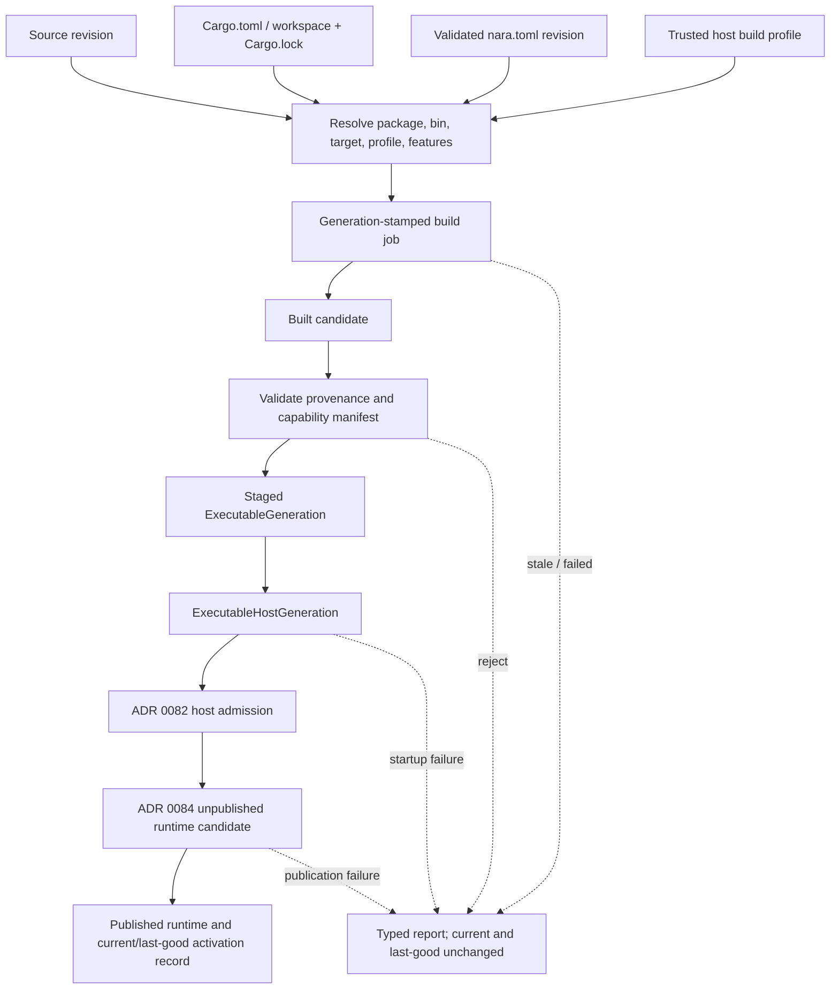

# ADR 0086: Rust Project Build and Executable Generation

**Status**: Proposed
**Date**: 2026-07-13
**Owner**: executable hosts, build tooling, and Rust project composition
**Admission Trigger**: An independent reference-game workspace builds locked desktop and headless
development/release executables, starts them through ADR 0082/0084, rejects stale candidates, and
preserves a launchable last-good activation record after build or startup failure
**Revisit Trigger**: A proven stable dynamic ABI, remote build system, or generic editor workflow
requires a different executable activation topology
**Related**: ADR 0010, ADR 0020, ADR 0035, ADR 0046, ADR 0052, ADR 0055, ADR 0056,
ADR 0068, ADR 0070, ADR 0079, ADR 0082, ADR 0084, ADR 0088, ADR 0093

## Context

Rust is Nara's complete game-authoring language. Data and asset edits can reload directly, but a
structural Rust edit changes code, layout, plugin topology, features, or dependencies and therefore
requires a new executable generation. Existing ADRs correctly reject a universal stable Rust ABI
and require fresh isolated runtimes for structural changes, but they do not yet define:

- whether Cargo or `nara.toml` owns the Rust package graph;
- how editor builds select a package, binary, target, profile, and feature ceiling;
- when compiled bytes become a validated executable generation;
- how an executable host generation differs from an ADR 0084 runtime generation;
- which failure point may advance current/last-good state.

Without one product contract, desktop, editor, headless, and exported builds could resolve different
dependency graphs or treat compile success as runtime publication. Copying Cargo data into
`nara.toml` would also create a second Rust package manager that inevitably drifts.

## Decision

If accepted, file-backed Nara applications will remain ordinary Cargo packages or workspace
members. Cargo metadata and the application lockfile own Rust dependency resolution; Nara tooling
owns a bounded build/activation workflow around immutable executable generations.

### Manifest Authority

- `Cargo.toml` or an owning workspace manifest declares the available Rust dependency graph,
  feature relationships, build scripts, and targets. The application `Cargo.lock` fixes package
  resolution only; it does not select enabled features.
- `nara.toml` owns Nara project settings, product capability requests, content roots, startup
  content, and product profile requests. It cannot inject Cargo arguments or enable compiled code.
- A trusted host/build profile selects an existing Cargo package, binary, target triple, Cargo
  profile, and explicit Cargo feature set. That selection produces the compiled capability ceiling.
  The normalized `nara.toml` product request must be a subset of that ceiling under ADR 0079.
- `nara.toml` does not restate source files, dependency constraints, feature definitions, or lock
  resolution. Mapping a named product profile to Cargo selection is trusted host/repository policy.
- Embedded applications may omit `nara.toml` and construct settings explicitly, but their code is
  still compiled by the caller's Cargo graph.
- Every executable-generation build, including development, uses the captured application lockfile
  with locked resolution. Dependency updates are an explicit authoring action that publishes a new
  lock revision before another build request. Toolchain acquisition, registry authentication, and
  dependency vendoring remain host/repository policy.

### Generation Axes

These generations are independent:

| Generation | Owns | Publication evidence |
|---|---|---|
| `ExecutableGeneration` | Immutable code artifact digest/length, provenance-manifest digest, target/profile, and compiled capability ceiling | Artifact validation plus successful activation |
| `ExecutableHostGeneration` | One OS process or in-process host activation of an executable artifact | Host adapter reports admitted startup |
| ADR 0084 runtime generation | One isolated `App`, `World`, service sessions, and runtime lifecycle | Runtime candidate publishes `Ready` |

Compile/link success creates only a built candidate. It does not publish a host or runtime and does
not mark an artifact last-good.

### Build Request and Candidate Publication

A build request captures immutable identities for:

- source/workspace revision and `Cargo.lock` digest;
- selected package and binary target;
- Rust target triple, Cargo profile, and toolchain identity;
- explicit normalized Cargo feature set selected by the trusted build profile and the resulting
  Nara compiled product capability ceiling;
- the relevant validated Nara project revision.

The staged generation identity binds the verified executable byte digest and length plus the
canonical provenance/capability manifest digest. A reused output path or matching request metadata
without matching bytes is not the same generation. Bit-for-bit reproducible compilation is not
required, but published bytes are immutable and integrity-verifiable.

The build coordinator is host/tooling state, not an ECS resource, `nara_project` side effect, or
gameplay task pool. It owns compiler processes/jobs, diagnostics, staged artifacts, retention, and
current/last-good activation pointers.

1. resolve Cargo metadata from the trusted build profile and validate package/bin/profile/target;
2. preflight the captured lock revision, explicit feature set, toolchain, and compiled ceiling;
3. run a locked generation-stamped build job into an isolated staging location;
4. validate artifact kind, target, provenance, and capability manifest;
5. stage an immutable executable generation;
6. let an activation adapter start an executable host generation;
7. run ADR 0082 admission and ADR 0084 unpublished runtime startup;
8. advance current/last-good only after the runtime publishes successfully.

If source, lock, project, or selection state advances during a build, the old job may finish for
diagnostics/cache reuse but is `Superseded` and cannot publish. Cancellation is best effort; a late
compiler result remains unable to publish.

### Structural Change and Last-Good Policy

- Game code, engine crates, and native Rust plugins are statically linked in the normal production
  path. Nara does not promise a stable Rust dylib/plugin ABI.
- Compatible function-body patching remains an explicit development capability under ADR 0093.
  Structural, unknown, or capability-changing edits always build a new executable generation.
- If old and candidate hosts can coexist, the old runtime remains active until the candidate
  runtime is ready. If a platform forbids coexistence, the host retains a complete last-good
  activation record and the leases needed to launch it until replacement is proven.
- `LastGoodActivationRecord` binds one verified executable generation to the exact immutable ADR
  0082 runtime recipe/project revision and ADR 0088 content mount-set snapshot that previously
  completed startup. Executable bytes alone are code-last-good evidence, not proof that current
  mutable project/content inputs can launch them.
- Last-good does not mean restoring process memory or migrating native state.
- State restoration uses declared document/save/checkpoint contracts only. Failed candidates do
  not update current, last-good, or project saved state.
- Artifact/input retirement is reference/lease and budget aware. At least one complete launchable
  last-good activation record and its immutable inputs are retained unless the user explicitly
  invalidates it.

### Trust and Deliberately Unfrozen Scope

Cargo build scripts, proc macros, native dependencies, and game code execute as trusted author code.
A project data file cannot cause the host to download, compile, enable, or execute a missing plugin
without an explicit trusted host action.

This proposal does not choose distributed compilation, remote cache protocols, toolchain manager,
registry credentials, signing/notarization, bit-for-bit Rust binary reproducibility, a mandatory
child-process editor topology, or content cooking/package formats.

## Alternatives Considered

### Option A: Leave Builds as Manual `cargo run`

**Pros**: No engine build coordinator.

**Cons**: No stale-result guards, target/profile parity, last-good activation, or editor-facing
fault model.

**Decision**: Rejected as the product workflow; direct Cargo commands remain a supported adapter.

### Option B: Duplicate the Rust Graph in `nara.toml`

**Pros**: One apparent engine project file.

**Cons**: Creates a second package resolver and lock authority that drifts from Cargo.

**Decision**: Rejected.

### Option C: Load Every Game as a Stable Rust Dynamic Library

**Pros**: A permanent editor process could swap code in place.

**Cons**: Rust ABI, layout, dependency, and plugin topology are not stable; structural state and
native handles cannot be safely assumed compatible.

**Decision**: Rejected as the default. A future proven adapter may expose narrower capabilities.

### Option D: Cargo Applications with Immutable Executable Generations

**Pros**: Preserves Rust-native tooling, one dependency authority, fresh isolation, explicit
last-good behavior, and desktop/headless parity.

**Cons**: Structural iteration pays incremental compile and activation cost.

**Decision**: Proposed.

## Success Metrics

| Metric | Target | Measurement |
|---|---:|---|
| Independent workspace | Renamed Nara dependency builds locked desktop/headless dev and release bins | External fixture matrix |
| Authority separation | Trusted build profile selects features/ceiling; `nara.toml` only validates as a subset | Metadata/composition tests |
| Structural safety | Layout/plugin/dependency/feature changes inject zero code into the active host | Capability and API audit |
| No partial publication | Build, validation, host, or runtime failure leaves current/last-good activation records and bytes unchanged | Fault-injection matrix |
| Last-good recovery | Failed candidate leaves old runtime active or the bound executable/recipe/content snapshot launchable | End-to-end test |
| Supersede safety | Of three edits during compilation, only the latest revision may publish | Concurrent build test |
| Capability parity | Artifact ceiling and ADR 0079 subset checks reject mismatch before `App` mutation | Composition tests |
| Release hygiene | Release dependency graph excludes editor/tooling/hot-patch/VM unless explicitly requested | Cargo metadata audit |
| Provenance | Every generation binds byte digest/length and manifest digest covering package/bin, target/profile, lock, toolchain, features, and request ID | Manifest fixture |

## Risks and Mitigations

| Risk | Severity | Likelihood | Mitigation |
|---|---|---:|---|
| Incremental builds are too slow | High | Medium | Preserve Cargo units, stage only immutable results, measure before adding remote/distributed complexity. |
| Editor and exported builds diverge | Critical | Medium | Use one Cargo target/profile selection and the same ADR 0082/0084 startup path. |
| Build success is mistaken for runtime success | High | Medium | Advance last-good only after runtime publication. |
| Stale compiler result replaces newer code | High | Medium | Stamp every request and validate expected revision immediately before publication. |
| Native build code is mistaken for sandboxed content | Critical | Low | Declare trusted-code authority and require explicit host action before compilation/execution. |
| Artifact/input retention grows without bound | Medium | High | Use leases, budgets, activation roots, and deliberate garbage collection. |

## Consequences

If accepted:

- ADR 0020's source layout includes Cargo authority without turning `nara.toml` into a package
  manager;
- ADR 0093 remains the iteration strategy and delegates structural edits to this generation flow;
- ADR 0079 continues to validate compiled ceiling, project request, and resolved plugin capability
  subsets before mutation;
- ADR 0082/0084 remain the host/runtime authority; the build coordinator cannot publish a raw
  runnable `App` through a parallel path;
- target content cooking and packaging remain independent. A last-good activation record may bind
  their immutable content snapshot without making content-only changes a new executable generation.

## Admission Evidence

Acceptance requires the independent-workspace build matrix, concurrent stale-build proof,
capability mismatch rejection, and end-to-end last-good fault matrix through editor, desktop, and
headless activation. A wrapper around `cargo build` without immutable generation and runtime
publication semantics is insufficient.

## Citations

- Cargo workspaces: <https://doc.rust-lang.org/cargo/reference/workspaces.html>
- Cargo lock files: <https://doc.rust-lang.org/cargo/guide/cargo-toml-vs-cargo-lock.html>
- Unity assembly definitions: <https://docs.unity3d.com/Manual/assembly-definition-files.html>
- Unity domain reload behavior: <https://docs.unity3d.com/Manual/domain-reloading.html>
- Godot editor game-run process: `repo-ref/godot/editor/run/editor_run.cpp`
