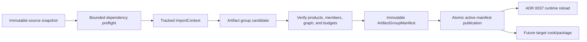

# ADR 0087: Asset Dependency, Import Product, and Artifact Publication Graph

**Status**: Proposed
**Date**: 2026-07-13
**Owner**: `nara_asset`, importer-owning domains, and authoring hosts
**Admission Trigger**: A bounded multi-product importer proves tracked dependency discovery,
stable product reconciliation, exact invalidation, and crash-safe old-or-new artifact-group
publication through the public asset workflow
**Revisit Trigger**: A remote/distributed importer, independently versioned artifact store, or
measured project graph proves that the proposed local graph and publication unit cannot scale
**Related**: ADR 0007, ADR 0033, ADR 0037, ADR 0048, ADR 0049, ADR 0051, ADR 0052, ADR 0068,
ADR 0070, ADR 0080, ADR 0083

## Context

Nara already has stable source asset IDs, importer metadata, backend-neutral artifact records,
dependency digests, reload generations, and a domain-owned task integration path. The remaining
contract is incomplete for compound assets and reproducible invalidation:

- one source may produce many independently referenced products;
- an importer can observe dependencies that are not represented by one aggregate digest;
- import-time reads, runtime required dependencies, and soft references have different meanings;
- recipe identity, durable product identity, and artifact content identity are different axes;
- publishing products independently can expose a mixed generation after failure or cancellation.

Bevy demonstrates tracked loader/processor dependencies and labeled sub-assets. Unity demonstrates
the durability value of asset GUID plus local object identity. Nara needs the same pressure solved
without using a display label as identity, permitting ambient importer IO, or combining authored
source, import cache, runtime residency, and GPU resources into one database.

## Decision

If accepted, `nara_asset` will own a typed dependency and product graph. Importers read immutable
inputs only through a bounded tracked `ImportContext` and publish one immutable artifact group.

### Identity Axes

The graph keeps these values distinct:

| Value | Meaning | Must not be used as |
|---|---|---|
| `StableAssetId` | Durable source asset identity | Artifact bytes or runtime handle |
| `ImportedProductId` | Durable logical product within one source | Name, index, label, or digest |
| `AssetProductRef` | `StableAssetId + ImportedProductId` | Residency or load lease |
| `ImportRecipeDigest` | Identity of every declared input to one import result | Durable product identity |
| `ArtifactContentDigest` | Identity/integrity of immutable member bytes | Recipe or source identity |
| `ArtifactGroupManifest` digest | Atomic publication generation for one source import | Package generation or authoring commit |

`Primary` is the reserved main product ID. Auxiliary product IDs are non-nil opaque values scoped
to the source. Importer reconciliation preserves them across rename, reorder, and content changes
when semantic continuity is provable. Ambiguity rejects the candidate or requires an explicit
remap transaction.

### Dependency Edges

The first graph distinguishes:

| Edge | Meaning | Consumer |
|---|---|---|
| Import input | Bytes or metadata observed to produce this group | Import invalidation and recipe digest |
| Runtime required | Product must resolve before the referring product publishes at runtime | ADR 0037 acquisition closure |
| Runtime soft | Optional/addressable reference that does not force acquisition | Product/runtime policy |
| Build-only | Required to cook/package but not mounted as a runtime dependency | Target build pipeline |

Every importer read of source bytes, dependent products, canonical settings, tool implementation,
or target-sensitive input goes through `ImportContext`. The context records exact edges and digests.
Importer code receives no ambient filesystem capability, environment iterator, clock, mutable ECS
`World`, or global asset-service escape hatch.

Cycles, depth, fan-out, product count, input bytes, output bytes, diagnostics, time, and task count
are bounded before publication. A cycle is a typed graph error unless a later ADR defines a
specific edge kind with safe cyclic semantics.

### Recipe and Invalidation

`ImportRecipeDigest` covers:

- stable source ID and immutable source-content digest;
- importer ID, version, and implementation/tool digest;
- canonical import settings and selected import profile;
- the complete transitive import-input closure with roles and content digests;
- output schema/format versions and target-sensitive inputs.

An observed input missing from the recipe is an importer contract violation. Equal recipe inputs
must produce the same canonical group manifest and member digests before an importer is admitted to
the publish path. Dependency changes invalidate only the reverse-reachable affected closure.

### Artifact Group Publication

One import candidate contains immutable artifact members plus one manifest mapping every
`ImportedProductId` to its type, schema, content digest, dependency edges, and bounded metadata.

- Members are staged and verified before the manifest becomes active.
- Publication changes one active group-manifest reference after complete verification.
- Failure, panic, cancellation, timeout, stale expected source version, superseded generation,
  missing member, digest mismatch, or product conflict publishes nothing.
- The previous verified manifest remains last-good after a failed reimport.
- Reopening after any crash point observes one complete old group or one complete new group, never
  a mixed product set.
- Unreferenced candidates enter bounded quarantine/garbage collection by manifest reachability;
  one-frame non-use is not a deletion contract.

Artifact groups are generated cache data. They do not contain GPU handles, authored source truth,
runtime `Handle<T>` values, package signatures, or editor recovery journals.

## Alternatives Considered

### Option A: One Source Produces One Unstructured Artifact

**Pros**: Smallest importer API and cache record.

**Cons**: Models, atlases, fonts, and compound documents require ad hoc side channels or unstable
name/index references.

**Decision**: Rejected.

### Option B: Use Labels, Indexes, or Content Hashes as Product Identity

**Pros**: No explicit product-ID reconciliation.

**Cons**: Rename, reorder, or content changes break references or silently retarget them.

**Decision**: Rejected.

### Option C: Tracked Typed Graph with Atomic Artifact Groups

**Pros**: Makes hidden inputs invalid, preserves durable sub-products, supports exact invalidation,
and gives reload/cook one verified immutable publication unit.

**Cons**: Requires importer discipline, product reconciliation, graph budgets, and crash tests.

**Decision**: Proposed.

## Success Metrics

| Metric | Target | Measurement |
|---|---:|---|
| Deterministic recipe | Equal immutable inputs produce equal recipe, member, and group digests | Clean-import fixture |
| Product stability | Rename/reorder changes rewrite zero `AssetProductRef` values | Compound importer fixture |
| Exact invalidation | One dependency edit rebuilds exactly its reverse-reachable import closure | Graph integration test |
| Publication atomicity | Every stage/member/manifest crash point reopens to complete old or new group | Fault-injection matrix |
| Stale result safety | Cancelled, timed-out, stale, and superseded jobs publish zero manifests | Task integration tests |
| Budget safety | Cycle, depth, fan-out, product-count, and byte-limit fixtures terminate within bounds | Hostile importer tests |
| Backend isolation | Artifacts and graph records contain no GPU/native handles | Schema and dependency audit |

## Risks and Mitigations

| Risk | Severity | Likelihood | Mitigation |
|---|---|---:|---|
| Importer observes an untracked input | Critical | Medium | Supply inputs only through tracked context and fail admission for ambient authority. |
| Product reconciliation aliases the wrong output | Critical | Medium | Validate the full candidate set; require explicit continuity or remap; reject ambiguity. |
| Dependency graph becomes an allocation attack | High | Medium | Enforce edge, depth, fan-out, byte, time, and diagnostic budgets before decode/publication. |
| Artifact groups consume excessive disk | Medium | High | Use manifest reachability, bounded quarantine, retention metrics, and deliberate GC. |
| Deterministic output requirement excludes useful tools | Medium | Low | Keep non-deterministic tools out of publishable cache paths until they expose canonical seeds/inputs. |

## Consequences

If accepted:

- ADR 0007 and ADR 0033 retain source/import and render-preparation ownership but use this graph as
  the canonical multi-product import and publication contract;
- ADR 0083 remains the durable source/product identity authority;
- ADR 0037 consumes verified groups for source reload and independently owns runtime acquisition,
  residency, release, and eviction;
- target cook/package consumes immutable group manifests and must not reread mutable authored
  source through a separate importer path;
- importer adapters share graph vocabulary but remain responsible for domain-specific decode and
  typed product schemas.

This proposal does not choose a remote cache protocol, package container, runtime mount format,
GPU preparation policy, editor save transaction, or arbitrary plugin sandbox.

## Admission Evidence

Acceptance requires the complete success-metric matrix with at least one real compound importer,
one transitive dependency fixture, last-good reimport behavior, and crash recovery across every
artifact-group publication boundary. A struct named `ImportContext` or a multi-output vector alone
is insufficient.

## Citations

- Bevy tracked loader dependencies and labeled assets:
  `repo-ref/bevy/crates/bevy_asset/src/loader.rs`
- Bevy processor dependency hashing: `repo-ref/bevy/crates/bevy_asset/src/processor/process.rs`
- Unity asset metadata identity: <https://docs.unity3d.com/Manual/AssetMetadata.html>
- Godot importer and generated-file registry:
  `repo-ref/godot/editor/import/resource_importer.h`,
  `repo-ref/godot/editor/import/resource_importer.cpp`
