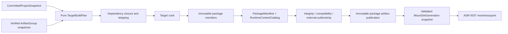

# ADR 0088: Target Build, Cook, Package, and Runtime Content Catalog

**Status**: Proposed
**Date**: 2026-07-13
**Owner**: product build hosts, `nara_asset`, cook providers, and runtime content adapters
**Admission Trigger**: A reference-game desktop and headless/server build proves deterministic
dependency closure, target cooking, capability stripping, package/catalog publication, validated
old-or-new mount-resolver publication, and source-free runtime acquisition
**Revisit Trigger**: A real store, CDN, streaming-install, encrypted container, or platform signing
adapter proves that the logical package/mount-set model cannot express its requirements
**Related**: ADR 0020, ADR 0035, ADR 0037, ADR 0049, ADR 0050, ADR 0051, ADR 0055, ADR 0056,
ADR 0068, ADR 0070, ADR 0079, ADR 0082, ADR 0083, ADR 0084, ADR 0086, ADR 0087, ADR 0091

## Context

ADR 0020 intentionally owns only the source project layout. ADR 0087 proposes immutable imported
product groups. Neither defines the production path from a validated project revision to target-
specific runtime content:

```text
authored source -> imported products -> cooked members -> packages -> mounted runtime catalog
```

Godot export presets, Unity Build Profiles/Addressables, and Unreal cooking/Asset Manager all make
this a product-level contract. Without one, Nara could accidentally ship `.meta` and import-cache
internals, omit dynamically addressed content, include client-only assets in a server, or let one
runtime acquisition resolve through a mixed package set during a patch. A package container is an
implementation detail;
dependency closure, identity, compatibility, trust, and atomic mount publication are the durable
boundaries.

## Decision

If accepted, Nara will separate target planning, cooking, package generation, and runtime mount.
Every stage consumes immutable verified inputs and publishes a new immutable generation.



### Stage and Identity Separation

| Value | Meaning | Not interchangeable with |
|---|---|---|
| `CommittedProjectSnapshot` digest | Coherent authored member table from ADR 0091/host resolver | Import or package generation |
| `ArtifactGroupManifest` digest | Verified source-import product group | Cooked/package identity |
| `TargetBuildPlan` digest | Pure target/profile/closure recipe | Executable or artifact bytes |
| `PackageManifestDigest` | One immutable base/patch/DLC package artifact and member table | Mount-set generation or residency |
| `MountSetGenerationId` | One validated ordered set of package manifests | Package artifact or runtime handle |
| `RuntimeContentCatalogDigest` | Merged identity-to-member mapping bound to one mount set | Residency state |
| Optional `ExecutableGeneration` manifest digest | Compatibility input from ADR 0086 | Content/package identity |

These values may reference each other through manifests; they are never cast, reused, or inferred
from display names and timestamps. Non-authoritative release correlation metadata may link code,
content, symbols, and diagnostics, but a content-only patch does not create a new executable
generation.

### Pure Target Build Plan

`TargetBuildPlan` is side-effect-free inspectable data derived before cook work starts. It records:

- target triple/platform, build profile, and normalized product capabilities;
- immutable committed-project snapshot, schema/catalog fingerprints, and artifact-group snapshots;
- optional compatible ADR 0086 executable-generation manifest digest when the product couples code
  and content;
- engine/plugin/importer/cook-provider/toolchain provenance;
- startup scenes, always-include roots, explicitly addressable groups, and target-specific roots;
- client/server/headless/editor exclusions and required compatibility ranges;
- package/chunk assignment policy where selected.

Release planning accepts an ADR 0091/host-produced `CommittedProjectSnapshot` plus verified artifact
groups. A development preview may use an explicitly marked ephemeral snapshot, but that snapshot
cannot publish as release content.

### Dependency Closure and Cooking

- Runtime-required edges enter the transitive closure. Runtime-soft/addressable edges enter only
  when selected by an explicit root/group. Build-only edges may influence cook without becoming
  runtime dependencies.
- Dynamic content that code cannot statically discover must be declared through explicit roots or
  addressable groups. Missing required dependencies fail the build; they are not silently stripped.
- Client, server, headless, and other capability profiles remove forbidden roots/members before
  package publication. Server content cannot depend on window, render, audio-device, editor, or raw
  input capabilities unless explicitly added by a different product.
- Cook providers transform backend-neutral imported products into target-specific runtime members.
  They consume only the immutable plan and verified artifact products; they do not reread mutable
  authoring source or bypass the import graph.
- Cook inputs and outputs are bounded, generation-stamped, cancellation-aware, and deterministic
  for publishable builds. Stale or superseded results cannot enter a package artifact candidate.

### Package and Catalog Publication

A package manifest uses the ADR 0051 envelope and records:

- `kind`, `format_version`, `engine_min_version`, `generator`, package ID/version, and its canonical
  `PackageManifestDigest`;
- target/profile/capabilities and compatible engine/schema/plugin ranges;
- every member identity, size, content digest, compression/encryption descriptor, and dependencies;
- runtime catalog/member-table digest, build/tool provenance, and optional base-manifest binding;
- privacy-safe relative logical names, never absolute author/cache paths or credentials.

`RuntimeContentCatalog` maps each `AssetProductRef` to exactly one verified package member and its
dependency metadata for the candidate mount set. Its digest is bound into that
`MountSetGenerationId`. It does not own `Handle<T>`, `LoadState`, leases, retention, decode, or
eviction; ADR 0037 owns those runtime concerns.

Base, patch, and DLC are immutable package artifacts. A patch binds the exact base manifest
digest it expects. Overlay precedence is explicit, and an unauthorized duplicate product mapping
rejects the candidate rather than becoming implicit last-writer-wins.

The persistent file kinds `nara.package-manifest`, `nara.runtime-content-catalog`, and any future
mount-set manifest begin at canonical version 1 with compatibility matrices and non-empty golden
fixtures. Package manifest, catalog, member table, and dependency graph enforce ADR 0049 encoded-
byte, shape, count, depth, string, dependency, time, and diagnostic budgets before signature work,
large allocation, member decode, or mount publication.

### Mount, Integrity, and Trust

- The runtime constructs and verifies a complete candidate mount-set snapshot before publication.
- Wrong target/profile, incompatible engine/schema/plugin range, missing required member, digest
  mismatch, invalid base binding, or catalog collision changes no active mount state.
- Publication swaps one immutable active mount-set snapshot at a host safe point. In-flight loads
  capture their original snapshot and cannot be redirected to mixed generations.
- Mount publication changes future resolution only. Already resident values may retain their
  origin `MountSetGenerationId`, so old and new resident values can coexist. Whole-runtime content
  activation requires a future ADR 0037 residency-closure transaction or a fresh ADR 0084 runtime;
  this proposal does not claim an atomic swap of all resident assets.
- An old mount-set snapshot and its required package members remain leased while any in-flight load
  or resident value depends on that origin generation. Unmount/garbage collection is budgeted and
  observable and cannot invalidate a live value's dependency closure.
- Content digest/integrity is separate from signature/authenticity. Signing keys, notarization,
  store credentials, and signature operations belong to trusted release/platform adapters.
- Untrusted or unsigned package policy is explicit per product. Native code packages are trusted
  executable extensions, not sandboxed content.
- Package filesystem access follows ADR 0050/0070 containment and guarantee tiers.

Exact archive/container layout, compression algorithm, encryption, store SDK, CDN, install
streaming, shader pipeline cache layout, and world-partition algorithm remain deliberately
unfrozen.

## Alternatives Considered

### Option A: Ship the Project Directory or Import Cache

**Pros**: Minimal export implementation.

**Cons**: Leaks source/editor data, lacks target stripping and compatibility, and gives no atomic
catalog/mount contract.

**Decision**: Rejected.

### Option B: Let an Opaque Packer Import, Cook, and Package Everything

**Pros**: One plugin and one command can hide complexity.

**Cons**: Hidden dependency reads, non-reproducible closure, identity drift, and no reviewable
boundary between source products and runtime members.

**Decision**: Rejected.

### Option C: Pure Target Plan plus Immutable Package/Catalog Generations

**Pros**: Makes target closure, provenance, stripping, patch compatibility, and runtime mount
publication inspectable while leaving container implementations replaceable.

**Cons**: Requires manifest schemas, deterministic cook providers, and extensive corruption/crash
tests before visual export tooling exists.

**Decision**: Proposed.

## Success Metrics

| Metric | Target | Measurement |
|---|---:|---|
| Deterministic content | Two clean builds produce equal plan, package-manifest, member, and catalog digests | Clean build fixture |
| Closure correctness | Required, soft, addressable, dynamic-root, and missing-dependency cases match declared policy | Dependency fixture matrix |
| Server stripping | Server package contains zero forbidden client/editor capability members | Package audit |
| Runtime independence | Packaged runtime opens with no source tree, `.meta`, or import-cache access | Export integration test |
| Corruption rejection | Damaged member/catalog/base binding is rejected before mount publication | Hostile package tests |
| Resolver atomicity | Every patch/mount fault point leaves a complete old or complete new mount resolver active | Fault-injection matrix |
| Snapshot consistency | In-flight load resolves all dependencies within one captured mount-set generation | Concurrent load/update test |
| Residency provenance | Every resident value reports its origin mount-set generation across resolver updates | Runtime asset test |
| Privacy | Package bytes/manifests/diagnostics contain no absolute author paths, cache paths, or secrets | Artifact scanner |

## Risks and Mitigations

| Risk | Severity | Likelihood | Mitigation |
|---|---|---:|---|
| Dynamic references are stripped | Critical | Medium | Require explicit roots/addressable groups and emit closure audit reports. |
| Tool environment breaks reproducibility | High | Medium | Record and lock provider/toolchain provenance; reject untracked inputs. |
| Patch overlay creates two identity authorities | Critical | Medium | Bind exact base digest, validate collisions, and publish one mount snapshot. |
| Cook duplicates importer logic | High | Medium | Cook only verified artifact products; forbid mutable source reads. |
| Candidate plus active package exceeds memory/disk | High | Medium | Preflight dual-generation budgets and use bounded staged storage. |
| Signature is confused with content digest | High | Medium | Model integrity and trusted authenticity as separate verification steps. |

## Consequences

If accepted:

- ADR 0020 remains only the authoring source layout;
- ADR 0087 owns source import/product graphs; this ADR consumes immutable artifact-group snapshots;
- ADR 0091/host resolver produces the coherent committed-project snapshot consumed by target
  planning;
- ADR 0086 owns executable code generations; an optional manifest compatibility link does not merge
  code/content identity or block content-only patching;
- ADR 0037 resolves runtime identity through the active content catalog and independently owns
  acquisition/residency;
- editor preview and packaged runtime use the same semantic asset/product resolution API with
  different source-database versus mounted-catalog providers;
- platform exporters may choose different containers/signing adapters without changing the logical
  closure, manifest, catalog, or mount invariants.

## Admission Evidence

Acceptance requires desktop and headless/server package fixtures, deterministic clean rebuilds,
complete closure/stripping cases, source-free runtime boot, corruption rejection, and old-or-new
base/patch mount-resolver publication, including resident-value origin-generation tests. Creating a
zip file or serializing a catalog map alone is insufficient.

## Citations

- Godot export preset model: `repo-ref/godot/editor/export/editor_export_preset.h`
- Unity Addressables overview:
  <https://docs.unity3d.com/Packages/com.unity.addressables@2.7/manual/AddressableAssetsOverview.html>
- Unreal cooking content:
  <https://dev.epicgames.com/documentation/en-us/unreal-engine/cooking-content-in-unreal-engine>
- Unreal patching and DLC:
  <https://dev.epicgames.com/documentation/en-us/unreal-engine/patching-content-delivery-and-dlc-in-unreal-engine>
- Unreal asset management:
  <https://dev.epicgames.com/documentation/en-us/unreal-engine/asset-management-in-unreal-engine>
