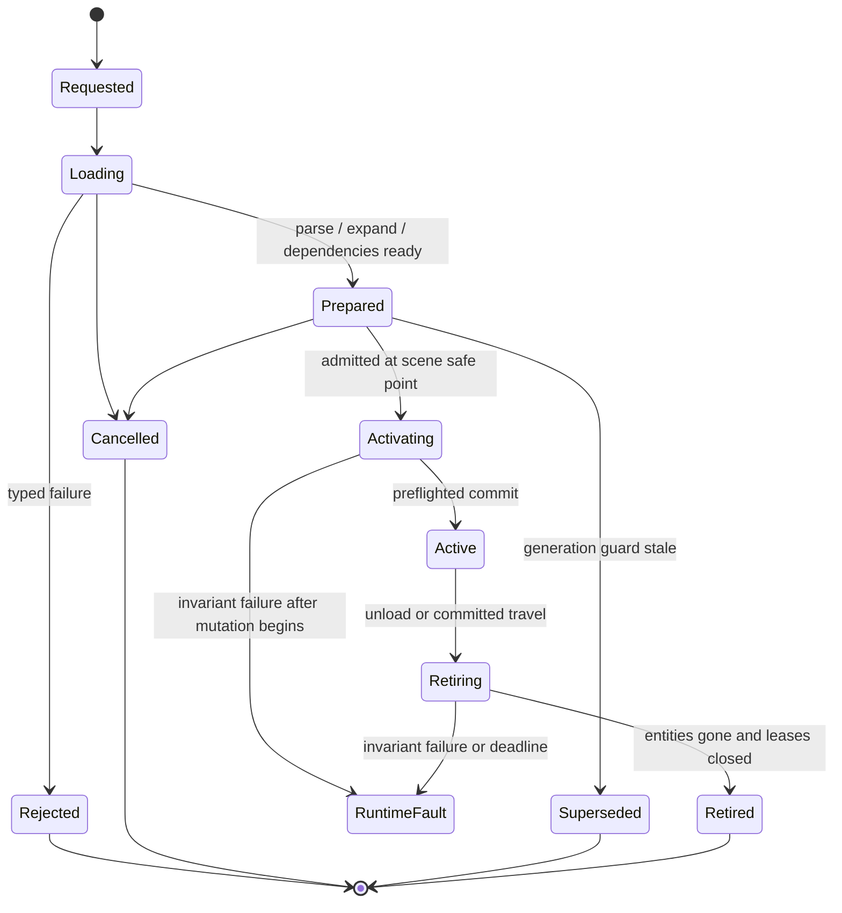
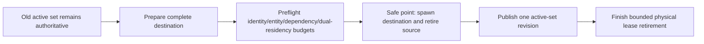

# ADR 0089: Runtime Scene Instance Loading, Activation, Unload, and Travel

**Status**: Proposed
**Date**: 2026-07-13
**Last Revised**: 2026-07-16
**Owner**: `nara_scene`, `nara_identity`, executable runtimes, and scene-consuming services
**Admission Trigger**: A reference game proves asynchronous additive load, safe-point activation,
precise unload, last-good replace travel, multi-instance identity, and bounded service retirement in
the same editor/desktop/headless runtime contract
**Revisit Trigger**: A world-partition, multiplayer travel, persistent-entity migration, or multiple
simultaneous World workflow proves that one active scene set in one runtime `World` is insufficient
**Related**: ADR 0006, ADR 0034, ADR 0038, ADR 0039, ADR 0052, ADR 0058, ADR 0082, ADR 0083,
ADR 0084, ADR 0085, ADR 0088

## Context

Nara has durable scene/prefab documents, two-phase spawn, stable runtime identity, isolated Play,
and a proposed executable runtime around one `App` and one `World`. It does not yet define runtime
scene lifecycle after startup:

- whether one document may have multiple simultaneous runtime instances;
- how background parsing/dependency loading can avoid mutating the active `World`;
- when additive load, unload, or replace travel becomes visible to gameplay and extraction;
- what owns scene membership independently from hierarchy;
- what happens to runtime references and native service state after unload;
- which state survives travel without rebuilding the complete runtime.

Treating each scene as a separate `World` would make queries, physics, rendering, commands, and
references cross-world problems. Inserting partially loaded entities into the active `World` would
instead require every system to filter provisional state. Mature engines demonstrate the need for
explicit level/scene activation and travel, but Nara should not copy an object hierarchy, global
SceneTree, UObject lifetime, or garbage collector.

## Decision

If accepted, one ADR 0084 runtime will continue to own exactly one `App` and one simulation
`World`. That `World` may contain multiple active runtime scene instances. All asynchronous work
produces a World-free candidate; activation, unload, and travel commit only at a named scene
lifecycle safe point between complete gameplay transactions.



### Persistent Document, Candidate, and Runtime Instance

- `SceneDocument` remains persistent authoring truth. It contains no runtime `Entity`, native
  handle, load request, or active-service state.
- A `PreparedSceneCandidate` contains the fully expanded/validated document projection, provenance,
  bounded dependency receipts, and generation stamps. It contains no `Entity`, native handle,
  active lease, or mutable pointer into the runtime `World`.
- A `RuntimeSceneInstance` is one active projection of a scene document inside one
  `WorldIdentityDomain`. The same document can be instantiated multiple times.
- Load request/candidate identity is distinct from `SceneInstanceId`. Rejected, cancelled, stale,
  or preflight-failed candidates consume no runtime instance claim. Once activation commit allocates
  a new non-reused `SceneInstanceId`, its lifetime claim remains permanently consumed even if a
  later commit invariant faults before active-set publication.
- Every candidate binds expected project, schema catalog, scene/prefab, asset-artifact, and mounted
  package generations. Activation performs a final expected-generation guard.

### Prepare and Activation

Background work may read bounded bytes, migrate current document shapes in memory, expand prefabs,
resolve required dependencies, and build spawn plans. It never mutates the active `World`.

Runtime scene operations enter one explicit route:

```text
request -> prepare -> preflight -> safe-point commit -> active-set revision publication
```

- No parallel `spawn document directly into active runtime` path exists.
- Preflight validates schema bindings, identity capacity, entity/component counts, references,
  hierarchy, dependency receipts, and candidate plus active dual-residency budgets.
- Commit runs while no schedule/system observes the `World`. Every predictable failure occurs
  before the first mutation.
- A panic or invariant failure after commit mutation begins follows ADR 0084 sticky runtime failure;
  Nara does not claim arbitrary in-place `World` rollback.
- The active scene set has one authority and a monotonic revision. Systems, tools, and extraction
  observe either the complete prior revision or the complete next revision.
- Startup scenes use the same prepare/activation contract before ADR 0084 publishes the runtime.

### Safe-Point Ordering

- Load/prepare work may progress while the runtime is paused if its task and service policies allow.
- Activation, unload, and travel apply only after the current complete frame/fixed gameplay
  transaction and before the next consumers run.
- A request emitted during fixed simulation is ordered by its admitted command/tick sequence. Async
  completion only marks a candidate `Prepared`; completion race order never decides activation.
- Replay/debug capture records the lifecycle command and selected candidate/generation outcome, not
  worker timing.

### Scene Membership and Ownership

Scene membership is explicit runtime metadata owned by `nara_scene`; it is not inferred from parent
hierarchy, names, asset paths, or query order.

- Every scene-spawned entity belongs to exactly one active scene instance unless a later explicit
  transfer transaction changes ownership.
- Version 1 rejects linked parent edges across unload-ownership scopes, including between scene
  instances and between scene-owned/non-scene-owned entities. Preserving or transferring a child
  across unload requires an explicit detach, reparent, or ownership-adoption transaction before
  parent retirement.
- Runtime/session resources and explicitly non-scene-owned persistent entities may outlive travel.
  Version 1 does not automatically carry scene entities across travel.
- Local entity references resolve within the owning scene instance. Cross-instance references use
  declared runtime identity and can represent unresolved/tombstoned state.

### Unload and Retirement

Before the safe point, unload preflight validates exact membership, dependent references, linked
hierarchy closure, identity retirement, scene-service retirement capacity, and every applicable
budget without changing ingress or participation. The commit then:

1. atomically gates new ingress/participation for the target instance;
2. removes all and only instance-owned entities, retires active identity axes, and leaves permanent
   lifetime claims/tombstones;
3. publishes the new active-set revision;
4. drives scene-scoped service/native lease retirement to a finite terminal result.

After identity retirement, old runtime references return `Tombstoned`; a later instance of the same
document never reuses the old runtime claim. Service retirement may remain `Retiring` after logical
entity removal, but a deadline or invariant failure rises to ADR 0084 runtime fault. Direct ECS
despawn that corrupts membership is detected as a runtime invariant failure, not silently repaired.

### Additive Load and Replace Travel

Additive activation inserts one or more prepared instances while preserving the declared current
set. Replace travel atomically publishes a destination set and retires an explicit source set:



A prepare/preflight failure preserves the complete old scene set. Travel is not an executable
runtime restart: runtime-scoped clocks, player/session resources, connections, and services may
continue. Structural schema/plugin/project changes still require a fresh ADR 0084 runtime.

Scene hot reload may later lower into prepare plus replacement travel. Authoring merge, external
save conflict, Apply Changes, and source rewriting remain editor/document responsibilities.

## Alternatives Considered

### Option A: Rebuild the Whole Runtime for Every Travel

**Pros**: Strong isolation and simple reclamation.

**Cons**: Discards session state, clocks, connections, and runtime-scoped services for ordinary
scene changes.

**Decision**: Rejected as normal travel; retained for structural runtime reconstruction.

### Option B: Insert Inactive Candidate Entities into the Active World

**Pros**: Reuses ECS storage during asynchronous loading.

**Cons**: Every gameplay, physics, audio, render, query, and plugin system must filter provisional
entities correctly, creating a global hidden contract.

**Decision**: Rejected.

### Option C: Give Every Scene a Separate `World`

**Pros**: Natural isolation per scene.

**Cons**: Cross-world schedules, queries, physics, rendering, identity, and references become the
default engine problem.

**Decision**: Rejected for ordinary scenes. Separate Play/runtime isolation remains valid.

### Option D: World-Free Candidate plus Safe-Point Scene-Set Commit

**Pros**: Preserves one ECS simulation, permits asynchronous preparation, makes last-good travel and
coherent visibility testable, and avoids a provisional-component convention.

**Cons**: Requires explicit membership, dual-residency budgets, safe points, and service retirement.

**Decision**: Proposed.

## Success Metrics

| Metric | Target | Measurement |
|---|---:|---|
| Load failure atomicity | Invalid/cancelled/stale candidates change zero entities, identity claims, and active-set revision | Fault matrix |
| Coherent activation | Gameplay and extraction see complete old or complete new revision only | Sentinel integration test |
| Last-good travel | Destination prepare/preflight failure preserves old instance behavior and references | Travel fixture |
| Multi-instance identity | Two instances of one document have distinct IDs and no local-reference aliasing | Identity test |
| Precise unload | Only target-owned entities retire; other scene/non-scene state is unchanged | Membership test |
| Tombstone safety | Old references remain tombstoned after unload and later reactivation | Timeline test |
| Safe-point ordering | Requests from a fixed transaction apply only after it completes in recorded order | Schedule/replay test |
| Startup parity | Startup and runtime travel use the same candidate/preflight/activation fixtures | Host integration test |
| Finite retirement | Scene-scoped leases close within deadline or cause structured runtime fault | Service fixture |
| Hierarchy isolation | Nara-owned cross-scope parent transactions reject atomically; direct substrate violations fault before extraction | Hierarchy test |

## Risks and Mitigations

| Risk | Severity | Likelihood | Mitigation |
|---|---|---:|---|
| Candidate plus active scene exceeds memory | High | Medium | Preflight aggregate dual-residency budgets before activation/travel. |
| Dependency changes after preflight | High | Medium | Capture generation receipts and perform final guard at safe point. |
| Scene registry duplicates identity authority | High | Medium | Registry owns membership/lifecycle only; entity resolution remains in `WorldIdentityDomain`. |
| Direct despawn corrupts membership | High | Medium | Detect stale registrations and escalate structured runtime fault. |
| Direct hierarchy mutation crosses ownership scope | High | Medium | Capture at an instrumented mutation boundary or fault at the propagation barrier before consumers. |
| Service cleanup waits forever | High | Medium | Use pollable close participants, deadlines, and ADR 0084 fault aggregation. |
| Async completion order breaks replay | Critical | Low | Completion creates only `Prepared`; admitted lifecycle command controls publication order. |

## Consequences

If accepted:

- ADR 0006 remains document truth and two-phase spawn, refined by an explicit runtime lifecycle;
- ADR 0058 remains runtime identity/tombstone authority;
- ADR 0084 still owns one `App`, one `World`, safe-point drive, fault, and runtime close;
- ADR 0082 hosts select initial content/revisions but do not become a global scene manager;
- ordinary travel preserves declared runtime/session scope while structural changes reconstruct a
  fresh runtime;
- world partition, seamless multiplayer travel, cross-instance hierarchy, and persistent-entity
  adoption require later concrete decisions.

## Admission Evidence

ADR 0084's executable runtime ownership must already be Accepted or replaced by a named compatible
Accepted successor. This ADR cannot accept scene lifecycle against a runtime owner that remains
non-authoritative.

Acceptance requires additive and replace travel, two instances of one scene, stale/cancelled load,
unload/tombstone precision, Nara-owned cross-scope hierarchy rejection plus direct-mutation fault
detection, paused preparation, replay-stable ordering, and finite service-retirement tests through
editor, desktop, and headless hosts. A scene loader that only spawns one startup document is
insufficient.

## Citations

- Godot scene tree and packed scene: `repo-ref/godot/scene/main/scene_tree.h`,
  `repo-ref/godot/scene/resources/packed_scene.h`
- Unreal World/Level framework:
  <https://dev.epicgames.com/documentation/en-us/unreal-engine/gameplay-framework-in-unreal-engine>
- Unreal World Partition:
  <https://dev.epicgames.com/documentation/en-us/unreal-engine/world-partition-in-unreal-engine>
- Unreal travel:
  <https://dev.epicgames.com/documentation/en-us/unreal-engine/travelling-in-multiplayer-in-unreal-engine>
