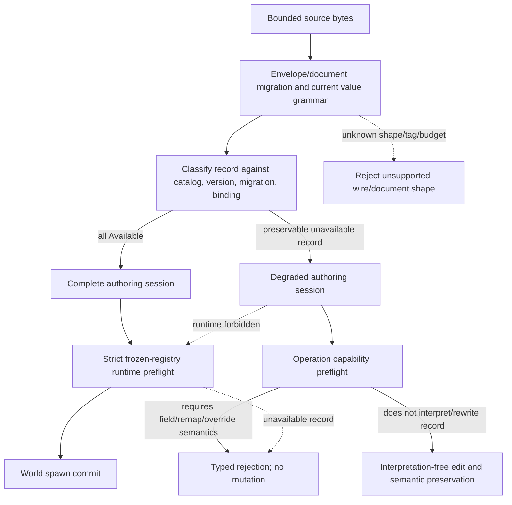

# ADR 0090: Unavailable Schema and Lossless Authoring

**Status**: Proposed
**Date**: 2026-07-13
**Owner**: `nara_reflect`, `nara_scene`, `nara_tooling`, and persistent document owners
**Admission Trigger**: Scene/prefab fixtures with a missing provider, known schema without its
required native or Adapter-specific runtime binding, missing migration, and future component schema
open/save with semantic preservation in the editor while every runtime spawn rejects before `World`
mutation
**Revisit Trigger**: A second persistent value grammar, schema-only editor adapter, or concrete need
for lexical byte/comment preservation proves semantic record preservation insufficient
**Related**: ADR 0006, ADR 0011, ADR 0026, ADR 0034, ADR 0038, ADR 0043, ADR 0045, ADR 0047,
ADR 0049, ADR 0051, ADR 0068, ADR 0079, ADR 0081, ADR 0083, ADR 0084, ADR 0093, ADR 0095

## Context

Rust-first strong typing and a frozen runtime-binding registry, currently implemented with native
bindings only, are runtime strengths, but editors must survive common authoring conditions:

- a project plugin is temporarily unavailable on one workstation or branch;
- a schema catalog describes a component whose native provider is not compiled into this editor;
- a gameplay-language assembly or declared type is missing or fails to compile while a scene still
  contains its last-known stable schema identity and value;
- a component record has a known older/future schema version without a complete migration;
- the editor needs to rename/reparent or edit unrelated known data without destroying the record.

Rejecting every such document prevents recovery and collaboration. Silently dropping the record is
unacceptable data loss. Creating a placeholder ECS component or invoking project-provided decode
code would weaken registry authority and turn untrusted data into code execution. The boundary must
also remain strict: an unknown top-level file version or unknown `ComponentValue` wire tag cannot be
preserved safely because the current engine does not know how to delimit or migrate it.

## Decision

If accepted, Nara authoring will preserve a complete bounded semantic component record when the
file envelope, document shape, and generic `ComponentValue` grammar are understood but its schema,
migration, or required native/Adapter runtime binding is unavailable. Runtime admission remains
strict and fail-closed.

### Readiness Vocabulary

Document readiness is `Rejected | Degraded | Complete`. Record readiness is:

| State | Meaning |
|---|---|
| `Available` | Compatible catalog schema, migration path, and all required runtime bindings are present |
| `KnownUnbound` | Catalog schema is known but its required native or Adapter-specific runtime binding is unavailable |
| `UnknownSchema` | Stable component ID/version has no current catalog declaration |
| `Unmigratable` | Schema is known but no complete migration reaches the current version |
| `FutureSchema` | Record schema version is newer than the current catalog declaration |

These are generation-local authoring/runtime classifications, not persistent ECS components,
placeholder Rust types, or a second schema authority.

### Preservation Boundary

Unavailable preservation is permitted only when all of these are true:

- ADR 0051 envelope and ADR 0043 document shape/version are recognized or migrated to current;
- the complete generic `ComponentValue` grammar and record boundaries are understood;
- ADR 0049 byte, depth, count, string, value, time, and diagnostic budgets pass;
- stable component ID, schema version, complete payload, and source location can be
  retained without executing a missing provider.

An unknown/future top-level format version, document operation, or value tag remains `Rejected`.
Nara does not guess record boundaries or preserve arbitrary trailing bytes.

"Lossless" means semantic record equality after canonical serialization: component ID (the owning
map key), schema version, complete bounded `ComponentValue`, stable entity/asset references, and
unknown fields that the current generic grammar can represent remain equal. Catalog fingerprint
and lineage remain catalog-generation admission evidence under ADR 0081; version 1 does not add a
per-record fingerprint. Preservation does not promise whitespace, comments, map spelling/order
outside canonical rules, or byte-identical JSON/RON round trips.

### Authoring Operation Gates

| Operation on a degraded document | Version 1 policy |
|---|---|
| Read metadata/readiness/diagnostics | Allow |
| Save/canonical reserialize without touching unavailable records | Allow with degraded report |
| Rename, reparent, reorder using stable IDs | Allow after proving records remain unchanged |
| Edit unrelated available component field | Allow after whole-document preflight |
| Delete one whole unavailable component | Allow only as explicit reversible transaction |
| Delete entity/subtree containing unavailable records | Allow only if complete inbound-reference, hierarchy, prefab-provenance, and remap closure is proven; otherwise reject |
| Undo whole-record deletion | Restore exact semantic record |
| Edit/add/replace a field inside unavailable record | Reject |
| Apply Changes or prefab override targeting unavailable record | Reject |
| Duplicate/remap/merge/convert requiring unknown reference interpretation | Reject unless complete closure is proven |
| Asset rename/delete/GC/prune or dependency-closure publication | Allow only for `KnownUnbound` under an immutable last-known catalog that fully declares `asset_ref`; reject for `UnknownSchema` |
| Cook/export/Play/runtime spawn | Reject unless every required record and binding is `Available` |

An allowed unrelated edit must prove that unavailable record semantic digests and references do not
change. Saving keeps the document `Degraded`; it does not silently declare it valid for runtime.

Unavailable schema is also an asset/entity dependency barrier. `KnownUnbound` may perform schema-
only reference traversal against an immutable, authenticated last-known owner catalog without
executing provider code. `UnknownSchema` cannot distinguish ordinary strings/maps from references,
so asset rename/delete/GC, entity remap, prefab flatten, dependency closure, Cook, and export reject
rather than guessing.

For prefabs, an unavailable whole record may pass through an untouched source/instance projection.
Any override, merge, migration, or remap that targets the record rejects atomically. Silent strip is
never a fallback.

### Runtime and Registry Authority

- ADR 0081's Building-to-Frozen catalog/runtime-binding validation remains strict. Unavailable
  records never register dynamic placeholders or fake native/Adapter bindings into the runtime
  registry.
- Runtime scene/prefab preflight requires every record to be `Available`. Any unavailable required
  record rejects before identity claims, asset-server write-back, entity spawn, or runtime
  service/Adapter mutation.
- Changing the compiled native provider set produces a new ADR 0086 executable generation.
  Enabling, disabling, or recomposing native providers already inside the compiled ceiling produces
  a new ADR 0082 recipe and fresh ADR 0084 runtime generation without requiring recompilation. A
  future Adapter-managed assembly or module recovers through its separately admitted module
  generation/activation contract rather than masquerading as an ADR 0086 native executable
  generation. Every recovery path constructs a new frozen registry and runtime candidate; an active
  registry never unfreezes.
- Reopening/reclassifying a document after provider recovery may migrate in memory, but source
  rewriting still requires explicit save/migration policy.
- A scene file cannot authorize the host to download, compile, enable, or execute a provider.
  ADR 0079 composition remains the authority.
- Future build-time stripping of authoring-only unavailable records requires an explicit schema
  capability/cook transform. Runtime loading does not silently strip.

### Diagnostics and Workspace State

The workspace stores Complete/Degraded readiness, bounded issue counts/reasons, dirty/saved/source
revisions, and conflict state. Diagnostics expose engine-owned codes, validated stable IDs, reason,
and counts only. Raw component payloads, absolute paths, and project secrets do not enter summaries,
tracing, remote tooling, or dedupe keys.

## Alternatives Considered

### Option A: Reject Any Document with an Unavailable Component

**Pros**: Simplest runtime/editor model and strongest type certainty.

**Cons**: Temporary plugin/version gaps make unrelated source data uneditable and unrecoverable.

**Decision**: Rejected for authoring; retained for runtime spawn.

### Option B: Silently Drop or Strip Unknown Records

**Pros**: Documents continue to open and runtime may proceed.

**Cons**: Irreversible data loss, broken prefab/undo/reference semantics, and false success.

**Decision**: Rejected.

### Option C: Auto-Load Provider Code or Create Placeholder ECS Components

**Pros**: More records appear editable/runnable.

**Cons**: Grants code authority to untrusted files, weakens frozen registry guarantees, and invents
behavior for unknown data.

**Decision**: Rejected.

### Option D: Preserve Complete Semantic Records in Degraded Authoring

**Pros**: Protects source data, permits proven unrelated edits, and keeps runtime/native binding
strict.

**Cons**: Requires explicit operation gating, degraded UX state, semantic-hash tests, and careful
prefab/reference handling.

**Decision**: Proposed.

## Success Metrics

| Metric | Target | Measurement |
|---|---:|---|
| Semantic preservation | Degraded open/save/reload keeps unavailable record ID/version/value/reference equality | Golden fixtures |
| Precise classification | Missing native/Adapter binding, unknown schema, missing migration, and future schema return distinct states | Classification tests |
| Runtime atomicity | Every unavailable class changes zero World/identity/asset scratch state on spawn failure | Fault tests |
| Unrelated edit safety | Editing a known field changes zero unavailable record semantic digests | Patch integration test |
| Operation gating | Field edit/override/Apply Changes/unproven remap reject without revision or dirty-state change | Command tests |
| Delete/undo | Explicit whole-record delete is one undo transaction and restores exact semantic data | Undo fixture |
| Provider recovery | Installing compatible provider/migration reclassifies Complete and permits spawn without automatic source rewrite | Generation test |
| Wire strictness | Unknown document version or value tag still rejects rather than degrading | Hostile fixture |
| Budget/privacy | Oversized record rejects within bounds and diagnostics contain no payload | Budget and snapshot audit |
| Registry strictness | No placeholder/dynamic component enters the frozen runtime registry | API/source audit |
| Dependency safety | Unknown schema blocks asset/entity closure operations; known-unbound traversal uses catalog declarations only | Asset/remap/cook integration tests |

## Risks and Mitigations

| Risk | Severity | Likelihood | Mitigation |
|---|---|---:|---|
| "Lossless" is mistaken for byte/comment preservation | Medium | High | Define semantic equality explicitly and keep lexical preservation out of version 1. |
| Unrelated operation rewrites hidden references | Critical | Medium | Gate by proven interpretation-free closure and compare semantic digests before commit. |
| Degraded documents accidentally enter runtime | Critical | Medium | Separate authoring and runtime admission types; require Complete at spawn/build boundaries. |
| Opaque payload becomes an allocation/privacy channel | High | Medium | Apply normal parse budgets and never emit payload data to diagnostics/observation. |
| Missing provider triggers code download/execution | Critical | Low | Keep composition host-authorized and files non-authoritative for code installation. |
| Placeholder type becomes permanent compatibility layer | High | Medium | Preserve at document layer only; forbid registry/ECS placeholder publication. |

## Consequences

If accepted:

- ADR 0043 continues to reject unknown top-level/document/value grammar while permitting bounded
  current-grammar records to enter degraded authoring;
- ADR 0081 retains strict frozen schema/runtime-binding authority for runtime;
- ADR 0047 workspace state gains Complete/Degraded readiness and operation-gated commands;
- ADR 0026 undo can preserve an unavailable whole-record deletion without turning scene patches
  into an untyped universal editor format;
- provider/Adapter recovery recomposes a fresh runtime, rebuilds the native executable only when the
  compiled native provider set changes, and otherwise follows the owning Adapter's admitted module
  activation contract; active type bindings are never mutated.

This proposal does not define dynamic ECS components, schema sidecar generation, automatic package
installation, lexical CST preservation, best-effort future-file parsing, or runtime placeholder
behavior.

## Admission Evidence

Acceptance requires all four unavailable classifications across scene and prefab golden fixtures,
semantic save round trips, allowed/denied operation matrices, strict runtime preflight, provider
recovery, hostile wire/budget cases, and privacy snapshots. Preserving a raw JSON substring without
these gates is insufficient.

## Citations

- Unity missing-script detection:
  <https://docs.unity3d.com/ScriptReference/GameObjectUtility.GetMonoBehavioursWithMissingScriptCount.html>
- Unity asset/local object identity:
  <https://docs.unity3d.com/ScriptReference/AssetDatabase.TryGetGUIDAndLocalFileIdentifier.html>
- Godot missing-resource handling: `repo-ref/godot/core/io/missing_resource.h`
- Godot scene state serialization: `repo-ref/godot/scene/resources/packed_scene.h`
