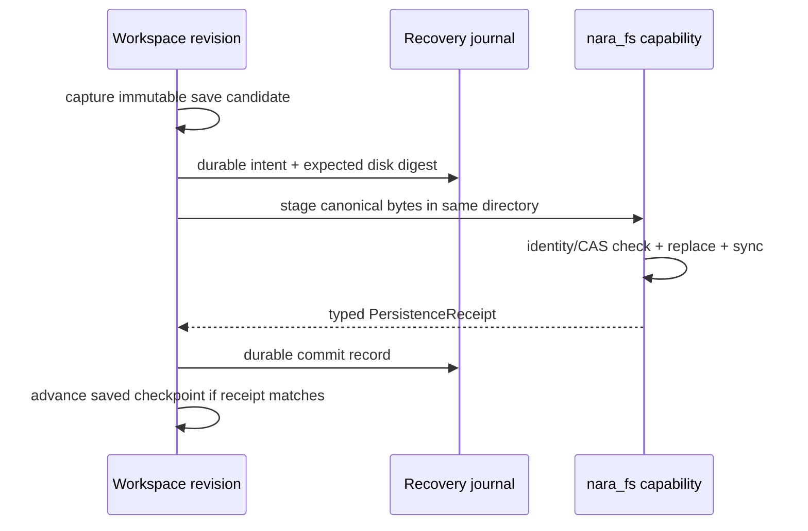

# ADR 0091: Editor Persistence, Recovery, and Concurrent Writer Policy

**Status**: Proposed
**Date**: 2026-07-13
**Owner**: `nara_tooling`, persistent document owners, `nara_fs`, and editor hosts
**Admission Trigger**: Editor workspace fixtures prove receipt-backed save, external conflict,
read-only second writer, bounded journal recovery, and old-or-new multi-document transaction
publication through one committed project snapshot at every injected filesystem failure/crash point
**Revisit Trigger**: Real collaborative live editing, remote filesystems, or source-control checkout
policy proves that cooperative single-writer plus explicit external-conflict handling is insufficient
**Related**: ADR 0026, ADR 0034, ADR 0043, ADR 0047, ADR 0048, ADR 0049, ADR 0050, ADR 0051,
ADR 0068, ADR 0070, ADR 0082, ADR 0083, ADR 0084, ADR 0087, ADR 0088, ADR 0090

## Context

Nara's workspace already models revisions, dirty state, external changes, per-document undo, and
future multi-document transactions. `nara_fs` provides capability-scoped open, identity, compare,
temporary-file, replacement, synchronization, and guarantee receipts. The missing product contract
is how the editor turns an in-memory revision into durable authored files without lying about
success or losing concurrent changes.

A command named `MarkSaved` can currently clear dirty state without proving which bytes reached
which file or durability tier. Atomic rename alone does not prove compare-and-swap, directory
durability, multi-file publication, or protection from another editor/Git/IDE writer. Conversely,
making an editor database the only source of truth would break code-first generation and normal
version-control workflows.

## Decision

If accepted, the editor will advance a saved checkpoint only from a matching typed persistence
receipt. File-backed workspaces use expected-digest conflict protection, cooperative writer
ownership, same-directory staging, explicit durability tiers, a committed-project publication
fence, and a bounded recovery journal.



### Document Persistence State

Each open document slot tracks:

- stable document/source identity and current authoring revision;
- saved checkpoint revision and canonical semantic content digest;
- observed disk digest and scoped live-object identity evidence;
- external state (`Clean`, `Changed`, `Deleted`, `Conflict`, `RecoveryRequired`);
- undo/redo state and any active transaction/recovery record.

`OpenDocumentId` remains editor-session identity and never enters authored files.

A save captures an immutable candidate revision and canonical bytes. A
`PersistenceReceipt` binds document/source identity, authoring revision, content digest, observed
predecessor digest/identity, publication result, and the filesystem guarantee/durability tier
actually proven. Only a matching successful receipt may advance the saved checkpoint. There is no
public command that marks an arbitrary current revision saved without such evidence.

### Committed Project Snapshot

Nara import, build, and project-open consumers require one coherent logical source generation:

```text
CommittedProjectSnapshot {
    project_binding,
    authoring_commit_id,
    member_table: logical identity/path -> content digest + file identity receipt,
    snapshot_digest,
}
```

`AuthoringCommitId` and `snapshot_digest` identify this authored-source snapshot only; they are not
artifact-group, package, executable, or runtime generation IDs. An `AuthoringCommitIndex` is the
small durable publication record for the active snapshot. Authored member files remain source truth;
the index is coordination/recovery evidence that says which complete set Nara consumers may use.

- A successful single-document save may publish a new project snapshot only after the persistence
  coordinator verifies every unchanged member against the preceding snapshot and binds the new
  receipt for the changed member.
- A multi-document transaction publishes one new snapshot after every replacement verifies.
- Non-editor Git/IDE/script changes enter through the same host resolver: raw watcher events are
  coalesced, bounded, and validated into a complete candidate member table before publication.
- All Nara project openers, watch resolvers, ADR 0087 importers, and ADR 0088 builders consume a
  `CommittedProjectSnapshot` lease. They do not treat a raw path event as a committed generation.
- Existing consumers retain their captured snapshot/bytes/handles. While a transaction fence is
  active, new consumers wait or receive a typed pending/recovery result; they never reopen a mixture
  of old and replaced member paths.

### Single-Document Save

The file-backed save path is:

1. preflight current document validation and canonical serialization budgets;
2. capture expected authoring revision, expected disk digest/identity, and target capability;
3. create an exclusive same-directory staged file and write bounded bytes;
4. flush/synchronize according to the configured supported tier;
5. revalidate expected revision and disk identity/digest;
6. replace through the strongest proven ADR 0070 primitive and synchronize parent metadata where
   supported;
7. return a typed receipt and append a durable journal commit;
8. advance saved checkpoint only if document, revision, digest, and required tier all match;
9. verify the remaining member table and publish a new `CommittedProjectSnapshot`, or retain the
   prior snapshot and report the external/member conflict.

A platform/filesystem that cannot prove the required tier fails closed or exposes an explicitly
weaker product mode. Advisory locks and canonicalize-then-open are not presented as strict CAS or
authorization.

Source change observation for import/reload is emitted only after committed-project snapshot
publication succeeds. This ADR never writes import-cache artifact groups, cooked packages, or
runtime save slots.

### Concurrent Writer and External Change Policy

- A file-backed project defaults to one cooperative editor writer. The host acquires a scoped
  workspace lease/lock with owner evidence and finite renewal/retirement.
- A second cooperative editor that cannot acquire the writer lease opens read-only. It does not
  silently fall back to last-writer-wins.
- Git, IDEs, scripts, and non-cooperating writers remain possible. Every save still validates
  expected disk identity/digest immediately before replacement.
- A clean local document may explicitly reload a validated external change. A dirty document plus
  external change enters `Conflict`; it is never overwritten or reloaded silently.
- Merge, keep-local, save-as, and discard are explicit commands. Semantic merge policy remains
  document-domain work; persistence only commits the validated result.
- Distinct typed results cover stale editor revision, changed bytes, replaced file identity,
  external deletion, lock loss, permission failure, and unsupported guarantee tier.

### Recovery Journal

The recovery journal is local generated recovery material, not authored truth, source-control
content, permanent undo history, or a package artifact. Each record contains:

- ADR 0051 envelope fields (`kind`, `format_version`, `engine_min_version`, `generator`), checksum,
  recovery binding, and monotonic sequence;
- transaction ID, baseline digest(s), candidate digest(s), and staged relative locations;
- bounded operation list and a durable commit/abort record;
- no secrets, absolute paths in diagnostics, or unbounded component payload duplication.

Replay applies byte, record, depth, time, snapshot, and diagnostic budgets before any mutation.
Truncated, corrupt, incompatible, or over-budget journals are quarantined and open the affected
workspace read-only with `RecoveryRequired`; they do not partially replay.

After a crash, recovery must prove one of:

- the old complete authored generation remains active;
- the new complete committed generation is finalized;
- the system is explicitly read-only/recovery-required with all evidence retained.

A committed record is never replayed twice. Recovery never silently invents a mixed project graph.

The first persistent coordination file kinds are `nara.authoring-commit-index` and
`nara.editor-recovery-journal`, both canonical version 1 with compatibility matrices and non-empty
golden fixtures. Both enforce ADR 0049 encoded-byte, shape, count, depth, string, time, and
diagnostic budgets before candidate publication. A `RecoveryBinding` contains a host-issued
project/session identity, manifest or baseline snapshot digest, root-capability generation/live-
object evidence, and journal-owner nonce.
Moving/copying a project or replacing the root capability does not authorize replay into the new
binding; the host requires explicit rebind/import or opens recovery evidence read-only.

### Multi-Document Transactions

`Save All` may report per-document success/failure because independent dirty documents do not
necessarily form one invariant. Operations that change cross-file identity/reference invariants use
an explicit `ProjectMutationTransaction`:

```mermaid
flowchart LR
    Preflight[Preflight complete document/reference graph]
    Old[Capture old bytes and digests]
    Stage[Stage every candidate]
    Intent[Durable transaction intent]
    Fence[Publish transaction fence to Nara consumers]
    Replace[Replace members with receipts]
    Verify[Verify complete member table]
    Commit[Durable AuthoringCommitIndex]
    Publish[Publish CommittedProjectSnapshot]
    Preflight --> Old --> Stage --> Intent --> Fence --> Replace --> Verify --> Commit --> Publish
```



The transaction records an `AuthoringCommitId`, distinct from artifact-group and package generation
IDs. It stages every candidate and a durable intent before replacing any member. Recovery either
finishes forward, restores the complete old graph when proven possible, or stays read-only with
evidence. Nara promises detectable/recoverable logical old-or-new publication, not magical physical
atomicity across arbitrary filesystems.

The transaction fence prevents Nara consumers from treating intermediate physical replacements as
active. Raw watcher events are quarantined/coalesced until the commit index publishes or recovery
retains the old snapshot. Non-Nara tools may still observe intermediate filesystem paths; that is
why physical cross-file atomicity is not claimed.

### Close and Runtime Interaction

Close is explicitly `SaveAndClose | DiscardAndClose | Cancel`. Save failure, runtime/Play stop
failure, lock loss, or recovery failure keeps the document visible and dirty. Editor exit drives
runtime close before releasing parent project/filesystem authority under ADR 0082/0084; destructor
completion is not save/close evidence.

## Alternatives Considered

### Option A: Overwrite Then Mark Saved

**Pros**: Minimal state and implementation.

**Cons**: Crash, short write, stale revision, concurrent writer, and sync failure can produce false
clean state or lost data.

**Decision**: Rejected.

### Option B: Depend Only on Atomic Rename or OS Locks

**Pros**: Uses familiar platform primitives.

**Cons**: Neither alone proves expected-content CAS, durability, external-writer safety, or
multi-file recovery across all supported filesystems.

**Decision**: Rejected.

### Option C: Make an Editor Database the Only Source of Truth

**Pros**: Central transactions and recovery are easier to control.

**Cons**: Breaks code-first/AI generation, normal source control, and direct file tooling.

**Decision**: Rejected.

### Option D: Expected Digest, Typed Receipts, Cooperative Lock, and Bounded Journal

**Pros**: Keeps authored files authoritative while making save truth, conflicts, recovery, and
platform guarantees explicit and testable.

**Cons**: Requires platform-specific evidence, fault injection, read-only fallback, and transaction
state before editor polish.

**Decision**: Proposed.

## Success Metrics

| Metric | Target | Measurement |
|---|---:|---|
| Receipt-backed dirty state | Dirty clears only when receipt document/revision/digest/tier all match | Workspace tests |
| Single-file crash safety | Every stage/write/sync/replace/journal failure reopens old, new, or explicit read-only state | Fault matrix |
| Conflict precision | Stale revision, changed digest, replaced identity, deletion, and second writer are distinct typed results | Conflict fixtures |
| Journal safety | Truncated/corrupt/oversized/timeout journals terminate within budget and publish no partial state | Hostile recovery tests |
| Multi-file coherence | No injected crash or raw watcher event publishes a mixed member table as the committed project snapshot | Transaction/watch fault matrix |
| Snapshot production | Single save, multi-file transaction, and validated external edit each publish one complete `CommittedProjectSnapshot` | Project resolver tests |
| Close safety | Save/Play-stop/cancel failure keeps document visible and dirty | Editor integration tests |
| Guarantee honesty | Platform tests report actual CAS/atomicity/durability tier, never a generic `safe` boolean | Filesystem matrix |
| Source notification | Import/reload sees a source change only after committed authoring publication | Integration test |

## Risks and Mitigations

| Risk | Severity | Likelihood | Mitigation |
|---|---|---:|---|
| Network/removable filesystem lacks required guarantees | High | Medium | Fail closed or expose explicit cooperative/read-only tier. |
| Recovery journal leaks project data | High | Medium | Keep local/ignored, minimize payload, bound size, and apply diagnostic redaction. |
| Rollback fails after partial multi-file replace | Critical | Medium | Retain old/staged evidence and journal; enter recovery-required read-only instead of guessing. |
| Lock gives false confidence against Git/IDE | High | High | Treat lock as cooperative only and always enforce expected digest/identity. |
| Autosave competes with explicit save | Medium | Medium | Serialize persistence transactions per document and stamp expected revisions. |
| Saved checkpoint advances before true durability | Critical | Medium | Make typed receipt/tier the only transition authority. |
| Watcher exposes transaction intermediate state | Critical | Medium | Gate Nara consumers on the commit index and quarantine/coalesce raw events behind the transaction fence. |
| Journal replays into a copied/moved project | High | Medium | Verify `RecoveryBinding` root/session/baseline/owner evidence and require explicit rebind. |

## Consequences

If accepted:

- ADR 0047's saved revision becomes receipt-backed rather than a UI command assertion;
- ADR 0070 supplies the platform/filesystem capabilities and guarantee receipts while tooling owns
  document/workspace semantics;
- ADR 0083 multi-file identity rewrites use the same project transaction/recovery boundary;
- ADR 0088 consumes the resulting `CommittedProjectSnapshot` rather than an undefined ambient
  project revision;
- importer artifact publication and target package publication keep their own manifests/generation
  IDs and do not reuse the editor recovery journal;
- live multi-user editing remains a separate future session-authority/causal-order decision.

## Admission Evidence

Acceptance requires real filesystem integration tests for every supported guarantee tier, complete
single/multi-file fault injection, second-writer and non-cooperating external-write cases, bounded
journal corruption/rebinding cases, receipt-backed dirty state, snapshot publication/watcher fences,
and close/runtime failure behavior. An atomic rename helper or autosave timer alone is insufficient.

## Citations

- Godot undo/saved version management:
  `repo-ref/godot/editor/editor_undo_redo_manager.h`
- Unity Smart Merge: <https://docs.unity3d.com/Manual/SmartMerge.html>
- Unreal scoped transactions:
  <https://dev.epicgames.com/documentation/en-us/unreal-engine/API/Editor/UnrealEd/FScopedTransaction>
- Rust filesystem synchronization semantics: <https://doc.rust-lang.org/std/fs/struct.File.html>
