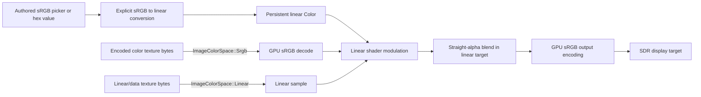

# ADR 0092: SDR Color Space, Alpha, and Output Encoding

**Status**: Accepted
**Date**: 2026-07-13
**Owner**: `nara_core`, `nara_image`, material and render domains, render backends
**Related**: ADR 0005, ADR 0033, ADR 0040, ADR 0051, ADR 0094
**Revisit Trigger**: A concrete HDR, wide-gamut, color-grading, display-profile, or
premultiplied-alpha workflow cannot preserve this SDR contract as an explicit compatibility mode

## Context

nara already persists `Color` values in sprite, runtime UI, and camera data. Image imports record
`ImageColorSpace::Srgb` or `ImageColorSpace::Linear`; the wgpu adapter maps those values to sRGB or
linear texture formats, renders through an sRGB surface view, and uses straight-alpha blending for
`AlphaMode2d::Blend`.

Those choices currently form a coherent standard dynamic range (SDR) path, but their semantics are
implicit. In particular, `Color::rgba` does not state whether its channels are encoded sRGB or
linear, persistent component fields do not carry a transfer function, and silently switching the
alpha representation would reinterpret existing scenes, materials, UI, shaders, and imported
artifacts.

Godot, Unity, and Unreal expose different authoring controls, but all treat working-space,
texture-decode, alpha, and output conventions as pipeline-wide contracts. Retrofitting those
semantics after assets and shaders proliferate is expensive. nara therefore fixes its existing SDR
meaning now while keeping high dynamic range (HDR), wide-gamut output, tone mapping, display
profiles, and color grading explicitly undecided.

## Decision

nara's canonical SDR working space is linear sRGB: sRGB/Rec.709 primaries with a linear transfer
function. Persistent and runtime `Color` values use linear RGB channels and a linear, unassociated
(straight) alpha channel.

### Core color semantics

- `nara_core::Color` represents linear-sRGB RGB channels plus straight alpha.
- `Color::rgb` and `Color::rgba` interpret their numeric RGB arguments as linear values. They do
  not perform an sRGB transfer-function conversion.
- Alpha is linear coverage or opacity data. The sRGB transfer function never applies to alpha.
- Color multiplication, interpolation, lighting, modulation, and blending occur in linear space.
- Persistent color fields store the canonical linear values. Loaders must not guess an encoding
  from value ranges, filenames, field names, or source extensions.
- Persistent color values must be finite. Individual domains may impose narrower ranges, but the
  core representation is not silently clamped or tone mapped.
- Future authoring conveniences such as sRGB byte, hexadecimal, CSS-style, or picker values must
  use explicitly named conversion APIs and lower to canonical linear `Color` values before they
  enter persistent component data or render packets.

### Image decode semantics

- `ImageColorSpace::Srgb` means stored RGB texels use the sRGB transfer function and alpha remains
  linear. Backends sample the texture through an sRGB-capable view so shaders receive linear RGB.
- `ImageColorSpace::Linear` means stored channels are already linear data and must not receive an
  sRGB decode. Normal maps, masks, lookup data, and other non-color textures use this path unless a
  domain defines a more specific semantic format.
- Ordinary color-image import may default to `Srgb`; a specialized importer or explicit source
  setting owns any override to `Linear`.
- Color-space selection participates in imported-product identity, render-resource preparation,
  and backend cache validation. Changing it must not reuse a texture realization created under the
  other decode contract.
- Mip generation, resampling, compression, and future atlas processing must preserve the declared
  color-space and alpha semantics. They must not average encoded sRGB values as though they were
  linear.

### Material, shader, and alpha semantics

- Sprite and runtime-UI tint values, camera clear colors, and other backend-neutral render colors
  are canonical linear `Color` values.
- A sampled color texture and tint are multiplied in linear space. Their current payloads remain
  straight alpha.
- `AlphaMode2d::Blend` means straight-alpha source-over blending. The color blend factors are
  source alpha and one minus source alpha; the alpha blend factors are one and one minus source
  alpha. No importer, shader, or backend may silently premultiply only one source stage of the path.
- `AlphaMode2d::Opaque` disables blending and does not reinterpret stored color channels.
- A transparent offscreen target that accumulates source-over results does not thereby become a
  reusable straight-alpha source texture. Its associated/composited representation and any resolve
  or conversion must be declared before another pass samples it. The current presentation path does
  not establish that future offscreen contract.
- A future premultiplied-alpha, additive, masked, or custom blend mode must be explicit in stable
  material intent and must align import processing, shader output, pipeline state, batching keys,
  and tests. It may coexist with this contract but cannot reinterpret existing `Blend` assets.
- Any future separately admitted backend-specific integration owns the correctness of its private
  intermediate format, but its result must still satisfy the declared target encoding when it
  rejoins a Nara-owned target path.

### SDR target and authoring semantics

- Standard window surfaces and SDR presentation or encoded-output targets use an sRGB output view.
  Shaders write linear values; the target conversion performs the sRGB encoding.
- Blending occurs against the linear target representation before output encoding.
- Offscreen color targets must declare whether they contain linear working data or encoded output.
  A backend must not infer that distinction from a texture's eventual file extension or UI use.
- If a target format cannot provide the declared sRGB output view, the backend must report a
  capability failure or select an explicit semantic fallback. It must not silently present linear
  bytes as though they were sRGB encoded.
- Editors and inspectors should present sRGB-oriented pickers and hexadecimal values for human
  authoring, then convert explicitly to and from canonical linear persistent values. A displayed
  hexadecimal value is an authoring view, not the storage contract.
- SDR output does not include an implicit tone mapper. Values outside the target's representable
  range follow the declared target/backend behavior until a future HDR or tone-mapping decision is
  admitted.

### Deferred color-management scope

This ADR does not choose:

- an HDR scene-referred working space or HDR swapchain format;
- wide-gamut asset primaries, mastering metadata, paper-white, or display adaptation policy;
- tone-mapping, exposure, bloom, color-grading, or UI-compositing order around tone mapping;
- ICC, OpenColorIO, operating-system display-profile, or professional content-pipeline support;
- a canonical premultiplied-alpha asset representation.

Those choices require a concrete output and authoring workflow. They must preserve this SDR path as
an explicit compatibility mode or replace it through a later ADR with migration evidence.

## Alternatives Considered

### Option A: Treat all authored and rendered RGB values as encoded sRGB

**Pros**: Numeric values resemble common pickers and image bytes; initial APIs appear simple.

**Cons**: Interpolation, tinting, mip generation, lighting, and blending become physically and
visually incorrect unless every operation inserts ad hoc conversions. Existing sRGB texture views
already decode samples to linear values.

**Decision**: Rejected.

### Option B: Use linear sRGB with straight alpha as the canonical SDR contract

**Pros**: Matches the implemented texture, shader, blend, and surface path; keeps arithmetic
coherent; preserves ordinary authoring through explicit conversion helpers.

**Cons**: Raw `Color` channel values differ from familiar hexadecimal sRGB values, and straight
alpha requires care around filtering transparent texels.

**Decision**: Chosen.

### Option C: Make premultiplied alpha canonical immediately

**Pros**: Improves compositing algebra and can reduce filtering artifacts when the whole pipeline
is consistently premultiplied.

**Cons**: Reinterprets current persistent tints and texture/shader/blend behavior, requires an
import migration, and makes an unproven choice for every material domain.

**Decision**: Rejected as a silent replacement; an explicit future material mode remains allowed.

### Option D: Adopt a wide-gamut or ACES-style working space for all rendering now

**Pros**: Creates a direct foundation for high-fidelity HDR and color-grading workflows.

**Cons**: Adds conversion, asset metadata, precision, output, and authoring requirements that the
current 2D SDR product path cannot validate.

**Decision**: Deferred until a concrete HDR or wide-gamut slice supplies evidence.

## Success Metrics

| Metric | Target | Measurement |
|---|---:|---|
| Public color meaning | 100% of public/persistent `Color` entry points document linear RGB and straight alpha | API and schema review |
| Texture decode | sRGB and linear imports map to distinct validated GPU formats and cache identities | `nara_image` and `nara_render_wgpu` tests |
| Linear composition | Reference tint, texture, clear, and blend cases match linear-space expected values within declared tolerance | Shader/readback or rendered golden tests |
| Durable round trip | Persistent sprite, UI, and camera colors round-trip without implicit transfer conversion | scene/component codec fixtures |
| Alpha consistency | Every built-in 2D blend source uses straight alpha and the declared RGB/alpha source-over equations | material key, shader, and pipeline-state tests |
| Backend isolation | Core, asset, material, and render-domain data contain no wgpu texture-format values | dependency-boundary review |

## Risks and Mitigations

| Risk | Severity | Likelihood | Mitigation |
|---|---|---:|---|
| Users enter familiar sRGB values through a linear constructor | High | High | Document constructor semantics and add explicitly named sRGB conversion helpers before exposing polished color pickers. |
| A data texture is imported as sRGB | High | Medium | Keep color-space metadata explicit, provide importer overrides, and validate specialized texture domains. |
| Straight-alpha filtering creates edge halos | Medium | Medium | Require transparent-edge conditioning or an explicit future premultiplied mode; never mix representations silently. |
| A backend blends into an encoded rather than linear target | High | Medium | Declare target encoding and add backend format/blend validation plus rendered reference cases. |
| HDR work silently changes existing SDR assets | Critical | Medium | Keep SDR as a named compatibility mode and require a new ADR plus migration and dual-output evidence. |
| Persistent out-of-range or non-finite values destabilize rendering | Medium | Low | Reject non-finite persistent values and let owning domains validate narrower ranges before extraction. |

## Consequences

- Existing image color-space tags, material tints, sprite/UI shaders, alpha mode, and sRGB surface
  view now have one explicit cross-domain meaning.
- Scene and component files containing color channels gain a stable interpretation without adding
  backend types to persistent data.
- Editor color controls require explicit display-space conversion rather than exposing raw linear
  channels as though they were hexadecimal sRGB.
- A future HDR or premultiplied pipeline remains possible, but it must be explicit and cannot
  silently reinterpret the established SDR path.
