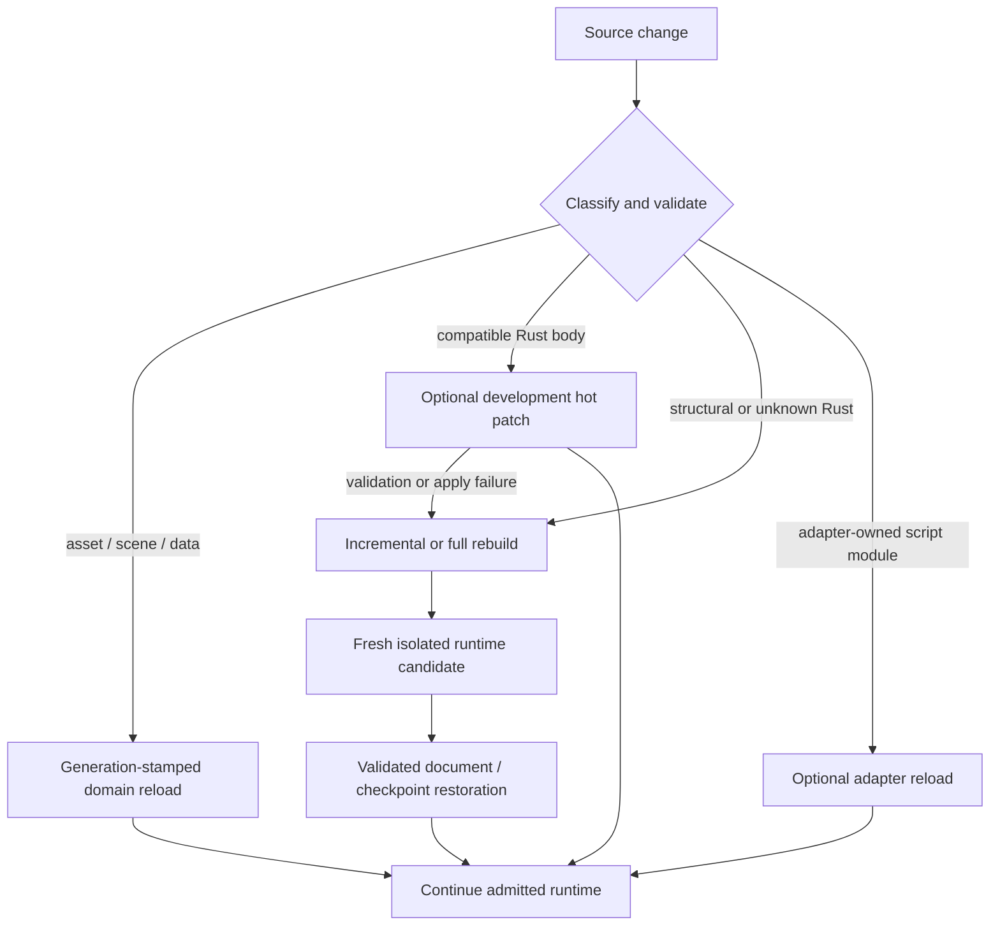

# ADR 0093: Rust Authoring, Hot Iteration, and Optional Scripting Adapters

**Status**: Accepted
**Date**: 2026-07-13
**Owner**: Rust authoring, executable/runtime hosts, optional scripting adapter packages
**Supersedes**: [ADR 0021](0021-scripting-and-wasm-boundary.md)
**Related**: ADR 0034, ADR 0039, ADR 0042, ADR 0045, ADR 0076, ADR 0084, ADR 0086
**Revisit Trigger**: Measured production evidence shows that the complete Rust path cannot meet an
accepted workflow, or two independent scripting adapters prove a shared Nara-owned contract that
cannot remain adapter-local

## Context

Rust is Nara's official and complete game-authoring language. Compile and restart latency can still
make gameplay iteration uncompetitive, but a second official language would add its own editor,
debugger, binding, packaging, runtime, and semantic costs.

ADR 0021 correctly separated Rust `Plugin` implementations from sandboxed script modules and
denied scripts unrestricted mutable `World` access. It nevertheless described Wasm as the future
scripting extension and treated hot replacement as one adjacent concern. Product and toolchain
research since that decision shows that asset/data reload, compatible native function patching,
structural Rust rebuild, and script-module reload have different compatibility, safety, ownership,
and state-retention contracts.

Dioxus demonstrates part of this separation: asset and RSX reload avoid native replacement, while
Subsecond incrementally compiles Rust and redirects calls through explicit hot-function boundaries.
Subsecond does not by itself migrate arbitrary Rust layouts, provide a stable plugin ABI, define a
transactional rollback protocol, or supply a safe patch point for parallel ECS execution.

Nara therefore needs a reliable Rust iteration baseline and optional faster paths without promising
that every edit can preserve a running world or preselecting a universal scripting VM.

## Decision

Nara uses four explicit iteration paths:

### Complete Rust baseline

- Rust APIs support the complete production authoring, build, debugging, packaging, and runtime
  path. Enabling no scripting or hot-patch package must not remove a required game capability.
- Asset, scene, prefab, and project-data reload use their domain-owned, generation-stamped pipelines
  and last-good values.
- Rust source changes always have a reliable rebuild path. Structural or unknown changes create a
  fresh isolated runtime candidate; they never mutate component layouts or plugin topology inside
  the active `World`.
- State restoration is explicit and validated. Editor documents remain the edit authority;
  supported checkpoints or semantic save records may restore runtime state. Resident process
  memory is not a migration contract.
- Build, classification, reload, restart, and restoration outcomes are observable structured data.
  Failure keeps or returns to a known last-good executable/runtime path rather than publishing a
  partially prepared candidate.

This ADR accepts only the high-level invariant that structural or unknown Rust changes rebuild,
start through fresh isolation, restore only validated state, and retain a known-good fallback. It
does not accept ADR 0084's proposed runtime-owner/state/close topology or ADR 0086's proposed
executable-generation and activation topology. Those proposals remain non-authoritative until their
own admission evidence and reviews succeed.

### Optional Rust hot-patching

A Subsecond-like integration may be provided as an optional development plugin. It is experimental
until measured with the reference game and is not part of the runtime correctness baseline.

- Hot calls are coarse and explicit, such as a game callback or complete gameplay schedule invoked
  at an engine-owned quiescent boundary.
- A patch may retain the current `World` only after Nara proves that function signatures, captured
  environments, component/resource layouts, registrations, plugin topology, static initialization
  assumptions, and relevant task callbacks remain compatible.
- Patch application occurs only after the current schedule/tick completes and all participating
  parallel work or callbacks that could execute replaced code have retired.
- Schedules and system state may be rebuilt even when the `World` is retained.
- Signature, layout, Cargo feature/dependency, static-initializer, thread-local, unknown
  generic/inline, or failed compatibility cases fall back to rebuild and runtime reconstruction.
- The integration must disclose toolchain/version support and memory growth. It must not claim
  rollback after a patch has committed unless Nara itself implements and verifies that transaction.

### Optional scripting and sandbox adapters

- A scripting runtime is installed through an ordinary Rust package/plugin, for example a possible
  first-party `nara_luau` package.
- The adapter owns its VM, language bindings, module lifecycle, reload semantics, private execution
  state, diagnostics, and target restrictions.
- Adapters reuse Nara-owned domain APIs, stable handles, schema metadata, and command/service
  boundaries where those contracts fit. Nara does not predefine a universal language-neutral
  Behavior Host.
- Script modules never receive unrestricted mutable `World` or native backend handles, regardless
  of adapter trust. The adapter's Rust host integrates through explicit ECS systems and Nara-owned
  query, command, schema, and service APIs.
- A trusted in-process Rust adapter must disclose that it is not a sandbox. Trust describes the
  native host package's process privileges; it does not widen the script module's data-access
  contract.
- Wasm is one possible adapter for a concrete sandboxing or portability use case. It is neither the
  default scripting runtime nor the universal plugin ABI.
- Shared scripting contracts move into Nara-owned APIs only after at least two independent adapters
  or one adapter plus a non-scripting consumer prove the same boundary.
- Removing all scripting features leaves a complete Rust production path and no VM dependency in
  the core/default runtime.

`Plugin` continues to mean a Rust-side engine or game module. A scripting package may contain such
a plugin, but script modules loaded by that adapter are not Rust `Plugin` implementations.

## Alternatives Considered

### Option A: Make a script language coequal with Rust

**Pros**: Fast module reload and a familiar managed authoring model.

**Cons**: Requires two complete official workflows before either is production proven and makes the
VM a product-wide dependency.

**Decision**: Rejected as a core requirement; allowed as an optional package.

### Option B: Make Wasm the universal extension and scripting boundary

**Pros**: Portable bytecode and a potential sandbox boundary.

**Cons**: Does not provide a language, gameplay API, editor workflow, debugger, state migration, or
efficient fine-grained host model by itself.

**Decision**: Rejected; revisit for a concrete sandboxed extension use case.

### Option C: Support only rebuild and process restart

**Pros**: Smallest correctness surface and strongest compatibility behavior.

**Cons**: Leaves a major Rust production cost unmeasured and ignores credible function-patching and
isolated-runtime restoration techniques.

**Decision**: Retained as the reliable fallback, not the only iteration path.

### Option D: Layer reload, optional Rust patching, and optional script adapters

**Pros**: Keeps one complete Rust path, assigns safety by change class, and lets projects opt into a
different latency/runtime tradeoff.

**Cons**: Requires explicit classification, quiescence, fallback, and UX instead of one universal
hot-reload claim.

**Decision**: Chosen.

## Success Metrics

| Metric | Target | Measurement |
|---|---:|---|
| Change classification | 100% of reference edits choose an explicit reload, patch, or rebuild path | instrumented reference-game edit suite |
| Safe structural fallback | 100% of signature/layout/plugin/dependency test changes reject patching and start a fresh runtime | compatibility and integration tests |
| Last-good behavior | Compiler, linker, loader, validation, or restoration failure never publishes a partial runtime | fault-injection tests |
| Rust iteration latency | P50/P95 recorded separately for data, compatible-function, and structural changes | development benchmark |
| Optional core | Default and minimal feature trees contain no script VM or hot-patch toolchain dependency | Cargo tree checks |
| Quiescent application | No patch applies during an active schedule or participating callback/task | runtime state-machine tests |
| Adapter locality | Adapter-only lifecycle/VM types remain outside core until the shared-consumer gate is met | dependency and API review |

Numeric latency gates are set after the first reference-game baseline. A patch prototype must
outperform ordinary incremental rebuild plus restart for its supported edit class to remain a
product investment.

## Risks and Mitigations

| Risk | Severity | Likelihood | Mitigation |
|---|---|---:|---|
| A compatible-looking patch observes an old Rust layout | Critical | Medium | Compare registered schema/layout evidence, keep an allowlist of supported changes, and treat unknown as restart. |
| Parallel ECS or background callbacks execute mixed code versions | Critical | Medium | Apply only at an engine-owned quiescent boundary after participating work retires. |
| Patch loading succeeds but later behavior is wrong | High | Medium | Keep hot-patching experimental, record the applied generation, expose manual restart, and do not claim automatic rollback. |
| Toolchain coupling breaks across Rust or platform updates | High | High | Pin supported versions in the optional plugin and keep incremental rebuild/restart independent from it. |
| Script adapter abstractions leak into the core | High | Medium | Keep VM/language contracts adapter-owned and require the shared-consumer evidence gate. |
| Users confuse trusted scripting with sandboxing | High | Medium | Declare trust and capability level in package metadata and diagnostics. |
| A second authoring language becomes accidentally required | Critical | Low | Keep no-VM production fixtures and feature-tree checks as release gates. |

## Consequences

- Rust remains sufficient for a complete Nara game.
- Subsecond is a useful prototype candidate, not a current product guarantee or a reason to design a
  stable Rust dynamic ABI.
- A Luau, Wasm, or other adapter can offer a separately reloadable gameplay layer without changing
  the core language decision.
- Runtime isolation, exact tick boundaries, schema inspection, structured diagnostics, and
  last-good recovery benefit Rust iteration even if native hot-patching is never admitted.
- Nara documentation describes which edit path ran and what state was retained; it does not use
  `hot reload` as an undifferentiated promise.
- ADR 0021 remains the historical source of the Rust-plugin versus script-module distinction; this
  ADR replaces its Wasm-first and undifferentiated hot-replacement direction.

## Citations

- [Dioxus 0.7 hot-reload guide](https://dioxuslabs.com/learn/0.7/essentials/ui/hotreload/)
- [Dioxus Subsecond source and crate documentation](https://github.com/DioxusLabs/dioxus/tree/main/packages/subsecond/subsecond)
