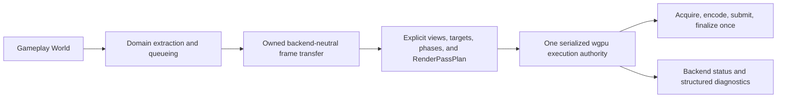

# ADR 0094: Minimal Render Execution Boundary and Evidence-Gated Extensions

**Status**: Accepted
**Date**: 2026-07-16
**Supersedes**: [ADR 0077](0077-render-pipeline-recipes-graph-compilation-and-backend-encoding.md)
**Refines**: [ADR 0012](0012-render-crate-boundaries.md),
[ADR 0016](0016-extension-seams-for-backends-and-domain-modules.md),
[ADR 0017](0017-render-graph-policy.md),
[ADR 0032](0032-render-backend-integration-boundary.md),
[ADR 0040](0040-render-resource-lifetime-and-submitter-ownership.md), and
[ADR 0078](0078-render-host-affinity-webgpu-initialization-and-device-recovery.md)

## Context

ADR 0077 selected a complete future renderer taxonomy before Nara had production consumers for
most of it. The repository proves a narrower baseline: backend-neutral views, targets, phases,
domain batches, static `RenderPassPlan` ordering, a wgpu backend, safe surface ownership, and part
of the device-loss boundary. It does not yet prove public Pipeline Family or Render Feature
catalogs, persistent recipes, a retained logical render scene, a logical graph compiler,
`CompiledPipelineTemplate`, `FrameExecutionPlan`, raw-wgpu interop, or replacement Render Host
parity.

Bevy, Unity, and Godot demonstrate that these are real solution families, but they make different
trade-offs. Bevy exposes a render sub-application and ECS schedules; Unity provides Scriptable
Render Pipeline assets and RenderGraph; Godot keeps product-facing compositor effects separate
from lower-level RenderingDevice internals. Their existence is evidence that Nara must preserve
room for advanced extension, not evidence that Nara should accept one complete taxonomy before its
own workflows choose it.

This ADR keeps the proven, high-cost ownership boundaries and returns unproven extension mechanisms
to evidence-gated design work. It supersedes ADR 0077 rather than rewriting that historical
decision in place.

## Decision

Nara accepts a minimal backend-neutral frame boundary over one serialized wgpu execution authority.
The current static phase plan remains valid until a concrete workflow proves it insufficient.

### Backend-neutral authoring and render domains

- Gameplay, scene, asset, material, sprite, UI, text, tooling, and other domain-facing data do not
  contain wgpu objects, platform target handles, command encoders, or render-graph implementation
  details.
- `nara_render` owns backend-neutral views, targets, viewport/scissor intent, phases, frame
  lifecycle, `RenderPassPlan`, backend status, and skipped-frame reasons.
- Domain render crates own extraction, queueing, sorting, and batching. A backend consumes their
  backend-neutral outputs rather than reading gameplay components directly.
- GPU caches remain backend-owned and are keyed or invalidated by logical resource identity,
  generation, device epoch, and budget. Device plugins do not permanently own every domain
  submitter.

### wgpu is the only RHI

- Nara does not mirror wgpu with another public `Device`, `Queue`, `Texture`, `Buffer`, or command
  API.
- Exact wgpu features, limits, downlevel/surface capabilities, handles, allocation, encoding,
  submission, and presentation stay in `nara_render_wgpu` or a future separately admitted exact-
  wgpu integration boundary.
- Nara does not promise a generic multi-backend trait, a second production RHI, or a WebGL2
  compatibility pipeline. A different RHI requires a new ADR and concrete product evidence.

### Owned frame transfer

- Extraction must converge on an owned, backend-neutral frame transfer between the gameplay
  `World` and GPU execution authority. The transfer must not borrow the `World` or carry surfaces,
  devices, queues, encoders, backend cache entries, or platform windows.
- `RenderFramePacket` is an acceptable current implementation name, not a frozen public section
  registry, provider catalog, or second render ECS contract.
- The transfer declares producer, consumer, bounded size/work, generation, rejection, cleanup, and
  diagnostic behavior before it crosses an asynchronous or threaded boundary.
- A second render `World`, render worker, or retained scene is an internal or future design choice,
  not part of this accepted boundary.

### Static planning and graph admission

- `RenderPassPlan` is the current static phase-order contract. It must not grow into an ad hoc
  partial resource graph or persistent project recipe.
- Views, targets, viewport/scissor semantics, phases, and target-frame lifecycle remain explicit
  and backend-neutral so a future graph can replace static planning without changing gameplay
  authoring data.
- The first intermediate/history resource or cross-target dependency that static planning cannot
  express reopens OQ-001. That workflow chooses the smallest sufficient resource and scheduling
  model; this ADR does not preselect a graph compiler or public execution kernel.

### GPU authority, target transaction, and epoch

- One serialized execution authority owns each live wgpu device domain. Ordinary runtime plugins
  do not acquire ambient Device/Queue access, target acquisition, submission, presentation, or
  recovery authority.
- Surface loss and unexpected device loss remain distinct. Device/Queue-dependent resources and
  asynchronous or encoded results carry a non-reused host/device epoch and cannot execute after
  that epoch is retired.
- For the currently admitted single-target frame, the execution authority acquires/imports the
  target at most once and presents, publishes, or discards it once after its final consumer.
- Multi-target global dependency ordering is not accepted by this ADR. It enters through OQ-001
  when a real offscreen or cross-target workflow cannot be represented by independent admitted
  target transactions.

### Evidence-gated extension freedom

- Nara preserves the product goal that advanced Rust packages should be able to reach sufficient
  renderer control without forking the engine. This goal does not itself freeze a public role,
  catalog, callback, or Host-replacement API.
- Ordinary gameplay and runtime plugins remain simple and do not receive hidden global GPU or Host
  authority.
- Each higher-authority mechanism requires its own production-shaped tracer, alternatives review,
  trust/lifecycle contract, and Accepted ADR or explicit revision before it becomes a supported
  product guarantee.
- First-party and external implementations should use the same supported path once a capability is
  admitted. Equality of every hypothetical future role is a validation target, not a current
  compatibility promise.

## Candidate Extensions, Not Accepted Decisions

The following remain non-normative hypotheses in the render pressure matrix, render Interface
harness, and inactive render tracer plan:

| Candidate | Evidence required before admission |
|---|---|
| Render Feature or public pass/provider catalog | A production post-process, overlay, or custom pass that static domain submitters cannot express cleanly |
| Pipeline Family, Renderer Profile, or persistent Pipeline Recipe | A second materially different complete renderer plus an ordinary author selection workflow |
| Logical RenderGraph, compiler, `CompiledPipelineTemplate`, or `FrameExecutionPlan` | At least one concrete logical-resource lifetime/dependency workflow and an alternatives comparison against static phases and a minimal execution kernel |
| Retained logical render scene/update protocol | Two production consumers that need persistent render-domain state and prove bounded gap/resync behavior |
| ViewFamily, auxiliary views, and history identity | A temporal, stereo, reflection, portal, or related-view workflow with explicit invalidation pressure |
| Shader artifact/interface, Material Technique, or Shader Graph convergence | Reusable materials plus two independent shader frontends or authoring routes |
| Editor semantic outputs, picking, and capture catalog | A real editor viewport whose tooling requirements cannot be met by the minimal target/output contract |
| Scoped encoding or exact wgpu/native interop | A compute, video, XR, vendor, or external-resource integration with pre-device, ordering, epoch, trust, and teardown evidence |
| Replacement Render Host or alternate renderer runner | A production integration that must own target, submission, presentation, recovery, or placement and cannot fit an admitted lower-authority path |

No candidate in this table may be cited as current implementation authority. A tracer may compare
alternatives without creating production APIs; implementation begins only after the owning
decision and plan are explicitly activated.

## Alternatives Considered

### Option A: Keep ADR 0077's complete taxonomy Accepted

**Pros**: One ambitious destination, extensive terminology, and an implementation-ready-looking
render plan.

**Cons**: Treats speculative mechanisms as constraints, biases tracers toward proving a
preselected taxonomy, increases cognitive load, and can force first-party 2D work to implement
unused generality.

**Decision**: Rejected.

### Option B: Accept only today's concrete draw loop and expose no advanced direction

**Pros**: Smallest immediate documentation and implementation burden.

**Cons**: Encourages backend-local hooks and makes later renderer, editor, compute, or vendor
extension a costly ownership retrofit.

**Decision**: Rejected.

### Option C: Accept the minimal ownership boundary and gate mechanisms by tracers

**Pros**: Preserves wgpu isolation, owned transfer, target ownership, and epoch safety while letting
real workflows choose between static phases, typed providers, a render sub-app/kernel, or a graph.

**Cons**: Advanced extension parity remains an explicit non-claim until multiple focused decisions
and implementations land.

**Decision**: Chosen.

## Success Metrics

| Metric | Target | Measurement |
|---|---:|---|
| Backend isolation | No gameplay/domain persistent type imports wgpu or stores GPU handles | Dependency-boundary search and API review |
| Static-plan honesty | `RenderPassPlan` expresses only explicit phase order and is not serialized or expanded into a partial graph | Unit tests and source review |
| Owned transfer | GPU execution consumes an owned frame transfer with no gameplay `World` borrow or native/GPU handles | Boundary tests and type review |
| Single authority | Exactly one owner encodes/submits for each live device domain | Backend lifecycle and conflict tests |
| Target transaction | Each admitted target frame acquires and finalizes its target at most once | Surface integration tests |
| Epoch rejection | Old-epoch device resources and results never reach a replacement device | Device-loss fault tests |
| Evidence-gated growth | No candidate extension enters production API solely because it appears in a Design Draft | ADR/plan governance tests |

## Risks and Mitigations

| Risk | Severity | Likelihood | Mitigation |
|---|---|---:|---|
| Minimal baseline becomes a permanently closed renderer | High | Medium | Keep pressure tracers and open questions, and admit the lowest sufficient authority when a real workflow fails. |
| Backend-local hooks accumulate before a public extension path exists | High | Medium | Require explicit domain ownership and record each workaround as admission evidence; do not normalize hidden hooks. |
| `RenderPassPlan` grows into a partial graph | High | High | Keep its data model phase-only and replace it under pre-1.0 policy when OQ-001 admits another model. |
| Raw wgpu is exposed casually to restore freedom | Critical | Medium | Require a separate trust, ordering, epoch, target, and teardown decision for exact-GPU access. |
| Tracers merely confirm the old taxonomy | High | Medium | Every tracer compares at least two viable shapes and includes reversal criteria before production APIs change. |

## Consequences

- ADR 0077 remains as historical context but is no longer authoritative.
- Current render work may complete the owned frame-transfer, single-target transaction, browser-
  affinity, and epoch-recovery baseline without implementing Pipeline Family, recipes, a retained
  scene, a public graph/compiler, interop, or replacement Host.
- OQ-001 selects the future graph or execution shape from concrete resource pressure rather than
  asking how to implement a preselected compiler.
- The render pressure matrix and Interface harness remain useful design inputs, but their role
  taxonomy is explicitly hypothetical until admitted one capability at a time.
- The future render plan must be rebaselined after the reference-game release. Its existing units
  are candidate experiments, not an active instruction to implement the complete ADR 0077 system.

## References

- [ADR 0017: Render Graph Policy](0017-render-graph-policy.md)
- [ADR 0032: Render Backend Integration Boundary](0032-render-backend-integration-boundary.md)
- [ADR 0040: Render Resource Lifetime and Submitter Ownership](0040-render-resource-lifetime-and-submitter-ownership.md)
- [ADR 0078: Render Host Affinity, WebGPU Initialization, and Device Recovery](0078-render-host-affinity-webgpu-initialization-and-device-recovery.md)
- [ADR 0092: SDR Color Space, Alpha, and Output Encoding](0092-sdr-color-space-alpha-and-output-encoding.md)
- [Render Capability Demand and Pressure Matrix](../render-capability-pressure-matrix.md)
- [Render Extension Capability Interface Design](../render-extension-capability-interface-design.md)
- [Bevy renderer](../../../repo-ref/bevy/crates/bevy_render/src/lib.rs)
- [Godot RenderingDevice graph](../../../repo-ref/godot/servers/rendering/rendering_device_graph.h)
- [Unity RenderGraph introduction](https://docs.unity3d.com/6000.0/Documentation/Manual/urp/render-graph-introduction.html)
