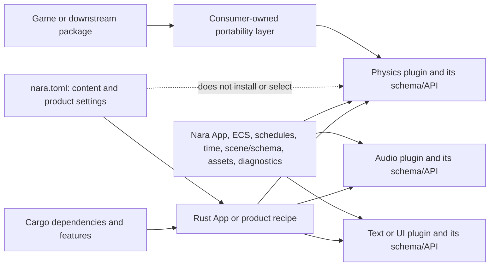

# ADR 0095: Plugin-Owned Specialized Domains and Project Configuration

**Status**: Accepted
**Date**: 2026-07-20
**Supersedes**: [ADR 0019](0019-physics-strategy.md) and
[ADR 0030](0030-audio-strategy.md)
**Refines**: [ADR 0015](0015-editor-tooling-and-dogfooding-boundary.md),
[ADR 0016](0016-extension-seams-for-backends-and-domain-modules.md),
[ADR 0025](0025-runtime-ui-system.md),
[ADR 0029](0029-animation-strategy.md),
[ADR 0031](0031-text-and-font-strategy.md),
[ADR 0035](0035-project-manifest-and-runtime-settings-authority.md),
[ADR 0041](0041-input-routing-actions-text-focus-and-accessibility.md),
[ADR 0042](0042-runtime-service-and-backend-boundary.md),
[ADR 0046](0046-plugin-metadata-and-default-plugin-groups.md),
[ADR 0079](0079-root-product-capabilities-and-placeholder-domain-retirement.md), and
[ADR 0081](0081-schema-source-stable-identity-catalog-and-runtime-binding.md)
**Refined By**:
[ADR 0098](0098-schema-owner-lineage-and-active-runtime-composition.md)

## Context

The first physics design assumed that Nara would own one portable set of body, collider, query, and
contact types while Rapier, Avian, Box2D, and future solvers implemented a common backend Adapter.
The audio design made the same assumption before a playable audio workflow existed. That shape
confused three different goals:

1. a plugin can participate in Nara's App, schedules, persistence, diagnostics, and lifecycle;
2. a plugin can keep native handles and background work out of durable project data; and
3. two independent implementations expose the same authoring and runtime API.

The first two are product substrate. They do not prove the third. Bevy's plugin model permits
Rapier, Avian, and other integrations to remain ordinary plugins with their own components,
resources, schedules, and queries. Their public integration guides expose different domain APIs;
switching integrations is therefore a source and data migration, not a provider setting. Godot
demonstrates the opposite trade-off: global Server
interfaces and project settings can select implementations, but every implementation is constrained
by an engine-owned lowest-common-denominator interface.

Nara is a Rust-native product. Its extension model should preserve direct, strongly typed plugin
APIs and let a first-party integration be opinionated without claiming that unrelated
implementations are interchangeable.

## Decision

Specialized runtime domains are **plugin-owned by default**. Nara standardizes the product substrate
they join, not a universal domain Interface.

### Plugin-Owned Domain Contract

A specialized plugin may own, end to end:

- its semantic ECS components and resources;
- stable schema IDs, codecs, migrations, assets, and authoring helpers for its persistent data;
- public system sets, commands, events, queries, result freshness, and fault semantics;
- solver, mixer, shaper, runtime, native handles, caches, worker threads, and queues; and
- its lifecycle integration, structured diagnostics, and configuration types.

Nara provides the common substrate: `App` and `Plugin`, documented schedule anchors, fixed and frame
time, scene/schema registration, asset identity, bounded task integration, diagnostics, and Host
lifecycle signals. A plugin uses only the parts it needs. A pure ECS plugin is not required to invent
a Service object, backend crate, provider trait, main-thread result queue, or Host contribution.

Native handles, process/function pointers, closures, runtime `Entity`, `AssetId`, or `Handle<T>`
values, Rust/Bevy `TypeId` or `ComponentId` values, OS/Host capabilities, absolute Host paths,
solver world indices, callback/module/native-object tokens, session/worker generations,
broadphase/contact-manifold/cache state, and any other process-local identity remain invalid
persistent project data. Opaque backend blobs are invalid unless a separately owned format defines
a bounded canonical grammar and migrations. This is a persistence and ownership rule, not a
promise that different plugins share component types or serialized schemas. Plugin-specific
durable components are valid when their authoring semantics are stable, bounded, canonical,
versioned, and migration-aware.

Switching plugins never rebinds one stable component ID to unrelated semantics. A project that
changes its physics, audio, text, or other domain implementation performs an explicit cross-schema
conversion, normally as a validated patch with an inverse and user-visible commit. Missing plugin
code may later support lossless degraded authoring under ADR 0090, but Runtime, Play, Cook,
reference traversal, and dependency closure remain fail-closed until the required schema and
bindings are complete.

### No Universal Provider Layer

Nara will not predefine `PhysicsBackend2d`, `AudioBackend`, `TextBackend`, `UiBackend`, a universal
service locator, or an exclusive provider slot merely because multiple libraries exist in a domain.
One production integration is sufficient to ship a plugin-owned API. A second implementation is not
required to validate ordinary plugin participation.

The evidence rule applies only when somebody proposes a Nara-owned portable Interface. Such an
Interface requires all of the following before acceptance:

- at least two production-shaped implementations or one implementation plus a real downstream
  consumer that needs portability;
- a named workflow that benefits from switching without owning the migration itself;
- demonstrated common semantics beyond matching type names; and
- an explicit account of behavior that remains implementation-specific.

Until that evidence exists, any cross-implementation adapter belongs to the game, package, or
consumer that actually needs it. Test fakes prove faults and conformance to one plugin contract; they
do not prove a portable ecosystem contract.

### Coexistence and Conflicts

Two plugins from the same broad domain may be installed together when their types and authority are
disjoint. Nara does not infer a conflict from labels such as `physics` or `audio`. Plugins declare a
conflict only for a concrete collision: the same exclusive Host authority, the same stable plugin or
schema identity, or an explicitly incompatible resource/transform ownership contract.

A `PluginServiceId` is a declarative presence requirement, not a provider registry, exclusive owner
selection, or runtime dispatch table. Specialized plugins must not all claim a generic service such
as `physics2d` unless a separately Accepted shared protocol defines what that presence means.
Concrete dependencies should prefer plugin-specific service IDs or explicit plugin requirements.

Installing two physics plugins does not make simultaneous writes to the same entities coherent. The
game must separate entity membership, choose one writer, or install an explicit bridge and ordering
policy. Automatic dual-write arbitration would be another unproven common Interface.

### Official Defaults and Ecosystem Freedom

Nara may maintain one official plugin for each product need, such as a Rapier integration for the
first 2D physics workflow. A first-party product bundle may include it as an ordinary, inspectable,
optional entry. Users replace it through Rust composition: disable or omit that optional entry, or
start from a recipe that never included it; then add another plugin and migrate source/data as
required. A required bundle entry cannot be presented as replaceable merely because a lower-level
slot API exists.

An official default is a support and workflow promise, not a privileged provider identity. Third-
party plugins use the same public App, schedule, schema, asset, diagnostic, and lifecycle APIs. They
do not require a first-party allowlist or a Nara source edit for ordinary runtime participation.
Exclusive event-loop, native-window, surface/device, filesystem-authority, and similar Host roles
remain explicit because they possess scarce process or native authority; that exception must not be
generalized to ordinary domain logic.

Code-first users still need one coherent top-level official recipe with the same resolved contents
as the file-backed product path. That recipe must be inspectable and editable before commit; it
should not force ordinary authors to assemble window, renderer, retirement, schema, and plugin-plan
internals by hand. A typed package contribution should bind a plugin and its owned schema providers
once, rather than requiring games to maintain parallel plugin-edit and schema-provider lists.

### `nara.toml` Boundary

`nara.toml` remains the settings authority for a file-backed project, but it cannot introduce Rust
code or select an arbitrary plugin/provider by string identity. Code availability and concrete
implementation selection belong to Cargo plus a compiled Rust App/product recipe.

The manifest may request provider-independent product capabilities and settings, such as a windowed
2D presentation, startup scene, fixed-step policy, or task budget. A compiled Rust recipe may map
those semantic requests to a fixed, inspectable plugin group. Specialized plugin configuration
stays in typed Rust initially. A plugin-owned ADR 0051 envelope asset or a namespaced manifest
extension requires a real file-backed consumer plus explicit version, migration, budget, missing-
plugin, and profile-overlay semantics; this ADR does not admit a generic plugin-settings map. Nara
will not grow a global mutable string-to-value settings registry.

Backend-named Cargo features may remain compile-time implementation facts. Backend-named project
capabilities such as `desktop-winit` or `render-wgpu` are transitional and must not become a model
for physics, audio, text, UI, or future domain selection. Before the project capability vocabulary
is stabilized, manifest-visible requirements must converge on semantic product needs or be removed
when the Rust product recipe already provides the complete truth.

### Domain Consequences

| Domain | Nara substrate | Plugin-owned until evidence proves a shared layer |
|---|---|---|
| Physics | Fixed tick, scene/schema, diagnostics, lifecycle | Bodies, colliders, queries, contacts, solver state, authority rules |
| Audio | Asset identity, pause/background signals, diagnostics | Playback, emitters, mixer/bus, decoding, device, spatial semantics |
| Text | Font asset identity, UI measurement/output handshake, Unicode product goals | Shaping, fallback, layout, caches, editable-text behavior, glyph output |
| Animation | Stable persistent identity and schedule anchors | Clip/controller/evaluation model, targets, blending, events, pose caches |
| Runtime UI | Scene/patch identity, tooling-independent product semantics | Layout/widget/style/interaction implementation; no `UiBackend` |
| Input | Normalized platform ingress, focus/capture/IME ownership, gameplay-command boundary | Action-map policy, device policy, UI routing, editor shortcut mapping |
| Editor toolkit | Tooling models/commands, workspace, undo, Play, Host window boundary | Widget rendering, docking presentation, gestures, transient toolkit state |
| Render | Frame/view/target/phase packet and one wgpu execution authority | Feature submitters, batching, pipelines, and GPU caches within ADR 0094 |

Text or animation may eventually justify a first-party domain crate after a real consumer exists.
This ADR removes premature topology and cross-provider promises; it does not reject coherent first-
party modules.

## Alternatives Considered

### Option A: Nara-Owned Portable Interface for Every Specialized Domain

**Pros**: A uniform catalogue and apparently simple provider switching.

**Cons**: Freezes lowest-common-denominator semantics before real workflows, burdens ecosystem
plugins, and falsely implies source/data portability.

**Decision**: Rejected.

### Option B: Plugin-Owned APIs on a Common Product Substrate

**Pros**: Preserves strong typing and library capabilities, matches the existing plugin model, and
allows official defaults without restricting third-party integrations.

**Cons**: Switching implementations requires explicit migration and tooling may need plugin-aware
inspectors.

**Decision**: Chosen.

### Option C: Raw Libraries Without Nara Integration Plugins

**Pros**: No engine abstraction and complete library freedom.

**Cons**: Every game repeats schedule, persistence, lifecycle, diagnostics, and editor integration.

**Decision**: Rejected as the first-party product experience; still valid for expert code-first
embedding.

### Option D: Provider Selection in `nara.toml`

**Pros**: Provider switching appears data-driven and resembles an integrated editor product.

**Cons**: Configuration cannot add Rust code to a binary, duplicates Cargo/composition authority,
and hides the source/data migration that different implementations require.

**Decision**: Rejected.

## Success Metrics

| Metric | Target | Measurement |
|---|---:|---|
| Ordinary plugin freedom | An external plugin adds its own components, resources, sets, schedules, queues, schema, and diagnostics with no Nara source edit | Renamed-dependency clean-room fixture |
| First-party usability | A reference game installs one official specialized plugin through a normal group or tuple and uses only public APIs | Playable desktop/headless tracer |
| Honest replacement | Replacing an official plugin is documented as an explicit source/data migration, never a provider toggle | Documentation and migration review |
| Coexistence | Two plugins in one broad domain can install when IDs and concrete authorities are disjoint | Composition fixture |
| Persistent safety | Plugin-owned project data contains stable schema IDs and no native/runtime handles | Golden fixture and type audit |
| Manifest authority | No `nara.toml` field introduces code or resolves an arbitrary provider; semantic requests map through a compiled recipe | Manifest schema and composition tests |
| Author concept budget | Common code-first setup uses `App`, plugin/group/tuple, typed config, and one fallible add call | Clean-room example review |
| Coherent product entry | Code-first and file-backed paths select the same editable official recipe without backend/prelude internals | Independent example and plan snapshot |
| One package contribution | A schema-owning plugin is added once through a typed helper rather than parallel plugin/schema lists | Clean-room persistent-plugin fixture |

## Risks and Mitigations

| Risk | Severity | Likelihood | Mitigation |
|---|---|---:|---|
| Plugin-specific scenes fragment the asset ecosystem | High | Medium | Publish one well-supported default, namespaced schemas, migrations, and optional conversion tools driven by real demand |
| Two plugins write the same state | High | Medium | Require explicit membership/authority documentation and declare concrete conflicts; do not infer compatibility |
| First-party defaults become de facto privileged | High | Medium | Exercise third-party clean-room fixtures against the same public APIs and avoid ID allowlists |
| Common behavior is duplicated across integrations | Medium | Medium | Extract a library only after repeated code and semantic equivalence are demonstrated |
| Plugin configuration turns `nara.toml` into another extension system | High | Medium | Keep typed Rust config first; admit a file format/namespace only for a concrete consumer with migration and missing-plugin rules |
| Internal composition complexity leaks into gameplay authoring | High | Medium | Keep plans, fingerprints, slots, and Host contributions out of the gameplay prelude and normal examples |

## Consequences

- ADR 0019's engine-owned physics component layer and ADR 0030's preselected audio Adapter shape are
  superseded.
- The first physics and audio integrations should be concrete plugins, not demonstrations of a
  universal provider contract.
- ADR 0016 and ADR 0042 continue to govern persistent/native ownership and lifecycle safety, but no
  longer imply cross-implementation authoring APIs or a mandatory four-layer topology.
- ADR 0046's direct `add_plugins` freedom remains the ordinary direct-App path. The RPR-U3/U4 root
  `ProductRecipe` additionally gives file-backed products one typed replayable configuration path,
  while `SchemaContribution` keeps a schema-owning plugin and its provider definitions together at
  the caller. Stable slots remain bundle editing identities and do not become universal provider
  roles. The reference game and independently locked renamed-root fixture verify this bounded
  compiled-Rust path. They do not admit a package kernel or universal provider model; OQ-045 remains
  open for independently versioned package distribution, file-backed settings, and missing-package
  restoration.
- Existing manifest-visible backend names require a later migration before that vocabulary is
  treated as stable project data.
- Omitting a plugin from one composed recipe changes the composition fingerprint; it is not evidence
  that the plugin owner's durable schema IDs were deleted or tombstoned.

## Citations

- Bevy plugin contract: `repo-ref/bevy/crates/bevy_app/src/plugin.rs`
- Bevy default plugin composition: `repo-ref/bevy/crates/bevy_internal/src/default_plugins.rs`
- Rapier Bevy integration guide: <https://rapier.rs/docs/user_guides/bevy_plugin/getting_started_bevy/>
- Avian Bevy integration: <https://docs.rs/avian2d/latest/avian2d/>
- Godot project settings registry: `repo-ref/godot/core/config/project_settings.h`
- Godot physics server selection: `repo-ref/godot/servers/physics_2d/physics_server_2d.cpp`
- Minimal render exception: [ADR 0094](0094-minimal-render-execution-boundary-and-evidence-gated-extensions.md)
