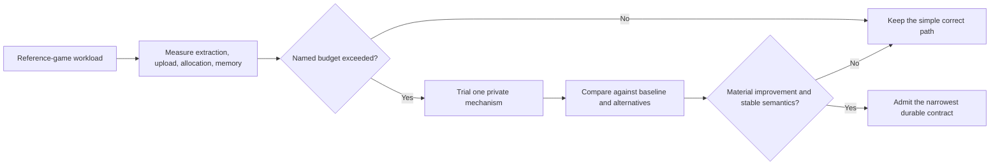

# ADR 0096: Evidence-Gated Render Scaling and Upload Policy

**Status**: Accepted
**Date**: 2026-07-20
**Supersedes**: [ADR 0053](0053-visibility-culling-and-tilemap-render-cache.md)
**Refines**: [ADR 0005](0005-dimension-aware-runtime-with-2d-first-authoring.md),
[ADR 0032](0032-render-backend-integration-boundary.md),
[ADR 0040](0040-render-resource-lifetime-and-submitter-ownership.md),
[ADR 0054](0054-gpu-upload-budget-and-buffer-allocation-policy.md), and
[ADR 0094](0094-minimal-render-execution-boundary-and-evidence-gated-extensions.md)

## Context

ADR 0053 selected dirty tile chunks, a backend-neutral chunk cache, visible-chunk queues, and future
static/dynamic cache paths before Nara had a large-map reference game, multi-view support, or a
measured extraction bottleneck. ADR 0054 correctly assigned GPU uploads and dynamic allocation to
the backend, but it also treated ring/staging buffers, a pending upload queue, and deferral as if
they were already the proven overload policy.

These are plausible mature-renderer techniques. They are not yet product contracts. Committing to
them before measurement creates public vocabulary, invalidation rules, and missing-visual behavior
that may be harder to remove than the current simple implementation.

The same audit found graph-shaped public vocabulary without a usable extension path.
`RenderPassDependency` performs edge/cycle validation, while stock frame capture still owns a fixed
ordered set of private sprite/UI payloads. Open constructors for arbitrary phase labels and pass
plans therefore imply more external composition freedom than the product can execute.

## Decision

Nara accepts the ownership, safety, bounded-work, and observability constraints, while keeping the
scaling mechanism private and evidence-gated.

### Accepted Invariants

- Persistent tilemap, sprite, UI, text, and future mesh data contains no GPU handles.
- `nara_render_wgpu` owns GPU buffers, textures, staging memory, allocation, upload execution, and
  device-epoch invalidation.
- Expensive lowering should avoid known invisible work before allocation or upload when a current
  view and bounds make that decision correct; the exact culling/cache representation is private.
- Per-frame and retained GPU work has explicit admission limits or a measured finite upper bound.
- The backend exposes requested, admitted, completed, rejected or deferred work, allocation churn,
  and failure diagnostics at a cost appropriate to the product profile.
- Device loss invalidates device-dependent work and caches without publishing stale objects under a
  new epoch.
- A correctness-preserving simple path is acceptable until a named workload exceeds an agreed
  frame-time, memory, or upload budget.
- The current `RenderPassPlan` is an engine-owned static ordered plan. Domain plugins may own batch
  data without implying an independently replaceable submitter SPI.

### Deferred Mechanisms

The following are candidates, not current architecture requirements:

- fixed tile chunking or a public chunk identity;
- a backend-neutral tilemap chunk cache or visible-chunk queue;
- separate static and dynamic tilemap cache paths;
- multi-view cache sharing;
- ring buffers, staging belts, arenas, persistent mapped buffers, or per-resource pools;
- a universal pending-upload queue;
- deferral as the default response to every upload-budget overrun; and
- cross-submitter priority or fairness policy.
- public dependency graphs, arbitrary phase construction, or user-authored pass plans without a
  complete capture/encode/target participation path; and
- a generic submitter provider trait where the stock backend currently consumes concrete feature
  batches behind compiled integration code.

A trial may use any of these privately. It does not create an API or compatibility promise.

### Admission Evidence

A scaling change needs a production-shaped tracer with all of the following:

1. a committed workload and target profile, including map/content size, mutation rate, views,
   resolution, adapter class, and build profile;
2. baseline P50/P95/P99 frame, extraction, queue, upload, allocation, and peak-memory measurements;
3. a named threshold or regression that the current simple path violates;
4. at least one simpler alternative, such as bounds culling without retained chunks, contiguous
   instance reuse, or backend-private caching;
5. correctness cases for edits, asset generations, visibility changes, device loss, and shutdown;
6. evidence that diagnostics and bookkeeping do not cost more than the work they explain; and
7. a measured material improvement on the target workload without an unacceptable regression on
   small scenes.

If one backend-private mechanism solves the workload, Nara keeps it private. A backend-neutral
representation requires two real consumers or one unavoidable cross-domain handoff that cannot be
expressed by the existing frame packet and batches.

### Upload Overload Semantics

The owning resource class chooses its correctness policy explicitly. Depending on the resource, an
over-budget frame may retain the last good resource, reject a new resource, skip a presentation
item with a structured reason, perform a bounded controlled overage, or defer work. Nara does not
declare one universal deferral policy before texture, glyph, tilemap, dynamic geometry, and future
3D workloads prove compatible behavior.

Any queue that is introduced must state capacity, producer, consumer, retention, cleanup, stale
generation handling, shutdown behavior, and diagnostics. Allocation technique remains an internal
wgpu-host decision unless a public consumer requires more information than admitted/completed bytes
and outcome status.

## Alternatives Considered

### Option A: Freeze Chunk Caches and Ring Buffers Now

**Pros**: Provides a familiar long-term renderer blueprint and implementation checklist.

**Cons**: Preselects data structures, invalidation, and overload semantics without a measured
bottleneck or second consumer.

**Decision**: Rejected.

### Option B: Keep Only Correctness and Ownership Rules

**Pros**: Smallest API surface and fastest early implementation.

**Cons**: Without explicit evidence gates, performance debt can remain invisible until late.

**Decision**: Rejected as incomplete.

### Option C: Retain Invariants and Require Metric-Driven Admission

**Pros**: Preserves safety and bounded work while allowing the measured workload to choose the
simplest effective mechanism.

**Cons**: Nara cannot claim a mature large-world renderer before producing the evidence.

**Decision**: Chosen.

## Success Metrics

| Metric | Target | Measurement |
|---|---:|---|
| Small-scene simplicity | The current correct path needs no public chunk/cache/upload-planner API | Public API and dependency audit |
| Honest scaling claim | Every cache or allocator contract cites a committed workload, baseline, threshold, and result | ADR and benchmark review |
| Bounded GPU work | Upload/allocation pressure is finite and observable without unbounded queues | Backend tests and runtime status |
| Correct invalidation | Asset generation, view changes, edits, and device epochs cannot reuse stale GPU work | Fault-injection tests |
| Mechanism privacy | One-backend optimizations remain private until a second consumer proves shared vocabulary | API audit |
| Honest pass surface | Public render types expose only phase/order participation that the stock product can execute | External plugin fixture and API audit |
| Regression control | The admitted optimization materially improves the target percentile without unacceptable small-scene cost | Reproducible benchmark artifact |

## Risks and Mitigations

| Risk | Severity | Likelihood | Mitigation |
|---|---|---:|---|
| Optimization is delayed until performance is visibly poor | High | Medium | Add low-cost counters early and define reference-game budgets before the scale slice |
| Benchmarks overfit one map or adapter | High | Medium | Record workload and environment classes and require at least one mutation-heavy and one static case |
| Private caches become accidental contracts | High | Medium | Keep cache types out of public preludes, scene schemas, and plugin declarations |
| Budget overrun produces missing visuals | High | Medium | Make each resource class choose and test explicit last-good/reject/skip/overage/defer semantics |
| Metrics add per-frame overhead | Medium | Medium | Bound cardinality, sample expensive details, and measure diagnostics-off and diagnostics-on profiles |

## Consequences

- ADR 0053's fixed backend-neutral chunk-cache topology is superseded.
- ADR 0054 continues to require backend ownership, finite admission, observability, and epoch-aware
  invalidation; its ring/staging/pending/defer mechanisms are candidate implementations.
- The current all-cell or per-frame allocation paths may remain transitional while they are correct
  and within a documented reference-game budget.
- Graph-like pass dependencies, arbitrary phase/plan constructors, and a submitter SPI should be
  removed or internalized until a complete external feature pass proves them; static stock phase
  ordering remains authoritative.
- A future large-tilemap, text, editor-overlay, or 3D slice may admit a narrower successor after
  measurement; it must not revive the old mechanism solely because it was once documented.

## Citations

- Minimal render execution: [ADR 0094](0094-minimal-render-execution-boundary-and-evidence-gated-extensions.md)
- Render resource lifetime: [ADR 0040](0040-render-resource-lifetime-and-submitter-ownership.md)
- Runtime budgets and privacy: [ADR 0068](0068-global-resource-budgets-metrics-and-diagnostic-privacy.md)
