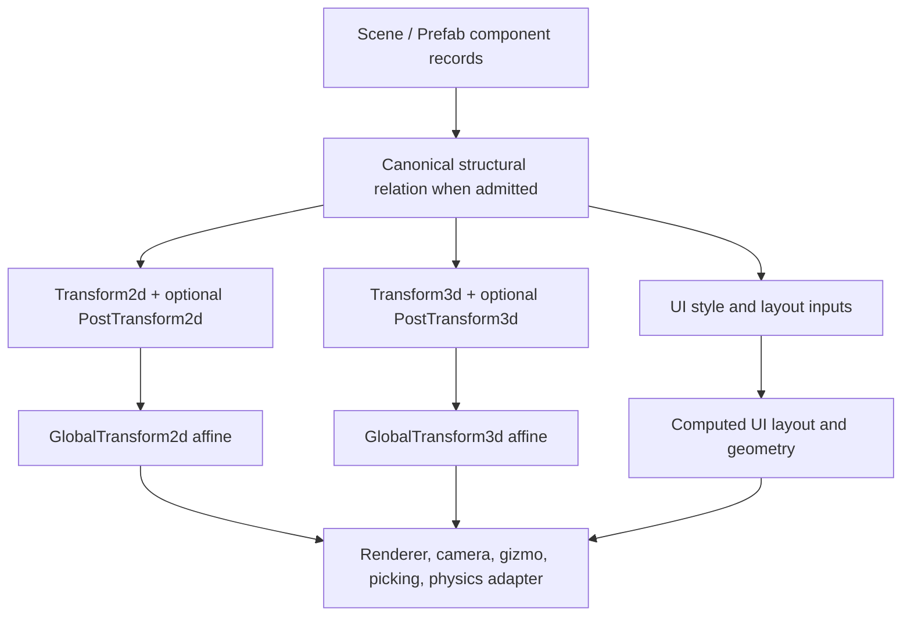

# ADR 0097: Future-Capable 2D and 3D Spatial Transform Model

**Status**: Accepted
**Date**: 2026-07-22
**Refines**: [ADR 0005](0005-dimension-aware-runtime-with-2d-first-authoring.md),
[ADR 0018](0018-coordinate-units-and-time.md), and
[ADR 0022](0022-3d-coordinate-system.md)
**Related**: [ADR 0025](0025-runtime-ui-system.md),
[ADR 0029](0029-animation-strategy.md),
[ADR 0032](0032-render-backend-integration-boundary.md),
[ADR 0033](0033-asset-import-and-render-resource-preparation-seam.md),
[ADR 0038](0038-scene-prefab-authoring-identity-and-provenance.md),
[ADR 0043](0043-scene-prefab-and-patch-document-migration-policy.md),
[ADR 0085](0085-hierarchy-transform-and-visibility-semantics.md) (Proposed),
[ADR 0095](0095-plugin-owned-specialized-domains-and-project-configuration.md), and
[OQ-035](../open-questions.md#oq-035-spatial-world-partition-streaming-and-origin-policy)

## Context

Nara is 2D-first in authoring experience, but its product ceiling includes the complete spatial
workflows users expect from mature 2D and 3D engines: nested transforms, imported DCC node
matrices, skew and shear, pivots, precise editor reparenting, world-space UI, camera/view
extraction, animation, and physics constraints. A simple first-playable sprite workflow must not
make any of those require a new persistent source model later.

The current prototype has only local `Transform2d` TRS data and a `GlobalTransform2d(Mat3)` value
without propagation. Sprite and camera extraction still read local transforms. That is adequate
evidence for neither hierarchy inheritance nor a future 3D contract.

The reference engines establish three useful facts:

- Bevy keeps a simple local TRS `Transform`, derives an affine `GlobalTransform`, and schedules
  propagation explicitly. Its own reparent helper warns that decomposition is invalid for
  degenerate or sheared matrices.
- Godot gives `Node2D`, `Node3D`, and `Control` distinct spatial/layout contracts. `Node2D` has
  skew, `Node3D` retains a full `Transform3D` basis, and `Control` does not retain a complete
  world transform on reparent.
- Unity classic `Transform` demonstrates the ergonomics of local TRS, but its documentation warns
  that non-uniform parent scale plus child rotation creates shear and physics mismatch. Unity
  Entities separates `LocalTransform`, derived `LocalToWorld`, and optional
  `PostTransformMatrix`, applied after the local transform, for non-uniform scale, shear, and
  pivot-relative translation.

Nara must retain a simple 2D-first Rust surface while making exact affine data a deliberate,
typed, persistent capability. It must not solve that requirement by imposing a universal 3D
transform, exposing untyped matrices as normal authoring, or creating a provider layer.

## Decision

Nara adopts **separate 2D and 3D authored transform domains, each with a simple TRS base and an
optional typed post-affine residual**. The pair is one defined local-transform expression, not two
competing authorities. Global transforms are derived affine values only.



### Authoring Domains

- `Transform2d` remains Nara's normal 2D authored local transform: translation `Vec2`, rotation
  in radians, and per-axis scale `Vec2`.
- `Transform3d` is Nara's normal 3D authored local transform: translation `Vec3`, rotation as a
  Nara-owned normalized `UnitQuat`, and per-axis scale `Vec3`. The persistent encoding is finite,
  normalized, and sign-canonical; Euler angles are inspector/gizmo presentation or command input,
  never the durable source of truth.
- `PostTransform2d` and `PostTransform3d` are optional persistent components owned by
  `nara_transform`. Each stores a finite, bounded affine value in Nara-owned fields, not an opaque
  backend or `glam` runtime object. Absent means identity.
- Under Nara's documented column-vector convention, the effective local transform is
  `base_trs_affine * post_affine`. A post-affine residual can therefore represent arbitrary local
  affine skew/shear, pivot-relative translation, DCC matrix import, reflection, or a singular
  visual transform without changing the normal TRS fields.
- The 2D Inspector may expose common post-affine cases as a first-class Skew control. The 3D
  Inspector may expose an advanced Basis/Affine mode. Both are tool presentations over the same
  typed residual; they do not create alternate scene authorities.
- `GlobalTransform2d` and `GlobalTransform3d` are opaque, non-persistent affine value types. They
  offer read-only transformation, inverse-if-valid, and matrix conversion operations; callers do
  not mutate or serialize their backing representation.

`Transform2d` and `Transform3d` are mutually exclusive persistent spatial roles on one entity. A
2.5D game uses the 2D domain plus explicit render layer/sort data. A 3D billboard, 2D surface in a
3D world, or world-space UI uses a concrete feature-owned bridge and one selected spatial domain;
it does not attach both transform domains and rely on implicit conversion.

### Canonical Residual Rules

The residual is part of the durable model, so it has deterministic lowering rules:

1. A source record that is exactly representable as base TRS stores no post-affine component.
2. An importer preserves source TRS when exact. For a source affine matrix that is not exact TRS,
   it emits identity base TRS plus one post-affine residual after validating finite bounded values.
3. An exact world-preserving operation retains an invertible existing base TRS and writes the
   residual needed to realize the new local affine. If the old base is singular, it writes identity
   base TRS plus the exact candidate residual instead.
4. Explicit `BakePostAffineToTrs` is a fallible authoring command. It removes the residual only
   when one engine-owned decomposition and recomposition check proves exact representation within
   the documented tolerance. It never silently approximates.
5. A singular local scale or affine is valid visual authoring data but is not invertible. Operations
   that require an inverse, including exact reparenting through a singular effective parent, return
   a structured error before mutation.

This keeps common source diffs small, preserves authored TRS intent where possible, and still
admits the complete affine space required by mature import and editor workflows.

### Propagation, Freshness, and Hierarchy

The local-to-global rule is always affine composition:

```text
root_global = root_effective_local
child_global = parent_global * child_effective_local
```

`nara_transform` owns 2D and 3D propagation, dirty/cache implementation, finite-value validation,
and named completion barriers. It may share private math or traversal implementation after
measurement, but Nara does not publish a generic `TransformDomain` trait, transform provider, or
shared mutable dirty-cache interface merely because two dimensions exist.

When a canonical structural hierarchy is admitted, a spatial projection crosses a parent only when
the parent participates continuously in that same domain. A missing or incompatible parent is a
domain boundary by default. A structural grouping entity that should carry spatial inheritance must
participate with an identity transform; future flattening, top-level, or cross-domain behavior is a
named concrete rule. No projection silently skips arbitrary ancestors.

Consumers requiring current values join after the owning completion barrier. A cached global is not
an immediate-read promise after arbitrary mutation. Exact authoring transactions may calculate the
affected chain privately against one validated revision, but render extraction, physics, picking,
and ordinary systems consume only the declared completed projection.

### Reparenting and Persistence

The low-level structural operation remains `KeepLocal`: it changes only topology and order.
Higher-level 2D and 3D operations choose a named retention policy:

- `KeepWorldExact` computes `inverse(new_parent_global) * old_global`, materializes or updates the
  post-affine residual as necessary, and commits topology, order, base, and residual only after all
  recoverable checks succeed.
- `KeepWorldTrs` uses the same calculation but rejects any result that would require a residual.
- `KeepLocal` preserves the existing base and residual unchanged.

There is no boolean `worldPositionStays` shortcut and no silent downgrade from exact world
preservation to local preservation. `KeepWorld*` is transient intent: scene/prefab patches persist
only the resulting structural placement and final component values, never the intent, global
matrix, runtime entity, or provider identity.

### Domain Boundaries

- Runtime UI owns layout inputs, anchors, sizing, clipping, interaction geometry, and its derived
  UI-global result. It never becomes a `Transform2d` specialization. World-space UI is a concrete
  Adapter that defines its chosen 2D/3D anchor and camera relation.
- Render features consume the completed global affine for their selected domain. `Camera2d` and
  future `Camera3d` remain distinct authoring components and lower into the shared render `View`.
  Sprite ordering remains explicit render-domain data; 2D does not acquire a hidden Z coordinate.
- Physics remains plugin-owned. A physics plugin explicitly declares which effective transform
  subset each body type accepts. Dynamic bodies initially remain supported roots with identity
  effective scale; post-affine, non-uniform scale, shear, and parented solver writeback require a
  concrete fixed-tick contract rather than an automatic transform sync.
- Future animation writes base transform fields through its plugin-owned target/evaluation model.
  Post-affine animation requires an explicit track/interpolation contract; generic reflection-based
  field animation is not admitted by this ADR.
- Asset import converts external coordinate conventions under ADR 0022, preserves exact affine
  node data through the residual when needed, and never places backend/GPU handles in a transform.

### Crate and Extension Boundaries

`nara_transform` remains one deep Module for the shared transform contract and may organize
implementation as `two_d` and `three_d` submodules. It does not need separate dimension crates,
a generic cross-dimension Interface, or a transform backend registry. `nara_hierarchy`, when
admitted, owns only structural facts; `nara_scene` owns persistent documents and patches;
`nara_tooling` compiles user intent; render, UI, physics, animation, and import domains consume or
adapt the selected transform domain.

Third-party plugins may own additional spatial semantics, but they either use Nara's concrete
2D/3D components or own a separate named domain and bridge. They do not register a replacement
implementation for `Transform2d`, `Transform3d`, or a universal affine provider.

## Alternatives Considered

### Option A: One Universal 3D Transform for Every Entity

**Pros**: Familiar Unity-like surface and one propagation implementation.

**Cons**: Assigns false spatial meaning to data/tooling entities, burdens 2D users with quaternion
and Z vocabulary, and collapses UI layout into world-space semantics.

**Decision**: Rejected. It contradicts ADR 0005's dimension-aware authoring model.

### Option B: Keep TRS-Only Local Transforms and Reject All Shear

**Pros**: Smallest schemas, straightforward inspector, simple physics rules.

**Cons**: Loses DCC affine matrices, makes precise reparenting fail under ordinary non-uniform
hierarchies, and cannot reach Godot/Unity-class spatial workflows without a later format break.

**Decision**: Rejected. Strict TRS remains an explicit operation mode, not the engine ceiling.

### Option C: Persist Full Raw Matrices for All Local Transforms

**Pros**: Directly represents every affine result, including singular matrices.

**Cons**: Makes ordinary authoring and animation matrix-oriented, obscures translation/rotation/
scale intent, and exposes a shallow numerical surface to every user.

**Decision**: Rejected. Full affine remains available only as a typed residual.

### Option D: Separate 2D and 3D TRS Bases with Optional Typed Post-Affine Residuals

**Pros**: Preserves simple common authoring, supports exact affine import/reparenting, keeps UI
separate, and provides an explicit contract for physics and animation restrictions.

**Cons**: Adds schema, codec, editor-mode, migration, and residual-normalization complexity.

**Decision**: Chosen.

## Success Metrics

| Metric | Target | Measurement |
|---|---:|---|
| Normal authoring simplicity | A normal 2D or 3D entity serializes only base TRS and requires no matrix vocabulary | Scene/prefab golden fixtures and public API review |
| Affine completeness | A validated imported 2D/3D affine matrix, including shear and pivot translation, round-trips through base plus residual without material loss | Import and serialization fixtures |
| Exact reparenting | A non-singular reparent preserves the selected world affine exactly or fails before mutation with a structured reason | Hierarchy/transform transaction fixtures |
| Explicit strictness | `KeepWorldTrs` rejects a residual-requiring result; no operation silently approximates or downgrades policy | Reparent matrix tests |
| Domain isolation | UI, 2D, 3D, physics, and render features cannot infer cross-domain inheritance or mutate another domain's local authority | Plugin and schedule integration tests |
| Freshness honesty | A declared fresh consumer never sees an old global after the owning completion barrier | Schedule-barrier fixtures |
| Physics safety | Unsupported scale/shear/parenting combinations fail at the physics domain boundary rather than producing an implied valid body | Concrete physics-plugin tracer |

## Risks and Mitigations

| Risk | Severity | Likelihood | Mitigation |
|---|---|---:|---|
| Base plus residual confuses authors | High | Medium | Hide residual in normal Inspector mode; expose Skew/Basis tools with clear state and explicit Bake command. |
| Equivalent decompositions cause diff churn | High | Medium | Preserve an existing invertible base during edits; use identity-base fallback and deterministic encoder rules. |
| Full affine leaks into physics implicitly | Critical | Medium | Physics plugins declare accepted subsets; dynamic bodies remain restricted until a fixed-tick tracer proves more. |
| Global cache becomes stale | High | Medium | Named propagation barriers and exact private calculation for transactions; never describe global cache as immediate truth. |
| Matrix-heavy feature work over-engineers the first game | Medium | Medium | The residual is a durable data contract; its propagation, importer, Inspector, and animation mechanisms ship only with concrete tracers. |
| Cross-domain bridges become a universal framework | Medium | Medium | Admit only concrete feature-owned bridges; reject a generic bridge/provider Interface without two real consumers. |

## Consequences

- The current `Transform2d`-only schema and local-only extraction are transitional prototype
  evidence, not the durable spatial ceiling.
- A future implementation adds `PostTransform2d`, `Transform3d`, `PostTransform3d`, opaque global
  affine wrappers, codecs, migrations, propagation barriers, and domain-specific editor tooling as
  one or more active-plan units. This ADR does not authorize those code changes today.
- Because Nara is pre-1.0, implementation replaces the prototype source shape canonically rather
  than retaining aliases or compatibility wrappers. The implementing unit owns source/fixture
  rewrites and a migration-guide entry; runtime loading never silently rewrites project files.
- ADR 0085's proposed hierarchy work must use this representation for `KeepWorld` and may not
  retain a TRS-only non-representability rule. ADR 0085 still independently controls whether and
  how Nara admits the canonical structural relation.
- OQ-035 remains the owner of origin shifting, large-world partitioning, and cross-region spatial
  policy. This ADR chooses neither double precision nor streaming topology.

## Citations

- Nara baseline: `crates/nara_transform/src/lib.rs`, `crates/nara_scene/src/hierarchy.rs`,
  `crates/nara_render/src/lib.rs`, and `crates/nara_sprite_render/src/extract.rs`
- Nara hierarchy proposal: [ADR 0085](0085-hierarchy-transform-and-visibility-semantics.md)
- Bevy reference: `repo-ref/bevy/crates/bevy_transform/src/components/transform.rs`,
  `repo-ref/bevy/crates/bevy_transform/src/components/global_transform.rs`, and
  `repo-ref/bevy/crates/bevy_transform/src/plugins.rs`
- Godot reference: `repo-ref/godot/scene/2d/node_2d.cpp`,
  `repo-ref/godot/scene/3d/node_3d.cpp`, and `repo-ref/godot/scene/gui/control.cpp`
- Unity classic transforms: [Transform manual](https://docs.unity3d.com/6000.0/Documentation/Manual/class-Transform.html)
- Unity Entities transform model: [Transform concepts](https://docs.unity3d.com/Packages/com.unity.entities@1.3/manual/transforms-concepts.html)
