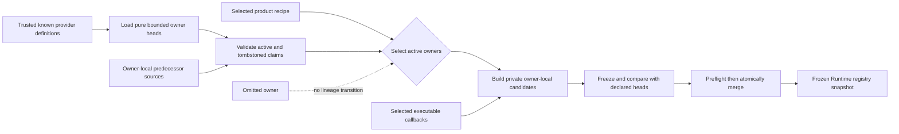

# ADR 0098: Schema Owner Lineage and Active Runtime Composition

**Status**: Accepted
**Date**: 2026-07-27
**Last Revised**: 2026-07-27
**Owner**: `nara_reflect`, schema-owning plugins, and product composition
**Refines**: [ADR 0081](0081-schema-source-stable-identity-catalog-and-runtime-binding.md) and
[ADR 0095](0095-plugin-owned-specialized-domains-and-project-configuration.md)
**Admission Evidence**: RGD-U11 independently reviewed the owner-local lineage, failure-atomic
registration, known-owner claim, and typed-fingerprint design without a remaining P0/P1 finding.
**Implementation Evidence Required**: A reference-product tracer must still prove optional owner
disable and reactivation, real owner-local deletion and migration, known cross-owner collision
rejection, one-shot provider execution, failure atomicity, and complete-binding Runtime publication.
**Related**: ADR 0011, ADR 0035, ADR 0045, ADR 0046, ADR 0051, ADR 0079, ADR 0090, and OQ-044

## Context

`ComponentSchemaCatalog` currently carries one generation and predecessor for the complete set of
components registered into a `ComponentRegistry`. Its lineage validator interprets every active
type that disappears from the next catalog as a deletion and requires a tombstone.

That rule is correct for one schema owner publishing a successor. It is incorrect for a product
recipe that changes its selected plugin set. Given owners A and B, the sequence `A+B -> A -> A+B`
cannot be represented as one global lineage: the middle composition either tombstones B or fails,
and the final composition then appears to reactivate a deleted type. An optional plugin's absence
has been confused with its owner's durable deletion decision.

ADR 0081 and ADR 0095 already require owner lineage to remain distinct from one product
composition, but they do not select the minimum record or predecessor authority. The correction
must preserve Nara's strict Runtime boundary: every active schema still needs its executable
binding, codec, and migration chain before a registry snapshot is published. It must not introduce
ADR 0090's still-Proposed degraded authoring model as a side effect.

The current canonical `component_schema_catalog` files also contain no owner identity. Assigning an
owner from a component ID prefix, Rust type path, or the product recipe would create a new implicit
persistent identity. Conversely, designing a package lock, signed descriptor, or owner-aware file
envelope before one package workflow exists would freeze more product surface than this correction
requires.

## Decision

Nara separates **owner-local schema lineage** from **active Runtime composition**.

### Stable Owner Identity

`nara_reflect` owns a bounded, validated `ComponentSchemaOwnerId`. It is persistent semantic
identity and is distinct from all of the following:

- `PluginSchemaProviderId`, which identifies one compiled registration policy;
- `ComponentSchemaProviderBindingId`, which identifies executable binding, codec, and migration
  behavior;
- `PluginId`, which identifies one runtime plugin declaration; and
- future package installation, source, version, signature, or lock identities.

The initial implementation requires exactly one active provider definition for one owner in a
composition. The two identities remain separate types and fingerprints so a later evidence-backed
package or Adapter design can change their cardinality without reinterpreting durable owner
identity.

An owner ID is explicit. Nara never derives it from a component ID prefix, alias, Rust path,
provider ID, plugin ID, Cargo package name, or recipe position.

### Owner-Local Head and Predecessor Authority

`ComponentSchemaOwnerRecord` is a narrow `{ owner_id, catalog }` wrapper. It does not copy the
catalog generation, predecessor, schemas, or tombstones into a second authority. The existing
`ComponentSchemaCatalog` remains the sole semantic source for those values.

`ComponentSchemaOwnerFingerprint` hashes the owner ID plus the existing `CatalogFingerprint`.
Generation and predecessor do not enter either content fingerprint. The existing
`CatalogFingerprint` algorithm and wire meaning do not change: an owner-local source catalog still
uses it for its predecessor field.

A stable `ComponentSchemaOwnerContributionReceipt` covers the owner ID, current generation,
current catalog fingerprint, optional immediate-predecessor fingerprint, and owner fingerprint.
Provider-definition deduplication, Runtime snapshots, and product plans compare this receipt in
addition to provider and binding receipts. Loader function addresses are never identity.

A predecessor is supplied by the schema owner through trusted compiled provider metadata or an
explicitly loaded owner source catalog; it is never inferred from the previous product recipe or
Runtime snapshot.

Every trusted `ComponentSchemaProviderDefinition` exposes a deterministic, bounded current-head
source and may expose one deterministic, bounded immediate-predecessor source. Product composition
loads these sources before executing native registration callbacks. A source may decode compile-
time embedded bytes, but its contract forbids `World` or registry access, filesystem or network
I/O, mutable global state, and owner derivation from the selected recipe.

This is a Host-trusted Rust-code contract backed by review and tests, not a sandbox guarantee
provided by a function-pointer type. Loading an inactive head executes that narrow source function;
it does not execute the provider's executable registration callback, codec, or migration. A future
untrusted package path requires a Nara-owned bounded descriptor decoder. The current head is
therefore available even when the provider is not selected, so the product can reserve all active
and tombstoned type claims known to the compiled recipe.

For this first slice, the existing `ComponentSchemaCatalog` remains the bounded source shape used
inside an owner record. Its generation and predecessor are interpreted only against the same
explicit owner. An existing `component_schema_catalog` file is eligible only when its schema owner
explicitly declares it to be a single-owner source and pairs it with one explicit owner ID. A
flattened product or Runtime composition catalog cannot be converted into an owner record, even by
a trusted Rust caller, because that wire contains no owner-attribution proof.

Owner-lineage admission validates the declared immediate predecessor against the current head. It
does not claim a historical catalog DAG or arbitrary-old-version support. Runtime migration
validation separately proves every migration step actually admitted by the current owner source
and its immediate predecessor; broader retained-history support requires a later evidence-backed
source contract.

No new owner-aware persistent wire envelope is admitted by this ADR. Package lock provenance,
last-known owner descriptors, source trust, owner transfer, and an on-disk owner catalog remain
under OQ-044, ADR 0090, and a future package tracer. A future format must use a new kind or version
and must not infer owner attribution while migrating current files.

### Scoped Provider Registration

A `ComponentSchemaProviderDefinition` declares its owner, current-head source, optional immediate
predecessor source, validation policy, and executable registration callback. Registration follows
one failure-atomic path:

1. load and validate the declared owner head and predecessor before native mutation;
2. validate active and tombstoned claims from every trusted known provider definition, including
   definitions not selected by the current recipe;
3. deduplicate definitions whose provider ID, binding receipt, and owner-contribution receipt are
   all equal, then reject more than one distinct definition for an owner in the trusted-known set;
4. reject any active or tombstoned `ComponentTypeId` claimed by different known owners;
5. execute each selected callback exactly once against a new private owner-local
   `ComponentRegistry` candidate that cannot inspect foreign owner schemas;
6. freeze that candidate, validate owner-local lineage and its complete binding, codec, reflected
   type, and migration behavior, then compare its semantic catalog exactly with the declared
   current head;
7. preflight every owner, type, Rust binding, and provider-receipt collision against the aggregate
   registry; and
8. move the already-validated candidate into the aggregate through an infallible merge.

Two definitions with the same provider ID and binding receipt are duplicates only when their stable
owner-contribution receipts also match. A different owner, head, generation, or predecessor is a
conflict rather than an entry that product composition may silently deduplicate.

The aggregate registry is never the callback target. A returned error or unwind drops the private
candidate and preserves every observable aggregate fact: registry state and instance token,
catalog, owner/provider receipts, all four fingerprint domains, and binding, migration, reflected-
type, and index key sets. Under `panic = "abort"` there is no continuing process to publish partial
state. Cross-owner requirements are validated by product composition after all selected owner
candidates are known, not by granting a callback read access to another owner's registry.

Provider callbacks are not replayed to build a second catalog. The declared source supplies
semantic admission, while the single callback supplies the executable candidate that must match
it. This keeps inactive-owner claim validation deterministic and side-effect-free by contract and
makes active registration atomic.

The existing whole-catalog successor helpers are a single-owner source-validation mechanism only.
Product composition must not pass a previous composed Runtime catalog to them. Public helpers that
make the invalid global-lineage interpretation likely are removed or narrowed before this ADR is
implemented.

### Active Runtime Composition

Product composition first validates claims from every trusted known provider definition. This
prevents an active owner from claiming a type that belongs to a compiled but currently omitted
owner. It does not claim installation-wide uniqueness against packages or providers unknown to the
process; that requires future package-lock provenance.

Each Runtime composition then selects only the owner heads required by its resolved plugin plan.
Omitting an owner:

- does not create a successor;
- does not create a tombstone;
- does not mutate or supersede that owner's last head; and
- does not place an inactive placeholder or optional binding in the Runtime registry.

Re-enabling an owner selects the same validated head or a descendant validated against that
owner's own predecessor. It does not compare the owner with an intervening recipe from which it
was absent.

Four fingerprint domains remain distinct:

- `CatalogFingerprint` retains its existing algorithm and identifies the canonical content of one
  source catalog. Existing predecessor fields continue to use it unchanged.
- `ComponentSchemaOwnerFingerprint` hashes one explicit owner ID with that owner's catalog
  fingerprint.
- `SchemaCompositionFingerprint` hashes the canonical selected owner-ID order and each selected
  owner fingerprint. Scene, Prefab, and `ProjectContentSnapshot` compatibility use this
  World-independent semantic identity.
- `ExecutableRegistryFingerprint` hashes the schema-composition fingerprint plus canonical
  selected provider and binding receipts. It proves executable-behavior equivalence only.

Provider input order therefore affects neither typed fingerprint. Changing owner attribution
changes the schema-composition fingerprint even when flattened component bytes match. Changing
only binding, codec, reflected-type, or migration behavior preserves semantic identity but changes
the executable fingerprint.

The frozen `ComponentRegistrySnapshot` contains only active schemas and complete executable
bindings. Missing provider code, native binding, codec, or migration rejects Runtime, Play, and
Cook before `World` mutation. A document containing a component from an omitted owner continues to
fail closed under the current unknown-component path.

Fingerprints prove canonical equivalence, not shared authority. Within one file-backed Host,
`RuntimePlan`, Editor authoring, and candidate `World` continue to require pointer identity with
the same `ComponentRegistrySnapshot`. Independently constructed direct-App and file-backed
registries may have equal semantic and executable fingerprints while retaining distinct snapshot
instances.

Runtime-plan and publication evidence binds the canonical owner-contribution receipts together
with `ExecutableRegistryFingerprint`; the executable fingerprint alone does not prove the reviewed
generation or predecessor lineage. No fingerprint tuple replaces pointer identity inside one
managed Host.

### Readiness Boundary

This ADR does not admit `KnownUnbound`, `UnknownSchema`, placeholder ECS components, optional
runtime bindings, lossless degraded save, generic unavailable-schema Inspector UI, or a Package
Manager. Those remain Proposed under ADR 0090 and OQ-044.

The only publishable Runtime readiness state in this slice is complete. Owner receipts describe
lineage provenance; they do not make unavailable component records executable or editable.

## Alternatives Considered

### Option A: Keep One Global Catalog Predecessor

Rejected. It cannot distinguish recipe omission from owner deletion, serializes independent owner
upgrades into one artificial history, and makes `A+B -> A -> A+B` either impossible or dependent on
special-case resurrection rules that weaken tombstone non-reuse.

### Option B: Retain Inactive Schemas with Optional Runtime Bindings

Rejected. It would mix authoring recovery state into the executable registry, force every Runtime
consumer to handle optional codecs and bindings, and prematurely implement part of ADR 0090.
Runtime publication remains a complete-binding boundary.

### Option C: Freeze an Owner-Aware Package Catalog and Lock Format Now

Deferred. A durable format will eventually need owner identity, source and lock provenance,
upgrade trust, unavailable-owner recovery, and migration rules. The current correction has no real
package installation or missing-provider authoring tracer that can prove those fields. Freezing an
envelope now would turn guessed package semantics into compatibility debt.

### Option D: Use Provider ID as Durable Owner Identity

Rejected as a persistent contract. It is acceptable for current first-party values to use the same
validated text for both identities, but the types and hash domains remain separate. Provider
behavior can change or split without transferring persistent schema ownership.

## Consequences

- Optional owner enablement becomes ordinary product composition rather than a schema deletion
  event.
- Tombstone and migration checks gain locality: one owner changes without advancing unrelated
  owners.
- Runtime registry construction gains owner-scoped bookkeeping and collision validation, but no
  per-frame state, ECS query, dynamic component wrapper, or additional Runtime branch.
- Provider definitions gain one stable owner declaration, one deterministic current-head source,
  and, only for successors, one deterministic predecessor source.
- Definition equivalence gains a stable owner-contribution receipt; source function addresses do
  not participate.
- The active semantic and executable fingerprints become separate typed values. Exact managed
  authority continues to use snapshot pointer identity.
- `ProjectContentSnapshot` carries `SchemaCompositionFingerprint` and no longer publishes one
  composed `schema_generation`; independent owner generations cannot be represented truthfully by
  that scalar.
- Existing source catalogs remain usable when paired with an explicit owner. They do not become a
  general package format.
- OQ-044 remains open for persisted owner descriptors and unavailable-schema readiness; this ADR
  closes only the Runtime-safe owner-lineage correction required by RGD-U11.

## Success Metrics

- A public regression proves `A+B -> A -> A+B` without tombstones and with the first and final
  active composition fingerprints equal.
- A real deletion inside B still fails without a tombstone, and a tombstoned type or field cannot
  be reactivated.
- A schema version increase without a complete owner-local migration chain fails before snapshot
  publication.
- Two owners claiming the same active or tombstoned type ID fail before publication.
- A known but inactive owner still reserves its active and tombstoned type claims without executing
  its callback; another owner cannot claim either form.
- A callback that registers a schema, binding, and migration before returning an error or unwinding
  preserves the aggregate registry state/token, catalogs, receipts, fingerprints, and all binding,
  migration, reflected-type, and index key sets; a structural test proves the callback never
  receives the aggregate.
- Completely equal definition receipts deduplicate before callback execution; two distinct
  definitions for one owner reject before any selected callback.
- Provider input order changes neither typed fingerprint; changing owner attribution changes the
  semantic fingerprint, while changing only executable receipts changes only the executable
  fingerprint.
- Direct App and file-backed product composition execute each provider callback once and publish
  equal canonical owner receipts, provider receipts, schema-composition fingerprints, and
  executable-registry fingerprints. Their independently built snapshots retain distinct pointer
  identity; each file-backed plan, Editor, and candidate set separately proves shared pointer
  identity within its Host.
- An omitted owner's component in a Scene or Prefab rejects before target `World` mutation.
- Public API and dependency tests prove that no ADR 0090 readiness or placeholder type was added.
- Registry construction remains linear apart from existing canonical ordering, with no runtime
  frame or steady-state memory cost beyond immutable owner receipts.

## Risks and Mitigations

| Risk | Impact | Mitigation |
|---|---|---|
| A provider callback partially mutates the aggregate before failure | Registry admission ceases to be atomic | Never expose the aggregate to callbacks; fully freeze and validate a private owner candidate, preflight every merge collision, then move it through an infallible merge; verify observable aggregate facts and the callback interface |
| Provider identity is accidentally treated as owner identity | Later provider refactoring becomes a persistent data migration | Use separate types and hash domains; require an explicit owner declaration |
| Semantic and executable identity are conflated | Different codec or migration behavior can reuse a semantic cache key | Use distinct typed fingerprints and retain pointer identity for exact managed authority |
| Existing composed fingerprints change | Cached content or evidence may appear compatible when it is not | Treat the correction as a pre-1.0 identity break, invalidate affected U2/U7/U8-U10 evidence, and compare the appropriate typed fingerprint |
| A malformed predecessor source panics or partially mutates composition | Product admission becomes non-atomic | Load and validate the predecessor before provider mutation and convert failure into a typed composition rejection |
| The in-memory record is mistaken for a package lock | Trust, missing-package, or upgrade behavior is overstated | Document that no owner-aware wire is admitted and keep package provenance under OQ-044 |
| Owner-scoped bookkeeping becomes a generic provider framework | Public complexity grows without a consumer | Keep one concrete schema-registration path, no provider registry, no trait, and one active provider per owner in this slice |
| An active owner claims a compiled but inactive owner's type | Reactivation fails only after product publication | Load pure current heads for every trusted known definition and reject the collision before executing selected callbacks |
| An unknown external package owns a conflicting ID | The collision remains invisible until that package is introduced | State the compiled-known scope honestly and require project/package lock provenance before claiming installation-wide exclusion |
| A trusted head source violates its deterministic/no-I/O contract | Inactive claim discovery can block or gain side effects | Keep the function narrow, decode only bounded embedded data, catch source failure before callbacks, and require a future Nara-owned decoder for untrusted package descriptors |
