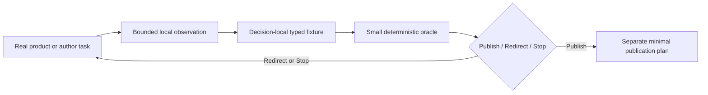

# ADR 0099: Decision-Local Product Evidence and Publication Admission

**Status**: Accepted
**Date**: 2026-08-01
**Owner**: Product measurement owners and release operations
**Refines**: ADR 0048, ADR 0049, ADR 0068
**Admission Evidence**: RGD-U9 produced a reproducible `Redirect` while the unused evidence-ingest,
approval, and release closure grew larger than the product code it was intended to evaluate.
**Implemented Slice**: RPR-U2

## Context

ADR 0048, ADR 0049, and ADR 0068 correctly separate runtime diagnostics, untrusted project input,
and domain-owned resource budgets. RGF-U22 extended those decisions with a test-only generic
offline evidence envelope, source-revision admission, cohort ownership, provenance review, and a
trusted-publication model.

The reference game later proved that this implementation was the wrong product boundary. Its U9
collector and committed raw samples were sufficient to reproduce a product `Redirect`. The later
ingest, normalized approval, custom release verifier, and release workflow had no admitted evidence
population and could not establish that the game was playable or pleasant to author. Maintaining
that machinery would make the reference game own a second delivery product before Nara has one
ordinary Rust author workflow.

The correction must not weaken runtime diagnostic privacy or file-backed project input budgets. It
must only remove the assumption that every bounded product observation needs one reusable evidence
transport and publication protocol.

## Decision

Product evidence is decision-local until a real `Publish` result admits a publication workflow.

- Runtime diagnostics and pressure remain bounded typed runtime resources under ADR 0048 and ADR
  0068. Offline product observations never write back into those resources or influence gameplay
  admission.
- A product slice may commit a bounded typed fixture and a small deterministic oracle for the exact
  decision it changes. The fixture owns only the fields, aggregation, and retention needed by that
  decision.
- A collector may verify its own bounded local transport and source identity. Repository history,
  the reviewed fixture, and the decision record are sufficient for a pre-publication baseline;
  there is no reusable normalized-evidence envelope, ownership cohort, approval language, or
  trusted-publication API.
- ADR 0049 applies to an actual reader of untrusted external bytes. A future network fetch,
  third-party upload, archive extractor, or release evidence ingester must define and test its own
  byte, shape, path, and publication budgets when that reader is admitted. A historical Git fixture
  does not keep an otherwise unused generic ingester alive.
- `Publish` is the only outcome that may activate a separate publication plan. That successor may
  use platform-native artifacts, protected environments, tags, and Releases, but it cannot treat
  mutable repository text as authorization or restore a general self-attestation framework without
  new evidence.
- The exact U9 collector source remains available at its recorded Git revision. Its metric catalog,
  raw population, aggregation rule, and verdict remain historical product evidence in the active
  tree; the executable collector and its process/transport harness do not remain active maintenance
  obligations or become a reusable benchmark service.

## Alternatives Considered

### Option 1: Decision-local fixtures and deferred publication design

Selected. It preserves reproducibility where a current product decision needs it while keeping
measurement and release machinery proportional to the product evidence available.

### Option 2: Retain the generic RGF-U22 envelope and complete U11/U12

Rejected. The generic boundary had no production consumer, duplicated platform controls, and could
become internally consistent without supplying the missing desktop and author-workflow evidence.

### Option 3: Remove all structured product evidence

Rejected. Raw observations still need bounded parsing, deterministic aggregation, explicit missing
values, and a reviewable decision. The correction removes reuse and publication infrastructure, not
honest measurement.

## Consequences

- The RGF-U22 generic envelope, revision/cohort framework, schemas, fixtures, and policy tests are
  removed from the active repository surface.
- U9's recorded verdict remains reproducible through its catalog, committed JSONL, and compact Rust
  oracle. The original experiment remains reproducible from its recorded Git revision, while
  historical verification shards remain immutable.
- Future product slices add observations at the domain or author task that owns the fact. Missing
  observations remain missing rather than admitting shared telemetry infrastructure.
- A future publication workflow must be newly justified by a complete current-revision `Publish`
  population and external control-plane requirements.

## Success Metrics

| Metric | Target | Measurement |
|---|---|---|
| Active generic evidence APIs | 0 | Repository search outside immutable history and superseded plans |
| U9 verdict reproducibility | 1 deterministic `Redirect` | Focused `measurement_policy` test |
| Retained candidate product checks | Windows and Linux package plus no-checkout smoke | Candidate workflow and artifact policy tests |
| Publication before product admission | 0 workflows | Repository workflow inventory |

## Risks and Mitigations

| Risk | Severity | Likelihood | Mitigation |
|---|---|---|---|
| A later release lacks adequate input hardening | High | Medium | Admit the concrete external reader first, then apply ADR 0049 budgets to its exact bytes and paths. |
| Decision-local tests duplicate aggregation code | Medium | Low | Keep each oracle small; extract shared code only after two current production decisions require identical semantics. |
| Historical protocol references deleted implementation paths | Low | High | Treat the frozen catalog as historical bytes; current authority and verification point to the compact oracle and this refinement. |
| A `Publish` result silently restores the old framework | High | Low | Require a separate active plan and explicit architecture review before any publication workflow exists. |
