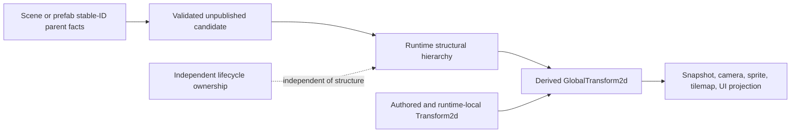

# ADR 0100: Runtime Structural Hierarchy and Completed 2D Transform Projection

**Status**: Accepted
**Date**: 2026-08-01
**Owner**: Runtime hierarchy, 2D transform projection, and consuming product hosts
**Related**: ADR 0005, ADR 0006, and ADR 0018
**Refines**: The current 2D completion slice of
[ADR 0097](0097-future-capable-2d-3d-spatial-transform-model.md)
**Extracted From**: [ADR 0085](0085-hierarchy-transform-and-visibility-semantics.md), which
remains Proposed for persistent order, reparent authoring, visibility, prefab provenance, UI
projection details, physics, and 3D
**Implementation Plan**:
[Reference-Game 2D Spatial Authority and Hierarchy Closure](../../plans/2026-08-01-002-refactor-reference-game-2d-spatial-authority-plan.md),
RGS-U2 through RGS-U5

## Context

Nara's current prototype places runtime `Parent` and mutable `Children` data in `nara_scene`,
rebuilds the reverse collection by scanning the World, and defines `GlobalTransform2d` without a
propagation owner. Sprite, tilemap, and camera extraction therefore read local transforms. The
reference game also duplicates spatial authority between gameplay components and `Transform2d`.

This is already a correctness and dependency problem for the current 2D product. It does not
require Nara to accept the much broader persistent-order, visibility, editor reparent, physics, or
3D model proposed by ADR 0085. The durable boundary can be fixed now while the exact Rust API and
future authoring semantics remain provisional.

## Decision

Nara owns one runtime structural hierarchy Module, separate from scene documents and transform
math, and one completed 2D local-to-global projection.

- Runtime structure belongs to a dedicated deep Module outside `nara_scene`, `nara_transform`, UI,
  render, and tooling. The active implementation plan places it in `nara_hierarchy`; this decision
  freezes the ownership boundary, not public identifier spelling or prelude placement.
- The runtime relation uses Nara-defined components over the `bevy_ecs` relationship substrate.
  The forward parent relation is authoritative. The reverse child collection is relationship-
  maintained derived state and is not an independent ordinary-author mutation surface.
- The relation does not opt into linked spawn or linked clone behavior. Structural ancestry does
  not grant despawn, Scene Instance membership, runtime-session ownership, UI layout, visibility,
  persistence, or prefab-provenance authority.
- Scene and prefab stable-ID parent facts are validated and lowered into the runtime relation before
  candidate publication. Runtime relation state never writes topology back into a document or
  advances a saved revision.
- `Transform2d` is the only authored and runtime-local 2D spatial authority. `GlobalTransform2d` is
  runtime-only derived state produced by the transform Module from a continuous 2D transform chain.
- Consumers that require current world-space data run only after a named semantic completion
  boundary. They do not independently walk parent chains or silently fall back to local or identity
  transforms.
- Nara-owned construction and replacement paths validate the supported topology generation before
  derived publication. Raw relationship insertion, reverse-collection mutation, change-detection
  bypass, and unchecked World mutation through the public Bevy substrate remain advanced escape
  hatches outside Nara's hierarchy-correctness guarantee.
- Structural ancestry never defines a retirement closure. Existing lifecycle owners must adapt
  their owned teardown paths to the relationship hooks and continue retiring only their explicit
  memberships. This ADR does not accept a scene-session, scene-travel, candidate-initialization,
  or runtime-derived-entity ownership API.

This ADR does not accept a public runtime move/reparent API, deterministic sibling order,
`KeepWorld`, visibility inheritance, UI tree semantics, prefab ownership transfer, recursive
destruction, physics synchronization, 3D transforms, post-affine authoring mechanisms, or a generic
hierarchy/provider abstraction. Those decisions remain evidence-gated.

## Alternatives Considered

### Option 1: Keep runtime hierarchy in `nara_scene`

Rejected. It keeps scene-document ownership coupled to runtime structure and prevents
`nara_transform` from consuming hierarchy without a Cargo dependency cycle.

### Option 2: Use Bevy's built-in linked child hierarchy directly

Rejected. Its linked lifecycle behavior would make structural ancestry an implicit destruction and
cloning policy, conflicting with Nara's explicit lifecycle ownership.

### Option 3: Keep local-only extraction and let each consumer walk ancestors

Rejected. Consumers would disagree about freshness and domain boundaries, repeat work, and expose
partially updated frame data.

### Option 4: Use a Nara-owned non-linked relation plus a completed 2D projection

Selected. It fixes the current dependency and product correctness problem while leaving future
authoring and 3D decisions open.

## Consequences

- `nara_scene` continues to own persistent documents, prefab expansion, patches, and one-way
  materialization, but no longer owns the runtime relation implementation.
- The hierarchy Module owns structural facts and validation only; transform, UI, render, identity,
  and lifecycle domains consume them without transferring authority.
- `nara_transform` owns propagation and completion of the 2D global projection. Render and snapshot
  consumers migrate from local transforms to completed globals.
- The current full-scan child rebuild, independently mutable child collection, scene transform
  re-export, and reference-game position-copy path are transitional code to remove without
  compatibility aliases.
- Concrete construction writers, schedule-set names, generation counters, traversal storage, and
  ordinary/advanced/private API placement remain provisional until the reference-game workflow has
  exercised them.

## Success Metrics

| Metric | Target | Measurement |
|---|---:|---|
| Runtime hierarchy authority | One forward authority and one derived reverse projection | Hierarchy relation and public-surface tests |
| Lifecycle separation | Parent loss detaches children; current Scene Instance replacement retires exact membership and never hierarchy closure | Scene replacement/unload fixtures |
| Publication atomicity | Invalid stable-ID topology publishes no partial runtime instance | Scene/prefab hostile fixtures |
| 2D projection correctness | Nested globals equal ordered affine composition before every declared fresh consumer | Transform and extraction tests |
| Static-frame cost | No hierarchy scan or transform traversal when the supported generations are unchanged | Focused visit-count instrumentation |
| Product proof | One authored reference-game child follows its parent across headless, desktop, and editor paths | Reference-game product tests and bounded manual journey |

## Risks and Mitigations

| Risk | Severity | Likelihood | Mitigation |
|---|---|---:|---|
| Structural hierarchy becomes an implicit lifetime owner | Critical | Medium | Use a non-linked relation and require existing lifecycle owners to retire only their explicit memberships. Do not infer or accept a session API here. |
| Advanced ECS mutation bypasses validation or dirty tracking | High | High | State the substrate limit honestly; prohibit bypasses in first-party paths; fail supported dirty generations before derived publication. |
| Global transforms are stale at startup, pause, or extraction | High | Medium | Provide bootstrap, frame, and pre-extraction completion points with a named freshness boundary. |
| The first implementation freezes an unnecessary public API | High | Medium | Keep API names and placement provisional and classify them only after the product journey. |
| The slice expands into the full ADR 0085 design | High | Medium | Keep ordering, reparenting, visibility, prefab transfer, UI details, physics, and 3D explicitly Proposed. |
