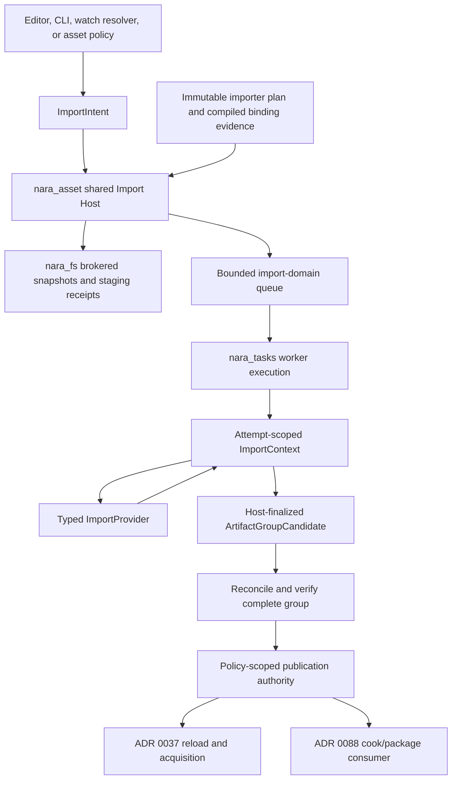

# Asset Import Host Interface Design

**Status**: Design Draft

**Created**: 2026-07-13

**Last Updated**: 2026-07-13

**Owner**: `nara_asset`, importer-owning domains, concrete authoring Hosts, `nara_tasks`, and `nara_fs`

**Authority**: Non-normative Interface design. Accepted ADRs remain authoritative on conflict.

**Upstream Designs**: [Source Extension Package Interface Design](source-extension-package-interface-design.md), [Multi-Role Extension Package Tracer Interface Design](multi-role-extension-package-tracer-design.md), [Extension Contract Kernel Interface Design](extension-contract-kernel-interface-design.md)

**Concept Guide**: [Extension Package Concept Guide](extension-package-concept-guide.md)

**Related ADRs**: [0007](adr/0007-asset-identity-and-import-pipeline.md), [0033](adr/0033-asset-import-and-render-resource-preparation-seam.md), [0037](adr/0037-asset-load-request-cache-and-lifetime-policy.md), [0049](adr/0049-untrusted-project-input-and-parse-budget-policy.md), [0050](adr/0050-asset-root-symlink-junction-and-package-trust-policy.md), [0052](adr/0052-task-backpressure-cancellation-and-long-running-diagnostics.md), [0068](adr/0068-global-resource-budgets-metrics-and-diagnostic-privacy.md), [0070](adr/0070-capability-oriented-filesystem-substrate.md), [0080](adr/0080-domain-owned-task-update-integration-sets.md), [0083](adr/0083-durable-project-asset-and-document-entity-identity.md), [0087](adr/0087-asset-dependency-import-product-and-artifact-publication-graph.md), [0091](adr/0091-editor-persistence-recovery-and-concurrent-writer-policy.md)

**Research Context**: [Extension Ecosystem Research](../knowledge/engineering/extension-ecosystem-engine-research.md)

## Purpose

This document narrows the package tracer to the shared asset Import Host Interface. The Host is a
deep `nara_asset` Module that selects a compiled importer, supplies immutable tracked inputs,
collects bounded multi-product outputs, rejects stale or invalid work, and publishes one old-or-new
artifact group under an explicit cooperative or strict writer policy while preserving the previous
last-good group on failure.

The design serves two audiences with different Interfaces:

- importer authors implement one typed provider method and use a narrow `ImportContext`;
- editor, CLI, file-watch, and asset Modules request, cancel, and inspect import attempts without
  seeing task queues, filesystem capabilities, staging handles, or publication internals.

The exact Rust names are illustrative. ADR 0087 is Proposed, so this document does not claim that
artifact-group format, product reconciliation, or publication semantics are implemented or stable.

## Decision Summary

The recommended long-term flow is:

```text
ImportIntent
    -> immutable importer-plan selection
    -> last-good recipe probe
    -> bounded domain queue and nara_tasks dispatch
    -> typed provider with tracked ImportContext
    -> Host-finalized ArtifactGroupCandidate
    -> complete-set reconciliation and verification
    -> staged immutable members and manifest
    -> policy-scoped writer authority plus exact atomic replace receipts
    -> runtime reload/acquisition notification
```

The key ownership choice is that an importer does not construct a free-standing candidate and
cannot publish. It writes products and declares dependencies only through an attempt-scoped
context. After the provider physically returns, the Host seals the context, joins its observation
ledger and staged-member receipts, privately constructs the candidate, verifies it, and publishes
or retires it.

This gives ordinary importer authors a Bevy/Unity-like small surface while retaining Nara's stable
product identity, bounded task lifecycle, capability-aware filesystem path, and old-or-new atomic
publication requirements.

## Evidence Labels

| Label | Meaning in this document |
|---|---|
| Implemented | Current source and tests directly prove the behavior |
| Settled, pending | An Accepted ADR fixes the direction, but the complete shared Host is absent |
| Proposed | ADR 0087 or this document still requires tracer and fault-injection evidence |

### Current Ground Truth

| Area | Evidence | Limitation exposed by this design |
|---|---|---|
| Stable asset UUID and current metadata lookup | Implemented in `nara_asset` | Current `AssetMeta` still duplicates path authority and is transitional |
| ADR 0083 metadata and product identity authority | Proposed, not started | Final `.meta` authority shape, durable product IDs, and full reconciliation are absent |
| Importer metadata and registry | Implemented in `crates/nara_asset/src/import.rs` | Registry stores live erased single-output importers and treats extension selection too narrowly |
| Artifact and dependency digests | Implemented in `crates/nara_asset/src/artifact.rs` | One aggregate dependency digest is not the exact typed observation graph required by ADR 0087 |
| Typed image import | Implemented in `nara_image` | `ImageImporter` is directly constructed in jobs; the typed provider is not the catalog execution path |
| Task backpressure and terminal handles | Settled and substantially implemented under ADR 0052 | Import-domain priority, generation, last-good, and publication do not belong in `nara_tasks` |
| Asset task integration stages | Settled and implemented in part under ADR 0080 | `nara_image` still owns a private spawn/poll/apply pipeline |
| Filesystem authority | Settled, pending under ADR 0070 | Image reload jobs still call `std::fs::read` directly |
| Multi-product graph and atomic artifact groups | Proposed by ADR 0087 | Tracked reads, stable product reconciliation, exact invalidation, and crash-safe group publication are not implemented |
| Shared Import Host | Proposed here | No common provider/context/candidate/publication Module exists |

The current image path is useful pressure evidence, not an Interface to copy into every asset
domain.

## Problem

The current import path spreads one domain transaction across several owners:

- `ImporterRegistry` stores `Box<dyn Importer>` for a single artifact-record result;
- `TypedImporter<T>` is useful in tests but is not the object stored in that registry;
- `nara_image` directly constructs `ImageImporter`, reads the filesystem, submits task closures,
  captures ready jobs, orders integration, applies results, and records last-good behavior;
- each new asset type could therefore copy filesystem, task, generation, stale-result, queue,
  diagnostic, and publication policy.

This is a shallow product seam. Deleting a shared Import Host would redistribute hundreds of lines
of lifecycle logic into image, audio, font, model, animation, and future third-party importers.

The opposite design is also unsafe. A broad context containing `AssetServer`, raw paths,
`DirectoryCapability`, `TaskPools`, editor workspace, process creation, and publication methods
would make importer code easy to demo but impossible to plan, isolate, audit, or reproduce.

## Mature-Engine Crosswalk

These comparisons introduce the Nara terms and state where each analogy ends.

| Nara concept | Bevy comparison | Godot comparison | Unity comparison | Unreal comparison | Deliberate Nara difference |
|---|---|---|---|---|---|
| `ImportProvider` | Typed `AssetLoader` with associated asset/settings/error types | `ResourceImporter` / `EditorImportPlugin` | `ScriptedImporter` | Interchange translator/provider | It produces backend-neutral imported products for an authoring cache, not runtime handles, editor objects, or native packages |
| `ImportContext` | `LoadContext` tracked loader dependencies and labeled assets | Import callback plus generated-file/dependency lists | `AssetImportContext` dependency and object collection | Interchange source/pipeline context | It exposes no raw filesystem path, `AssetServer`, object database, editor workspace, or publish operation; every supported observation is tracked automatically |
| `ImportedProductId` | Labeled sub-asset handle is the nearest partial analogy | Resource UID and generated resource entries are partial analogies | Asset GUID plus local file ID | Object/package identity inside imported assets | Nara uses an opaque durable product ID; label, name, index, and content hash are display or reconciliation evidence only |
| `ArtifactGroupCandidate` | A completed `LoadedAsset` plus labeled assets is a partial analogy | Importer's output files before cache registration | All objects submitted during one `OnImportAsset` call | One Interchange import result | The Host constructs it from tracked observations and staged receipts, then verifies the complete set before publication |
| Atomic group publication | Bevy processor transaction log is partial prior art | Import cache update | Asset Database import commit | DDC/package publication is partial prior art | One publication authority composes an exact Host lock receipt with the unmodified filesystem replace receipt and states its cooperative or strict scope |
| Import attempt snapshot | Asset load state and events | Editor import status | Asset Database progress and errors | Interchange async task status | Availability and latest-attempt outcome are separate axes so a failed reimport can retain a usable last-good group |

Bevy offers the closest typed Rust author experience. Unity offers the closest context-owned
multi-object import transaction and stable sub-object identity pressure. Godot demonstrates useful
format version, option, priority, order, and threading metadata, but its raw source/save paths and
loosely owned generated files are not copied. Unreal Interchange proves that large DCC pipelines
may eventually need translator, policy, and factory stages; imposing that hierarchy on every small
format now would create a shallow, ceremony-heavy Interface.

## Module And Dependency Shape



Dependency classification:

| Dependency | Category | Treatment |
|---|---|---|
| Selection, recipe, graph, reconciliation, generation, stale checks, last-good, publication state | In-process | Hidden inside the `nara_asset` deep Module |
| `nara_tasks` | In-process execution substrate | Use bounded spawn, cancellation, first terminal, ordered integration, and shutdown; do not add asset policy to tasks |
| `nara_fs` and local artifact store | Local-substitutable | Exercise real Host-issued temporary capabilities and receipts in tests; do not expose a public filesystem port solely for mocking |
| `ImportProvider` | Real extension seam after Image plus the tracer use it | Typed public author Interface with private erasure in a concrete Adapter |
| Future child-process importer | Remote-but-owned | Define a protocol port only when a real isolated Adapter exists; do not freeze wire bytes now |
| Decoder library | Provider-private in-process dependency | Domain owns decode behavior and typed errors |

## Recommended Interfaces

### 1. Import Contribution And Compiled Binding

Importer ID, supported extensions, settings schema, semantic version, output product constraints,
Host/target applicability, and required isolation are declared in the package's data-only import
contribution. The provider must not repeat them in `descriptor()`.

A package binds the declaration to Rust once:

```rust
package.add(nara_asset::extension::threaded_importer(
    generated::SPRITE_ANIMATION_IMPORTER,
    SpriteAnimationImporter::new,
)?)?;
```

The helper stores a repeatable factory and type-specific error mapping without invoking the
provider. Final contract resolution verifies the declaration, implementation digest, executable
generation, and placement evidence before the Import Host receives an immutable catalog plan.

An extension only produces importer candidates. A stable `.meta` selection or explicit pure plan
chooses the final `ImporterId`. "Last registered wins" and extension-as-global-unique-slot are not
supported replacement policies.

### 2. Typed Provider

```rust
pub trait ImportProvider: 'static {
    type Settings: ImportSettings;
    type Error: 'static;

    fn import(
        &self,
        context: &mut ImportContext<'_>,
        settings: &Self::Settings,
    ) -> Result<(), Self::Error>;
}
```

The base trait does not require `Send + Sync`. The threaded binding helper requires appropriate
bounds on the provider, settings, error, and factory. A future Host-local binding may accept an
affine provider without wrapping `!Send` state in a mutex and pretending it is thread-safe.

The first Interface is synchronous and runs inside a bounded `nara_tasks` closure. This matches the
current execution substrate and keeps async runtime or process IPC choices out of importer
semantics. A future remote Adapter may implement asynchronous transport behind the Host without
changing the provider's semantic transcript.

`type Error` remains domain-owned. The binding helper receives or derives an explicit mapping into
`ImportProviderFailure`. That mapping produces stable engine/domain codes, static summaries, and
classified fields. It must not lower arbitrary `Display`, `Debug`, panic payloads, paths, URLs, or
environment values into diagnostics.

### 3. Narrow Tracked Context

The initial context surface should remain concrete and domain-specific:

```rust
impl ImportContext<'_> {
    pub fn source(&self) -> ImportSource<'_>;
    pub fn limits(&self) -> ImportLimits;

    pub fn read_source(
        &mut self,
        request: SourceReadRequest,
    ) -> Result<TrackedSourceInput, ImportContextError>;

    pub fn read_optional_source(
        &mut self,
        request: SourceReadRequest,
    ) -> Result<TrackedOptionalSourceInput, ImportContextError>;

    pub fn read_product<T: ImportProductView>(
        &mut self,
        request: ProductReadRequest<T>,
    ) -> Result<TrackedProductInput<T>, ImportContextError>;

    pub fn query_project_sources(
        &mut self,
        request: ProjectSourceQuery,
    ) -> Result<TrackedSourceSet, ImportContextError>;

    pub fn set_primary<T: ImportProduct>(
        &mut self,
        value: T,
    ) -> Result<ProductDraftRef<T>, ImportContextError>;

    pub fn add_product<T: ImportProduct>(
        &mut self,
        continuity: ProductContinuityClaim,
        value: T,
    ) -> Result<ProductDraftRef<T>, ImportContextError>;

    pub fn begin_product(
        &mut self,
        spec: ProductMemberSpec,
    ) -> Result<ArtifactMemberWriter<'_>, ImportContextError>;

    pub fn declare_dependency(
        &mut self,
        edge: ProductDependencyDraft,
    ) -> Result<(), ImportContextError>;

    pub fn warning(
        &mut self,
        diagnostic: ImportDiagnostic,
    ) -> Result<(), ImportContextError>;

    pub fn checkpoint(&self) -> Result<(), ImportContextError>;
}
```

The exact method count may shrink after the tracer, but the authority shape must not widen.

The context exposes immutable source/product identity, bounded readers or typed product views,
content digests, canonical settings/profile/target facts, effective limits, cancellation, and
attempt-scoped output writers. It does not expose:

- `Path`, `PathBuf`, raw cache paths, raw save paths, or ambient `std::fs` access;
- `DirectoryCapability`, OS handles, `AssetServer`, `World`, `App`, or editor workspace;
- task pools, thread creation, process creation, environment iteration, or wall-clock policy;
- arbitrary global asset lookup, `Any`, a service locator, or a publish/commit method.

The primary source is already an immutable snapshot. Every secondary source/product read records
identity, role, exact snapshot/digest, and absence where relevant. A bounded project-source query
operates only on an immutable committed source-index snapshot and records its membership result.
It is not native directory enumeration. Handle-bound filesystem enumeration remains unavailable
until ADR 0070's reserved U11 primitive provides capability-scoped evidence; `nara_asset` and
providers must not reproduce it with ambient path APIs. Negative observations matter: adding a
previously missing sidecar must invalidate an importer that tested for that sidecar.

The context keeps a sticky first fault. If provider code ignores a cancellation, budget, writer,
or tracked-read error, Host finalization still rejects the attempt.

### 4. Progressive Author Ergonomics

The common surface is intentionally layered:

| Importer kind | Concepts required |
|---|---|
| Single product | Provider, typed settings/error, `source()`, `set_primary()` |
| Reads another source/product | Add `read_source()` or typed `read_product()`; successful and missing reads track automatically |
| Multi-product | Add `add_product()` with continuity evidence and product dependency drafts |
| Large output | Add `begin_product()` for an attempt-scoped streaming writer |
| Advanced discovery | Add bounded committed source-index queries, target/tool inputs, explicit checkpoints, and classified warnings |

This keeps a PNG-like importer near Bevy's loader ergonomics without forcing every author to learn
an Unreal-style multi-stage DCC pipeline.

### 5. Product Identity And Reconciliation

The Interface keeps these values distinct:

| Value | Owner and meaning |
|---|---|
| `StableAssetId` | Durable source asset identity owned by `nara_asset` |
| `ImportedProductId` | Durable opaque product identity scoped to one source; `Primary` is reserved |
| `AssetProductRef` | Durable source plus product reference used by project data |
| `ProductContinuityClaim` | Provider-supplied evidence used to reconcile one new output to prior identity |
| Label/name/index | Mutable display or source-order projection only |
| Content digest | Immutable member identity/integrity only |

Useful continuity evidence includes a stable source-embedded UUID or a canonical semantic origin
key. The Host compares the complete new set with the previous last-good product catalog:

- rename and reorder preserve `ImportedProductId` when continuity is unambiguous;
- new products receive new opaque IDs;
- removed products disappear from the new group and their IDs are never silently reused;
- duplicate claims, multiple possible matches, nil/invalid IDs, or attempted retargeting reject the
  complete candidate or require a separate explicit remap transaction.

Product labels and content hashes never become durable references.

### 6. Output Collection And Streaming

`set_primary` and `add_product` are typed conveniences over Host-owned product staging. They use
registered artifact codecs and enforce output schema, count, and byte limits. `begin_product`
supports formats whose encoded output should not be duplicated in memory.

An `ArtifactMemberWriter` is attempt-scoped and revocable. Each write checks remaining budget and
attempt liveness, updates the digest, and targets a Host-issued staging sink. It does not reveal the
sink path or filesystem capability. On logical cancellation or timeout, the Host closes staging
ingress; a non-cooperative closure may continue running, but further wrapper writes fail and its
late result can never finalize or publish.

New named disk staging is admitted only when the filesystem/storage Adapter can prove the required
temporary ownership and reclamation contract. ADR 0070 currently cannot safely unlink a named Unix
temporary by handle and cannot enumerate the directory through U11 after restart. Therefore Unix
named disk staging remains disabled until U29, an unnamed temporary primitive, or a storage design
with proven whole-generation reclamation and crash-recovery indexing is admitted. Content-addressed
naming alone is not reclamation proof.

Until that evidence exists, the Host uses bounded memory staging or fails closed before creating a
disk name. A recoverable orphan left by an older implementation or injected platform failure is an
exceptional degraded state, not an admission alternative: preserve every known receipt/byte in
durable pressure accounting, block further named staging, and report that complete rediscovery or
safe deletion is unproven. "Bounded quarantine" may stop new work; it must not claim unsupported
reclamation or a complete post-crash orphan inventory.

The first small tracer may implement typed products with bounded in-memory buffers. That is an
implementation strategy, not a public contract. The Interface must permit streaming before model,
audio, or video-sized artifacts make a `Vec<u8>` return shape expensive to remove.

### 7. Host-Finalized Candidate

The provider returns `Result<(), E>`, not a freely constructible `ArtifactGroupCandidate`. Only
after the task closure physically returns does the Host seal the context and privately construct a
candidate containing at least:

```text
attempt ID and import slot generation
source snapshot and expected source version receipt
selected importer, compiled binding, and implementation digests
canonical settings, profile, execution target, and subject target facts
complete tracked observation ledger, including negative/query observations
complete product continuity claims and dependency drafts
opaque staged-member receipts and measured budgets
```

The candidate has no public constructor and no `publish`, `commit`, or raw-member mutation method.
It is an inactive proposal. The Host validates the complete product set, graph, recipe, staged
members, schemas, counts, digests, expected versions, and publication budget before constructing an
immutable manifest.

### 8. Dependency Edge Semantics

ADR 0087's four edge meanings remain separate:

| Edge | Meaning |
|---|---|
| Import input | Bytes, product value, metadata, absence, or query membership observed to produce this group |
| Runtime required | Product must resolve before the referring product becomes ready at runtime |
| Runtime soft | Optional/addressable runtime reference that does not force acquisition |
| Build-only | Required for cook/package but not mounted as a runtime dependency |

`read_source` and `read_product` automatically create import-input observations. Runtime and build
edges are declared per output product and validated against stable product refs. The Interface must
not overload one `role` argument to mean both "the importer read this" and "the runtime must load
this".

Cycles, depth, fan-out, query membership, product count, input/output bytes, strings, diagnostics,
time, and task count are bounded before publication.

### 9. Recipe Probe And Exact Invalidation

The first cache strategy should resemble a depfile probe rather than expose a provider-level delta
trait:

1. Compare the importer implementation digest, exact settings, profile/target facts, primary source
   digest, output schema, and tool inputs.
2. If that static prefix matches, reacquire and compare every tracked source/product/absence/query
   receipt from the previous successful manifest.
3. If every observation matches, return a cache hit without invoking the provider.
4. If any input changed, rerun the provider and replace the prior observation ledger with the new
   complete ledger.
5. Reuse identical immutable members by content digest internally, but still publish the artifact
   group as one complete manifest.

An implementation or settings change must rediscover dependencies; the Host cannot blindly reuse
an old closure because the provider may now observe different inputs. Reverse-reachable graph
invalidation rebuilds only affected groups.

### 10. Request, Cancel, And Inspection Interface

Callers should not drive task plumbing directly. A concrete Host-facing Module may expose only:

```rust
impl ImportHost {
    pub fn request(
        &mut self,
        intent: ImportIntent,
    ) -> Result<ImportAttemptId, ImportRequestError>;

    pub fn cancel(
        &mut self,
        attempt: ImportAttemptId,
    ) -> ImportCancelDisposition;

    pub fn attempt(
        &self,
        attempt: ImportAttemptId,
    ) -> ImportAttemptLookup<'_>;
}
```

The exact public owner may ultimately be `AssetServer` or an authoring service facade rather than a
named `ImportHost`. The durable point is that callers request semantic work and inspect stable
attempt facts. They do not call public `spawn`, `poll`, `apply`, `publish`, or queue methods.

Private schedule integration remains in
`AssetTaskUpdateSet::{Poll, ResolveSourceChanges, SpawnJobs, ApplyResults}` and preserves ADR 0080's
entry-snapshot and same-frame eligible integration rules.

The first admitted execution route is threaded. A future affine route must keep its provider
registry on the owning lane and exchange only Send-safe route tickets and terminal/physical-exit
receipts with the ECS schedule Adapter. Its mailbox poll must capture the same entry snapshot and
obey the same cancellation, stale, and integration rules as the threaded route. Until a real
affine provider proves that conformance, the local binding helper remains reserved rather than a
nominal option in the public catalog.

### 11. Attempt State, Logical Terminal, Physical Retirement, And Availability

One overloaded state cannot represent both a visible import outcome and whether native execution
has physically released its leases. The public/diagnostic snapshot therefore keeps four axes:

```text
ArtifactAvailability
    Unavailable
    Available(active ArtifactGroupGeneration)

AttemptPhase
    Queued
    AcquiringInputs
    Running
    Verifying
    Staging
    Publishing

AttemptTerminal
    None
    Published
    Unchanged
    Failed
    Cancelled
    TimedOut
    Superseded
    Rejected
    Panicked

PhysicalRetirementState
    NoExecutionLease
    ExecutionLeaseOutstanding
    Exited(PhysicalExitReceipt)
    DetachedUnproven
```

A failed first import remains unavailable. A failed reimport reports a failed latest attempt while
the previous active group remains available. Tooling and server diagnostics must be able to show
both facts without interpreting one overloaded `LoadState::Failed` value. A logical terminal never
overwrites the physical-retirement axis: an attempt may be `Cancelled + ExecutionLeaseOutstanding`
until its closure actually exits.

### 12. Queue, Coalescing, And Generation

`nara_asset` owns a bounded domain queue and obtains dispatch credit before submitting work to
`nara_tasks`. Priority is Host policy, not provider self-promotion. A small fixed vocabulary such as
startup-required, interactive, foreground, and background may be evaluated by the tracer with
weighted fairness and aging.

An import slot is keyed by source, profile/target, and selected importer route. Each slot uses a
monotonic generation:

- compatible pending requests coalesce to the newest committed immutable input snapshot and merge
  reasons;
- a running request receives cooperative cancellation but cannot be physically coalesced;
- its successor receives a new generation immediately;
- every terminal result is checked against attempt, source, slot, catalog, and active-manifest
  generations before verification or publication;
- incomparable project snapshots do not coalesce merely because one event arrived later.

`nara_tasks` continues to own worker bounds, pending-only coalescing mechanics, panic isolation,
cancellation tokens, first terminal handles, finite shutdown, and the test-only inline driver. It
does not gain import priority, recipe, retry, product, generation, or last-good policy.

### 13. Cancellation, Timeout, And Physical Retirement

Cancellation is cooperative. A logical timeout or supersession closes context/staging ingress,
marks the attempt unable to publish, and requests token cancellation. A non-cooperative in-process
closure may continue until it returns; its physical resources remain budgeted, its provider/catalog
lease cannot retire, and every late result is discarded.

The Import Host wraps each accepted execution closure in a domain-owned physical-exit guard. The
outer wrapper creates the guard before materializing the attempt resource bundle, so Rust's reverse
drop order releases the provider, context backend, writers, and Nara-owned closure resources before
the guard sends one `PhysicalExitReceipt` through an independent Host channel. It may send only
after normal return, or after unwinding and every protected destructor complete normally; the guard
and delivery path themselves must not panic. An ADR 0052 task-handle terminal is only a logical
first terminal and is never physical-exit proof. Pool-wide `running` statistics likewise cannot
release one attempt's authority.

A destructor panic during an existing unwind aborts the process, and `panic=abort` never unwinds.
Neither path produces `PhysicalExitReceipt`; persistent staging is handled only by admitted
process-crash recovery after restart. The Interface never turns process termination into an
in-process cleanup receipt.

The receipt proves release of Nara-owned attempt resources only. Trusted provider code that uses
ambient Rust authority to spawn untracked threads or retain external work violates the provider
contract and is not made safe or observable by this receipt; enforced containment requires a later
isolated process Adapter.

Task admission or coalescing may provide typed evidence that a closure was discarded before it
received an execution lease; only then may the Host use `NoExecutionLease`. Otherwise accepted
queued, running, and detached work remains `ExecutionLeaseOutstanding`. If shutdown detaches a
worker and no exit receipt arrives, the attempt becomes `DetachedUnproven`; its staging, provider,
catalog/cohort, and conflicting authority remain retained and budgeted until process termination or
later proof.

Current `nara_tasks` does not provide a general per-task timeout contract. The Import Host must not
smuggle a business-specific timeout into the task substrate or claim that native code has been
forcibly stopped. A future isolated process Adapter may add kill/reap evidence, but it is a separate
placement contract.

### 14. Verification, Staging, And Publication

One concrete authoring Host owns an `ArtifactPublicationAuthority` per project artifact root. All
Nara Editor and CLI writers either route through that authority or participate in the exact same
writer-lock protocol. The authority admits one of two honest policies:

| Publication policy | Guarantee |
|---|---|
| Cooperative project mode | Serializes participating Nara writers under one continuously held exclusive lock; a non-cooperating external writer is outside the guarantee |
| Strict external-race-safe mode | Requires `StrongCompareAndSwap` or a separately proven platform-enforced root publication authority that excludes every competing writer for the whole transaction |

The first local design may use cooperative project mode for an engine-owned trusted artifact root.
It composes a Host writer-lock receipt with the original `nara_fs::ReplaceReceipt`; it never rewrites
the replace receipt's `DetectOnly` conflict protection as `CooperativeLocked` or strong CAS. A
non-cooperating external mutation may be detected before or after replacement but can win the
check-to-replace race. Strict mode therefore fails closed while conflict protection or exclusive
root authority is unsupported or unproven.

The composite publication proof preserves every independent ADR 0070 axis:

| Evidence axis | Cooperative project mode | Strict external-race-safe mode |
|---|---|---|
| `ResolutionTier` | Exact admitted tier; `CooperativeTrusted` may be policy-accepted | `HandleBound` or another explicitly proven strict tier |
| Parent authorization | Exact `ParentAuthorizationTier` from the replace receipt | `HandleBound` or equivalent strict proof |
| Replace source binding | Exact `ReplaceSourceBinding`, including `NameBound` when that is all the platform proves | `HandleBound` or a separately admitted equivalent |
| Publication identity | Exact `PublicationIdentityEvidence` from the replace receipt | Handle-bound candidate identity or an admitted equivalent |
| Publication atomicity | `AtomicNameSwitch` | `AtomicNameSwitch` |
| Filesystem conflict protection | Preserve the exact value, including current `DetectOnly` | `StrongCompareAndSwap`, unless separate root-exclusion evidence supplies the strict conflict guarantee |
| Host writer lock | Exclusive mode plus exact `LockGuarantee`, `LockScope`, authority owner, acquisition generation, and release ownership | Platform-enforced root-exclusion receipt if used instead of strong CAS; advisory cooperation alone is insufficient |
| Domain expected state | Source, slot, active generation, parent capability generation, and candidate digest guard | Same; this remains domain stale protection, not filesystem CAS |
| Durability progress | Exact data, metadata, name, and parent-directory stages | Same, with every stage required by the claimed power-loss guarantee |

Within the admitted writer model, a complete old-or-new claim after a process crash requires the
atomic name switch plus the applicable conflict proof. A stronger durable-after-power-loss claim
additionally requires the corresponding data, metadata, name, and parent-directory sync receipts;
the Host reports that guarantee as unsupported or unknown when the platform cannot prove it.

Publication follows this order:

1. Provider closure returns and the context seals successfully.
2. Host verifies the complete observation ledger, products, identities, edges, schemas, budgets,
   implementation evidence, and all expected generations.
3. Artifact members finish immutable staging and produce digest/durability receipts through
   `nara_fs`.
4. Host writes and verifies one immutable ADR 0051 artifact-group manifest.
5. The publication authority verifies its still-held domain generation and writer authority,
   performs one atomic replacement, and retains the unmodified Host lock plus `nara_fs` replace
   receipts.
6. Runtime reload and cook consumers observe the newly active immutable group.
7. Old manifests and members retire later through bounded reachability/quarantine policy.

Every failure, panic, cancellation, timeout, stale result, supersession, missing member, digest
mismatch, reconciliation ambiguity, sync failure, writer-lease conflict, or replace-proof failure
before step 5 publishes nothing and preserves the old active group. Under the admitted writer
policy and guarantees above, reopening after any process-crash point observes a complete old or
complete new group.

If the canonical new manifest equals the active manifest, the Host may return `Unchanged` and avoid
creating a meaningless reload generation. That result has its own observation receipt; it does not
pretend that an atomic replacement occurred.

### 15. Publication Receipt

A successful public outcome may expose a stable summary such as:

```rust
pub enum ArtifactGroupPublicationOutcome {
    Published(ArtifactGroupPublicationReceipt),
    Unchanged(ArtifactGroupUnchangedReceipt),
}
```

`ArtifactGroupPublicationReceipt` records source/product group identity, recipe and manifest
digests, old/new active generation facts, the selected cooperative/strict policy, the Host lock
receipt, the unmodified `nara_fs::ReplaceReceipt` axes, and durability progress.

`ArtifactGroupUnchangedReceipt` instead proves the expected active generation and canonical
manifest were revalidated as equivalent while the applicable publication authority remained held.
It records no new generation, replace receipt, or replacement durability progress. Cooperative mode
still excludes only participating writers. Strict mode may skip replacement only while proven root
exclusion is continuously held or another admitted primitive proves the active reference did not
change across the comparison; a `StrongCompareAndSwap` capability that was never invoked is not
such evidence. Otherwise strict mode performs the replacement or fails closed.

Neither receipt contains filesystem capabilities, raw paths, open handles, product values, runtime
handles, or an operation that can republish it.

An audit record loaded from disk must be revalidated and cannot regain process-local authority.

### 16. Provider Placement And Private Erasure

Typed providers enter a private object-safe Adapter only after contract resolution. A threaded
catalog can erase providers behind `Send + Sync` bounds. A Host-local catalog must remain owned by
the affine execution lane and must not be inserted into an ECS resource whose bounds it cannot
satisfy. A future process route contains an opaque provider key, not a parent-process Rust trait
object.

An affine provider route is reserved until one implementation proves a lane-owned registry,
Send-safe ticket mailbox, cancellation and physical-exit receipts, and ADR 0080-equivalent poll
snapshot semantics. The provider itself never crosses lanes.

Logical importer metadata and provider storage may therefore be partitioned by placement while
presenting one immutable inspection snapshot. Affinity and isolation are separate axes:

```text
Invocation affinity: any supported worker | Host-local lane | named local executor
Isolation policy: in-process allowed | isolated required
```

Compiled binding and Host admission establish these facts. A source manifest cannot grant itself a
more privileged route.

## Example: Multi-Product Sprite Animation Importer

This example exists to pressure product identity and tracked product reads. It is not a promise to
implement `.nanim` next.

```rust
impl ImportProvider for SpriteAnimationImporter {
    type Settings = SpriteAnimationImportSettings;
    type Error = SpriteAnimationImportError;

    fn import(
        &self,
        context: &mut ImportContext<'_>,
        settings: &Self::Settings,
    ) -> Result<(), Self::Error> {
        let document = decode_animation(
            context.source().bytes(),
            context.limits().decode(),
        )?;

        let image = context.read_product::<ImageArtifactView>(
            ProductReadRequest::new(document.image.clone()),
        )?;
        validate_frames(&document, image.value().extent(), settings)?;

        let mut clips = Vec::with_capacity(document.clips.len());
        for clip in document.clips {
            context.checkpoint()?;

            let clip_ref = context.add_product(
                ProductContinuityClaim::source_uuid(clip.source_id),
                SpriteAnimationClipArtifact::from_source(&clip),
            )?;
            context.declare_dependency(ProductDependencyDraft::runtime_required(
                clip_ref.untyped(),
                document.image.clone(),
            ))?;
            clips.push((clip.name, clip_ref));
        }

        context.set_primary(SpriteAnimationLibraryArtifact { clips })?;
        Ok(())
    }
}
```

The provider knows source data, typed settings, tracked product views, domain validation, product
continuity evidence, and semantic dependency edges. It does not know task generation, active
manifest version, artifact path, filesystem authority, publication order, last-good policy, or
runtime residency.

## Error And Diagnostic Contract

Provider errors should remain structured and domain-specific:

```rust
enum SpriteAnimationImportError {
    Context(ImportContextError),
    Decode {
        problem: AnimationDecodeProblem,
        line: u32,
        column: u32,
    },
    FrameOutsideImage {
        clip: ClipSourceId,
        frame: u32,
    },
}
```

Fatal errors return through `Err`. Non-fatal warnings pass through a bounded context method.
Diagnostic mapping uses static codes and summaries plus classified stable identifiers and numeric
fields. Panic payloads are never formatted; the Host emits a fixed engine-owned panic code and
summary.

Queue rejection, cancellation, timeout, supersession, provider failure, candidate failure,
publication failure, and retirement pressure remain distinguishable terminal classifications.

## Failure Matrix

| Failure | Invoke provider | Publish new group | Last-good behavior |
|---|---:|---:|---|
| Catalog, selection, settings migration, or affinity conflict | No | No | Preserve existing group |
| Domain queue or `nara_tasks` admission pressure | No | No | Preserve; return bounded reject/defer outcome |
| Primary/secondary input acquisition or budget failure | No or early stop | No | Preserve |
| Provider typed error or panic | Yes | No | Preserve; never stringify panic payload |
| Double panic during unwind or `panic=abort` | Yes | No | Process terminates without an exit receipt; restart uses only admitted crash-recovery evidence |
| Cooperative cancel or logical timeout | Maybe | No | Preserve; retain physical attempt ownership until exit |
| Logical terminal arrives before `PhysicalExitReceipt` | Yes or maybe | No | Preserve; retain provider/catalog/staging leases and bytes |
| Worker detaches without physical-exit proof | Yes | No | Preserve; mark `DetachedUnproven` and retain conflicting ownership |
| Pending request coalesced | No for retired request | No | Successor owns new attempt |
| Running request superseded | Yes | No for old result | Preserve until successor publishes |
| Missing/duplicate primary, product ambiguity, graph/schema/budget fault | Yes | No | Preserve; retire/quarantine candidate |
| Member write, digest, sync, manifest, or expected-replace failure | Yes | No | Preserve; receipt-driven cleanup/recovery |
| Named disk staging cleanup/recovery guarantee unsupported | No disk staging | No | Preserve; use bounded memory or fail closed before creating a name |
| Known legacy/injected orphan exists on an unprovable tier | No new named staging | No | Preserve; persist degraded pressure evidence and block until an admitted recovery path exists |
| Source, slot, catalog, or active generation changed | Yes | No | Preserve; stale candidate retires |
| Cooperative Host lock missing, or strict CAS/root-exclusion proof missing | Yes | No | Preserve; `DetectOnly` alone never authorizes replacement |
| Active reference changed, old retirement later fails | Yes | Yes | New group remains active; retain old owner/bytes for later cleanup |
| Future process crash, EOF, or protocol violation | Adapter-specific | No | Preserve; quarantine and require termination/reap evidence |

## Alternatives Considered

### Option A: Per-Domain Import Loops

Each asset crate owns source reads, task submission, ready queues, application, diagnostics, and
last-good behavior as `nara_image` does today.

**Strengths**: No shared abstraction and rapid first implementation.

**Weaknesses**: Lifecycle and security policy copy into every domain; behavior drifts; third-party
authors must understand internal schedules and task pools.

**Decision**: Rejected. The current image path is transitional evidence to migrate.

### Option B: Provider Returns A Freely Constructible Candidate

```rust
fn import(&self, input: ImportJobInput) -> Result<ArtifactGroupCandidate, E>;
```

**Strengths**: Small signature and pure-function appearance.

**Weaknesses**: Either the candidate leaks generation, recipe, identity, staging, and graph policy
to providers, or it is a shallow wrapper around a hidden context. Large outputs encourage copying.

**Decision**: Rejected. Candidate construction remains Host-private.

### Option C: Context-Owned Observation And Output, Host Finalization

Provider code uses a narrow context and returns only typed success/failure. The Host seals the
context and constructs the candidate.

**Strengths**: Highest locality for tracking, budgets, streaming, candidate integrity, and
publication. Common provider code remains short. Forgotten finalization and self-publishing are
unrepresentable.

**Weaknesses**: Context design must be policed against growth; typed output codecs and writer
lifetimes require careful Rust design.

**Decision**: Recommended.

### Option D: Universal Translator, Pipeline, And Factory Graph

Copy an Unreal Interchange-like multi-stage graph for every importer.

**Strengths**: Powerful for large DCC formats, policy transforms, and independently replaceable
stages.

**Weaknesses**: Excessive concepts and shallow wrappers for images, fonts, audio, and structured
project data before real independent variation exists.

**Decision**: Deferred. A complex importer may build private stages behind one provider. Expose a
shared stage seam only after at least two real Adapters vary independently.

## Design It Twice Comparison

| Candidate | Depth | Locality | Seam placement | Verdict |
|---|---|---|---|---|
| Minimal provider plus context-owned outputs | High | High for transaction policy | Correctly between domain decode and Host transaction | Base recommendation |
| Flexible affinity-partitioned catalog and streaming staging | High for large/affine use cases | High if placement stays private | Correct at concrete Adapter/storage seams | Retain as advanced implementation shape |
| Ergonomic provider returning context-created candidate | High for common author flow | Medium; provider still controls sealing order | Candidate seam is exposed one phase too early | Keep typed conveniences, move finalization back to Host |
| Current single-output `TypedImporter<T>` | High only for one isolated decode | Low for tasks, dependencies, and publication | Seam stops before the real complexity | Replace after migration |

The selected hybrid is:

```text
author surface
    = one typed provider method + progressively disclosed context operations

Host implementation
    = affinity-aware private erasure + tracked observations + streaming-capable staging

publication
    = Host-finalized candidate + complete verification + continuously guarded commit
```

## Test Strategy

Tests should cross the same semantic Interface as production importers. Do not publish a broad
`MockImportHost`, arbitrary filesystem trait, or task-executor trait merely to expose internals.

A test kit may drive the real Host with Host-issued temporary capabilities:

```rust
let result = ImportFixture::new(sprite_animation_importer_binding())
    .source("hero.nanim", NANIM_BYTES)
    .published_product(IMAGE_REF, image_fixture())
    .run()?;

assert_eq!(result.product_count(), 3);
assert_eq!(result.observed_products(), [IMAGE_REF]);
assert!(result.publication().is_published());
```

Required layers:

| Layer | Scenarios |
|---|---|
| Provider unit tests | Pure parser/domain validation and typed error mapping |
| Real-Host conformance | Image plus multi-product tracer through the same provider/context/request Interface |
| Tracking properties | Source, product, missing optional source, and committed project-index membership changes alter the recipe exactly |
| Reconciliation properties | Rename/reorder preserves IDs; new/remove behavior is explicit; duplicate/ambiguous claims reject |
| Task lifecycle | Accepted, rejected, coalesced, cancel-before-start, cancel-running, completed unwind, double-panic/abort termination, shutdown, late terminal, physical exit, and detached-unproven retention |
| ADR 0080 integration | Poll entry snapshot, same-frame synchronous rejection, predecessor eligibility, and next-frame later-ready outcome |
| Stale matrix | Source, slot, catalog/cohort, executable implementation, and active manifest generations |
| Publication fault injection | Every member, digest, sync, manifest, writer-lock, and active-reference process-crash point reopens old or new, never mixed |
| Unchanged outcome | Equivalent manifest proves the expected active generation under the selected writer policy, emits no replace receipt, and strict mode cannot treat an unused CAS capability as evidence |
| Last-good | First failure remains unavailable; every reimport failure retains prior usable group |
| Filesystem guarantees | Unsupported tiers create zero new named staging files; exceptional known orphans persist pressure evidence and block new named staging; diagnostics contain no absolute path/native identity |
| Staging restart | A persisted known-orphan/degraded receipt still blocks named staging after restart; the test does not infer complete directory discovery without U11 |
| Product isolation | Runtime/server dependency graphs and artifacts contain no unselected importer/parser/tooling code |

## Success Metrics

| Metric | Target | Measurement |
|---|---|---|
| Shared Host adoption | Image and one multi-product tracer contain zero private filesystem/task/poll/apply import loop | Source and dependency audit |
| Common author cost | Single-product importer implements one provider method and uses source plus one primary-output operation | Clean-room importer fixture |
| Tracked recipe completeness | Every supported source/product/absence/project-index observation changes recipe and invalidation as specified | Property tests |
| Exact invalidation | One dependency edit schedules exactly the reverse-reachable affected import closure | Graph integration test |
| Product stability | Rename/reorder rewrites zero `AssetProductRef` values | Multi-product fixture |
| Stale safety | Cancelled, timed-out, superseded, and every stale-generation result publishes zero manifests | Generation fault matrix |
| Physical retirement | Logical terminal releases zero provider/catalog/staging leases until per-attempt exit or typed no-execution evidence | Exit-guard and detached-worker fixtures |
| Publication authority | Participating Editor/CLI writers without the exact exclusive Host lock publish zero manifests; strict mode also rejects current `DetectOnly` without separate root-exclusion proof | Cross-process cooperative and external-writer fault matrices |
| Honest unchanged evidence | A skipped replacement emits a dedicated equivalence receipt with no new generation, replace receipt, or durability claim | Cooperative/strict unchanged fixtures |
| Publication atomicity | Every admitted process-crash point reopens to a complete old or complete new group; power-loss durability is claimed only with all required sync receipts | Fault-injection and durability-receipt matrix |
| Last-good clarity | Availability, logical terminal, and physical-retirement axes independently report retained old data plus new failure | Tooling/server snapshot tests |
| Context authority | Public provider Interface exposes no raw path, filesystem capability, task pool, `App`, `World`, `AssetServer`, editor, process, or backend handle | Public-surface audit |
| Diagnostic privacy | Error/panic/path/secret canaries never enter summaries, IDs, serialization, dedupe, or tracing | Golden diagnostic tests |
| Shipping isolation | Release and server artifacts contain zero unselected importer implementation/parser/tooling dependency | `cargo tree`, metadata, and binary audit |
| Runtime overhead | Runtime asset acquisition performs no importer registry dispatch when import support is unselected | Product profile and code review |

## Risks And Mitigations

| Risk | Severity | Likelihood | Mitigation |
|---|---|---|---|
| `ImportContext` grows into a universal engine context | Critical | Medium | Admit methods only for tracked import inputs, bounded outputs, cancellation, and diagnostics; reject workspace/runtime/backend/process access |
| Trusted native provider uses ambient `std::fs` anyway | Critical | Medium | State trust honestly, audit/reproducibility-test in-process providers, and require a real isolated process Adapter for enforcement |
| Hidden negative/query input breaks invalidation | Critical | Medium | Receipt every supported absence and membership query; compare complete prior observation ledger during recipe probe |
| Product reconciliation silently retargets references | Critical | Medium | Reconcile complete sets, keep IDs opaque/non-reused, reject ambiguity, and require explicit remap transactions |
| Cancellation leaks staging or provider leases | High | Medium | Revocable attempt-scoped writers, independent logical/physical axes, exit guard, generation guards, retained ownership accounting |
| Concurrent writers overwrite a stale active manifest | Critical | Medium | Compose an exact exclusive Host lock receipt with the unmodified replace receipt; scope cooperative guarantees honestly; require strong CAS or proven root exclusion for strict mode |
| Unsupported temporary cleanup leaks disk | High | Medium | Admit zero new named staging before U29/unnamed/proven-generation reclamation; use bounded memory or fail closed; treat known legacy orphans as a durable degraded blocker, not normal quarantine |
| Domain queue starves background work | Medium | Medium | Fixed Host-owned priorities, weighted fairness, aging, and observable pressure metrics |
| In-memory first tracer freezes a copying Interface | High | Medium | Keep candidate constructor private and include streaming writer semantics before public stabilization |
| Feature unification leaks importer code into shipping products | High | Medium | Build artifact-specific Cargo graphs and audit them; split physical crates when evidence shows feature gating cannot prove isolation |
| Premature process protocol freezes the wrong semantics | High | Medium | Standardize semantic invocation/candidate/terminal transcripts first; wait for a real isolated Adapter before wire format |
| Shared Host absorbs decoder/domain policy | High | Medium | Host owns transaction policy; provider owns decode and domain validation; enforce conformance and dependency reviews |

## Physical Crate Direction

The logical owner is `nara_asset`. Do not create placeholder crates before the tracer proves
production consumers and ADR 0079 admission evidence.

The first implementation may remain behind import-specific features in existing crates. Each
runtime, server, editor, and import artifact must be built and audited separately because Cargo
feature unification within one graph is not proof of shipping exclusion.

If those audits show that importer parsers, `nara_tasks`, `nara_fs`, or authoring-only Host code
cannot be excluded cleanly, split by measured responsibility, for example:

```text
nara_asset             stable identity, manifests, runtime acquisition
nara_asset_import      provider Interface and shared authoring Import Host
nara_image             runtime image data and render preparation
nara_image_import      source decoder and image import provider
```

`Package != Cargo package`, so a physical split does not need to change the user-visible source
extension package. The trigger is a failed product-closure proof, not architectural aesthetics.

## Evolution Sequence

1. Add the private Host transaction model, independent logical/physical attempt axes, exit guard,
   exclusive publication authority, provider/context Interface, real-Host test kit, and
   single-product convenience without extending the old live-object registry.
2. Migrate `ImageImporter` through the shared Host and delete image-owned direct filesystem access,
   spawn/poll/apply queues, and duplicated failure bookkeeping.
3. Add one bounded multi-product tracer that reads another product, preserves product IDs across
   rename/reorder, and publishes one artifact group.
4. Prove dependency tracking, stale-result, last-good, budget, cancellation, physical exit,
   concurrent writer policy, filesystem guarantee tiers, zero named-staging creation on unsupported
   tiers, degraded legacy-orphan handling, and every admitted publication crash point through the
   public workflow.
5. Delete obsolete `Importer`, `TypedImporter`, `ImportRequest`, `ImportJobInput`,
   `ImportedAsset<T>`, label-as-identity, and compatibility scaffolding once both providers migrate.
6. Run release/server product-closure audits and split physical crates only if the measured graph
   cannot exclude authoring code.
7. Admit ADR 0087 only after its complete evidence matrix passes.
8. Add a child-process Adapter only when crash isolation, tool licensing, throughput, or trust
   policy proves the second execution placement. Keep IPC and kill/reap semantics Adapter-specific
   until then.

## Open Questions

These questions remain evidence-driven and do not block the ownership decision:

1. Which exact typed artifact codec and streaming writer shape best supports small values and large
   members without duplicating product schema registration?
2. Should canonical import settings use a small asset-owned schema trait first or immediately reuse
   an admitted `nara_reflect` catalog projection without creating a dependency cycle?
3. Does the first multi-product tracer need bounded committed project-source-index queries and
   negative observations, or can those enter with the first real sidecar importer? Native
   directory enumeration remains independently gated on ADR 0070 U11 either way.
4. Which concrete product-closure measurement triggers `nara_asset_import` and per-domain import
   crate splits?
5. Which isolation, crash, or throughput requirement justifies the first process Adapter and its
   supervisor owner?

None of these questions justifies provider-owned publication, ambient filesystem access, a broad
`EngineContext`, a public task executor port, or string labels as durable product identity.

## Conclusions To Preserve

1. `nara_asset` owns the shared import transaction, exact recipe, generation, reconciliation,
   last-good, and atomic publication policy.
2. Providers own decode and domain validation only. They use tracked inputs and bounded output
   methods and cannot publish.
3. The Host seals context state and privately constructs `ArtifactGroupCandidate` after physical
   provider completion.
4. Stable source identity, durable product identity, continuity evidence, display labels, recipe
   digests, and member digests remain separate axes.
5. `nara_tasks` executes bounded work but owns no asset-domain policy; `nara_fs` supplies native
   guarantees but owns no import-domain publication decision.
6. Availability, logical attempt terminal, and physical retirement remain distinct so failed
   reimport, retained last-good, and still-running native work can be represented honestly.
7. One artifact publication authority composes a continuous Host writer-lock receipt with the
   unmodified filesystem replace receipt; cooperative mode covers participating Nara writers only,
   while strict mode requires strong CAS or proven root exclusion. An in-memory generation check
   never authorizes cross-process replacement.
8. The base provider trait imposes no universal affinity. Threaded execution is admitted first;
   local or process placement requires its own real Adapter evidence.
9. Runtime/server products must omit unselected importer code, but physical crate splitting waits
   for measured product-closure pressure.
10. A process protocol, async runtime, and multi-stage DCC pipeline remain future Adapters, not the
   initial provider Interface.

## References

- `repo-ref/bevy/crates/bevy_asset/src/loader.rs` for typed `AssetLoader`, private erasure,
  dependency tracking, and labeled sub-assets.
- `repo-ref/bevy/crates/bevy_asset/src/processor/process.rs` for processor dependency hashing and
  transaction pressure.
- `repo-ref/godot/editor/import/editor_import_plugin.h` and
  `repo-ref/godot/core/io/resource_importer.h` for importer metadata, options, ordering, threading,
  and generated outputs.
- [Unity `ScriptedImporter`](https://docs.unity3d.com/6000.0/Documentation/ScriptReference/AssetImporters.ScriptedImporter.html)
  for the typed importer plus context-owned import transaction analogy.
- [Unreal Interchange](https://dev.epicgames.com/documentation/en-us/unreal-engine/importing-assets-using-interchange-in-unreal-engine)
  for the optional future translator/pipeline/factory decomposition.
- `docs/knowledge/engineering/extension-ecosystem-engine-research.md` for the complete source and
  evidence crosswalk.
