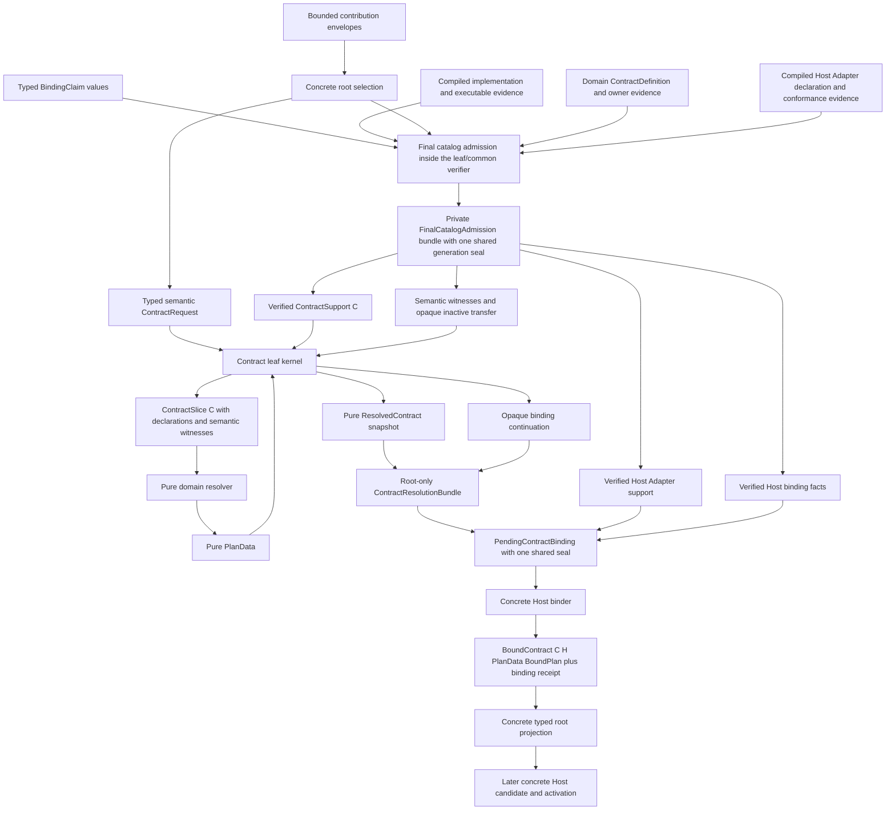

# Extension Contract Kernel Interface Design

**Status**: Design Draft

**Created**: 2026-07-13

**Last Updated**: 2026-07-14

**Owner**: extension contract leaf kernel, domain contract owners, root composition, and concrete Hosts

**Authority**: Non-normative Interface design. Accepted ADRs remain authoritative on conflict.

**Upstream Designs**: [Source Extension Package Interface Design](source-extension-package-interface-design.md), [Multi-Role Extension Package Tracer Interface Design](multi-role-extension-package-tracer-design.md)

**Concept Guide**: [Extension Package Concept Guide](extension-package-concept-guide.md)

**Related ADRs**: [0016](adr/0016-extension-seams-for-backends-and-domain-modules.md), [0046](adr/0046-plugin-metadata-and-default-plugin-groups.md), [0079](adr/0079-root-product-capabilities-and-placeholder-domain-retirement.md), [0081](adr/0081-schema-source-stable-identity-catalog-and-runtime-binding.md), [0082](adr/0082-process-host-authority-and-runtime-construction-topology.md), [0086](adr/0086-rust-project-build-and-executable-generation.md)

**Research Context**: [Extension Ecosystem Research](../knowledge/engineering/extension-ecosystem-engine-research.md)

## Purpose

This document narrows the extension package workbench to one high-cost Interface: the leaf kernel
that joins data-only contribution declarations to statically compiled Rust bindings and returns
verifiable contract-resolution receipts.

The kernel must support runtime, schema, import, tooling, and future third-party contracts without
depending on any of those domains. It must also avoid turning an open contract vocabulary into a
string-keyed service locator or a claim that arbitrary native Rust code can load dynamically.

The type names and Rust sketches are illustrative. The durable subject is the ownership split:

- the leaf kernel owns bounded envelopes, stable contract identity, typed joins, common structural
  validation, the domain-independent final catalog admission operation, canonical semantic receipt
  construction, and no Host authority;
- each domain owns its declaration semantics, pure typed plan, errors, conformance tests, and
  domain-specific binding rules;
- root composition selects the contracts compiled into one executable and directly owns their
  concrete typed results;
- concrete Hosts own candidate construction, placement, activation, cleanup, and active state.

## Decision Summary

The recommended shape is a minimal leaf with one support-owned semantic resolution operation,
followed by a separate verified concrete Host-binding operation:

```text
root-selected bounded declarations
    + typed BindingClaim<C> values
    + compiled implementation, executable, contract-owner, and Adapter evidence
    -> final catalog admission verifies the join without invoking factories
    -> verified ContractSupport<C>, verified Host Adapter support and binding facts,
       semantic witnesses, and opaque inactive transfer
    -> leaf validates and builds ContractSlice<C>
    -> domain resolver produces pure PlanData without executable factories
    -> leaf canonicalizes PlanData and validates stable edges
    -> leaf returns PendingContractBinding<C, H, PlanData, BoundPlan, BindError>
       |- ContractResolutionBundle with pure resolved snapshot and opaque continuation
       |- verified Host Adapter support
       `- verified Host binding facts, all carrying the same private seal
    -> concrete Host binder consumes the complete pending binding
    -> BoundContract<C, H, PlanData, BoundPlan>
       + ContractBindingReceipt<C, H>
```

This recommendation combines the strongest parts of three independent Interface derivations:

- keep the leaf smaller than the domain contracts;
- keep ordinary package registration close to Bevy's explicit Rust ergonomics;
- keep pure plan data separate from Host-specific executable bindings;
- keep Host Adapters and authority outside the leaf;
- keep the contract set open in source, but statically closed per compiled Host executable.

## Evidence Labels

| Label | Meaning in this document |
|---|---|
| Implemented | Current source and tests directly prove the behavior |
| Settled, pending | An Accepted ADR fixes the direction, but the complete Interface is not implemented |
| Proposed | This document selects an Interface shape that still needs tracer evidence and ADR adoption |

### Current Ground Truth

| Area | Evidence | Current limitation |
|---|---|---|
| Domain-specific extension seams | Settled, pending under ADR 0016; render, watcher, and task adapters provide partial implementation evidence | There is no cross-domain source-package contract kernel |
| Stable plugin metadata and product groups | Implemented in part under ADR 0046 | Current group construction still couples planning and `App` mutation |
| Root product capability closure | Settled, pending under ADR 0079; current root bundles provide partial evidence | Pure package and contract resolution is not implemented |
| Stable schema identity and native binding | Implemented in part under ADR 0081 | The generic package-to-domain binding path does not exist |
| Process Host and executable generation | Proposed by ADRs 0082 and 0086 | Compiled support and executable-generation evidence are not one implemented product contract |
| Extension contract kernel | Proposed here | No `ContractSupport`, `ContractSlice`, or contract-resolution receipt exists in source |

No row above permits treating the illustrative Rust below as a stable public Interface.

## Problem

A source extension package needs two kinds of facts that cannot safely be conflated:

1. data-only facts that can be inspected before package code runs; and
2. executable Rust bindings that exist only in a particular compiled Host generation.

Every supported domain then needs to produce a different typed result. A runtime contribution
produces an ordered plugin plan, a schema contribution produces a catalog plan, and an import
contribution produces an importer catalog plan. A central `Contribution` enum would close the
ecosystem. A public `Any` registry would preserve apparent openness by discarding type safety and
ownership. A universal `ExtensionContext` would grant unrelated Host authority during planning.

The kernel therefore has to solve a narrow but non-trivial join:

```text
manifest declaration
    x selected Host/target/trust facts
    x compiled binding evidence
    x exact contract decoder support
    -> one typed, deterministic, zero-authority resolution
```

Deleting this Module should force version validation, binding bijection, canonical ordering,
fingerprint construction, marker collision checks, summary validation, and receipt issuance into
every domain. That redistribution demonstrates real depth.

## Constraints

Any candidate Interface must preserve all of these constraints:

1. The leaf has no dependency on `nara_app`, `nara_asset`, `nara_reflect`, `nara_tooling`,
   `nara_diagnostic`, ECS, windowing, rendering, filesystem authority, or task execution.
2. Package preview and final resolution acquire no `App`, `World`, worker, process, native handle,
   filesystem grant, clock, or active Host lease.
3. Unknown contracts remain inspectable as bounded envelopes. A required unknown contract cannot
   execute unless its owner and Host support are compiled into the executable.
4. Adding a third-party contract changes its owner, a supporting root/Host, and its users. It does
   not add a leaf enum variant or match arm.
5. Typed plans remain typed. They are not stored in a public erased plan bag.
6. Rust `TypeId` may detect process-local marker collisions, but never becomes persistent identity,
   a canonical fingerprint input, or a cross-process protocol value.
7. A semantic resolution receipt proves declaration/evidence/plan facts only. A separate typed
   binding receipt proves verified Host Adapter and inactive binding facts. Neither is an
   activation handle, capability, rollback token, signature, or security boundary.
8. `Send + Sync` and thread affinity belong to concrete domain/Host Adapters, not to every contract
   binding or bound plan.
9. Root composition maps typed errors into structured diagnostics. The leaf cannot depend on the
   current `nara_diagnostic -> nara_app` direction.
10. Resolution runs at composition time. No per-frame contract ID dispatch or registry lookup is
    admitted.
11. The pure resolver cannot receive a callable factory/provider. Executable bindings remain in a
    private opaque transfer until a concrete Host binder moves them into an inactive bound plan.

## Mature-Engine Crosswalk

The following comparisons introduce the Nara concepts. Each analogy is deliberately bounded.

| Nara concept | Bevy comparison | Godot comparison | Unity comparison | Unreal comparison | Where the analogy ends |
|---|---|---|---|---|---|
| Contribution contract | Specialized traits such as `Plugin` or `AssetLoader` | Specialized extension classes such as `EditorImportPlugin` | Base classes, interfaces, and attributes such as `ScriptedImporter` | Module types and provider Interfaces | Nara separates inspectable stable declaration data from the compiled Rust binding and pure typed plan |
| `ContractSupport<C>` | A loader/plugin implementation explicitly compiled into an `App` | Engine/editor code compiled with support for one extension class | An Editor or Player assembly containing the relevant extension point | A target-selected module/provider implementation | It grants no lifecycle or Host authority; it proves verified ownership and exact descriptor decode support, while the pure resolver remains explicit |
| `ContractSlice<C>` | `PluginGroupBuilder` metadata before it mutates `App` is the nearest planning analogy | A filtered registry of one specialized plugin kind | Target/platform-selected assembly and attribute candidates | Target-selected module/provider candidates | It contains immutable declarations and semantic binding-presence witnesses, not implementation provenance or callable factories |
| Pure typed plan | Ordered plugin metadata and group intent | No single equivalent value | Assembly/platform resolution and import/build plans | Target/module and Interchange pipeline selection | Nara requires deterministic canonical plan facts as a first-class result |
| Bound plan | Stored Rust plugin/loader factories | Bound script/native extension implementation | Reflected method/class binding in the selected assembly | Bound module/provider implementation | It is still inactive and carries no native Host authority |
| `ContractResolutionReceipt<C>` | No direct public equivalent | Import/cache metadata is only a partial provenance analogy | Compilation/import records are only a partial analogy | Module/build provenance is only a partial analogy | It proves the declaration/evidence/semantic-plan join only |
| `ContractBindingReceipt<C, H>` | Explicit plugin/loader construction evidence is a partial analogy | Native/script implementation binding is a partial analogy | Selected assembly and reflected method binding | Target-selected module/provider binding | It additionally proves exact Host Adapter support, implementation evidence, target, and semantic affinity, but still not activation |

Bevy supplies the closest desired Rust authoring ergonomics, but its `PluginGroupBuilder` uses
process-local Rust types and eventually mutates `App`. Unity and Unreal provide stronger precedent
for a package above multiple target-scoped compiled roles. Godot demonstrates why specialized
importer and Inspector contracts are preferable to copying its broad `EditorPlugin` gateway.

## Module And Dependency Shape



Dependency categories are simple at this seam:

| Dependency | Category | Treatment |
|---|---|---|
| Envelope limits, stable IDs, sorting, graph validation, canonical hashing | In-process | Owned by the leaf implementation |
| Domain decoding and planning | In-process | Supplied as statically typed domain functions |
| Build/catalog evidence | In-process immutable input | Acquired by build/root Modules before entering the leaf |
| Diagnostic lowering | In-process composition bridge | Kept above the leaf |
| Native, editor, runtime, import, GPU, filesystem, and process authority | Concrete local or future remote Adapter | Excluded until Host candidate construction |

There is no external dependency at the leaf seam and therefore no public port or mock Adapter is
needed.

## Recommended Interface

### 1. Untyped Declaration Projection, Typed Binding Claim

Generated or handwritten manifest projection should stop at a leaf-only declaration locator:

```rust
pub struct DeclaredContribution {
    package: StaticPackageId,
    contribution: StaticContributionId,
    contract: ContributionContractRef,
    declaration_digest: DeclarationDigest,
    manifest_fingerprint: ManifestFingerprint,
}
```

This value is a claim, not a verified key and not authority. The projection does not embed a Rust
marker type path. That keeps it usable when the Nara dependency is renamed, when a role is removed
by `cfg`, and when a third party owns the contract marker.

A domain helper upgrades the claim into a typed binding claim:

```rust
let runtime = nara_app::package::plugins(
    generated::RUNTIME,
    definitions::runtime_plugins,
);

let importer = nara_asset::package::importer(
    generated::IMPORTER,
    SpriteAnimationImporter::new,
);
```

Each helper returns a diagnostic-bearing package part rather than forcing an immediate `?`. The
outer `package::define` operation evaluates every part, aggregates bounded authoring failures, and
returns no `PackageDefinition` unless all parts are valid. A helper verifies that the declared
stable contract reference matches its domain contract and captures a repeatable factory/provider
binding. Final admission later verifies the canonical
manifest, Host/target applicability, executable generation, implementation digest, and exact
binding cardinality before returning one private `FinalCatalogAdmission` bundle.

The admission operation returns one sealed bundle rather than unrelated values that a root caller
could mix:

```text
FinalCatalogAdmission<C, H, PlanData, BoundPlan, ResolveError, BindError>
|- private ContributionKey<C> values for the admitted selection
|- SemanticBindingWitness<C>
|- InactiveBindingTransfer<C>
|- ContractSupport<C, PlanData, ResolveError>
|- VerifiedHostAdapterSupport<C, H, PlanData, BoundPlan, BindError>
|- VerifiedHostBindingFacts<H>
`- one shared private CompositionGenerationSeal across every member
```

The exact generic carrier is illustrative. The invariant is not: root orchestration may borrow only
the typed resolve and bind views issued from this bundle. It cannot construct, replace, or combine
members from different admission generations.

Ordinary package authors should not see `BindingClaim<C>`, `ContributionKey<C>`,
`ContractSlice<C>`, continuations, or receipts. Their common path remains generated names, domain
helpers, and one explicit `package()` definition.

### 2. Leaf Contract Marker

The leaf marker establishes type relationships only:

```rust
pub trait ContributionContract: Sized + 'static {
    const CONTRACT: ContributionContractRef;

    type Declaration: 'static;
    type CompiledDefinition: 'static;
    type DecodeError: 'static;
}
```

It deliberately does not own `resolve`, domain `PlanData`, domain `BoundPlan`, domain policy error,
or activation. This keeps domain changes local and prevents the leaf trait from becoming a
universal executable contract.

The trait is intentionally not object-safe. `Box<dyn ContributionContract>` is not a supported
storage strategy.

### 3. Definition And Verified Support

The contract owner supplies an exact decoder/migration definition:

```rust
pub struct ContractDefinition<C, PlanData, ResolveError>
where
    C: ContributionContract,
    PlanData: CanonicalContractPlan,
{
    decoders: DescriptorDecoderTable<C>,
    canonical_declaration_version: DeclarationVersion,
    resolve: fn(ContractSlice<C>) -> Result<PlanData, ResolveError>,
}

pub struct ContractSupport<C, PlanData, ResolveError>
where
    C: ContributionContract,
    PlanData: CanonicalContractPlan,
{
    definition: ContractDefinition<C, PlanData, ResolveError>,
    owner: VerifiedContractOwner<C>,
}
```

`ContractDefinition<C, PlanData, ResolveError>` is owner-provided data plus one non-capturing pure
resolver function pointer. `ContractSupport<C, PlanData, ResolveError>` is the root-verified
compiled support for one executable. Its constructor remains private to catalog verification so a
marker plus a claimed string ID does not prove ownership and root cannot pair support with an
arbitrary capturing closure.

The support value is not an Adapter. It cannot activate code, open a file, mutate an editor, or
obtain a thread. It only allows the leaf to decode one exact contract line into its canonical
declaration type.

### 4. Exact Version Lines

The Interface keeps four version axes distinct:

| Axis | Recommended representation |
|---|---|
| Contract semantic line | Stable contract ID plus explicit major line |
| Descriptor wire shape | Exact integer descriptor version |
| Canonical declaration/plan shape | Exact schema version |
| Concrete Host Adapter conformance | Explicit supported plan-version evidence |

`DescriptorDecoderTable<C>` maps exact wire versions to a bounded decode and explicit migration
chain. It must not implement an implicit "highest common version" negotiation. Adding a newer
decoder to a Host must not silently change the result for an older input.

`CanonicalContractPlan::SCHEMA_VERSION` supplies the exact semantic plan shape. The concrete
`VerifiedHostAdapterSupport<C, H>` lists exact accepted plan versions; binding rejects a mismatch
before it exposes the inactive transfer to domain binding code. Both versions and the migration
chain fingerprint enter their phase-appropriate receipts.

Before a domain decoder runs, the leaf applies common encoded-byte, depth, node, container, string,
duplicate-key, stable-reference, and diagnostic limits. A decoder receives a bounded prepared
view, not an unlimited `serde_json::Value` or raw byte stream. Contract-specific semantic limits
may tighten the Host ceiling but cannot raise it.

### 5. One Sealed Semantic Resolution Operation

The leaf exposes one deep semantic operation rather than separate public `decode`, `join`, `seal`,
and `receipt` steps:

```rust
impl PreparedPackageSet {
    pub fn resolve_contract<C, H, PlanData, BoundPlan, ResolveError, BindError>(
        &self,
        admission: FinalCatalogAdmission<
            C,
            H,
            PlanData,
            BoundPlan,
            ResolveError,
            BindError,
        >,
        request: ContractRequest<C>,
    ) -> Result<
        PendingContractBinding<C, H, PlanData, BoundPlan, BindError>,
        ContractResolveError<C::DecodeError, ResolveError>,
    >
    where
        C: ContributionContract,
        H: HostBindingKind,
        PlanData: CanonicalContractPlan + 'static,
        BoundPlan: 'static,
        ResolveError: 'static,
        BindError: 'static;
}
```

`ContractRequest<C>` owns only typed semantic request inputs and effective limits. It carries no
compiled definition, executable value, verified Adapter support, Host binding fact, or inactive
transfer. The consumed `FinalCatalogAdmission` supplies the selected stable locators, verified
semantic witnesses, matching executable values, implementation/generation evidence, Adapter
support, Host facts, and shared private seal. The leaf privately verifies their bijection and drift,
but retains the transfer while the resolver runs and does not copy executable provenance into the
semantic slice or semantic receipt.

`ContractSlice<C>` contains canonical decoded declarations and a
`SemanticBindingWitnessSlice<C>` only. The witness proves stable locator, declared contract,
declaration digest, cardinality, and declared semantic requirements. It intentionally omits
implementation digest and executable generation. It has no factory/provider invocation method and
does not expose `C::CompiledDefinition` values.

The leaf invokes only the non-capturing resolver stored in the verified support. That function may
still call trusted native globals through ambient Rust authority, but the Interface does not let a
root caller capture a raw binding, factory, or Host authority in an arbitrary closure.

`PlanData` is pure, inspectable, placement-independent, canonical, and `'static`, so it cannot
borrow the short-lived slice. On complete success the leaf constructs a root-only
`ContractResolutionBundle<C, PlanData>` and moves it together with the admission's verified Adapter
support and Host facts into one `PendingContractBinding`. No caller can retain the support/facts or
pair the resolution with evidence from another admission generation.

### 6. Canonical Plan Sink

The domain plan writes stable semantic facts through a constrained sink:

```rust
pub trait CanonicalContractPlan {
    const SCHEMA_VERSION: PlanSchemaVersion;

    fn summarize(
        &self,
        sink: &mut ContractPlanSink<'_>,
    ) -> Result<(), ContractPlanSummaryError>;
}
```

The sink owns stable-ID validation, domain-separated and length-prefixed encoding, canonical set
ordering, edge endpoint checks, count limits, and final hashing. It does not accept `Debug` or
`Display` text, Rust type paths, `TypeId`, pointer values, function addresses, vtable addresses,
native handles, or map iteration order.

The contract owner is still responsible for semantic completeness. Golden fixtures and
conformance tests must prove that every behavior-affecting plan field contributes to the summary.
A hash cannot turn trusted native owner code into an adversarial security boundary.

### 7. Semantic Resolution And Host Binding Results

The pure semantic result preserves contract identity in its type:

```rust
pub struct ResolvedContract<C, PlanData>
where
    C: ContributionContract,
    PlanData: CanonicalContractPlan,
{
    plan_data: PlanData,
    receipt: ContractResolutionReceipt<C>,
}

pub struct ContractResolutionBundle<C, PlanData>
where
    C: ContributionContract,
    PlanData: CanonicalContractPlan,
{
    resolved: ResolvedContract<C, PlanData>,
    continuation: InactiveBindingTransfer<C>,
}

pub struct PendingContractBinding<C, H, PlanData, BoundPlan, BindError>
where
    C: ContributionContract,
    H: HostBindingKind,
    PlanData: CanonicalContractPlan,
{
    resolution: ContractResolutionBundle<C, PlanData>,
    support: VerifiedHostAdapterSupport<C, H, PlanData, BoundPlan, BindError>,
    facts: VerifiedHostBindingFacts<H>,
}
```

`ResolvedContract` is immutable, inspectable semantic data. `ContractResolutionBundle` is a
move-only resolution carrier nested inside `PendingContractBinding`. The pending binding is the
root-private linear owner of the resolution, exact verified Adapter support, and Host facts. Neither
carrier is serializable, cloneable, persistable, or exposed to package/provider authors. Inspection
APIs may borrow or project the pure `ResolvedContract`, but cannot recover the continuation,
support, or Host facts from an inspection snapshot.

`ContractResolutionReceipt<C>` contains only stable semantic audit facts:

- contract reference, exact descriptor/migration path, canonical declaration version, and exact
  `PlanData::SCHEMA_VERSION`;
- canonical selected-set, declaration-set, and semantic binding-presence witness digests;
- canonical semantic plan fingerprint;
- validated contract/package dependency-edge facts and target facts that affected semantic
  planning.

It does not claim Host Adapter, affinity, placement, or activation evidence.

A separate root/domain binding Module then requires catalog-verified Adapter support:

```rust
pub fn bind_contract<C, H, PlanData, BoundPlan, E>(
    pending: PendingContractBinding<C, H, PlanData, BoundPlan, E>,
) -> Result<BoundContract<C, H, PlanData, BoundPlan>, ContractBindError<E>>
where
    C: ContributionContract,
    H: HostBindingKind,
    PlanData: CanonicalContractPlan + 'static,
    BoundPlan: 'static,
    E: 'static;
```

`VerifiedHostAdapterSupport<C, H, PlanData, BoundPlan, E>` has a private catalog constructor. It
owns the typed binding function as well as the exact plan schema versions it supports,
Adapter/conformance identity, implementation and executable-generation evidence, target
applicability, and semantic affinity constraints. `bind_contract` invokes only that verified
support's binding function, so a caller cannot pair Adapter A's evidence with an unrelated binder
closure. Package code cannot self-assert the value.

`VerifiedHostBindingFacts<H>` is also minted only by the final catalog verifier. It contains the
selected Host role, execution and subject targets, policy, and immutable binding-generation facts.
The semantic receipt, verified Adapter support, verified Host facts, and compiled transfer carry
the same private process-local `CompositionGenerationSeal`; `bind_contract` checks all seals before
opening the transfer. The stable semantic audit fields still omit executable provenance, while the
binding receipt records it.

Only the generic binding coordinator may destructure `PendingContractBinding`, validate the common
seal, and then open its nested opaque continuation. The coordinator can remain domain-neutral: the
verified support stored in the same carrier owns the domain binding function. Root code cannot
supply or replace a support value, Host fact, or binder closure at this stage. There is no public
`into_bindings()` escape hatch.

`InactiveBindingTransfer<C>` is a move-only domain wrapper with no public generic invoke, lookup,
or downcast operation. Domain binding code may transfer its factory/provider wrappers into
`BoundPlan`, but the factory invocation capability remains private to later candidate preparation.
Domain helpers wrap raw callbacks in an inactive typestate whose invocation requires an
unforgeable Host-owned activation permit; no such permit exists during resolve or bind.
Trusted native Rust can always violate policy through its own ambient process authority; the
Interface claim is narrower: Nara does not hand the pure resolver or generic binder an invocation
operation or any Nara Host authority.

The bound result remains typed:

```rust
pub struct BoundContract<C, H, PlanData, BoundPlan> {
    plan_data: PlanData,
    bound_plan: BoundPlan,
    semantic: ContractResolutionReceipt<C>,
    binding: ContractBindingReceipt<C, H>,
}
```

`ContractBindingReceipt<C, H>` binds the semantic receipt digest to exact Adapter conformance,
compiled binding implementation/executable evidence, selected target, and declared affinity.
Actual thread, executor, process, native authority, candidate readiness, and activation remain
later Host-owned receipts.

Root composition stores bound results as concrete fields in `EditorProjectProjection`,
`ServerProjectProjection`, or another concrete Host projection. It never inserts them into a
public `get<T>()` plan registry.

Neither receipt contains a plan object, provider, factory, `TypeId`, pointer, native handle,
capability, or arbitrary descriptor payload. Their fields and constructors remain private.
The private composition-generation seal is not serialized. Serializing audit facts does not allow
deserialization to regain process-local authority or satisfy a later bind.

### 8. Resolution Order

The operation follows one fixed order:

1. Common package preparation validates bounded envelopes, stable IDs, duplicates, support claims,
   and canonical package fingerprints.
2. Root composition resolves Host role, execution target, subject target, trust, requirements,
   conflicts, optional fallback, and selected contributions.
3. Final catalog admission joins the selected canonical declarations, `BindingClaim<C>` values,
   verified contract/Adapter support, and compiled implementation/executable evidence. It alone
   mints private contribution keys, semantic witnesses, opaque inactive transfers, and shared
   composition-generation seals; it invokes no factory.
4. `resolve_contract` verifies that the admitted selection belongs to the prepared set and
   canonicalizes order by stable locator.
5. It verifies exact contract version support and the private admission seals without exposing
   compiled owner or implementation evidence to the domain resolver.
6. It joins each declaration to exactly one admitted semantic witness/opaque-transfer pair and
   rejects missing, extra, duplicate, wrong-contract, stale-generation, or digest-drift values.
   The transfer and its implementation/executable evidence remain private and are not placed in
   `ContractSlice<C>` or the semantic receipt.
7. Only then does the domain decoder run on bounded prepared values.
8. The domain resolver sees declarations plus semantic binding-presence witnesses and produces
   pure `PlanData`; it receives no callable binding or Host authority.
9. The leaf validates the exact plan schema, canonical summary, and semantic edges against its
   private slice witness.
10. Only complete semantic success constructs `ContractResolutionReceipt<C>` and returns one
    `PendingContractBinding` containing the `ContractResolutionBundle`, verified Adapter support,
    verified Host facts, and their unchanged shared seal.
11. The concrete Host binder consumes that complete carrier, verifies exact plan-version/target
    support and every shared seal, moves the inactive transfer into `BoundPlan`, and invokes no
    factory.
12. Only complete binding success constructs `ContractBindingReceipt<C, H>` and the concrete typed
    root projection. Candidate preparation and factory invocation happen later in the Host.

A semantic failure returns neither receipt. A later binding failure may retain the immutable
semantic receipt for diagnostics but returns no binding receipt. Neither phase performs Host
mutation.

### 9. Activation Edges

The Interface distinguishes three edge owners:

| Edge | Owner |
|---|---|
| Contract-internal order, slot, and fallback edge | Domain contract owner |
| Package presence, requirement, conflict, and cross-contract bridge | Root composition |
| Candidate authority, startup, ready, cleanup, and active publication edge | Concrete Host |

The contract plan may propose stable edge drafts. The leaf/root validates selected endpoints,
generation/fingerprint matches, allowed bridge kinds, bounded cycles, engine-owned phase limits,
and whether the static dependency topology has a valid reverse order. A third-party contract may
define namespaced internal phases but cannot invent a process-wide lifecycle phase by string.

The concrete Host derives its cleanup DAG from the admitted dependency topology, executes reverse
retirement, and proves the actual cleanup order through a Host-owned cleanup receipt. The leaf
cannot prove candidate owner behavior before a candidate exists.

The receipt records admitted edge facts. It does not execute them.

### 10. Host Affinity And Authority

The leaf does not require `Declaration`, `Binding`, or `BoundPlan` to be `Send + Sync`. A threaded
import binding helper may impose those bounds. A browser WebGPU or editor-main-thread Adapter may
accept a local affine bound plan. Actual placement produces a Host-owned placement receipt later.

Likewise, `ContractSupport`, its non-capturing resolver, the concrete binder, and `BoundPlan` do not
gain filesystem, process, GPU, window, editor, runtime, or task authority during composition. A
concrete Host prepares a fresh candidate after the complete project projection is admitted.

### 11. Error And Diagnostic Bridge

The leaf returns typed structural rejection facts:

```rust
pub struct ContractReject {
    code: ContractRejectCode,
    phase: ContractPhase,
    contract: Option<ContributionContractRef>,
    contribution: Option<ContributionLocator>,
    expected_version: Option<u32>,
    actual_version: Option<u32>,
    budget: Option<ContractBudgetKind>,
    observed: Option<u64>,
    limit: Option<u64>,
}
```

Domain decode and plan errors remain typed in `ContractResolveError<D, E>`. Root or the owning
domain explicitly maps them to classified `DiagnosticReport` values. The bridge must not use
`error.to_string()`, panic payloads, absolute paths, descriptor payloads, URLs, or environment
values as summaries, identities, serialization fields, or dedupe keys.

In `panic = "unwind"` builds, the composition owner contains domain decoder, pure resolver,
canonical summarizer, and concrete binder calls independently. If unwinding completes normally, a
panic becomes a fixed engine-owned phase/code with no payload text and produces no receipt for that
phase. The leaf keeps the opaque binding transfer until semantic success; unwinding a binder drops
or retains moved engine-owned inactive wrappers without invoking their factories. A second panic
from third-party `Drop` during unwinding aborts the process and cannot be converted into a typed
failure. Trusted third-party `Drop` code still has ordinary ambient native authority and is not
presented as sandboxed.

In `panic = "abort"` builds, no in-process recovery is possible. The operation cannot return a
typed failure, and the only honest guarantee is that an in-progress receipt had not yet been
issued. The concrete Host attempt remains the lifecycle/cleanup owner; domain Modules own only
phase-specific error semantics. Conformance includes decoder, resolver, summarizer, binder, and
double-panic/drop fixtures for unwind profiles plus documented abort-profile process tests.

## Caller Experience

### Ordinary Game Author

Game-owned code should continue to use the direct product path:

```rust
app.add_plugins(SpriteAnimationPlugins)?;
```

The direct group and package path lower from one canonical schema/plugin definition source and are
checked for equivalent fingerprints and schedule placement.

### Reusable Package Author

```rust
pub fn package() -> Result<PackageDefinition, PackageAuthorReport> {
    package::define(
        generated::PACKAGE,
        (
            nara_reflect::package::schemas(
                generated::SCHEMA,
                definitions::schemas,
            ),
            nara_app::package::plugins(
                generated::RUNTIME,
                definitions::runtime_plugins,
            ),
            #[cfg(feature = "import")]
            nara_asset::package::importer(
                generated::IMPORTER,
                SpriteAnimationImporter::new,
            ),
        ),
    )
}
```

The tuple carrier is illustrative and remains an open ergonomic detail. The stable Interface is one
all-or-error definition operation over domain helpers. Typed binding claims remain behind those
helpers. Each helper yields a diagnostic-bearing package part; `package::define` aggregates all
part failures into one bounded `PackageAuthorReport` instead of requiring per-helper `?` and
returning only the first error.

No proc macro, linker inventory, global constructor, `Any`, or universal context is required.
Optional proc macros may become syntax sugar only after this ordinary Rust path is complete.

### Domain Contract Author

A domain contract author supplies:

1. one stable contract semantic line;
2. exact bounded descriptor decoders and migrations;
3. canonical typed plan data, a pure resolver, typed semantic errors, and conformance fixtures;
4. domain authoring helpers that hide typed binding claims from ordinary package authors;
5. no change to the leaf kernel.

### Adapter And Root/Host Maintainer

A concrete Adapter and root/Host maintainer separately supplies:

1. the concrete Host binding kind, accepted plan versions, target/affinity constraints, and typed
   inactive bound plan;
2. explicit compiled Adapter-support registration in each product root that supports the contract;
3. candidate preparation, authority, cleanup, and publication behavior plus Adapter conformance
   fixtures;
4. no universal Host trait and no change to the leaf kernel.

One third party may implement both roles, but the contract kit must not require Host placement or
root wiring. Conversely, inventing a contract ID does not make a stock executable support it; a
root maintainer must deliberately compile and register the matching Adapter support.

This is intentionally more ceremony than ordinary package authoring. Defining an ecosystem
contract is an advanced engine-extension task, not the common game-author path.

### Public Surface Rule

The complete kernel Interface is an advanced contract/root/Host integration surface. Domain
helpers must absorb it so a game author, ordinary package author, or provider author never manually
creates or transports a `ContributionKey`, `ContractRequest`, contract slice, semantic/binding
receipt, generation seal, inactive transfer, bound plan, candidate, cohort, or activation permit.
Those types stay private or in narrowly named advanced modules and never enter `nara::prelude`.

The same rule applies to errors: ordinary diagnostics name the package role, domain settings,
target, or missing support and provide a corrective action. Kernel phase names and fingerprints
belong in opt-in audit details. A clean-room provider fixture must be able to implement its typed
domain trait without importing this module.

## Open Contract, Closed Executable

"Open contract vocabulary" means a third party can define a new contract owner, stable ID,
declaration, typed plan, binding rules, and supporting Host Adapter without editing a leaf enum.
It does not mean a stock executable can execute an unknown contract by discovering its ID.

```text
Unknown optional contract + leaf-valid fallback to a supported contract/contribution
    -> bounded preview, explicit unsupported evidence, and selected fallback

Unknown optional contract + missing or invalid fallback
    -> final admission failure

Unknown required contract + no support
    -> final admission failure

Third-party contract + explicitly compiled owner and Host support
    -> typed resolution after executable rebuild
```

This is the honest static Rust cost. It resembles Unity and Unreal target builds more than a
dynamic scripting registry. A stable native ABI or process protocol remains a separate future
extension technology.

The fallback of an unknown contract cannot depend on that unknown contract's private descriptor
semantics. The common package envelope must name a leaf-understood fallback relation whose target
is an already selected and supported contract/contribution (or another engine-owned common
fallback kind with its own validator). The leaf/root can then validate target existence,
applicability, requirements, conflicts, and bounded cycles without decoding the unknown payload.
Otherwise the optional unknown contribution fails final admission.

## Alternatives Considered

### Option A: Domain-Rich Central Contract Trait

Put `Declaration`, `Binding`, `PlanData`, `BoundPlan`, `Error`, and `resolve` directly on
`ContributionContract`.

**Strengths**: One trait appears self-contained; root wiring is concise; static dispatch is easy.

**Weaknesses**: The leaf vocabulary changes with domain lifecycle concerns, pure planning and Host
binding become conflated, and every contract is pressured into common threading and error shapes.

**Decision**: Rejected for the leaf. Domain owners may use an internal trait with this convenience.

### Option B: Expose Decode, Slice, Seal, And Receipt As Separate Steps

Let root code decode envelopes, construct `ContractSlice`, call a resolver, then separately submit
a summary to obtain a receipt.

**Strengths**: Maximum control and easy experimentation.

**Weaknesses**: Callers must learn phase ordering and witness rules. It represents forgotten
validation, duplicate sealing, and receipt-with-wrong-slice states. Common checks spread across
root callers.

**Decision**: Rejected as a public Interface. These may remain private implementation steps.

### Option C: Support-Owned Typed Join

The leaf validates and constructs a typed slice, invokes the non-capturing resolver stored in
root-verified contract support, then validates canonical plan facts and constructs the receipt
before returning.

**Strengths**: Highest depth at the leaf seam; domain types remain concrete; the resolver sees no
callable implementation; the leaf owns every common semantic invariant.

**Weaknesses**: The generic signature is advanced, and a function pointer still cannot sandbox
trusted native code that deliberately uses ambient globals.

**Decision**: Recommended.

### Option D: Central Contribution Enum Or Public Erased Registry

Store every contribution in one enum, or route plans through `Any`, `get<T>()`, string downcasts,
or `activate(contract_id)`.

**Strengths**: Heterogeneous iteration and debug inspection look simple.

**Weaknesses**: The enum closes extension growth; the erased registry hides ownership and type
safety; a public lookup surface becomes a service locator; unknown strings appear to grant
capability.

**Decision**: Rejected. Limited private erasure is permitted only for bounded envelopes, binding
claim routing, stable inspection snapshots, and receipt facts. Plans and executable callbacks stay
typed.

## Design It Twice Comparison

| Candidate | Depth | Locality | Seam placement | Verdict |
|---|---|---|---|---|
| Minimal support-owned leaf | High: one operation hides join, validation, and receipt issuance | High for common invariants; domain semantics remain local | Correctly between prepared package facts and typed domain resolution | Base recommendation |
| Flexible static support set plus generic Host Adapter | High for advanced contract authors | High, but risks moving Host binding vocabulary into the leaf | Host Adapter seam is real, but should remain above the leaf | Keep static support and plan/bind lessons; reject leaf-owned universal Adapter |
| Ergonomic generated typed keys | High for happy-path package code | Medium because generator must know Rust marker paths and feature layout | Places trust too early in generated projection | Replace with untyped declaration projection plus typed domain binding claim |
| String registry | Superficially small, actually shallow | Low; every caller reconstructs domain checks | Seam is placed at lookup rather than ownership | Reject |

The selected hybrid is:

```text
ordinary package ergonomics
    = untyped generated locator + typed domain helper + one package registration

leaf kernel
    = minimal support-owned typed join + structural validation + receipt

domain/root
    = pure PlanData + separate verified Host binder

binding result
    = inactive Host-specific BoundPlan + typed binding receipt

concrete Host
    = placement + authority + candidate + activation + cleanup
```

## Test Strategy

The leaf Interface is the test surface. Tests should not inspect internal maps, tuple recursion,
private erased capsules, sort buffers, or slice witnesses.

| Layer | Required evidence |
|---|---|
| Compile-pass | Macro-free external contract/package, renamed Nara dependency, runtime-only and import-enabled feature sets, local-affine bound plan, and domain provider importing zero kernel types |
| Compile-fail | Wrong domain helper, `FnOnce` factory, borrowed plan escape, cross-contract result mix, public receipt/key construction, opening opaque transfer, invoking inactive factory without Host permit, `dyn ContributionContract`, incorrect threaded affinity |
| Pure property tests | Declaration and binding permutations produce identical slices, plans, and receipts; duplicate and conflicting facts reject deterministically |
| Version matrix | Exact descriptor migration, exact plan schema, and Host Adapter conformance mismatch reject deterministically |
| Unknown-contract matrix | Required unknown, optional with valid fallback, optional with missing fallback, and optional with invalid fallback produce the specified admission result |
| Fault matrix | Unsupported version, decode budget, missing/extra/duplicate/wrong/stale binding, marker collision, invalid edge, domain error, summary error, and invalid optional fallback produce no applicable receipt |
| Panic matrix | Decoder, resolver, summarizer, and binder panics produce fixed payload-free phase failures and no phase receipt in unwind builds; abort behavior is process-tested |
| Binding separation | Pure resolver receives no callable binding; equal declarations/plan across different implementation, executable, Adapter, or affinity evidence keep one semantic receipt and produce distinct binding receipts |
| Authority counters | Prepare, resolve, and bind create zero Apps, workers, capabilities, invoked factories, candidates, native objects, and active-pointer mutations |
| External locality fixture | Adding a test third-party contract changes its owner and one supporting Host fixture with zero leaf source changes |
| Dependency audit | The leaf has no dependency on app, asset, reflect, tooling, diagnostic, ECS, filesystem, task, window, or render crates |
| Product graph audit | Release/server artifacts omit unselected importer, editor, and contract Adapter code |
| Performance audit | Contract resolution occurs only during composition; frame execution performs zero contract ID lookup or dynamic activation |
| Public-surface audit | `nara::prelude` and ordinary game/package/provider rustdoc expose no receipt, seal, transfer, bound-plan, candidate, cohort, or activation-permit types; primary errors use domain vocabulary |

## Success Metrics

| Metric | Target | Measurement |
|---|---|---|
| Leaf locality | Adding one test contract changes zero leaf source lines | Clean-room contract fixture diff |
| Deterministic resolution | 100 declaration, semantic binding-witness, and support-order permutations produce one plan and semantic receipt fingerprint | Property test |
| Pre-domain rejection | Every common validation fault invokes decoder/resolver/factory zero times | Instrumented fault matrix |
| Binding proof separation | Different Adapter/affinity evidence changes binding receipt while leaving equal semantic input/plan receipt unchanged | Cross-Adapter conformance fixture |
| Pre-authority guarantee | Prepare, resolve, and bind acquire or mutate zero Host authorities and invoke zero factories | Instrumented Host fixture |
| Type safety | Wrong domain binding, borrowed plan, and illegal threaded placement fail at compile time where representable | Compile-fail fixtures |
| External ergonomics | A macro-free package with a renamed Nara dependency registers runtime, schema, and importer claims through one `package()` function | Independent workspace fixture |
| Complexity firewall | Game, package, and provider fixtures complete their normal tasks without importing kernel or Host-integration types | Independent compile fixtures and rustdoc/API audit |
| Receipt integrity | Typed semantic and binding receipts contain only evidence for their own phase and no plan, payload, `TypeId`, path, pointer, provider, or native handle | Schema/golden audit |
| Dependency direction | Leaf dependency audit reports zero forbidden domain/backend crates | `cargo metadata` and boundary search |
| Runtime cost | Frame profiles contain zero contract dispatch, registry lookup, or plan resolution | Profiling and code review |

## Risks And Mitigations

| Risk | Severity | Likelihood | Mitigation |
|---|---|---|---|
| Private erasure leaks into a public service locator | Critical | Medium | Permit erasure only for envelopes, claim routing, snapshots, and receipts; forbid public `Any`, downcast, `get<T>()`, and generic activate |
| Leaf gains a domain dependency cycle | Critical | Medium | Keep domain errors typed and diagnostic lowering above the leaf; enforce dependency audits |
| Generated locator is mistaken for verified truth | High | Medium | Keep it untyped and claim-only; mint typed keys only after final catalog verification |
| Semantic receipt overclaims Adapter/affinity evidence | Critical | Medium | Keep `ContractResolutionReceipt<C>` semantic-only; require separate verified support and `ContractBindingReceipt<C, H>` |
| Receipt is mistaken for activation or security proof | Critical | Medium | Private constructors, explicit phase scope, and separate binding, Host placement, cleanup, and activation receipts |
| Pure resolver invokes implementation code | Critical | Medium | Give slices evidence only; retain callable bindings in opaque transfer until a visibility/typestate-restricted Host binder moves them without invocation |
| Plan fingerprint omits behavior-affecting fields | High | Medium | Constrained canonical sink plus golden and semantic conformance tests per contract |
| Generic Interface harms ordinary author ergonomics | High | Medium | Hide it behind domain helpers and one package registration; expose advanced kit only to contract authors |
| Static support set increases compile time or binary size | Medium | Medium | Measure contract count and monomorphization; retain static dispatch until evidence justifies a different execution technology |
| Marker collision is presented as namespace security | High | Medium | Describe collision checks as drift/conflict protection only; do not claim malicious native isolation |
| A universal Host Adapter trait becomes a lowest common denominator | High | Medium | Keep concrete Host binding above the leaf and require a second real Adapter before standardizing a reusable seam |

## Evolution Sequence

1. Keep this as a logical design while runtime composition remains data-plan work.
2. Implement one private test contract to prove bounded decode, evidence-only slice, opaque binding
   transfer, exact plan schema, canonical plan sink, semantic receipt, and separate verified Host
   binding receipt.
3. Add runtime, schema, and shared-import contract slices through the multi-role tracer, including
   at least two distinct Adapter/affinity binding receipts over equal semantic input.
4. Prove the macro-free renamed-dependency external package and Host-feature exclusion matrix.
5. Introduce a dedicated leaf crate only when those production consumers exist and ADR 0079
   admission evidence proves it is not a placeholder.
6. Record accepted identity, version, and receipt invariants in the owning ADRs; delete obsolete
   sketches rather than preserving a compatibility layer.
7. Consider a process or binary Adapter only after a real second execution placement proves the
   protocol seam. Do not change the package declaration contract merely to experiment with it.

## Open Questions

These questions do not block the direction above:

1. Which physical manifest projection wins the tracer measurement: sidecar-first, Rust-first, or a
   generated checked projection from one data authority?
2. Which physical build artifact carries the inputs consumed by the final catalog verifier for
   `VerifiedContractOwner<C>`, `VerifiedHostAdapterSupport<C, H, ...>`, and
   `VerifiedHostBindingFacts<H>`? The verifier's exclusive minting authority and shared
   composition-generation seal are settled; only the evidence transport/storage is open.
3. Does the first implementation use tuple/HList static support composition, generated root
   fields, or explicit handwritten root calls? All must keep typed plans out of an erased bag.
4. Which exact canonical plan encoding becomes persistent audit data, and which receipt fields stay
   process-local only?
5. What measured number of contracts or compile-time cost would justify revisiting static support
   monomorphization?

None of these questions justifies a central enum, public service locator, universal mutable
context, or stable Rust dynamic ABI now.

## Conclusions To Preserve

1. The leaf owns typed joining and common proof construction, not domain resolution semantics or
   Host lifecycle.
2. Manifest projection produces an untyped claim; final verification privately mints the typed
   key.
3. Pure `PlanData` and inactive Host-specific `BoundPlan` are created in separate typed phases; the
   pure resolver receives no callable binding.
4. `ContractResolutionReceipt<C>` proves semantic resolution; `ContractBindingReceipt<C, H>`
   separately proves verified Adapter binding; neither proves placement or activation.
5. The contract vocabulary is open in source while each executable's supported set is statically
   and explicitly closed.
6. Unknown contracts never self-authorize by stable ID.
7. Domain and Host results stay typed; only bounded data and audit facts may be privately erased.
8. Exact Host Adapter and affinity evidence enter a typed binding receipt after pure resolution;
   actual placement and native authority remain later Host receipts.
9. The common package author path remains one registration built from domain helpers; the advanced
   contract-author kit may be more explicit.

## References

- `repo-ref/bevy/crates/bevy_app/src/plugin.rs` and `plugin_group.rs` for explicit runtime plugin
  composition and the limits of process-local `TypeId` planning.
- `repo-ref/bevy/crates/bevy_asset/src/loader.rs` for a specialized typed contract with associated
  declaration/error behavior and private erasure.
- `repo-ref/godot/editor/import/editor_import_plugin.h` and
  `repo-ref/godot/editor/inspector/editor_inspector.h` for specialized editor child contracts.
- [Unity package and assembly definitions](https://docs.unity3d.com/6000.0/Documentation/Manual/assembly-definition-files.html)
  for target-scoped compiled roles beneath one package.
- [Unreal Engine plugins](https://dev.epicgames.com/documentation/en-us/unreal-engine/plugins-in-unreal-engine)
  for descriptors above target-selected modules.
- `docs/knowledge/engineering/extension-ecosystem-engine-research.md` for the complete source and
  evidence crosswalk.
