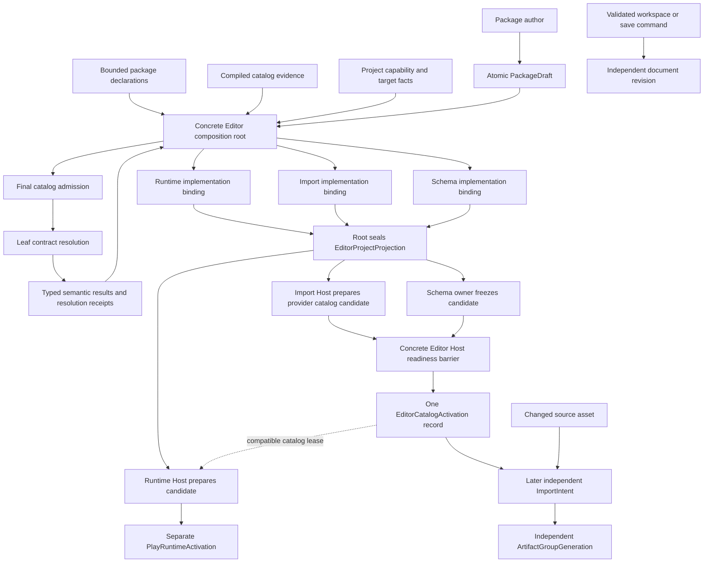

# Extension Package Concept Guide

**Status**: Explanatory Guide - the ownership model is recommended, while most illustrated Rust
types remain proposed

**Created**: 2026-07-13

**Last Updated**: 2026-07-13

**Audience**: Game authors, package authors, engine contributors, and future Host integrators who
do not already know Nara's extension architecture vocabulary

**Authority**: Explanatory only. Accepted ADRs remain authoritative on conflict.

**Canonical Vocabulary**: [Nara Engine Architecture Language](../../CONTEXT.md)

**Detailed Designs**: [Source Extension Package Interface Design](source-extension-package-interface-design.md), [Extension Contract Kernel Interface Design](extension-contract-kernel-interface-design.md), [Asset Import Host Interface Design](asset-import-host-interface-design.md), [Multi-Role Extension Package Tracer Interface Design](multi-role-extension-package-tracer-design.md)

## Why This Guide Exists

The detailed extension documents use terms such as "leaf kernel", "root composition", "binding",
"Host", "candidate", and "receipt" precisely. They are useful for architecture review, but they
are difficult to read before those terms have a shared meaning.

The recommended concepts are often abbreviated as a downward stack:

```text
atomic package authoring
    -> minimal leaf contract kernel
    -> concrete root composition
    -> domain-specific Host binding
    -> concrete domain owners and candidates
```

That stack is an ownership map, not the exact call order. The composition root coordinates the
middle of the operation: it selects the product and target, asks the leaf kernel to resolve each
known contract, asks domain binders to bind the results, and only then seals the final concrete
projection.

```text
package draft
    -> composition root selects product / Host / target facts
       -> final catalog admission joins declarations to compiled evidence
          -> leaf resolves each selected contract
          <- typed semantic results
       -> domain-specific implementation binders
       <- typed inactive bound results
    <- composition root seals one concrete typed projection
    -> concrete domain owners prepare candidates
```

The last line is deliberately not "four universal Hosts". Runtime and import have clear Host
lifecycles. Schema is owned by a schema catalog owner. Tooling is split again: a tooling provider
catalog owner prepares the available Inspector, gizmo, and tool topology for concrete Host
activation, while a tooling workspace owner retains open documents, selection, undo, and saved
revisions. Package activation reaches the provider catalog, not workspace or document authority.
Nara does not plan to introduce one `EngineHost` trait that hides these different responsibilities.

## The Short Mental Model

Imagine preparing a machine from separately supplied parts:

1. **Atomic package authoring is the packing list.** The package author lists all parts supplied by
   one package at once.
2. **Concrete root composition is the assembly coordinator.** The Editor, server, and cook tool
   select different subsets and supply the facts needed by the next checks.
3. **The leaf contract kernel is the independent common verifier.** For each selected rulebook, it
   checks identities, versions, limits, and structural evidence. It may invoke catalog-verified,
   non-capturing domain decoders and pure resolvers, but it invokes no package provider or factory
   and acquires no Host authority.
4. **Domain-specific implementation binding matches each part to one socket.** The formal design
   calls this Host binding; the implementation is selected, but it is still powered off.
5. **Concrete domain owners prepare candidates; the owning Host publishes the selected unit.** Only
   this layer receives the authority needed to construct an `App`, run an importer, freeze a schema
   catalog, or prepare a tooling provider catalog. Candidates selected by one activation intent
   remain invisible until the concrete Host publishes the complete cohort. Ordinary artifact
   reimport, Play runtime activation, Editor provider-catalog activation, and document saves remain
   separate publication axes.

The analogy ends at authority. Nara's actual design uses typed Rust values, stable identities,
bounded data, explicit generations, and domain-specific failure rules rather than a physical parts
registry.

## Five Terms Without Jargon

| Term | Plain meaning | What it must not mean |
|---|---|---|
| Atomic package authoring | Give Nara all compiled contribution claims for one package in one all-or-error authoring operation | Atomic disk replacement, activation, or rollback of arbitrary Rust side effects |
| Minimal leaf contract kernel | The smallest domain-independent verifier shared by runtime, schema, import, and tooling contracts | OS kernel, package downloader, dynamic plugin loader, or global registry |
| Concrete root composition | One executable coordinates selection, resolution, binding, and final typed projection assembly | Repository root, universal extension manager, or `get<T>()` service locator |
| Domain-specific implementation binding | Join a pure plan to an exact compiled implementation for one owner role and target, while keeping it inactive; formally called Host binding | Calling the factory, opening files, mutating `World`, or publishing state |
| Concrete domain owner | The real Module that owns candidate construction, scoped authority, readiness, cleanup, and domain policy; a concrete Host may coordinate visibility for a multi-domain cohort | One common trait implemented by every engine subsystem, or permission to publish a selected cohort member independently |

Three words cause most confusion:

- **Atomic** means package claims are accepted into one draft together. It does not mean an
  importer has atomically published artifacts; that is a later, separate contract.
- **Leaf** describes dependency direction. The leaf kernel knows less than runtime, asset, schema,
  and tooling domains, so all of them can depend on it without a dependency cycle.
- **Root** means the composition root of one executable. It is the place where the Editor or server
  knows which concrete domains were compiled. It does not mean the Git repository root.

## Why Nara Uses More Than One Stage

A single universal plugin callback looks simpler:

```rust
fn install(context: &mut EngineContext);
```

It becomes expensive once a package can contribute runtime systems, importers, schemas, inspectors,
build behavior, and content. Before calling `install`, the Editor could not reliably answer:

- What will this package add?
- Does it affect the Editor, the shipped game, the server, or all three?
- Is the required implementation compiled into this executable?
- Will enabling an importer also pull editor-only code into a server build?
- Can a failure leave a partially modified `App`, schema catalog, or workspace?
- Which filesystem, process, GPU, or editor authority will the code receive?

Nara therefore separates four kinds of facts:

| Fact kind | Example | Earliest owning stage |
|---|---|---|
| Declaration | "This package contributes a `.nanim` importer" | Source package data |
| Semantics | "These three importers are compatible and ordered this way" | Pure contract resolution |
| Executable implementation | "This exact Rust provider implements the selected importer" | Final catalog admission and later domain-specific binding |
| Authority and active state | "This provider may read tracked source bytes and publish this artifact group" | Concrete Import Host attempt |

The separation is intentional: inspect and reject first; acquire authority and mutate later.

## Basic Vocabulary For The Example

| Word | Meaning in this guide |
|---|---|
| Module | A logical ownership unit with a small Interface and hidden implementation; it is not necessarily a Rust `mod`, crate, or process |
| Package | The product-facing distribution unit that can supply several independent roles |
| Contribution | One declared role from that package, such as runtime playback or `.nanim` import |
| Contract | The versioned rulebook defining what one contribution kind means |
| Declaration | Inspectable data saying what the package intends to contribute |
| Locator | A generated stable reference to one canonical declaration; it is not a runtime lookup key, verified identity, or permission |
| Binding claim | A typed author assertion that one compiled definition matches one locator; final catalog admission must still verify it |
| Catalog | A bounded inventory owned by a named stage and generation; compiled-support, schema, and importer-provider catalogs are different authorities, not one global registry |
| Final catalog admission | The private Leaf operation that joins root-selected declarations and claims to compiled evidence and returns sealed typed evidence for resolve and bind; it invokes no provider/factory and acquires no Host authority |
| Implementation or provider | Compiled Rust code that can perform the role later |
| Adapter | Domain-specific glue that states how a semantic plan and implementation fit one owner role or execution-affinity class; binding selects it without performing placement |
| Semantic plan | A pure typed result describing selected meaning, order, and fallback, with no callable provider or Host authority |
| Bound plan | A semantic plan joined to an exact compiled Adapter, target, and affinity while remaining inactive |
| Authority | A scoped ability to read or change protected state, such as tracked source bytes or a candidate `World` |
| Candidate | An unpublished prospective state that may still be preparing, ready, or failed |
| Receipt | Proof that one validation or join completed; it is not permission to perform the next operation |
| Generation | A non-reused identity distinguishing one compiled, candidate, or active state from stale predecessors |
| Cardinality / bijection | The required counts and one-to-one match: every selected declaration has exactly one matching claim, with none missing, duplicated, or extra |
| Fingerprint | A deterministic summary of canonical facts used to detect drift; matching bytes do not grant authority |
| Opaque inactive transfer | A move-only carrier that keeps compiled values unreachable during pure resolution and can be consumed only by the admitted binder |
| Lineage | The explicit predecessor and migration ancestry that explains how one schema or declaration version derives from another |
| Activation intent | A concrete Host request naming exactly which candidates must become visible together, such as Editor catalog activation or Play activation |
| Activation cohort | The complete ready-but-unpublished candidate set selected by one activation intent and plan fingerprint |
| Activation | The domain lifecycle change that makes fully prepared runtime or tool state active |
| Publication | The visibility and authority transition that makes one immutable verified record authoritative; it may linearize an activation but is not a synonym for activation |
| Publication axis | One independently versioned authority stream, such as Editor provider topology, Play runtime, imported content, or saved documents |

Three actors also stay distinct:

| Actor | Who supplies it | Responsibility |
|---|---|---|
| Provider | Package or domain code | Performs one specialized job only through its narrow Interface |
| Domain owner | Nara domain implementation | Prepares and retains one domain's candidates, policy, authority, cleanup, and retirement obligations |
| Concrete Host | One executable or concrete lifecycle owner | Selects an activation intent, waits for every required domain candidate, and linearizes the cohort's visibility; one concrete Runtime or Import implementation may also perform its domain-owner role |
| Composition root | One concrete executable | Coordinates selection and typed assembly; it does not own every domain's active state |

In formal generic types, a `HostBindingKind` or `H` is a type-level marker for the destination owner
role. It is not proof that a live operating-system process or active Host already exists.

## What Exists Today

Most Rust names in the walkthrough are proposed. Read each row independently:

| Area | Evidence status |
|---|---|
| `App`, `Plugin`, plugin groups, and plugin lifecycle | Implemented in substantial part |
| Fresh product runtime constructed from a complete package projection | Proposed; the full package-fed `RuntimeCandidate` path is not implemented |
| `ComponentRegistry` build, validation, and freeze lifecycle | Implemented in substantial part |
| Package-fed schema contribution candidate and binding | Proposed |
| UI-neutral editor workspace models and commands | Implemented in substantial part |
| Third-party tooling contribution/provider candidate | Proposed |
| Current importer traits and image import path | Implemented but transitional; not the shared Import Host design |
| Atomic package authoring and leaf contract kernel | Proposed |
| Shared Import Host and artifact-group publication | Proposed |

The guide explains the target ownership model. Code blocks marked as approximate or illustrative are
not promises that those types already exist in the public crate surface.

## Worked Example: One Sprite Animation Package

Assume a third-party `nara_sprite_animation` package supplies three roles:

| Contribution | What it declares | Concrete implementation |
|---|---|---|
| Schema | The persistent `SpriteAnimator` component and editable fields | A repeatable schema-provider definition |
| Runtime | Playback systems and their plugin requirements | A repeatable runtime plugin definition |
| Import | How `.nanim` source becomes animation clip products | A typed import-provider definition |

The first version does not need a custom Inspector contribution. Nara can derive a standard
Inspector from the schema. This is important: derived product behavior is not forced into a package
contribution merely to make every row look alike.

### Stage 1: Atomic Package Authoring

The intended common authoring shape is approximately:

```rust
pub fn package() -> Result<PackageDraft, PackageAuthorReport> {
    package::bind(
        generated::PACKAGE,
        (
            nara::reflect::package::schemas(
                generated::SCHEMA,
                definitions::schemas,
            ),
            nara::app::package::plugins(
                generated::RUNTIME,
                definitions::runtime_plugins,
            ),
            #[cfg(feature = "import")]
            nara::asset::package::threaded_importer(
                generated::IMPORTER,
                SpriteAnimationImporter::new,
            ),
        ),
    )
}
```

The names are illustrative; tuple versus sealed list versus builder is not frozen. The stable idea
is that ordinary authors use domain helpers and one package operation.

Each helper creates a typed **binding claim**:

```text
generated declaration locator + compiled Rust definition -> BindingClaim<C>
```

A binding claim says, "this Rust definition claims to implement that declared contribution." It is
not yet verified truth and cannot invoke the definition. The generated locator is also not a magic
typed key. Final catalog verification must still prove the source manifest, contract, executable
generation, implementation evidence, target, and cardinality.

On success, `package::bind` returns an opaque **package draft**. On failure, it returns one bounded
author report. A draft has no `execute`, `publish`, `get<T>()`, or Host-authority method.

### Stage 2: Root Selection, Catalog Admission, And Leaf Resolution

The concrete composition root first knows whether it is assembling the Editor, a server, or a cook
tool. It validates project capability and package-level closure, selects contributions applicable to
the Host and product targets, and constructs the immutable request for each known contract.

Before the domain resolver can run, the concrete root invokes the final catalog verifier. That
verifier performs the raw evidence join below and alone creates one sealed route-specific
`FinalCatalogAdmission` bundle. The leaf `resolve_contract` operation then borrows only the admitted
resolve view; later binding borrows only the matching bind view. These operations form one private
verifier chain, not another public method that package authors must call. Their phases remain
distinct even when one physical leaf/common Module implements both admission and resolution:

```text
package-authored BindingClaim<C>
    + canonical declaration
    + compiled contract, Adapter, implementation, and executable evidence
    + root-selected Host / target facts
    -> private FinalCatalogAdmission<C, H, ...>
       |- verified ContributionKey<C>
       |- ContractSupport<C, ...>
       |- VerifiedHostAdapterSupport<C, H, ...>
       |- VerifiedHostBindingFacts<H>
       |- semantic binding witness
       |- opaque inactive implementation transfer
       `- one shared private composition-generation seal
```

Think of `BindingClaim<C>` as an application form and `ContributionKey<C>` as an internal verified
record number. Package authors cannot construct the key. The key is neither permission nor a public
implementation lookup handle.

The leaf kernel then receives bounded declarations, semantic binding witnesses, target facts, and
verified contract support. Its responsibility is common structure:

- stable package, contribution, and contract identity validation;
- encoded size, shape, count, reference, and diagnostic limits;
- exact descriptor-version decode and explicit migration;
- claim/declaration cardinality and bijection checks;
- canonical ordering of generic sets and stable graph endpoint checks;
- bounded graph shape, generation, fingerprint, and canonical summary validation;
- private construction of semantic receipts.

The leaf does not interpret every rule:

| Rule | Owner |
|---|---|
| Contract-internal slot, semantic order, fallback, and declaration meaning | Domain contract owner through its pure resolver |
| Package requirements/conflicts, product capability closure, target selection, and cross-contract bridges | Concrete composition root |
| Stable IDs, bounded decode orchestration, claim bijection, graph shape, canonical summary, and receipt integrity | Leaf contract kernel |

The leaf invokes the owning domain's pure resolver. The resolver can see declarations and the
semantic witness that a matching implementation exists. It cannot see implementation digests,
executable generations, or a callable runtime plugin/import provider.

For the example, the results might conceptually be:

```text
SchemaPlan  = selected component schemas and lineage
RuntimePlan = selected plugin IDs, requirements, ordering, and capabilities
ImportPlan  = selected importer semantics, settings shape, products, and conflicts
```

These are ordinary typed immutable values, not entries in an `Any` map. The kernel returns each plan
with a semantic resolution receipt and an opaque inactive transfer containing the compiled values.

### Stage 3: Semantic Results Return To The Root

The leaf returns known typed semantic results to the same composition root. At this point they are
still unbound:

```rust
struct EditorSemanticResolution {
    schemas: ResolvedSchemaContract,
    runtime: ResolvedRuntimeContract,
    import: ResolvedImportContract,
}
```

This is illustrative internal orchestration, not necessarily a stored struct. Its fields remain
concrete typed results. There is no public `Vec<Box<dyn Any>>`, string plan lookup, or universal
`EngineHostPlan`.

The root can now validate cross-contract bridges that were not owned by one contract. It still has
no completed product projection and has mutated no `App`, task pool, importer catalog, schema
catalog, or workspace.

### Stage 4: Domain-Specific Implementation Binding And Final Projection

Semantic plans describe meaning, not executable placement. Binding joins each plan to a verified
compiled Adapter for one concrete owner role. The detailed design calls this **Host binding**, but
it does not require a live Host or process:

```text
RuntimePlan + verified App Adapter       -> inactive BoundRuntimePlan
ImportPlan  + verified threaded Adapter -> inactive BoundImportPlan
SchemaPlan  + verified catalog Adapter  -> inactive BoundSchemaPlan
```

This sprite-animation package has no custom tooling contribution. Its standard Inspector is derived
later from the schema; there is no `ToolingPlan` in this example. Another package may add a separate
tooling contract.

Binding proves that the semantic plan version, compiled implementation, executable generation,
target, and execution affinity agree. It still does not call a factory or provider. The result
remains inactive because candidate preparation may need reservations, threads, filesystem
capabilities, native handles, or cleanup ownership that binding must not possess.

Only after all selected bindings and root-owned bridge checks succeed does the composition root
seal a product-specific projection. An Editor executable might produce:

```rust
struct EditorProjectProjection {
    schemas: BoundSchemaPlan,
    runtime: BoundRuntimePlan,
    import: BoundImportPlan,
}
```

A dedicated server might produce a different type:

```rust
struct ServerProjectProjection {
    schemas: BoundSchemaPlan,
    runtime: BoundRuntimePlan,
}
```

The exact fields are illustrative. Unsupported domains are absent from the type and product closure.

The root also checks product rules, for example:

```text
required product capabilities
    <= normalized project request
    <= compiled executable ceiling
```

This is similar to checking that a plug fits a socket while leaving the power off.

### Stage 5: Concrete Domain Owners, Candidates, And Publication Axes

The bound projection now goes to the real owner for each selected domain. Projection membership
does not mean that every row activates together: one concrete **activation intent** selects the
required candidate set, and each publication axis retains its own authority.

| Owner | What it prepares | Owner-only input or later authority | Visibility path |
|---|---|---|---|
| Runtime Host | A fresh isolated `App`/runtime candidate | `World`, schedules, runner and selected native services | A concrete Runtime/Editor Play Host publishes one `PlayRuntimeActivation`, or includes it in an explicitly linked structural replacement |
| Import Host | An importer-provider catalog candidate during package activation; later, attempt-owned artifact-group candidates for concrete sources | Provider definitions grant no import authority; only admitted attempts later receive tracked source snapshots, bounded tasks, staging, and scoped filesystem receipts | The provider catalog joins `EditorCatalogActivation`; ordinary compatible import publishes an independent `ArtifactGroupGeneration` and preserves last-good data on failure |
| Schema Catalog Owner | A merged, validated, frozen schema catalog candidate | Registered native codec/provider definitions only | Supplies a ready candidate to `EditorCatalogActivation`; it does not independently replace the visible schema catalog |
| Tooling Provider Catalog Owner | A selected Inspector, gizmo, preview, and tool provider topology candidate | Provider definitions and UI-neutral model factories only | Supplies a ready candidate to `EditorCatalogActivation`; it never implies workspace or document mutation |

These owners share a pattern, not a universal trait:

```text
inactive bound plan
    -> domain owner prepares a candidate or attempt-owned state
    -> domain owner validates readiness and retains cleanup ownership
    -> concrete Host publishes one selected activation cohort
       OR an independent domain publication authority publishes its own axis
    -> domain owner retires the predecessor later under domain policy
```

Their differences remain explicit. Import publication is not runtime activation. Schema freezing is
not worker execution. For `EditorCatalogActivation`, the Schema Catalog Owner, Import Host's
provider-catalog path, and optional Tooling Provider Catalog Owner prepare and retain their own
candidates, but the concrete Editor Host waits for every required member and publishes one private
`CohortActivationRecord`. None may swap an independently visible active pointer first. A tooling
package changes workspace or saved document state only through separately validated commands owned
by the workspace/document Module. The Tooling Workspace Owner is therefore a downstream consumer
of selected providers, not another package-activation target.

The four important publication axes are deliberately separate:

| Axis | Typical unit | Why it is separate |
|---|---|---|
| Editor provider topology | One `EditorCatalogActivation` containing selected schema, importer-provider, and optional tooling-provider generations | Prevents the Editor from observing a mixed provider generation |
| Play runtime | One prepared runtime generation linked to compatible catalog and required startup artifact receipts | Starting Play is not implied by opening or updating the Editor catalog |
| Imported content | One `ArtifactGroupGeneration` for an affected source/product closure | Ordinary source edits should reimport without rebuilding or reactivating packages |
| Saved authoring documents | One validated save/recovery revision | Package activation must never silently rewrite user documents |

The nearest mature-engine concepts are local analogies, not exact equivalents:

| Nara owner | Useful reference concepts | Important Nara distinction |
|---|---|---|
| Runtime Host | Bevy `App` plus runner; Godot running `SceneTree`; Unity Player/Play Mode; Unreal game runtime | Prepares and publishes an isolated runtime generation rather than letting package setup mutate the current runtime incrementally |
| Import Host | Bevy `AssetServer`/`AssetLoader`; Godot `EditorImportPlugin`; Unity Asset Database plus `ScriptedImporter`/`AssetImportContext`; Unreal Interchange and Asset Tools | Owns tracked inputs, bounded attempts, candidate products, stale rejection, and last-good publication |
| Schema Catalog Owner | Bevy reflected type registry; Godot class/property metadata; Unity serialized type metadata; Unreal reflection metadata | Builds and freezes one validated schema catalog candidate before it becomes authoritative |
| Tooling Provider Catalog Owner | Godot `EditorPlugin`/`EditorInspectorPlugin`; Unity Editor assemblies and `CustomEditor`; Unreal Editor modules and Details customizations | Prepares provider topology for the Editor activation cohort; it receives no implicit authority over open or saved documents |
| Tooling Workspace Owner | Mature editors' central scene/document, selection, undo, and save coordinators | Accepts validated UI-neutral commands and owns revisions independently from package activation |

## End-To-End Flow



The flow occurs during package/project composition and domain updates, not once per gameplay frame.
Runtime systems operate through normal typed ECS schedules after activation; they do not repeatedly
look up contribution contract IDs. This example has no custom tooling contribution; if it did, its
ready provider catalog candidate would join the same `EditorCatalogActivation` barrier as schema
and importer-provider candidates.

## What Happens When A Stage Fails

The five concept layers contain several independently fallible checkpoints. Failure does not skip
ahead:

| Concept layer | Checkpoint | Example | What does not happen |
|---|---|---|---|
| Package authoring | Claim assembly | Runtime locator is paired with an importer helper | No package draft is returned |
| Root + catalog admission | Evidence join | Manifest fingerprint, version, or binding cardinality drifts | No verified contribution key or semantic witness is minted |
| Leaf + domain resolver | Semantic resolution | Domain conflict or invalid fallback | No plan, resolution receipt, or inactive transfer escapes |
| Root composition | Product closure | Editor plan requires a capability not requested or compiled | No concrete projection and no Host mutation |
| Domain binding | Adapter binding | Adapter does not support the exact plan version or affinity | No binding receipt and no factory invocation |
| Domain owner | Activation candidate preparation | Runtime plugin construction, schema merge, importer-provider catalog construction, or tooling-provider construction fails | No selected cohort becomes visible; the prior activation remains authoritative if one exists, otherwise that product capability remains unavailable; failed resources are retired or retained for cleanup |
| Import Host | Per-source import attempt | Provider decode, staging, reconciliation, or verification fails | The prior artifact group remains authoritative if one exists; a first import failure leaves the asset unavailable, and no provider-catalog activation is implied |
| Concrete Host or independent publication authority | Activation/publication | A selected cohort sibling is not ready, the expected generation changed, or writer authority changed | No partial cohort becomes visible; the prior activation or domain-specific last-good generation remains authoritative if one exists, otherwise the domain remains unavailable |

This is why resolution receipts, binding receipts, placement evidence, and activation/publication
evidence are separate. A receipt proves one completed join; it is not a capability and cannot be
serialized to regain authority.

## Concepts And Mature-Engine References

No mature engine has an exact equivalent of the whole Nara flow. The useful comparisons are local:

| Nara concept | Bevy | Godot | Unity | Unreal |
|---|---|---|---|---|
| Source extension package | Usually a Cargo crate plus an ecosystem listing | Addon metadata and, separately, GDExtension metadata | UPM `package.json` above Runtime/Editor assemblies | `.uplugin` above Runtime/Editor/Program modules |
| Contribution | One `Plugin`, `AssetLoader`, reflected type registration, or other specialized role | One importer, Inspector extension, class registration, or editor role | One importer, custom editor, runtime assembly role, or build hook | One module/provider/translator/customization role |
| Domain contribution contract | `Plugin`, `AssetLoader`, reflection type data, and other specialized traits | `EditorImportPlugin`, `EditorInspectorPlugin`, GDExtension class registration | `ScriptedImporter`, `CustomEditor`, build interfaces | Module types, `IAssetTools`, Interchange translators/pipelines/providers |
| Atomic package authoring | Explicit Rust `PluginGroup` composition is the closest ergonomic analogy | One addon can register several editor extension kinds | One package declares several assemblies and specialized classes | One plugin descriptor declares several target-scoped modules |
| Minimal leaf contract kernel | No direct equivalent; typed trait checks and some `PluginGroupBuilder` validation are partial analogies | No direct equivalent; addon and extension admission is distributed | No direct equivalent; package, assembly, and importer validation is distributed | No direct equivalent; descriptor, target, and module validation is distributed |
| Semantic plan | `PluginGroupBuilder` is a partial analogy but still holds live plugin values | Selected metadata and initialization rules are usually not exposed as one pure typed value | Package/assembly/import selection is usually framework state rather than one pure typed value | Target/module resolution is the closest build-time analogy |
| Concrete composition root | Application code builds one `App` | Editor, running project, export tool, and initialization levels assemble different capabilities | Editor, Player, import, and build pipelines select different assemblies | Editor, Game, Server, Program, commandlet, and build targets select modules |
| Domain-specific Host binding / Bound plan | No separate public phase; application code normally inserts live Rust values into `App` | Registration and activation are commonly combined by engine entry points | Reflection discovery, construction, and registration are commonly combined | Module loading and provider registration commonly combine several phases |
| Concrete domain owner | `App`, `AssetServer`, and specialized registries | Scene runtime, resource importer, editor registries | Player, Asset Database/import pipeline, editor serialization/tooling | Game runtime, Editor, commandlets, Asset Tools and Interchange |

These are analogies only. Bevy `PluginGroup`, a Godot addon, a Unity package, and an Unreal plugin
can each group multiple roles, but none promises Nara's typed all-or-error `PackageDraft` followed
by separately inspectable semantic resolution, inactive binding, candidate preparation, and
publication phases.

### What Nara Takes From Bevy

- Explicit Rust composition and small specialized authoring Interfaces.
- Associated types for typed loader/provider data.
- Direct gameplay authoring through `App`, `Plugin`, ECS data, and systems.

Nara adds a data-only, inspectable package layer before `App` mutation. Bevy's process-local Rust
types and live plugin values are not used as durable package identity.

### What Nara Takes From Godot

- Importer, Inspector, export, runtime, and native extension roles are genuinely different.
- The Editor and running project have different lifecycles.
- A specialized extension Interface is easier to reason about than one universal callback.

Nara does not copy the broad `EditorPlugin` gateway, singleton registries, object inheritance model,
or claim that a Rust trait is a stable native extension ABI.

### What Nara Takes From Unity

- One package can contain separately compiled Runtime and Editor roles.
- `ScriptedImporter` and `AssetImportContext` demonstrate a small importer Interface backed by an
  engine-owned import transaction.
- Stable asset and sub-object identity matter to editor references.

Nara keeps Rust compilation static initially, does not depend on managed reflection discovery, and
makes Host-finalized artifact candidates and exact publication evidence explicit.

### What Nara Takes From Unreal

- A plugin descriptor sits above multiple target-scoped modules.
- Runtime, Editor, Developer, Program, and commandlet/build roles have different dependency and
  loading rules.
- Large DCC import workflows may eventually need multiple specialized stages.

Nara does not introduce Unreal-sized module/build machinery or a universal Interchange graph before
two real implementations prove each seam.

## Who Needs To Learn Which Interface

| Audience | Normal Interface | Concepts they should not need |
|---|---|---|
| Game author | `App`, `Plugin`, ECS data/systems, assets, scenes | Package receipts, contract slices, catalog seals, Host binding |
| Reusable package author | One `package()` function plus domain helpers | Candidate construction, task pools, filesystem capabilities, private contribution keys |
| Contract author | Exact declaration versions, typed semantic plan, resolver, summary, conformance tests | Universal Host context or unrelated domain lifecycle |
| Product/root integrator | Concrete Editor/server/cook composition operations and typed projections | Public erased plan registry or dynamic Rust ABI |
| Host/domain maintainer | One domain's binder, candidate lifecycle, authority and cleanup | Another domain's internal state machine |

`nara::prelude` remains gameplay-first. Package authoring belongs under a package-specific module or
prelude. Contract-author and Host-integration types are advanced, module-specific Interfaces.
Private receipts, generation seals, inactive transfers, and activation permits should not be added
to a broad prelude.

## Common Misunderstandings

### "Are These Five Runtime Layers On Every Frame?"

No. They are composition and lifecycle stages. After a runtime candidate activates, gameplay runs
through normal ECS schedules and typed resources. Contract resolution does not become a per-frame
string dispatch.

### "Are Runtime, Import, Schema, And Tooling Four Processes?"

No. A Host is an authority/lifecycle role, not necessarily an operating-system process. The first
implementation may execute several owners in one Editor process while preserving separate state
and authority. A child-process importer remains a future Adapter with its own protocol.

### "Does A Stable Contract ID Dynamically Load Any Package?"

No. The contract vocabulary can be open in source, but one executable supports only the contract
owners and Adapters explicitly compiled into its verified catalog. Adding unsupported native Rust
code requires a rebuild.

### "Is A Binding Claim A Permission?"

No. It is evidence that a compiled Rust definition claims a declared role. Only later concrete
Hosts issue scoped authority while preparing a selected candidate.

### "Does A Permission Manifest Sandbox Third-Party Rust?"

No. Trusted in-process Rust retains ambient process authority. Enforced containment requires a real
isolated-process or sandbox Adapter. Package metadata can disclose intended authority but cannot
retroactively sandbox native code.

### "Why Not Put Every Plan In One Registry?"

A public registry would make composition appear extensible while moving type errors, ownership,
ordering, and authority checks into every caller. Concrete typed projections keep those rules local
and make unsupported product combinations harder to represent.

## Alternatives Considered

### Option A: One Universal Runtime Plugin

Treat every contribution as a plugin that mutates `App` or an engine context.

**Strengths**: Familiar Bevy-like happy path and little initial infrastructure.

**Weaknesses**: Import, schema, tooling, build, product targeting, preview, and authority become
hidden runtime side effects. Server and release dependency closure becomes difficult to prove.

**Decision**: Keep `Plugin` for runtime composition, reject it as the universal package contract.

### Option B: Public String Or `Any` Plan Registry

Resolve packages into one heterogeneous registry queried by contract ID or Rust type.

**Strengths**: New roles appear to require little root wiring.

**Weaknesses**: Callers reconstruct cardinality, ordering, version, error, and authority rules. The
registry becomes a service locator and typed domain plans become hard to audit.

**Decision**: Rejected. Limited private erasure is allowed only for bounded routing and audit facts.

### Option C: Atomic Authoring, Minimal Kernel, Concrete Roots

Submit typed claims together, resolve common invariants in a domain-independent leaf, and assemble
known domain plans into concrete product projections.

**Strengths**: Small common author Interface, strong type preservation, inspectable failures,
explicit product closure, and delayed authority.

**Weaknesses**: Contract and root integrators see advanced generics; a new contract may require
explicit root support until stronger ecosystem evidence justifies route-program machinery.

**Decision**: Recommended baseline.

### Option D: Contract-Owned Host Route Programs

Let external contract and Adapter crates route typed plans directly into Host-specific projections,
leaving root with only sealed audit and activation membership.

**Strengths**: Highest locality for many third-party contracts and Hosts.

**Weaknesses**: Nested generic route chains, compatibility matrices, compile-time cost, and extra
crate structure are premature before a second external contract proves root expansion pressure.

**Decision**: Deferred. Revisit when adding an external contract requires repeated stock-root plan
fields, match arms, or domain-specific orchestration.

## Success Metrics

| Metric | Target | Evidence |
|---|---|---|
| Reader comprehension | A new contributor can explain declaration, semantic plan, binding, candidate, and activation as separate stages | Design review using the sprite-animation walkthrough |
| Common author surface | One package function plus domain helpers; no per-Host order list | Macro-free external package fixture |
| Kernel independence | Zero runtime/import/schema/tooling/ECS/Host dependencies | Dependency audit and public-surface search |
| Phase authority | Resolve and bind tests invoke zero factories and acquire zero Host capabilities | Counter/canary tests and compile-fail fixtures |
| Typed composition | Editor/server projections contain concrete domain fields and no public `Any`/string plan lookup | Type-level fixtures and public-surface audit |
| Domain ownership | Domain owners retain candidate cleanup; a required sibling failure exposes no partial cohort, while independent import/document axes preserve their own last-good state | Candidate, cohort, and fault-injection tests |
| Product isolation | Runtime/server artifacts contain no unselected importer, editor toolkit, or process Adapter code | Separate Cargo closure and binary audits |

## Risks And Mitigations

| Risk | Severity | Likelihood | Mitigation |
|---|---|---|---|
| Terminology becomes architecture ceremony for ordinary game authors | High | Medium | Keep gameplay authoring on `App`/`Plugin`; expose package concepts only to reusable package authors |
| "Host" expands into a universal trait | Critical | Medium | Name concrete owners explicitly and require two real Adapters before standardizing a seam |
| "Atomic" is mistaken for artifact or runtime transactionality | High | Medium | Always qualify it as package authoring; keep import publication and runtime activation contracts separate |
| Pure plan and bound plan collapse into one executable registry | Critical | Medium | Keep callable values opaque through resolution and concrete typed projections through root composition |
| Stable IDs are mistaken for dynamic loading authority | Critical | Medium | Require verified compiled support and rebuild unsupported native contracts |
| Advanced types leak into the gameplay prelude | Medium | Medium | Use package- and contract-specific modules; keep receipts, seals and permits private or narrowly exported |
| Documentation outruns implementation | High | High in the early project | Preserve evidence labels, link tracer gates, and delete or update sketches when the Interface changes |

## Open Interface Detail

One low-cost authoring detail remains intentionally open: the carrier used by `package::bind`.

```text
tuple
    vs sealed contribution list
    vs fallible builder
```

The ownership model does not depend on that choice. A compile fixture should compare renamed Nara
dependencies, conditional import roles, invalid locators, aggregate diagnostics, and packages with
8-16 contributions before the public syntax is frozen.

## References

- [Nara Engine Architecture Language](../../CONTEXT.md)
- [Extension Ecosystem Research](../knowledge/engineering/extension-ecosystem-engine-research.md)
- [Bevy `Plugin` and `PluginGroupBuilder`](../../repo-ref/bevy/crates/bevy_app/src/)
- [Bevy asset loader and load context](../../repo-ref/bevy/crates/bevy_asset/src/)
- [Godot editor plugin and import extension sources](../../repo-ref/godot/editor/)
- [Unity package and assembly definitions](https://docs.unity3d.com/6000.0/Documentation/Manual/cus-layout.html)
- [Unity `ScriptedImporter`](https://docs.unity3d.com/6000.0/Documentation/ScriptReference/AssetImporters.ScriptedImporter.html)
- [Unreal Engine plugins and modules](https://dev.epicgames.com/documentation/en-us/unreal-engine/plugins-in-unreal-engine)
- [Leaving Rust gamedev after 3 years](https://loglog.games/blog/leaving-rust-gamedev/)
