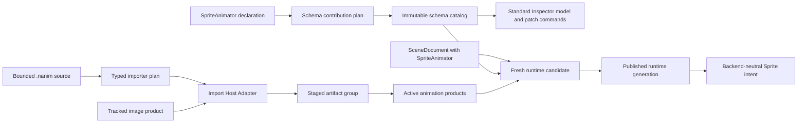
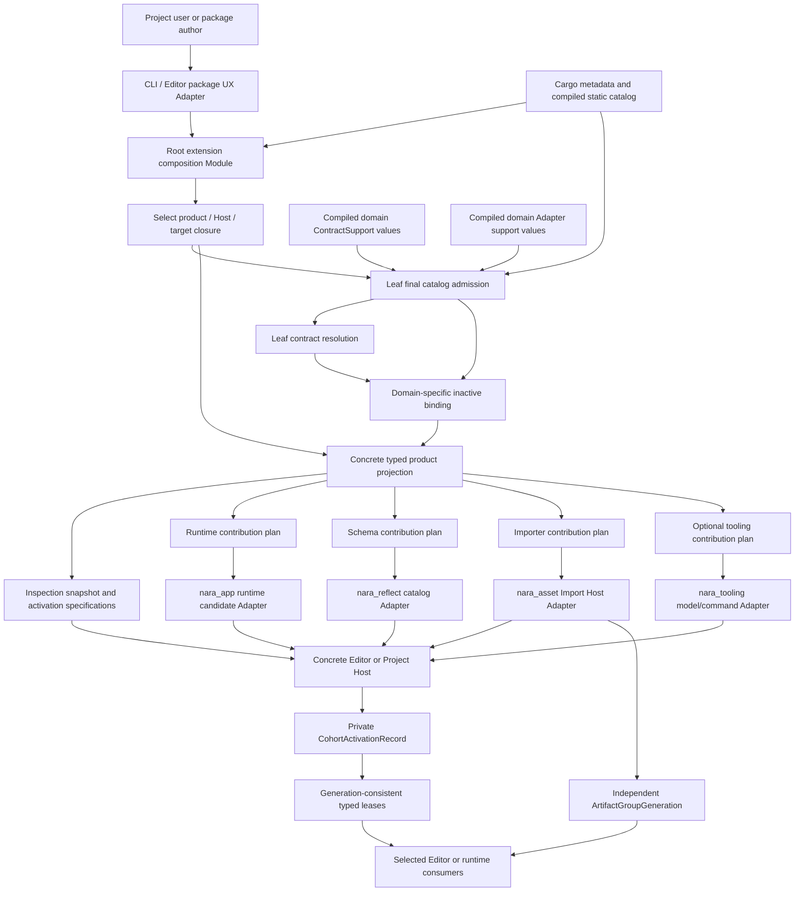

# Multi-Role Extension Package Tracer Interface Design

**Status**: Design Draft - scenario workbench, not an accepted compatibility promise

**Created**: 2026-07-13

**Last Updated**: 2026-07-14

**Owner**: source package composition, runtime, schema, asset import, tooling, and concrete product Hosts

**Authority**: Non-normative design harness. Accepted ADRs remain authoritative on conflict.

**Upstream Designs**: [Source Extension Package Interface Design](source-extension-package-interface-design.md), [Runtime Composition Interface Design](runtime-composition-interface-design.md)

**Focused Interfaces**: [Extension Contract Kernel Interface Design](extension-contract-kernel-interface-design.md), [Asset Import Host Interface Design](asset-import-host-interface-design.md)

**Concept Guide**: [Extension Package Concept Guide](extension-package-concept-guide.md)

**Research Context**: [Extension Ecosystem Research](../knowledge/engineering/extension-ecosystem-engine-research.md)

**Related ADRs**: [0003](adr/0003-own-app-plugin-and-schedule-lifecycle.md), [0007](adr/0007-asset-identity-and-import-pipeline.md), [0015](adr/0015-editor-tooling-and-dogfooding-boundary.md), [0016](adr/0016-extension-seams-for-backends-and-domain-modules.md), [0042](adr/0042-runtime-service-and-backend-boundary.md), [0045](adr/0045-component-schema-capability-metadata.md), [0046](adr/0046-plugin-metadata-and-default-plugin-groups.md), [0049](adr/0049-untrusted-project-input-and-parse-budget-policy.md), [0050](adr/0050-asset-root-symlink-junction-and-package-trust-policy.md), [0052](adr/0052-task-backpressure-cancellation-and-long-running-diagnostics.md), [0070](adr/0070-capability-oriented-filesystem-substrate.md), [0080](adr/0080-domain-owned-task-update-integration-sets.md), [0081](adr/0081-schema-source-stable-identity-catalog-and-runtime-binding.md), [0082](adr/0082-process-host-authority-and-runtime-construction-topology.md), [0086](adr/0086-rust-project-build-and-executable-generation.md), [0087](adr/0087-asset-dependency-import-product-and-artifact-publication-graph.md), [0090](adr/0090-unavailable-schema-and-lossless-authoring.md), [0093](adr/0093-rust-authoring-hot-iteration-and-optional-scripting-adapters.md)

## Purpose

This document turns the general package direction into one concrete pressure test. It asks what a
third-party `nara_sprite_animation` source extension package would need to provide all of the
following without receiving a universal engine context:

- persistent sprite-animation authoring data and stable schemas;
- import of a small animation source format into typed asset products;
- runtime animation behavior through Nara's normal `Plugin` and schedule lifecycle;
- standard Inspector editing with no package-specific editor code;
- a later custom Inspector or preview tool without direct workspace or renderer authority;
- coherent add, update, failure, removal, and last-good behavior across Editor, Import, and Runtime
  Hosts;
- clean release and server graphs that do not retain importer or editor dependencies.

The tracer is a design harness, not a commitment to build sprite animation next. Its job is to make
bad Interface shapes fail while change remains inexpensive. Every illustrative Rust type and method
name may be replaced. The ownership, mutation, identity, and failure invariants are the durable
subject of this draft.

The first activation experiment folds several logical Host roles into one concrete executable
Host. It does not promise an atomic transaction across editor, import-worker, and runtime
processes. A future process Adapter may reuse semantic plans, but it gains no single-process
publication guarantee without a separate protocol decision and conformance evidence.

## How To Use This Harness

Every proposed package or domain Interface must be evaluated against named `MT` scenarios in this
document. For each proposal:

1. identify its caller and the minimum facts that caller must know;
2. state which Module owns the Interface and where its seam lives;
3. classify every dependency as in-process, local-substitutable, remote-but-owned, or truly
   external;
4. distinguish pure planning from candidate mutation and active publication;
5. show the nearest Bevy, Godot, Unity, or Unreal concept and where the comparison stops;
6. test through observable Interface results rather than private maps or builder internals;
7. reject a public Adapter until a second real implementation or concrete isolation requirement
   proves the seam;
8. delete a wrapper whose removal would make complexity disappear rather than redistribute it to
   callers.

## Concept Crosswalk

The comparisons below are orientation aids. Nara does not inherit another engine's object model,
managed runtime, binary ABI, or package resolver.

| Nara concept | Closest mature-engine concept | Where the comparison stops |
|---|---|---|
| Source extension package | Bevy Cargo crate plus manual registrations; Godot addon; Unity UPM package; Unreal `.uplugin` | Cargo remains Nara's only Rust graph and lock authority; one Nara package declares several typed roles above that graph |
| Runtime contribution | Bevy `Plugin`; Unreal Runtime module; Godot runtime class or native extension initialization | It configures one fresh runtime candidate and cannot discover or install editor/import roles |
| Schema contribution | Bevy reflection/type data; Godot ClassDB properties; Unity serialized fields; Unreal UHT properties | Durable Nara identity uses stable schema and field IDs rather than Rust `TypeId`, type paths, object pointers, or property names |
| Import contribution | Bevy `AssetLoader`; Godot `EditorImportPlugin`; Unity `ScriptedImporter`; Unreal Interchange provider | Nara plans importers before jobs, gives jobs only tracked bounded inputs, and lets the Import Host publish artifact groups |
| Standard Inspector | Unity default Inspector; Godot property Inspector; Unreal reflected Details panel | Inspectability follows Nara schema capabilities and edits lower to validated patches; a package does not register a forwarding wrapper |
| Custom Inspector contribution | Godot `EditorInspectorPlugin`; Unity `CustomEditor`; Unreal Details customization | Selection uses stable schema IDs, the model is UI-toolkit-neutral, and the provider receives no mutable object, `World`, or workspace |
| Typed plan | Bevy `PluginGroupBuilder`; Unity assembly selection; Unreal target module selection | A Nara plan is pure, immutable, stable-ID based, fingerprinted, and closed before factories or Host authority run |
| Contribution contract | Bevy `Plugin`/`AssetLoader`, Godot specialized editor child plugins, Unity importer/editor base types, Unreal module/provider Interfaces | The stable contract coordinates one domain declaration and typed plan; it is not a universal executable trait |
| Static compiled binding | Explicit Bevy construction, Godot entry/class registration, Unity assembly discovery, Unreal module startup registration | Nara binds a declared contribution key to one verified static Rust provider generation without claiming a stable dylib ABI |
| Adapter | Concrete Bevy loader/plugin, Godot editor child plugin, Unity importer/editor class, or Unreal provider/module | An Adapter occupies one real seam and receives domain-specific authority, never a universal `ExtensionContext` |
| Host role | Unity Editor/Player/import worker; Unreal Editor/Game/commandlet; Godot Editor/running project/export tool | Nara Host role also carries explicit lifecycle, process placement, target axes, authority, and publication ownership |
| Activation cohort | Bevy's startup-ready barrier and mature engines' reload/restart flows are partial analogies | Nara groups only the members selected by one concrete activation intent; ordinary asset reimport is a separate publication axis |
| Cohort activation record | Unity domain reload, Unreal module/restart, and Godot editor/run reload are partial analogies | The record is a concrete Host-private audit/publication root; consumers receive typed leases rather than querying it as a service locator |

Bevy supplies the closest desired Rust authoring ergonomics. Unity and Unreal supply the strongest
package-above-multiple-roles precedent. Godot supplies precise importer and Inspector precedents,
but its broad `EditorPlugin` gateway is intentionally not copied.

## Problem

A runtime-only hello-world plugin cannot test the expensive extension seams. It says nothing
about whether an Editor can inspect a package before executing code, whether import-only code is
absent from shipping products, whether a schema remains available when a native provider is
missing, or whether a failed update exposes mixed generations.

The opposite extreme is also dangerous. A speculative package manager, stable Rust dynamic ABI,
generic `ExtensionHost`, central `Contribution` enum, or editor-wide mutable context would freeze
large Interfaces before Nara has one external package.

The tracer therefore needs enough domain pressure to prove real seams while remaining small enough
that failures identify Interface problems rather than animation-feature complexity.

## Goals

1. Preserve a one-call direct Rust path for game-owned code.
2. Give a reusable package one explicit static registration that covers all compiled Host roles.
3. Keep the source package declaration inspectable before package code or native factories run.
4. Make wrong-contract bindings Rust type errors where possible and bounded admission diagnostics
   otherwise.
5. Produce typed plans owned by `nara_app`, `nara_reflect`, `nara_asset`, and `nara_tooling` rather
   than one universal executable plan.
6. Prove that standard schema capabilities provide useful Inspector behavior without custom editor
   code.
7. Force import jobs through one shared Import Host instead of copying asset-type-specific task
   pipelines.
8. Keep runtime data backend-neutral and importer/editor code absent from unselected product graphs.
9. Make update, cancellation, stale result, cleanup, and last-good behavior observable.
10. Give CLI, editor UI, AI automation, and tests the same immutable plan and diagnostic facts.

## Non-Goals

- Freeze the physical package manifest location or exact Cargo metadata syntax.
- Implement a package registry, marketplace, signing infrastructure, or dependency solver.
- Define a stable Rust dylib ABI, linker inventory, or universal process extension protocol.
- Build Aseprite support, a full animation editor, a renderer viewport, or a runtime UI toolkit.
- Add a custom Inspector merely to prove that a callback can be registered.
- Add a no-op cook provider when the normal artifact-to-runtime-content path is sufficient.
- Promise in-place hot reload for structural Rust, schema, feature, or package-graph changes.
- Treat trusted native Rust as sandboxed because Nara withholds its own capabilities.

## Evidence Levels

This document uses three evidence labels so a future sketch is not confused with repository state.

| Label | Meaning | Tracer relevance |
|---|---|---|
| Implemented | Source and tests currently prove the Interface | May be used as a baseline without claiming package-level guarantees |
| Settled, pending | An accepted ADR fixes the direction, but complete source evidence is absent | The tracer must preserve the direction and expose missing work |
| Proposed | This or an upstream design is still selecting an Interface | Use only as a testable sketch; do not promise compatibility |

### Current Ground Truth

| Area | Evidence | Current limitation exposed by the tracer |
|---|---|---|
| `nara_app` plugin lifecycle | Implemented: fallible `preflight`, `build`, `finish`, poison, and reverse once-only cleanup | Current plugin groups mutate `App`, keep a parallel metadata member list, and are not yet closed data-only product plans; package runtime helpers must wait for U4 |
| `nara_reflect` registry | Implemented: a frozen registry containing native codecs and migrations, plus an immutable public snapshot that currently exposes only the schema catalog | The registry still combines schema catalog, native binding, codec/migration, and App lifecycle concerns; package schema helpers must target an immutable fragment/candidate seam instead of the mutable registry |
| Standard scene Inspector | Implemented: schema-driven models, capability filtering, patch commands, and undo path | No general custom Inspector provider catalog exists |
| Importer descriptor and registry | Implemented in part: importer identity, extensions, conflict rejection, and artifact record selection | The registry stores untyped live importers, repeats metadata authority, and is transitional; the target associated-type `Importer`/`ImportContext` Interface replaces both current importer traits and later deletes this lookup seam |
| Editor workspace ownership | Transitional: workspace and Play state are currently exposed through tooling resources and World-facing helpers | The intended concrete Editor Host must own workspace/document authority outside the simulation World; package Inspector/tooling providers must not use the current resource/plugin as their seam |
| Image reload jobs | Transitional implementation | `nara_image` privately owns job queues and currently performs direct filesystem reads; this must not become the third-party importer pattern |
| Filesystem capability substrate | Settled, pending overall; implemented primitives include handle-relative open, scoped identity, digest, lock, temp/replace, and sync receipts | Enumeration, rename/unlink recovery, Host trust binding, and domain migration remain incomplete; Import consumes brokered capabilities/snapshots |
| Runtime composition plan | Settled, pending by ADRs 0010/0046/0079 and the runtime composition workbench | Static declarations, data-only groups, definition keys, pure closure, and closed commit remain unimplemented |
| Package manifest, compiled bindings, typed package plans, cohort | Proposed by the source extension package workbench | No source type should be described as implemented or compatibility-stable |

The implemented reference-game pattern, where a plugin preflights schemas, registers them, and adds
systems, is the code-first baseline. The tracer should deepen the product path around that behavior,
not fork it into a second semantic implementation.

## The Tracer Package

### Why Sprite Animation

`nara_sprite_animation` is small but crosses four useful domains:

- authoring intent belongs in persistent component data;
- animation clips are typed assets with source dependencies;
- a runtime system owns playback behavior;
- schema metadata is sufficient for a useful initial Inspector.

The first source format should be a small bounded `.nanim` document owned by the tracer, not
Aseprite or another complex external format. It contains at least two named clips and a semantic
reference to an image product. That is enough to pressure stable imported-product identity,
dependency tracking, reimport, schema editing, runtime lookup, and update publication without
making binary decoding the dominant problem.

### Domain Data

The illustrative domain split is:

```text
SpriteAnimator
|- semantic AssetRef to a clip or animation library product
|- initial clip/tag
|- autoplay
|- looping policy
`- playback speed

SpriteAnimationPlaybackState
|- resolved runtime Handle
|- current frame
|- elapsed game time
|- observed asset generation
`- runtime-only transition state

SpriteAnimationClipAsset
|- stable source/import product identity
|- image product reference
|- frame regions
|- per-frame durations
`- named events/tags only when a real game needs them
```

Persistent data never stores runtime `Entity`, `AssetId`, `Handle<T>`, backend texture handles,
editor widget state, or absolute paths. Playback cursor and elapsed time are runtime-only unless a
separate save policy explicitly admits them later.

The tracer should expand `ComponentValue` or structured-data support when its real semantic fields
require it. It must not replace `AssetRef`, enums, or structured values with opaque integers merely
to fit a temporary codec limitation.

### Data Flow



The importer owns no runtime `App`; the runtime owns no source-file access; the Inspector owns no
document mutation authority; and the sprite-animation domain owns no wgpu objects.

### Initial Physical Shape

Start with one Cargo package and role-focused Rust Modules:

```text
nara_sprite_animation
|- data       stable IDs, SpriteAnimator, clip asset values
|- runtime    systems and runtime Plugin definitions
|- import     importer definition and typed job logic
|- package    generated declaration locators and PackageDefinition assembly
`- tooling    absent initially; optional later custom Inspector model
```

This is a physical experiment, not a durable claim that one crate is always correct. Runtime,
import, and tooling features must still produce separate Cargo closures for release, server,
editor, and import Hosts. Split facade/runtime/import/tooling crates only when `cargo tree`, binary
contents, build time, target incompatibility, or dependency cycles prove that module and feature
separation is insufficient. Package consumers must not observe that physical split through a
different product Interface.

### Initial Contribution Set

| Contribution | Contract and closest analogy | Selected Hosts | Authority | Tracer selection |
|---|---|---|---|---|
| `schema.sprite-animator` | Nara schema provider; Bevy type data, Godot ClassDB, Unity serialization, Unreal UHT analogy | Editor catalog and runtime candidate; target-independent declaration | None during planning; runtime native binding is candidate-local | Required tracer contribution |
| `import.sprite-animation` | Nara import provider; Bevy `AssetLoader`, Godot `EditorImportPlugin`, Unity `ScriptedImporter`, Unreal Interchange analogy | Editor/import worker execution target; produces backend-neutral subject artifacts | Tracked source/dependency reads and artifact staging only | Required tracer contribution |
| `runtime.sprite-animation` | Nara runtime plugin; Bevy `Plugin` or Unreal Runtime module analogy | Client runtime and Editor Play; headless test when selected | Normal resolved `App` mutation inside an unpublished candidate | Required tracer contribution |
| standard Inspector projection | Unity default Inspector and Godot property Inspector analogy | Editor | Immutable schema/value projection in, validated patch command out | Derived behavior, not a contribution |
| `inspector.sprite-animation` | Godot `EditorInspectorPlugin`, Unity `CustomEditor`, Unreal Details customization analogy | Editor | No direct workspace, `World`, filesystem, renderer, or toolkit authority | Deferred until standard Inspector proves insufficient |

The default cook path consumes normal imported products. The package must not declare a cook
contribution until a real target-specific transformation, compression, validation, or packaging
policy exists.

## Contract Scenarios

### Common Authoring And Consumption

| ID | Caller and goal | Required Interface behavior | Primary oracle |
|---|---|---|---|
| MT-01 | Game author uses the feature in code-first embedding | One plugin-group call installs the same schema/runtime definitions; no package ceremony is required | Public example and semantic runtime test |
| MT-02 | Package author exposes all compiled roles | One `package()` registration uses stable declaration locators plus domain helpers; the helpers privately construct typed binding claims and final catalog verification privately mints contribution keys; no per-Host manual order list | Compile fixture and plan snapshot |
| MT-03 | Project user inspects before build | Preview reports identity, source, license, trust evidence, roles, targets, rebuild effects, and unknown binding facts without executing package code | No-execution preview test |
| MT-04 | Project user adds or updates the package | One CLI/editor action previews Cargo changes and all selected Host effects before explicit consent | Golden UX model |
| MT-05 | External package renames its Nara dependency | Ordinary Rust helpers and derive paths continue to work without a privileged workspace relationship | Clean-room fixture |
| MT-06 | Package author avoids macros | A complete ordinary-Rust declaration and binding path compiles; macros remain optional ergonomics | Compile fixture |

### Domain Behavior

| ID | Caller and goal | Required Interface behavior | Primary oracle |
|---|---|---|---|
| MT-10 | Editor opens `SpriteAnimator` fields | Stable schema IDs and capabilities produce a standard Inspector with no custom provider | Inspector model fixture |
| MT-11 | Editor edits animation intent | Edits become schema-aware patches with revision guards, inverse patches, validation, and undo | Patch/undo integration test |
| MT-12 | Import Host imports `.nanim` | Job reads only bounded snapshots and tracked image products, records bounded outputs in `ImportContext`, and returns typed success/failure; after physical exit the Host seals the context and privately constructs the complete candidate | Import recipe and artifact fixture |
| MT-13 | Import source defines several clips | Stable product IDs survive source reordering and unrelated edits; removed products follow explicit reconciliation | Reimport fixture |
| MT-14 | Runtime consumes an imported clip | Runtime uses typed handles and backend-neutral sprite intent; no importer or filesystem Interface is reachable | Headless semantic test and boundary search |
| MT-15 | Package provider is unavailable | Editor preserves unavailable component records losslessly; runtime spawn rejects before `World` mutation when a required binding is absent | ADR 0090 fixture |
| MT-16 | Standard Inspector is semantically weak | A later custom provider targets stable schema IDs and returns normal tooling intents/patches | Foreign-schema provider fixture |

### Planning And Admission

| ID | Caller and goal | Required Interface behavior | Primary oracle |
|---|---|---|---|
| MT-20 | Resolver receives equivalent inputs | Declaration order permutations produce the same typed plans and fingerprints | Repeated property test |
| MT-21 | Package passes a runtime declaration locator to the importer helper | Contract-locator mismatch returns a bounded authoring error; an incompatible provider/factory type fails to compile where expressible; no package-authored typed key exists | Compile-fail and author-report fixtures |
| MT-22 | Manifest and static catalog disagree | Missing, extra, wrong-contract, stale-generation, or digest-drift binding rejects before factory construction | Binding fault matrix |
| MT-23 | Another package claims `.nanim` | Importer domain reports an explicit conflict; registration order never selects a winner | Import plan test |
| MT-24 | Editor Host compiles import code for a native build machine | Execution target and subject product target remain separate in preview, plan, recipe, and diagnostics | Cross-target plan fixture |
| MT-25 | Required contract Adapter is absent | Final admission rejects with package/contribution/contract/Host facts and a concrete rebuild action | Host catalog fixture |
| MT-26 | Native code requests authority | Preview states trusted-native limits; final policy admits only domain grants and never describes in-process Rust as sandboxed | Trust snapshot fixture |

### Candidate, Update, And Failure

| ID | Caller and goal | Required Interface behavior | Primary oracle |
|---|---|---|---|
| MT-30 | Editor activates provider catalogs | `EditorCatalogActivation` selects schema, importer-provider, and optional tooling candidates for one concrete executable Host; it does not start Play | Catalog cohort integration test |
| MT-31 | Editor starts Play | `PlayRuntimeActivation` captures a compatible package/schema/artifact generation and publishes only a genuinely prepared runtime, never a blueprint placeholder | Play start integration test |
| MT-32 | Schema candidate fails during catalog activation | No member of the selected new catalog cohort becomes active; ordinary artifact generations remain on their independent axis | Fault injection |
| MT-33 | Ordinary content reimport fails | No new artifact-group generation publishes; the active package/provider cohort is unaffected and the old artifact remains available | Import compatibility fixture |
| MT-34 | Linked package/runtime replacement fails | Candidate `App` is poisoned and cleaned; no selected replacement cohort or runtime publishes | Runtime candidate fault test |
| MT-35 | User cancels or a newer attempt supersedes work | Cancellation is cooperative; late results are generation-rejected and staged outputs retire or quarantine | Cancellation/stale-result test |
| MT-36 | Cleanup cannot prove terminal retirement | Host-owned failed owner and parent authority remain retained; conflicting replacement is blocked | Timeout/retirement fixture |
| MT-37 | Active revision changes before final publication | Expected-generation check rejects the stale candidate and retains the current active cohort | Concurrent update test |
| MT-38 | Package is removed while documents reference its schema | Removal preview reports blockers; degraded authoring preserves data instead of stripping unknown records | Removal fixture |

### Product Isolation And Iteration

| ID | Caller and goal | Required Interface behavior | Primary oracle |
|---|---|---|---|
| MT-40 | Release client uses sprite animation | Runtime/data code is present; editor, import worker, and toolkit dependencies are absent | `cargo tree` and binary/dependency audit |
| MT-41 | Dedicated server does not select visual animation | Runtime/import/editor roles and their capabilities are absent unless explicitly requested by server gameplay | Server feature fixture |
| MT-42 | Author edits `.nanim` data | Reimport and stable-handle update require no Rust compile and preserve last-good on failure | Iteration integration test |
| MT-43 | Author edits component values | Patch/undo/live projection follows normal authoring flow and does not reconstruct package plans | Editor workflow test |
| MT-44 | Author edits a compatible Rust function body | Optional patching follows ADR 0093 capability detection; otherwise incremental rebuild starts a fresh runtime | Development-mode fixture |
| MT-45 | Author changes schema, features, or package topology | A new executable/catalog generation and fresh runtime are required; no in-place ABI or state-migration claim appears | Structural-change fixture |

### Extension Growth

| ID | Caller and goal | Required Interface behavior | Primary oracle |
|---|---|---|---|
| MT-50 | Engine adds a new contribution contract | Leaf kernel gains no central enum variant or domain match; the domain owner and supporting Host register the contract | Diff review and test contract |
| MT-51 | Package B customizes package A's schema | Stable schema-ID selection avoids Rust orphan-rule coupling and direct target-type ownership | External custom Inspector fixture |
| MT-52 | CLI, egui, and AI edit the same value | All consume the same tooling model and produce semantically identical commands | Cross-Adapter command test |
| MT-53 | Import later gains an isolated process Adapter | It runs the same semantic conformance suite plus protocol, kill/reap, late-result, and containment tests | Dual-Adapter conformance suite |
| MT-54 | Package later needs a custom animation preview | A UI-neutral editor-tool model is proven before a toolkit or render-session Interface is generalized | Editor dogfood scenario |

### Scenario Admission Classes

The scenarios are not one implementation ticket. Their admission class controls when they may
shape public Interfaces:

| Class | Scenarios | Meaning |
|---|---|---|
| Initial admission | MT-01, MT-02, MT-06, MT-10 through MT-12, MT-14, MT-20 through MT-23, MT-25, MT-40, MT-41 | Minimum evidence for the first in-repository tracer and package-author Interface |
| Later validation | MT-03 through MT-05, MT-13, MT-15, MT-24, MT-26, MT-30 through MT-38, MT-42, MT-43, MT-45, MT-50, MT-52 | Product workflow, update, external-package, multi-product, and lifecycle evidence after the initial seam exists |
| Deferred extension | MT-16, MT-44, MT-51, MT-53, MT-54 | Custom Inspector, body patching, foreign-schema tooling, process placement, and preview Interfaces wait for their named pressure |

The first tracer Definition of Done is deliberately smaller than this document:

1. one private canonical definition source lowers into both the direct plugin group and package
   registration;
2. schema fragment fingerprints, complete admitted plugin definition keys, schedule placement, and
   headless semantic snapshots agree across those two paths;
3. the standard Inspector edits `SpriteAnimator` through existing patch and undo behavior without a
   custom provider;
4. a minimal shared Import Host replaces asset-type-owned filesystem/task/publication loops for the
   image path and the tracer importer;
5. typed binding faults reject before Nara creates a Host candidate, and runtime-only `package()`
   registration compiles without importer/tooling code;
6. release and server dependency audits prove unselected roles are absent.

Package preview UX, full activation cohorts, update/removal, multi-product identity, custom
Inspector, process isolation, preview tooling, cook, and compatible body patching are later slices.

## Recommended Module And Seam Placement



### Ownership Table

| Owner or operation | Interface | Hidden implementation | Must not own | Dependency category |
|---|---|---|---|---|
| Package Definition Module | One all-or-error `PackageDefinition` from canonical declaration locators and domain helpers | Claim aggregation, bounded author reports, duplicate checks, and opaque member storage | Product selection, final admission, Host ordering, candidate state, or publication | In-process pure computation; depends only on the leaf package-definition vocabulary |
| Leaf extension contract Module | Root-selected bounded package facts, typed claims, compiled evidence, and contract/Adapter declarations in; root-private `PendingContractBinding` values containing borrowable pure `ResolvedContract<C, PlanData>` snapshots out | Final catalog admission, private key/support/witness/transfer construction, canonical parsing, version decode orchestration, stable graph checks, plan summary, and private typed slices | Binding receipts, domain plan policy, Host mutation, or diagnostics dependency cycles | In-process pure computation; domain-independent leaf dependency |
| Final catalog admission operation | Selected canonical declarations, `BindingClaim<C>` values, compiled support/evidence, and immutable Host/target facts in; one private `FinalCatalogAdmission` bundle containing keys, both verified supports, verified Host facts, semantic witnesses, opaque inactive transfers, and one shared generation seal out | Exact declaration/claim/evidence bijection, implementation and executable drift rejection, and private constructor authority | Domain semantic resolution, factory invocation, candidate authority, or publication | Private operation of the leaf/common verifier after root selection; not a separate public service or required crate |
| Root extension composition Module | Cross-package closure, target/trust/requirement selection, verified admission/resolution/binding orchestration, inspection snapshot, concrete typed projections, and immutable activation specifications | Closure algorithms, cross-contract bridge validation, and concrete projection assembly | Cargo solving, executable authority, candidate state, publication, active coordinator, or universal plan lookup | In-process pure computation above the leaf and all selected domain Modules |
| Domain-specific binding Module | One `PendingContractBinding` owning the resolution bundle, verified Adapter support, and verified Host facts in; inactive `BoundContract` plus binding receipt out | Exact plan-version/Adapter/target/affinity join, shared-seal verification, and continuation consumption | Factory invocation, native placement, candidate readiness, or activation | In-process typed composition between semantic resolution and concrete Host candidates |
| Runtime contribution owner | Repeatable plugin definitions and lowering into the closed product plan | Slot/order/capability closure and fresh plugin declaration checks | Importer, editor, package discovery, runner, native authority | In-process |
| Schema contribution owner | Stable catalog fragment, native-binding evidence, migrations, typed schema plan | Merge, lineage, validation, Building-to-Frozen candidate | Runtime process identity as durable schema, Inspector UI, package graph | In-process |
| `nara_asset` Import Host | Importer descriptor/binding plan plus tracked domain job Interface | Import request policy, recipes, tracked-input bookkeeping, stale eligibility, product reconciliation, artifact staging/publication, artifact last-good | Executor mechanics, native filesystem authority, raw paths, private per-asset-type Host loops, runtime `App`, editor workspace | In-process planning; bounded execution through `nara_tasks`; brokered `nara_fs` capabilities and local-substitutable stores |
| Inspector/tooling contribution owner | Stable target predicate, immutable model, typed intent lowering | Provider selection, revision guards, validation, command composition | `&mut World`, mutable workspace, egui/render handles, direct document writes | In-process |
| Concrete Editor/Project Host | High-level stage/poll/outcome operation over one resolved activation intent | Retained domain-owner registry, Nara-issued capability minting, readiness barrier, cleanup coordination, predecessor active cohort, and publication | Domain candidate internals, package resolution policy, artifact last-good, or another domain's semantics | Concrete executable Host, not a public generic port |
| UI Adapter | Render tooling models and submit tooling intents | Toolkit widgets, layout, input translation | Document truth, undo stack, schema mutation, package admission | One concrete egui Adapter today; general seam waits for a second implementation |

The split between the leaf package-definition/contract Modules and root composition is a dependency
invariant, not necessarily new crates on day one. Domain crates may depend on the leaf vocabulary to
implement typed helpers. The root depends on that leaf plus the domain crates to assemble Host
projections. The leaf therefore cannot depend back on any domain or on a diagnostic crate whose
dependency graph would create a cycle. When the tracer gives the leaf multiple real production
consumers, a small leaf crate becomes justified; until then, tests should enforce the logical
dependency direction without creating a placeholder crate.

## Progressive Disclosure

| Caller | Minimum action | Visible concepts | Hidden concepts | Escalation trigger |
|---|---|---|---|---|
| Game author | Add one plugin group and author `SpriteAnimator` data | `App`, Plugin group, component fields, typed asset reference | Package manifest, contract IDs, bindings, plans, Host roles, cohorts | The code becomes an independently distributed package |
| Package author | Declare stable roles and return one ordinary-Rust `package()` registration | Package/contribution identity, domain registration helpers, exceptional target applicability | Contract slices, receipts, bound plans, Host order, candidate staging, publication | The package defines a new contract rather than using an engine-owned one |
| Domain provider author | Implement one typed Importer, Inspector, or other domain Interface | Typed settings, errors, owner-issued context, and outputs | Contract admission, task-pool mechanics, native authority internals, candidate/cohort publication | The provider defines a new domain contract or execution Adapter |
| Project user | Preview and approve one add/update/remove action | Source, version, license, trust evidence, selected roles, targets, rebuild/restart and migration effects | Rust traits, factory types, typed plans, cohort mechanics | Advanced diagnostics or an explicit policy override is required |
| Contract/domain author | Define one versioned contract owner, typed plan, resolver, and conformance suite | Declaration schema, `PlanData`, semantic rules, and conformance | Host placement, candidate state, cleanup, publication, and unrelated domain plans | A new contract is needed rather than an engine-owned one |
| Root/Host maintainer | Compose one concrete Editor/server/cook projection and own its candidate lifecycle | Product/target selection, typed projections, authority, lifecycle, and publication | Unrelated domain semantics and public universal Host traits | A second product root or placement Adapter proves another seam |

The conceptual project-user flow is deliberately shorter than the architecture behind it:

```text
nara package add games.nara.sprite-animation --preview
    -> show Cargo/source change, license, trust evidence, selected Host roles, rebuild effect
nara package apply <preview-id>
    -> explicit consent, Cargo build, final admission, concrete Host activation
```

The exact command syntax is deferred. A project user never needs to understand
`ContributionContract`, typed plan storage, binding factories, or activation cohorts to complete
the normal workflow.

## Recommended Interface Shape

### 1. Dual Authoring Entry, One Semantic Source

The common game-owned path remains close to Bevy:

```rust
let mut app = App::new();
app.add_plugins(SpriteAnimationPlugins::default())?;
```

The direct entry is one `PluginGroup`, not an overloaded package `Plugin`. One canonical compiled
domain definition owns the schema fragment, plugin declaration, stable definition ID/version,
factory binding, and runtime configuration defaults.
The source manifest separately owns durable package/contribution declarations and stable locators.
The direct group and package helper are two lowerings of the compiled domain definition; final
admission verifies that the package locator and compiled definition agree. This is one authority per
fact kind, not a claim that every fact lives in one file.

Conformance tests compare the schema fragment fingerprint, complete admitted plugin definition key,
schedule placement, and headless semantic snapshot produced by both lowerings. Importer/editor roles and
product lifecycle guarantees are intentionally different. The direct group does not install
importer, editor, or cook roles and does not promise package preview, multi-Host activation,
last-good publication, or fresh-runtime restart. Those are product-path guarantees, not hidden
behavior of `App::add_plugins`.

The reusable package path has one explicit registration:

```rust
pub fn package() -> Result<PackageDefinition, PackageAuthorReport> {
    package::define(
        generated::PACKAGE,
        (
            nara_reflect::package::schemas(
                generated::SCHEMA,
                SpriteAnimationSchemas::new,
            ),
            nara_app::package::plugins(
                generated::RUNTIME,
                definitions::runtime_plugins,
            ),
            #[cfg(feature = "import")]
            nara_asset::package::importer(
                generated::IMPORTER,
                SpriteAnimationImporter::new,
            ),
        ),
    )
}
```

This is illustrative. Its required properties are:

- `package()` is repeatable and performs no I/O, thread start, process start, `App` mutation, or
  Host capability acquisition;
- generated or handwritten locators are untyped declaration claims whose manifest fingerprint is
  checked during admission;
- domain helpers turn claims into `BindingClaim<C>` values, making provider/factory mismatches Rust
  type errors and contract-locator mismatches structured registration errors;
- only final catalog verification privately mints `ContributionKey<C>` after proving manifest,
  target, trust, executable generation, and implementation evidence;
- domain helpers construct bindings, so adding a contract does not add a package-core method;
- a factory creates fresh definition state and receives no generic context;
- package registration is explicit; no linker constructor or global inventory hides inclusion;
- ordinary Rust remains complete and proc macros are optional.

One facade `package()` entry therefore compiles in every selected Host artifact, but it aggregates
only bindings actually compiled into that artifact. An unselected role being absent is valid. A
role selected as required by the final Host plan but absent from the compiled catalog is an
admission error. Runtime-only and server compile fixtures must call `package()` successfully while
proving importer/tooling types and dependencies are absent.

The exact manifest source remains an experiment. A package-local sidecar referenced by Cargo
metadata gives the strongest pre-build preview; Rust-first generation gives stronger source
locality; generated projections from one data source may combine them. The tracer must measure
preview, drift, publishing, and authoring costs before ADR adoption.

### 2. Open Contract Kernel, Domain-Owned Helpers

The focused
[Extension Contract Kernel Interface Design](extension-contract-kernel-interface-design.md)
supersedes the earlier domain-rich trait sketch. The leaf marker establishes type relationships;
domain resolution and Host binding remain above it:

```rust
pub trait ContributionContract: Sized + 'static {
    const CONTRACT: ContributionContractRef;

    type Declaration: 'static;
    type CompiledDefinition: 'static;
    type DecodeError: 'static;
}

pub struct ContractDefinition<C, PlanData, ResolveError>
where
    C: ContributionContract,
    PlanData: CanonicalContractPlan,
{
    decoders: DescriptorDecoderTable<C>,
    canonical_declaration_version: DeclarationVersion,
    resolve: fn(ContractSlice<C>) -> Result<PlanData, ResolveError>,
}

pub struct ContractSupport<C, PlanData, ResolveError>
where
    C: ContributionContract,
    PlanData: CanonicalContractPlan,
{
    definition: ContractDefinition<C, PlanData, ResolveError>,
    owner: VerifiedContractOwner<C>,
}

impl PreparedPackageSet {
    pub fn resolve_contract<C, H, PlanData, BoundPlan, ResolveError, BindError>(
        &self,
        admission: FinalCatalogAdmission<
            C,
            H,
            PlanData,
            BoundPlan,
            ResolveError,
            BindError,
        >,
        request: ContractRequest<C>,
    ) -> Result<
        PendingContractBinding<C, H, PlanData, BoundPlan, BindError>,
        ContractResolveError<C::DecodeError, ResolveError>,
    >
    where
        C: ContributionContract,
        H: HostBindingKind,
        PlanData: CanonicalContractPlan + 'static,
        BoundPlan: 'static,
        ResolveError: 'static,
        BindError: 'static;
}
```

Generated manifest projection produces an untyped `DeclaredContribution`, not a publicly
constructible typed key. A domain helper turns that locator into `BindingClaim<C>`. Final catalog
verification alone returns the private kernel-defined `FinalCatalogAdmission` bundle after checking
the canonical manifest, declaration digest, Host/target applicability, executable generation, and
implementation evidence. The bundle carries private `ContributionKey<C>` values, both verified
support types, verified Host binding facts, semantic witnesses, opaque inactive transfer, and one
shared composition-generation seal. This avoids teaching the generator Rust marker paths, treating
generated constants as verified truth, or letting root combine evidence from different admissions.

`ContractDefinition<C, PlanData, ResolveError>` supplies exact wire-version decoders, explicit
migrations, and one non-capturing pure resolver function pointer. The root-verified support prevents
callers from pairing its evidence with an arbitrary capturing closure; inventing a stable ID grants
nothing. It is not an Adapter and cannot activate code or acquire authority. The leaf performs
common structural preflight before a domain decoder runs, so a decoder cannot ignore the Host's
byte, shape, string, reference, and diagnostic ceilings.

`ContractSlice<C>` contains immutable facts, decoded typed declarations, and a semantic
binding-presence witness. Implementation/executable evidence stays in the opaque transfer and later
binding receipt. The slice contains no callable factory/provider, `App`, `World`, workspace,
file/process/thread/clock authority, renderer, generic executable lookup, or callback that can
activate code. Matching executable values remain in an opaque inactive transfer retained by the
leaf until semantic resolution succeeds.

The support-owned non-capturing resolution operation hides selection validation, typed binding
bijection, exact version decode, canonical ordering, private slice-witness retention, plan-summary
validation, and receipt issuance. `PlanData` is pure, fingerprintable, exact-schema-versioned, and
placement-independent.
The leaf consumes one `FinalCatalogAdmission` and returns a `PendingContractBinding` containing the
pure `ResolvedContract<C, PlanData>` snapshot, root-private sealed continuation, verified Adapter
support, and verified Host facts under the same seal. A separate concrete Host binder consumes that
whole value, moves inactive wrappers into the domain-specific inner `BoundPlan`, and returns a full
`BoundContract` with `ContractBindingReceipt<C, H>`. It invokes no factory. Actual placement and
activation remain later concrete Host work.

Semantic resolution and Host binding keep the public stages narrow:

```text
leaf contract Module
    -> PreparedPackageSet with bounded envelopes
root composition Module
    -> calls leaf resolve_contract with one FinalCatalogAdmission and ContractRequest<C>
leaf contract Module
    -> privately validates selection, binding bijection, versions, and limits
    -> privately constructs ContractSlice<C> and invokes the support-owned resolver
    <- returns PendingContractBinding<C, H, PlanData, BoundPlan, BindError>
       |- ContractResolutionBundle with pure ResolvedContract and opaque continuation
       |- verified Adapter support
       `- verified Host facts under the same private seal
concrete Host binding Module
    -> consumes the complete pending binding and verifies every shared seal
    -> moves the opaque inactive transfer into the domain-specific BoundPlan payload
    <- constructs BoundContract<C, H, PlanData, BoundPlan> with both receipts
```

`ContractResolutionReceipt<C>` contains semantic contract/version/plan facts only;
`ContractBindingReceipt<C, H>` separately contains verified Adapter, implementation, target, and
affinity evidence. Neither contains a plan object or proves activation. `ContributionContract` is
`Sized`; no implementation attempts
`Box<dyn ContributionContract>`. Limited type erasure may route bounded descriptor envelopes and
binding receipts inside one executable, but erased plan storage, `Any`, public `get<T>()`, and
string downcasts are forbidden. Domain errors are mapped to structured diagnostics above the leaf
so the leaf does not create a dependency cycle.

Domain crates provide author-facing helpers without expanding the kernel. A third-party contract
requires an owner, exact version/decode path, canonical typed plan, conformance suite, and an
explicitly compiled supporting Host. A stock Host may preview an unknown bounded declaration, but
required execution fails admission until support is compiled and the Host is rebuilt.

### 3. Host-Specific Typed Projections

`ResolvedProjectSemanticsView<'_>` is a root-private borrowed inspection and coordination view over
the nested resolved fields inside the move-only pending bindings, not a second owner or a public bag
of arbitrary plans. Concrete roots return only their typed projections. Conceptually:

```rust
struct EditorProjectProjection {
    inspection: ExtensionInspectionSnapshot,
    schemas: BoundSchemaContract,
    importers: BoundImportContract,
    tooling: Option<BoundToolingContract>,
    play_runtime: BoundRuntimeContract,
    cohort: ActivationCohortSpec,
}

struct ServerProjectProjection {
    inspection: ExtensionInspectionSnapshot,
    schemas: BoundSchemaContract,
    runtime: BoundRuntimeContract,
    cohort: ActivationCohortSpec,
}
```

The root derives the bounded owned `ExtensionInspectionSnapshot` by borrowing the semantic view and
canonicalizing author-visible facts. It does not clone typed `PlanData`. Binding then consumes each
complete pending value. Every `Bound*Contract` field denotes the full
`BoundContract<C, H, PlanData, BoundPlan>` owner, not only its private domain-specific `BoundPlan`
payload, and therefore retains the original plan value plus both receipts.

The advanced product-root Interface is concrete and root-specific:

```rust
let projection = editor_root.compose(request, packages)?;
let attempt_id = editor_host.stage_extension_update(intent, projection, snapshot)?;
```

`compose` completes admission, semantic resolution, inactive binding, and typed projection. It does
not prepare candidates, own cancellation, or publish a cohort. `ResolvedProjectSemanticsView<'_>`
and `PendingContractBinding` remain advanced root-internal values.

These names and fields are illustrative. Editor, server, import, and release-tool Interfaces are
allowed to differ. A universal `EngineHost` would hide meaningful lifecycle and authority
differences. Every `Bound*Contract` remains inactive and proves no candidate readiness or
publication.
Public tooling inspects a stable snapshot; it does not navigate private executable plan storage.

### 4. Schema Contribution

One semantic schema source feeds both paths:

```rust
fn sprite_animation_schemas() -> SpriteAnimationSchemas {
    SpriteAnimationSchemas::new().persistent::<SpriteAnimator>()
}
```

The direct plugin group wraps that provider for code-first registration. The package schema
contract lowers it into a catalog fragment and native-binding evidence. Editor catalog Hosts can
inspect the stable schema without starting gameplay. Every executable runtime validates its native
Rust binding independently; process-local Rust `TypeId` never becomes cross-process identity.

The schema plan closes before the runtime plugin runs. A runtime plugin may require the schema
contribution, but it cannot hide schema discovery or mutate a closed package plan from `build`.

### 5. Import Contribution And Shared Host

The focused [Asset Import Host Interface Design](asset-import-host-interface-design.md) supersedes
the earlier provider-returned candidate sketch. The current `TypedImporter<T>` remains useful
evidence but is not the final provider catalog:

```rust
pub trait Importer: Send + Sync + 'static {
    type Settings: ImportSettings + Send + Sync + 'static;
    type Error: Send + 'static;

    fn import(
        &self,
        context: &mut ImportContext<'_>,
        settings: &Self::Settings,
    ) -> Result<(), Self::Error>;

    fn map_error(
        error: &Self::Error,
        sink: &mut ImporterFailureSink<'_>,
    );
}
```

Importer metadata comes from the verified package contribution rather than a duplicate
`descriptor()` method. The target trait replaces the current `Importer` / `TypedImporter<T>` pair
rather than adding a third path. Required `map_error` writes through a bounded Host-owned sink, so
error mapping has one explicit source and cannot stringify arbitrary payloads. The first
`package::importer` helper captures a repeatable `Fn() -> I + Send + Sync + 'static` factory for
`I: Importer`; the concrete threaded Adapter privately erases associated settings/error types while
retaining those already-proven bounds. A local affine or process Adapter requires a distinct
advanced compiled-binding helper/marker and remains reserved until a real lane-owned registry,
Send-safe route mailbox, physical-exit receipt, and ADR 0080-equivalent poll snapshot are proven.
The leaf package kernel performs none of this erasure.

`ImportContext` is a domain-specific seam, not an engine context. It exposes only:

- immutable authorized source bytes and metadata;
- tracked source, product, absence, and bounded query observations;
- typed single/multi-product output plus streaming-capable attempt staging;
- byte, count, depth, time, and cancellation budgets;
- privacy-safe structured diagnostics.

It does not expose raw paths, ambient `std::fs`, `DirectoryCapability`, environment iteration,
wall-clock policy, mutable `World`, global `AssetServer`, editor workspace, or process creation.
The Host uses `nara_fs` authority to produce the snapshots and receipts consumed by this Interface.

The `nara_asset`-owned Import Host owns importer selection, domain request policy, tracked-input
bookkeeping, stale-result eligibility, reconciliation, artifact staging/publication, and artifact
last-good policy. It submits bounded work through `nara_tasks` and consumes Host-brokered `nara_fs`
capabilities and immutable snapshots; it does not own executor mechanics or native filesystem
authority. The package importer owns decoding and domain validation.

The provider returns only typed success/failure. After its task closure physically returns, the
Host seals the context and privately constructs `ArtifactGroupCandidate` from the exact observation
ledger, product continuity claims, dependency drafts, generation/evidence facts, and opaque staged
member receipts. The provider cannot construct, publish, commit, or reopen a candidate.
Logical task terminal does not release provider/catalog/staging ownership; a separate per-attempt
physical-exit receipt does. One artifact authority composes an exact Host writer-lock receipt with
the unmodified filesystem replace receipt. Cooperative mode covers participating Nara writers
only; strict mode requires strong CAS or separately proven root exclusion. An in-memory expected
generation is not cross-process conflict protection.

Once `ImageImporter` is migrated to this shared tracked-input provider contract and the tracer
implements the same contract, they will provide two real in-process provider implementations. A
second asset type must not copy `nara_image`'s transitional private spawn/poll/apply pipeline.
These two providers still do not prove an in-process-versus-process Adapter seam. Keep any worker
port private until a real isolated Adapter exists.

### 6. Standard And Custom Inspector

`inspect + edit` schema capabilities automatically produce the first useful Inspector. This is a
deep Module: one schema declaration yields models, validation, patching, and undo across every
eligible component. A package-specific forwarding provider would be shallow and is rejected.

Only proven semantic interaction such as coordinated clip/range edits may admit a custom provider.
If that happens, the provider catalog must have an object-safe domain shape rather than an
associated intent type that cannot enter a heterogeneous catalog. An illustrative future shape is:

```rust
pub trait InspectorProvider: 'static {
    fn project(
        &self,
        input: ComponentInspectorRead<'_>,
    ) -> Result<InspectorFragment, InspectorProviderFailure>;

    fn lower(
        &self,
        input: ComponentInspectorRead<'_>,
        intent: InspectorIntentEnvelope,
    ) -> Result<InspectorEditBatch, InspectorProviderFailure>;
}
```

Target schema/field predicates, provider identity, and operation schema belong to the canonical
package contribution and verified tooling plan; the provider must not repeat them through a
`target()` method. `InspectorIntentEnvelope` is tooling-owned and versioned by provider ID,
operation ID, bounded arguments, authorized document/selection identity, and expected document
revision. It is not a central operation enum and cannot carry `Any`. `InspectorEditBatch` is an
illustrative bounded carrier containing only allowlisted Inspector edit intents or
`ScenePatchDocument` operations constrained to the authorized target set and schema-field
predicate. It cannot contain arbitrary `EditorWorkspaceCommand` values such as close, save-state,
or Play controls. The Editor Host revalidates target identity, revision, schema capabilities, and
operation limits before translating accepted edits through the normal workspace validation and undo
path. If a target-scoped patch can express the first real custom interaction directly, the extra
envelope, batch, and `lower` step should be deleted. Main-thread affinity is likewise a concrete
Editor Adapter constraint, not a universal package-contract bound.

The exact trait is deferred. Its stable constraints are:

- selection targets stable schema IDs and field IDs, not Rust ownership or `TypeId`;
- reads are immutable, revisioned, capability-filtered projections;
- writes return allowlisted, target-scoped Inspector edit intents or patches; only the Editor Host
  may translate them into normal workspace commands after revision/capability validation;
- package B can customize package A without implementing a trait on A's Rust type;
- no mutable workspace, `World`, filesystem capability, egui context, render target, or driver is
  exposed;
- a live timeline/viewport preview is a separate editor-tool problem, not Inspector scope creep.

egui remains a concrete Adapter. A general UI toolkit port waits until Nara UI or another real
Adapter needs the same seam.

### 7. Runtime Contribution

The runtime contribution lowers to a repeatable plugin registration and the closed
`ResolvedProductPlan`. The factory creates fresh definition state and performs no initialization.
The plugin:

- consumes stable ECS authoring data and typed animation asset handles;
- uses Nara game/virtual time and declared schedule sets;
- writes backend-neutral sprite intent;
- owns no importer, source path, editor registration, process driver, or backend handle;
- installs only inside a fresh unpublished runtime candidate on the product path;
- cannot add undeclared package contributions or hidden plugin dependencies after plan closure.

Code-first `App` use retains current plugin failure semantics. Product use additionally gains pure
admission, fresh candidate containment, and publication guarantees.

### 8. Concrete Host Attempt, Not A Universal Host Trait

A concrete Editor/Project Host may expose a high-level operation:

```rust
let projection = editor_root.compose(request, packages)?;
let attempt_id = editor_host.stage_extension_update(intent, projection, project_snapshot)?;

while editor_host.poll_extension_update(attempt_id)?.is_pending() {
    editor_host.remain_responsive()?;
}

let outcome = editor_host.extension_update_outcome(attempt_id)?;
```

`editor_root.compose` has already completed product selection, final catalog admission, pure
semantic resolution, exact Adapter binding, inspection projection, and concrete typed projection.
It has prepared no candidate and holds no activation authority. This sketch does not justify public
`ExtensionHost`, `CandidatePort`, or mock-host traits. The concrete Host retains the stateful
`ActivationAttemptOwner` in an internal registry. The caller holds only an ID or control handle.
Dropping that handle, returning early, or losing an Editor UI
panel neither cancels cleanup nor releases parent authority. Domain Modules own how their candidates
prepare and retire; the Host owns when a complete selected set may become visible.

Activation intent is explicit:

| Intent | Selected candidates | Explicit exclusion |
|---|---|---|
| `EditorCatalogActivation` | schema catalog, importer provider catalog, optional tooling providers | Does not start Play runtime and does not republish ordinary asset contents |
| `PlayRuntimeActivation` | genuinely prepared runtime from compatible package/schema and selected artifact receipts | A blueprint alone is never a ready runtime member |
| linked structural replacement | only the catalog/runtime members proven to require one coordinated structural switch | Not used for ordinary compatible reimport |

The concrete Host attempt starts only after composition and follows this internal order:

1. verify the projection's expected project/source/lock/executable generation and current active
   revision without reopening package selection or binding;
2. choose and budget an admitted publication mode;
3. mint scoped one-shot grants or reservations only for admitted candidates;
4. invoke only the projection's repeatable factories and build the schema, importer-provider,
   tooling, or runtime candidates selected by the intent;
5. capture a `RequiredStartupArtifactClosureReceipt` only when a runtime start actually depends on
   a specific complete artifact closure;
6. wait until every selected required member is `ReadyToPublish`;
7. preallocate and validate the complete Host-private activation record;
8. publish with an expected-generation check or perform the admitted stop-then-start transition;
9. retain or retire predecessor owners according to captured leases and terminal cleanup evidence.

Trusted in-process Rust can violate the factory contract by using ambient process authority. Nara
can prove that it issued no capability, `App`, worker, or artifact staging before admission; it
cannot roll back an arbitrary thread or filesystem effect started by hostile native code.

Publication mode is part of Host admission:

| Mode | Guarantee | Required evidence |
|---|---|---|
| `SideBySide` | Complete successor prepares while predecessor remains captured, then one private root exchange linearizes activation | Budget for both generations and proof that process, service, device, and lease authorities may coexist |
| `ExclusiveStopThenStart` | Predecessor stops before successor starts; a launchable last-good record is retained, but continuous availability and in-memory rollback are not promised | Finite predecessor retirement and reacquisition rules for exclusive authority |

The first tracer may prove `SideBySide` only for headless/in-memory candidates. That result does not
generalize to winit loops, GPU devices, audio devices, exclusive import workers, or future platform
tools.

### 9. Activation Intents And Publication Axes

Package composition owns only immutable activation membership, dependency edges, compatibility
decisions, and fingerprints. Domain owners own their prepared candidates and cleanup obligations.
The concrete Host retains those owners, coordinates their declared cleanup obligations, owns the
readiness barrier, and performs the single publication operation; it does not take over each
domain's candidate internals.

Package/provider topology and imported content have different publication axes:

| Axis | Owner | Publication unit |
|---|---|---|
| Editor/package provider topology | Concrete Editor Host | One `EditorCatalogActivation` record for selected schema, importer-provider, and tooling generations |
| Play runtime | Concrete runtime/Editor Play Host | One prepared runtime generation linked to compatible package/schema and required startup artifact receipts |
| Imported content | `nara_asset` | One independent `ArtifactGroupGeneration` per affected source/product closure under ADR 0087 |
| Saved authoring documents | Workspace/document owner | Explicit validated save/recovery revision, never implied by package activation |

Representative membership is therefore:

| Workflow | Selected membership | Compatibility edge |
|---|---|---|
| First Editor open, then first Play start | Publish Editor catalog intent first; Play later captures compatible schema/provider leases plus required startup artifact receipts and prepares a runtime | Runtime plan names the catalog and artifact format/generation ranges it accepts |
| Compatible importer-only content reimport | Only the affected `ArtifactGroupGeneration`; no package cohort | Stable asset handle and artifact compatibility permit normal generation replacement |
| Structural schema/runtime provider update while Play is running | New Editor catalog intent plus a separately prepared linked Play replacement only when the structural plan requires both | Explicit package/schema/runtime compatibility receipt; otherwise stop Play or defer catalog activation |

Ordinary `.nanim` reimport changes only its artifact-group axis. It does not regenerate the package
plan or Editor catalog cohort. A structural provider update may create a linked replacement
transaction only when typed compatibility edges prove that catalog and runtime members must switch
together.

Required candidates inside one intent do not independently swap global active pointers and later
claim atomic activation. Before publication, frozen schema catalogs, importer provider catalogs,
tooling catalogs, and prepared runtimes remain undiscoverable. The linearization point for a
`SideBySide` intent is one Host-private `CohortActivationRecord` exchange:

```text
CohortActivationRecord
|- activation intent plus package/plan/executable/cohort fingerprints
|- selected schema snapshot and native-binding receipt
|- selected importer-provider and tooling catalog receipts
|- PreparedRuntime ready receipt, only for an intent that starts/replaces runtime
`- RequiredStartupArtifactClosureReceipt, only when selected by the runtime plan
```

A blueprint is immutable reconstruction input, not a ready member and never substitutes for
`PreparedRuntime`. The record is not a global read-only service locator. It remains private to the
concrete Host; consumers receive generation-consistent typed leases such as
`SchemaCatalogLease`, `ImporterCatalogLease`, or `RuntimeLease`, each carrying the relevant cohort
fingerprint but exposing no generic lookup.

The first tracer proves several logical roles inside one concrete executable Host. Cross-process
prepare/commit/adopt remains deferred. A future process Import Adapter may reuse semantic plans and
artifact rules but does not inherit single-process atomic publication without a protocol ADR.

## Resolution And Activation Sequence

```mermaid
sequenceDiagram
    participant User
    participant UX as CLI / Editor UX Adapter
    participant Preview as Package / Root Preview Module
    participant Compose as Root Composition Module
    participant Kernel as Leaf Contract Module
    participant Cargo
    participant Domain as Domain Contract Owners
    participant Catalog as Compiled Product Adapter Catalog
    participant Admission as Leaf Final Catalog Admission
    participant Binder as Domain Binding Modules
    participant Host as Concrete Editor / Project Host
    participant Active as Private Cohort Root
    participant Asset as Independent Artifact Root

    User->>UX: Inspect add, update, or remove
    UX->>Preview: Bounded source/index/manifest facts and project request
    Preview-->>UX: Preview, trust evidence, targets, roles, unknowns
    User->>UX: Explicit consent for trusted build
    UX->>Cargo: Resolve and build selected profiles
    UX->>Compose: Approved request and preview fingerprint
    Cargo-->>Compose: Locked graph and compiled package evidence
    Domain-->>Compose: Explicit contract definitions
    Catalog-->>Compose: Host Adapter support declarations and compiled evidence
    Compose->>Compose: Select product / Host / target closure
    Compose->>Admission: Selected declarations, BindingClaims, support declarations, Host/target facts, and compiled evidence
    Admission-->>Compose: Private typed FinalCatalogAdmission bundles
    Compose->>Kernel: resolve_contract(complete FinalCatalogAdmission and typed request)
    Kernel->>Kernel: Decode, construct private slice, invoke support-owned resolver, verify plan
    Kernel-->>Compose: PendingContractBinding or bounded rejection
    Compose->>Binder: bind_contract(complete pending binding)
    Binder-->>Compose: Concrete typed BoundContract plus binding receipt
    Compose-->>UX: Inspection and concrete typed projection ready
    UX->>Host: Stage approved activation intent and projection
    Host->>Host: Retain owner, mint grants, build selected candidates
    alt Candidate preparation or pre-publication retirement fails
        Host->>Host: Retire or quarantine in reverse dependency order
        Active-->>UX: Existing cohort retained; failed owner may remain
    else Expected generation rejects or publication fails before linearization
        Host->>Host: Retain attempt owner and block conflicting activation
        Active-->>UX: Existing cohort retained
    else Complete record publishes
        Host->>Active: Publish one complete immutable record
        Active-->>UX: New typed generation leases available
        opt Predecessor retirement later fails
            Host->>Host: Retain predecessor owner and parent authority
            Note over Active: New record remains active; no rollback claim
        end
    end
    Note over Asset: Ordinary content reimport publishes independently
```

## Iteration Contract

The tracer makes iteration layers visible instead of promising one universal hot reload. This is
the Nara equivalent of separating Bevy asset reload/recompile, Godot resource/script reload, Unity
asset import/domain reload, and Unreal asset reimport/Live Coding/module restart.

| Change | Expected Nara path | State behavior |
|---|---|---|
| `.nanim` contents | Bounded reimport and stable asset-handle generation update | Preserve last-good artifact on failure; no Rust compile |
| Scene `SpriteAnimator` fields | Validated patch, inverse patch, undo, and live projection | Document remains truth |
| Import settings | New recipe and affected dependency-closure reimport | Old artifact remains active until complete publication |
| Compatible Rust function body | Optional ADR 0093 patch at a quiescent boundary when capability is proven | Explicit fallback to rebuild |
| Runtime system structure or dependencies | Incremental Cargo build and fresh isolated runtime | Restore only declared state contracts |
| Schema fields, IDs, versions, or capabilities | Catalog successor, migrations, validation, and fresh runtime | No in-place structural registry mutation |
| Package features, roles, source, or lock graph | New executable/binding/plan generation and Host activation attempt | Authored candidate may be ahead of active last-good |

The package model organizes iteration but does not remove Rust compile cost, native linking cost,
or the need for a polished Editor. Tracer measurements should record clean build, incremental body
edit, structural edit, data reimport, editor restart, and runtime restart latency separately.

## Error And Failure Model

No universal `ExtensionError` should erase the responsible Module or mutation guarantee.

| Failure point | Owner | Mutation or authority state | New publication | Last-good and cleanup |
|---|---|---|---|---|
| Manifest shape, budget, or migration | source package/preview Module | No package code or Nara-issued Host authority | None | Active state unchanged |
| Unknown required contract or denied policy | root composition Module | Pure rejection | None | Active state unchanged |
| Missing/extra/wrong/stale or digest-drift binding | leaf final catalog admission; contract and Adapter owners supply immutable evidence only | Factory not called | None | Active state unchanged |
| Factory panic or ambient side effect during candidate preparation | concrete Host attempt; domain owner supplies error semantics | Pure resolve/bind already succeeded and candidate preparation may own reservations; trusted native code may still violate the contract through ambient authority | None | Host marks the candidate failed, retains it through terminal cleanup, then releases it while reporting any non-rollbackable contract breach honestly |
| Schema merge/freeze failure | `nara_reflect` candidate | Candidate-local memory only | None | Retire prepared siblings |
| Importer slot/extension conflict | `nara_asset` plan | No job or source grant | None | Active state unchanged |
| Ordinary import queue pressure, cancellation, decode, or budget failure | `nara_asset` Import Host | `nara_tasks` work and scoped staging may exist | No new artifact group; package cohort unaffected | Preserve artifact last-good; cancel and retire/quarantine staging |
| Import failure in an explicitly linked startup transaction | concrete runtime Host plus `nara_asset` | Required startup closure is not ready | No linked runtime activation | Preserve independent artifact/package predecessors; retire selected candidates |
| Stale or superseded import result | `nara_asset` Import Host | Result cannot enter active artifact manifest | None | Reject by task/source/artifact generation |
| Custom Inspector construction failure | `nara_tooling` candidate | Candidate-local model only | None when selected required | Retire prepared siblings; fallback only if preselected in plan |
| Typed plugin preflight rejection before the attempt's first commit | runtime candidate or caller-owned `App` | No plugin or staged plan/provenance metadata committed | None | End the attempt and discard staged inspection metadata; no cleanup owner exists, and a caller-owned `App` remains reusable |
| Plugin preflight rejection after an earlier commit, or any preflight unwind | runtime candidate | Earlier admitted plugins may have mutated the unpublished candidate; unwind is poison-causing even before the first commit | None | Mark failed/unpublishable and retain the candidate owner through reverse once-only terminal cleanup before release |
| Plugin build/finish failure or panic | `nara_app` candidate | Poisoned candidate `App` | None | Retain the candidate owner; `nara_app` reports reverse once-only cleanup, and external/native retirement remains owned until its terminal result |
| User cancel before publication | concrete Host | Cooperative request; work may still run | None | Gate ingress, reject late results, prove retirement |
| UI controller is dropped or panics | concrete Host | Host registry still owns the attempt | None by itself | Continue cleanup or retain owner; controller lifetime is irrelevant |
| Expected active generation changed | concrete Host | No active exchange | None | Retire stale candidate |
| Unexpected publication operation failure before linearization | concrete Host | Fully prepared record remains owned but inactive | None | Retain owner, block conflicting activation, preserve predecessor |
| Complete `SideBySide` record exchange | concrete Host | New immutable generation becomes visible once | Exactly one for that intent | Retain predecessor until typed leases retire |
| `ExclusiveStopThenStart` successor fails | concrete Host | Predecessor is stopped; successor is not active | None | Retain launchable last-good evidence; continuous availability and rollback are not promised |
| Predecessor retirement fails after successful publication | concrete Host | Successor remains active; predecessor owner/authority remains retained | Publication already occurred | Block conflicting future activation where resources cannot coexist; do not roll back successor |
| Live runtime fault after publication | published runtime owner | Published state may be mutated | Already published | Sticky fault, stop/discard, and a new restart transaction |

`optional` never means ignore malformed data, binding drift, panic, or activation failure. A
standard-Inspector fallback or target-inapplicable role must be selected during pure resolution.
For an unknown contract, only a leaf/root-owned common fallback relation targeting an already
supported contract/contribution can be validated; a fallback hidden in the unknown payload cannot
make it inactive.

Candidate cleanup follows reverse admitted dependency order. Cancellation is not terminal proof,
`Drop` is not a successful close receipt, and a timeout may retain a failed owner plus parent
authority. A conflicting replacement waits until the owning Host can prove retirement. For the
initial in-process Host, only terminating the whole executable necessarily ends unproven ambient
ownership. A future child-process Adapter requires verified terminate/kill, reap, and lease-
retirement receipts; user intent to abandon work is not terminal evidence.

### Last-Good Axes

`last-good` is not one global value:

| Axis | Owner | What it proves |
|---|---|---|
| Artifact-group last-good | `nara_asset` | One previous imported product group remains usable under its artifact contract |
| Predecessor active package cohort | Concrete Host | One previous provider/catalog activation remains captured or active |
| Launchable executable/runtime activation record | ADR 0086 build/executable Host | Immutable inputs exist for a known launchable generation, subject to reacquisition policy |
| Saved project/document state | Workspace/document owner | Authored data has a durable validated revision |

Success on one axis never proves compatibility on another. A new runtime may reuse an old artifact
only through a typed compatibility decision; a saved document does not prove its provider is
compiled; and a launchable record does not promise that exclusive native authority can be
reacquired without interruption.

## Design It Twice Comparison

Four deliberately different Interface strategies were evaluated.

### Option A: One Minimal Package Entry

Expose one `package()` registration plus shared preview and final-resolution functions. Keep every
activation operation in concrete Hosts.

**Depth**: High for package authors. One entry hides role selection, binding verification, target
facts, and plan coordination.

**Locality**: Medium. Without an open contract rule, the leaf kernel risks accumulating one helper for
every domain.

**Decision**: Retain the minimal public experience, but combine it with Option B internally.

### Option B: Open Contract Kernel And Domain Extensions

The leaf kernel owns bounded envelopes, final catalog claim/private-key validation, opaque inactive
transfers, and semantic resolution receipts. Root asks the leaf to run support-owned non-capturing
resolution and then orchestrates verified concrete Host binding, whose binding receipts remain
outside the leaf. Domain crates add their own ergonomic helpers and typed plans.

**Depth**: High for engine and advanced extension authors. New contracts do not widen the leaf
kernel.

**Locality**: High. Import semantics stay in `nara_asset`; schema semantics stay in
`nara_reflect`; Host support is explicit.

**Risk**: Internal type erasure can leak into a service locator, and the advanced Interface can
burden ordinary authors.

**Decision**: Chosen as the internal growth model. Keep the contract-author kit advanced and
unstable until a second non-engine contract proves it.

### Option C: Common-Caller Dual Entry

Give game code a Bevy-like plugin-group call and reusable packages one `package()` call, both backed
by the same semantic definitions.

**Depth**: Highest for ordinary authors. Package concepts do not tax game-owned behavior.

**Locality**: High only if schema/factory definitions are shared and conformance tests prevent the
two entry paths from drifting.

**Decision**: Chosen for the public authoring experience.

### Option D: Host And Authority First

Represent domain-specific prepared candidates and publish them through one private concrete-Host
coordinator.

**Depth**: High for project users and tests because complex staging, cancellation, cleanup, and
last-good behavior are hidden behind one Host operation.

**Locality**: High when domain Modules own prepare/retire semantics and the Host owns only the
barrier and active root.

**Risk**: A public `ExtensionHost` or candidate trait would become a shallow lowest-common-
denominator abstraction.

**Decision**: Chosen for internal lifecycle ownership; rejected as a universal public trait.

### Recommended Hybrid

```text
Public package authoring: Option A + Option C
Internal contract growth: Option B
Candidate authority and publication: Option D
```

This combination maximizes leverage for callers, keeps domain changes local, and places the only
cross-domain stateful seam at the concrete Host that actually owns process authority.

### Module Boundary Verdict

```text
domain helpers -> Package Definition Module -> PackageDefinition
                                                |
compiled domains + product policy -> concrete Product Root composition
                                                |
                                      concrete typed projection
                                                |
                                      concrete Host attempt
                                                |
                                  candidates -> private publication
```

Package definition and product composition are two deep Modules joined by an opaque
`PackageDefinition`; they are not one public manager. Domain crates depend down on the leaf package
definition vocabulary to expose helpers, while each concrete product root depends on that leaf plus
the selected domain crates. Merging the two would either create a dependency cycle or widen the
Interface into a central domain switch.

The composition seam ends at an inactive concrete typed projection. The Host seam begins when an
attempt receives authority and owns candidate preparation, cancellation, physical retirement,
last-good state, and publication. No `compose` operation may silently cross that line.

## Rejected Alternatives

### Treat Every Role As A Runtime Plugin

This is the shallow extension of Bevy's `Plugin` idea. It makes the common runtime case simple but
hides import, editor, target, and build lifecycles behind `App` mutation. Preview, release exclusion,
and Host authority become dishonest.

**Decision**: Rejected. Keep `Plugin` as one contribution type.

### Give The Package One Broad Mutable Context

This resembles using Godot's broad `EditorPlugin` gateway as the universal model:

```rust
trait Package {
    fn install(&self, context: &mut ExtensionContext) -> Result<(), ExtensionError>;
}
```

It is easy to demo but exposes unrelated registries and authorities, couples tests to a complete
Editor, prevents pure planning, and makes shipping exclusion a convention.

**Decision**: Rejected.

### Use A Central Contribution Enum

A closed enum makes inspection obvious but forces the leaf kernel and every matcher to change for
animation, navigation, physics, import, Inspector, cook, or future third-party contracts.

**Decision**: Rejected as the extension kernel. Concrete private Host candidate structs may remain
closed because they describe one Host's actual ownership, not the ecosystem's vocabulary.

### Load Native Rust Packages Through A Stable Dynamic ABI

This would reduce explicit static registration but assumes a binary lifecycle and compatibility
contract Rust does not provide. It also fails to solve package preview, trust, import isolation, or
editor model design.

**Decision**: Deferred as a separate extension technology, not the initial package Interface.

### Run Every Contribution In A Child Process

Process isolation is valuable for selected import/cook/tool workflows, but a runtime `Plugin` cannot
transparently mutate an in-process ECS schedule across that seam. Applying it universally adds IPC,
serialization, cancellation, and containment cost before semantics are proven.

**Decision**: Rejected as the default. Admit process Adapters per contract with evidence.

## Success Metrics

| Metric | Target | Measurement |
|---|---|---|
| Ordinary game author cost | One plugin-group call and no package manifest for game-owned code | Public compile fixture |
| Reusable package author cost | One explicit package registration; no per-Host registration list | External package fixture |
| Domain provider author cost | One narrow typed domain Interface and zero imports from admission, binding, candidate, task-pool, native-authority, or publication internals | Independent Importer and Inspector compile fixtures |
| Clean-room task surface | Game author edits one Rust call site plus normal data; package author edits one canonical declaration source plus one registration Module | Scripted task diary with concepts and files touched |
| Public complexity firewall | Game, package, and provider fixtures import no Host-integration types; broad preludes expose no internal phase evidence; primary diagnostics use author-domain language | Compile fixtures, rustdoc/API audit, and diagnostic goldens |
| Dual-path equivalence | Direct and package lowerings have equal schema fingerprints, plugin declarations, schedule placement, and headless semantic snapshots | Cross-path conformance fixture |
| Standard Inspector leverage | `SpriteAnimator` is inspectable/editable with zero custom Inspector code | Model, patch, and undo tests |
| Pure plan determinism | 100 repeated resolutions and all declaration-order permutations yield equal snapshots/fingerprints | Property test |
| Pre-authority rejection | Every preview, plan, and binding fault creates zero Nara-owned `App`, worker, capability grant, staged artifact, or active pointer change; ambient trusted-code breach is reported separately | Fault matrix instrumentation |
| Contract locality | Adding a test contract changes its owner and one supporting Host, with zero leaf-kernel enum variants or matches | Diff review |
| Type safety | Wrong contract key, output type, one-shot factory, and illegal Inspector result fail at compile time where representable | Compile-fail fixtures |
| Cohort visibility | In admitted `SideBySide` tests, concurrent readers receive typed leases for complete old or complete new intent records, never a mixed generation | Stress/property test |
| Attempt ownership | Dropping the UI/controller handle never drops cleanup ownership or parent authority | Host registry fault test |
| Last-good import | Every required import failure publishes zero new artifact group and preserves the prior usable group | Import fault matrix |
| Shipping isolation | Release/server Cargo closures contain zero unselected importer, tooling, egui, winit, or wgpu dependencies | `cargo tree` and boundary checks |
| Host-feature registration | Runtime-only and server artifacts call the same `package()` entry while omitting unselected bindings; selected missing roles reject final admission | Compile and catalog fixtures |
| External viability | Locked clean-room local-path package builds with renamed Nara dependencies and ordinary Rust helpers | Independent workspace test |
| Runtime overhead | No per-frame package registry lookup, contract ID dispatch, or plan resolution | Profiling and code review |
| Diagnostic quality | Primary failures name stable package/role or contribution, target, rejected action, and correction in author-domain language; contract, Host, cohort, and phase facts remain bounded opt-in audit detail; neither surface carries sensitive payloads | Golden diagnostic fixtures |
| Iteration evidence | Record P50/P95 for data edit, component edit, function-body edit, structural Rust edit, Editor restart, and runtime restart; data/component edits invoke no Cargo build | Tracer workflow measurements |

## Test Strategy

The Interface is the test surface. Tests should not inspect private contract routing, receipt
storage, builder map layout, internal tuple order, or concrete candidate enum variants.

| Test layer | Scenarios | Observable assertions |
|---|---|---|
| Compile fixtures | MT-01, MT-02, MT-05, MT-06, MT-21 | Common calls compile without kernel/Host imports; provider fixtures use one narrow domain Interface; wrong provider/helper types fail at compile time where expressible; wrong locator contracts return a bounded author report; no required proc macro |
| Pure preview/plan | MT-03, MT-20 through MT-26 | Stable snapshots, explicit unknowns, no executable or Host mutation |
| Schema/Inspector | MT-10, MT-11, MT-15, MT-16, MT-51, MT-52 | Stable identity, capability filtering, lossless unavailable data, validated patch/undo |
| Import conformance | MT-12, MT-13, MT-23, MT-33, MT-35 | Tracked inputs, bounded jobs, stable products, independent publication, artifact last-good |
| Runtime conformance | MT-14, MT-31, MT-34, MT-44, MT-45 | Fresh definitions, exact plugin lifecycle, cleanup, fresh generation for structural change |
| Activation integration | MT-30 through MT-37 | Per-intent private root, typed leases, independent artifact axis, expected-version guard, retained cleanup owner |
| Cargo/product matrix | MT-24, MT-40, MT-41 | Execution/subject target separation and absence of forbidden role dependencies |
| External package | MT-02 through MT-06, MT-38 | Clean acquisition, registration, update/removal preview, docs/license and degraded authoring |
| Future Adapter suite | MT-53, MT-54 | Same semantic provider behavior plus Adapter-specific lifecycle evidence |

The first in-process importer tests should use real host-issued temporary capabilities and artifact
staging, not a public `MockImportHost`. A future process Adapter reuses semantic fixtures and adds
protocol, containment, cancellation, kill/reap, quarantine, and late-result cases.

## Risks And Mitigations

| Risk | Severity | Likelihood | Mitigation |
|---|---|---|---|
| Leaf kernel becomes a stringly service locator | Critical | Medium | Typed keys and owner plans; no public `Any`, `get<T>()`, downcast, or generic execute |
| Leaf kernel and root composition form a dependency cycle | Critical | Medium | Leaf owns only domain-neutral identities/envelopes/receipts; root alone depends on domain Modules and assembles projections |
| Each asset type copies its own Import Host | Critical | High from current image precedent | Make shared tracked job and artifact publication a tracer admission gate; treat image loops as transitional |
| Manifest and Rust schema/factory become two authorities | Critical | Medium | One canonical declaration fingerprint, generated/verified projections, complete drift rejection |
| Host-private activation record becomes a read-only service locator | Critical | Medium | Keep it private and receipt-only; inject typed generation leases into selected consumers |
| Direct and package paths drift | Critical | Medium | One private canonical definition source plus cross-path fingerprint/schedule/semantic conformance tests |
| One crate or unconditional `package()` binding leaks editor/import code into release | High | Medium | Host-feature-aware aggregation, runtime-only compile fixture, `cargo tree` audits, split crates only when measured pressure proves need |
| Required cohort membership is too broad | High | Medium | Select members per concrete activation intent and typed compatibility edges; do not make every package role globally atomic |
| Custom Inspector becomes a UI DSL or mutable editor gateway | High | Medium | Standard Inspector first; stable schema targets; immutable models and normal commands; separate preview tools |
| Contract proliferation fragments UX | High | Medium | One owner, version, conformance suite, docs, and compiled Host Adapter per contract; keep advanced kit unstable |
| Native trust UI implies sandboxing | Critical | Medium | Separate disclosure/evidence from capability grants; state ambient in-process authority honestly |
| Static binding worsens iteration | Medium | High | Measure edit categories separately; data reload directly; incremental build and fresh runtime; optional proven body patch |
| Staging doubles memory/disk pressure | Medium | Medium | Explicit budgets, bounded artifact groups, pressure diagnostics, and retirement policy |
| Design sketches drift into accidental compatibility promises | High | Medium | Keep Draft status, label evidence, link scenario IDs, delete obsolete sketches, record accepted choices in owning ADRs only |

## Evidence Sequence

The tracer should advance in slices. A later slice may not be used to justify an earlier public
Interface retroactively.

1. Complete the runtime composition data-only plan and fresh-candidate prerequisites named by the
   upstream workbench.
2. Introduce the minimal shared Import Host and migrate the image path through it so a second
   importer does not copy image-owned task, filesystem, and publication logic.
3. Add an in-repository single-Cargo-package tracer with runtime, schema, importer, and standard
   Inspector behavior. Explicit registration is acceptable.
4. Prove deterministic preview/final plans, typed binding drift rejection, and concrete
   single-process activation records for explicit Editor-catalog and Play-runtime intents.
5. Move the tracer to an independent local-path workspace and test locked Cargo, renamed
   dependencies, feature/target isolation, docs, license, update, failure, and removal.
6. Compare manifest-sidecar, Cargo-metadata, Rust-first, and generated-projection authoring evidence;
   then record the physical declaration decision in an ADR.
7. Add a custom Inspector only if animation editing demonstrates a semantic gap in the standard
   Inspector; prefer a separate companion package to prove foreign-schema customization.
8. Add a UI-neutral animation preview tool only after editor dogfooding establishes selection,
   render-session, clock, and cleanup requirements.
9. Add a process Import Adapter only after crash isolation or parallel tool execution proves the
   second Adapter; keep the package declaration stable if semantics are equivalent.
10. Add cook/export behavior only when a real product target requires a transformation beyond the
    ordinary imported-product catalog.

## Conclusions To Preserve Now

These are candidate conclusions for the tracer and upstream workbenches. They become normative only
through their owning ADRs.

1. Direct game-owned `PluginGroup` composition and reusable package composition are separate entry
   paths lowered from one canonical semantic definition source.
2. A leaf contract Module owns domain-neutral identities, envelopes, private typed-key admission,
   semantic witnesses, opaque inactive transfers, and semantic resolution receipts. Root
   composition invokes support-owned non-capturing resolvers and verified Host binders, then owns
   concrete typed projections. Binding receipts remain with the binding operation; Domain Modules
   own declarations, binding wrappers, plans, errors, conformance suites, and activation semantics.
3. Standard schema Inspector behavior is automatic and does not require a contribution wrapper.
4. Import providers receive tracked bounded `ImportContext`; the `nara_asset` Import Host owns
   domain request/tracking/reconciliation/publication policy, submits bounded work through
   `nara_tasks`, and consumes brokered `nara_fs` authority without owning either substrate.
5. Runtime plugins cannot hide importer, editor, schema-discovery, package, runner, or native-
   service roles during `build`.
6. Root composition owns immutable per-intent activation specifications; a concrete Host owns
   stateful attempts, cleanup obligations, and private cohort records. Ordinary artifact-group
   publication remains an independent `nara_asset` axis.
7. Static Rust bindings are the initial execution path; dynamic ABI, process placement, and
   marketplace transport remain independent future decisions.
8. Physical crate layout, exact descriptor syntax, custom Inspector shape, and process protocol wait
   for their named evidence.

## Open Questions For The Tracer

1. Does the smallest useful `.nanim` fixture require a multi-product artifact group immediately, or
   should the first implementation prove one product before adding stable subproducts?
2. Can one Cargo package plus Host features prove complete editor/import/release separation under
   Cargo feature unification, or is a facade over role crates required?
3. Which source becomes the first canonical manifest authority without sacrificing pre-build
   preview or ordinary Rust authoring locality?
4. Which typed value representation admits semantic asset references in both component schemas and
   structured animation assets without turning reflection into a universal object system?
5. Which exact compatibility edge permits a new runtime candidate to reuse a last-good artifact
   produced by an older importer implementation?
6. Which compatibility receipt links `EditorCatalogActivation` to `PlayRuntimeActivation`, and when
   does a running Play replacement join an explicit linked structural transaction?
7. What measured standard-Inspector limitation, if any, justifies the first custom Inspector
   provider Interface?
8. Can a custom Inspector lower directly to an authorized target-scoped `ScenePatchDocument`, or is
   a separate bounded `InspectorEditBatch` of allowlisted edit intents required?
9. Which real isolation, crash, or throughput requirement justifies the first process Import
   Adapter?

## References

Primary local reference points include:

- `repo-ref/bevy/crates/bevy_app/src/plugin.rs` and `plugin_group.rs` for runtime plugin and group
  lifecycle;
- `repo-ref/bevy/crates/bevy_asset/src/loader.rs` for the typed asset-loader comparison;
- `repo-ref/bevy/crates/bevy_app/src/app.rs` and `bevy_ecs/src/reflect` for reflection registration;
- `repo-ref/bevy/examples/2d/sprite_sheet.rs` for the deliberately small sprite-animation example;
- `repo-ref/godot/editor/import/editor_import_plugin.h` for importer metadata and execution;
- `repo-ref/godot/editor/inspector/editor_inspector.h` for Inspector provider selection;
- `repo-ref/godot/editor/scene/sprite_frames_editor_plugin.h` and `.cpp` for the broad combined
  editor-tool shape Nara should split;
- `repo-ref/godot/scene/resources/sprite_frames.h` and `scene/2d/animated_sprite_2d.h` for data and
  playback-state comparison;
- the linked research note for Unity UPM/assembly/importer/CustomEditor and Unreal
  plugin/module/Interchange primary-source references.

## Document Maintenance

- Introduce every new term with a mature-engine comparison and the point where the analogy ends.
- Add or revise an `MT` scenario before widening a package, domain, Inspector, import, or Host
  Interface.
- Keep evidence labels honest; implementation state belongs in the ADR ledger.
- Record durable choices in the owning ADR rather than changing this Draft to Accepted.
- Delete obsolete type sketches instead of carrying pre-1.0 compatibility guidance.
- Keep package distribution, runtime content packages, runtime plugins, and process extension
  technology as distinct concepts.
