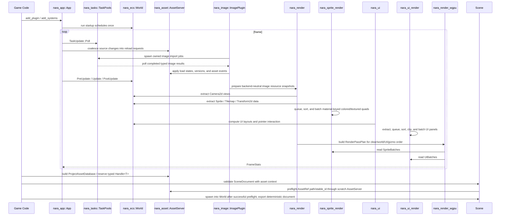

# nara Foundation Architecture

**Status**: Accepted; initial runtime slice implemented
**Created**: 2026-07-08
**Scope**: Phase 1 runtime foundation with seams for Phase 2 tooling and Phase 3 editor.

## Problem

nara needs a Rust-native engine foundation that supports code-first game authoring, strict ECS data flow, and future AI-generated game logic. The repository started as a single hello-world package, so the first decision is not implementation detail but module shape: what should be stable enough for users and agents to build against, and what should stay hidden behind narrow seams.

## Goals

- Keep the public authoring interface small: `App`, `Plugin`, `World`, typed components, asset handles, and renderer-facing data.
- Keep runtime data strongly typed and ECS-first. Scene hierarchy is represented by data components such as `Parent` and `Children`.
- Isolate backends. wgpu, windowing, audio, egui, and dear-imgui must sit behind adapters rather than leak into gameplay code.
- Make Phase 2 serialization and inspection natural by reserving explicit asset, scene, and tooling crates now.

## Non-Goals

- No visual editor in Phase 1.
- No Godot-style object inheritance, node callbacks, or string-path runtime glue.
- No full Bevy-compatible API surface. nara should borrow the shape, not the size.
- No backend leakage into gameplay-facing crates. `winit` and `wgpu` may exist in adapter crates, but default headless authoring should not depend on them.

## Reference Findings

Bevy's useful lesson is the deep-module cluster around `App`, `Plugin`, `World`, and `Schedule`. `repo-ref/bevy/crates/bevy_app/src/app.rs` presents `App` as the main user interface; `repo-ref/bevy/crates/bevy_app/src/plugin.rs` shows plugins configuring an app; `repo-ref/bevy/crates/bevy_ecs/src/world/mod.rs` hides entity/component/resource storage behind `World`; and `repo-ref/bevy/crates/bevy_ecs/src/schedule/schedule.rs` keeps system ordering in `Schedule`.

Godot's useful lesson is product boundary discipline, not its OOP scene tree. `repo-ref/godot/servers/rendering/rendering_server.h` separates rendering behind a server interface, and `repo-ref/godot/core/io/resource_loader.h` exposes resource format loaders as extension points. The parts to avoid are visible in `repo-ref/godot/scene/main/node.h` and `repo-ref/godot/scene/main/scene_tree.h`: `Node` and `SceneTree` accumulate hierarchy, process flags, groups, editor state, and runtime behavior into a large inheritance surface.

wgpu's examples show the lifecycle that nara must hide from gameplay code: create `Instance`, request `Adapter`, request `Device/Queue`, create/configure `Surface`, acquire a surface texture, render pass, submit, present, then recover on resize/lost/outdated surfaces. See `repo-ref/wgpu/examples/standalone/02_hello_window/src/main.rs` and `repo-ref/wgpu/examples/features/src/framework.rs`.

dear-imgui-rs reinforces backend split. The workspace separates core context from platform/render backends in `repo-ref/dear-imgui-rs/Cargo.toml`; `repo-ref/dear-imgui-rs/dear-imgui/src/context.rs` owns ImGui context lifecycle; `repo-ref/dear-imgui-rs/backends/dear-imgui-wgpu/src/lib.rs` and `renderer/render.rs` keep wgpu renderer details behind a backend crate.

## Proposed Architecture

```mermaid
flowchart TD
    User[Game code / AI agent] --> Facade[nara facade crate]
    Facade --> App[nara_app: App + Plugin + stages]
    App --> ECS[nara_ecs: bevy_ecs substrate]
    App --> Tasks[nara_tasks: task pools + handles]
    App --> Project[nara_project future: nara.toml validation + settings lowering]
    Facade --> Core[nara_core: color + math primitives]
    Facade --> Transform[nara_transform: spatial components]
    Facade --> Reflect[nara_reflect: component schema + value codec registry]
    Facade --> Diagnostic[nara_diagnostic: structured diagnostics + context]
    App --> Asset[nara_asset: AssetServer + Handle + AssetRef + reload scheduling]
    AssetWatch[nara_asset_watch: optional filesystem watcher adapter] --> Asset
    App --> Scene[nara_scene: runtime hierarchy + scene documents]
    App --> Input[nara_input]
    App --> Audio[nara_audio]
    App --> Render[nara_render: render data + backend seam]
    App --> Image[nara_image: typed image import + prepared image resources]
    App --> Sprite[nara_sprite: sprite authoring]
    App --> Tilemap[nara_tilemap: tilemap authoring]
    App --> SpriteRender[nara_sprite_render: 2D extract + queue + batch]
    App --> Window[nara_window: normalized window data]
    Window --> WinitAdapter[nara_winit adapter]
    App --> Tooling[nara_tooling: snapshots + UI-agnostic inspector + Play Mode model]
    Tooling --> EguiTooling[nara_tooling_egui: egui editor/debug adapter]
    Render --> SpriteRender
    Sprite --> SpriteRender
    Tilemap --> SpriteRender
    SpriteRender --> WgpuAdapter[nara_render_wgpu adapter]
    Tooling --> DebugUi[future dear-imgui / nara UI adapters]
```

## Crate Boundaries

| Crate | Interface | Hidden Implementation Direction |
|---|---|---|
| `nara` | Facade and layered preludes | Gameplay-first backend-free root prelude; advanced, backend, and tooling preludes for lower-level APIs |
| `nara_app` | `App`, `Plugin`, `PluginError`, `StartupStage`, `CoreStage`, real/virtual/fixed time resources, runtime state transition hooks | Fallible plugin installation, plugin lifecycle, runner policy, explicit pause/time-scale/background policy, bounded fixed-step catch-up |
| future `nara_project` | `nara.toml` manifest validation and effective settings lowering | Project settings authority for file-backed apps: paths, startup scene, task defaults, window defaults, input-map sources, and profile overrides |
| `nara_tasks` | `TaskPools`, `TaskPoolConfig`, `TaskPoolKind`, `TaskExecutionMode`, `TaskHandle<T>`, `TaskCancellationToken`, `TaskStats` | Engine-owned deterministic inline executor and std worker-pool backend for IO/compute/async-compute jobs |
| `nara_core` | `Color`, math re-exports | Core primitives that do not need ECS derives |
| `nara_ecs` | `bevy_ecs` re-export boundary: `World`, `Entity`, `Component`, `Resource`, `Bundle`, `Commands`, `Query`, `Schedule` | Product-facing ECS conventions over `bevy_ecs` |
| `nara_transform` | `Transform2d`, `GlobalTransform2d` | 2D/3D transform propagation and spatial hierarchy integration |
| `nara_reflect` | `ComponentRegistry`, stable `ComponentTypeId`, schema versions, `ComponentValue`, component codecs, `ComponentDecodeContext`, `ComponentEncodeContext` | Split value/path/schema/codec/migration/registry modules for Bevy-reflect-backed component metadata, asset-aware scene preflight, schema export, and migrations |
| `nara_diagnostic` | `Diagnostic`, `DiagnosticReport`, severity and code model | Structured diagnostics consumed by runtime, tools, and AI agents; tracing output is an explicit bridge |
| `nara_asset` | `AssetServer`, `AssetId`, `Handle<T>`, `AssetRef`, `AssetPath`, `ProjectAssetDatabase`, `.meta` records, `TypedImporter<T>`, `ImportJobInput`, `AssetSourceChanges`, `AssetReloadRequest` | Import cache records, hot reload scheduling, dependency graph, reload generations |
| `nara_asset_watch` | Optional `AssetWatchPlugin`, semantic watch event queue, and source-change translator | All `notify` integration and desktop filesystem watcher details behind the root `asset-watch` feature |
| `nara_scene` | `Name`, `Parent`, `Children`, `SceneDocument`, `PrefabDocument`, `ScenePatchDocument`, `SceneAuthoringSession`, `PrefabSourceResolver`, `SceneEntityId`, scene spawn/export | Asset-aware validation, patch transactions, undo/redo, live world projection, field-level prefab overrides, nested prefab expansion, hot reload validation |
| `nara_render` | `Camera2d`, `RenderTarget`, `ViewportRect`, `ExtractedView`, `RenderFrame`, `RenderPassPlan`, `RenderBackendStatus`, `RenderPhaseLabel` | Backend-neutral render-domain data: views, targets, phases, explicit pass planning, frame lifecycle, backend state, skipped-frame reason, last error, and render resource lifetime vocabulary |
| `nara_image` | `ImageAsset`, `ImageImporter`, `ImagePlugin`, prepared image resources, image reload stats | Typed PNG import, async image reload jobs, backend-neutral image content preparation, and image asset load failure/removal handling; no sampler/material policy |
| `nara_material` | `FilterMode`, `AddressMode`, `SamplerDescriptor`, `AlphaMode2d`, `Material2dDescriptor`, `Material2dKey` | Backend-neutral 2D material intent shared by sprites, tilemaps, runtime UI images, and future material assets |
| `nara_sprite` | `Sprite`, `SpriteMaterial`, `TextureRegion`, `SpriteAnchor`, `Handle<ImageAsset>` material image binding | Sprite authoring component data with material-first image/sampler/alpha/tint; no backend handles |
| `nara_tilemap` | `Tilemap`, `TileCoord`, `TileCell`, `TileSet`, `TileSetMaterial`, `TileAtlasLayout`, `TileLayer`, dirty chunk tracking | Tilemap authoring data with material-first tilesets that lower into textured quads now and chunked cached render data later |
| `nara_sprite_render` | `ExtractedSprites`, `QueuedSpriteItems`, `SpriteBatches`, `SpriteMaterialKey`, `TextureUvRect`, `SpriteRenderPlugin` | 2D extraction, tilemap lowering, deterministic sort keys, and material-keyed textured quad batches |
| `nara_ui` | `UiRoot`, `UiNode`, `UiPanel`, `UiPanelMaterial`, `ComputedUiLayouts`, `UiInteractionState` | Runtime ECS UI authoring data, layout projection, and pointer hover/press/focus state; no editor UI toolkit or backend handles |
| `nara_ui_render` | `ExtractedUiItems`, `QueuedUiItems`, `UiBatches`, `UiMaterialKey`, `UiClipRect`, `UiRenderPlugin` | Backend-neutral UI panel extraction, image/color material queueing, clipping, sort, and batching for the UI render phase |
| `nara_input` | `ButtonInput<KeyCode>`, `ButtonInput<MouseButton>`, `PointerState`, future normalized events/action maps/text routing | Backend-normalized input state, input routing, action mapping, UI focus/capture integration, and replay diagnostics |
| `nara_window` | `WindowId`, `Window`, `PrimaryWindow`, normalized window events | Raw platform windows, winit event loop |
| `nara_winit` | `WinitPlugin`, `WinitRunner` | Desktop event-loop adapter that updates window resources plus keyboard, mouse-button, and pointer state |
| `nara_render_wgpu` | `WgpuRenderPlugin`, `WgpuRenderBackend`, surface policy helpers | wgpu device/surface lifecycle, private pipelines, image texture caches split from material/sampler bind groups, sprite/UI quad submission from `RenderPassPlan`, `SpriteBatches`, and `UiBatches`, and `RenderBackendStatus` updates |
| `nara_audio` | `AudioCommand`, `AudioSink` | Decoder, mixer, device backend |
| `nara_tooling` | `WorldSnapshot`, `SceneInspectorState`, `SceneEditorState`, `SceneEditorMode`, `ScenePlaySession`, `SceneInspectorCommand`, `SceneApplyChangesRequest`, `ToolingPlugin` | UI-agnostic inspector/query/command models, isolated Play Mode lifecycle state, and selected-component Apply Changes patch export/apply consumed by egui, dear-imgui, future nara UI, and AI agents |
| `nara_tooling_egui` | `EguiSceneEditorPanel`, `EguiSceneInspectorPanel`, panel responses, `EguiSceneEditorAction` | egui-only rendering adapter that consumes tooling models and returns tooling commands/actions; no scene/session/world ownership |

## Runtime Flow

## Alternatives Considered

### Option A: Bevy-like modular workspace (Recommended)

**Pros**: Familiar Rust engine shape, strong plugin story, clean seams, crates can grow independently.
**Cons**: More crate overhead up front, requires discipline to keep the facade small.
**Decision**: Chosen. It fits code-first authoring and keeps backend churn local.

### Option B: Single crate with modules

**Pros**: Fastest to start, easiest Cargo setup.
**Cons**: Boundaries become social rather than enforced, renderer/tooling dependencies can leak into core, harder for AI agents to reason about ownership.
**Decision**: Rejected for an engine foundation.

### Option C: Godot-like object tree first

**Pros**: Mature editor mental model, easy object inspection, straightforward scene ownership.
**Cons**: Conflicts with strict ECS, pushes behavior into inheritance/callbacks, weakens Rust type guarantees.
**Decision**: Rejected. nara will model hierarchy as ECS relation components.

### Option D: Backend-first renderer package

**Pros**: Produces pixels sooner.
**Cons**: Gameplay code learns wgpu too early; surface/device lifetime concerns leak into API; later tooling and hot reload become retrofits.
**Decision**: Rejected as a public contract. The implemented seam is plugin-installed systems,
backend-owned resources, and `RenderBackendStatus`; speculative backend traits should wait for a
second real adapter or stronger isolation pressure.

## Success Metrics

| Metric | Target | Measurement |
|---|---:|---|
| Clean workspace check | `cargo check --workspace` passes | Local and CI |
| Test baseline | `cargo nextest run --workspace` passes | Local and CI |
| Foundation compile cost | No heavy graphics/window deps in default facade | Dependency tree review |
| User-facing startup API | A minimal app can call `App::new().update()` and examples can use `Commands`/`Query` systems | Example and smoke test |
| Backend isolation | Gameplay and render-domain crates do not import `wgpu` directly | `rg "wgpu::" crates src Cargo.toml` |
| Tooling readiness | Runtime can produce `WorldSnapshot` and scene inspector models without editor UI deps | Unit or smoke test |

## Risks and Mitigations

| Risk | Severity | Likelihood | Mitigation |
|---|---|---:|---|
| Rebuilding too much of Bevy | High | Medium | Keep nara's public interface narrower and document rejected scope |
| ECS abstraction becomes a leaky alias | High | Medium | Keep `nara_ecs` intentionally thin, document Bevy ECS semantics, and add nara-owned conventions only at product boundaries |
| Renderer seam becomes speculative | Medium | Medium | Let plugin/resources/status define the current backend contract; add traits only when real adapters require them |
| Tooling leaks into runtime | Medium | Medium | Keep `nara_tooling` as a client of snapshots/registries, not a dependency of core ECS |
| Scene serialization stores runtime entity IDs | High | Low | Implemented `SceneEntityId`, `SceneEntitySource`, and instantiate-time remapping; keep runtime `Parent`/`Children` out of persistent documents |

## Implemented Authoring Foundations

- `nara_app::Plugin::build` is fallible. Plugin prerequisites use `add_plugin_if_missing` or structured `PluginError` values instead of panic helpers.
- File-backed projects use `nara.toml` as their settings authority. Code-first embedding stays supported through explicit resources and plugin configuration, but engine domains should not invent separate persistent project config files for asset roots, startup scenes, task pools, window defaults, or input-map sources.
- Transient event/message/resource queues are classified by lifecycle. Frame events, fixed events, request queues, runtime state projections, diagnostics, and authoring patches must declare producer, consumer, retention, cleanup stage, and replay/diagnostic role.
- `nara_tasks` owns deterministic and threaded engine task pools. `CoreStage::TaskUpdate` provides the explicit main-thread result integration stage with ordered sets for polling, source-change coalescing, job spawning, and result application.
- `nara_reflect` is split into narrow `value`, `path`, `schema`, `codec`, `migration`, and `registry` modules while preserving public re-exports.
- `nara_reflect` exports a `ComponentSchemaCatalog`, structured `ComponentFieldPath` values, and component value migration chains. Serializable components require explicit schema fields, duplicate Rust `TypeId` registration is rejected, and invalid schema defaults fail at registration.
- `nara_diagnostic::DiagnosticReport` collects diagnostics without implicit logging. `emit_to_tracing` is the explicit bridge for logs.
- `nara_render` exposes `RenderBackendStatus`, `RenderBackendState`, `RenderFrameSkipReason`, and `RenderPassPlan`; `nara_render_wgpu` records skipped frames and backend errors through that backend-neutral resource and consumes the explicit pass plan for clear/world/UI/gizmo order.
- `nara_scene` edits authoring documents through atomic `ScenePatchDocument` transactions with operation-indexed diagnostics and inverse patches.
- `SceneAuthoringSession` owns the first editor/AI authoring boundary: document-as-truth patch application, undo/redo stacks, source revision stamps, dirty tracking, and rebuild-style live `World` projection that only replaces entities it owns.
- `nara_tooling::SceneInspectorState` builds UI-agnostic inspector models from `SceneAuthoringSession`, `ComponentRegistry`, and optional `WorldSnapshot`, then applies field/reparent commands as scene patches.
- `nara_tooling::SceneEditorState` owns the first UI-agnostic Play Mode model. It starts plain, prefab-resolved, asset-aware, and combined Play sessions by spawning a fresh isolated runtime `World` through `SceneSpawner`, exposes Play/Paused/Edit mode state, and rejects persistent inspector edits while Play or Paused is active.
- Stop Play drops the runtime `World` and discards runtime changes by default. Apply Changes now supports a narrow selected-entity / explicit-component subset: it encodes registered serializable Play world components into `ScenePatchDocument` operations, applies them through `SceneAuthoringSession`, records undo, and rejects stale revisions, runtime-only components, prefab-expanded entities, and failed patch validation with diagnostics.
- `nara_tooling_egui` is the first concrete debug/editor UI adapter. It renders `SceneEditorModel` and `SceneInspectorModel`, returns explicit editor actions and `SceneInspectorCommand` values, and keeps egui out of `nara_tooling` and runtime-facing crates.
- Prefab overrides use the same patch transaction model as scene edits. The old whole-component override API was removed before 1.0.
- `PrefabSourceResolver` and `InMemoryPrefabSourceResolver` expand nested prefab instances before spawn. Expanded IDs use the deterministic `anchor/source_entity` namespace rule.
- `nara_asset` owns typed importer contracts, source change coalescing, dependency-aware reload request scheduling, load generations, asset state transitions, and asset load failure/removal events.
- Asset reload scheduling coalesces same-frame source changes by last semantic event, walks dependent source edges transitively, and combines generation checks with expected-version guards before domain apply systems mutate runtime asset state.
- Asset source-change scheduling failures are structured diagnostics rather than discarded errors. Asset reload policy preserves last-good typed values on failed reload, records failed first loads without inventing values, and keeps GPU objects in backend caches rather than imported artifacts.
- Scene/prefab authoring identity is provenance-aware. Scene-local entities patch the scene, prefab source entities patch the prefab source, prefab anchors patch the scene instance, and prefab-expanded projections must write back only through explicit override or convert-to-local flows.
- `nara_image::ImagePlugin` is the first async asset domain plugin. It registers `ImageImporter`, spawns image reload tasks from asset reload requests, applies typed image content behind stable handles, updates load states/events, and invalidates prepared image resources. Sampler, alpha, and tint policy live in `nara_material`, not in image assets.
- `nara_sprite_render` sorts and batches by `SpriteMaterialKey`, which contains image render resource key plus sampler, alpha mode, and tint. `nara_render_wgpu` caches GPU image textures by prepared image snapshot and caches sampler bind groups by material key.
- `nara_asset_watch` is an optional desktop watcher adapter behind the root `asset-watch` feature. It owns `notify`, validates its root against `AssetSourceRoot`, preserves in-root rename sides, and translates raw filesystem events into semantic `AssetSourceChange` values without leaking watcher types into `nara_asset`.
- `nara_input` exposes normalized `ButtonInput<KeyCode>`, `ButtonInput<MouseButton>`, and `PointerState`; `nara_winit` is the desktop adapter that updates those resources from winit events.
- `nara_ui` owns the first runtime ECS UI foundation: `UiRoot`, `UiNode`, `UiPanel`, material-aware image/color panel data, computed top-left logical-pixel layouts, and pointer hover/press/focus state. Computed layout and interaction resources are runtime-only.
- `nara_ui_render` extracts runtime UI panels from computed layouts, queues color/image materials through the same `nara_image` prepare and `nara_material` sampler/alpha/tint path as sprites, clips panels, and emits `UiBatches` for the UI render phase.
- `nara_render_wgpu` draws sprite and UI batches through the shared quad pipeline path according to `RenderPassPlan`; pass order is no longer an implicit backend-only draw-loop rule.
- JSON and RON examples cover schema export, patch roundtrip, and field-level prefab overrides without `winit` or `wgpu`.

## Settled Policy Contracts Pending Full Implementation

- Main-loop semantics are explicit: runners pass real elapsed time; nara lowers it into real,
  virtual/game, fixed, and render-interpolation domains with pause, time scale, max delta, fixed
  catch-up, runtime state transitions, background policy, and frame-transient cleanup. See ADR
  [0039](adr/0039-main-loop-time-pause-and-runtime-state.md).
- Render resource lifetime is a product contract even before a full render graph. Backend caches own
  GPU textures, buffers, samplers, bind groups, pipelines, and intermediate targets; invalidation is
  generation/device/budget aware; submitters are owned by domain plugins or plugin groups. See ADR
  [0040](adr/0040-render-resource-lifetime-and-submitter-ownership.md).
- Input is layered through normalized events, retained device state, routing decisions, action maps,
  text/IME streams, UI focus/pointer capture, and future accessibility semantics. See ADR
  [0041](adr/0041-input-routing-actions-text-focus-and-accessibility.md).
- Runtime services use one backend boundary: ECS data expresses stable intent, services own native
  handles/threads/queues, and results integrate through declared main-thread stages. See ADR
  [0042](adr/0042-runtime-service-and-backend-boundary.md).
- Scene, prefab, and patch documents need document-level migration chains before component-value
  migrations and validation. Runtime loading must not rewrite source files silently. See ADR
  [0043](adr/0043-scene-prefab-and-patch-document-migration-policy.md).
- The root facade uses layered preludes. `nara::prelude` is gameplay-first and backend-free;
  backend/tooling/debug/render internals move to advanced or module-specific preludes. See ADR
  [0044](adr/0044-root-facade-and-prelude-layering-policy.md).

## Next Implementation Slices

1. Implement the refined app loop/time/state contract: real/virtual/fixed time resources, pause,
   state transition stage, bounded catch-up diagnostics, and frame-transient event cleanup.
2. Mature runtime UI beyond panels: text/font integration through `nara_text`, richer layout,
   widget state, keyboard/gamepad focus, action-map routing, and editor dogfooding once the runtime
   model is stable.
3. Harden render resource lifetime before adding more resource classes: explicit cache retention,
   eviction diagnostics, device-loss rebuild behavior, and decoupled submitter plugin groups.
4. Introduce a full `RenderGraph` only when post-processing, render-to-texture, editor viewport
   composition, 3D depth/prepass, or transient resource lifetime creates pressure beyond
   `RenderPassPlan`.
5. Define document-level migration chains for scene, prefab, and patch files before changing their
   persisted shape again.
6. Audit the root facade/prelude and move backend/tooling/debug/internal render types out of the
   gameplay prelude.
7. Define incremental `WorldCommand` sync as an optimization over the rebuild-style authoring
   projection.
8. Extend Apply Changes beyond whole-component replacement only after field-level diffing, prefab
   override write-back, and edit-while-playing merge semantics are designed.
9. Design reusable material assets and custom shader specialization after inline
   `Material2dDescriptor` has enough runtime/UI pressure.
