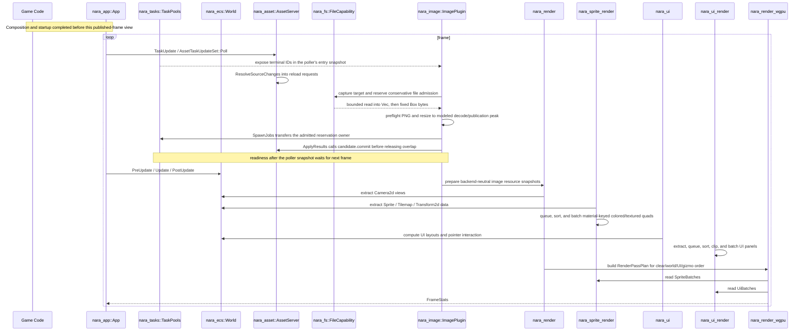

# nara Foundation Architecture

**Status**: Accepted; implementation varies by ADR
**Created**: 2026-07-08
**Scope**: Phase 1 runtime foundation with seams for Phase 2 tooling and Phase 3 editor.

## Problem

nara needs a foundation for a complete Rust-first game production path: typed gameplay code, an
ECS-backed simulation, project and editor workflows, backend services, debugging, and delivery.
The repository started as a single hello-world package, so the first decision is not a renderer
feature but module shape: which contracts form one coherent product, which modules can be reused or
replaced, and which implementation details stay hidden behind narrow boundaries.

## Governance

This document summarizes the selected architecture; it is not evidence that every selected
contract is complete. ADR decision status and implementation status are separate. The canonical
decision catalogue and evidence rules live in `adr/README.md`, per-ADR implementation state lives
in `adr/implementation-status.md`, and only unresolved trigger-based questions live in
`open-questions.md`. Scenario-driven, non-normative Interface work may live in separate design
drafts. Their canonical, appendix, guide, and rebaseline roles are maintained in the
[Architecture Document Map](README.md); this summary does not duplicate that status index.

nara is unreleased. Incorrect prototype APIs and draft persistent shapes are removed rather than wrapped: the corrected Rust API takes the canonical unsuffixed name, the corrected persistent shape becomes canonical version 1 after in-repository sources are updated, and the deliberate break is recorded in `../migrations/2026-07-engine-foundation.md`.

## Goals

- Make public Rust APIs sufficient for complete game production rather than only engine extension
  or performance hotspots.
- Keep the public authoring interface small: `App`, `Plugin`, `World`, typed components, asset
  handles, and renderer-facing data.
- Keep simulation data strongly typed and ECS-backed. Scene hierarchy is represented by data
  components such as `Parent` and `Children`; project documents, editor state, and native services
  retain separate authorities.
- Compose first-party modules into a coherent default product while preserving documented crate,
  plugin, and backend boundaries for supported reuse and replacement.
- Isolate backends. wgpu, windowing, audio, egui, and dear-imgui must sit behind adapters rather than leak into gameplay code.
- Make Phase 2 serialization and inspection natural by reserving explicit asset, scene, and tooling crates now.

## Non-Goals

- No visual editor in Phase 1.
- No Godot-style object inheritance, node callbacks, or string-path runtime glue.
- No full Bevy-compatible API surface. nara should borrow the shape, not the size.
- No backend leakage into gameplay-facing crates. `winit` and `wgpu` may exist in adapter crates, but default headless authoring should not depend on them.

## Reference Findings

Bevy's useful lesson is the deep-module cluster around `App`, `Plugin`, `World`, and `Schedule`. `repo-ref/bevy/crates/bevy_app/src/app.rs` presents `App` as the main user interface; `repo-ref/bevy/crates/bevy_app/src/plugin.rs` shows plugins configuring an app; `repo-ref/bevy/crates/bevy_ecs/src/world/mod.rs` hides entity/component/resource storage behind `World`; and `repo-ref/bevy/crates/bevy_ecs/src/schedule/schedule.rs` keeps system ordering in `Schedule`.

Godot's useful lesson is product boundary discipline, not its OOP scene tree. `repo-ref/godot/servers/rendering/rendering_server.h` separates rendering behind a server interface, and `repo-ref/godot/core/io/resource_loader.h` exposes resource format loaders as extension points. The parts to avoid are visible in `repo-ref/godot/scene/main/node.h` and `repo-ref/godot/scene/main/scene_tree.h`: `Node` and `SceneTree` accumulate hierarchy, process flags, groups, editor state, and runtime behavior into a large inheritance surface.

wgpu's examples show the lifecycle that nara must hide from gameplay code: create `Instance`, request `Adapter`, request `Device/Queue`, create/configure `Surface`, acquire a surface texture, render pass, submit, present, then recover on resize/lost/outdated surfaces. See `repo-ref/wgpu/examples/standalone/02_hello_window/src/main.rs` and `repo-ref/wgpu/examples/features/src/framework.rs`.

dear-imgui-rs reinforces backend split. The workspace separates core context from platform/render backends in `repo-ref/dear-imgui-rs/Cargo.toml`; `repo-ref/dear-imgui-rs/dear-imgui/src/context.rs` owns ImGui context lifecycle; `repo-ref/dear-imgui-rs/backends/dear-imgui-wgpu/src/lib.rs` and `renderer/render.rs` keep wgpu renderer details behind a backend crate.

## Accepted Boundary Map

The crate/module edges below summarize current ownership. Proposed ADR 0082 Host scopes and ADR
0084 managed-runtime topology remain intentionally absent until their independent RGF decision
gates accept them; this map must not be used to infer a shared public Host trait.

```mermaid
flowchart TD
    User[Game code / AI agent] --> Facade[nara facade crate]
    Facade --> App[nara_app: App + Plugin + stages]
    Facade --> Project[nara_project: nara.toml validation + settings lowering]
    App --> ECS[nara_ecs: bevy_ecs substrate]
    App --> Tasks[nara_tasks: task pools + handles]
    Facade --> Core[nara_core: color + math primitives]
    Facade --> FS[nara_fs: host-issued filesystem capabilities]
    Facade --> Transform[nara_transform: spatial components]
    Facade --> Reflect[nara_reflect: component schema + value codec registry]
    Facade --> Diagnostic[nara_diagnostic: classified diagnostics + pressure snapshots]
    Facade --> Identity[nara_identity: world-scoped identity + remaps]
    App --> Asset[nara_asset: AssetServer + Handle + AssetRef + reload scheduling]
    AssetWatch[nara_asset_watch: optional filesystem watcher adapter] --> Asset
    App --> Scene[nara_scene: runtime hierarchy + scene documents]
    App --> Input[nara_input: retained input + action outcomes]
    App --> Gameplay[nara_gameplay: gameplay command stream]
    App --> Render[nara_render: render data + backend seam]
    App --> Image[nara_image: typed image import + prepared image resources]
    App --> Sprite[nara_sprite: sprite authoring]
    App --> Tilemap[nara_tilemap: tilemap authoring]
    App --> SpriteRender[nara_sprite_render: 2D extract + queue + batch]
    App --> Window[nara_window: normalized window data]
    Window --> WinitAdapter[nara_winit adapter]
    App -->|models and observations| Tooling[nara_tooling: commands, views, inspector, and transitional Play model]
    Tooling --> EguiTooling[nara_tooling_egui: egui editor/debug adapter]
    Scene --> Identity
    Gameplay --> Identity
    Tooling --> Identity
    Render --> SpriteRender
    Sprite --> SpriteRender
    Tilemap --> SpriteRender
    SpriteRender --> WgpuAdapter[nara_render_wgpu adapter]
    Tooling --> DebugUi[future dear-imgui / nara UI adapters]
```

## Crate Boundaries

| Crate | Interface | Hidden Implementation Direction |
|---|---|---|
| `nara` | Facade, layered preludes, authorized project ingest/composition, immutable startup-content publication, and the concrete `HeadlessRun` product action | Gameplay-first backend-free root prelude; advanced, backend, and tooling preludes for lower-level APIs; root-owned content loading plus a private `ProjectHost` start/publication/retirement state machine over opaque filesystem authority |
| `nara_app` | Gameplay authoring through `App`, Plugin declarations/definitions/plans, schedules, time, and frame outcomes; module-specific advanced U5 trial through `SealedApp`, `RuntimeCandidate`, `RuntimeInstance`, and typed control/fault/close values | Data-only group/slot resolution, private preparation, closed hook commit, explicit move-only shutdown obligations, reverse once-only shutdown, raw-runner versus managed-runtime exclusion, safe-point driving, exact fixed-tick execution, sticky fault authority, retryable finite close, atomic frame planning, per-tick clock advancement, explicit discard/preserve debt, and Bevy tracker boundary; ADR 0084 still owns acceptance and final public placement |
| `nara_project` | `ProjectManifest`, profile overlays, validated `EffectiveProjectSettings`, project path validation, runtime/task/window/input/diagnostic value lowering | Side-effect-free `nara.toml` authority with fallible duration/limit conversion, nested bounded task settings, and enforced headless/server/editor/dev/release profile invariants |
| `nara_tasks` | Bounded `TaskPools`, `TaskPoolConfig`, `TaskSpawnOutcome`, typed `TaskHandle<T>` terminals, `TaskOrderKey`, `OrderedTaskResults<T>`, shutdown reports and stats | Threaded std worker facades with move-only worker owners, pending-only coalescing, panic isolation, first-terminal cancellation, pollable/retryable finite drain/cancel/join, process-retained abnormal Drop quarantine, standalone `shutdown_blocking`, and an explicitly test-only inline driver |
| `nara_core` | `Color`, math re-exports, non-zero item/byte/depth/time limit scalars, persistent envelope metadata, serde shape preflight | Core primitives and unit-safe values that do not own domain overload policy or file-kind semantics |
| `nara_fs` | Host-issued `DirectoryCapability`/`FileCapability`, checked `limit + 1` bounded reads, validated relative components, scoped live-object identity, digest/lock/temp/replace/sync primitives and typed guarantee receipts | Windows handle-relative NT opens/rename, Linux `openat2`, fail-closed proof tiers, and no authorization-bearing raw paths; unsupported platform primitives remain explicit |
| `nara_ecs` | `bevy_ecs` re-export boundary: `World`, `Entity`, `Component`, `Resource`, `Bundle`, `Commands`, `Query`, `Schedule`, `ScheduleLabel`, and `SystemSet` | Product-facing ECS conventions over `bevy_ecs`, with facade-safe derive exports for root-only and renamed dependencies |
| `nara_ecs_derive` | `Component`, `Resource`, `ScheduleLabel`, and `SystemSet` derives behind the `nara_ecs` and root facade exports | Proc-macro dependency isolation, Bevy-compatible expansion, declaration diagnostics, and renamed-package path resolution |
| `nara_identity` | `WorldIdentityDomain`, `WorldIdentityDomainId`, `SceneInstanceId`, `PersistentRuntimeId`, structured entity references, tombstones, and remaps | World-scoped runtime claims/indexes, atomic spawn/fork/restore identity transactions, lookup validation, retirement, and stable non-`Entity` observation vocabulary |
| `nara_transform` | `Transform2d`, `GlobalTransform2d` | 2D/3D transform propagation and spatial hierarchy integration |
| `nara_reflect` | `ComponentRegistry`, stable `ComponentTypeId`/`ComponentFieldId`, runtime-independent `ComponentSchemaCatalog`, schema versions, `ComponentValue`, field capability metadata, component codecs, `ComponentDecodeContext`, `ComponentEncodeContext`, declared asset-reference traversal | Split value/path/schema/codec/migration/registry/format modules, separate native bindings, atomic Building-to-Frozen publication, asset-aware scene preflight, schema/capability export, and migrations |
| `nara_reflect_derive` | `PersistentComponent` derive and generated native `PersistentComponentProvider` | Proc-macro dependency isolation, schema/codec declaration diagnostics, and direct/renamed dependency resolution |
| `nara_diagnostic` | Privacy-safe `Diagnostic`, sticky bounded `DiagnosticReport`, `RuntimeDiagnostics`, and `RuntimePressureSnapshots` | Static engine-owned identities and summaries, classified fields, deterministic count/byte retention, O(1) runtime dedupe indexes, output-only snapshots, and explicit incremental tracing sinks without producer overload policy |
| `nara_asset` | `AssetServer`, `AssetId`, `Handle<T>`, `AssetStateRevision`, `AssetSlotRevision`, `AssetRef`, `AssetPath`, `ProjectAssetDatabase`, strict canonical `.meta` candidates, `TypedImporter<T>`, `ImportJobInput`, `AssetSourceChanges`, `AssetReloadRequest` | Import cache records, O(1) state and persistent slot revisions, hot reload scheduling, dependency graph, reload generations |
| `nara_asset_watch` | Optional `AssetWatchPlugin`, semantic watch event queue, and source-change translator | All `notify` integration and desktop filesystem watcher details behind the root `asset-watch` feature |
| `nara_scene` | `Name`, `Parent`, `Children`, bounded `SceneDocument`/`PrefabDocument` candidates, `ScenePatchDocument`, `SceneAuthoringSession`, `PrefabSourceResolver`, `SceneEntityId`, scene spawn/export | Asset-aware validation, patch transactions, undo/redo, live world projection, field-level prefab overrides, nested prefab expansion, hot reload validation |
| `nara_render` | `Camera2d`, `RenderTarget`, `ViewportRect`, `ExtractedView`, `RenderFrame`, `RenderPassPlan`, `RenderBackendStatus`, `RenderPhaseLabel` | Backend-neutral render-domain data: views, targets, phases, explicit pass planning, frame lifecycle, backend state, skipped-frame reason, last error, and render resource lifetime vocabulary |
| `nara_image` | Non-`Clone` `ImageAsset` with shared immutable pixel storage, `ImageImporter`, owned byte/file import requests, `ImageImportLimits`, `ImageImportBudgetHost`, reservation-bearing imported candidates, `ImagePlugin`, prepared image resources, image reload stats | Audited static non-interlaced PNG preflight/decode, shared RAII peak accounting, async image reload jobs, candidate-owned publication, last-good reload preservation, and backend-neutral image content preparation; no arbitrary-codec, sampler, or material policy |
| `nara_material` | `FilterMode`, `AddressMode`, `SamplerDescriptor`, `AlphaMode2d`, `Material2dDescriptor`, `Material2dKey` | Backend-neutral 2D material intent shared by sprites, tilemaps, runtime UI images, and future material assets |
| `nara_sprite` | `Sprite`, `SpriteMaterial`, `TextureRegion`, `SpriteAnchor`, `Handle<ImageAsset>` material image binding | Sprite authoring component data with material-first image/sampler/alpha/tint; no backend handles |
| `nara_tilemap` | `Tilemap`, `TileCoord`, `TileCell`, `TileSet`, `TileSetMaterial`, `TileAtlasLayout`, `TileLayer`, dirty chunk tracking | Tilemap authoring data with material-first tilesets that lower into textured quads now and chunked cached render data later |
| `nara_sprite_render` | `ExtractedSprites`, `QueuedSpriteItems`, `SpriteBatches`, `SpriteMaterialKey`, `TextureUvRect`, `SpriteRenderPlugin` | 2D extraction, tilemap lowering, deterministic sort keys, and material-keyed textured quad batches |
| `nara_ui` | `UiRoot`, `UiNode`, `UiPanel`, `UiPanelMaterial`, `ComputedUiLayouts`, `UiInteractionState`, `UiPointerRoute`, `UiInteractionTarget` | Runtime ECS UI authoring data, layout projection, and target/view-aware pointer hover/capture/focus state; no editor UI toolkit or backend handles |
| `nara_ui_render` | `ExtractedUiItems`, `QueuedUiItems`, `UiBatches`, `UiMaterialKey`, `UiClipRect`, `UiRenderPlugin` | Backend-neutral UI panel extraction, UI-owned material/instance/UV types, image/color material queueing, clipping, sort, and batching for the UI render phase |
| `nara_input` | `ButtonInput<KeyCode>`, `ButtonInput<MouseButton>`, `PointerState`, `ActionMap`, `ActionOutcomes`, `InputSet` | Backend-normalized input state, frame-transient action outcome resolution, action contexts, future UI focus/capture integration, text routing, and replay diagnostics |
| `nara_gameplay` | `GameplayCommandDraft`, `GameplayCommandSubmission`, `GameplayCommandIngressSource`, `GameplayCommandEnvelope`, `GameplayCommandQueue`, `GameplayCommandBatch`, bounded `ActionCommandMap`, command schedule sets, settings and stats | Canonically ordered fixed-tick admission with reserved local-action authority, pending/active/quarantine accounting, terminal fail-closed lifecycle state, and action/replay/AI/test/external producer bridges without networking transports or runtime entity handles |
| `nara_window` | `WindowId`, `Window`, `PrimaryWindow`, normalized window events, owning backend handle providers, atomic non-cloneable surface bindings, target lifecycle authority, scoped retirement driver | Raw platform windows, winit event loop, backend surfaces |
| `nara_winit` | `WinitRunner` and desktop event-loop integration | Top-level-selected desktop driver over `RuntimeInstance` that owns native windows, updates normalized input/window state through short driver scopes, invokes scoped renderer retirement only for its targets, joins registered runtime close with provider/native teardown, and preserves distinct primary-runner and teardown failures |
| `nara_render_wgpu` | `WgpuRenderPlugin`, `WgpuRenderBackend`, surface policy helpers, `WgpuRenderTextureCacheStats` | wgpu device/surface lifecycle, safe owning surface creation, main-thread native execution, scoped surface-retirement driver, private opaque/blend pipelines, generation-aware image texture caches, material/sampler bind groups, grace-frame cache eviction, sprite/UI quad submission from `RenderPassPlan`, `SpriteBatches`, and `UiBatches`, and `RenderBackendStatus` updates |
| `nara_tooling` | `EditorWorkspace`, `EditorDocumentId`, `EditorWorkspaceCommand`, `EditorWorkspaceCommandReport`, `WorldIdentitySnapshot`, `SceneInspectorState`, transitional `SceneEditorState`/`ScenePlaySession`, `SceneInspectorCommand`, `SceneApplyChangesRequest`, `ToolingPlugin` | UI-agnostic workspace/inspector/query/command models, stable identity-only snapshots, open scene document slots, active document, selection sets, dirty/saved/conflict document state, and selected-component Apply Changes patch export/apply consumed by egui, dear-imgui, future nara UI, and AI agents; the bare-World Play owner remains transitional while RGF-U17 tests a concrete Editor Host under the still-Proposed ADR 0082/0084 topology |
| `nara_tooling_egui` | `EguiSceneEditorPanel`, `EguiSceneInspectorPanel`, panel responses | egui-only rendering adapter that consumes tooling models and returns `EditorWorkspaceCommand` values; no scene/session/world ownership |

## Accepted Runtime Debugging Direction

- `nara_app` owns pause/resume/time-scale execution and the exact single-fixed-tick path. One paused
  step runs a complete fixed transaction and returns to paused; render-frame stepping and future
  system stepping are different capabilities.
- The RGF-U5 code-first trial supplies generation-scoped controls, sticky typed faults, and
  truthful `Stopping -> CloseIncomplete -> RetryClose -> Stopped` behavior around one App. A
  once-only plugin shutdown failure may terminate ownership at `Stopped`, but it leaves
  `RuntimeCloseEvidence`, a failed `CloseFailed` control result, and a Winit teardown error; an
  unfinished registered owner remains `CloseIncomplete`. ADR 0084 remains Proposed until the later
  Host, Editor, desktop, counterevidence, and independent-decision gates complete.
- `nara_tooling` owns bounded, UI-agnostic observation, diff, timeline, and lifecycle models. It
  consumes the implemented legacy U8 stable identity and `nara_reflect` codecs; it does not serialize arbitrary worlds,
  store allocator-local `Entity` values, or use `RuntimeDiagnostics` as a high-frequency trace.
- Detailed component observation requires both schema eligibility and a host disclosure/redaction
  policy. Unregistered runtime-only/internal entities are omitted/count-only unless the identity domain supplies a
  world-scoped non-persistent observation locator.
- Command, system, and component-change timelines distinguish proven provenance, temporal
  correlation, and explicitly instrumented direct causality.
- Interpreter-like AI/script/behavior domains own program generations, instruction IDs, source
  maps, held-data projections, and failure semantics. Tooling consumes an optional
  `ExecutionCursor`; cursor payloads and source locators pass the host observation
  allowlist/redaction policy and never expose absolute host paths. Ordinary Rust systems and ECS
  entities have no inferred source-line cursor.
- Future backwards navigation restores a completed-tick checkpoint into a fresh isolated runtime
  and replays authoritative commands plus recorded nondeterministic outcomes forward. It is not
  reverse execution or inverse component mutation.
- Rust iteration classifies each change. Asset/scene/data changes use domain reload; compatible
  function-body changes may use an optional development hot-patch plugin at a quiescent boundary;
  structural or unknown changes rebuild and start a fresh isolated runtime with explicit validated
  restoration. Optional script adapters own a separate reload contract. See ADR
  [0093](adr/0093-rust-authoring-hot-iteration-and-optional-scripting-adapters.md).

## Published Runtime Domain Flow

This sequence begins after a code-first caller or concrete product action has produced the
executable owner. It describes work inside a published frame; it is not the project-ingest,
Host-start, candidate-publication, driver-selection, or close protocol. Those proposed ownership
flows remain in ADRs 0082/0084 and the runtime-composition harness until their RGF evidence gates
complete. Editor and platform integrations must not infer permission to drive a raw `App` from this
abbreviated frame view.

Project database construction, scene validation/spawn, and candidate startup are separate
authoring/product-start workflows. They are deliberately omitted here rather than appended to the
steady-state frame loop.

## Alternatives Considered

### Option A: Bevy-like modular workspace (Recommended)

**Pros**: Familiar Rust engine shape, strong plugin story, clean seams, crates can grow independently.
**Cons**: More crate overhead up front, requires discipline to keep the facade small.
**Decision**: Chosen. It fits code-first authoring and keeps backend churn local.

### Option B: Single crate with modules

**Pros**: Fastest to start, easiest Cargo setup.
**Cons**: Boundaries become social rather than enforced, renderer/tooling dependencies can leak into core, harder for AI agents to reason about ownership.
**Decision**: Rejected for an engine foundation.

### Option C: Godot-like object tree first

**Pros**: Mature editor mental model, easy object inspection, straightforward scene ownership.
**Cons**: Conflicts with strict ECS, pushes behavior into inheritance/callbacks, weakens Rust type guarantees.
**Decision**: Rejected. nara will model hierarchy as ECS relation components.

### Option D: Backend-first renderer package

**Pros**: Produces pixels sooner.
**Cons**: Gameplay code learns wgpu too early; surface/device lifetime concerns leak into API; later tooling and hot reload become retrofits.
**Decision**: Rejected as a public contract. The implemented seam is plugin-installed systems,
backend-owned resources, and `RenderBackendStatus`; speculative backend traits should wait for a
second real adapter or stronger isolation pressure.

## Success Metrics

| Metric | Target | Measurement |
|---|---:|---|
| Clean workspace check | `cargo check --workspace` passes | Local and CI |
| Test baseline | `cargo nextest run --workspace` passes | Local and CI |
| Foundation compile cost | No heavy graphics/window deps in default facade | Dependency tree review |
| User-facing startup API | A minimal app can call `App::new().update()` and examples can use `Commands`/`Query` systems | Example and smoke test |
| Backend isolation | Gameplay and render-domain crates do not import `wgpu` directly | `rg "wgpu::" crates src Cargo.toml` |
| Tooling readiness | Runtime can produce `WorldIdentitySnapshot` and local scene inspector models without editor UI deps | Unit or smoke test |

## Risks and Mitigations

| Risk | Severity | Likelihood | Mitigation |
|---|---|---:|---|
| Rebuilding too much of Bevy | High | Medium | Keep nara's public interface narrower and document rejected scope |
| ECS abstraction becomes a leaky alias | High | Medium | Keep `nara_ecs` intentionally thin, document Bevy ECS semantics, and add nara-owned conventions only at product boundaries |
| Renderer seam becomes speculative | Medium | Medium | Let plugin/resources/status define the current backend contract; add traits only when real adapters require them |
| Tooling leaks into runtime | Medium | Medium | Keep `nara_tooling` as a client of snapshots/registries, not a dependency of core ECS |
| Scene serialization stores runtime entity IDs | High | Low | Implemented `SceneEntityId`, `SceneEntitySource`, and instantiate-time remapping; keep runtime `Parent`/`Children` out of persistent documents |

## Implemented Authoring Foundations

- `nara_app` owns an explicit terminal plugin lifecycle. Read-only preflight rejection is
  retryable only before the current top-level attempt has committed a member; build/finish entry is
  committed, and later preflight failure or build/finish error/unwind panic poisons the app,
  preserves the first error, aggregates reverse once-only shutdown failures, and prevents schedule
  execution. Static declarations and repeatable typed definitions resolve through data-only groups,
  stable slots, dependency/service/conflict/order closure, and private preparation before closed
  App hooks. Shutdown receives a world-only context, explicit first-party obligations must register
  before `App::seal`, runners borrow the app so shutdown remains observable, and mutable app entry
  points are fallible. Hook-time plugin/group installation and runner selection are sticky
  violations. Built-in component plugins read only explicitly opted-in `PluginPreflightResource`
  structural state; component-registration conflicts reject before commit with contextual
  `PluginError` values and leave an early App attempt retryable.
- `nara_app` stores built-in and custom schedules in one typed `Schedules` registry. `add_systems`,
  `configure_sets`, initialization, and inspection accept any `ScheduleLabel`; custom schedules are
  inert until an owner calls `run_schedule`. That entry point rejects built-in labels and seals
  before running a registered custom schedule, while the standard frame loop remains closed to the
  engine-owned stage order.
- ADR 0003 now distinguishes documented public semantic schedule/set anchors from public Rust
  implementation details. The first-playable inventory is exactly `CoreStage::FixedUpdate`
  (schedule label) plus joinable `FixedUpdateSet::Simulate`, `GameplayCommandSet::Consume`, and
  `GameplayCommandSet::Capture`; unlisted public variants are not ordering promises. Extensions may
  register in the schedule label and join/order only against the three set anchors, not concrete
  system functions, private sets, or registration order. `App::seal` now requires automatic
  deferred insertion, reasserts final deferred application, builds the owning fixed schedule, and
  returns structured `ScheduleCompatibilityError` values for policy or graph failure before the App
  becomes immutable. The renamed-root extension fixture proves entry/completion state, deferred
  visibility, conditional skip, App/domain fault handling, batch retention/cleanup, registration
  permutation, and absent/cross-schedule non-guarantees using only public APIs. Ignore-deferred
  relations remain a trusted advanced opt-out that can seal but cannot satisfy the visibility
  oracle; no scheduler wrapper is added solely to police them. This certifies no total order among
  otherwise unordered phase peers.
- `nara_app::RuntimeCandidate` admits one sealed unstarted App with no raw runner and owns every
  explicitly transferred close participant. Startup failure retains that owner for retirement;
  successful startup consumes it infallibly into `RuntimeInstance`. The instance delegates all
  schedule/time/tracker work to the App, exposes only short-lived driver mutation, scopes control
  tickets and fault reporters to a non-reused generation, and never imports project/content,
  tooling, or backend policy. Raw App Drop performs one best-effort participant pass; retryable
  close requires the retained managed owner.
  Candidate and driver mutation scopes bind the canonical fallback reporter and verify both its
  reporter and handler authority around healthy operations. An unhandled fallible system or
  observer that reaches that fallback records the first sticky fault and makes the scope return
  `RuntimeScopeError::Faulted`; an explicit per-system or per-observer error handler is instead the
  caller's handling boundary. Candidate mutation rejects an existing fault, while a published
  faulted runtime keeps its driver scope available for retirement work until it reaches `Stopped`.
  Abnormal Drop of an admission failure, startup failure, or published runtime begins one bounded
  close pass and retains an unfinished `App`, `World`, and obligation ledger in an observable,
  owner-thread-affine quarantine. The quarantine has per-thread and process ceilings, exposes
  aggregate retained/reaped counts, and is explicitly driven from an owner-thread safe point; it is
  never `Stopped` evidence.
  This is module-specific advanced U5 trial evidence, not the ordinary project or Editor entry.
  RGF-U24 now hides candidate/ready/retirement choreography behind the concrete headless product
  action. ADR 0084 remains Proposed; U17/U13 and the independent U23 decision still determine
  whether the ownership model diffuses further and which advanced names remain public.
- File-backed projects use `nara.toml` as their settings authority. Code-first embedding stays supported through explicit resources and plugin configuration, but engine domains should not invent separate persistent project config files for asset roots, startup scenes, task pools, window defaults, or input-map sources.
- `nara_project` validates quantized durations, fixed debt policy, per-kind/aggregate worker and queue
  limits, shutdown timeouts, runtime presets, and coarse capability requests before lowering. It
  remains free of runtime side effects and accepts only bounded immutable bytes. The root product
  host reads an already authorized `FileCapability` and publishes `ProjectSettingsCandidate` only
  after normalized requested capabilities fit the compiled ceiling. Lineage-bound
  `ProjectRuntimePlugins` now resolves service/conflict/slot/product/schema-provider closure into an
  immutable `RuntimePlan` without creating an App or acquiring native authority. The root
  `ProjectContentLoader` then requires the same lineage and project-root identity, follows only the
  path-addressed startup scene/prefab/image closure, and publishes a leased immutable
  `ProjectContentSnapshot` carrying the frozen schema fingerprint without creating an App or
  target World.
- The root `HeadlessRun` action is the first ordinary file-backed runtime entry. It accepts one
  host-issued project-root capability, a typed run intent, semantic commands, and an outcome
  resource type; it returns only `HeadlessRunOutcome` plus a structured diagnostic report. Its
  private `ProjectHost` reuses the immutable plan/content values only when lineage and schema
  fingerprints match, creates one fresh App and obligation ledger, commits and seals the resolved
  plugin plan, transfers ownership into an unpublished `RuntimeCandidate`, repeats registry and
  U29 target-World eligibility checks, materializes startup content, and completes startup before
  one reporter-lock-linearized `RuntimePublicationSlot` move makes the `RuntimeInstance` visible.
  Failed preparation, admission, startup, publication, runtime drive, or close retains the same
  owner through bounded retirement; incomplete cleanup blocks replacement and is retried by later
  calls without reopening project source or resubmitting commands. This is the implemented U24
  headless Trial slice, not acceptance of ADR 0082/0084 or a universal Host/factory Interface.
- Transient event/message/resource queues are classified by lifecycle. Frame events, fixed events, request queues, runtime state projections, diagnostics, and authoring patches must declare producer, consumer, retention, cleanup stage, and replay/diagnostic role.
- `nara_app` plans Real/Virtual/Fixed time atomically after the once-only committed Startup phase, advances fixed time before each tick, publishes debt/remainder status before presentation, and clears ECS trackers once after each successful frame.
- `nara_tasks` owns bounded threaded pools, typed terminals, ordered-prefix helpers, physical age
  stats, and finite shutdown reports; `inline_for_tests` drives the same queue state machine only in
  tests. Abnormal owner loss transfers pending destruction and unfinished workers to a process-owned
  coordinator. A bounded internal lane set isolates a blocking destructor from other owners while
  capacity remains, and an owner receipt completes only after its pending, in-flight destructor,
  and worker state is empty. The current `nara_app::TaskUpdateSet` and `TaskPlugin`-configured asset phases are a
  legacy U33 ownership gap now owned by RGF-U8's migration to
  `nara_asset::AssetTaskUpdateSet`.
- `nara_fs` accepts host-opened handles rather than ambient paths. Windows strict traversal is handle-bound; Linux uses `openat2`; unsupported mount, reparse, filesystem, replacement-source, directory enumeration, unlink, or rename guarantees fail closed and remain visible in the capability matrix.
- The independent reference game opens its committed `nara.toml` through a directory capability
  from randomized current/home directories, consumes its fixed timestep, and follows the committed
  startup scene, enemy prefab, canonical image metadata, and PNG source into one immutable content
  snapshot. Its ordinary product path now materializes that snapshot through U29's guarded apply,
  publishes one fresh managed runtime, executes the same first fixed tick as the frozen U26 manual
  counterfactual, captures the authoritative outcome, and retains incomplete retirement for retry.
  The complete movement/combat/wave and final CLI contracts remain RGF-U6 work.
- `nara_reflect` is split into narrow `value`, `path`, `schema`, `codec`, `migration`, and `registry` modules while preserving public re-exports.
- `nara_identity` implements the world-scoped identity core, structured references, atomic
  fork/restore remaps, tombstone policy, root facade wiring, and scene/gameplay/reflect/tooling
  integration. Those domains must not retain duplicate identity owners.
- `nara_reflect` separates an opaque-ID, alias, tombstone, version, default, and capability catalog
  from native Rust/Bevy bindings and migration functions. `ComponentFieldId` is the durable patch
  address; `ComponentFieldPath` is only the current value locator. A registry remains Building until
  freeze atomically validates the full candidate, required bindings, defaults, lineage, and
  migration chain, then publishes an immutable snapshot. Invalid registration candidates remain
  repairable until freeze succeeds.
- `nara_reflect_derive` supplies the first low-boilerplate native Rust authoring path. Four
  independent reference-game components generate providers from explicit stable declarations,
  freeze against a committed predecessor catalog, round-trip through canonical scene and stable
  patch files, and sync into a live world. Runtime-only components remain ordinary ECS data. See
  [Persistent Rust Components](../guides/persistent-components.md).
- `nara_diagnostic::DiagnosticReport` collects static safe summaries plus explicitly classified
  fields without implicit logging. Error and warning observations remain sticky even when bounded
  storage rejects or evicts an entry; report merges preserve source accounting and reapply target
  limits.
- `nara_diagnostic::RuntimeDiagnostics` is the shared bounded runtime observation bus. Validated
  drafts carry source-owned static producer/domain/code identity, classified fields, and explicit
  dedupe policy. Count, byte, field, and frame-window limits have inspectable saturating statistics;
  `DiagnosticsPlugin` performs retention in `CoreStage::First`, while tracing is an explicit
  cursor-based sink. `RuntimePressureSnapshots` is a separate bounded numeric resource and never
  decides producer admission, defer, coalesce, or eviction policy.
- RGF-U22 defines a separate offline first-playable evidence contract. One canonical protocol and
  digest bind semantic subjects, independently reviewed pre-target product constraints, sample
  floors, cold/warm populations, environment-equivalence classes, union-based source invalidation,
  and Stop/Redirect/Continue rules before the measured Host/runtime path exists. Empirical baselines
  remain descriptions of observed implementations rather than retroactive sources for these
  constraints. Its untrusted envelope checks transfer bytes
  and digest, serde shape, pre-typed-decode record/field/raw-log budgets, independently expected
  generator/identity/environment/raw-log values, subject-owned semantic catalogues, and canonical
  payload digest before returning an unpublished candidate. Identifier grammar alone grants no
  disclosure authority. Sensitive/secret markers carry no value and raw logs remain
  retention-bounded external artifacts.
  Cross-revision reuse is admitted only by a clean exact-root Git proof of HEAD, ancestry,
  merge-base, and the complete NUL-delimited change manifest. The ownership suite has a dedicated
  admission that binds the exact U26 metric denominator, U24 candidate, baseline, correctness,
  fault, lifecycle, and reviewer digests; generic aggregation and decision paths reject it. Its
  lifecycle graph starts at `candidate`, makes `stopped` terminal, and requires total start and
  termination reachability.
  Future PowerShell collectors emit typed records only; U14/U20 policy gates reuse the
  collector-neutral test oracle for validation, aggregation, and decisions, while U24/U26 use
  their direct focused behavior oracles. This test-only policy is
  not a runtime diagnostics bridge, pressure histogram, production evidence facade, CLI, or
  benchmark runner.
- `nara_render` exposes `RenderBackendStatus`, `RenderBackendState`, `RenderFrameSkipReason`, and `RenderPassPlan`; `nara_render_wgpu` records skipped frames and backend errors through that backend-neutral resource and consumes the explicit pass plan for clear/world/UI/gizmo order.
- Native window targets use an owning provider plus an explicit lifecycle authority. Atomic surface
  acquisition issues one non-cloneable handle source and one control lease; safe wgpu surface
  creation consumes the handle source, whose `Drop` acknowledges actual owner release. Controlled
  exit and runner failure call the renderer's backend-neutral retirement driver only for Winit-owned
  targets before provider and native-window ownership are released. Premature platform destruction
  is a sticky fault that disables acquisition. Direct first-party backend replacement uses the same
  surface-owner Drop fallback, and surface loss alone keeps the registered provider live for
  recreation. Winit drives a managed runtime, retires its targets, and waits for both native and
  registered runtime close before reporting success; raw `App::run` remains a separate embedding
  path.
- `WgpuRenderBackend` is registered through the ECS resource derive rather than a hand-written
  marker, so the backend and its render resources are queryable before the first native frame.
- `nara_scene` edits authoring documents through atomic `ScenePatchDocument` transactions with operation-indexed diagnostics and inverse patches.
- `SceneAuthoringSession` owns the first editor/AI authoring boundary: document-as-truth patch application, undo/redo stacks, source revision stamps, dirty tracking, and rebuild-style live `World` projection that only replaces entities it owns.
- `nara_tooling::SceneInspectorState` builds UI-agnostic inspector models from
  `SceneAuthoringSession`, a frozen `ComponentRegistry`, and an optional identity-only
  `WorldIdentitySnapshot`. Its local projection includes only component and field values eligible
  for `inspect`; it does not implement remote disclosure, logging, persistence, or host redaction.
  Authoring commands still apply through validated scene patches.
- `nara_tooling::SceneEditorState` owns the transitional UI-agnostic, World-only Play Mode model. It
  starts plain, prefab-resolved, asset-aware, and combined Play sessions by spawning a fresh
  isolated runtime `World` through `SceneSpawner`, exposes Play/Paused/Edit mode state, and rejects
  persistent inspector edits while Play or Paused is active. This is not the final runtime owner:
  RGF-U17 is intended to test moving Start Attempt and Runtime Instance ownership into a concrete
  Editor Host while tooling and egui retain only commands, status, observations, and Apply Changes
  models. That placement remains candidate evidence until ADR 0082/0084 or explicit successors are
  Accepted.
- Stop Play drops the runtime `World` and discards runtime changes by default. Apply Changes now supports a narrow selected-entity / explicit-component subset: it encodes registered scene/edit-capable Play world components into `ScenePatchDocument` operations, applies them through `SceneAuthoringSession`, records undo, and rejects stale revisions, runtime-only components, prefab-expanded entities, and failed patch validation with diagnostics.
- `nara_tooling::EditorWorkspace` is the UI-agnostic editor document authority. It owns open scene slots, active document, selection sets, dirty/saved revisions, external reload pending/conflict state, per-document undo/redo, and workspace command reports.
- `nara_tooling_egui` is the first concrete debug/editor UI adapter. It renders `SceneEditorModel` and `SceneInspectorModel`, returns `EditorWorkspaceCommand` values, and keeps egui out of `nara_tooling` and runtime-facing crates.
- Prefab overrides use the same patch transaction model as scene edits. The old whole-component override API was removed before 1.0.
- `PrefabSourceResolver` and `InMemoryPrefabSourceResolver` expand nested prefab instances before spawn. Expanded IDs use the deterministic `anchor/source_entity` namespace rule.
- `nara_asset` owns typed importer contracts, source change coalescing, dependency-aware reload request scheduling, load generations, asset state transitions, and asset load failure/removal events.
- Asset reload scheduling coalesces same-frame source changes by last semantic event, walks dependent source edges transitively, and combines generation checks with expected-version guards before domain apply systems mutate runtime asset state.
- Asset source-change scheduling failures are structured diagnostics rather than discarded errors. Asset reload policy preserves last-good typed values on failed reload, records failed first loads without inventing values, and keeps GPU objects in backend caches rather than imported artifacts.
- Scene/prefab authoring identity is provenance-aware. Scene-local entities patch the scene, prefab source entities patch the prefab source, prefab anchors patch the scene instance, and prefab-expanded projections must write back only through explicit override or convert-to-local flows.
- `nara_image::ImagePlugin` is the first async asset domain plugin. It registers `ImageImporter`, admits bounded reload tasks, polls typed terminals, orders each asset stream across frames, sorts ready streams by task key, preserves last-good values on failure, and never leaves rejection/panic/cancellation silently loading. The current importer accepts a fixed-length `Box<[u8]>` request or opens through `ImageSourceDirectory` into a host-issued `FileCapability`. Before reading or scanning it privately captures the target stable binding, expected version, O(1) `AssetStateRevision`, and persistent `AssetSlotRevision`; it validates the prior image against the shared host overlap ceiling but charges only that captured slot's actual RGBA length. File admission reserves one encoded ceiling because the bounded `Vec` remains the decoder input. It performs a no-allocation signature/IHDR/chunk preflight, rejects Adam7 and unbounded `eXIf` metadata before decoder construction, rejects APNG during bounded decoder metadata inspection, and atomically resizes to the versioned modeled encoded/decoder-work/RGBA/publication peak before pixel decode. `ImageImportedAsset::commit` revalidates the admission and internally chooses initial load or reload before releasing the charge; initial failure publishes no value, while reload failure preserves the handle, value, source hash, and asset version. Importers share accounting only through an explicitly injected `ImageImportBudgetHost`, and importer version 2 invalidates version-1 artifacts. This is a static non-interlaced PNG-specific logical allocation contract, not an arbitrary-codec, allocator-capacity, fragmentation, heap, or OS/RSS guarantee. Sampler, alpha, and tint policy live in `nara_material`, not in image assets.
- Direct `ImageAsset::new`, serde construction, and raw image-storage mutation are advanced in-memory paths, not bounded file-ingest APIs; their callers own prior allocation policy. State and slot revisions still invalidate any in-flight official candidate across those mutations.
- `nara_sprite_render` sorts and batches by `SpriteMaterialKey`, which contains image render resource key plus sampler, alpha mode, and tint. `nara_render_wgpu` caches GPU image textures by prepared image snapshot and caches sampler bind groups by material key.
- `nara_asset_watch` is an optional desktop watcher adapter behind the root `asset-watch` feature. It owns `notify`, validates its root against `AssetSourceRoot`, preserves in-root rename sides, and translates raw filesystem events into semantic `AssetSourceChange` values without leaking watcher types into `nara_asset`.
- `nara_input` exposes normalized `ButtonInput<KeyCode>`, `ButtonInput<MouseButton>`, and `PointerState`; `nara_winit` is the desktop adapter that updates those resources from winit events.
- `nara_input::ActionMap` resolves retained key/mouse state into frame-transient `ActionOutcomes` in `InputSet::ResolveActions`, with action IDs, contexts, key/mouse bindings, started/released phases, and deterministic binding order.
- `nara_gameplay` owns bounded semantic gameplay command admission. The local action mapper targets
  the next open authoritative tick through its reserved source stream; explicit producers submit a
  validated ingress source, tick, sequence, and draft. Fixed Prepare closes the tick and admits one
  canonical batch, current-gated Consume and Capture observe it, and engine-owned Ack retires it
  after Capture. Zero-step frames retain commands, there is no frame-cleanup clear, and lifecycle
  failure is sticky: active work moves to queue-owned quarantine and the runtime must be rebuilt.
  Command data avoids networking transports and runtime `Entity` handles; concrete untrusted
  adapters apply ADR 0049 encoded parse budgets before serde.
- `HeadlessRuntimePlugins` and `ServerPlugins` are concrete root facade bundles. `HeadlessRuntimePlugins` composes `MinimalPlugins` plus gameplay commands for local headless drivers; `ServerPlugins` installs bounded threaded tasks, preserve-debt fixed time, diagnostics, asset/scene/transform foundations, and gameplay commands without window/render/audio/editor/toolkit or raw input resources by default.
- `nara_ui` owns the first runtime ECS UI foundation: `UiRoot`, `UiNode`, `UiPanel`, material-aware image/color panel data, computed top-left logical-pixel layouts, and target/view-aware pointer hover/capture/focus state. Computed layout and interaction resources are runtime-only.
- `nara_ui_render` extracts runtime UI panels from computed layouts, queues UI-owned color/image material keys through the same `nara_image` prepare and `nara_material` sampler/alpha/tint path as sprites, clips panels, and emits `UiBatches` for the UI render phase.
- `nara_render_wgpu` draws sprite and UI batches through the shared quad pipeline path according to `RenderPassPlan`; pass order is no longer an implicit backend-only draw-loop rule. The backend owns texture/bind-group cache lifetime, uses grace-frame eviction, and keys pipelines by render target format plus `AlphaMode2d`.
- JSON and RON examples cover schema export, patch roundtrip, and field-level prefab overrides without `winit` or `wgpu`.

## Settled Policy Contracts Pending Full Implementation

- Render resource lifetime is a product contract even before a full render graph. Backend caches own
  GPU textures, buffers, samplers, bind groups, pipelines, and intermediate targets; invalidation is
  generation/device/budget aware; submitters are owned by domain plugins or plugin groups. See ADR
  [0040](adr/0040-render-resource-lifetime-and-submitter-ownership.md).
- The accepted render baseline keeps views, targets, phases, static `RenderPassPlan` ordering, and
  owned frame transfer backend-neutral over one serialized wgpu execution authority. wgpu remains
  the only RHI; exact limits, handles, allocation, encoding, and submission stay in the backend.
  Pipeline families, recipes, a graph/compiler, retained scene, exact-GPU interop, and replacement
  Host roles remain candidate mechanisms until focused tracers admit them. See ADR
  [0094](adr/0094-minimal-render-execution-boundary-and-evidence-gated-extensions.md) and the
  non-normative [render capability harness](render-extension-capability-interface-design.md).
- GPU execution is owned by one serialized render execution authority that consumes owned
  backend-neutral frame packets. Browser WebGPU is JavaScript-agent/local-executor affine and
  initializes asynchronously; native placement is adapter-declared. Surface and unexpected device
  loss are distinct, and Device/Queue-dependent physical state and results are scoped to a
  non-reused host/device epoch. The fragile WASM Send/Sync feature is not an ownership shortcut. See
  ADR
  [0078](adr/0078-render-host-affinity-webgpu-initialization-and-device-recovery.md).
  The current native Winit/wgpu slice implements safe owning surfaces, unique target leases,
  main-thread execution, resize/dirty reconfiguration, device-loss detection with full local
  invalidation, no implicit reinitialization from `Unavailable`, and target retirement. It does not
  yet implement the complete host, packet, browser, device epoch, or bounded recovery contract.
- Input is layered through normalized events, retained device state, routing decisions, action maps,
  text/IME streams, UI focus/pointer capture, and future accessibility semantics. See ADR
  [0041](adr/0041-input-routing-actions-text-focus-and-accessibility.md).
- Runtime services use one backend boundary: ECS data expresses stable intent, services own native
  handles/threads/queues, and results integrate through declared main-thread stages. See ADR
  [0042](adr/0042-runtime-service-and-backend-boundary.md).
- Scene, prefab, and patch documents decode a strict document envelope before component-value
  migration and validation. Unreleased draft shapes are deleted in favor of canonical version 1;
  migration chains exist only for ADR-retained compatibility windows. Runtime loading must not
  rewrite source files silently. See ADR
  [0043](adr/0043-scene-prefab-and-patch-document-migration-policy.md).
- After prefab expansion, explicit stable-ID component records are the complete persistent
  composition. Bevy required-component declarations, hooks, and observers remain runtime-local and
  are absent from the canonical-v1 catalog fingerprint; persistent bindings may not depend on them
  for durable composition, defaults, or construction side effects. RGF-U12 now certifies bounded
  document/schema truth and the explicit expanded stable-ID set, but never a future target `World`
  topology. RGF-U29 now rejects required-component/intrinsic-hook metadata at provider freeze and
  binds codec candidates through the frozen registry before rechecking actual
  `ComponentInfo` metadata including World-registered hooks plus matching
  `Add`/`Insert`/`Discard`/`Remove`/`Despawn` observers before every target-World apply. Each apply
  first flushes deferred registration, captures a post-flush rejection baseline, then holds the
  `World` exclusively. Fresh-target paths check event-global/component-global scopes before
  allocation and retain exclusivity through persistent insertion; already-existing or reserved
  targets additionally check entity and entity+component scopes before mutation. Rejection leaves
  the applicable baseline unchanged. Any
  version-coupled hook-presence probe remains a private `nara_ecs` implementation detail.
  Post-publication World-local hooks/observers remain valid runtime behavior, but a later persistent
  apply repeats the check. A matching hook rejects while it remains installed; a matching observer
  either rejects or waits for an explicit Host safe point that disables it.
  Private per-target receipts and a World-global bidirectional stable/runtime binding authority
  reject missing authority, collisions, and temporal rebinding. Candidate preparation also
  distinguishes asset-free work from possible `AssetServer` access, avoiding false resource
  admission. U12 and U29 now converge before RGF-U26 first materializes the snapshot. OQ-043 owns
  any future authoring preset or catalog-derived closure.
- One-shot scene patch and inverse transactions are implemented. ADR 0026 also selects a future
  toolkit-neutral `Begin -> bounded Preview -> Commit / Cancel` lifecycle for continuous controls,
  but the first real slider/gizmo/curve/text consumer still owns its carrier and conformance proof.
- The root facade uses layered preludes. `nara::prelude` is gameplay-first and backend-free;
  backend/tooling/debug/render internals move to advanced or module-specific preludes. See ADR
  [0044](adr/0044-root-facade-and-prelude-layering-policy.md).
- Canonical-v1 component schemas carry `scene`, `inspect`, and `edit` eligibility at component and
  field granularity, plus field-only `asset_ref` and `entity_ref` value markers. Save, animation,
  replication, scripting, diagnostics, and runtime-only state do not reserve speculative wire
  values. Capabilities gate domain participation but do not replace domain policy. See ADR
  [0045](adr/0045-component-schema-capability-metadata.md).
- The settled RGF-U4 plugin target uses one static declaration with stable ID, capabilities,
  requirements, and conflicts; stable definition keys carry repeatable construction/config
  identity. Data-only groups derive inspectable membership/provenance through pure resolution, and
  hook commit is closed against nested installation/runner selection. Default groups remain
  explicit product bundles, and `MinimalPlugins` stays headless/minimal. See ADR
  [0046](adr/0046-plugin-metadata-and-default-plugin-groups.md).
- Root Cargo features form coarse compiled product-capability ceilings. The required product
  capabilities of a resolved plugin plan must fit the normalized project request, which must fit
  the compiled ceiling; plugin service requirements/conflicts close separately before any `App`
  mutation. `default` is `runtime-core`, serde weak-forwards only into enabled domains, root engine
  dependencies are optional, and `nara_render_wgpu` gates its sprite/UI submitters independently.
  The gameplay prelude remains backend-free, advanced/tooling/backend surfaces are explicit, and
  `nara_audio` has been retired because it had no production consumer. Pure product/plugin closure,
  stable configurable slots, repeatable preparation, and frozen schema-provider input are
  implemented. Authorized immutable startup content and the concrete headless Host-owned runtime
  construction/publication action are also implemented. RGF-U6 now owns the complete authoritative
  game/CLI closure; Editor and desktop Host evidence remain separate later units.
  See ADR
  [0079](adr/0079-root-product-capabilities-and-placeholder-domain-retirement.md).
- `CoreStage::TaskUpdate` remains the app-owned main-thread integration point, while each business
  domain owns its phase vocabulary. Asset/watch/image integration uses the asset-owned
  Poll/ResolveSourceChanges/SpawnJobs/ApplyResults chain; every poller captures one immutable ready
  membership or queue prefix at entry. Eligible predecessor-unblocked outcomes apply in that frame,
  stale/superseded outcomes retire, and only later-ready or eligible missing-predecessor work waits.
  See ADR
  [0080](adr/0080-domain-owned-task-update-integration-sets.md).
- Headless runtime and dedicated-server readiness are first-class profile constraints. Server
  profiles exclude window/render/audio-device/editor/UI-toolkit adapters by default, run
  deterministic-friendly gameplay through declared simulation stages, consume semantic gameplay
  commands instead of raw device input, keep networking optional, and expose diagnostics/metrics
  without editor UI. See ADR
  [0056](adr/0056-headless-runtime-and-dedicated-server-readiness.md).
- Editor workspace state belongs in `nara_tooling`: open document slots, active document, selection
  sets, dirty/saved revisions, external reload conflicts, per-document undo/redo, and workspace
  commands are implemented as UI-toolkit-agnostic `EditorWorkspace` state and reports. See ADR
  [0047](adr/0047-editor-workspace-and-scene-document-state.md).
- Runtime diagnostics use a shared observational bus for asset/watch/task/render/window/service
  problems while retaining domain-specific detail and explicit tracing bridges. Offline product
  evidence remains a distinct expected-identity and retention boundary. See ADR
  [0048](adr/0048-runtime-diagnostics-and-observability-bus.md).
- File-backed project data is untrusted input. Scene, prefab, patch, component-schema catalog,
  project-manifest, canonical asset metadata, and the audited static PNG path enforce their
  implemented parse/decode budgets before publication. The authorized startup closure additionally
  budgets paths, handles, files, queue/in-flight work, dependency edges, encoded/work/artifact/
  retained bytes, and aggregate residency across formats. Import-artifact files, additional codecs,
  and newly admitted file-backed workflows require equivalent owned budgets before mutating runtime
  or project state.
  Offline collector output follows the same pre-decode principle through a separate bounded
  transfer/shape/identity/payload contract; U14/U20 still own real artifact acquisition and
  temporary-root handling.
  See ADR [0049](adr/0049-untrusted-project-input-and-parse-budget-policy.md).
- Asset roots require handle-bound authority beyond logical path validation. Symlinks, mounts,
  Windows reparse points, hard links, live-object identity, replacement, and durability proof tiers
  are part of asset/editor safety. See ADR [0050](adr/0050-asset-root-symlink-junction-and-package-trust-policy.md)
  and [0070](adr/0070-capability-oriented-filesystem-substrate.md).
- Persistent files use a common envelope, a strict per-kind compatibility matrix, and canonical
  golden fixtures. The implemented matrix covers scene, prefab, standalone patch, schema catalog,
  and asset-metadata files with kind, format version, minimum engine version, and generator
  metadata. Import-artifact files remain future format-owner work. Corrected unreleased shapes
  reset to canonical version 1; only ADR-retained versions get migration chains. See ADR
  [0051](adr/0051-persistent-file-envelope-migration-and-golden-fixtures.md).
- Large 2D maps require visibility, camera culling, and backend-neutral tilemap chunk caches instead
  of full cell expansion every frame. See ADR
  [0053](adr/0053-visibility-culling-and-tilemap-render-cache.md).
- GPU uploads and dynamic buffers need backend-owned budgets, staging/ring-buffer reuse, deferred
  upload stats, and diagnostics. See ADR
  [0054](adr/0054-gpu-upload-budget-and-buffer-allocation-policy.md).
- CI can stay deferred, but the local verification matrix, boundary checks, and persistent-format
  golden fixtures are a policy contract that future CI must mirror. See ADR
  [0055](adr/0055-feature-matrix-boundary-checks-and-compatibility-fixtures.md).

## Non-Authoritative Trigger Index

This cross-reference is neither current architecture nor a backlog/roadmap. Open questions and
Accepted ADR implementation gaps own the listed pressure; the reference-game plan owns the sole
current execution sequence. No item below authorizes work until its named reference-game failure,
security defect, or measured platform/product constraint fires and the owning decision admits it.

- Extend the implemented scene/prefab/patch/schema-catalog envelope boundary to asset metadata or
   import artifacts only when a concrete file-backed consumer admits that format. Keep project
   manifest ingest bounded and host-authorized without inventing a second project settings file.
- Add producer bridges only when a named successor workflow admits the legacy U31 trigger backlog;
  keep producer policy out of the diagnostics crate.
- Replace the ordinary-resource wgpu backend boundary with a serialized host authority and owned
   frame packet, add browser-local asynchronous WebGPU initialization with adapter-declared native
   placement, and make native plus
   `wasm32-unknown-unknown` render checks part of the local feature matrix.
- Use the first real offscreen or cross-target workflow to reopen OQ-001. Compare independent target
   transactions, a frame-wide coordinator, a typed provider, a minimal execution kernel, and a
   logical graph; admit only the smallest model that owns acquire/finalization, ordering, resource
   lifetime, and inspection truthfully. Until then, keep the accepted single-target transaction and
   do not preselect global coordination.
- Harden render resource lifetime beyond texture cache policy: upload budgets, staging/ring
   buffers, buffer/pipeline stats, device epochs, and loss recovery for every GPU resource class.
- Mature runtime UI beyond panels: text/font integration through `nara_text`, richer layout,
   widget state, keyboard/gamepad focus, action-map routing, and a scalable execution projection.
   Once the runtime model is stable, use one complete editor panel to prove adapter parity; broader
   editor-toolkit convergence remains an OQ-010 evidence question, not a runtime UI prerequisite.
   See [UI Product Boundaries, Editor Dogfooding, and Porting
   Strategy](ui-product-boundaries-editor-dogfood-and-porting-strategy.md).
- Treat post-processing, render-to-texture, editor viewport composition, 3D depth/prepass, and
   transient resource lifetime as OQ-001 evidence only when `RenderPassPlan` cannot express the
   concrete workflow. None of those feature labels selects a full `RenderGraph`; the review still
   compares static phases, typed providers, a minimal execution kernel, and a logical graph.
- Define incremental `WorldCommand` sync as an optimization over the rebuild-style authoring
   projection.
- Extend Apply Changes beyond whole-component replacement only after field-level diffing, prefab
   override write-back, and edit-while-playing merge semantics are designed.
- Design reusable material assets and custom shader specialization after inline
   `Material2dDescriptor` has enough runtime/UI pressure.
- Extend the implemented untrusted-input and asset-root containment evidence to every additional
    format before loading downloaded packages or widening file-backed editor workflows.
- Add persistent file envelopes and golden fixtures before changing scene/prefab/patch/meta/artifact
    formats again.
- Add task-pool backpressure before bulk import, hot-reload storm handling, or long-running editor
    jobs.
- Add tilemap chunk visibility/cache before optimizing 2D large-scene rendering.
- Add GPU upload budgets and buffer reuse before adding glyph atlas, tilemap chunk, or 3D upload
    pressure.
- Encode the local feature matrix and boundary checks as an `xtask` or equivalent before adding
    GitHub Actions.
