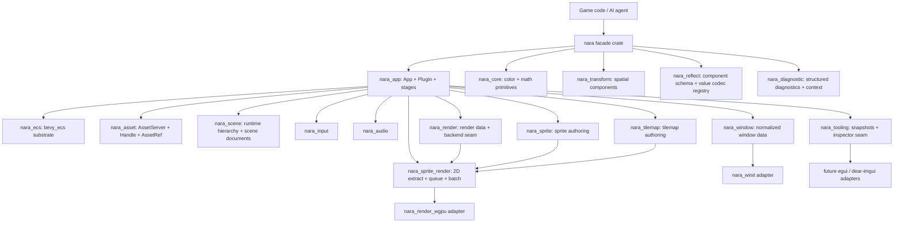
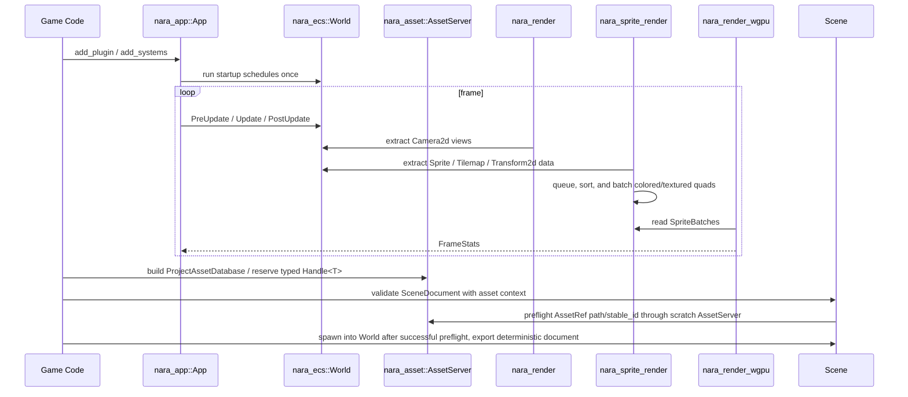

# nara Foundation Architecture

**Status**: Accepted; initial runtime slice implemented
**Created**: 2026-07-08
**Scope**: Phase 1 runtime foundation with seams for Phase 2 tooling and Phase 3 editor.

## Problem

nara needs a Rust-native engine foundation that supports code-first game authoring, strict ECS data flow, and future AI-generated game logic. The repository started as a single hello-world package, so the first decision is not implementation detail but module shape: what should be stable enough for users and agents to build against, and what should stay hidden behind narrow seams.

## Goals

- Keep the public authoring interface small: `App`, `Plugin`, `World`, typed components, asset handles, and renderer-facing data.
- Keep runtime data strongly typed and ECS-first. Scene hierarchy is represented by data components such as `Parent` and `Children`.
- Isolate backends. wgpu, windowing, audio, egui, and dear-imgui must sit behind adapters rather than leak into gameplay code.
- Make Phase 2 serialization and inspection natural by reserving explicit asset, scene, and tooling crates now.

## Non-Goals

- No visual editor in Phase 1.
- No Godot-style object inheritance, node callbacks, or string-path runtime glue.
- No full Bevy-compatible API surface. nara should borrow the shape, not the size.
- No backend leakage into gameplay-facing crates. `winit` and `wgpu` may exist in adapter crates, but default headless authoring should not depend on them.

## Reference Findings

Bevy's useful lesson is the deep-module cluster around `App`, `Plugin`, `World`, and `Schedule`. `repo-ref/bevy/crates/bevy_app/src/app.rs` presents `App` as the main user interface; `repo-ref/bevy/crates/bevy_app/src/plugin.rs` shows plugins configuring an app; `repo-ref/bevy/crates/bevy_ecs/src/world/mod.rs` hides entity/component/resource storage behind `World`; and `repo-ref/bevy/crates/bevy_ecs/src/schedule/schedule.rs` keeps system ordering in `Schedule`.

Godot's useful lesson is product boundary discipline, not its OOP scene tree. `repo-ref/godot/servers/rendering/rendering_server.h` separates rendering behind a server interface, and `repo-ref/godot/core/io/resource_loader.h` exposes resource format loaders as extension points. The parts to avoid are visible in `repo-ref/godot/scene/main/node.h` and `repo-ref/godot/scene/main/scene_tree.h`: `Node` and `SceneTree` accumulate hierarchy, process flags, groups, editor state, and runtime behavior into a large inheritance surface.

wgpu's examples show the lifecycle that nara must hide from gameplay code: create `Instance`, request `Adapter`, request `Device/Queue`, create/configure `Surface`, acquire a surface texture, render pass, submit, present, then recover on resize/lost/outdated surfaces. See `repo-ref/wgpu/examples/standalone/02_hello_window/src/main.rs` and `repo-ref/wgpu/examples/features/src/framework.rs`.

dear-imgui-rs reinforces backend split. The workspace separates core context from platform/render backends in `repo-ref/dear-imgui-rs/Cargo.toml`; `repo-ref/dear-imgui-rs/dear-imgui/src/context.rs` owns ImGui context lifecycle; `repo-ref/dear-imgui-rs/backends/dear-imgui-wgpu/src/lib.rs` and `renderer/render.rs` keep wgpu renderer details behind a backend crate.

## Proposed Architecture

## Crate Boundaries

| Crate | Interface | Hidden Implementation Direction |
|---|---|---|
| `nara` | Facade and prelude | Re-export only; no backend logic |
| `nara_app` | `App`, `Plugin`, `StartupStage`, `CoreStage`, `Time`, `FixedTime` | Plugin ordering, lifecycle, runner policy, frame/fixed-step time resources |
| `nara_core` | `Color`, math re-exports | Core primitives that do not need ECS derives |
| `nara_ecs` | `bevy_ecs` re-export boundary: `World`, `Entity`, `Component`, `Resource`, `Bundle`, `Commands`, `Query`, `Schedule` | Product-facing ECS conventions over `bevy_ecs` |
| `nara_transform` | `Transform2d`, `GlobalTransform2d` | 2D/3D transform propagation and spatial hierarchy integration |
| `nara_reflect` | `ComponentRegistry`, stable `ComponentTypeId`, schema versions, `ComponentValue`, component codecs, `ComponentDecodeContext`, `ComponentEncodeContext` | Bevy-reflect-backed component metadata, asset-aware scene preflight, schema export, and migrations |
| `nara_diagnostic` | `Diagnostic`, `DiagnosticReport`, severity and code model | Structured diagnostics consumed by runtime, tools, and AI agents |
| `nara_asset` | `AssetServer`, `AssetId`, `Handle<T>`, `AssetRef`, `AssetPath`, `ProjectAssetDatabase`, `.meta` records | Import cache records, hot reload, dependency graph |
| `nara_scene` | `Name`, `Parent`, `Children`, `SceneDocument`, `PrefabDocument`, `ScenePatchDocument`, `SceneAuthoringSession`, `PrefabSourceResolver`, `SceneEntityId`, scene spawn/export | Asset-aware validation, patch transactions, undo/redo, live world projection, field-level prefab overrides, nested prefab expansion, hot reload validation |
| `nara_render` | `Camera2d`, `RenderTarget`, `ViewportRect`, `ExtractedView`, `RenderFrame`, `RenderPhaseLabel` | Backend-neutral render-domain data: views, targets, phases, frame lifecycle |
| `nara_sprite` | `Sprite`, `TextureRegion`, `SpriteAnchor`, `Handle<ImageAsset>` texture binding | Sprite authoring component data; no backend handles |
| `nara_tilemap` | `Tilemap`, `TileCoord`, `TileCell`, `TileSet`, `TileAtlasLayout`, `TileLayer`, dirty chunk tracking | Tilemap authoring data that can lower into textured quads now and chunked cached render data later |
| `nara_sprite_render` | `ExtractedSprites`, `QueuedSpriteItems`, `SpriteBatches`, `TextureUvRect`, `SpriteRenderPlugin` | 2D extraction, tilemap lowering, deterministic sort keys, resource-keyed textured quad batches |
| `nara_input` | `InputState`, `KeyCode` | winit event normalization and action maps |
| `nara_window` | `WindowId`, `Window`, `PrimaryWindow`, normalized window events | Raw platform windows, winit event loop |
| `nara_winit` | `WinitPlugin`, `WinitRunner` | Gameplay APIs and renderer backend internals |
| `nara_render_wgpu` | `WgpuRenderPlugin`, `WgpuRenderBackend`, surface policy helpers | wgpu device/surface lifecycle, private pipelines, and colored quad submission from `SpriteBatches` |
| `nara_audio` | `AudioCommand`, `AudioSink` | Decoder, mixer, device backend |
| `nara_tooling` | `WorldSnapshot`, `ToolingPlugin` | egui/dear-imgui inspectors and editor integration |

## Runtime Flow

## Alternatives Considered

### Option A: Bevy-like modular workspace (Recommended)

**Pros**: Familiar Rust engine shape, strong plugin story, clean seams, crates can grow independently.
**Cons**: More crate overhead up front, requires discipline to keep the facade small.
**Decision**: Chosen. It fits code-first authoring and keeps backend churn local.

### Option B: Single crate with modules

**Pros**: Fastest to start, easiest Cargo setup.
**Cons**: Boundaries become social rather than enforced, renderer/tooling dependencies can leak into core, harder for AI agents to reason about ownership.
**Decision**: Rejected for an engine foundation.

### Option C: Godot-like object tree first

**Pros**: Mature editor mental model, easy object inspection, straightforward scene ownership.
**Cons**: Conflicts with strict ECS, pushes behavior into inheritance/callbacks, weakens Rust type guarantees.
**Decision**: Rejected. nara will model hierarchy as ECS relation components.

### Option D: Backend-first renderer package

**Pros**: Produces pixels sooner.
**Cons**: Gameplay code learns wgpu too early; surface/device lifetime concerns leak into API; later tooling and hot reload become retrofits.
**Decision**: Deferred. The `RenderBackend` seam comes first, then `nara_render_wgpu`.

## Success Metrics

| Metric | Target | Measurement |
|---|---:|---|
| Clean workspace check | `cargo check --workspace` passes | Local and CI |
| Test baseline | `cargo nextest run --workspace` passes | Local and CI |
| Foundation compile cost | No heavy graphics/window deps in default facade | Dependency tree review |
| User-facing startup API | A minimal app can call `App::new().update()` and examples can use `Commands`/`Query` systems | Example and smoke test |
| Backend isolation | Gameplay and render-domain crates do not import `wgpu` directly | `rg "wgpu::" crates src Cargo.toml` |
| Tooling readiness | Runtime can produce a `WorldSnapshot` without editor deps | Unit or smoke test |

## Risks and Mitigations

| Risk | Severity | Likelihood | Mitigation |
|---|---|---:|---|
| Rebuilding too much of Bevy | High | Medium | Keep nara's public interface narrower and document rejected scope |
| ECS abstraction becomes a leaky alias | High | Medium | Keep `nara_ecs` intentionally thin, document Bevy ECS semantics, and add nara-owned conventions only at product boundaries |
| Renderer seam too generic for wgpu | Medium | Medium | Build `nara_render_wgpu` next and let real surface lifecycle pressure the interface |
| Tooling leaks into runtime | Medium | Medium | Keep `nara_tooling` as a client of snapshots/registries, not a dependency of core ECS |
| Scene serialization stores runtime entity IDs | High | Low | Implemented `SceneEntityId`, `SceneEntitySource`, and instantiate-time remapping; keep runtime `Parent`/`Children` out of persistent documents |

## Implemented Authoring Foundations

- `nara_reflect` exports a `ComponentSchemaCatalog`, structured `ComponentFieldPath` values, and component value migration chains.
- `nara_scene` edits authoring documents through atomic `ScenePatchDocument` transactions with operation-indexed diagnostics and inverse patches.
- `SceneAuthoringSession` owns the first editor/AI authoring boundary: document-as-truth patch application, undo/redo stacks, dirty tracking, and rebuild-style live `World` projection that only replaces entities it owns.
- Prefab overrides use the same patch transaction model as scene edits. The old whole-component override API was removed before 1.0.
- `PrefabSourceResolver` and `InMemoryPrefabSourceResolver` expand nested prefab instances before spawn. Expanded IDs use the deterministic `anchor/source_entity` namespace rule.
- JSON and RON examples cover schema export, patch roundtrip, and field-level prefab overrides without `winit` or `wgpu`.

## Next Implementation Slices

1. Add an editor/debug UI adapter that consumes `SceneAuthoringSession`, `WorldSnapshot`, `ComponentRegistry`, scene diagnostics, and patch reports.
2. Define incremental `WorldCommand` sync as an optimization over the rebuild-style authoring projection.
3. Extend imported artifact loading from synchronous image examples toward async task-pool-backed hot reload.
4. Add material/sampler authoring above `ImageAsset` once sprites need per-material controls.
