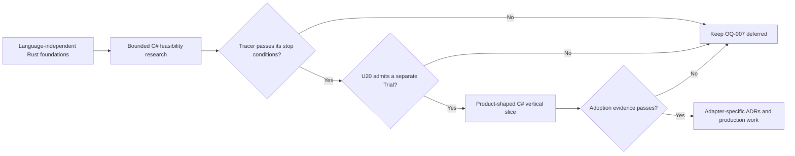

# nara Architecture Open Questions

**Status**: Living Draft
**Updated**: 2026-07-22

This document contains undecided architecture questions only. Accepted decisions belong in ADRs; implementation evidence belongs in `adr/implementation-status.md` and engineering memory. Each question remains open until its trigger creates enough concrete pressure for an ADR.

## OQ-001: Render Execution Model Trigger

- **Status**: open
- **Owner**: `nara_render`
- **Trigger**: An intermediate logical resource, retained/history lifetime, or cross-target dependency requires scheduling that `RenderPassPlan` cannot express.
- **Related ADRs**: 0017, 0032, 0040, 0094, 0096
- **Question**: What is the smallest execution model that satisfies the first static-plan-breaking workflow:
  extended static phases, a minimal execution kernel, or a logical resource
  graph? Which resource, lifetime, ordering, and inspection semantics does that workflow actually
  require?

## OQ-002: Reusable Material and Shader Specialization

- **Status**: open
- **Owner**: `nara_material`, render domains
- **Trigger**: A project needs a reusable material asset, a custom shader interface, or variants that
  must compile across more than one target capability profile.
- **Related ADRs**: 0012, 0033, 0040, 0054, 0094
- **Question**: Which stable shader interface, parameter/binding schema, variant and fallback policy,
  and logical pipeline/cache key belong above backend-native shader modules and PSOs?

## OQ-003: Runtime UI Layout Model

- **Status**: open
- **Owner**: `nara_ui`
- **Trigger**: Text, image, and child intrinsic measurement exist and at least two real panels need responsive layout.
- **Related ADRs**: 0025, 0041
- **Question**: Should the next retained layout slice use flex, grid, or a smaller nara-specific model, and what is the canonical `Auto`/content sizing contract?

## OQ-004: Platform Accessibility Bridge

- **Status**: open
- **Owner**: input/UI platform adapters
- **Trigger**: Toolkit-independent semantic UI actions are implemented and a desktop accessibility API integration is scheduled.
- **Related ADRs**: 0025, 0041
- **Question**: How should platform accessibility trees and assistive actions map onto nara focus, navigation, activation, and text semantics?

## OQ-005: First Concrete Physics Plugin Contract

- **Status**: open
- **Owner**: first official physics integration and its consuming game
- **Trigger**: The first playable physics vertical slice can name body/control modes, transform
  writers, contact/query freshness, determinism, and deployment requirements.
- **Related ADRs**: 0016, 0018, 0019 (Superseded), 0039, 0042, 0057, 0085, 0095
- **Question**: Which concrete 2D library should the first official plugin adopt, when is ECS or the solver authoritative for
  transforms and velocity, and what teleport/kinematic write, query snapshot, contact ordering,
  capability, and event contracts keep backend state coherent without promising solver equivalence?
- **Boundary**: The first plugin owns its components, schema, queries, contacts, sets, and fault
  semantics. It needs one complete reference-game tracer, not a second solver. Replacing it is an
  explicit source/schema/configuration migration unless later evidence admits a portable layer.

## OQ-006: Save-Game Snapshot and Restore Contract

- **Status**: open
- **Owner**: future save/persistence domain
- **Trigger**: A real game requires save/restore across process restart or scene travel and can name
  persistent entities, eligible state, service reconstruction, compatibility, and failure behavior.
- **Related ADRs**: 0027, 0043, 0045, 0051, 0058, 0084, 0089
- **Question**: Which snapshot/baseline, component/resource records, runtime-created identity,
  tombstone, migration, service reconstruction, and transactional restore rules form the first save
  format without serializing an ambient `World` or backend-native state?

## OQ-007: Optional Gameplay-Language Adapter Contract

- **Status**: open
- **Owner**: a concrete gameplay-language Adapter package
- **Trigger**: A real project or target author can name concrete gameplay-authoring,
  collaboration, iteration, or delivery workflows that the complete Rust path does not satisfy well
  enough. Separately reloadable code is one candidate workflow, not a prerequisite for opening this
  question.
- **Related ADRs**: 0003, 0010, 0020, 0034, 0035, 0039, 0042, 0045, 0055, 0076,
  0079, 0081, 0082, 0084, 0086, 0088, 0090, 0093
- **Question**: Which concrete adapter should be trialed first, which lifecycle/data/tooling contracts belong to that adapter, and which contracts have enough independent consumers to move into Nara-owned domain APIs without creating a universal Behavior Host?
- **Current hypothesis**: The preferred product hypothesis and leading first-party trial candidate
  is an optional C# gameplay Adapter using CoreCLR hosting plus the Roslyn/MSBuild toolchain. The
  trial selects the then-current supported .NET LTS; this hypothesis does not select a public SDK,
  runtime version, or Accepted implementation.
- **Current research evidence**: [The LogLog/C# gameplay research
  note](../knowledge/engineering/subagents/2026-07/2026-07-17-loglog-rust-gamedev-csharp-gameplay-research.md)
  maps the experienced Rust-gameplay critique to language relief, engine-owned product work, and a
  disposable Behavior-plus-batch Trial. [The Godot C# integration
  note](../knowledge/engineering/godot-csharp-integration-research.md) examines hosting, assembly and
  runtime generations, source generation, Editor/build/debug workflows, and managed export.
  [The C# authoring-surface
  note](../knowledge/engineering/csharp-gameplay-authoring-surface-research.md) compares the Unity
  and Godot object models and develops the parameterless Behaviour plus explicit binding
  hypothesis. All three are non-normative research evidence and do not advance this question's
  admission ladder.
- **Editor extension boundary**: A future Product Package may carry both managed gameplay and
  managed Editor Contributions, but OQ-007 owns only the gameplay-language Adapter and its Player
  workflow. A C# Dock, Inspector, importer, or build contribution must use the separately admitted
  Editor contribution contract and Host lifecycle owned by OQ-031 or an Accepted successor. The
  current leading placement hypothesis is a replaceable isolated Extension Host; loading trusted
  managed code into the long-lived Editor with a collectible `AssemblyLoadContext` remains a later
  latency optimization with Host/Editor restart fallback, not a prerequisite or an implied
  production capability.
- **Research admission ladder**:
  1. Read-only precedent research may continue at any time, but it may only refine this question or
     language-independent work already justified by Rust consumers. It cannot add a production
     Adapter crate, public C# API, root capability, manifest field, VM dependency, or managed
     artifact layout.
  2. Bounded CoreCLR/Roslyn feasibility research may begin only after this question's Trigger is
     satisfied and the active reference-game plan, or its actively registered successor, has all of
     the following evidence: stable runtime-independent Schema identities and Catalog/native-binding
     separation; an `RGF-U14` Continue result for the Rust headless and desktop first playable;
     `RGF-U17` Host-owned Editor Play/Stop/fresh-Restart; and `RGF-U7` checkout-free Rust candidate
     packaging. Its outputs are design evidence, measurements, and a disposable tracer outside
     production APIs; completing the foundations alone does not admit this research automatically.
  3. A product-shaped C# vertical slice may begin only when `RGF-U20`, or the corresponding closure
     unit of an actively registered successor plan, records a non-blocking next-slice decision that
     admits a separate OQ-007 Trial plan. A missing feasibility tracer, an incomplete result, or a
     triggered stop condition can only keep OQ-007 deferred. An admission record must pin the tracer
     revision, result, and stop-condition verdict and name the target author, Rust workflow gap,
     comparison task, supported desktop profile, maintenance/reversibility budget, and Trial stop
     conditions. It does not change the current Rust release verdict.
  4. Production adoption and Adapter-specific Accepted ADRs require the end-to-end Trial evidence
     below. A technically functioning bridge is not sufficient by itself.

- **Research-timing alternatives**: Starting production Adapter work now is rejected because it
  would make an unproven language shape the Rust foundation. Waiting until every engine subsystem
  is complete is also rejected because Host, Schema, Play, and export constraints would become
  expensive to challenge. The staged ladder above begins disposable research once the relevant
  foundations and Rust baseline exist, while reserving production authority for a separate Trial.
- **Product-shape alternatives**: The trial must distinguish Rust-only, mixed Rust Host/Plugin plus
  C# gameplay, and C#-only projects using a prebuilt Nara Host. An initial technical slice may use a
  project-built Rust Host, but first-party C# product adoption must prove Play and clean export
  without requiring an otherwise empty Cargo application. Cargo remains the Rust graph authority;
  MSBuild/NuGet remains the managed graph authority; Nara must not invent one combined resolver.
- **Product-experience preference**: Aim first for the familiar Godot/Unity C# gameplay workflow:
  create a C#-only project, attach typed gameplay behavior to scene entities, expose stable fields in
  the Inspector, receive source-aware compile diagnostics, use standard .NET IDE/debugger tooling,
  click Play/Stop/restart, and export without author-written Rust. This is a user-experience target,
  not a commitment to copy Godot's `ScriptLanguage` or Unity's `MonoBehaviour` internals.
- **Leading authoring hypothesis**: Evaluate a Unity/Godot-like Behavior facade over
  Adapter-private managed instances first, backed by stable Nara Schema data, generation-stamped
  handles, batched query views, commands, and services. A second managed ECS authority or dynamic
  Bevy component storage remains a counterfactual, admitted only if the Behavior/hybrid tracer fails
  for a named storage or performance reason. Compare another gameplay-language candidate only when
  measured evidence shows that the C# product hypothesis cannot meet an accepted workflow or target
  constraint, not merely because the first implementation is difficult.
- **Leading author-visible binding hypothesis**: Keep the default C# surface domain-oriented rather
  than generating a one-to-one mirror of ECS components or Schema fields. Every dependency in an
  ordinary Behavior must declare one source category: a callback-scoped Host value such as input or
  time; a required same-object domain capability validated before `Start`; an Inspector-authored
  stable reference to another Behavior, scene object, module, asset, or prefab; or an explicitly
  nullable dynamic lookup. The Adapter creates managed instances from Behavior attachments and
  resolves every required binding before lifecycle callbacks begin. Raw component/query access is
  an explicit advanced-layer candidate, not the default gameplay vocabulary. Attribute names,
  generated member shapes, typed-owner shortcuts, and spawn return semantics remain Trial choices.
- **Operation-shape guardrail**: Shared binding work must not assume that every domain interaction
  is a projected property or deferred command. Physics-style synchronous queries, typed callbacks,
  asynchronous request/results, and retained logical handles have different freshness,
  cancellation, ordering, budget, and generation semantics. These are pressure categories, not a
  public universal enum or service trait; concrete public APIs remain domain-owned.
- **Cross-domain promotion gate**: The movement-and-fire slice may validate a disposable or
  Adapter-specific implementation, but it cannot by itself freeze a reusable Nara-owned binding or
  dispatcher contract. Promotion requires focused harness evidence for a physics query plus contact
  callback, an animation parameter/marker/root-motion handoff, a shared-material versus
  per-instance render override, and one cancellable asynchronous service result with a logical
  handle. The harnesses need not implement complete domains and do not admit their public APIs.
- **Author-role separation**: The Trial must distinguish an ordinary C# game author, a managed-only
  gameplay package author consuming existing domain APIs, a native Rust domain package author that
  supplies a managed companion facade, and the engine/SDK author that owns Host and binding
  infrastructure. Before ecosystem parity is claimed, at least one independent managed-only
  package and one independent Rust-backed domain package must install, diagnose, run, stop, and
  update without a core package allowlist.
- **First-trial multiplicity**: One scene entity may attach at most one instance of each stable C#
  Behavior type; different Behavior types remain composable. Repeated configuration should first use
  schema-backed collections or child entities. Multiple same-type attachments require a real game
  workflow and a separate stable attachment identity, ordering, patch-address, prefab, and migration
  decision; an array index, CLR object reference, or GC handle can never be that identity.
- **Unavailable-module requirement**: The first product-shaped trial must exercise ADR 0090-style
  degraded authoring when an assembly, Behavior type, migration, or runtime binding is unavailable.
  The editor preserves and round-trips the complete bounded semantic record, permits proven
  unrelated edits and explicit undoable whole-record deletion, and keeps unavailable fields
  read-only. A new runtime candidate rejects before publication; an existing last-good runtime may
  continue only with explicit generation/status disclosure.
- **Decision surface**: The tracer must decide stable module/type/field/attachment identity; one or
  multiple same-type attachments; persistent, runtime-private, and reload-retained state; Schema
  projection/freeze/migration and missing-type authoring; bounded data access and schedule semantics;
  Host/SDK/generated-binding compatibility identities; managed module generation, last-good
  activation, reload/restart and debugger behavior; exception, `Task`, thread, GC-root, and shutdown
  obligations across runtime generations; deterministic/replay non-claims; project graphs, trust,
  target export, runtime-pack provenance, and supported platform/profile scope.
- **Admission evidence**: One end-to-end game slice must prove schema-backed Inspector fields,
  unique-per-type scene attachment and duplicate rejection, missing-module degraded round trips,
  structured compile diagnostics, bounded gameplay data access, command/service integration,
  Play/Stop/restart behavior, clean-machine desktop export, and measured edit latency, bridge/GC
  frame cost, startup, and package size. For one named target-author persona and the same gameplay
  task, it must compare authoring outcome with the `RGF-U14`/`RGF-U20` Rust baseline, demonstrate a
  material user benefit, remain within a precommitted maintenance/reversibility budget, and show no
  unacceptable regression to the complete Rust path.
- **Adoption impact**: Success may refine project layout/settings (ADRs 0020/0035), Adapter-owned
  Schema projection and lossless missing-type authoring (0045/0081/0090), optional product and CI
  capabilities (0055/0079), and managed target artifacts (0088). ADR 0086 remains the Rust/Cargo
  executable-generation contract; a managed module generation must not masquerade as a native
  executable generation, and shared activation concepts move outward only after both paths prove
  the same contract.
- **Foundation guardrail**: Before this question triggers, continue only language-independent
  foundations already justified by the Rust/editor path. Before the bounded-research gate, only
  read-only precedent work is admitted; before the separate Trial plan, do not add Adapter-specific
  production APIs in anticipation of C#.
- **Terminology**: Existing Nara documents use *managed runtime* for a runtime lifecycle managed by
  a Nara Host/`RuntimeInstance`, not for CLR-managed code. This question uses *.NET runtime* or
  *CoreCLR* when it means the managed-code runtime.
- **Non-commitments**: This hypothesis does not admit a coequal official language, a default VM
  dependency, a universal Behavior Host or scripting ABI, dynamic non-Rust ECS storage, a sandbox
  claim, a fixed Editor/Player process topology, C# editor extension parity, or a platform matrix.

## OQ-008: Authoring-to-Runtime Projection and Baking

- **Status**: open
- **Owner**: authoring document domains, `nara_scene`, `nara_tooling`
- **Trigger**: Two independent authoring types need to generate derived runtime components, entities,
  resources, or dependencies rather than spawning one stored component record to one ECS component.
- **Related ADRs**: 0006, 0007, 0026, 0038, 0043, 0047, 0081, 0083, 0087
- **Question**: Which bounded projection/baking contract owns input snapshots, dependency tracking,
  stable source-to-output provenance, generated identity, failure atomicity, diagnostics, and runtime
  admission without freezing a universal baker from a single scene workflow?
- **Boundary**: OQ-008 owns derived runtime projection and baking from already admitted authoring
  truth. OQ-043 owns persistent document composition, authoring presets, and any stable-ID
  requirement closure. Neither question may implicitly admit the other's carrier or semantics.

## OQ-009: Field-Level Apply Changes

- **Status**: open
- **Owner**: `nara_reflect`, `nara_tooling`
- **Trigger**: The ADR 0034 selected-component Apply Changes baseline is implemented and
  whole-component write-back creates destructive conflicts in a real edit workflow.
- **Related ADRs**: 0034, 0045, 0047
- **Question**: How should field projections, conflict detection, and inverse patches narrow Play Mode write-back?

## OQ-010: Editor Runtime-UI Dogfooding Gate

- **Status**: open
- **Owner**: `nara_ui`, editor adapters
- **Trigger**: Runtime UI has text/IME, keyboard navigation, focus, scroll, accessibility semantics,
  and the layout capabilities required by one complete existing egui panel.
- **Related ADRs**: 0015, 0025, 0041
- **Question**: Which complete editor panel should migrate first, what command/undo/usability/
  performance parity constitutes success, and which later heterogeneous workloads (a virtualized
  hierarchy/table, viewport, timeline, or graph) are required before deciding whether nara UI
  should become the primary editor toolkit? Success with the first panel proves only that panel's
  tooling-model/command separation, not toolkit replaceability or final toolkit convergence.

## OQ-011: Platform Export, Signing, and Store Adapter

- **Status**: open
- **Owner**: product build/export hosts and platform adapters
- **Trigger**: A supported platform or store consumes ADR 0086/0088 build artifacts and requires an
  external toolchain, credentials, signing/notarization, or store-specific publication.
- **Related ADRs**: 0020, 0035, 0051, 0055, 0070, 0086, 0088
- **Question**: Which adapter owns toolchain discovery, credential capabilities, signing and store
  steps, progress/cancellation, receipts, and last-good recovery while target planning and package
  identity remain pure engine contracts?

## OQ-013: Typed Event and Request Channels

- **Status**: open
- **Owner**: `nara_app`, domain crates
- **Trigger**: At least two domains need the same producer/consumer/retention/stage metadata beyond existing typed queues.
- **Related ADRs**: 0023, 0036
- **Question**: Is a reusable typed channel wrapper justified, and which lifecycle metadata can be shared without creating a global bus?

## OQ-014: Audio Voice, Mixer, and Device Boundary

- **Status**: open
- **Owner**: future audio domain
- **Trigger**: The first real game or tool schedules an audio slice that needs concurrent voices,
  buses, streaming, spatial playback, or device suspend/reconnect behavior.
- **Related ADRs**: 0016, 0030 (Superseded), 0042, 0079, 0095
- **Question**: Which backend, stable voice identity and command model, bus/mix graph, streaming
  ownership, spatial intent, and device-session lifecycle implement the first audio slice without
  placing native handles or callback-thread state in the ECS `World`?
- **Boundary**: The first concrete audio plugin owns this API end to end. This question does not
  authorize `AudioBackend`, provider selection, or unchanged-data replacement.

## OQ-015: Text Shaping and Localization Stack

- **Status**: open
- **Owner**: future text, localization, asset, runtime-UI, and tooling domains
- **Trigger**: Runtime UI requires multilingual shaped text, deterministic font import, or a real
  game needs localized content with runtime locale switching and authoring diagnostics.
- **Related ADRs**: 0007, 0025, 0031, 0033, 0049, 0051, 0087, 0095
- **Question**: Which shaping, bidi, fallback, rasterization, and glyph-cache boundary fits Nara's
  asset/render model, and which separate localization contract owns stable message identity,
  fallback chains, plural/select rules, typed argument formatting, runtime locale changes, package
  contributions, locale-specific asset variants, pseudolocalization, and missing-translation
  diagnostics?
- **Boundary**: Font/shaping backend selection and localization content/runtime policy are separate
  decisions. Neither a shaping library nor a string-key table may silently become the other
  domain's authority; package precedence and user locale storage also wait for their owning
  package/settings decisions. A dedicated `nara_text` crate or portable `TextBackend` requires a
  real second consumer or implementation challenge; the first UI/text plugin may own the complete
  shaping path.

## OQ-016: GPU Cache Eviction Defaults

- **Status**: open
- **Owner**: `nara_render_wgpu`
- **Trigger**: ADR 0054 instrumentation and a representative project or constrained target expose
  measured GPU-resident pressure and cache-reuse behavior.
- **Related ADRs**: 0037, 0040, 0054, 0068
- **Question**: Which grace-generation and byte-budget defaults balance reuse, memory pressure, and predictable reclamation?

## OQ-017: Advanced Raw Platform Event Access

- **Status**: open
- **Owner**: platform adapters
- **Trigger**: A supported integration cannot be expressed through normalized input/window/text/accessibility events.
- **Related ADRs**: 0013, 0041
- **Question**: How can advanced users observe raw events without making winit types part of gameplay-facing or persistent contracts?

## OQ-018: Persistent Replay Artifact and Checkpoint Policy

- **Status**: open
- **Owner**: future replay domain and participating runtime services
- **Trigger**: A concrete persistent replay workflow has stable identity/envelope evidence, an
  Accepted ADR 0084 executable runtime owner or explicit Accepted successor, a named
  service-outcome coverage set, and representative
  size/latency measurements.
- **Related ADRs**: 0024, 0042, 0049, 0051, 0057, 0076, 0084
- **Question**: What canonical artifact fields, checkpoint coverage registry, service outcome catalog, checksum algorithm, cadence, compression, compatibility fingerprint, and bounded retention defaults satisfy the first measured replay workflow?

## OQ-019: System-Level Stepping and Breakpoint Executor

- **Status**: open
- **Owner**: `nara_app`, `nara_ecs`, `nara_tooling`
- **Trigger**: ADR 0076 exact fixed-tick stepping and an Accepted ADR 0084 executable runtime owner
  or explicit Accepted successor exists, and a
  real debugging workflow requires pausing inside a fixed tick rather than observing completed ticks.
- **Related ADRs**: 0002, 0003, 0039, 0057, 0076, 0084
- **Question**: Which stable system identity, topology generation, strict execution mode, open-tick transaction, conditional-breakpoint vocabulary, and failure/discard rules can support system stepping without splitting command acknowledgement or allowing parallel work across a claimed breakpoint?

## OQ-020: Rust Hot-Patch Experiment

- **Status**: open
- **Owner**: optional development tooling and runtime host
- **Trigger**: The reference game has separate P50/P95 measurements for compatible function-body and structural Rust edits, the last-good rebuild/restart path is reliable, and compatible edits still miss the iteration target.
- **Related ADRs**: 0034, 0042, 0076, 0093
- **Question**: Can a pinned Subsecond-like development plugin patch coarse explicit Rust call boundaries only after complete tick/schedule quiescence, classify incompatible layout/signature/static/dependency changes, retain a verified-compatible `World`, and fall back deterministically to the last-good rebuild/restart path across Windows and Linux without claiming a stable native ABI or automatic rollback?

## OQ-021: HDR, Wide-Gamut, and Tone-Mapping Contract

- **Status**: open
- **Owner**: `nara_image`, `nara_render`, material domains, render backends, authoring tooling
- **Trigger**: The first HDR output, wide-gamut asset workflow, tone-mapping/color-grading pipeline,
  or display-profile-aware authoring workflow is scheduled beyond ADR 0092's SDR compatibility mode.
- **Related ADRs**: 0005, 0033, 0040, 0092, 0094
- **Question**: Which scene-referred working space, asset primaries, HDR target formats, exposure,
  tone-mapping and color-grading ownership, paper-white/UI composition, mastering metadata, and
  display capability policy extend the SDR path without silently reinterpreting existing content?

## OQ-022: Editor Render Execution Ownership

- **Status**: open
- **Owner**: render/platform adapters and `nara_tooling`
- **Trigger**: The first offscreen editor viewport or multiple isolated edit/play runtimes need to share a device, caches, or render targets.
- **Related ADRs**: 0015, 0034, 0042, 0078, 0094
- **Question**: Should the editor own or lease a shared process-level render execution authority,
  should each isolated App retain an independent authority, or is another model smaller? How do
  bounded frame transfer, target leases, device epochs, cache budgets, and shutdown rules prevent
  one runtime from invalidating another?

## OQ-023: Platform Application Lifecycle

- **Status**: open
- **Owner**: platform adapters, product hosts, runtime service domains
- **Trigger**: The first non-desktop target, or a supported desktop integration, requires lifecycle
  semantics beyond focus/close: ordered suspend/resume, platform-session loss/recreation, or
  platform-requested termination.
- **Related ADRs**: 0013, 0039, 0041, 0042, 0056, 0082, 0084, 0086, 0088
- **Question**: Which normalized lifecycle transition drafts may platform adapters produce, which
  product-host safe point admits them, and which runtime/service sessions quiesce, survive, rebuild,
  or terminate without confusing operating-system suspension with ADR 0039 gameplay pause or making
  one platform adapter authoritative?
- **Boundary**: Cross-domain response to memory pressure remains OQ-024. Permission requests/results
  and orientation/safe-area changes are separate platform-capability and display-state contracts to
  be admitted by concrete target workflows.

## OQ-024: Cross-Domain Memory-Pressure Coordination

- **Status**: open
- **Owner**: product/executable hosts and residency-owning asset, render, audio, and service domains
- **Trigger**: At least two implemented residency-owning domains publish bounded ADR 0068 resident
  and reclaimable-byte observations, and a named supported target/workload proves that independent
  domain policies cannot meet an explicit process memory ceiling or that an ordered response from
  multiple domains is required before the runtime may continue. A platform pressure notification
  alone is not admission evidence.
- **Related ADRs**: 0037, 0040, 0042, 0054, 0068, 0082, 0088, 0089
- **Question**: Which minimal typed pressure episode and request/result contract may a product host
  admit at a safe point so each domain independently decides what to evict, defer, rehydrate,
  degrade, or refuse; reports bounded resident/reclaimable bytes and live-lease blockers; and
  returns continue, degraded, reject, or graceful-stop outcomes without a global allocator,
  universal priority/fairness policy, or violation of live dependency closures and last-good
  generations?
- **Boundary**: Platform adapters only produce normalized pressure drafts. Per-domain cache modes,
  lease/pin semantics, eviction/rehydration algorithms, and numeric defaults remain domain-owned;
  OQ-016 owns GPU cache defaults. Active scene/content candidate admission and atomic publication
  are outside OQ-024. If ADR 0088/0089 are Accepted they own that boundary; otherwise an explicit
  Accepted successor or later residency-closure decision must own it.

## OQ-025: Profiling, Crash Artifacts, and Telemetry Channels

- **Status**: open
- **Owner**: executable hosts, `nara_app`, tooling, and backend adapters
- **Trigger**: A measured performance regression or production crash requires high-frequency CPU/GPU
  timing, schedule/task spans, call stacks, breadcrumbs, or an externally consumable crash artifact
  that the bounded diagnostics bus cannot represent.
- **Related ADRs**: 0009, 0036, 0048, 0068, 0076, 0078, 0084, 0094
- **Question**: Which separate trace, profiler, crash-artifact, and opt-in telemetry contracts provide
  stable correlation, bounded capture, privacy/redaction, retention, and export without turning
  `RuntimeDiagnostics` into a high-volume event stream or process-global policy owner?

## OQ-026: Frame-Critical Job Execution Model

- **Status**: open
- **Owner**: `nara_app`, `nara_ecs`, `nara_tasks`, render domains
- **Trigger**: Profiling shows a fixed-tick, extraction, preparation, or encoding workload cannot
  meet its frame budget through ordinary ECS schedule parallelism or the current background task
  pools without unacceptable latency or synchronization.
- **Related ADRs**: 0003, 0008, 0039, 0052, 0078, 0080, 0084, 0094
- **Question**: Does Nara need a distinct bounded frame-job graph, and if so which dependency,
  work-stealing, affinity, join barrier, panic/cancellation, deterministic-test, and shutdown rules
  separate it from ECS systems, long-running background tasks, and backend-affine workers?

## OQ-027: Network Authority and Replication Contract

- **Status**: open
- **Owner**: future networking/replication domain
- **Trigger**: A playable multiplayer slice can name topology, authority, prediction/reconciliation,
  interest management, latency, bandwidth, player count, and deployment targets.
- **Related ADRs**: 0024, 0028, 0042, 0045, 0056, 0057, 0058, 0089
- **Question**: Which session and entity authority, spawn/despawn, component eligibility, wire
  compatibility, snapshot/delta, interest, prediction/rollback, command validation, and transport
  adapter contracts satisfy that slice without coupling durable records to runtime `Entity` values?

## OQ-028: Animation Evaluation and Write Arbitration

- **Status**: open
- **Owner**: future animation domain and affected component owners
- **Trigger**: The first animation slice writes a field also controlled by gameplay, hierarchy,
  physics, UI, or editor tooling, or requires blending, root motion, markers, or event tracks.
- **Related ADRs**: 0019, 0029, 0039, 0045, 0081, 0085
- **Question**: Which binding/evaluation phases, writer ownership and priority, blend/accumulation
  rules, root-motion handoff, marker/event timing, and fixed-versus-render schedule semantics prevent
  last-writer-wins behavior from becoming the animation contract?

## OQ-029: Gameplay Active and Enabled Semantics

- **Status**: open
- **Owner**: `nara_app`, hierarchy, gameplay, and service domains
- **Trigger**: A real workflow must disable an entity or subtree without despawning it and expects
  defined behavior across systems, physics, animation, audio, input, scripts, and scene travel.
- **Related ADRs**: 0002, 0023, 0036, 0039, 0085, 0089
- **Question**: Is activity local, inherited, or domain-specific; how is it scheduled and queried;
  which enter/exit transitions are emitted; and which identity, hierarchy, service, and authoring
  state remains retained while activity is disabled?

## OQ-030: Navigation and AI Spatial Query Boundary

- **Status**: open
- **Owner**: future navigation/AI domain and spatial data owners
- **Trigger**: A playable AI slice needs a navmesh, grid, pathfinding, dynamic obstacles, crowd
  movement, or asynchronous spatial queries with named 2D/3D and target constraints.
- **Related ADRs**: 0016, 0018, 0042, 0052, 0085, 0089
- **Question**: Which authored/imported navigation data, runtime update/query contract, task and
  safe-point model, stable identities, backend seam, and headless/deterministic guarantees satisfy
  that slice without placing a speculative behavior-tree or global navigation server in core ECS?

## OQ-031: Product Package, Contribution, and Trust Topology

- **Status**: open
- **Owner**: package/build hosts, plugin/editor/importer owners, Editor Shell, security adapters
- **Trigger**: An independently versioned module must install a coherent combination of runtime
  plugin, editor tool, importer, content/template, native extension, or user mod; Cargo-only
  transport creates a measured product-workflow gap; or Editor open/build/Play needs to execute
  project Cargo build scripts, proc macros, native dependencies, importers, or game code whose
  trust has not already been established by the Host.
- **Related ADRs**: 0015, 0016, 0020, 0035, 0042, 0046, 0050, 0070, 0079, 0081,
  0082, 0084, 0086, 0087, 0088, 0090, 0093
- **Question**: Which language-neutral Product Package identity, source and artifact forms,
  resolution/lock metadata, typed Contributions, provenance and trust tiers, target restrictions,
  lifecycle/update policy, and isolation boundaries provide one coherent installation experience
  without inventing a second Cargo/NuGet resolver or treating native code like validated data?
- **Current product hypothesis**:
  - A Product Package is the Unity-like installable, versioned, updateable, and removable unit. It
    may carry content, source/static Rust, managed, native, Editor, importer, build/export, sample,
    documentation, and migration Contributions. No authoring language or loader defines Package.
  - A source extension package anchored to Cargo is one Package source/build form, not the umbrella
    product concept. Managed publish graphs, precompiled native artifacts, content-only releases,
    and future registry releases keep their own provenance and target facts under the same Package
    identity only when an admitted product workflow binds them coherently.
  - Package dependency, authored content, derived import artifacts, and cooked delivery are four
    linked but non-interchangeable graphs. A package may publish a read-only source-content mount
    into one composed authoring-content generation; it is neither an import-cache entry nor an ADR
    0088 runtime content package. Stable asset IDs remain globally collision-checked across that
    generation, so package/project path precedence never rebinds an asset reference.
  - A copied archive, sample, or template becomes explicit project-owned content after import. It
    does not retain package-managed update or deletion semantics merely because it originally came
    from a Product Package.
  - Installation, enablement, compiled artifact readiness, and active generation are separate
    states. The ordinary UI presents four effects: immediate activation, Extension Host
    replacement, Play/Runtime replacement, and Editor restart. Exact enum names remain open.
  - Ordinary executable Editor Contributions default to a replaceable isolated Extension Host.
    Same-process managed or native placement is an explicit fully trusted privilege for proven
    latency or authority needs and may truthfully require Host or Editor restart.
  - Package dependency and ownership behavior should converge on manifest, lock, reverse-dependency,
    update, removal, and editable-local semantics comparable to Unity UPM. Cargo and NuGet/MSBuild
    remain authoritative for their source graphs; a remote Nara registry is not an initial
    prerequisite.
  - One Package may aggregate several Contribution kinds, but each Contribution retains its domain
    Interface, Host, target, candidate/publication, and retirement semantics. Package is not a
    universal callback, process, or rollback transaction.
- **Admission constraints**: Project data cannot grant native-code trust or store its own approval.
  Any future approval must be Host-owned outside the project, bind the project-root capability plus
  source/manifest/lock/features or equivalent executable identity, and invalidate on relevant drift.
  In-process Rust, Cargo build scripts, proc macros, and native importers are fully trusted code;
  only a separately proven process or sandbox Adapter may claim isolation.
- **Protocol and ABI boundary**: The default Extension Host hypothesis permits a versioned semantic
  protocol, not Rust trait objects across processes. A future in-process Native Extension requires
  a separately admitted C-compatible ABI, opaque generation handles, explicit allocator/panic/
  thread/callback/retirement rules, and target-specific conformance. Raw Rust `dyn Plugin`, Bevy
  `World`/`Entity`, UI toolkit objects, and GPU/window handles are not Package ABI values.
- **Editor authority boundary**: The long-lived Editor Shell retains workspace, document, undo,
  selection, window/event-loop, Nara UI, package-transaction, and registry authority. Ordinary
  extensions contribute versioned panels, commands, inspectors, gizmos, import/build operations,
  diagnostics, and bounded surface intents. The Widget/custom-surface protocol waits for complete
  Nara UI and independent tool tracers.
- **Removal boundary**: Cargo dependency removal, provider deactivation, derived-cache garbage
  collection, mounted package content, copied templates/samples, and missing-schema preservation are
  distinct owner-specific actions. A package directory, current manifest, or original filename
  cannot prove deletion authority. Only recorded installation ownership plus matching content
  identity/digest or lease evidence may authorize deletion; modified, adopted, or provenance-unknown
  project files are preserved and reported by default. Editor contribution withdrawal is a catalog
  generation operation, not an uninstall-script side effect.
- **Research basis**: [Package and extension lifecycle research](../knowledge/engineering/godot-unity-package-extension-lifecycle-research.md)
  verifies Godot's addon/GDExtension/restart behavior and Asset Store limitations against Unity UPM
  governance. [Content and Product Package Graph Research](../knowledge/engineering/2026-07/2026-07-22T054245Z-content-and-product-package-graph-research-1c0d7699f5024b15a3b5ea43dc6b6ed9.md)
  records the source/import/cook separation against Unity, Godot, Bevy, and the current Nara
  prototype. The [Package and Extension Product Contract](../plans/2026-07-20-001-feat-package-extension-product-contract-plan.md)
  records the user-facing requirements; neither document admits implementation.

## OQ-032: Incremental Authoring Projection

- **Status**: open
- **Owner**: authoring document domains, `nara_scene`, `nara_tooling`
- **Trigger**: A concrete projection/baking path chosen through OQ-008 is correct, but representative
  edit latency or generated-output churn exceeds the editor budget under full projection rebuilds.
- **Related ADRs**: 0026, 0038, 0047, 0081, 0083, 0087
- **Question**: Which projection dependencies, cached outputs, invalidation granularity, specialized
  patch operations, provenance remaps, and atomic fallback rules can make baking incremental while
  preserving document truth, undo, and the exact output of a clean rebuild?

## OQ-033: Structured Data Asset Schema and Authoring

- **Status**: open
- **Owner**: `nara_asset`, `nara_reflect`, data-owning domains, authoring tooling
- **Trigger**: A reference game needs editor-authorable, hot-reloadable, migratable structured data
  such as weapons, enemies, abilities, dialogue, loot tables, or balance configuration shared by
  multiple scenes/components.
- **Related ADRs**: 0007, 0011, 0033, 0043, 0045, 0051, 0081, 0083, 0087
- **Question**: Which typed value/schema boundary, stable asset/subobject identity, inline and
  external representations, references, migration, validation, editor capabilities, and reload
  semantics support reusable data assets without treating every value as an ECS component or
  expanding component reflection into a universal object system?
- **Metadata boundary**: Keep four planes orthogonal: persistence/eligibility, semantic validation,
  presentation preference, and custom interaction/provider binding. Units, finite ranges,
  enum/flag domains, and asset kinds are cross-tool semantic constraints; slider preference,
  grouping, and compact controls are presentation; coordinated bespoke editors are provider
  behavior. The first real Inspector field that needs each plane must select a typed carrier. Do not
  freeze an untyped metadata bag or a Godot-style stable `hint_string` protocol.

## OQ-034: Gameplay State Topology and Scoped Lifetime

- **Status**: open
- **Owner**: `nara_app`, gameplay domains, scene/tooling integration
- **Trigger**: A reference game simultaneously needs boot/menu/gameplay/pause/game-over states,
  overlays or orthogonal state domains, and explicit system/entity/resource/message lifetime on
  state entry and exit.
- **Related ADRs**: 0003, 0023, 0036, 0039, 0047, 0084, 0089
- **Question**: Which flat, hierarchical, stacked, or orthogonal typed-state topology is justified;
  how do schedules and run conditions observe transitions; and which scoped entities, resources,
  messages, services, persistence, and scene ownership clean up deterministically without creating
  a hidden global scene tree?
- **Current hypothesis**: One Runtime Generation owns exactly one authoritative ECS `World` by
  default; true simulation isolation creates another Runtime Instance and generation. Runtime Scene
  Instances, parent/child hierarchy, prefab provenance, region residency, and Gameplay State are
  orthogonal relations inside that World. A runtime entity has at most one Scene Instance lifecycle
  owner. Gameplay State consists of multiple game- or plugin-owned typed domains that are flat by
  default rather than one global hierarchical tree. Typed transition requests are resolved and
  validated at an explicit safe point before an accepted `Exit -> scoped cleanup -> state switch ->
  Enter` sequence; validation or conflict failure leaves the old state unchanged.
- **Still open**: Evidence for hierarchical or stacked topology within a domain, cross-domain
  transition conflict and ordering policy, Exit/cleanup/Enter fault behavior, and the exact scoped
  entity/resource/message/service contracts. This hypothesis does not accept ADR 0084 or ADR 0089
  and does not authorize a state crate or public scheduler API.

## OQ-035: Spatial World Partition, Streaming, and Origin Policy

- **Status**: open
- **Owner**: scene, asset, spatial, render, physics, navigation, and runtime host domains
- **Trigger**: One active scene exceeds memory or frame budgets, coordinate precision becomes
  visible, or content must stream around a camera/player while cross-region references remain live.
- **Related ADRs**: 0018, 0037, 0053, 0068, 0083, 0085, 0088, 0089
- **Question**: Which cell/layer selection, authored and cooked partition data, cross-cell identity and
  reference rules, residency budgets, activation safe points, hierarchy boundaries, and origin
  shifting coordination satisfy the first large-world workflow across rendering, physics,
  navigation, audio, and networking?

## OQ-036: Panic, Abort, and Native Callback Fault Containment

- **Status**: open
- **Owner**: `nara_app`, executable hosts, `nara_tasks`, and native service/backend adapters
- **Trigger**: A production executable, task worker, system adapter, or native callback can panic or
  fault and the product must choose between process termination, runtime-generation failure and
  fresh restart, or an explicitly proven containment domain.
- **Related ADRs**: 0003, 0008, 0009, 0042, 0048, 0052, 0068, 0078, 0084, 0086, 0093
- **Question**: Which build-profile panic strategy, unwind/abort rules, catch boundaries,
  FFI/native-callback guards, worker failure propagation, invariant invalidation, runtime/process
  terminal states, crash handoff, and fresh-restart policy contain faults without relying on unwind
  across FFI or resuming a generation whose `World`, service, or native state may be compromised?
- **Boundary**: Typed recoverable errors remain the normal contract. Until an admitted containment
  design proves otherwise, catching a panic does not authorize continued gameplay in the same
  runtime generation; OQ-025 owns profiling, crash-artifact, and telemetry channels rather than
  containment semantics.

## OQ-037: First-Party Product Preset and Project Creation Flow

- **Status**: open
- **Owner**: root product composition, project templates/CLI, and Editor project creation
- **Trigger**: The first fresh-user or non-program-author trial must create and run a desktop 2D,
  headless/server, or another supported product without understanding Cargo feature ceilings,
  project capability closure, and internal plugin-group composition.
- **Related ADRs**: 0020, 0035, 0046, 0079, 0082, 0084, 0086, 0088
- **Question**: Should an official template, CLI, Editor flow, or combination own the single
  author-facing product choice and generate matching Cargo features, `nara.toml` requests, and
  first-party plugin composition while preserving the three-layer admission checks internally?
- **Boundary**: This question owns product creation and preset UX, not executable-runtime or outer
  Host topology. Run/Play actions still follow whichever ADR 0082/0084 decisions or explicit
  successors are Accepted when the trigger fires.
- **Admission evidence**: The RGF-U20 clean-room tracer starts outside an existing project, selects
  one supported product preset, and verifies the generated product closure without editing Cargo.
  That tracer may expose the need for a template, CLI, Editor flow, or combination; it does not
  select or accept one by itself.

## OQ-038: Platform Adapter and Runtime Driver Interface

- **Status**: open
- **Owner**: `nara_app`, platform adapters, and concrete product hosts
- **Trigger**: A second production Platform Adapter or Runtime Driver must integrate with managed
  runtimes; an external product host must duplicate the concrete project boot path or use private
  imports; or the first-party platform path cannot enforce runtime-state and safe-point authority
  without ambient `World` access.
- **Related ADRs**: 0003, 0013, 0039, 0041, 0056, 0078, 0082, 0084, 0094
- **Question**: What responsibility split between Platform/Display Adapter, event loop or Runtime
  Driver, and concrete product Host is required, and which callback, static-generic, trait, opaque
  lease, or other Rust shape provides only the normalized event, time, redraw, target, fault, and
  close authority each participant needs?
- **Boundary**: Top-level code-first `App::set_runner` remains a distinct embedding escape hatch;
  ordinary Plugins do not select the process runner. OQ-017 owns advanced raw events and OQ-023
  owns platform application lifecycle. This question does not admit a universal `EngineHost`, raw
  `App`/`World` mutation, or a public object-safe driver trait by default.
- **Admission evidence**: Compare at least two production Platform/Driver Adapters plus one
  clean-room external integration while the ordinary Run/Play/Serve action remains free of driver
  vocabulary. One first-party Winit path may supply pressure but cannot select the shared shape.

## OQ-039: Editor Play Placement and Local Transport

- **Status**: open
- **Owner**: concrete Editor Host, executable runtime owner, tooling command/observation domains
- **Trigger**: A child-process Play mode, crash-isolated preview, remote target, or a second
  production placement must preserve the current Editor Play semantics; or in-process placement
  causes a measured safety, reload, or lifecycle failure.
- **Related ADRs**: 0034, 0047, 0058, 0076, 0082, 0084, 0093
- **Question**: Which in-process, child-process, or hybrid placement owns Play, and what smallest
  versioned local connection preserves control, observation, content/schema lineage, fault,
  retirement, and restart semantics across that placement?
- **Boundary**: Tooling models communicate through bounded generation-stamped commands and
  observations that can be projected onto a connection; they do not expose `World`, native handles,
  or transport types. This question does not currently select IPC, wire encoding, process topology,
  authentication, or a public universal runtime-session trait.

## OQ-040: Editor-to-Play Live Edit

- **Status**: open
- **Owner**: document owners, concrete Editor Host, runtime edit adapters, provenance/tooling models
- **Trigger**: A measured authoring workflow needs a committed document edit to affect an active
  Play runtime without a fresh runtime, beyond the one-shot safe-point edit proven by the first
  Play/Inspector slice.
- **Related ADRs**: 0026, 0034, 0038, 0047, 0076, 0084, 0090, 0093
- **Question**: Which component/field changes are safely projectable, at what safe point, and how do
  document revision, runtime generation, scene instance, prefab provenance, validation, overwrite,
  and fault outcomes remain explicit?
- **Boundary**: The validated document commit is authoritative. Runtime projection is a subsequent
  best-effort operation whose result distinguishes at least `Applied`, `Stale`, `Unsupported`,
  `Overwritten`, and `Faulted`; projection failure never rolls back a successful document commit.
  This question does not select a wire format, retained runtime override layer, arbitrary Rust-state
  migration, or edit-while-playing merge algorithm.

## OQ-041: Tooling Observation and Remote Command Session

- **Status**: open
- **Owner**: `nara_tooling`, runtime observability owners, concrete Editor/debug Hosts
- **Trigger**: A timeline, profiler/debugger, remote target, child-process Play runtime, or AI tool
  needs incremental observation or command results rather than bounded one-shot snapshots.
- **Related ADRs**: 0048, 0058, 0068, 0076, 0082, 0084
- **Question**: What session contract owns an initial baseline, monotonic sequence, subscription
  lifetime, coalescing/drop policy, backpressure, resynchronization, command/result correlation,
  stale-write rejection, disconnect, and reconnect across runtime generations?
- **Boundary**: Stable IDs, schema eligibility, disclosure/redaction, bounded queues, and explicit
  dropped-data evidence apply before transport selection. Temporal correlation remains distinct from
  proven causality. Transport, authentication, process placement, and high-frequency tracing remain
  deferred to the concrete consumer.

## OQ-042: Runtime User Data, Preferences, and Save-Root Authority

- **Status**: open
- **Owner**: executable/product Hosts, future persistence/settings domains, platform adapters
- **Trigger**: A shipped game needs per-user preferences, bindings, accessibility options, save
  slots, cloud synchronization, profile selection, or a platform-specific writable root.
- **Related ADRs**: 0027, 0035, 0041, 0050, 0051, 0070, 0091
- **Question**: Which authority, root capability, envelope, migration owner, conflict policy,
  privacy classification, quota, atomic-write guarantee, and package-removal behavior belongs to
  project settings, runtime user preferences/save data, Editor workspace state, build/export
  profiles, Host overrides, and secrets?
- **Boundary**: These scopes remain distinct. Runtime preferences and saves do not write back to
  `nara.toml`, Scene/Prefab documents, or Editor workspace files by default; project files cannot
  self-authorize access to user data or secrets.

## OQ-043: Persistent Component Composition and Hook Semantics

- **Status**: open
- **Owner**: `nara_reflect`, `nara_scene`, component-owning domains, authoring tooling
- **Trigger**: A real editable component family needs ergonomic multi-component authoring beyond
  ADR 0006's explicit persistent set, or the first Sprite/Camera/physics workflow demonstrates that
  explicit composition creates unacceptable error or repetition.
- **Related ADRs**: 0002, 0006, 0011, 0026, 0038, 0043, 0045, 0081, 0090
- **Question**: Should Nara keep explicit document composition with an authoring preset that lowers
  to one patch, or admit a catalog-derived stable-ID requirement closure? How do defaults,
  transitive and diamond precedence, cycles/conflicts, explicit override/removal, prefab overrides,
  undo, migrations, unavailable providers, and hook containment behave consistently?
- **Boundary**: Bevy `#[require]`, component hooks, and observers are not persistent semantics by
  inheritance. Any admitted derived closure must be bounded, deterministic, versioned, included in
  the catalog fingerprint, and identical across Scene, Prefab, Inspector, migration, and direct
  persistent spawn. Arbitrary hook effects on resources, foreign entities, native services, or
  deferred queues cannot be described as transactionally rolled back without separate evidence.

## OQ-044: Schema Owner Lineage and Composed Catalog Readiness

- **Status**: open
- **Owner**: `nara_reflect`, product composition, document owners, and authoring hosts
- **Trigger**: An optional persistent plugin is disabled and later re-enabled, a document opens
  without one plugin, or a schema-owning package upgrades independently from the product recipe.
- **Related ADRs**: 0011, 0035, 0045, 0046, 0079, 0081, 0090, 0095
- **Question**: What minimal records separate each schema owner's version/tombstone lineage from a
  recipe's composed catalog fingerprint, and how do Complete, KnownUnbound, UnknownSchema,
  dependency traversal, migration, reactivation, and runtime binding readiness compose?
- **Boundary**: Omitting a provider from one recipe is not schema deletion and cannot create a
  permanent tombstone. Runtime/Play/Cook require complete bindings. Degraded documents may preserve
  bounded generic records only if ADR 0090 is accepted; unknown dependency semantics block asset
  closure, rename/delete, remap, flatten, cook, and export rather than guessing.
- **Accepted bounded decision**: ADR 0098 selects explicit owner-local lineage plus an owner-aware
  active Runtime composition, while deliberately deferring an owner-aware package/lock wire format
  and every degraded-authoring readiness state. This question remains open for those deferred
  records and workflows.

## OQ-045: Plugin Package Contribution and Official Product Recipe Ergonomics

- **Status**: open
- **Owner**: `nara_app`, root product composition, facade/preludes, schema-owning plugins
- **Trigger**: A clean-room external plugin with persistent components joins both a direct App and
  the official code-first/file-backed desktop recipe without private APIs.
- **Related ADRs**: 0035, 0044, 0046, 0079, 0081, 0095
- **Question**: What smallest typed helper binds one plugin, its schema providers, immutable Rust
  config, and any separately admitted package contributions once; how can a user append it to an
  editable official recipe without definition IDs, fingerprints, slot anchors, or parallel lists?
  If a real project later needs file-backed plugin settings, should the plugin own a versioned asset
  or a namespaced manifest extension, and how are missing-plugin round trips and profile overlays
  defined?
- **Boundary**: Preserve pure planning, closed commit, stable inspection, and explicit Host
  authority. This does not authorize dynamic code download, a global package registry, string-based
  provider selection, hidden dependencies, or plugin hooks that install plugins/runners.
- **Vocabulary boundary**: The candidate `package(config)` helper is a narrow compiled Rust root
  contribution for one Plugin plus Schema closure. It is not the OQ-031 Product Package, Package
  Manager, installation identity, managed/native loader, or multi-role activation contract.
- **RPR-U3 trial evidence**: Root `ProductRecipe` now carries replayable runtime-only entries and
  `SchemaContribution` binds one schema-owning plugin to its declared provider definitions. The
  file-backed resolver consumes those definitions during the existing frozen-registry admission,
  while direct `App` composition installs the same authority before the schema-owning plugin builds
  through the normal `PluginGroup` path. Focused first-party tests prove fresh reconstruction,
  typed configuration replacement, duplicate rejection before App mutation, divergent-receipt
  rejection, and direct/file-backed schema-fingerprint parity; the headless and Editor facades run
  the same recipe, and the desktop facade enters the same shared start path. This is implementation
  trial evidence, not external-package admission.
- **Leading trial hypothesis**:
  - Keep ordinary runtime-only extension exactly on the `Plugin` / `PluginGroup` / tuple path. A
    plugin that owns no persistent schema must not learn a package vocabulary.
  - Trial one narrow root-facade contribution value that pairs replayable typed plugin definitions
    with their `ComponentSchemaProviderDefinition` values. Keep it outside `nara_app` so the App
    layer does not depend on reflection, project ingestion, or a universal package model.
  - Let the same opaque value lower to its runtime plugin definitions when passed to direct
    `App::add_plugins`, and let an official project recipe consume the complete value through an
    unordered `.add(...)`. The package author, not the game author, supplies stable definition and
    schema-binding details.
  - Make the official desktop combination one normal inspectable/editable recipe assembled from
    ordinary first-party entries. Code-first and file-backed paths must lower through the same
    recipe construction; file-backed settings add lineage and semantic capability admission rather
    than choosing plugin/provider IDs.
  - Keep process authority out of the recipe. A root desktop-run facade should consume the
    configured App/recipe and hide candidate admission, winit driving, publication, and truthful
    retirement from ordinary examples without allowing a plugin hook to select the runner.
  - Defer a general `PackageDefinition`, multi-role contract kernel, package registry, importer or
    tooling aggregation, and manifest extension map until a real package needs more than runtime
    plugins plus persistent schema.
- **Required tracer**: A renamed-dependency external crate must expose one typed `package(config)`
  helper and pass four journeys: direct App, code-first desktop, file-backed desktop, and headless.
  The game-authored call sites may not import the advanced prelude, construct `PluginDefinition`,
  pass a schema provider separately, name a slot/anchor, or select a provider in `nara.toml`.
  Runtime-only plugins must remain directly appendable without the helper. Equivalent recipes must
  resolve the same plugin IDs, exact schema bindings, and catalog fingerprint before this question
  can graduate.

## OQ-046: Canonical Authoring Serialization Format

- **Status**: open
- **Owner**: scene/prefab/patch/schema format owners and authoring Hosts
- **Trigger**: Missing-schema preservation, migration, canonical diffs, package exchange, or editor
  save/recovery demonstrates material duplicate cost or divergent semantics across JSON and RON.
- **Related ADRs**: 0006, 0043, 0049, 0051, 0090, 0091
- **Question**: Should Nara stabilize one canonical source-authoring format and treat the other as an
  import/export representation? Which choice best supports deterministic canonicalization, human
  diffs, bounded parsing, unknown-record preservation, migration tooling, asset-store review, and
  Rust-native ergonomics?
- **Boundary**: Current JSON/RON readers and fixtures remain implementation evidence until a
  successor ADR decides the format contract. This question does not authorize dropping a readable
  format, rewriting project files, or maintaining two permanent canonical writers without measured
  workflow evidence and a migration plan.
