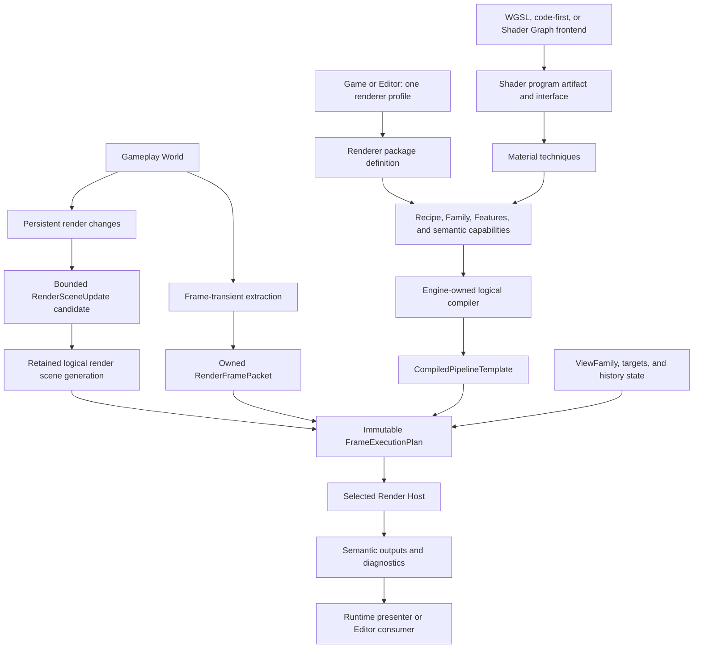

# Render Capability Demand and Pressure Matrix

**Status**: Design Draft - demand and falsification harness, not a roadmap or frozen Rust API

**Created**: 2026-07-15

**Last Updated**: 2026-07-15

**Owner**: `nara_render`, render-domain packages, `nara_render_wgpu`, product composition, and
Editor render integration

**Authority**: Non-normative design workbench. Accepted ADRs remain authoritative on conflict.

**Normative Decisions**: [ADR 0005](adr/0005-dimension-aware-runtime-with-2d-first-authoring.md),
[ADR 0032](adr/0032-render-backend-integration-boundary.md),
[ADR 0077](adr/0077-render-pipeline-recipes-graph-compilation-and-backend-encoding.md),
[ADR 0078](adr/0078-render-host-affinity-webgpu-initialization-and-device-recovery.md), and
[ADR 0092](adr/0092-sdr-color-space-alpha-and-output-encoding.md)

**Related Design**:
[Render Extension Capability Interface Design](render-extension-capability-interface-design.md)

**Validation Plan**:
[Render Extension Parity Tracers Plan](../plans/2026-07-15-001-feat-render-extension-parity-tracers-plan.md)

The validation plan remains inactive until its recorded reference-game release or exact handoff
gate passes. This document does not authorize parallel renderer implementation.

## Verdict

Nara should preserve an SRP-level layered renderer extension model, but it should not clone Unity's
SRP types, make complete renderer replacement the ordinary plugin path, or build a marketplace in
advance of demand.

The evidence supports four authority and admission classes, not measured usage-frequency tiers:

1. Shader, material, renderable-domain, post-process, and Editor-visualization extensions recur
   across the compared mature engines and should be normal supported workflows.
2. Complete renderer policy replacement is real but globally consequential. It should be an
   advanced Pipeline Family capability proved by a production-shaped external tracer.
3. Exact GPU/native integration serves specialized vendor, compute, video, and XR workflows. It
   should require explicit authority and Host scheduling.
4. Complete Device, target, submission, or presentation replacement is the highest-authority
   class. It remains a conformance-tested Render Host escape hatch, not ordinary package authoring.

There is no verified usage telemetry proving that third-party complete renderer packages are
frequent. Their architectural value is narrower: an admitted renderer workflow should not require a
permanent source fork merely because it changes material, lighting, visibility, or frame topology.

Nara's first-party renderer must remain a coherent supported product. Extensibility is not a reason
to turn the default renderer into an assembly kit.

## Why This Is A Nara Requirement

Nara's strategy targets Rust developers and studios that want both integrated production workflows
and Rust-level control. A fixed renderer plus source forks would preserve theoretical freedom but
would make engine upgrades, Editor integration, diagnostics, headless closure, and package reuse
the responsibility of each game team.

The current implementation does not yet provide this capability. It has an explicit but static
`RenderPassPlan` and a stock wgpu quad path. The accepted Family, Feature, recipe, compiled-template,
frame-plan, interop, and replacement-Host contracts remain mostly unimplemented. This document
therefore evaluates whether the planned seam is worth proving; it does not describe current product
support.

The project-specific case for the seam is conditional:

- the stock portable renderer and an independent stylized renderer must exercise genuinely
  different policies through the same compiler and Host;
- lower-authority extensions must not be forced to become complete renderer families;
- the reference game and first-party renderer remain the source of default-product requirements;
- public Interface is retained only when a clean-room external package cannot be implemented
  through a smaller admitted capability;
- no package registry, store, signing system, or stable native ABI is implied. Cargo, Git, and local
  source packages remain the current distribution path.

## Demand Admission Rules

A scenario may pressure a core semantic contract only when all of these rules hold:

1. **Independent demand**: at least two unrelated workflows need the semantic, or one current
   product workflow plus one production-shaped external tracer needs it.
2. **Lowest sufficient authority**: the scenario uses Material before Feature, Feature before
   Family, Family before interop, and interop before Host replacement unless a lower level cannot
   express the required outcome.
3. **Stable meaning**: the proposed semantic survives more than one Pipeline Family and is not a
   renamed wgpu flag, stock pass name, or private G-buffer layout.
4. **No ordinary-user tax**: unselected capabilities add no per-frame registry lookup, package-ID
   dispatch, GPU allocation, or authoring concepts to the default game path.
5. **Inspectable failure**: compatibility, fallback, platform support, authority, rebuild effect,
   and any applicable persistent last-good state are known before publication.
6. **Falsifiable evidence**: the tracer can fail without being weakened, special-cased, or repaired
   by editing stock core after its Interface freeze.

A public Rust Interface does not freeze merely because the semantic is admitted. It additionally
requires two production-shaped Adapters and a clean-room conformance fixture. Test doubles alone do
not create a public seam.

## Renderer Capability Gradient

| Capability | Example workflows | What it may control | What it must not acquire implicitly |
|---|---|---|---|
| Shader or Material Technique | Surface appearance, parameters, shading code, specialization | Shader program and material bindings compatible with one or more Families | Frame topology, target ownership, Device/Queue |
| Render Feature | Outline, fog, water composition, post-process, debug view, extra renderable domain | Declared inputs/outputs, pass fragments, queue policy, scoped encoding | Complete lighting/material policy, target acquire/present |
| Pipeline Family | Portable 2D, forward/deferred, stylized or custom lighting renderer | Material model, lighting, visibility, view expansion, Feature compatibility, complete logical topology | Device/Queue, target acquire, submit, present, recovery |
| Wgpu/Native Interop | Vendor upscaler, external image, exact compute, native SDK | Declared exact capabilities and epoch-scoped resources in a Host slot | Independent queue/target ownership outside its declared mode |
| Render Host Adapter | XR compositor, external submission model, complete GPU execution replacement | Device/Queue, targets, encoding/submission, present/publication, recovery, close | Platform event loop unless separately selected |

The gradient is an authorization rule, not five runtime layers. An ordinary game selects one
Renderer Profile and uses normal gameplay Plugins. A portable toon renderer normally uses Material
Techniques, Features, and perhaps a Pipeline Family while retaining the stock wgpu Host.

Runtime Plugin, Platform Adapter, and Runtime Driver/Runner are adjacent product-composition roles,
not higher renderer permissions. A Platform Adapter may own display/window integration; a Runtime
Driver/Runner may drive time, events, wake, and close. Neither role gains renderer policy, and the
current parity plan validates only the driver/runner role while deferring the display/window Adapter.

## Engine Comparison

| Engine | Useful precedent | Limitation Nara should not copy |
|---|---|---|
| Unity | Shader Graph, URP Renderer Features, HDRP Custom Passes, Render Graph, custom SRP renderer policy, native graphics interop, coherent pipeline assets | URP and HDRP use different shader, lighting, and feature contracts; their extension points are not one universal cross-Family vocabulary |
| Godot | Experimental product-facing `CompositorEffect`, low-level `RenderingDevice`, internal `RenderingDeviceGraph`, separate Visual Shader frontend, integrated viewport/editor | Complete third-party renderer replacement is not its ordinary extension path; some effect inputs are renderer-specific or unavailable |
| Bevy | Typed Rust materials, open render schedules, post-device RenderDevice/Queue and encoder access, plugin-supplied advanced features | Outside stock renderer conventions, extensions coordinate through ECS resources, schedules, plugin/init ordering, and feature-specific contracts rather than one inspectable Family contract |
| Unreal | Material Editor, shader plug-ins, RDG, renderer modules, and deep source access | RDG is a pass/resource API rather than a public complete-renderer replacement contract; for example, adding a new shader model to the Material Editor is unavailable through plug-ins and requires engine-level customization |

These engines do not prove that Nara should use their names or types. They do corroborate the
separation between shader authoring, declared frame work, complete renderer policy, and exact GPU
execution.

## Corrected Data Flow

Persistent scene state and frame-transient state require separate channels. Shader authoring and
frame scheduling also remain separate graphs.



`Retained logical render scene` does not mean a public second ECS World. It is the complete,
backend-neutral render projection against which ordered scene updates and frame plans are
validated. A map, arena, private ECS, render worker, or other storage remains an Implementation
choice.

`Shader Graph` does not mean `Render Graph`. Shader Graph is an optional compiler frontend for one
shader/material program. Render Graph compiles frame passes, resources, dependencies, lifetimes,
and final consumers.

## Interface Silhouette

The Interface should be designed now at the level of user actions, invariants, ordering, errors,
and performance. Exact traits, associated types, builders, erased carriers, and async factories are
too early.

Three conceptual actions form the smallest useful silhouette:

```text
Package author -- define --+
Game or Editor -- select --+--> root composition and render compiler
Product Host --- grant ----+
```

- **Define** supplies a pure, inspectable package definition. It performs no I/O, `App` mutation,
  Device creation, thread creation, or Host publication.
- **Select** chooses one Renderer Profile for the product. That preset creates or selects a
  project-owned Pipeline Recipe; `nara.toml` and stable per-view overrides refer to Recipes. Project
  settings, Editor UI, and code-first helpers lower into the same selection intent.
- **Grant** separately authorizes trusted-native interop, Host, or platform roles. A package cannot
  grant authority to itself, and renderer selection is never implicit native consent.

The ordinary game-author target remains intentionally small:

```rust
nara::desktop()
    .renderer(ink_renderer::renderer(InkProfile::Desktop))
    .add_plugins(GamePlugin)
    .run()
```

This is an ergonomic target, not a frozen signature. In the Editor the equivalent workflow is:

```text
install source package
  -> inspect dependencies, compatibility, native authority, and fallbacks
  -> select renderer profile
  -> create or select a project-owned Pipeline Recipe and edit its recipe/material data
  -> compile or reload
  -> inspect last-good status and diagnostics
  -> play
```

Package dependencies should be hidden from ordinary operations but visible to audit. A renderer
profile may automatically select its bundled Family, required Features, material techniques, and
runtime extraction systems through pure composition. That is not hidden `Plugin::build` mutation:
the complete closure is inspectable before activation.

A renderer-package author should see one domain-specific facade, conceptually:

```rust
pub fn package() -> Result<PackageDefinition, PackageAuthorReport> {
    RendererPackage::define(PACKAGE)
        .renderer(ToonRenderer::definition())
        .finish()
}
```

`RendererDefinition` is a working label for a complexity firewall, not a committed public type. It
may aggregate profile schema, pure logical planning, material techniques, Features, retained and
frame inputs, semantic capabilities, fallback, and Editor outputs. It must not collapse exact
interop or replacement Host authority into an ordinary Family definition.

The engine-owned compiler and Host hide catalog binding, receipts, graph validation, resource
lifetime, packet erasure, scene storage, capability lowering, physical allocation, target
transactions, queue order, epoch recovery, diagnostics privacy, and finite close. Exposing a trait
for each hidden mechanism would create many shallow Interfaces rather than one deep Module.

## Requirement Pressure Matrix

The classification records authority, admission evidence, and repeated mature-engine workflows. It
does not claim usage frequency or make a delivery promise.

| Workflow | Lowest sufficient capability | Stable semantics pressured now | Evidence disposition |
|---|---|---|---|
| Custom shader/material and simple cel shading | Shader/Material Technique | Stable parameters/resources/entry points, dependency and interface identity, material compatibility, last-good | Baseline authoring need; first material vertical slice |
| Toon renderer with outlines on stock lighting | Material + Render Feature | Depth/normal availability, transparent ordering, declared extension points, fallback | Portable Feature tracer; must not require interop or Host |
| Toon renderer with custom lighting, shadows, or topology | Pipeline Family + Material + Features | Complete policy, Family/Feature compatibility, semantic outputs, profile selection | External stylized Family tracer; high-value proof, not default path |
| Pixel-art 2D, palette pass, integer scaling, render-to-texture | 2D Family/recipe + Feature | Logical resolution, target extent, sampling, composition, offscreen final consumer | First-party baseline plus portable Feature tracer |
| Terrain, vegetation, voxel, or large-world streaming | Runtime domain + retained scene + Feature/scoped encoding | Create/update/remove, stable identity/generation, residency, stale work, backpressure, resync | Retained-scene pressure case; should not require a new Family by default |
| GPU particles or VFX | Runtime domain + Feature/scoped encoding | GPU-resident simulation, bounded spawn input, ping-pong history, reset/migrate policy | Later domain tracer; preserve semantic inputs now |
| Water, fog, clouds, portals, mirrors | Feature plus auxiliary views | Cross-view resources, ViewFamily, history, reflection/refraction targets, fallback | Multi-view/history pressure; no fixed global pass-name enum |
| Temporal anti-aliasing or upscaling | Feature; exact vendor implementation may use interop | Motion/depth/exposure inputs, jitter, dynamic extent, history invalidation, spatial fallback | Adversarial history tracer; vendor SDK later |
| Custom lighting or GI | Family-specific Feature or complete Family; ray query may use interop | Material/lighting contract, auxiliary views, history/denoise, capability variants | Stylized Family pressure now; ray-query capability pressure only |
| Editor gizmos, selection, debug views, thumbnails | Tooling model + Feature + semantic output consumer | Stable identity, overlay, picking, bounded capture, Edit/Play isolation | Required Editor compatibility evidence |
| Windowless capture, CI rendering, offline thumbnails | Family + offscreen target; no OS window Adapter | Explicit stepping, completion/readback, target publication, backpressure | Offscreen target tracer; distinguish from no-render server |
| Video codec, external image, vendor upscaler | Wgpu/native interop | Exact capability, external resource lifetime, queue slot, epoch, fallback, cancellation | Advanced platform-scoped tracer |
| XR stereo/foveation | ViewFamily + Family/Feature; exact compositor may need interop | Atomic multi-view publication, array targets, predicted time, mirror output | Offscreen simulator before real XR |
| XR compositor or independent present/submission | Replacement Host plus Platform Adapter | Exclusive target/device authority, external sync, recovery, finite close | Exceptional escape hatch; no near-term XR product claim |

The matrix intentionally prevents common over-escalation:

- a toon renderer does not automatically justify interop or Host replacement;
- terrain and particles do not automatically justify a complete Pipeline Family;
- a vendor upscaler does not automatically justify a second queue owner;
- a headless server has no render Adapter, while a windowless GPU render job has an offscreen Host
  target;
- an unsupported semantic input produces a declared fallback or rejection, never a silent stock
  behavior substitution.

## Semantics To Preserve Before Interface Freeze

### Retained scene and frame-transient split

- persistent create, update, and remove operations use stable logical identity and non-reused
  generation evidence;
- removals remain observable until acknowledged or superseded by a complete resynchronization;
- a missing sequence, overflow, stale generation, or rejected candidate cannot partially mutate the
  active scene;
- backpressure is bounded and cannot silently discard state-changing updates;
- a complete snapshot/resync path exists;
- publication is atomic at a frame-safe boundary and preserves the prior complete generation on
  failure;
- physical GPU objects remain Host/device-epoch realizations, not logical scene state.

### View, target, and history

- View, ViewFamily, auxiliary View, target, and history slots have stable logical identity distinct
  from frame-local indices and runtime `Entity` values;
- ViewFamily defines which related views must publish atomically, without implying one fixed stereo
  or shadow representation;
- camera cuts, target resize/format/sample changes, recipe or Family changes, origin rebasing,
  incompatible shader/material changes, and device-epoch changes declare history invalidation;
- every external target has one final consumer and one present/publication boundary per target
  transaction;
- semantic outputs describe purpose, format/color meaning, extent, layer/sample shape, and fallback
  without exposing GPU handles.

### Shader and material artifact

WGSL, future WESL, code generation, and a future Shader Graph frontend lower into one validated
shader program artifact plus an inspectable interface. The stable semantics include:

- entry-point, parameter, and resource identities;
- interface digest and compatible material/Family contract;
- source and imported dependency identity;
- required semantic and exact backend capabilities;
- source-map and bounded diagnostic provenance;
- cook/cache identity, generation, and last-good publication;
- variant/specialization inputs and bounded expansion.

The concrete artifact representation, reflection implementation, node graph IR, node library,
derive helpers, and Editor UI remain deferred.

### Family and Feature compatibility

- a Family exposes versioned semantic inputs, outputs, material models, and extension points;
- a Feature declares needs, provides, conflicts, fallback, and view applicability;
- compatibility resolves before device creation and runtime publication;
- a Feature may be portable across Families or intentionally Family-specific;
- Nara does not promise arbitrary cross-Family Feature or material compatibility;
- pass ordering uses declared dependencies and semantic extension points, not plugin registration
  order or global string pass names.

### Authority, failure, and performance

- ordinary Family and Feature planning is pure, deterministic, authority-free, and bounded;
- exact experimental GPU capabilities require explicit code/product/Host opt-in; project data may
  request but cannot grant them;
- composition, logical compilation, Host startup, frame skip/fault, and incomplete close retain
  distinct error and retry semantics;
- active templates, scenes, recipes, shaders, and realizations publish by complete generation and
  preserve last-good state;
- frame execution performs no package discovery, contract-string lookup, or speculative Interface
  callback dispatch;
- headless/server products contain no selected render, OS-window Adapter, exact interop, or Editor
  closure. Backend-neutral window vocabulary is evaluated separately from an OS window Adapter.

## Alternatives Considered

### Option A: One fixed first-party renderer plus material and post-process hooks

**Pros**: Smallest implementation, strongest default compatibility, lowest support matrix.

**Cons**: Custom material/lighting/visibility/topology work eventually requires backend edits or a
permanent fork. The hook set grows into an implicit renderer Interface without complete resource or
compatibility semantics.

**Decision**: Rejected as the long-term ceiling. It remains the implementation starting point.

### Option B: Bevy-style broad mutable RenderApp and direct GPU resources

**Pros**: Excellent local Rust leverage, easy experimental systems, very little up-front contract
work.

**Cons**: For extensions outside stock conventions, resource lifetimes, history, target ownership,
capability timing, Editor compatibility, headless closure, and recovery are coordinated through ECS
resources, schedules, initialization/plugin order, and feature-specific conventions. Those are
powerful local mechanisms, but they do not form one pre-activation inspectable Family contract.

**Decision**: Rejected as the ordinary public model. A minimal execution kernel remains a fallback
only if typed clean-room tracers prove the declarative roles insufficient.

### Option C: Freeze a universal public Render Graph and SRP trait now

**Pros**: Gives authors an immediate concrete surface and makes examples easy to write.

**Cons**: Freezes graph storage, trait dispatch, material contracts, Host placement, and browser
constraints before two production-shaped adapters exist. It is likely to expose shallow internal
mechanisms and retain compatibility scaffolding around the wrong first shape.

**Decision**: Rejected. Freeze semantic outcomes and Interface silhouette, then let tracers choose
the smallest Rust shape.

### Option D: Layered capabilities behind one renderer-profile experience

**Pros**: Preserves a coherent default, gives common packages small Interfaces, permits complete
renderer policy and exact escape hatches, and supports pre-device validation plus Editor inspection.

**Cons**: Requires stable identities, compatibility declarations, conformance suites, migrations,
and more engine-owned compilation than a raw callback model. Complete Families increase the support
matrix and can fragment materials or Features.

**Decision**: Chosen, subject to the clean-room reversal triggers below.

## Reversal Triggers

The layered direction is revised rather than defended when any of these conditions occurs:

1. No second production-shaped Pipeline Family emerges before public Interface freeze, and the
   stylized renderer is fully expressible through Material and Feature seams. Keep Family internal
   or explicitly unstable rather than freeze a hypothetical public seam.
2. An external Family needs a first-party ID, core match arm, private stock-backend provider, or
   post-freeze stock edit. Reopen Family/compiler ownership instead of weakening the fixture.
3. A valid renderer workflow cannot express required execution through typed scene/frame data,
   Features, Family planning, or scoped interop. Evaluate the smallest public execution kernel; do
   not grant every Plugin ambient Host authority by default.
4. The declared model adds measurable frame-registry, allocation, or compilation cost to an
   unchanged stock renderer. Move more work behind compile-time or generation-time planning.
5. Editor compatibility forces every Family to expose one stock G-buffer layout. Replace that
   requirement with semantic capability negotiation or narrow the compatibility claim.

## Success Metrics

| Metric | Target | Measurement |
|---|---:|---|
| Ordinary author cost | One source-package action and one renderer-profile selection | Clean-room game-author task |
| Common extension depth | Outline/post-process and new renderable domain do not require Family, interop, Host, or stock-backend edits | Portable Feature fixtures |
| Complete policy proof | External stylized Family changes material, lighting, visibility, and topology through the same compiler/Host path as stock | Renamed-dependency Family fixture |
| Interface evidence | Every frozen production seam has at least two production-shaped Adapters and one hostile/fault conformance fixture | Interface review |
| Material honesty | Unsupported material/Family pairs migrate, convert, fall back explicitly, or reject; never render silently with different semantics | Compatibility matrix |
| Retained-scene integrity | Update gaps, stale generations, budget rejection, and resync never partially mutate the active scene | Scene-update fault suite |
| View/history correctness | Temporal and multi-view tracers invalidate and publish histories deterministically | History fault matrix |
| Device timing | Required/optional/fallback capability closure completes before `request_device` | Device-plan tests |
| Editor fit | External Family exposes final color, overlay, one picking strategy, profile status, and bounded diagnostics without GPU handles | Editor consumer tracer |
| Headless isolation | No-render server has no selected renderer, wgpu, OS-window Adapter, interop, or Editor closure | Cargo metadata and runtime audit |
| No hot-path registry | Frame execution performs no package or contract-string resolution | Static audit and instrumentation |
| Default product coherence | Stock renderer remains one supported preset with no graph authoring required | Reference-game author task |

## Risks And Mitigations

| Risk | Severity | Likelihood | Mitigation |
|---|---|---:|---|
| Pipeline families fragment shaders, materials, and Features | Critical | High | Versioned compatibility contracts, explicit conversion/fallback, one supported stock default, no arbitrary compatibility promise |
| Architecture work outruns the reference game | Critical | High | Keep REP inactive behind RGF, implement one falsifiable tracer at a time, reject wishlist-only units |
| Interface silhouette is mistaken for frozen Rust API | High | Medium | Mark examples illustrative, retain exact shape in deferred decisions, require two production Adapters |
| Package-author declarations become burdensome | High | High | Domain-specific builders/derive/code generation after semantics stabilize; keep internal keys and receipts private |
| Family becomes a disguised backend or Host | High | Medium | Prohibit Device/Queue/target/submission authority; upgrade explicitly to interop or Host |
| Raw escape hatch disables graph optimization | High | Medium | Declared resource access, scoped lifetime, explicit lost-optimization diagnostics, Host replacement for independent order |
| Default renderer becomes under-designed because replacement exists | Critical | Medium | First-party renderer remains a product track with reference-game quality gates and migration support |
| Marketplace scope appears before package fundamentals | Medium | Medium | Keep Cargo/Git/local packages; defer registry, signing, billing, and binary ABI to measured gaps |
| Semantic vocabulary mirrors one renderer's G-buffer | High | High | Require multiple Families and capability negotiation; keep optional outputs explicit |
| Retained scene becomes a mandatory public second ECS | High | Medium | Freeze protocol semantics only; keep storage and worker topology private and evidence-driven |

## Decisions To Preserve Now

1. Preserve the layered capability gradient and one coherent renderer-profile user experience.
2. Treat complete Pipeline Family replacement as advanced, real, and falsifiable, without calling it
   frequent or making it the default extension path.
3. Keep `define`, `select`, and trusted-native `grant` conceptually separate.
4. Separate retained logical scene updates from frame-transient packets.
5. Stabilize ViewFamily, target, history, shader-interface, material-compatibility, and semantic-
   output meaning before the corresponding tracer freezes a Rust carrier.
6. Keep Shader Graph as an optional shader compiler frontend, not a Render Graph.
7. Keep ray query as a capability/fallback/epoch pressure scenario, not a core public RT type system.
8. Require common workflows to use the lowest sufficient authority.
9. Require first-party/external path equality only for documented supported roles, not identical
   support policy or arbitrary cross-Family compatibility.
10. Keep the stock renderer a complete supported product and keep marketplace work deferred.

## Decisions To Defer

- Exact `RendererDefinition`, Pipeline Family, Render Feature, shader frontend, interop, and Host
  Rust traits or carriers.
- Public graph builder/node types, resource enum, aliasing, barriers, queue partitioning, and pass
  merging algorithms.
- Retained scene storage, second render ECS World, render worker, and native parallel encoding.
- Shader Graph IR, node schema, UI, custom-node ABI, and shader-reflection implementation.
- Core ray-tracing pass, BLAS/TLAS, denoiser, or ray-pipeline types.
- Real HDR/wide-gamut output until OQ-021 is resolved beyond ADR 0092's SDR mode.
- Shared process-level Editor Render Host ownership until OQ-022 is accepted or superseded.
- Native binary plugin ABI, package marketplace, signing, billing, and ecosystem governance.

## References

- [Repository direction](../../AGENTS.md)
- [Render Extension Capability Interface Design](render-extension-capability-interface-design.md)
- [ADR 0077](adr/0077-render-pipeline-recipes-graph-compilation-and-backend-encoding.md)
- [ADR 0078](adr/0078-render-host-affinity-webgpu-initialization-and-device-recovery.md)
- [Bevy `Material2d`](../../repo-ref/bevy/crates/bevy_sprite_render/src/mesh2d/material.rs)
- [Bevy custom post-processing](../../repo-ref/bevy/examples/shader_advanced/custom_post_processing.rs)
- [Bevy Solari](../../repo-ref/bevy/crates/bevy_solari/src/lib.rs)
- [Godot `CompositorEffect`](../../repo-ref/godot/doc/classes/CompositorEffect.xml)
- [Godot `RenderingDeviceGraph`](../../repo-ref/godot/servers/rendering/rendering_device_graph.h)
- [Godot Visual Shader](../../repo-ref/godot/modules/visual_shader/visual_shader.cpp)
- [wgpu experimental ray tracing](../../repo-ref/wgpu/docs/api-specs/ray_tracing.md)
- [Unity render pipeline selection](https://docs.unity3d.com/6000.0/Documentation/Manual/choose-a-render-pipeline.html)
- [Unity URP Render Graph](https://docs.unity3d.com/6000.0/Documentation/Manual/urp/render-graph-introduction.html)
- [Unity custom SRP](https://docs.unity3d.com/Packages/com.unity.render-pipelines.core@17.0/manual/srp-custom.html)
- [Unreal Render Dependency Graph](https://dev.epicgames.com/documentation/en-us/unreal-engine/render-dependency-graph-in-unreal-engine)
- [Unreal Mesh Drawing Pipeline](https://dev.epicgames.com/documentation/en-us/unreal-engine/mesh-drawing-pipeline-in-unreal-engine)
- [Unreal shaders in plug-ins](https://dev.epicgames.com/documentation/en-us/unreal-engine/overview-of-shaders-in-plugins-unreal-engine)
