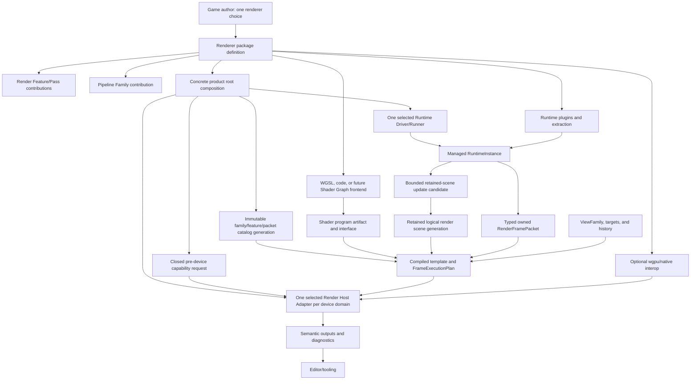

# Render Extension Capability Interface Design

**Status**: Design Draft - capability and validation harness, not a frozen Rust API

**Created**: 2026-07-15

**Last Updated**: 2026-07-16

**Owner**: `nara_render`, `nara_render_wgpu`, product composition, Editor render integration, and
external renderer packages

**Authority**: Non-normative Interface workbench. Accepted ADRs remain authoritative on conflict.

**Document Role**: Future render canonical harness; inactive and needs activation rebaseline.

**Normative Decisions**: [ADR 0032](adr/0032-render-backend-integration-boundary.md),
[ADR 0042](adr/0042-runtime-service-and-backend-boundary.md),
[ADR 0078](adr/0078-render-host-affinity-webgpu-initialization-and-device-recovery.md), and
[ADR 0094](adr/0094-minimal-render-execution-boundary-and-evidence-gated-extensions.md)

**Composition Designs**: [Runtime Composition Interface Design](runtime-composition-interface-design.md)
and [Source Extension Package Interface Design](source-extension-package-interface-design.md)

**Demand And Pressure Harness**:
[Render Capability Demand and Pressure Matrix](render-capability-pressure-matrix.md)

**Follow-Up Validation Plan**:
[Render Extension Parity Tracers Plan](../plans/2026-07-15-001-feat-render-extension-parity-tracers-plan.md)

The follow-up remains inactive until the reference-game plan releases its registration and an
activation rebaseline reconciles the tracer file map and authority decisions with the landed code.

Pipeline Family, Render Feature/pass catalogs, retained scenes, shader artifacts, interop, and
replacement Host roles in this document are candidate Interfaces. ADR 0094 explicitly does not
accept them before focused production-shaped tracers compare viable alternatives.

## Purpose

This document tests whether Nara can provide Bevy-level reachable extension freedom, Unity
SRP-level complete renderer policy, raw GPU/native integration, mature Editor viewport support, and
whole renderer/runner replacement without giving every ordinary runtime plugin hidden global
authority. The pressure matrix determines whether a workflow deserves each capability level; this
document does not treat every plausible renderer feature as roadmap scope.

The required outcome is simple:

> For each separately admitted capability, first-party defaults and external Rust packages use the
> same supported path. Ordinary game authors select one coherent renderer. Advanced authors gain
> only the progressively higher roles admitted by production evidence; reachability up to a complete
> Render Host remains a validation goal, not a current product promise.

This document records candidate capability, ownership, cardinality, selection, and conformance
hypotheses for later tracers. It freezes neither those hypotheses nor speculative trait names,
object-safe factories, a second render World, or one universal backend abstraction.

## The Short Answer

This harness evaluates a five-step renderer-control gradient, while expecting most users to see only
`Plugin` and one coherent renderer choice if such roles are admitted. Runtime Plugin, Platform
Adapter, and Runtime Driver/Runner remain orthogonal product roles rather than higher renderer
permissions:

| Role | Kind | Closest mature-engine concept | Cardinality | Authority gained |
|---|---|---|---:|---|
| Runtime Plugin | Orthogonal runtime role | Bevy `Plugin` | Many | ECS types, resources, systems, queues, schedules, and runtime-local domain state |
| Shader/Material Technique | Renderer gradient | Bevy typed materials; Unity Shader Graph/materials; Godot shaders/Visual Shader | Many | Shader program, parameters, resources, and Family-compatible material policy |
| Render Feature/Pass | Renderer gradient | Bevy render systems/schedule sets; Unity URP Renderer Feature or HDRP Custom Pass; Godot experimental `CompositorEffect` | Many | Typed scene/packet data, queue policy, declared graph work, and scoped encoding |
| Pipeline Family | Renderer gradient | Unity `RenderPipelineAsset` plus `RenderPipeline`; Bevy per-camera render schedule plus `RenderApp` systems/resources is a partial analogy, not a first-class Family contract | Many registered, one selected per recipe/view | Complete logical renderer policy: material, lighting, visibility, feature compatibility, and frame topology |
| Wgpu/Native Interop | Renderer gradient | Bevy post-device `RenderDevice`/`RenderQueue`; Unity native graphics plug-in | Many Host-scheduled sessions | Exact GPU/native APIs and persistent device-epoch resources inside the selected Host |
| Render Host Adapter | Renderer gradient | Bevy manual GPU-resource injection is only partial; Godot engine-internal `RendererCompositor` is an authority analogy, not a public replacement extension point | One per device domain | Device/Queue, target acquire, encode/submit/present, recovery, placement, and teardown |
| Platform Adapter | Orthogonal product role, deferred here | Bevy Winit integration; Godot `DisplayServer` | One per platform/display domain | Display/window integration and platform-affine target authority |
| Runtime Driver/Runner | Orthogonal product role | Bevy runner; Godot `MainLoop` | One per driver scope | Events, time, wake/redraw, control, and finite close without implicit display authority |

These roles are not runtime layers and do not execute through a per-frame registry. They are
composition-time definitions and lifecycle ownership choices. A typical game uses the default Host,
Platform Adapter, and driver. A complete custom renderer package uses a Pipeline Family, Features,
and perhaps interop; it does not need a custom event loop or display owner.

Shader/material definitions may be packaged independently, but they bind through renderer-domain
Family/Feature catalogs rather than becoming another exclusive root role. The current parity plan's
six root contribution roles are Runtime Plugin, Feature, Family, interop, Host, and Runtime
Driver/Runner. Platform Adapter remains a later display/window decision.

## Why Bevy Appears To Need Fewer Concepts

Bevy gives `Plugin::build` broad mutable access to `App`, exposes a separate `RenderApp`, and makes
`RenderDevice` and `RenderQueue` available as post-device renderer resources. Its stock renderer
already owns root/per-camera schedules, camera ordering, and command submission. Extensions outside
those conventions coordinate additional ordering and lifetime policy through ECS resources,
schedules, initialization/plugin order, and feature-specific contracts; pre-device requirements use
`RenderPlugin`/`WgpuSettings` or initialization-order-sensitive plugins.

Nara names the internal roles because it additionally requires:

- inspectable package and product plans before mutation;
- isolated Editor Edit/Play runtime reconstruction;
- headless/server exclusion of window and renderer dependencies;
- browser WebGPU JavaScript-agent affinity;
- exact target, Device, Queue, surface, and device-loss ownership;
- last-good publication and finite close evidence;
- one-click package installation without granting every role through one callback.

This extra internal precision is acceptable only when it stays behind a public complexity firewall.
If ordinary game code must understand device plans, epoch sessions, contribution binding, or Host
candidate publication, the Interface has failed.

## Goals

1. An external package can reach the same supported-domain outcome class as first-party code
   without editing Nara core or stock backend crates.
2. A complete external renderer can define a Pipeline Family rather than only decorate a stock
   renderer with post-process passes.
3. External packet data is typed, owned, bounded, backend-neutral, and open without a core enum edit.
4. Device requirements close before `request_device`.
5. Raw wgpu/native integration supports persistent epoch resources, compute/vendor SDK work,
   device loss, and finite retirement.
6. Integrations needing arbitrary target/submission ownership can replace the whole Render Host.
7. An external Runtime Driver/Runner can drive the managed runtime through an explicit root choice
   without thereby acquiring display/window authority; Platform Adapter replacement remains a
   separately gated capability.
8. An external family can participate in mature Editor viewports, picking, overlays, previews, and
   diagnostics without exposing GPU handles to tooling.
9. The ordinary user enables a coherent renderer through one package action and one Renderer
   Profile selection; persistent Pipeline Recipe details remain inspectable without becoming normal
   setup ceremony.

## Non-Goals

- Freeze `PipelineFamilyProvider`, `WgpuInteropSession`, `RenderHostFactory`, or runner trait names.
- Define a generic RHI. Wgpu remains Nara's only RHI.
- Promise stable compatibility across arbitrary wgpu versions or a native dynamic ABI.
- Make native in-process Rust sandboxed.
- Require every renderer to expose the same internal G-buffer.
- Require an object-ID texture as the only Editor picking strategy.
- Freeze winit docking, platform multi-window ownership, or Dear ImGui multi-viewport integration;
  those need their own concrete platform/editor tracer.
- Require a public second render ECS World or Bevy `SubApp` before capability tracers prove it is
  necessary.
- Implement a complete HDRP product merely to validate the boundary.

## Scenario Matrix

Scenario IDs are stable references for future APIs, conformance fixtures, and architecture review.

### Ordinary Authoring

| ID | Caller and goal | Required behavior | Primary oracle |
|---|---|---|---|
| RE-01 | Game uses the stock portable renderer | One default product entry renders without authoring graph nodes | Windowed reference-game smoke test |
| RE-02 | Game selects an external complete renderer | One package action plus one Renderer Profile choice; its Pipeline Recipe lowering requires no internal role registration | Clean-room author task |
| RE-03 | One project uses different recipes per view | Each view selects one compatible Pipeline Recipe, which resolves one Family without replacing the device Host | Multi-view semantic test |
| RE-04 | Dedicated server uses a package that also contains renderer roles | Selected renderer, wgpu, OS-window Adapter (`nara_winit`), interop, and Editor dependencies are absent; backend-neutral window vocabulary is audited separately | Cargo tree and runtime resource audit |

### Portable Feature And Packet Extension

| ID | Caller and goal | Required behavior | Primary oracle |
|---|---|---|---|
| RE-10 | Package adds post-processing | Feature declares resources/order/capabilities and composes without Device/Queue access | External post-process tracer |
| RE-11 | Package adds a new renderable domain | It contributes a bounded typed packet section without adding a central enum variant | Renamed-dependency packet tracer |
| RE-12 | Package adds Editor gizmo/overlay work | The same declared feature path composes with the selected family and Editor target | Editor overlay tracer |
| RE-13 | Scoped encoding needs custom commands | Callback receives only declared opaque bindings and a non-retainable encoding facade | Compile-fail and runtime scope tests |
| RE-14 | Package adds a retained renderable domain | Bounded create/update/remove plus resync updates publish one complete logical-scene generation without a central enum edit or silent loss under backpressure | Retained-scene fault tracer |

### Complete Pipeline Family

| ID | Caller and goal | Required behavior | Primary oracle |
|---|---|---|---|
| RE-20 | External package ships a stylized renderer | Family owns material/lighting/view assumptions and a different full logical topology while producing ADR 0092-compatible SDR output | Clean-room stylized family tracer |
| RE-21 | Recipe selects external family | Stable family identity resolves through the same catalog as first-party families | Plan/catalog snapshot |
| RE-22 | Family needs non-baseline semantic capabilities | Required/optional/fallback needs participate in pre-device admission | Capability matrix |
| RE-23 | Family and feature are incompatible | Pure validation rejects before Device, target, or runtime candidate creation | Negative composition test |
| RE-24 | Handwritten and generated shader frontends feed one Family | Both produce the same stable artifact/interface, dependency invalidation, material compatibility, and last-good behavior | Shader frontend fixture |

### Raw Wgpu And Native Interop

| ID | Caller and goal | Required behavior | Primary oracle |
|---|---|---|---|
| RE-30 | Package performs custom compute/indirect work | Interop session gets declared exact access in a Host slot and owns epoch resources | Compute tracer |
| RE-31 | Package integrates a vendor SDK or external image | Native/backend/version/target limits and fallback are explicit | Native-only matrix |
| RE-32 | Interop needs a wgpu feature or limit | Requirement appears before `request_device`; supported, requested, enabled, and fallback facts stay distinct | Device request-plan test |
| RE-33 | Direct Queue work is required | Host submits every predecessor first, interop submits at the declared barrier, and no successor is encoded/submitted until queue order is established; arbitrary ordering requires Host replacement | Submission-order instrumentation |
| RE-34 | Device is lost | Host rejects old registered/returned work and a compliant session retires its old resources before rebuild; no malicious-code containment claim | Injected loss/recovery test |
| RE-35 | Interop close stalls or fails | Host does not report clean close or publish a conflicting replacement | Finite-close fault test |
| RE-36 | Interop is paired with another Host candidate | Host-declared contract/backend/queue/resource-binding support matches, selects a declared fallback, or rejects before Device creation | Host/interop compatibility matrix |

### Whole Host And Runner Replacement

| ID | Caller and goal | Required behavior | Primary oracle |
|---|---|---|---|
| RE-40 | External package owns the complete GPU execution model | Exactly one selected Host owns Device/Queue/targets/submit/present/recovery; GPU-resource injection alone is insufficient | Replacement-Host conformance suite |
| RE-41 | External Host and stock Host are both available | Root selection is explicit and deterministic; no registration-order winner | Exclusive-slot permutation test |
| RE-42 | Host replacement is requested | Stop-then-start or an explicit non-conflicting transfer protocol; no two owners of one target/device domain | Replacement fault matrix |
| RE-43 | External Runtime Driver/Runner drives the product | It drives `RuntimeInstance` through public time/event/control/close contracts without display/window authority | Alternate-runner clean-room fixture |
| RE-44 | Raw App runner and managed runtime are mixed | Admission rejects; the two code-first/product paths are mutually exclusive | Negative admission test |

### Editor Compatibility

| ID | Caller and goal | Required behavior | Primary oracle |
|---|---|---|---|
| RE-50 | Editor displays an external family | Family exposes ADR 0092-compatible SDR final-color meaning and an overlay-composition point; real HDR waits for [OQ-021](open-questions.md#oq-021-hdr-wide-gamut-and-tone-mapping-contract) | Editor viewport tracer |
| RE-51 | Editor selects scene objects | Family declares one picking strategy: CPU query, GPU object ID, or custom provider | Picking conformance matrix |
| RE-52 | Tool requests depth, normals, motion, or debug view | Support/fallback/rejection is inspectable; tooling receives no GPU handle | Semantic-output snapshot and capture budget tests |
| RE-53 | Runtime and Editor render at once | Each consumer uses coherent immutable family/template/epoch generations and independent target transactions under the [OQ-022](open-questions.md#oq-022-editor-render-execution-ownership)-selected execution-ownership model | Edit/Play multi-view test |

## Ownership And Selection



The important ownership rules are:

- contribution catalogs are immutable composition results, not live plugin-hook registries;
- runtime plugins may install the already selected extraction and queue systems but cannot discover
  or bind a hidden family/feature after device admission;
- each recipe/view selects one family, while many features and interop sessions may compose;
- package-owned dependencies are hidden from ordinary operations but remain inspectable before
  activation; aggregation never becomes hidden `Plugin::build` installation;
- one Host owns one device domain and queue order;
- one Runtime Driver/Runner owns one driver scope without implicitly owning display/window state;
- package aggregation never changes those domain cardinalities;
- a no-render headless/server product selects no Render Host Adapter rather than installing a null
  GPU owner.

## Ordinary User Interface

The desired game-author shape is intentionally smaller than the internal model:

```rust
nara::desktop()
    .renderer(ink_renderer::renderer(InkProfile::Desktop))
    .add_plugins(MyGamePlugin)
    .run()
```

This is illustrative, not a compatibility commitment. Equivalent project settings or an Editor
renderer selector may lower into the same intent. The durable rules are:

1. one coherent renderer selection;
2. one ordinary gameplay Plugin/group path;
3. package-owned defaults and dependencies remain inspectable;
4. invalid family/feature/device/Host combinations reject before publication;
5. users do not manually register internal package roles.

A Renderer Profile is the ordinary package/product preset. It binds one Family plus package-owned
defaults, required Features, material policy, capability fallbacks, and Editor presentation without
asking the game author to assemble those roles. Selecting a Profile creates or selects a Pipeline
Recipe; the Recipe is the versioned project-owned data containing the effective parameters and
stable references. `nara.toml` stores the default Recipe selection, and per-view overrides refer to
Recipes rather than serializing a package's Rust preset enum.

Dependencies are hidden from ordinary operation but not from inspection. Before activation the
Editor or product root can expand the selected closure, permissions, platform limits, fallbacks,
material compatibility, and rebuild effects.

A renderer-package facade may conceptually aggregate its internal roles like this:

```rust
pub fn package() -> Result<PackageDefinition, PackageAuthorReport> {
    RendererPackage::define(PACKAGE)
        .renderer(ToonRenderer::definition())
        .finish()
}
```

Names and shape are provisional. `RendererPackage`/`RendererDefinition` are working labels for a
domain-specific complexity firewall, not a second package authority or frozen trait. The facade may
lower into separate Family, Feature, material, scene/frame input, and Editor contributions, but it
must hide contract keys, binding receipts, device-request fingerprints, epoch session construction,
and Host publication.

Exact wgpu/native interop and replacement Host definitions remain separate advanced roles even when
one source package aggregates them. Renderer selection may request those roles, but only a separate
code/product/Host grant can authorize them. Pure portable toon or stylized renderers require no such
grant.

## Pipeline Family Contract

A Pipeline Family contribution must be able to declare or derive:

- stable family identity and contract/version line;
- recipe parameter schema and default logical frame topology;
- material, lighting, visibility, view, and target assumptions;
- compatible/required/conflicting Feature policy;
- typed retained-scene and frame-packet sections plus queue/material techniques it consumes;
- compatible shader program interfaces, material models, and versioned semantic extension points;
- semantic device requirements plus optional/fallback variants;
- final-color, overlay, picking, and optional semantic-output support;
- deterministic logical compilation inputs and diagnostic identity;
- backend-realization contributions available to the stock Host;
- rebuild/reload classification and last-good policy.

The family does not own target acquisition, physical aliasing, Device/Queue, submission, or
presentation unless the package separately supplies the selected Render Host Adapter. A family is
the Unity `RenderPipeline` policy level, not a synonym for a GPU backend.

First-party and external families must enter the same catalog/selection/compiler path. Nara may
ship better defaults, support, migration, and documentation for first-party families, but it may
not give them private execution capabilities unavailable to an external family.

## Retained Scene And Typed Frame Data

Persistent render-domain state and frame-transient work use distinct typed channels. A
`RenderSceneUpdate` name is illustrative; the durable retained-scene contract is:

- create, update, remove, and complete-resynchronization candidates use stable logical identity and
  generation evidence;
- removals remain observable until acknowledged or superseded by a complete resynchronization;
- missing sequence, stale generation, budget rejection, or invalid input cannot partially mutate
  the active logical scene;
- backpressure is bounded and cannot silently discard a state-changing update;
- failed publication preserves the prior complete scene generation;
- logical scene state contains no Device, Queue, encoder, surface, native handle, or physical cache
  object;
- the exact store, arena, private ECS, render worker, and Rust carrier remain Implementation choices.

`RenderFramePacket` needs an open typed section mechanism so a new renderer domain does not require
editing a central enum. The durable contract is:

- the producer and consumer agree through a compiled typed render contribution;
- the section has stable declaration identity, version/generation, bounded count/bytes, and explicit
  retirement;
- payloads are owned, backend-neutral, and do not borrow the gameplay `World`;
- payloads contain no Device, Queue, encoder, surface, target lease, native object, or engine cache
  entry;
- missing required sections reject or skip through declared policy;
- rejection of frame-transient input atomically skips or faults the affected current frame/target,
  or selects a declared current-frame fallback; it never executes a prior frame packet as last-good;
- the frame hot path performs no public `Any`, downcast-by-string, or contract-ID registry lookup;
- an internal erased carrier is acceptable only when typed construction/consumption and bounded
  failure are proven at the boundary.

The first feature and family tracers should compare a typed heterogeneous arena, generated packet
layout, and family-specific packet struct before choosing the Rust representation.

## Shader And Material Frontend Contract

WGSL, future WESL, code-generated shaders, third-party compilers, and a future Shader Graph are
frontends for one shader-program artifact and interface contract. Shader Graph does not contribute
frame passes or own the Render Graph.

The stable artifact/interface semantics are:

- entry-point, parameter, and resource identities;
- interface and imported-dependency digests;
- compatible Family/material contract and variant inputs;
- semantic and exact backend capability requirements;
- bounded source-map and diagnostic provenance;
- cook/cache identity, generation, reload classification, and last-good publication.

Exact artifact storage, reflection implementation, visual graph IR, node schema, custom-node API,
derive helpers, and Rust traits remain deferred. A Material Technique binds one compatible artifact
to a Family, phase, and Feature set; it is not a pipeline recipe.

Family and Feature compatibility is explicit rather than implied by plugin order or a global pass
name. A Family exposes versioned semantic inputs, outputs, material models, and extension points. A
Feature declares needs, provides, conflicts, fallback, and view applicability. A Feature may be
portable or deliberately Family-specific. Nara does not promise arbitrary cross-Family material or
Feature compatibility.

## ViewFamily And History Contract

- View, ViewFamily, auxiliary View, target, and history slots use stable logical identity distinct
  from runtime `Entity` values and frame-local indices.
- A ViewFamily declares which related views publish atomically without imposing one stereo, shadow,
  reflection, or portal representation.
- Camera cuts, target extent/format/sample changes, Pipeline Recipe/Family changes, incompatible shader or
  material changes, origin rebasing, and device-epoch changes declare history invalidation.
- Cross-view inputs, outputs, and final consumers are logical graph resources; no auxiliary View may
  acquire or present the same external target independently.
- Semantic outputs declare purpose, color/format meaning, extent, layers/samples, availability,
  fallback, and capture budget without exposing GPU handles.

## Pre-Device Capability Admission

Wgpu features and limits must be selected before `request_device`. Nara therefore cannot discover
renderer requirements during `Plugin::build` after the stock Host already created a Device.

```text
selected Host policy + Family + Features + targets + interop declarations
    -> semantic required / optional / fallback requirements
    -> request Adapter
    -> exact Adapter support snapshot
    -> exact device-request plan
    -> request Device
    -> enabled semantic and exact capability snapshot
    -> logical compilation / backend realization / publication
```

Portable families/features declare semantic needs. The selected Host declares its own base
backend/feature/limit policy, and exact wgpu/native interop may additionally bind requirements to
Nara's supported wgpu version and portability class. The plan records at least:

- source contribution and stable requirement identity;
- required versus optional;
- named fallback or rejection policy;
- Adapter-supported value;
- exact requested value;
- actual enabled value;
- target/backend portability restrictions;
- plan fingerprint used by recovery and replacement.

Experimental exact-wgpu capabilities additionally require explicit code/product/Host opt-in. A
project recipe or package can request one but cannot grant it or silently enable every experimental
feature.

If a later package or family selection requires capabilities absent from the live Device, the
system rejects activation or constructs a fresh Host/device candidate. It never mutates a Device in
place, silently omits the work, or relies on plugin installation order.

## Scoped Encoding And Raw Interop

The two advanced pass paths must remain distinct:

| Path | Receives | May retain GPU resources? | May own target/submit/present? | Typical use |
|---|---|---:|---:|---|
| Scoped encoding pass | Non-retainable encoding facade and opaque declared bindings | No independent handles | No | Custom draw/compute commands within graph-owned resources |
| Wgpu/native interop session | Exact callback-scoped Device/controlled Queue/native access plus epoch identity | Yes, session-owned for one epoch | No independent ownership | Vendor SDK, external image, indirect/compute pipeline, specialized cache |
| Render Host Adapter | Complete wgpu/native execution authority | Yes | Yes | XR compositor ownership, unusual target model, custom submission/recovery |

An interop session declares logical resource reads/writes, its scheduling slot, and one queue mode.
In Host-submit mode it returns epoch/plan-stamped command work for the Host's global order. In
direct-submit mode the Host closes and submits all predecessors before entering the callback, then
waits until the interop submission has established Queue order before encoding/submitting any
successor. A separate native queue needs an explicit synchronization protocol or whole-Host
ownership. These barriers disable optimizations the compiler cannot prove. Trusted code is
contractually forbidden from retaining or using callback authority outside the slot; Nara does not
pretend native Rust is sandboxed. Raw `wgpu::Device` and `Queue` are
cloneable, so this rule is a trust/conformance obligation, not a type-system containment claim. The
Host can reject stale registered resources and returned work, but it cannot stop malicious native
code from cloning a handle and calling it later in the same process.

Every retained resource, callback, async completion, external image import, and encoded result is
bound to one non-reused Host/device epoch. Loss or replacement closes admission, rejects stale
work, retires session state, and rebuilds only from declared non-GPU sources.

## Render Host Adapter Contract

A complete external Host is necessary when an integration must own any of:

- Adapter/Device/Queue creation policy;
- target acquisition/import and final-consumer boundaries;
- frame-wide encoding and submission order;
- presentation or external compositor publication;
- physical resource/caching policy outside the selected Host's extension rules;
- device-loss recovery, target transfer, or executor placement incompatible with the stock Host.

If a replacement Render Host role is admitted, the selected Host must be the only authority for
those operations in one device domain. It must consume backend-neutral packets/plans or an
explicitly versioned equivalent contract, expose semantic status/diagnostics, preserve target
transaction rules, bind all native objects to an epoch, and provide finite shutdown evidence.

Every admitted Host candidate also declares the interop contract versions, backend modes, queue
modes, and resource-binding rules it supports. Composition matches the selected interop set before
device admission and applies declared fallback or rejects.

The architecture does not yet require one generic object-safe `RenderHost` trait. A concrete root
may bind a generic static implementation, an enum of compiled candidates, or another typed form.
The external replacement tracer may reject the public Host role entirely or select its smallest
sufficient shape. Only after that role is admitted must first-party and external candidates use the
same supported selection path; the first-party Host must not retain a private equivalent.

## Editor Semantic Output Contract

An Editor-compatible family must expose:

1. an ADR 0092-compatible SDR final-color target contract with color-space/transfer meaning; a
   future HDR contract remains gated by OQ-021;
2. an explicit composition point for Editor overlays and gizmos;
3. one declared picking strategy;
4. stable support/fallback facts for optional semantic/debug outputs;
5. bounded capture/readback requests and observations without GPU handles.

Picking may be a CPU scene/gizmo query, a GPU object-ID output, or a custom provider. Godot's mature
3D Editor demonstrates that GPU object ID is not the only workable strategy. Depth, normals,
roughness, motion, object ID, pass thumbnails, overdraw, wireframe, and custom debug views are named
capabilities rather than mandatory assumptions about every family's internal graph.

Tooling consumes stable descriptors and capture results. It never stores `Texture`, `TextureView`,
`Buffer`, fence, native handle, or a pointer into a live Host. A tool requiring an unsupported
output chooses an explicit fallback or rejects the operation; the renderer does not silently return
misleading data.

## Runtime Driver/Runner Contract

The external Runtime Driver/Runner guarantee is result-level now even though the exact trait shape
is deferred:

- root composition explicitly selects one driver candidate per scope;
- the candidate provides platform events, elapsed time, wake/redraw/background policy, exit/close
  progress, and declared platform-affine target authority;
- it drives managed `RuntimeInstance`, not raw `App::run_once` behind runtime control;
- it cannot be installed or replaced as a hidden `Plugin::build` side effect;
- first-party and external candidates use the same registration and conformance role;
- a package may bundle the runner with its runtime/render contributions behind one product choice.

Display/window ownership and runtime driving remain separate concrete roles, as Godot splits
`DisplayServer` and `MainLoop`. This document validates only the driver/runner side and does not
freeze a Platform Adapter or one oversized trait. The direct code-first `App::set_runner` plus
`App::run` path remains valid but is mutually exclusive with admission of that App into the managed
runtime path.

## Change And Failure Classification

| Change | Normal response | Last-good rule |
|---|---|---|
| Recipe parameter or compatible shader/data change | Build logical/backend candidate and atomically switch at frame boundary | Keep prior complete generation on same epoch if candidate fails |
| Feature/family code or catalog topology change | Rebuild executable/catalog and construct fresh candidate | Keep prior executable/runtime/Host generation until explicit replacement policy permits |
| New requirement already enabled on live Device | Build new logical/backend realization under the existing epoch when compatible | Keep prior complete pipeline generation on failure |
| New requirement absent from live Device | Reject or construct fresh Host/device candidate | Never pretend live Device widened; retain old Host until stop/transfer rules permit |
| Interop implementation/resource change | Build new epoch-bound session candidate at a Host safe point | Old session remains only while exact plan/epoch compatibility and retirement rules permit |
| Device loss | Invalidate all device-domain and interop state, then recover from admitted request plan | Old GPU objects are never last-good data |
| Render Host replacement | Stop-then-start or explicit proven target transfer | Never publish two owners for one device/target domain |
| Runtime Driver/Runner replacement | Usually new executable/outer Host generation | Runtime and parent authorities follow stop-first close rules; display/window authority does not move implicitly |
| Future Platform Adapter replacement | New platform/display owner generation | Requires its separately accepted display/window/target-transfer contract |

Atomic publication does not imply rollback of arbitrary native side effects. A failed candidate
remains owned until its registered retirement obligations reach an observable terminal result.

## Alternatives Considered

### Option A: Let `Plugin::build` Own Every Capability

**Strengths**: Closest to Bevy's local ergonomics; very little composition infrastructure.

**Failure**: Device requirements arrive too late, Editor/package inspection cannot close authority
before mutation, browser affinity and exclusive owners become implicit, and nested installation
reopens closed plans.

**Decision**: Rejected as the ownership model. Keep Bevy-like ECS freedom and one-line package UX.

### Option B: Support Only Feature/Pass Extensions

**Strengths**: Small API and strong graph ownership.

**Failure**: External authors cannot ship a complete SRP/HDRP-like renderer, deep GPU optimization,
vendor integration, XR compositor, or replacement Host. Feature parity would be mislabeled as
renderer parity.

**Decision**: Rejected.

### Option C: Expose Raw Wgpu To Every Render Provider

**Strengths**: Maximum immediate control and simple wrappers.

**Failure**: Portable providers become wgpu-version-bound, device requirements/order/lifetimes are
implicit, arbitrary queue submissions invalidate graph reasoning, and Editor/WebGPU behavior
diverges.

**Decision**: Rejected as the default. Keep explicit scoped, interop, and whole-Host levels.

### Option D: Copy Bevy `RenderApp` As One Public Bundle

**Strengths**: Mature extraction/scheduling model and familiar ECS extension surface.

**Failure**: A second World, SubApp lifecycle, public render schedule, and raw renderer resources are
independent decisions. Copying all of them does not itself provide data-driven recipes, logical
resource lifetimes, or Editor semantic outputs.

**Decision**: Deferred as separate mechanisms. Add a minimal public execution kernel only if the
clean-room capability matrix proves the typed packet/provider/compiler paths insufficient.

### Option E: Layered Capabilities With Explicit Exclusive Owners

**Strengths**: Small ordinary UX, complete advanced freedom, inspectable selection, pre-device
planning, correct epoch/target ownership, and first-party/external parity.

**Costs**: More internal composition roles, separate conformance suites, and careful terminology.

**Decision**: Recommended.

## Clean-Room Parity Gate

Nara must not claim Bevy-equivalent render extension freedom or justify omitting a public
`RenderApp` from a feature-only tracer. All rows below must pass independently:

| Gate | Required external package evidence | Forbidden dependency on private behavior |
|---|---|---|
| Portable Feature | Typed packet section, material/queue policy, post-process, gizmo/overlay, scoped encoding | No stock backend edit or private provider registry |
| Retained Domain | Bounded scene create/update/remove/resync plus frame-transient data and stale/gap/backpressure faults | No central enum edit, silent lost update, or physical GPU state in the logical scene |
| Shader Frontend | Handwritten and generated frontend artifacts share interface identity, dependency invalidation, material compatibility, diagnostics, and last-good | No frontend-specific stock pipeline path or hidden binding convention |
| Complete Family | Stylized topology/material/lighting policy, Renderer Profile authoring, persistent Pipeline Recipe selection, ADR 0092 SDR final color, overlay, and picking | No `nara_render` family match or first-party-only compiler input |
| Pre-device Interop | Non-baseline feature/limit, retained epoch resource, compute/native work, loss rebuild | No post-Device requirement discovery or private Device/Queue getter |
| Replacement Host | Sole Device/Queue/target/submit/present/recovery/close owner | No fork/edit of `nara_render_wgpu` or first-party ID allowlist |
| Alternate Runner | Managed runtime drive, events/time/wake/close, mutual exclusion with raw App runner | No hidden plugin-installed runner or stock-root package match |
| Editor Compatibility | Final color/overlay, one picking strategy, optional output support/capture | No GPU handles in tooling or first-party-only viewport path |

Every fixture uses a renamed Nara dependency and a source-diff gate over the owning core/stock
backend crates. Explicit Cargo dependency, package registration, root selection, exact version
binding, rebuild, and trust disclosure are allowed and audited; they are not core edits.

## Success Metrics

| Metric | Target | Measurement |
|---|---:|---|
| Ordinary author cost | One Renderer Profile selection and ordinary gameplay Plugin path | RE-01/RE-02 task study |
| First/external path equality | Stock and external candidates enter the same role, catalog, selection, and conformance path | Public API and source audit |
| Cardinality truth | Many Plugins/Features/Families/Interop candidates coexist; one family per recipe/view, one Host per device domain, one runner per scope | Permutation and exclusive-slot tests |
| Packet openness | New typed domain section requires zero central enum edits or public runtime downcasts | RE-11 fixture |
| Retained-scene integrity | Update gaps, stale generations, budget rejection, removal acknowledgement, and resync never partially mutate the active scene | RE-14 fault matrix |
| Shader frontend convergence | Code and generated frontends use one artifact/interface, dependency, compatibility, and last-good path | RE-24 fixture |
| Lowest sufficient authority | Toon outline uses Feature, terrain/streaming uses retained domain data, and portable stylized Family uses no interop or Host replacement | Pressure-matrix clean-room tasks |
| Device timing | Selected Host, Family, Feature, target, and interop Device requirements close before `request_device`; no live widening | RE-22/RE-32 fault matrix |
| Epoch safety | The Host rejects stale registered resources and returned results, and compliant interop sessions retire all old-epoch work; no sandbox claim is made for malicious code retaining cloneable raw handles | RE-34 conformance and fault tests |
| Queue order | Host-submit work joins global order; direct-submit mode enforces predecessor flush/submit, interop submit, then successor encode/submit; arbitrary order requires Host ownership | RE-33 instrumentation |
| Host/interop compatibility | Every selected interop contribution matches an explicit capability/version/queue-mode declaration from the selected Host or follows its declared fallback/rejection | RE-36 matrix |
| Editor fit | Every Editor-selected family exposes final color/overlay and one picking strategy | RE-50 through RE-53 |
| Headless isolation | Server closure contains no selected renderer, wgpu, OS-window Adapter, interop, or Editor dependencies | RE-04 audit |
| No ambient-authority regression | Plugin hooks cannot install providers, select runner/Host, or acquire Device/Queue | Negative static/runtime tests |
| No frame registry tax | Frame execution performs no package/contract string resolution | Profiling and static audit |

## Candidate Hypotheses To Preserve For Validation

1. First-party and external packages have equal reachable roles for every supported render level.
2. Feature/Pass and Pipeline Family are separate capabilities.
3. Family catalog selection occurs before Host/device activation.
4. Retained logical scene updates and frame packets are separate open, typed, bounded channels.
5. ViewFamily, target, history, shader-interface, material-compatibility, and semantic-output meaning
   remain backend-neutral and generation-aware.
6. Device requirements close before `request_device`.
7. Scoped encoding, wgpu/native interop, and Render Host ownership are separate permission levels.
8. Interop state and all GPU work are bound to one Host/device epoch.
9. Exactly one Render Host owns each device domain and exactly one runner owns each driver scope.
10. Editor-compatible families expose final color/overlay plus one picking strategy; optional
   semantic outputs are explicit capabilities.
11. Ordinary users select one Renderer Profile rather than assemble its internal roles; persistent
    project and per-view state uses Pipeline Recipe references.
12. Package definition, Renderer Profile selection, and trusted-native authorization remain distinct
    operations even when one source package provides all of them.
13. Direct raw-App runner and managed-runtime runner paths are mutually exclusive.
14. Wgpu remains the only RHI; exact native interop does not enter portable project data or preludes.

## Decisions To Defer

| Decision | Evidence trigger |
|---|---|
| Exact Pipeline Family trait/factory/catalog Rust shape | First external stylized Family tracer with materially different policy |
| Typed packet carrier representation | First external feature plus family consume different packet sections |
| Exact retained-scene update carrier/store/acknowledgement shape | First persistent domain plus Family consume the channel under gap/resync pressure |
| Exact ViewFamily/target/history Rust carriers | Temporal plus auxiliary/offscreen view tracer |
| Exact shader artifact storage, reflection, Material Technique, and frontend Interface | Reusable material plus independent code/generated frontend tracer |
| Exact scoped-encoding facade | First graph pass needing commands outside built-in submitters |
| Exact wgpu/native interop session and queue API | Compute/native tracer with retained resources and device-loss injection |
| Render Host selection carrier: generic, enum, or static factory | First external replacement Host |
| Exact Platform Adapter display/window contract | Later docking/multi-window/multi-viewport tracer; the Runtime Driver/Runner remains a separate role |
| Public render schedule/execution kernel | Family/interop tracers prove typed declarations cannot express required execution |
| Retained second render World or render worker | Profiling and ownership evidence |
| Multi-adapter/multi-device deployment | Concrete product requires concurrent device domains |
| Native external image/semaphore protocol | Concrete XR/video/vendor integration with exact backend evidence |
| Stable native dynamic ABI | Precompiled distribution/reload need justifies allocator/panic/thread/version contract |

Deferral preserves external reachability as a validation goal. Availability, cardinality,
selection, and lifecycle semantics remain unaccepted until the owning tracer and ADR admit them.

## Risks And Mitigations

| Risk | Severity | Likelihood | Mitigation |
|---|---|---:|---|
| Internal roles leak into ordinary game code | Critical | Medium | One renderer helper/selection, package-owned aggregation, gameplay-first prelude, clean-room task study |
| Feature tracer is used to claim full renderer parity | Critical | High | Separate mandatory clean-room gates and explicit claim policy |
| Pipeline Family becomes a renamed backend | High | Medium | Keep topology/material policy separate from Device/target/submission ownership |
| Pipeline families fragment shaders, materials, or Features | Critical | High | Version compatibility, explicit conversion/fallback/rejection, one coherent supported stock renderer, and no arbitrary cross-Family promise |
| Trait-per-role design leaks internal compiler machinery | High | Medium | Keep one renderer-package facade and deep compiler/Host Modules; let clean-room tracers choose exact traits |
| Retained scene loses updates or diverges from gameplay truth | Critical | Medium | Ordered generations, acknowledged removals, bounded backpressure, complete resync, atomic publication, and stale/gap fault tests |
| Shader frontends create hidden incompatible bindings | High | Medium | One artifact/interface contract with stable IDs, dependencies, capabilities, diagnostics, and last-good publication |
| Raw interop becomes a second queue authority | Critical | Medium | Declared resource access, Host-submit or predecessor-flushing direct-submit mode, epoch stamping, and whole-Host upgrade for arbitrary order |
| First-party implementation uses private hooks | Critical | Medium | Same public role/conformance path, renamed-dependency fixtures, source-diff gates |
| Semantic capability mirrors every wgpu bit | High | Medium | Add semantic requirements from real Family/Feature needs; retain exact facts only in wgpu layer |
| External Host abstraction freezes too early | High | Medium | Freeze outcomes now, exact Rust carrier only after replacement tracer |
| Editor assumes every renderer has one G-buffer layout | High | High | Required final color/overlay/picking only; optional named outputs with fallback |
| Native trust metadata is presented as sandboxing | Critical | Medium | Explicit trusted-native wording and separate isolated-process contracts |
| Device change causes hidden interruption | High | Medium | Typed replacement state, stop/transfer rules, last-good observation, no fake rollback |

## References

- [Render Capability Demand and Pressure Matrix](render-capability-pressure-matrix.md)
- [ADR 0077 historical decision](adr/0077-render-pipeline-recipes-graph-compilation-and-backend-encoding.md)
- [ADR 0094 current render boundary](adr/0094-minimal-render-execution-boundary-and-evidence-gated-extensions.md)
- [ADR 0092](adr/0092-sdr-color-space-alpha-and-output-encoding.md)
- [Bevy `Plugin`](../../repo-ref/bevy/crates/bevy_app/src/plugin.rs)
- [Bevy runner selection](../../repo-ref/bevy/crates/bevy_app/src/app.rs)
- [Bevy custom post-processing example](../../repo-ref/bevy/examples/shader_advanced/custom_post_processing.rs)
- [Bevy camera render schedule](../../repo-ref/bevy/crates/bevy_render/src/camera.rs)
- [Bevy raw `RenderDevice`](../../repo-ref/bevy/crates/bevy_render/src/renderer/render_device.rs)
- [Bevy `RenderQueue`](../../repo-ref/bevy/crates/bevy_render/src/renderer/mod.rs)
- [Bevy manual GPU-resource injection](../../repo-ref/bevy/crates/bevy_render/src/settings.rs)
- [Bevy DLSS pre-render initialization requirement](../../repo-ref/bevy/crates/bevy_anti_alias/src/dlss/mod.rs)
- [wgpu device descriptor requirements](../../repo-ref/wgpu/wgpu-types/src/device.rs)
- [wgpu cloneable Device API](../../repo-ref/wgpu/wgpu/src/api/device.rs)
- [wgpu cloneable Queue API](../../repo-ref/wgpu/wgpu/src/api/queue.rs)
- [Godot `CompositorEffect`](../../repo-ref/godot/doc/classes/CompositorEffect.xml)
- [Godot Visual Shader](../../repo-ref/godot/modules/visual_shader/visual_shader.cpp)
- [Godot `RendererCompositor`](../../repo-ref/godot/servers/rendering/renderer_compositor.h)
- [Godot custom `MainLoop`](../../repo-ref/godot/main/main.cpp)
- [Godot `DisplayServer`](../../repo-ref/godot/servers/display/display_server.h)
- [Godot 3D Editor viewport](../../repo-ref/godot/editor/scene/3d/node_3d_editor_viewport.cpp)
- [Unity `RenderPipelineAsset`](https://docs.unity3d.com/6000.0/Documentation/ScriptReference/Rendering.RenderPipelineAsset.html)
- [Unity `RenderPipeline`](https://docs.unity3d.com/6000.0/Documentation/ScriptReference/Rendering.RenderPipeline.html)
- [Unity URP customization and Renderer Features](https://docs.unity3d.com/6000.0/Documentation/Manual/urp/customizing-urp.html)
- [Unity native plug-in interface](https://docs.unity3d.com/6000.0/Documentation/Manual/native-plugin-interface.html)
- [wgpu experimental ray tracing](../../repo-ref/wgpu/docs/api-specs/ray_tracing.md)
