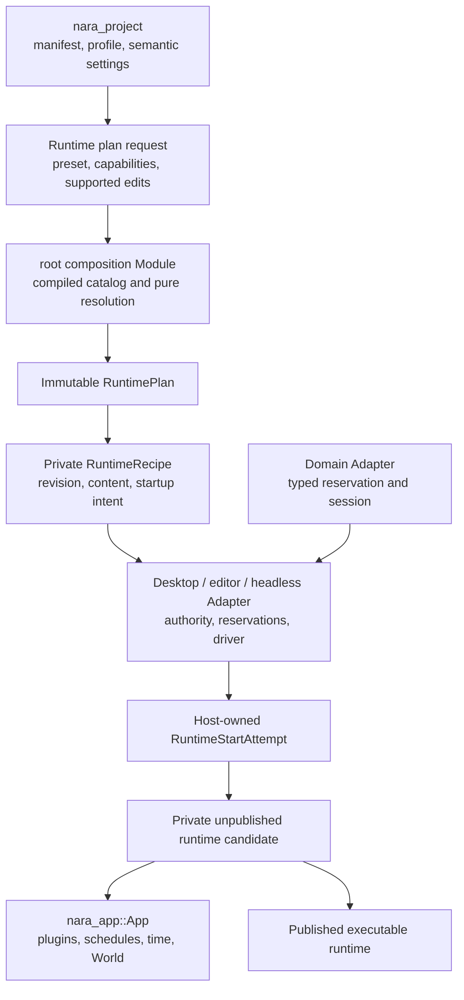
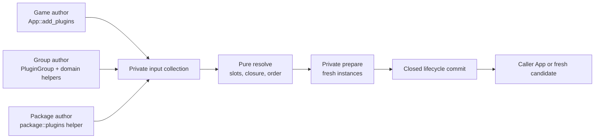

# Runtime Composition Interface Design

**Status**: Design Draft
**Created**: 2026-07-13
**Last Updated**: 2026-07-16
**Owner**: Root product composition, `nara_app`, executable hosts, and the reference game
**Authority**: Non-normative design harness. Accepted ADRs remain authoritative on conflict.
**Document Role**: Canonical runtime-composition harness; rebaseline after RGF closure.
**Related Decisions**: [ADR 0010](adr/0010-plugin-lifecycle-dependencies-and-failure.md),
[ADR 0046](adr/0046-plugin-metadata-and-default-plugin-groups.md),
[ADR 0079](adr/0079-root-product-capabilities-and-placeholder-domain-retirement.md),
[ADR 0082](adr/0082-process-host-authority-and-runtime-construction-topology.md), and
[ADR 0084](adr/0084-executable-runtime-ownership-and-isolation.md)
**Delivery Evidence**: [Reference-Game-Driven Foundation Plan](../plans/2026-07-12-001-refactor-reference-game-driven-foundation-plan.md)
**Upstream Package Design**: [Source Extension Package Interface Design](source-extension-package-interface-design.md)
**Cross-Domain Validation Harness**: [Multi-Role Extension Package Tracer Interface Design](multi-role-extension-package-tracer-design.md)
**Render Capability Harness**: [Render Extension Capability Interface Design](render-extension-capability-interface-design.md)

## Purpose

This document is a scenario-driven workbench for designing Nara's runtime composition Interface.
It translates architecture decisions into caller workflows, failure contracts, and observable test
oracles before public Rust types are frozen.

It is deliberately not another ADR:

- ADRs decide durable ownership and invariants.
- This document compares Interface shapes against concrete scenarios.
- The reference game and fault-injection tests provide admission evidence.
- Stable conclusions flow back into the relevant ADRs and implementation ledger.
- Illustrative type and method names in this document are not compatibility commitments.

Source package discovery, trust, editor/import/build contributions, and package lifecycle are
designed separately. A package runtime contribution becomes one input to this document's resolved
plugin plan; `Plugin` does not become the package abstraction.

Every proposed Interface change should identify the scenarios it serves. A public type that serves
no scenario in this document or an accepted extension should not be added speculatively.

## Caller Journeys

One person may wear several roles, but Nara must not charge every role the combined concept budget.
The normal journeys are deliberately different:

| Caller | Normal Interface | What stays behind the seam |
|---|---|---|
| Project user | `nara.toml`, a compiled product/profile choice, Editor Play, or a CLI/product Run action; source-package selection remains an OQ-031 target | `App` construction, capability closure, plans, recipes, candidates, drivers, and retirement |
| Game code author | Rust components, systems, assets/scenes, `Plugin`, and domain helpers | Package admission, Host authority, publication, and native lifecycle |
| Code-first bootstrap or embedding author | `App`, `add_plugins`, ordinary configuration, and one explicit concrete runner/product action | Product-project reconstruction and any unused Host scopes |
| Reusable package/provider author | One package definition and the narrow Interface for each contributed domain role | Root selection, unrelated contracts, candidate publication, and workspace authority |
| Platform, Editor, or server Host maintainer | Inspectable plans plus the advanced runtime drive/control/close Interface | Private resolver maps, commit carriers, ready-candidate publication, and domain internals |

The intended product journeys are therefore short even though the implementation is staged. Exact
names remain evidence-gated, but the target shape is:

```rust
// Illustrative target; not implemented.
// Code-first desktop embedding: App remains the authoring Interface.
let mut app = App::new();
app.add_plugins((Runtime2dPlugins, MyGamePlugin))?;
nara::desktop::run(app)?;
```

This illustration assumes that choosing the desktop action is itself an explicit, inspectable
selection of Nara's stock desktop product capabilities. The action may lower that selection into
window/render plugin composition before mutation; a runner must not secretly install Winit, wgpu,
or another hidden plugin closure. If RGF-U13 instead proves a runner-only action, the caller must
add the desktop product bundle explicitly. The authority invariant is fixed here; the exact helper
and bundle spelling remain tracer-gated.

A file-backed project user does not write a second builder. A CLI/Editor action receives an
already authorized project root, selected profile/target, startup intent, and the game package or
plugin definition. A generated executable binds the built/cooked project identity and target in its
public root glue, then invokes the same concrete product action. The exact Rust carrier waits for
U12/U24 evidence; the side-effecting action belongs to the root facade or concrete executable Host,
never to the side-effect-free `nara_project` Module.

Editor Play lowers a validated edit snapshot through that same product composition and publishes a
fresh isolated runtime generation. Its UI sees commands, status, diagnostics, and observations; it
does not own a live candidate or startup ledger.

These snippets state the required Depth, not final spelling. RGF-U24/U25 must prove the concrete
headless product action, RGF-U17 the Editor action, and RGF-U13 the desktop action before names or
module placement freeze.

## How To Use This Design Harness

For every candidate Interface:

1. Select the scenario IDs that the candidate claims to support.
2. Write the shortest honest caller sketch for each selected scenario.
3. List every fact the caller must know: types, configuration, ordering, errors, authority, and
   performance constraints.
4. List the behavior hidden inside the Module and apply the deletion test: if deleting the Module
   does not redistribute meaningful complexity, the Module is too shallow.
5. Identify illegal states that the Interface makes unrepresentable and those that still require a
   typed runtime rejection.
6. Test through the same seam as the caller. Do not preserve old tests that reach behind a deepened
   Interface only to observe implementation details.
7. Reject generality that has no second Adapter or named scenario.

Use this compact review record when adding another candidate:

```text
Candidate:
Scenarios served:
Caller must know:
Module hides:
Authority and lifetime:
Ordering and errors:
Performance contract:
Illegal states prevented:
Observable test oracle:
Depth / Locality / Seam verdict:
```

## Original Problem

Before RGF-U4, the composition path exposed several separate facts that could drift:

- RGF-U3 produced an immutable `ProjectSettingsCandidate` after manifest and compiled-ceiling
  validation, but did not resolve plugin slots, services, conflicts, or schema providers.
- root plugin groups maintained static plugin-ID arrays separately from imperative `build` methods.
- `PluginGroupBuilder` wrapped `&mut App`, so group expansion and committed installation were the
  same operation.
- production plugin `build` methods installed hidden prerequisite plugins after App mutation began.
- runner selection could be hidden inside runtime plugin installation.
- the reference game and examples repeated product setup knowledge through manual
  `App::new -> group -> game plugin` sequences.

This makes a successful example concise only after callers learn hidden ordering, feature, failure,
and ownership rules. The Module is shallow at the product seam even though `nara_app::App` itself is
a deep execution Module.

## Goals

1. Resolve product capabilities, plugin entries, group membership, service requirements,
   conflicts, supported slot configuration/disabling/ordering, and later admitted replacements
   without mutating an App or acquiring native authority.
2. Make one immutable resolved plan the source for inspection and committed installation.
3. Preserve Rust-native custom plugins without introducing a dynamic plugin ABI.
4. Construct product runtimes as fresh unpublished candidates and publish only complete success.
5. Keep direct code-first `App` construction available with honest ADR 0010 poison semantics.
6. Let desktop, editor, headless, server, tests, and future exporters reuse the same composition
   kernel without a public universal host or service locator.
7. Make the Interface testable through observable results rather than internal builder maps.

## Non-Goals

- A dynamic library ABI or package-level binary plugin protocol.
- A universal `EngineHost`, `ServiceHub`, dependency-injection container, or `get<T>()` registry.
- Arbitrary behavioral equivalence between plugins that share metadata.
- Rollback of arbitrary `Plugin::build`, native, thread, filesystem, or process-global effects.
- A generic renderer, platform, task-runtime, or service backend trait.
- Public exposure or module layout for outer product `RuntimePlan`/`RuntimeRecipe` topology before
  ADR 0082 has implementation evidence, or for `RuntimeStartAttempt`/`RuntimeCandidate`/
  `RuntimeInstance` lifecycle before ADR 0084 has its own evidence. The ADRs may be decided
  independently; this design uses canonical architecture names without requiring any of them to
  become public Rust types.
- Scene materialization, runtime control, or service shutdown details already owned by other seams.

## Working Decisions

These decisions are the baseline for evaluating Interface sketches in this document. They are not a
claim that Proposed ADRs already have implementation evidence.

1. Product composition does not start from an arbitrary caller-mutated App.
2. Pure admission failure creates no App, lease, thread, watcher, GPU object, or native session.
3. Product startup always commits a fresh App, seals it, and transfers it into a fresh unpublished
   runtime candidate before registry/scene/startup work.
4. A committed plugin hook failure poisons only the current product-construction owner and never
   becomes a rollback claim: the start attempt owns the partial App before candidate admission, and
   retains the candidate afterward.
5. A failed start attempt or candidate is not published and remains owned until admitted shutdown
   reaches an observable terminal result. The start attempt establishes its obligation ledger
   before the first fallible preparation, hook, or acquisition.
6. After all fallible startup and publication-preflight work succeeds, one atomic, infallible
   publish-and-promote move transfers the candidate directly into the Host's visible runtime slot;
   there is no promoted-but-unpublished owner or later publication failure point.
7. A direct code-first App remains supported but does not receive product-level atomic publication
   guarantees.
8. Plugin groups describe data before installation. They do not mutate App while declaring
   membership.
9. A committed resolved-plan installation cannot add plugins or groups that were absent from the
   resolved plan.
10. Stable slot identity is distinct from the installed plugin's `PluginId`.
11. U4 supports same-plugin configuration and optional-slot disable. Cross-plugin replacement and
    its public slot-contract version remain trigger backlog until a second concrete `PluginId` and
    public conformance suite exist.
12. Runtime recipes contain reconstructible immutable inputs and repeatable plugin factories, not
    plugin instances, Worlds, active tasks, native handles, or one-shot closures.
13. The process runner/driver is owned by a concrete host Adapter, not selected as a hidden side
    effect of plugin build.
14. `Plugin::declaration()` is the single authority for stable plugin identity and dependency
    metadata. A stable versioned definition ID identifies one admitted construction policy;
    instance configuration is explicit, immutable, and fingerprinted separately.
15. Every plugin lifecycle commit is closed. `Plugin::build` and `Plugin::finish` cannot install a
    plugin or group, including on the direct code-first path.
16. A `PluginId` identifies exactly one installed entry in a plan. A future proven multi-instance
    requirement must introduce explicit stable entry identity rather than weakening `PluginId`.
17. A caller-owned App may accept several top-level plugin batches only as immutable-prefix plus
    append. Later batches cannot reorder, replace, disable, or reconfigure committed entries.
18. `App::set_runner` is top-level code-first authority. Plugin hooks cannot select or replace the
    process driver. A raw-runner App uses direct `App::run`; a managed runtime admits only an App
    without a raw runner and is driven by the root-selected Platform/Runner Adapter.

## Module And Seam Placement



Ownership is intentionally split:

| Module | Owns | Must not own |
|---|---|---|
| `nara_project` | Parsing, profile overlay, validated semantic settings | Cargo ceiling, plugin instances, App mutation, filesystem access |
| root composition | Compiled product catalog, normalization, first-party groups/slots, pure closure | World, schedules, native handles, runtime driving |
| `nara_app` | Generic plugin plan mechanics, plugin lifecycle, schedules, time, World | Product presets, project files, platform authority |
| runtime recipe | Immutable revision, runtime plan, bounded content/startup inputs | Mutable runtime state, active service session, source authority, one-shot closure |
| executable host Adapter | Filesystem/platform authority, reservations, candidate drive and publication | Gameplay schedule, second World authority, composition policy |
| domain Adapter | Typed native reservation/session/close mechanics | Global service lookup, project persistence, product selection |

All composition dependencies before candidate startup are in-process data. They do not justify a
public mock port. Host and native authorities already have concrete typed Adapters; they are inputs
to candidate construction, not members of a generic composition context.

## Interface Vocabulary

The names below describe roles. Exact Rust names remain illustrative.

| Concept | Meaning |
|---|---|
| Runtime plan request | Runtime preset, additive requested product capabilities, settings, and supported plan edits |
| Compiled ceiling | Product capabilities compiled into the root binary; read from the root catalog, never asserted by project data |
| Plugin slot | Stable position in a named group; a versioned cross-plugin replacement contract exists only after a real conformance consumer admits it |
| Plugin ID | Identity of the concrete plugin installed into an App |
| Plugin declaration | Static type-owned identity, dependencies, capabilities, conflicts, and category |
| Plugin definition | Stable versioned definition identity plus one declaration, explicit immutable configuration, and one admitted repeatable typed factory |
| Plugin entry draft | Private pre-resolution occurrence of a definition at a stable slot/entry with ordering intent and provenance |
| Plugin plan | Immutable ordered plugin entries after pure group, dependency, conflict, and ordering validation succeeds |
| Runtime plan | Root-owned immutable result that adds product-capability and service closure for one runtime profile |
| Plugin commit batch | Private one-attempt carrier containing fresh instances and exact resolved entry/definition keys |
| Runtime recipe | Private replayable project/content revision, Runtime Plan, and startup intent |
| Runtime start attempt | Host-owned one-attempt owner for candidate admission, cancellation, and terminal retirement |
| Runtime candidate | Private unpublished prospective generation and every acquired shutdown obligation |
| Runtime instance | Successfully published executable owner around one App generation |
| Driver | Concrete desktop/editor/headless Adapter that supplies elapsed time, platform events, and control |

## Public Concept Budget

Internal startup rigor is not permission to expand every caller's Interface. The supported concept
budget is role-specific:

| Caller | Concepts it should learn | Concepts hidden behind its seam |
|---|---|---|
| Project user | Project settings, package selections, Run/Play actions, status, and diagnostics | `App`, plans, recipes, candidates, drivers, and Host authority |
| Game code author | Systems/sets, ECS and domain data, `Plugin`, passing plugin groups/tuples, and domain configuration helpers | Stable slots, definition IDs/keys, canonical factory/config machinery, entries, plans, recipes, candidates, Host authority |
| Code-first bootstrap author | `App`, `add_plugins`, ordinary configuration, and one explicit concrete runner/product action | Package/root planning and unused Host scopes |
| Small plugin author | Game-code author concepts plus one generated/static plugin declaration | Definition keys, canonical config encoding, factory erasure, commit batches |
| Reusable package author | One proposed `package()` function returning an opaque `PackageDefinition`, domain-owned helpers, and `PluginGroup` only when authoring a reusable runtime bundle | Contribution locators/claims, definition IDs/keys, entry drafts, plans, receipts, Host binding, start attempts, candidates |
| Concrete Host maintainer | Runtime Plan and Runtime Instance integration vocabulary; a Start Attempt only when its concrete Host exposes one | Private resolver maps, erased factory carriers, ready-candidate publication, and candidate internals |
| Editor/tooling UI | Commands, views, observations, runtime generation/status, Apply Changes | Live Runtime Instance/Start Attempt ownership, process/native authority |

Project, game-code, plugin, and package examples must not require authors to construct a
`PluginDefinitionId`, config fingerprint, slot constant, entry draft, plan, recipe, candidate, or
receipt. Advanced embedding and Host documentation may expose only the subset its caller actually
owns. A concept can remain necessary inside the implementation without becoming public authoring
vocabulary.

## Interface Designs Compared

The same requirements produce several superficially plausible Interfaces:

| Design | Depth and Leverage | Locality and authority | Verdict |
|---|---|---|---|
| Make `App` the complete product control plane | Excellent Bevy-like code-first ergonomics, but every Editor/project caller must reproduce loading, reconstruction, publication, and close | Project, process, native, and runtime ownership collapse into mutable `App`; plugin order can become authority | Reject product-wide; retain only the direct code-first path |
| Add a universal `Game`/`ProjectBuilder` and `EngineHost` trait | One apparent entry, but the builder mirrors `App` while accumulating manifest, build, Editor, renderer, server, and lifecycle methods | A shallow facade and giant context spread changes across every product and Adapter | Reject; a validated `Project` may be an immutable view, never the universal run builder |
| Keep `App`, add concrete product actions, expose only advanced runtime driving | Ordinary Rust authoring stays small; each Run/Play/Serve action hides the complete product transaction | Product roots retain authority; `RuntimeInstance` is the shared advanced drive Interface without a universal Host trait | Recommend |
| Hide the product path exclusively inside first-party CLI/Editor code | Very small ordinary Interface | Third-party products and studios cannot reproduce the complete production path through public Rust | Reject; generated/root glue must itself use public Interfaces |

This is a layered Interface, not two competing engines. Direct `App` construction and integrated
product startup share plugin resolution and App lifecycle semantics, while only the product path
promises reconstructible inputs, atomic publication, and retained failure ownership.

## Contract Scenarios

Scenario IDs are stable references for design reviews, implementation tests, ADR evidence, and
future Interface proposals.

### Successful Product Flows

| ID | Caller And Goal | Required Interface Behavior | Primary Oracle |
|---|---|---|---|
| RC-01 | Embedded library creates a minimal code-first App | Direct `App::new` and explicit plugins remain available without project or host objects | Independent compile and one fixed-tick smoke test |
| RC-02 | Headless reference game boots from validated project data | Preset plus capabilities resolve once; caller does not manually reproduce first-party order | Public reference-game boot test |
| RC-03 | Dedicated server boots the same game | Server policy excludes window, renderer, editor, audio device, and raw input regardless of compiled ceiling | Installed-plan snapshot and runtime resource audit |
| RC-04 | Desktop 2D game boots through winit and wgpu | Desktop Adapter accepts only a plan that explicitly requested its capabilities; it never widens the request | Desktop plan test and platform smoke |
| RC-05 | Runtime-UI-only product boots without sprite/tilemap | `runtime-ui` does not imply `runtime-2d`; submitter closure remains valid | Cargo tree, plan snapshot, and smoke test |
| RC-06 | Two runtime generations start from one recipe | Immutable revision/plan may be shared; World, queues, clocks, task/service/backend epochs are fresh | Generation-isolation integration test |

### Supported Customization

| ID | Caller And Goal | Required Interface Behavior | Primary Oracle |
|---|---|---|---|
| RC-10 | Game configures title and dimensions | Configure the existing first-party window slot with the same `WindowPlugin` ID and explicit settings | Window settings plan/smoke test |
| RC-11 | 2D game does not use tilemaps | Disable the optional tilemap slot before resolution; no tilemap plugin or dependency remains | Resolved and installed snapshots agree |
| RC-12 | Game installs its Rust gameplay plugin | Insert a repeatable factory relative to the supported gameplay slot without editing Nara source | Independent reference-game composition test |
| RC-13 | Tooling explains the selected product | Inspect normalized capabilities, groups, slots, actual plugin IDs, requirements, and order from one plan | Golden plan snapshot |
| RC-14 | Test injects a configured failure plugin | Add a test entry through the same staged plan Interface, without a production-only DI seam | Fault-injection integration test |
| RC-15 | Embedded App adds another top-level plugin batch | Existing committed order is an immutable prefix; the new batch appends or rejects any backward order/edit before mutation | Direct App order/installed-snapshot test |
| RC-16 | Later product substitutes a different plugin in a named slot | Only root/domain-admitted slot-contract version and conformance evidence authorize a different `PluginId` | Trigger-specific public replacement conformance suite |

### Pre-Mutation Admission Failure

| ID | Failure | Required Result | Retry Oracle |
|---|---|---|---|
| RC-20 | Project requests a capability outside the compiled ceiling | Typed composition rejection before App or native authority exists | Corrected request resolves in the same process |
| RC-21 | A later admitted replacement requires a compiled but unrequested product capability | Typed rejection identifies required and requested capability sets | Adding the capability resolves successfully |
| RC-22 | Missing plugin/service requirement, conflict, or dependency cycle | Typed stable-ID error with bounded cycle chain; no partial plan publication | Corrected graph resolves successfully |
| RC-23 | Duplicate, missing, disabled-required, or later wrong-contract-version slot | Typed slot error before plugin factory commit | Corrected edit resolves successfully |
| RC-24 | One definition ID/version is bound to divergent declarations, config schemas, or typed factory bindings | Admission rejects before factory invocation, reservation, or App creation | Corrected canonical binding resolves successfully |
| RC-25 | Desktop/headless driver does not satisfy the plan | Typed driver mismatch; driver may not add capabilities or plugins | Matching Adapter accepts the same plan |
| RC-26 | Typed plugin factory returns a preparation error or unwinds | No reservation, App, or runtime publication; unwind containment makes no same-process retry claim | Corrected typed failure can prepare a fresh attempt |

### Candidate Construction Failure

| ID | Failure Point | Required Result | Retirement Oracle |
|---|---|---|---|
| RC-30 | Plugin preflight, build, or finish fails or unwinds | No runtime publication; first lifecycle/attempt failure is preserved | Every committed shutdown owner attempted once in reverse order |
| RC-31 | Registry freeze, service activation, scene preflight/materialization, or startup fails | No Running runtime; old published runtime remains unchanged | Candidate retires all admitted dependencies |
| RC-32 | Start-attempt retirement is pending or times out | Failure retains an observable owner; parent authority cannot disappear or publish a conflicting replacement | Host can poll terminal retirement state and diagnostics |
| RC-33 | Plugin attempts nested installation during any build/finish commit | App is poisoned by a sticky contract violation; a product candidate is never published | No hidden plugin appears in installed snapshot |
| RC-34 | First attempt fails and a second attempt succeeds | Retry constructs a fresh candidate and generation, never reuses the poisoned App | Attempt IDs and mutable authority epochs differ |

### Driver And Workspace Flows

| ID | Caller And Goal | Required Interface Behavior | Primary Oracle |
|---|---|---|---|
| RC-40 | Headless test manually advances time | Concrete Adapter starts the recipe and exposes the runtime drive contract without a universal host trait | Semantic snapshot after exact ticks |
| RC-41 | Editor starts, stops, and restarts Play | Concrete Editor Host retains the recipe outside World; restart waits for Stop then constructs a fresh candidate | Edit-to-Play restart integration test |
| RC-42 | Winit owns the process event loop | Winit Adapter drives runtime; runtime plugin installation does not silently select a runner | Static boundary test and window smoke |
| RC-43 | Game requests an in-runtime retry | Gameplay resets game-owned run state at a fixed safe point; it does not reconstruct the engine runtime | Same runtime generation, new game-run generation |

## Proposed Interface Shape

### Recommended Entry Layering

Do not add a mutable `Game` or universal `Project` builder that forwards most `App` methods. Deleting
such a wrapper would remove little complexity, so it would be a shallow Module. Keep `App` as the
gameplay/code-first authoring Interface and let concrete desktop, project, server, and Editor
actions consume authoring inputs through the common private composition implementation.

The product actions must hide this current Host-maintainer sequence:

```text
authorize and ingest project
    -> resolve product, plugin, service, and schema closure
    -> bind immutable content and startup intent
    -> prepare fresh plugin owners and domain reservations
    -> create, commit, and seal a fresh App
    -> start an unpublished candidate
    -> publish one runtime generation
    -> drive and close it through the selected concrete Adapter
```

`RuntimeInstance` is the likely advanced shared Interface for concrete drivers. The current
`RuntimeCandidate` may remain module-specific advanced support for code-first embedding, but it is
not a gameplay-prelude or project-authoring concept. `ReadyRuntimeCandidate` and `promote()` are U5
trial mechanics, not the managed product publication Interface: a concrete Host must keep ready
ownership inside its start attempt and perform the sole compare-and-consume publication move.

No public `EngineHost`, `ProductRoot`, `RuntimeFactory`, or `RuntimeDriver` trait is justified yet.
Winit and a headless loop show that `RuntimeInstance` can be driven in different ways; they do not
prove a common platform/event-loop trait. Each concrete product action remains an Adapter over the
same implementation until a second production-quality substitutable caller proves a smaller seam.

### 1. Pure Plugin and Runtime Resolution

`nara_app` owns pure plugin mechanics and produces a `PluginPlan`. A concrete root adds compiled
product capabilities, profile policy, and service closure to produce a `RuntimePlan`. The latter is
an advanced Host-integration seam hidden behind ordinary project, CLI, and Editor actions; it does
not enter the gameplay prelude or package-author workflow. The compiled ceiling is an
implementation input owned by the root catalog, not a value supplied by untrusted project data.

```rust
fn resolve_runtime(
    request: RuntimePlanRequest,
) -> Result<RuntimePlan, RuntimePlanError>;

pub enum RuntimePlanError {
    Composition(CompositionError),
    Plugins(PluginPlanError),
}
```

The advanced sum error preserves whether product-capability admission or plugin-plan closure failed;
it does not flatten both into `PluginError`.

`RuntimePlanRequest` conceptually contains:

- one execution-policy preset: minimal, local headless, or server;
- additive product capabilities;
- validated semantic settings;
- supported same-plugin configuration/disable/relative-order edits and later admitted replacement;
- repeatable custom plugin definitions/entry intent supplied through typed helpers.

Desktop and editor are not mutually exclusive runtime presets. They are capability and Adapter
selections layered over an execution policy.

`RuntimePlan` must be immutable, deterministic, and inspectable. It contains one `PluginPlan` but
no App,
World, active task, native handle, open event loop, or service session. At minimum its snapshot
exposes:

- compiled, requested, normalized, and required product capability sets;
- ordered plugin entries with occurrence identity, slot ID, later replacement-contract version when
  applicable, actual Plugin ID, definition ID/version, group provenance, and declaration;
- configuration identity through a versioned digest subject to disclosure policy; raw canonical
  configuration remains private;
- plugin and service requirements/conflicts;
- disabled optional slots;
- a deterministic plan fingerprint.

The product invariant is:

```text
required product capabilities of the resolved plan
    <= normalized project request
    <= compiled product ceiling
```

Plugin/service closure is validated separately from this product subset.

### 2. Data-Only Plugin Groups

Nara should preserve Bevy's small group-authoring shape while changing what the builder owns:

```rust
pub trait PluginGroup: Sized + Send + Sync + 'static {
    const ID: PluginGroupId;

    fn build(self) -> PluginGroupBuilder;

    fn edit(self) -> EditedPluginGroup<Self> {
        EditedPluginGroup::new(self)
    }
}

pub struct PluginGroupBuilder {
    // Private stable slots, entries, nested groups, and order intent.
}

impl PluginGroupBuilder {
    pub fn new() -> Self;

    pub fn add(self, definition: PluginDefinition) -> Self;

    pub fn add_slot(
        self,
        slot: PluginSlot,
        definition: PluginDefinition,
    ) -> Self;

    pub fn add_group(self, group: impl PluginGroup) -> Self;
}
```

`PluginGroupBuilder` is group/package infrastructure. A `PluginDefinition` is an opaque value that
ordinary game code may pass only after obtaining it from a domain helper; callers do not construct
its identity, canonical configuration, or factory machinery. The edited-group facade locates the
unique same-plugin slot by `Plugin::declaration().id`:

```rust
app.add_plugins(
    Runtime2dPlugins
        .edit()
        .disable::<TilemapPlugin>()
        .configure(nara_image::plugin(image_settings))
        .insert_after::<nara_sprite::SpritePlugin>(my_game::plugin(settings)),
)?;
```

Stable slot-directed operations such as `disable_slot` and `insert_after_slot` remain advanced
Interfaces for persistent project edits, tooling, and future admitted cross-plugin replacement.
Because U4 permits only one occurrence of a `PluginId`, the common type-directed facade is
unambiguous and must not force authors to copy stable slot constants into game code.

`build` deliberately has no `App` parameter and no `finish(&mut App)` operation. Builder methods
record intent; expected duplicate, slot, dependency, conflict, and ordering errors are returned by
the resolver rather than panicking during chaining. `add_group` stores an inactive nested group for
resolver-controlled expansion, so a stable group stack can detect `A -> B -> A` before Rust
recursion or App mutation.

The builder contains no root group identity. The sealed collector wraps the returned contents with
the invoked `G::ID`, so `Foo::build` cannot accidentally or deliberately claim `Bar::ID`. The same
identity-free contents function can therefore lower through a direct group or a package runtime
contribution without becoming a second group-ID authority.

A bare builder does not implement the ordinary `Plugins` input trait, because installing
`MyGroup.build()` would silently discard `MyGroup::ID` provenance. Direct callers pass the group or
its lazy edited wrapper. The package helper has a separate explicit Adapter for canonical
identity-free contents and supplies package contribution provenance.

Calling `build` directly remains possible for group authors, but ordinary callers use `edit` so
group expansion and unwind containment happen inside `add_plugins`. Under `panic = "unwind"`, the
resolver maps an invoked group panic to a stable `PluginPlanError` without retaining the panic
payload. Abort builds make no in-process recovery promise.

These invariants may not change:

- group expansion performs no App mutation or native acquisition;
- one ordered entry collection is the source for both membership inspection and installation;
- group membership is derived after edits, not copied from a parallel static ID array;
- configure, disable, and relative ordering address stable slot IDs, not vector indexes;
- nested groups preserve provenance while flattening to one deterministic install order;
- unsupported replacement is rejected rather than inferred from matching metadata.

A U4 slot records stable ID, required/optional presence, and the expected plugin type/ID. Ordinary
`configure` changes that same plugin's definition/configuration. Replacing it with a different
plugin ID additionally requires a public slot-contract version, root/domain-owned conformance
evidence, and a public conformance suite. That surface remains trigger backlog until a second
concrete plugin implementation exists. A third party cannot self-certify replacement by repeating
a capability string.

Group inclusion is not ownership of an installed instance. Edits apply to stable entry
occurrences before any merge. Exact duplicates merge only when they name the same slot ID (and later
contract version when one exists) or are un-slotted entries with the same unique `PluginId`,
and in either case carry the same complete admitted definition key. One resolved entry may then
retain provenance from several groups. The same `PluginId` appearing at two different slots is an
error rather than an ambiguous merge, so disabling one slot has one meaning.

The resolver owns one deterministic sequence:

```text
expand inactive groups and retain provenance
    -> apply supported slot/entry edits
    -> validate slot identity/presence and any admitted replacement conformance
    -> merge identical occurrence identity + admitted definition key
    -> validate plugin/service requirements and conflicts
    -> build dependency and explicit-order edges
    -> stable topological sort
    -> freeze snapshot, private definitions, and plan fingerprint
```

Declaration order is a stable preference, not an implicit dependency. Declared plugin prerequisites
and explicit before/after relations are hard edges; stable entry identity is the final tie-break.
Capability requirements validate the already selected closure and never choose an arbitrary
provider. The resolver computes a `PluginGroupDefinitionFingerprint` from canonical expanded
occurrence identities, admitted definition keys, order intent, and nested group fingerprints while
excluding outer edits and accumulated provenance. Duplicate group IDs are idempotent only when this
intrinsic fingerprint matches; divergent definitions fail rather than selecting first or last.

### 3. One Declaration Authority And Repeatable Definitions

Stable declaration facts belong to the plugin type rather than to a constructed instance or an
entry copy:

```rust
pub trait Plugin: Send + Sync + 'static {
    fn declaration() -> &'static PluginDeclaration
    where
        Self: Sized;

    fn preflight(
        &self,
        _context: &PluginPreflightContext<'_>,
    ) -> Result<(), PluginError> {
        Ok(())
    }

    fn build(&self, app: &mut App) -> Result<(), PluginError>;

    fn finish(&self, _app: &mut App) -> Result<(), PluginError> {
        Ok(())
    }

    fn shutdown(
        &self,
        _context: &mut PluginShutdownContext<'_>,
    ) -> Result<(), PluginError> {
        Ok(())
    }
}
```

Ordinary plugin authors should declare these facts through one concise macro/derive/helper instead
of constructing a large `PluginDeclaration` by hand. The generated output remains the same static
authority; convenience must not reintroduce instance-owned metadata or inferred persistent IDs.
Exact helper spelling waits for compile-fixture evidence.

The `Self: Sized` declaration method preserves object safety. Private erased carriers retain the
canonical declaration reference before turning a fresh `P` into `dyn Plugin`; the trait object does
not grow a second metadata source. Dependency-relevant facts cannot vary with instance settings.
If a setting changes closure, the group must select a different plugin type/static declaration or
an additional explicit companion entry/group. A second definition ID for the same `P` cannot change
requirements or conflicts hidden behind `metadata(&self)`.

`PluginPreflightContext` is a narrow immutable view of the installed-plan prefix and the specific
structural resources whose owners explicitly implement `PluginPreflightResource`. It exposes no
`World`, arbitrary resource access, runner mutation, or native authority. A typed `Err` is retryable before the
attempt's first commit only under this no-side-effect contract. A preflight unwind always poisons a
caller-owned App or marks the current product-construction owner failed/unpublishable. Before App
seal and candidate admission that owner is the start attempt; afterward it retains the candidate.
The owner remains retained through terminal shutdown. Catch-unwind provides diagnostics/shutdown
opportunity, not proof that trusted code left process state intact.

A runtime recipe cannot retain a one-shot plugin instance. Group and package paths use an opaque
repeatable definition created through typed helpers:

```rust
pub struct PluginDefinition {
    // Private stable DefinitionId/version, declaration reference, canonical config,
    // config fingerprint, and one admitted typed repeatable factory binding.
}

core::plugin()

window::plugin(window_settings)
```

RGF-U4 implements opaque canonical bytes plus typed domain helpers. A universal config trait or
derive remains deferred; the contract is fixed:

- one stable versioned `PluginDefinitionId` identifies one canonical construction policy; a domain
  helper hides this advanced identity from normal game/package callers; `for_default` derives its
  policy identity from the resolved stable `PluginId`, while non-default factories supply an
  explicit domain-owned ID/version;
- canonical configuration and the repeatable factory binding are `Send + Sync + 'static`, so an
  immutable definition/recipe can be shared across Host attempts;
- configuration is explicit immutable data with a deterministic canonical fingerprint, never only
  a captured closure;
- typed construction returns `Result<P, PluginPrepareFailure>` for one concrete `P: Plugin`, so the
  static declaration cannot be swapped after erasure; infallible domain helpers adapt `P` to
  `Ok(P)`;
- construction is repeatable (`Fn` semantics), not one-shot (`FnOnce` semantics);
- each invocation creates a fresh plugin instance for one candidate;
- it receives no App, World, host authority, or generic context;
- it does not start threads, open files, create native sessions, or mutate process-global state;
- preparation preserves the resolved definition key on the fresh private commit batch before App
  mutation;
- violation by trusted Rust code is a plugin contract breach, not something Nara claims to sandbox.

The domain definition helper maps its typed construction error into a stable, classified
`PluginPrepareError`; arbitrary `Display` text is not plan identity or a diagnostic summary.

The definition key contains definition ID/version plus the canonical config fingerprint. It proves
which admitted construction policy and immutable input were selected and transferred; it cannot
prove that arbitrary trusted factory code actually uses every field. Domain conformance tests cover
that behavioral obligation. Typed factory erasure makes changing the concrete plugin type
unrepresentable on the public path.

The resolver retains a private canonical config representation (or typed equality witness) and
uses it after any digest match; a hash collision never merges distinct configurations. Public plan
snapshots expose only a versioned digest when disclosure policy permits. The digest algorithm and
canonical encoding version are part of the definition-key format rather than ambient defaults.

The private erased factory implementation is not a public `PluginFactory` extension trait and does
not use `Any`, string downcasts, or a service locator. First-party domain helpers and a package's
canonical definitions module hide it from normal game and package authors.

A private `PluginEntryDraft` is then an occurrence, not another declaration authority. It
associates a definition with a stable slot or entry, order intent, and provenance. Duplicate drafts
merge only when occurrence identity and the complete admitted definition key both match. Reusing a
definition ID with a divergent declaration, config schema/version, or factory binding is an
admission error, not behavioral equivalence. There is no first-wins, last-wins, or public
`add_plugin_if_missing` rule.

Schema-provider callbacks follow the same rule separately: a stable versioned
`ComponentSchemaProviderBindingId` names the native registration policy, while the function pointer
is invocation-only and never semantic identity. Provider unwind is caught at composition and
reported as `SchemaProviderPanicked` without publishing the scratch registry.

All plugin IDs are unique in U4. The unused `non_unique` metadata option is removed.
If a real multi-instance plugin lifecycle appears, it must introduce a stable `PluginEntryId` and
define ordering, shutdown, inspection, and configuration identity explicitly.

### 4. One-Line App Ergonomics, One Resolver

Nara should adopt Bevy's sealed marker technique for single plugins, groups, edited groups, and
tuples:

```rust
pub trait Plugins<Marker>: sealed::Plugins<Marker> {}

impl App {
    pub fn add_plugins<M>(
        &mut self,
        plugins: impl Plugins<M>,
    ) -> Result<&mut Self, AddPluginsError>;
}
```

The ordinary call remains one line:

```rust
app.add_plugins((MinimalPlugins, MyGamePlugin::new(settings)))?;
```

A raw `P: Plugin` is a one-attempt inactive instance for that caller-owned App. It does not require
`Clone`, does not enter a replayable recipe, and cannot be exported as a package definition.
Groups and packages contain only repeatable definitions. Both inputs reuse the same collection,
closure, ordering, and commit implementation; the type system prevents the one-shot input from
being presented as a replayable `PluginPlan`.

The direct instance contributes its static declaration but makes no durable configuration
fingerprint promise. A direct input that collides with an existing/planned `PluginId` is therefore
an explicit duplicate error rather than an implicit equality merge. Tooling may inspect that an
opaque one-shot entry was selected, but it cannot claim the entry is reconstructible.

`add_plugins` is the primary public composition entry on a caller-owned `App`. The singular
`add_plugin` remains only as a thin alias with identical semantics; `add_plugin_if_missing` is not
retained as a public composition mechanism. Tuple collection happens before resolution rather than
installing each element immediately.

Bevy also accepts `Fn(&mut App)` as a plugin. Nara must preserve the lightweight setup use case
without pretending that an anonymous function has stable declaration or replayable identity. The
preferred direct-only shape is a top-level configuration Adapter:

```rust
app.configure(|app| {
    app.add_systems(CoreStage::Update, gameplay)?;
    Ok(())
})?;
```

This closure is one-shot, cannot enter a plugin tuple/group/package/plan/recipe, and follows the
same mutation guard and poison semantics as other direct App configuration. If reference-game
evidence shows that `add_systems` plus ordinary methods already cover the use case, the helper may
remain unnecessary; what is not acceptable is forcing local setup to invent definition IDs,
fingerprints, or factories.

Every top-level commit is closed. Calls to `add_plugin`, `add_plugins`, or group installation from a
plugin's `build` or `finish` are sticky contract violations and poison the current App even if the
plugin ignores the returned error. Dependencies must appear in declarations and selected groups;
the resolver validates the selected closure but never chooses a hidden provider.

The active-hook guard runs before lifecycle, duplicate/already-installed, declaration, group
expansion, or no-op logic. A plugin therefore cannot avoid sticky poison by attempting to add an
existing ID, using a skip helper, passing a bad group, or installing during `finish`. The same guard
rejects `App::set_runner`; only a top-level code-first caller or concrete Host/driver Adapter owns
runner selection.

Several top-level calls on one caller-owned App use immutable-prefix semantics. The resolver treats
actual committed entries/order as hard input, validates only an appendable suffix, and rejects any
later disable, replacement, reconfiguration, or ordering edge that would move an installed entry.
Product composition avoids this constraint by resolving one complete plan for a fresh App.

New group/provenance and plan-snapshot changes remain staged until the first plugin commit. A
retryable early preflight rejection discards them and leaves installed inspection fingerprints
unchanged. After commit begins, a terminal App retains actual committed entries and attempt evidence;
it never publishes a failed group as successfully installed. If a fully validated later batch has
an empty plugin suffix and only adds matching group/provenance inspection facts, those facts publish
atomically as one metadata-only commit with no lifecycle transition.



Game authors see the first line. Group authors see the second line and the small builder vocabulary.
Resolver graphs, factory erasure, commit batches, commit permits, and candidate publication stay
inside engine/package infrastructure.

A reusable package and its direct group lower from one compiled definitions function rather than
maintaining two member lists:

```rust
impl PluginGroup for SpriteAnimationPlugins {
    const ID: PluginGroupId = SPRITE_ANIMATION_GROUP;

    fn build(self) -> PluginGroupBuilder {
        definitions::runtime_plugins()
    }
}

package::define(
    generated::PACKAGE,
    nara_app::package::plugins(
        generated::RUNTIME,
        definitions::runtime_plugins,
    ),
)
```

The package helper privately adapts that repeatable data-only definition into the runtime contract.
It does not wrap the current App-mutating builder or expose plan/admission/candidate vocabulary to
the package author.

### 5. Runtime Recipe, Start Attempt, And Fresh Candidate

Composition resolution and runtime startup are separate Modules:

```rust
let plan = resolve_runtime(request)?;
let recipe = project_revision.runtime_recipe(plan, startup_snapshot)?;
let mut start = headless.begin_start(recipe)?;
let runtime = drive_until_ready(&mut start)?;
```

U4 and U5 now establish a module-public advanced trial for code-first plan, sealed-App, candidate,
and runtime behavior. They do not establish the ordinary project or Editor Interface. Exact
project-content and product-Host visibility still waits for U12 and U24 evidence. The remaining
architecture names and Interface contract are clear:

- the `RuntimeRecipe` contains only immutable, reconstructible, versioned inputs;
- a concrete Host creates and owns one `RuntimeStartAttempt`;
- that attempt creates one obligation ledger and reserves its exclusive logical publication
  slot/epoch before the first fallible preparation, hook, or acquisition;
- the resolved plugin plan privately prepares all fresh instances and verifies their carriers
  under that existing ledger before reservation, candidate, or App creation;
- only then does the attempt request one-shot inactive reservations through concrete Host/domain
  Adapters, with every declared first-party or third-party close obligation explicitly registered
  into one ledger;
- the attempt creates a fresh App, commits build/finish, seals it, and moves that App plus ledger into
  U5's unpublished `RuntimeCandidate` before registry freeze, service activation, scene
  materialization, or startup;
- after every fallible startup and publication-preflight step succeeds, one atomic, infallible
  publish-and-promote move installs exactly one visible runtime generation with no intermediate
  promoted owner;
- that move compare-consumes the non-reused attempt epoch and exclusive publication slot, so stale,
  duplicate, conflicting, cancelled, or late completions reject before candidate consumption;
- failure publishes none and the same start attempt retains shutdown ownership until terminal
  evidence exists.

`PluginCommitBatch` is the private one-attempt instance transfer; it is not a semantic plan. No
public `RuntimePlan::install_into(existing_app)` operation is admitted until a concrete embedding
consumer proves why `App::add_plugins` and the concrete product Hosts are insufficient.

### 6. Code-First App Path

The ordinary code-first target keeps `App` as the authoring Interface while one concrete action
hides managed startup mechanics:

```rust
// Illustrative target; not implemented.
let mut app = App::new();
app.add_plugins((MinimalPlugins, MyPlugin))?;
nara::headless::run(app)?;
```

The product action name is illustrative and not implemented yet. The current U5 trial expands that
last line into the advanced sequence below:

```rust
let candidate = RuntimeCandidate::admit(app.seal()?)?;
let runtime = candidate.complete_startup()?.promote();
```

That sequence is Host-integration/embedding evidence, not a normal game tutorial and not a second
product composition system. `RuntimeCandidate` may remain available from a module-specific advanced
path, but it must stay out of `nara::prelude`, project templates, and Editor/tooling models. The
direct path remains an explicit escape hatch for embedded applications and focused tests:

- callers own ordering and selected plugins;
- collection, resolution, and preparation rejection leave the App unchanged;
- a typed plugin preflight rejection is retryable only while the current top-level commit has not
  committed an entry and the narrow preflight contract was obeyed; a later rejection poisons the
  partially committed App, and any preflight unwind poisons regardless of position;
- committed build/finish failure poisons the App under ADR 0010;
- plugin hooks cannot perform nested installation on this path either;
- arbitrary caller resources remain caller-owned; a caller explicitly transfers any obligation it
  wants the candidate/runtime to include in finite-close and `Stopped` evidence;
- callers do not receive product recipe or Host claims. They either install a raw runner and use
  direct `App::run`, or seal an App without a raw runner and use U5's managed candidate/runtime
  lifecycle; the two routes are mutually exclusive for one App;
- project-facing examples should use the product path once it exists.

### 7. Driver Placement

Composition selects required capabilities and runtime-side integration. It does not select process
driver authority as a plugin build side effect.

```text
composition selects what is required
runtime start attempt constructs what may be published
host Adapter decides who drives it and when
```

Winit and the U5 headless drive loop show that different concrete code can drive the same
`RuntimeInstance` outcome. They do not yet prove an external package/root selection Interface.
RGF-U13 must prove product-profile desktop parity, and a clean-room alternate runner plus the ADR
0082/0084 decision gates must prove third-party selection and conformance. If that role is admitted,
root composition selects exactly one per driver scope without a package-specific match or
first-party allowlist. A universal `RuntimeDriver` trait is not required until those concrete
implementations prove its smallest reusable shape.

The current U5 `RuntimeDriverScope::world_mut()` is a trusted trial escape hatch, not the desired
platform Interface. A Platform/Runner Adapter should normally submit typed normalized platform
events, time, redraw/close intent, and target lifecycle operations, then call runtime drive/control.
It should not receive unrestricted gameplay-World mutation merely because it owns the event loop.
RGF-U13 and a later second production Adapter must prove the smallest capability before that part of
the Interface freezes.

## Interface Evaluation

The candidates are evaluated by Interface depth rather than implementation size.

| Candidate | Depth | Locality | Authority Honesty | Common-Caller Cost | Decision |
|---|---|---|---|---|---|
| Removed legacy `apply_project_settings(&mut App)` | Low | Low: validation and mutation knowledge was spread across facade, groups, and plugins | Low: predictable rejection could follow mutation | Low on success, high on failure | Removed in RGF-U3 |
| Immutable settings candidate plus U4 `RuntimePlan` | High for admission | High for manifest lineage, product/plugin closure, and schema-provider validation; publication remains separate | High through pure resolution; owns no App/native authority | Low through typed project/game helpers | U4 implemented; U12/U24 consumption pending |
| Pure resolve plus public install into an existing App | Medium | High for composition, low for startup publication | Medium: admission is honest, committed failure still poisons caller state | Medium | Omit the public operation; use the private commit batch inside existing entry points |
| Universal host/builder around project, services, runtime, and driver | Superficially high | Low over time: unrelated authorities converge in one Module | Low: scope and lifetime differences become hidden | Initially low, grows with every domain | Reject |
| Pure Runtime Plan plus Host-owned start attempt and fresh unpublished candidate | High | High: admission, committed lifecycle, and host authority each have one owner | High: publication is atomic without claiming external rollback | Low on product path, explicit on embedding path | Recommend |

The deletion test supports the recommended seams:

- deleting root composition would spread capability normalization, slot validation, conflict
  closure, and ordering into every host;
- deleting the start-attempt/candidate owner would spread publication and shutdown ordering into desktop, editor,
  and headless Adapters;
- deleting a universal host would remove complexity rather than redistribute it, which is evidence
  that such a Module would currently be shallow indirection.

## Ordering And Publication

```mermaid
sequenceDiagram
    participant Caller
    participant Resolve as Root Composition
    participant Prepare as Plugin Preparation
    participant Host as Concrete Host Adapter
    participant Start as RuntimeStartAttempt
    participant Candidate
    participant App
    participant Consumer

    Caller->>Resolve: RuntimePlanRequest
    Resolve->>Resolve: Normalize capabilities and apply supported edits
    Resolve->>Resolve: Validate product, plugin, service, conflict, and order closure
    Resolve-->>Caller: RuntimePlan
    Note over Caller,Resolve: No App or native authority exists

    Caller->>Host: begin_start(RuntimeRecipe)
    Host->>Start: Create one fresh start-attempt owner
    Start->>Start: Establish obligation ledger and reserve logical publication slot/epoch
    Start->>Prepare: Instantiate typed factories under ledger and preserve definition keys
    alt Preparation fails
        Prepare-->>Start: PluginPrepareError
        Start-->>Host: Retire ledger; no candidate, App, or runtime publication exists
    else Preparation succeeds
        Prepare-->>Start: Private PluginCommitBatch
        loop Each required reservation
            Start->>Start: Open attempt-owned acquisition guard
            Start->>Host: Request one inactive typed reservation into that guard
            Host-->>Start: Atomically fill guard or return typed rejection
        end
        alt Reservation fails
            Start->>Start: Retire already-owned guards; publish nothing
        else Reservation succeeds
            Start->>App: Create fresh App, commit ordered plugin lifecycle, and seal
            Start->>Candidate: Move sealed App and registered ledger into unpublished candidate
            Candidate->>Candidate: Freeze, activate services, materialize scene, run startup and publication preflight
            alt Complete startup succeeds
                Candidate-->>Host: Atomic infallible publish-and-promote into visible runtime slot
                Host-->>Consumer: Return the published runtime generation
            else Any later required phase fails
                Candidate->>Candidate: Retire admitted owners in reverse dependency order
                Candidate-->>Host: Startup failure and retained retirement state
            end
        end
    end
```

The resolved plan is closed before committed installation. A plugin cannot extend it from `build`
or `finish`. The same rule applies to direct App commits, so a plugin has one lifecycle meaning in
code-first, package, and product paths. This removes hidden dependency selection from runtime
mutation and makes group inspection truthful.

## Error Model

Do not force every phase into the current `PluginError` enum.

| Error Class | Owner | Mutation Guarantee | Retry Meaning |
|---|---|---|---|
| Project parse/profile error | `nara_project` | No composition or App state | Correct source/settings and parse again |
| `CompositionError` | root composition | No App, lease, native session, or published plan | Correct the request or product edit and resolve again |
| `PluginPlanError` | `nara_app` plan mechanics | No committed App mutation | Correct a typed group/plugin closure error and resolve again; unwind has no same-process retry claim |
| `PluginPrepareError` | private plugin preparation | Existing direct App remains unchanged; product path has no App, reservation, or native session yet | Correct a typed factory error and prepare again; unwind has no same-process retry claim |
| `PluginError` | App plugin hook / closed commit | A typed pure-preflight rejection before this attempt's first commit may be retryable; later rejection or any hook unwind poisons | Never retry an App after a committed/partial-attempt failure or hook unwind |
| `RuntimeStartFailure` | runtime start attempt | No runtime publication; external effects require owned shutdown | Begin a fresh attempt only after retirement policy permits |
| `RuntimeFault` | published executable runtime | Runtime may be partially mutated; first fault is sticky | Observe, stop, discard generation; never in-place rollback |

A concrete Run/Play/Serve action may wrap these phases in one ergonomic sum error so its caller can
use one `?`. The wrapper must retain the source phase, mutation guarantee, diagnostics, and close
ownership; it must not flatten the table into an unclassified message or pretend incomplete close
is success.

ADR 0079 now reflects this split: product capability errors belong to root composition, plugin
plan errors belong to `nara_app` plan mechanics, and App-level plugin hook failures remain owned by
the lifecycle Module.

`App::add_plugins` exposes one `AddPluginsError` wrapper over plan, prepare, and App-level
lifecycle failures so the ordinary call still needs only one `?`. The variants must preserve the
mutation guarantee rather than flattening every phase back into `PluginError`.

```rust
pub enum AddPluginsError {
    Plan(PluginPlanError),
    Prepare(PluginPrepareError),
    Lifecycle(PluginError),
}
```

Panic containment does not strengthen these guarantees. Under unwind builds, catch may provide a
diagnostic and shutdown opportunity. It does not prove that arbitrary native or process-global
invariants remain valid, and abort builds cannot return an in-process error. Typed pure-plan,
preparation, or preflight errors have the documented retry meaning; an unwind does not inherit it.

## Performance Contract

- Pure resolution is startup work with expected `O(V + E)` time and `O(V + E)` memory for plugin
  entries and dependency edges.
- Resolution and runtime-recipe preparation must not run in a frame or fixed-tick path.
- Stable ordered collections and stable ID tie-breaks make plan output deterministic.
- Resolved plans and immutable project snapshots may be shared with `Arc` across restart attempts.
- Plugin instances, World, schedules, queues, task pools, asset runtime IDs, backend sessions, and
  clocks are recreated for every candidate.
- No composition abstraction adds per-frame dynamic dispatch or lookup.
- Native initialization cost belongs to candidate startup and domain-specific budgets, not pure
  composition resolution.

## Test Oracles

Tests should cross the same Interface as callers. They should not assert internal map layout,
private builder state, or incidental concrete type names.

| Test Layer | Scenarios | Observable Assertions |
|---|---|---|
| Pure composition tests | RC-10 through RC-23 | Structured result, deterministic plan snapshot, zero App/native creation |
| Plugin preparation/candidate admission tests | RC-24 through RC-26 | Definition binding/factory/driver mismatch before reservation or App creation |
| `nara_app` lifecycle tests | RC-15, RC-30, RC-33, RC-34 | Immutable-prefix append/rejection, poison after committed failure, and reverse once-only shutdown |
| Root integration tests | RC-02 through RC-14 | Requested/required/compiled subset, one-to-one resolved/installed entries, many-to-one group provenance, no hidden dependencies |
| Independent reference game | RC-02, RC-03, RC-10 through RC-13, RC-34 | Public dependency only, no facade edits or manual product ordering |
| Runtime start-attempt fault matrix | RC-30 through RC-34 | No Running publication, exact shutdown ownership, fresh retry generation |
| Tooling integration | RC-06, RC-32, RC-41 | Runtime recipe outside World, stop-first restart, failed owner retained |
| Cargo/static boundary checks | RC-03 through RC-05, RC-33, RC-42 | Feature isolation, no production nested installs, driver/composition separation |
| Platform smoke | RC-04, RC-42 | Requested desktop Adapter starts, drives, closes, and releases authority in order |

Recommended fingerprints for the "unchanged" assertion on pure rejection include:

- App lifecycle state;
- installed plugin and group snapshots;
- provided plugin capability set;
- resource type set and selected sentinel values;
- startup/core schedule labels and sentinel system counts;
- runner identity/state where inspectable;
- absence of task threads, watcher handles, surfaces, and service reservations.

The implementation may expose a test-only observation helper, but the production Interface must not
grow getters solely for internal test convenience.

## Alternatives Considered

### Option A: Continue Mutating An Existing App During Resolution

**Pros**: Fewest new types and preserves current examples.

**Cons**: Capability errors can arrive after settings, tasks, or plugins mutate the App; metadata
and installation remain separate truths; product retry semantics are false.

**Decision**: Rejected.

### Option B: Resolve First, Then Install Into A Caller-Owned App

**Pros**: Small Interface, strong pure admission, useful for advanced embedding.

**Cons**: Committed plugin failure still poisons the caller's App; it cannot provide atomic runtime
publication or safe editor restart on its own.

**Decision**: Retain only as private lowering inside `App::add_plugins` and concrete product Hosts.
Do not expose a generic public `install_into` operation without another proven embedding consumer.

### Option C: Journal And Roll Back App Mutation

**Pros**: Superficially preserves an existing App identity after failure.

**Cons**: Arbitrary World/schedule mutations, threads, watchers, GPU objects, native callbacks, and
process-global effects are not generally reversible. A journal would create a misleading contract.

**Decision**: Rejected.

### Option D: Pure Plan Plus Fresh Unpublished Candidate

**Pros**: Separates retryable admission from committed startup, preserves the old runtime, supports
fresh reconstruction, and gives one place to own shutdown and publication.

**Cons**: Requires repeatable plugin factories, explicit candidate ownership, and more startup
fault tests.

**Decision**: Recommended.

### Option E: Public Universal Engine Host

**Pros**: One apparent entry point for project, services, runtime, and drivers.

**Cons**: Freezes speculative authority placement, encourages a service locator, and makes embedded
and platform-specific constraints harder to express honestly.

**Decision**: Rejected until multiple concrete hosts prove a shared replaceable seam.

### Option F: Permit Nested Installation Only On The Direct App Path

**Pros**: Preserves current Bevy-like convenience and some existing dependency tests.

**Cons**: The same plugin can succeed when added directly but fail when used by a package or closed
product plan. Plugin authors must learn two lifecycle meanings, dependency inspection becomes
path-dependent, and `nara_app` retains separate open/closed commit modes indefinitely.

**Decision**: Rejected. Pre-1.0 migration moves dependencies into declarations, groups, and tuples;
all plugin hook commits use one closed rule.

## Bevy Trade-Off Budget

Nara should not describe every missing Bevy feature as intentional minimalism. The comparison has
three classes:

| Class | Difference | Required response |
|---|---|---|
| Intentional trade-off | Closed plugin commit instead of hook-time nested installation | Keep; package/group helpers must contribute the complete dependency closure before commit |
| Intentional trade-off | Stable IDs and replayable definitions instead of process-local `TypeId`/instances | Keep internally; generate/hide identity and fingerprint boilerplate for ordinary authors |
| Intentional trade-off | Structured errors instead of panic-oriented group edits | Keep; ordinary `add_plugins` still uses one `AddPluginsError` and one `?` |
| Intentional trade-off | Concrete Host owns runner and fresh publication | Keep; provide one-call/one-click product entry points so authors do not assemble Host plumbing |
| Implemented trial; external evidence remains | App accepts registered arbitrary `ScheduleLabel` values while automatic main-loop insertion stays closed | Keep U4/runtime tests and add a renamed-dependency clean-room package tracer before claiming ecosystem ergonomics |
| Implemented trial; external evidence remains | Type-directed common group disable/configure/order facades hide stable infrastructure slots | Retain stable slots for durable/advanced use and verify the ordinary package-author path independently |
| Evidence-triggered defer | Third-party rendering stops at the currently admitted static-plan/domain-submitter boundary | Use ADR 0094 and focused clean-room tracers to compare the lowest sufficient extension shape before promising Family, interop, or replacement Host parity |
| Evidence-triggered defer | Integrated products currently use only the stock Render Host | Admit an external Host role only when a production workflow cannot fit a lower-authority path and proves selection, trust, target transfer, recovery, and finite close |
| Unacceptable gap | Local setup requires a formal replayable plugin definition | Preserve direct `add_systems` and ordinary App methods; admit a direct-only configure helper if reference-game evidence needs it |
| Naming defect | `Plugin::cleanup` means terminal teardown while Bevy uses the same name before first update | Use `Plugin::shutdown` / `PluginShutdownContext`; keep per-frame `CoreStage::Cleanup` distinct |
| Evidence-triggered defer | Multi-instance plugin | Wait for a real consumer, then add stable entry identity and lifecycle semantics |
| Evidence-triggered defer | Cross-plugin slot replacement | Wait for a second implementation plus domain-owned conformance suite |
| Evidence-triggered defer | Universal async plugin readiness, public `SubApp`, second render World, dynamic native ABI | Keep private/domain-specific or defer until multiple concrete consumers prove the common seam |

### Plugin Freedom Contract

Nara targets **reachable capability parity**, not identical ambient-authority or API-shape parity.
For trusted in-process Rust and an already supported engine domain, an external package must be able
to reach the same class of production result as first-party code without editing Nara's owning core
or backend crates. Static declarations close identity, dependency, conflict, and authority facts;
they do not enumerate or whitelist every component, resource, system, queue, codec, or algorithm a
plugin may use through public Interfaces.

The freedom split is shown below. Render rows beyond the owned frame-transfer/static-plan baseline
are candidate pressure classes from the inactive render harness, not current supported roles.

| Class | Third-party capability | Nara rule |
|---|---|---|
| Runtime Plugin freedom floor | Own ECS component types, resources, systems, system sets, typed queues, custom schedules, and runtime-local known-domain registrations | Same public App/domain Interfaces as first-party plugins; no crate-path or first-party-ID allowlist |
| Moved composition authority | Conditional companions and transitive plugin dependencies | Declare them in a `PluginGroup`, tuple, or package contribution so one user-facing entry still selects the complete closure |
| Moved process authority | Runner/event loop, automatic main-loop insertion, filesystem/platform grants, and waitable native sessions | Top-level code-first caller, concrete Host Adapter, or domain service Adapter owns these operations |
| Specialized package roles | Importer, schema, Inspector/tool, an admitted render role, cook/export, and content | Use the owning typed contribution contract; a runtime plugin must not hide another role inside `build` |
| Runtime-local service freedom | Physics, audio, networking, or another runtime-generation-local service session may begin as plugin-installed resources/systems plus a private session | First-party and third-party plugins use the same App/domain Interfaces and retain explicit shutdown ownership; introduce a public service Adapter only when a fake/second implementation proves the seam |
| Host-authority service split | A service needs Host-issued authority, thread affinity, waitable startup, an independent process, or platform permission | Use a separately declared domain Adapter/contribution and register its typed close obligation; `Plugin::build` may declare the requirement but cannot acquire that authority |
| Candidate portable render Feature/Pass | Custom extraction, packet data, material/queue policy, post-process, gizmo, overlay, or scoped encoding work | Compare static domain submitters, a typed provider, and a minimal execution kernel under ADR 0094 before accepting a catalog or callback |
| Candidate complete Pipeline Family | Define materially different material/lighting/view assumptions and frame topology | Require a second renderer and ordinary author-selection tracer before accepting Family or Recipe vocabulary |
| Candidate wgpu/native interop | Use exact GPU/native APIs for compute, vendor SDK, XR, video, or external images | Require a separate trust, pre-device, ordering, epoch, target, and finite-close ADR; no public interop role is currently accepted |
| Candidate Render Host replacement | Own Device/Queue, target acquisition, submission/present, recovery, or placement for one device domain | Admit only after a production workflow cannot fit a lower-authority path and a replacement passes an independently defined conformance suite |
| Candidate Platform/runner replacement | Own process/event-loop driving, platform events/time/wake/close, and platform-affine target authority | ADR 0082/0084 plus an alternate-runner tracer must admit selection/conformance; if admitted, exactly one drives `RuntimeInstance` and raw `App::set_runner/run` remains mutually exclusive |
| New contribution under a known contract | Another runtime plugin, importer, Inspector, render provider, or service Adapter under an existing contract | Add the package, compiled binding, and explicit composition entry; the stock root must not gain a package-specific match arm or `ProductCapability` |
| New contract kind or Host authority | A genuinely new product role, execution affinity, protocol, or privileged operation | Requires a contract owner plus supporting Host registration and rebuild; the leaf kernel remains unchanged, and an old executable rejects it honestly |

A plugin-defined gameplay domain made only from public ECS/runtime Interfaces is still Runtime
Plugin freedom, even when Nara core has never heard that domain name. It does not create a new
contribution contract and requires no root or Host registration. The new-contract row begins only
when the product root must plan, bind, publish, or grant a genuinely new cross-Host role or
authority.

This contract does not currently claim full implementation parity. The shared Import Host,
third-party render families/interop/Hosts, tooling
UI Adapters, and Host-authority service lifecycle tracers remain evidence gates. Multi-instance plugins,
universal async plugin readiness, and public `SubApp`/`RenderApp` are also not current guarantees. If first-party
code can ship a supported-domain feature only through a private root/backend hook that an external
package cannot replace with a public typed Interface, that is a blocker gap rather than an
intentional product trade-off.

Bevy evidence for this budget is concrete: `App::add_systems` accepts any `ScheduleLabel`
(`repo-ref/bevy/crates/bevy_app/src/app.rs`), `PluginGroupBuilder` provides type-directed
set/disable/order operations (`repo-ref/bevy/crates/bevy_app/src/plugin_group.rs`), functions can be
direct plugins (`repo-ref/bevy/crates/bevy_app/src/plugin.rs`), and render plugins can extend a
separate render App. Nara need not copy those implementations, but ordinary author leverage and
third-party domain capability are parity floors rather than optional polish.

The capability layers are package-author and Host-maintainer concepts, not a tax on game authors.
One coherent renderer package should lower all internal roles behind a product-facing shape no more
complex than:

```rust
nara::desktop()
    .renderer(aurora_hdr::renderer(HdrProfile::High))
    .add_plugins(MyGamePlugin)
    .run()
```

This syntax is illustrative. The durable requirement is one explicit renderer selection plus one
normal gameplay-plugin path; ordinary users do not manually construct family catalogs, device
plans, epoch sessions, binding receipts, or Host candidates.

## Mature Engine Reference

The comparison is about responsibility, not name matching. Full source and primary-documentation
evidence is recorded in
[Extension Ecosystem Research](../knowledge/engineering/extension-ecosystem-engine-research.md).

| Engine concept | Useful precedent | Boundary Nara does not copy | Nara U4 counterpart |
|---|---|---|---|
| Bevy `Plugins<Marker>`, tuple support, and `PluginGroupBuilder` | One `add_plugins(...)` call accepts a plugin, group, or tuple; membership and order exist before `finish(app)` | `TypeId` identity, one-shot boxed instances, panic-oriented group edits, `finish` into an existing App, and hidden installs from plugin build | Keep the caller ergonomics; use stable IDs, repeatable definitions, typed pure resolution, and closed commit |
| Godot module/GDExtension initialization levels | Explicit levels initialize upward and deinitialize downward, making lifecycle staging visible | Process-global staged startup is not a replayable plan or fresh runtime generation, and extension-map iteration is not a general reverse-entry guarantee | Resolved order plus strict reverse actual-commit shutdown inside an unpublished candidate |
| Unity package manifest and assembly definitions | Package/assembly selection, target scope, and dependencies are resolved before runtime/editor callbacks | Package resolution is not a typed Rust plugin plan, and initialization callbacks do not provide candidate publication | Package runtime role lowers into a closed typed plugin plan; package remains above `Plugin` |
| Unreal plugin descriptor, module type/loading phase, and `StartupModule`/`ShutdownModule` | Descriptor-level module selection is distinct from module lifecycle callbacks | Loading phases and shutdown hooks do not imply rollback of arbitrary startup side effects | Stable slot/order resolution is distinct from committed plugin hooks and failure containment |

At the product-entry level the mature engines are even more strongly layered:

| Engine | Ordinary run experience | Advanced extension authority | Nara lesson |
|---|---|---|---|
| Bevy | `App::new().add_plugins(...).run()` | A plugin receives broad mutable `App`; Winit replaces the runner and render uses a `SubApp` | Preserve `App` ergonomics, but do not copy ambient runner/native authority into every Plugin |
| Godot | Open a project and Run/Play a scene | `MainLoop`, `EditorPlugin`, GDExtension levels, servers, and renderer internals are separate | A project user should not construct lifecycle candidates; concrete Editor/process roots own them |
| Unity | Open a Project, press Play, or Build Player | Package assemblies, PlayerLoop, Importer/Editor contracts, SRP, and native plugins are specialized | Package and privileged roles belong above ordinary runtime behavior, not in one callback |
| Unreal | Open a project and use PIE/Standalone or package a target | Modules, Subsystems, EngineLoop, RHI, and plugin descriptors have distinct scopes | Source access and modules provide freedom; a universal public Host trait is not required |

Nara's additional concepts are internal consequences of editor restart, server/desktop parity,
package inspection, and last-good publication. They are not additional chores for the normal game
author: game code remains `Plugin`, systems, ECS/domain data, and optional code-first `App`, while a
project user invokes a concrete Run/Play action.

## Success Metrics

| Metric | Target | Measurement |
|---|---:|---|
| Pure rejection safety | 100% of RC-20 through RC-25 leave App/native fingerprints unchanged | Fault matrix |
| Plan truth | Every installed entry matches exactly one resolved entry; each resolved entry retains all contributing group provenance | Snapshot/integration tests |
| Deterministic resolution | 100 repeated resolutions of identical input produce the same plan fingerprint and order | Property/regression test |
| Hidden dependency removal | No plugin `build` or `finish` installs another plugin/group on any path | Static search and sticky-violation contract test |
| Incremental direct order | Every later direct batch appends to the actual committed prefix or rejects before mutation | Order-edge and edit fault tests |
| Capability fidelity | Every tested plan satisfies `required <= requested <= compiled` | Feature/composition matrix |
| Candidate publication | Every injected pre-boundary failure publishes zero Running runtimes; the final ownership/visibility cut is atomic and infallible | Runtime start-attempt fault matrix and binary publication-cut test |
| Shutdown ownership | Every committed owner is attempted exactly once in reverse dependency order | Instrumented failure tests |
| Fresh retry | Failed-first/success-second attempts share no mutable runtime generation state | Generation-isolation test |
| Public leverage | Reference game uses type-directed group edits, places its game plugin, and configures systems without stable infrastructure vocabulary or Nara source edits | Independent clean-room workspace test |
| Product entry depth | Project, desktop, server, and Editor Play callers do not manually perform manifest-to-plan-to-candidate-to-retirement choreography | Clean-room product actions and caller-concept inventory |
| Advanced exposure | Gameplay prelude, project templates, package examples, and tooling models expose no Runtime Candidate, ready typestate, ledger, receipt, or Start Attempt owner | Compile fixtures, rustdoc/API audit, and primary-example search |
| Schedule extension | A third-party domain owns a typed custom schedule without modifying built-in stage enums; it remains inert until explicitly driven | Public compile/run and negative order tests |
| Future extension outcome parity | Each evidence-triggered external role, including candidate render roles, must prove its result through an admitted public domain Interface with zero edits to the owning Nara core/stock-backend crate; this is not a current runtime-acceptance gate | Role-specific renamed-dependency workspaces, source-diff gates, exclusive-authority tests, and domain conformance suites |
| Tooling authority | Editor/tooling commands and views contain no live Runtime Instance, Start Attempt, native lease, or process handle | Static boundary tests |
| Host parity | Headless, editor, and desktop consume the same runtime-plan/recipe contract | Cross-host semantic tests |
| Frame overhead | Zero composition resolution, factory construction, or plan lookup in steady-state frames | Profiling and static review |

## Risks And Mitigations

| Risk | Severity | Likelihood | Mitigation |
|---|---|---:|---|
| Plugin factory performs hidden authority-bearing work | High | Medium | Narrow private factory contract, creation fault tests, move native work into typed domain reservations |
| Definition ID is rebound or a private carrier loses its key | High | Medium | One admitted typed factory binding per definition ID/version and exact key preservation into preparation |
| Trusted factory ignores canonical config | High | Low | Treat behavior as a conformance obligation; do not claim fingerprint self-verification |
| Slot vocabulary becomes a generic plugin marketplace | High | Medium | Admit only named first-party slots with a real replacement and public conformance suite |
| Direct App and product startup claims are confused | High | Medium | Separate docs/examples and error types; never promise atomic publication for direct App mutation |
| Failed candidate is dropped before shutdown finishes | Critical | Medium | Failure retains owner and parent authority until terminal close evidence |
| Driver silently widens requested capabilities | High | Medium | Driver validates plan compatibility and returns typed mismatch without editing it |
| Plan order depends on hash iteration or entry collection race | High | Low | Stable IDs, deterministic collections, explicit tie-breaks, fingerprint tests |
| Composition Module becomes a universal host | High | Medium | Keep filesystem, event loop, services, runtime drive, and World outside pure resolver |
| Existing nested plugin convenience is expensive to remove | Medium | High | Migrate first-party dependencies into groups/tuples in one breaking pre-1.0 slice; keep compile-time migration errors clear |
| Runtime recipe captures mutable attempt state | High | Medium | Restrict to immutable versioned data and repeatable factories; assert generation isolation |
| A second builder mirrors `App` and becomes the universal Host | High | Medium | Keep product roots as concrete actions; do not duplicate gameplay configuration methods |
| U5 trial typestates become ordinary author vocabulary | High | High | Keep candidate/ready types advanced, remove them from primary examples, and let concrete product actions own publication/retirement |

## Requirements Traceability

| Source | Design Coverage | Evidence Scenarios |
|---|---|---|
| ADR 0003 | Open custom schedule registry with closed automatic built-in order | RC-01, RC-12 |
| ADR 0010 | Committed hook poison, first-failure retention, reverse shutdown | RC-30, RC-33, RC-34 |
| ADR 0046 | Stable metadata, explicit groups, truthful inspection | RC-12, RC-13, RC-22 |
| ADR 0079 | Compiled/requested/required product subsets and supported slots | RC-03 through RC-05, RC-10 through RC-25 |
| ADRs 0082/0084 | Replayable runtime recipe, Host-owned start attempt, unpublished candidate, runtime publication and fresh restart | RC-06, RC-30 through RC-42 |
| Plan U3 | Compiled capability ceiling and project request normalization | RC-02 through RC-05, RC-20, RC-21 |
| Plan U4 | Configurable plugin slots, provider/schema input, obligation declarations, and complete pure closure | RC-10 through RC-25, RC-33 |
| Plan U12 | Authorized lineage-bound project/content snapshot consuming U4's schema input | RC-02, RC-04, RC-06, RC-31 |
| Plan U5 | Sealed-App candidate admission, runtime control, driver, fault, and published close | RC-35 through RC-42 |
| Plan U26 | Pre-Host task-equivalent manual raw-App tracer, caller-glue/owner inventory, and frozen counterfactual identity | RC-30 through RC-34 comparison baseline |
| Plan U24 | Lineage-checked recipe, registered ledger, start attempt, candidate-scoped startup, and fresh reconstruction | RC-06, RC-30 through RC-34 |

## Implementation Sequence

This design follows the reference-game plan's revised dependency order and makes the Interface
evidence expected from each slice explicit:

1. U3 produces truthful compiled capabilities and a normalized project request.
2. U4 has introduced static plugin declarations, repeatable definitions, the data-only group/slot
   builder, sealed plugin/group/tuple inputs, pure resolution, type-directed common edits, private
   fresh preparation, provider/schema input resolution, explicit obligation-bearing declarations,
   terminal `shutdown` naming, hook-time runner prohibition, and closed commit. It also keeps the
   schedule registry open without opening the automatic frame order.
3. U12 consumes U4's provider/schema input and U3 lineage to produce the authorized immutable
   project/content snapshot; it does not own runtime policy or native bindings.
4. U5 now admits a sealed, unstarted App plus registered ledger into an unpublished candidate and
   owns generic runtime driving, exact control, fault, and published close without loading project
   content or reconstructing a product generation. Its landed behavior remains Trial evidence for
   Proposed ADR 0084.
5. After U12 and before U24, U26 freezes an independently reviewed task-equivalent manual raw-App
   tracer plus its caller-glue, state, fault, owner, and shutdown inventory.
6. U24 checks plan/content lineage and schema fingerprints, creates the registered ledger before
   fallible work, moves it with the sealed App into U5's candidate before startup, and atomically
   publishes-and-promotes that same owner only after complete startup and publication preflight,
   without semantically rewriting U26.
7. U25 challenges the minimal Host/candidate path against U26 on the same current source, content,
   plan, toolchain, and environment class before diffusion.
8. Later desktop work proves the winit driver calls the runtime boundary and preserves target lifetime without changing composition
   policy.

The data-only group step is now the package runtime prerequisite. Package helpers compose the same
`PluginDefinition` and group inputs; they do not wrap an App-mutating builder. U4 derives membership
and order from one immutable entry collection, validates it before committed App mutation, rejects
hook-time nested installation, and preserves direct `App::add_plugins` ergonomics as a lowering.
Root static plugin-ID arrays, `PluginGroupBuilder::app`, public `add_plugin_if_missing`, and unused
non-unique metadata are absent rather than compatibility constraints.

## U4 Implemented Decisions And Remaining Questions

U4 implements these high-cost choices:

- `Plugin::declaration()` is the single stable declaration authority.
- `PluginDefinition` is an opaque advanced value that combines that declaration with explicit
  canonical configuration and a repeatable typed factory; entry drafts do not copy declaration
  truth, and domain helpers hide infrastructure fields from ordinary authors.
- Bevy-style sealed plugin/group/tuple ergonomics lower through one resolver.
- Type-directed same-plugin group edits form the common Rust Interface; stable slot-directed edits
  remain advanced.
- `PluginCommitBatch` and product installation remain private; no generic public
  `install_into(App)` operation is admitted.
- all plugin build/finish commits reject nested plugin/group installation.
- terminal teardown uses `Plugin::shutdown`, not Bevy's startup-phase `cleanup` name.
- group membership is derived from resolved entry provenance, never a parallel static array.

The remaining questions belong to later candidate/tooling/driver slices or implementation evidence:

1. Where should resolved plan snapshots live for runtime/tooling inspection if they must not become
   mutable gameplay resources?
2. Which parts of `App::runner` remain useful for code-first embedding after product drivers move to
   concrete host Adapters?
3. Which canonical config encoding and derive/helper surface proves deterministic fingerprints
   without forcing ordinary game authors to implement infrastructure traits?
4. What concrete second implementation, if any, justifies cross-plugin slot replacement rather
   than same-plugin configuration replacement?
5. Does the reference game need a direct-only `App::configure` helper, or do unified
   `add_systems` and ordinary App methods already provide the same leverage?
6. Which concrete public product action gives desktop, project, server, and Editor callers the
   shortest honest journey without creating a second mutable `App` builder? U24/U25 chooses the
   headless shape before U17/U13 diffuse it.
7. After U24 owns managed publication, which code-first consumer still requires public
   `RuntimeCandidate` construction, and can `ReadyRuntimeCandidate` become private without losing a
   supported advanced workflow?
8. Which second production-quality Platform/Runner Adapter, if any, proves a public driver trait is
   deeper than concrete Adapter methods over `RuntimeInstance`?

These questions should be answered by the named scenarios, not by adding generality in advance.

## Document Maintenance

- Add or revise a scenario before expanding a public Interface.
- Link implementation tests to scenario IDs in test names or module documentation.
- Record reference-game evidence in the implementation ledger, not by changing this Draft to an
  ADR status.
- When a type-level choice becomes durable, refine the owning ADR and mark the corresponding open
  question here as decided with a link.
- Delete obsolete sketches rather than retaining pre-1.0 compatibility guidance.
