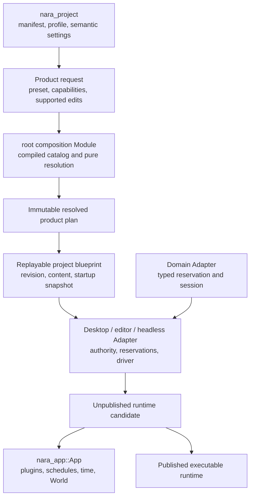
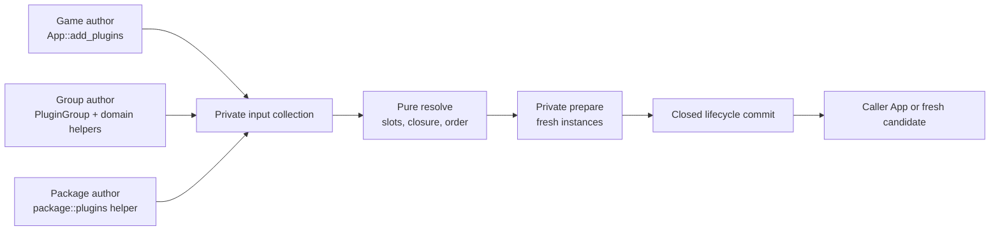

# Runtime Composition Interface Design

**Status**: Design Draft
**Created**: 2026-07-13
**Last Updated**: 2026-07-14
**Owner**: Root product composition, `nara_app`, executable hosts, and the reference game
**Authority**: Non-normative design harness. Accepted ADRs remain authoritative on conflict.
**Related Decisions**: [ADR 0010](adr/0010-plugin-lifecycle-dependencies-and-failure.md),
[ADR 0046](adr/0046-plugin-metadata-and-default-plugin-groups.md),
[ADR 0079](adr/0079-root-product-capabilities-and-placeholder-domain-retirement.md),
[ADR 0082](adr/0082-process-host-authority-and-runtime-construction-topology.md), and
[ADR 0084](adr/0084-executable-runtime-ownership-and-isolation.md)
**Delivery Evidence**: [Reference-Game-Driven Foundation Plan](../plans/2026-07-12-001-refactor-reference-game-driven-foundation-plan.md)
**Upstream Package Design**: [Source Extension Package Interface Design](source-extension-package-interface-design.md)
**Cross-Domain Validation Harness**: [Multi-Role Extension Package Tracer Interface Design](multi-role-extension-package-tracer-design.md)

## Purpose

This document is a scenario-driven workbench for designing Nara's runtime composition Interface.
It translates architecture decisions into caller workflows, failure contracts, and observable test
oracles before public Rust types are frozen.

It is deliberately not another ADR:

- ADRs decide durable ownership and invariants.
- This document compares Interface shapes against concrete scenarios.
- The reference game and fault-injection tests provide admission evidence.
- Stable conclusions flow back into the relevant ADRs and implementation ledger.
- Illustrative type and method names in this document are not compatibility commitments.

Source package discovery, trust, editor/import/build contributions, and package lifecycle are
designed separately. A package runtime contribution becomes one input to this document's resolved
plugin plan; `Plugin` does not become the package abstraction.

Every proposed Interface change should identify the scenarios it serves. A public type that serves
no scenario in this document or an accepted extension should not be added speculatively.

## How To Use This Design Harness

For every candidate Interface:

1. Select the scenario IDs that the candidate claims to support.
2. Write the shortest honest caller sketch for each selected scenario.
3. List every fact the caller must know: types, configuration, ordering, errors, authority, and
   performance constraints.
4. List the behavior hidden inside the Module and apply the deletion test: if deleting the Module
   does not redistribute meaningful complexity, the Module is too shallow.
5. Identify illegal states that the Interface makes unrepresentable and those that still require a
   typed runtime rejection.
6. Test through the same seam as the caller. Do not preserve old tests that reach behind a deepened
   Interface only to observe implementation details.
7. Reject generality that has no second Adapter or named scenario.

Use this compact review record when adding another candidate:

```text
Candidate:
Scenarios served:
Caller must know:
Module hides:
Authority and lifetime:
Ordering and errors:
Performance contract:
Illegal states prevented:
Observable test oracle:
Depth / Locality / Seam verdict:
```

## Problem

The current composition path exposes several separate facts that can drift:

- RGF-U3 now produces an immutable `ProjectSettingsCandidate` after manifest and compiled-ceiling
  validation, but it does not yet resolve plugin slots, services, conflicts, or a publishable
  runtime candidate (`src/project_host.rs`).
- root plugin groups maintain static plugin-ID arrays separately from their imperative `build`
  methods (`src/lib.rs`).
- `PluginGroupBuilder` directly wraps `&mut App`, so group expansion and committed installation are
  the same operation (`crates/nara_app/src/lib.rs`).
- production plugin `build` methods install hidden prerequisite plugins after App mutation has
  begun (`nara_asset_watch`, `nara_image`, `nara_ui`, `nara_winit`, and render adapters).
- `WinitPlugin::build` selects the process runner from inside runtime plugin installation.
- the reference game and examples repeat product setup knowledge through manual
  `App::new -> group -> game plugin` sequences.

This makes a successful example concise only after callers learn hidden ordering, feature, failure,
and ownership rules. The Module is shallow at the product seam even though `nara_app::App` itself is
a deep execution Module.

## Goals

1. Resolve product capabilities, plugin entries, group membership, service requirements,
   conflicts, supported slot configuration/disabling/ordering, and later admitted replacements
   without mutating an App or acquiring native authority.
2. Make one immutable resolved plan the source for inspection and committed installation.
3. Preserve Rust-native custom plugins without introducing a dynamic plugin ABI.
4. Construct product runtimes as fresh unpublished candidates and publish only complete success.
5. Keep direct code-first `App` construction available with honest ADR 0010 poison semantics.
6. Let desktop, editor, headless, server, tests, and future exporters reuse the same composition
   kernel without a public universal host or service locator.
7. Make the Interface testable through observable results rather than internal builder maps.

## Non-Goals

- A dynamic library ABI or package-level binary plugin protocol.
- A universal `EngineHost`, `ServiceHub`, dependency-injection container, or `get<T>()` registry.
- Arbitrary behavioral equivalence between plugins that share metadata.
- Rollback of arbitrary `Plugin::build`, native, thread, filesystem, or process-global effects.
- A generic renderer, platform, task-runtime, or service backend trait.
- Final public names for `RuntimeRecipe`, `RuntimeCandidate`, or `RuntimeInstance` while ADRs 0082
  and 0084 remain Proposed.
- Scene materialization, runtime control, or service shutdown details already owned by other seams.

## Working Decisions

These decisions are the baseline for evaluating Interface sketches in this document. They are not a
claim that Proposed ADRs already have implementation evidence.

1. Product composition does not start from an arbitrary caller-mutated App.
2. Pure admission failure creates no App, lease, thread, watcher, GPU object, or native session.
3. Product startup always uses a fresh unpublished App candidate.
4. A committed plugin hook failure poisons only that candidate and never becomes a rollback claim.
5. A failed candidate is not published and remains owned until admitted cleanup reaches an
   observable terminal result.
6. A direct code-first App remains supported but does not receive product-level atomic publication
   guarantees.
7. Plugin groups describe data before installation. They do not mutate App while declaring
   membership.
8. A committed resolved-plan installation cannot add plugins or groups that were absent from the
   resolved plan.
9. Stable slot identity is distinct from the installed plugin's `PluginId`.
10. U4 supports same-plugin configuration and optional-slot disable. Cross-plugin replacement and
    its public slot-contract version remain trigger backlog until a second concrete `PluginId` and
    public conformance suite exist.
11. Runtime recipes contain reconstructible immutable inputs and repeatable plugin factories, not
    plugin instances, Worlds, active tasks, native handles, or one-shot closures.
12. The process runner/driver is owned by a concrete host Adapter, not selected as a hidden side
    effect of plugin build.
13. `Plugin::declaration()` is the single authority for stable plugin identity and dependency
    metadata. A stable versioned definition ID identifies one admitted construction policy;
    instance configuration is explicit, immutable, and fingerprinted separately.
14. Every plugin lifecycle commit is closed. `Plugin::build` and `Plugin::finish` cannot install a
    plugin or group, including on the direct code-first path.
15. A `PluginId` identifies exactly one installed entry in a plan. A future proven multi-instance
    requirement must introduce explicit stable entry identity rather than weakening `PluginId`.
16. A caller-owned App may accept several top-level plugin batches only as immutable-prefix plus
    append. Later batches cannot reorder, replace, disable, or reconfigure committed entries.
17. `App::set_runner` is top-level code-first/Host authority. Plugin hooks cannot select or replace
    the process driver.

## Module And Seam Placement



Ownership is intentionally split:

| Module | Owns | Must not own |
|---|---|---|
| `nara_project` | Parsing, profile overlay, validated semantic settings | Cargo ceiling, plugin instances, App mutation, filesystem access |
| root composition | Compiled product catalog, normalization, first-party groups/slots, pure closure | World, schedules, native handles, runtime driving |
| `nara_app` | Generic plugin plan mechanics, plugin lifecycle, schedules, time, World | Product presets, project files, platform authority |
| project blueprint | Immutable revision, resolved plan, bounded content/startup inputs | Mutable runtime state, active service session, one-shot factory |
| executable host Adapter | Filesystem/platform authority, reservations, candidate drive and publication | Gameplay schedule, second World authority, composition policy |
| domain Adapter | Typed native reservation/session/close mechanics | Global service lookup, project persistence, product selection |

All composition dependencies before candidate startup are in-process data. They do not justify a
public mock port. Host and native authorities already have concrete typed Adapters; they are inputs
to candidate construction, not members of a generic composition context.

## Interface Vocabulary

The names below describe roles. Exact Rust names remain illustrative.

| Concept | Meaning |
|---|---|
| Product request | Runtime preset, additive requested product capabilities, settings, and supported plan edits |
| Compiled ceiling | Product capabilities compiled into the root binary; read from the root catalog, never asserted by project data |
| Plugin slot | Stable position in a named group; a versioned cross-plugin replacement contract exists only after a real conformance consumer admits it |
| Plugin ID | Identity of the concrete plugin installed into an App |
| Plugin declaration | Static type-owned identity, dependencies, capabilities, conflicts, and category |
| Plugin definition | Stable versioned definition identity plus one declaration, explicit immutable configuration, and one admitted repeatable typed factory |
| Plugin registration | One occurrence of a definition at a stable slot/entry with ordering intent and provenance |
| Resolved product plan | Immutable ordered entries after every pure product/plugin/service validation succeeds |
| Prepared plugin plan | Private one-attempt carrier containing fresh instances and the exact resolved definition/occurrence keys |
| Project blueprint | Replayable project revision, resolved plan, content snapshots, and startup intent |
| Runtime candidate | Fresh unpublished owner for one attempted generation and every acquired cleanup obligation |
| Runtime | Successfully published executable owner around one App generation |
| Driver | Concrete desktop/editor/headless Adapter that supplies elapsed time, platform events, and control |

## Contract Scenarios

Scenario IDs are stable references for design reviews, implementation tests, ADR evidence, and
future Interface proposals.

### Successful Product Flows

| ID | Caller And Goal | Required Interface Behavior | Primary Oracle |
|---|---|---|---|
| RC-01 | Embedded library creates a minimal code-first App | Direct `App::new` and explicit plugins remain available without project or host objects | Independent compile and one fixed-tick smoke test |
| RC-02 | Headless reference game boots from validated project data | Preset plus capabilities resolve once; caller does not manually reproduce first-party order | Public reference-game boot test |
| RC-03 | Dedicated server boots the same game | Server policy excludes window, renderer, editor, audio device, and raw input regardless of compiled ceiling | Installed-plan snapshot and runtime resource audit |
| RC-04 | Desktop 2D game boots through winit and wgpu | Desktop Adapter accepts only a plan that explicitly requested its capabilities; it never widens the request | Desktop plan test and platform smoke |
| RC-05 | Runtime-UI-only product boots without sprite/tilemap | `runtime-ui` does not imply `runtime-2d`; submitter closure remains valid | Cargo tree, plan snapshot, and smoke test |
| RC-06 | Two runtime generations start from one blueprint | Immutable revision/plan may be shared; World, queues, clocks, task/service/backend epochs are fresh | Generation-isolation integration test |

### Supported Customization

| ID | Caller And Goal | Required Interface Behavior | Primary Oracle |
|---|---|---|---|
| RC-10 | Game configures title and dimensions | Configure the existing first-party window slot with the same `WindowPlugin` ID and explicit settings | Window settings plan/smoke test |
| RC-11 | 2D game does not use tilemaps | Disable the optional tilemap slot before resolution; no tilemap plugin or dependency remains | Resolved and installed snapshots agree |
| RC-12 | Game installs its Rust gameplay plugin | Insert a repeatable factory relative to the supported gameplay slot without editing Nara source | Independent reference-game composition test |
| RC-13 | Tooling explains the selected product | Inspect normalized capabilities, groups, slots, actual plugin IDs, requirements, and order from one plan | Golden plan snapshot |
| RC-14 | Test injects a configured failure plugin | Add a test registration through the same staged plan Interface, without a production-only DI seam | Fault-injection integration test |
| RC-15 | Embedded App adds another top-level plugin batch | Existing committed order is an immutable prefix; the new batch appends or rejects any backward order/edit before mutation | Direct App order/installed-snapshot test |
| RC-16 | Later product substitutes a different plugin in a named slot | Only root/domain-admitted slot-contract version and conformance evidence authorize a different `PluginId` | Trigger-specific public replacement conformance suite |

### Pre-Mutation Admission Failure

| ID | Failure | Required Result | Retry Oracle |
|---|---|---|---|
| RC-20 | Project requests a capability outside the compiled ceiling | Typed composition rejection before App or native authority exists | Corrected request resolves in the same process |
| RC-21 | A later admitted replacement requires a compiled but unrequested product capability | Typed rejection identifies required and requested capability sets | Adding the capability resolves successfully |
| RC-22 | Missing plugin/service requirement, conflict, or dependency cycle | Typed stable-ID error with bounded cycle chain; no partial plan publication | Corrected graph resolves successfully |
| RC-23 | Duplicate, missing, disabled-required, or later wrong-contract-version slot | Typed slot error before plugin factory commit | Corrected edit resolves successfully |
| RC-24 | One definition ID/version is bound to divergent declarations, config schemas, or typed factory bindings | Admission rejects before factory invocation, reservation, or App creation | Corrected canonical binding resolves successfully |
| RC-25 | Desktop/headless driver does not satisfy the plan | Typed driver mismatch; driver may not add capabilities or plugins | Matching Adapter accepts the same plan |
| RC-26 | Typed plugin factory returns a preparation error or unwinds | No reservation, App, or runtime publication; unwind containment makes no same-process retry claim | Corrected typed failure can prepare a fresh attempt |

### Candidate Construction Failure

| ID | Failure Point | Required Result | Cleanup Oracle |
|---|---|---|---|
| RC-30 | Plugin preflight, build, or finish fails or unwinds | No runtime publication; first lifecycle/attempt failure is preserved | Every committed cleanup owner attempted once in reverse order |
| RC-31 | Registry freeze, service activation, scene preflight/materialization, or startup fails | No Running runtime; old published runtime remains unchanged | Candidate retires all admitted dependencies |
| RC-32 | Candidate cleanup is pending or times out | Failure retains an observable owner; parent authority cannot disappear or publish a conflicting replacement | Host can poll terminal close state and diagnostics |
| RC-33 | Plugin attempts nested installation during any build/finish commit | App is poisoned by a sticky contract violation; a product candidate is never published | No hidden plugin appears in installed snapshot |
| RC-34 | First attempt fails and a second attempt succeeds | Retry constructs a fresh candidate and generation, never reuses the poisoned App | Attempt IDs and mutable authority epochs differ |

### Driver And Workspace Flows

| ID | Caller And Goal | Required Interface Behavior | Primary Oracle |
|---|---|---|---|
| RC-40 | Headless test manually advances time | Concrete Adapter starts the recipe and exposes the runtime drive contract without a universal host trait | Semantic snapshot after exact ticks |
| RC-41 | Editor starts, stops, and restarts Play | Workspace retains blueprint outside World; restart waits for Stop then constructs a fresh candidate | Edit-to-Play restart integration test |
| RC-42 | Winit owns the process event loop | Winit Adapter drives runtime; runtime plugin installation does not silently select a runner | Static boundary test and window smoke |
| RC-43 | Game requests an in-runtime retry | Gameplay resets game-owned run state at a fixed safe point; it does not reconstruct the engine runtime | Same runtime generation, new game-run generation |

## Proposed Interface Shape

### 1. Pure Product Resolution

The root facade should expose one small composition seam. The compiled ceiling is an implementation
input owned by the root catalog, not a value supplied by untrusted project data.

```rust
pub fn resolve_product(
    request: ProductRequest,
) -> Result<ResolvedProductPlan, ResolveProductError>;

pub enum ResolveProductError {
    Composition(CompositionError),
    Plugins(PluginPlanError),
}
```

The public sum error preserves whether product-capability admission or plugin-plan closure failed;
it does not flatten both into `PluginError`.

`ProductRequest` conceptually contains:

- one execution-policy preset: minimal, local headless, or server;
- additive product capabilities;
- validated semantic settings;
- supported same-plugin configuration/disable/relative-order edits and later admitted replacement;
- repeatable custom plugin registrations.

Desktop and editor are not mutually exclusive runtime presets. They are capability and Adapter
selections layered over an execution policy.

`ResolvedProductPlan` must be immutable, deterministic, and inspectable. It contains no App,
World, active task, native handle, open event loop, or service session. At minimum its snapshot
exposes:

- compiled, requested, normalized, and required product capability sets;
- ordered plugin entries with occurrence identity, slot ID, later replacement-contract version when
  applicable, actual Plugin ID, definition ID/version, group provenance, and declaration;
- configuration identity through a versioned digest subject to disclosure policy; raw canonical
  configuration remains private;
- plugin and service requirements/conflicts;
- disabled optional slots;
- a deterministic plan fingerprint.

The product invariant is:

```text
required product capabilities of the resolved plan
    <= normalized project request
    <= compiled product ceiling
```

Plugin/service closure is validated separately from this product subset.

### 2. Data-Only Plugin Groups

Nara should preserve Bevy's small group-authoring shape while changing what the builder owns:

```rust
pub trait PluginGroup: Sized + Send + Sync + 'static {
    const ID: PluginGroupId;

    fn build(self) -> PluginGroupBuilder;

    fn edit(self) -> EditedPluginGroup<Self> {
        EditedPluginGroup::new(self)
    }
}

pub struct PluginGroupBuilder {
    // Private stable slots, entries, nested groups, and order intent.
}

impl PluginGroupBuilder {
    pub fn new() -> Self;

    pub fn add(self, definition: PluginDefinition) -> Self;

    pub fn add_slot(
        self,
        slot: PluginSlot,
        definition: PluginDefinition,
    ) -> Self;

    pub fn add_group(self, group: impl PluginGroup) -> Self;
}
```

`build` deliberately has no `App` parameter and no `finish(&mut App)` operation. Builder methods
record intent; expected duplicate, slot, dependency, conflict, and ordering errors are returned by
the resolver rather than panicking during chaining. `add_group` stores an inactive nested group for
resolver-controlled expansion, so a stable group stack can detect `A -> B -> A` before Rust
recursion or App mutation.

The builder contains no root group identity. The sealed collector wraps the returned contents with
the invoked `G::ID`, so `Foo::build` cannot accidentally or deliberately claim `Bar::ID`. The same
identity-free contents function can therefore lower through a direct group or a package runtime
contribution without becoming a second group-ID authority.

A bare builder does not implement the ordinary `Plugins` input trait, because installing
`MyGroup.build()` would silently discard `MyGroup::ID` provenance. Direct callers pass the group or
its lazy edited wrapper. The package helper has a separate explicit Adapter for canonical
identity-free contents and supplies package contribution provenance.

The common configurable path is lazy and keeps third-party group code inside resolver containment:

```rust
app.add_plugins(
    Runtime2dPlugins
        .edit()
        .disable(TILEMAP_SLOT)
        .insert_after(
            GAMEPLAY_EXTENSION_SLOT,
            my_game::plugin_definition(settings),
        ),
)?;
```

Calling `build` directly remains possible for group authors, but ordinary callers use `edit` so
group expansion and unwind containment happen inside `add_plugins`. Under `panic = "unwind"`, the
resolver maps an invoked group panic to a stable `PluginPlanError` without retaining the panic
payload. Abort builds make no in-process recovery promise.

These invariants may not change:

- group expansion performs no App mutation or native acquisition;
- one ordered entry collection is the source for both membership inspection and installation;
- group membership is derived after edits, not copied from a parallel static ID array;
- configure, disable, and relative ordering address stable slot IDs, not vector indexes;
- nested groups preserve provenance while flattening to one deterministic install order;
- unsupported replacement is rejected rather than inferred from matching metadata.

A U4 slot records stable ID, required/optional presence, and the expected plugin type/ID. Ordinary
`configure` changes that same plugin's definition/configuration. Replacing it with a different
plugin ID additionally requires a public slot-contract version, root/domain-owned conformance
evidence, and a public conformance suite. That surface remains trigger backlog until a second
concrete plugin implementation exists. A third party cannot self-certify replacement by repeating
a capability string.

Group inclusion is not ownership of an installed instance. Edits apply to stable registration
occurrences before any merge. Exact duplicates merge only when they name the same slot ID (and later
contract version when one exists) or are un-slotted registrations with the same unique `PluginId`,
and in either case carry the same complete admitted definition key. One resolved entry may then
retain provenance from several groups. The same `PluginId` appearing at two different slots is an
error rather than an ambiguous merge, so disabling one slot has one meaning.

The resolver owns one deterministic sequence:

```text
expand inactive groups and retain provenance
    -> apply supported slot/entry edits
    -> validate slot identity/presence and any admitted replacement conformance
    -> merge identical occurrence identity + admitted definition key
    -> validate plugin/service requirements and conflicts
    -> build dependency and explicit-order edges
    -> stable topological sort
    -> freeze snapshot, private definitions, and plan fingerprint
```

Declaration order is a stable preference, not an implicit dependency. Declared plugin prerequisites
and explicit before/after relations are hard edges; stable entry identity is the final tie-break.
Capability requirements validate the already selected closure and never choose an arbitrary
provider. The resolver computes a `PluginGroupDefinitionFingerprint` from canonical expanded
occurrence identities, admitted definition keys, order intent, and nested group fingerprints while
excluding outer edits and accumulated provenance. Duplicate group IDs are idempotent only when this
intrinsic fingerprint matches; divergent definitions fail rather than selecting first or last.

### 3. One Declaration Authority And Repeatable Definitions

Stable declaration facts belong to the plugin type rather than to a constructed instance or a
registration copy:

```rust
pub trait Plugin: Send + Sync + 'static {
    fn declaration() -> &'static PluginDeclaration
    where
        Self: Sized;

    fn preflight(
        &self,
        _context: &PluginPreflightContext<'_>,
    ) -> Result<(), PluginError> {
        Ok(())
    }

    fn build(&self, app: &mut App) -> Result<(), PluginError>;

    fn finish(&self, _app: &mut App) -> Result<(), PluginError> {
        Ok(())
    }

    fn cleanup(
        &self,
        _context: &mut PluginCleanupContext<'_>,
    ) -> Result<(), PluginError> {
        Ok(())
    }
}
```

The `Self: Sized` declaration method preserves object safety. Private erased carriers retain the
canonical declaration reference before turning a fresh `P` into `dyn Plugin`; the trait object does
not grow a second metadata source. Dependency-relevant facts cannot vary with instance settings.
If a setting changes closure, the group must select a different plugin type/static declaration or
an additional explicit companion entry/group. A second definition ID for the same `P` cannot change
requirements or conflicts hidden behind `metadata(&self)`.

`PluginPreflightContext` is a narrow immutable view of the installed-plan prefix and the specific
structural snapshots proven necessary by current preflight consumers. It exposes no `World`, raw
resource access, runner mutation, or native authority. A typed `Err` is retryable before the
attempt's first commit only under this no-side-effect contract. A preflight unwind always poisons a
caller-owned App or marks a product candidate failed/unpublishable; the candidate owner remains
retained through terminal cleanup. Catch-unwind provides diagnostics/cleanup opportunity, not proof
that trusted code left process state intact.

A runtime blueprint cannot retain a one-shot plugin instance. Group and package paths use an opaque
repeatable definition created through typed helpers:

```rust
pub struct PluginDefinition {
    // Private stable DefinitionId/version, declaration reference, canonical config,
    // config fingerprint, and one admitted typed repeatable factory binding.
}

core::plugin_definition()

window::plugin_definition(window_settings)
```

Exact config trait and derive names wait for U4 implementation evidence. The contract is fixed:

- one stable versioned `PluginDefinitionId` identifies one canonical construction policy; a domain
  helper hides this advanced identity from normal game/package callers;
- canonical configuration and the repeatable factory binding are `Send + Sync + 'static`, so an
  immutable definition/blueprint can be shared across Host attempts;
- configuration is explicit immutable data with a deterministic canonical fingerprint, never only
  a captured closure;
- typed construction returns `Result<P, PluginCreateError>` for one concrete `P: Plugin`, so the
  static declaration cannot be swapped after erasure; infallible domain helpers adapt `P` to
  `Ok(P)`;
- construction is repeatable (`Fn` semantics), not one-shot (`FnOnce` semantics);
- each invocation creates a fresh plugin instance for one candidate;
- it receives no App, World, host authority, or generic context;
- it does not start threads, open files, create native sessions, or mutate process-global state;
- preparation preserves the resolved definition key on the fresh private carrier before App
  mutation;
- violation by trusted Rust code is a plugin contract breach, not something Nara claims to sandbox.

The domain definition helper maps its typed construction error into a stable, classified
`PluginPrepareError`; arbitrary `Display` text is not plan identity or a diagnostic summary.

The definition key contains definition ID/version plus the canonical config fingerprint. It proves
which admitted construction policy and immutable input were selected and transferred; it cannot
prove that arbitrary trusted factory code actually uses every field. Domain conformance tests cover
that behavioral obligation. Typed factory erasure makes changing the concrete plugin type
unrepresentable on the public path.

The resolver retains a private canonical config representation (or typed equality witness) and
uses it after any digest match; a hash collision never merges distinct configurations. Public plan
snapshots expose only a versioned digest when disclosure policy permits. The digest algorithm and
canonical encoding version are part of the definition-key format rather than ambient defaults.

The private erased factory implementation is not a public `PluginFactory` extension trait and does
not use `Any`, string downcasts, or a service locator. First-party domain helpers and a package's
canonical definitions module hide it from normal game and package authors.

A `PluginRegistration` is then an occurrence, not another declaration authority. It associates a
definition with a stable slot or entry, order intent, and provenance. Duplicate registrations merge
only when occurrence identity and the complete admitted definition key both match. Reusing a
definition ID with a divergent declaration, config schema/version, or factory binding is an
admission error, not behavioral equivalence. There is no first-wins, last-wins, or public
`add_plugin_if_missing` rule.

All plugin IDs are unique in U4. The current unused `non_unique` metadata option should be removed.
If a real multi-instance plugin lifecycle appears, it must introduce a stable `PluginEntryId` and
define ordering, cleanup, inspection, and configuration identity explicitly.

### 4. One-Line App Ergonomics, One Resolver

Nara should adopt Bevy's sealed marker technique for single plugins, groups, edited groups, and
tuples:

```rust
pub trait Plugins<Marker>: sealed::Plugins<Marker> {}

impl App {
    pub fn add_plugins<M>(
        &mut self,
        plugins: impl Plugins<M>,
    ) -> Result<&mut Self, AddPluginsError>;
}
```

The ordinary call remains one line:

```rust
app.add_plugins((MinimalPlugins, MyGamePlugin::new(settings)))?;
```

A raw `P: Plugin` is a one-attempt inactive instance for that caller-owned App. It does not require
`Clone`, does not enter a replayable blueprint, and cannot be exported as a package definition.
Groups and packages contain only repeatable definitions. Both inputs reuse the same collection,
closure, ordering, and commit implementation; the type system prevents the one-shot input from
being presented as a replayable `ResolvedPluginPlan`.

The direct instance contributes its static declaration but makes no durable configuration
fingerprint promise. A direct input that collides with an existing/planned `PluginId` is therefore
an explicit duplicate error rather than an implicit equality merge. Tooling may inspect that an
opaque one-shot entry was selected, but it cannot claim the entry is reconstructible.

`add_plugins` is the primary public entry. The current singular `add_plugin` may be removed or kept
only as a thin alias with identical semantics; `add_plugin_if_missing` is not retained as a public
composition mechanism. Tuple collection happens before resolution rather than installing each
element immediately.

Every top-level commit is closed. Calls to `add_plugin`, `add_plugins`, or group installation from a
plugin's `build` or `finish` are sticky contract violations and poison the current App even if the
plugin ignores the returned error. Dependencies must appear in declarations and selected groups;
the resolver validates the selected closure but never chooses a hidden provider.

The active-hook guard runs before lifecycle, duplicate/already-installed, declaration, group
expansion, or no-op logic. A plugin therefore cannot avoid sticky poison by attempting to add an
existing ID, using a skip helper, passing a bad group, or installing during `finish`. The same guard
rejects `App::set_runner`; only a top-level code-first caller or concrete Host/driver Adapter owns
runner selection.

Several top-level calls on one caller-owned App use immutable-prefix semantics. The resolver treats
actual committed entries/order as hard input, validates only an appendable suffix, and rejects any
later disable, replacement, reconfiguration, or ordering edge that would move an installed entry.
Product composition avoids this constraint by resolving one complete plan for a fresh App.

New group/provenance and plan-snapshot changes remain staged until the first plugin commit. A
retryable early preflight rejection discards them and leaves installed inspection fingerprints
unchanged. After commit begins, a terminal App retains actual committed entries and attempt evidence;
it never publishes a failed group as successfully installed. If a fully validated later batch has
an empty plugin suffix and only adds matching group/provenance inspection facts, those facts publish
atomically as one metadata-only commit with no lifecycle transition.



Game authors see the first line. Group authors see the second line and the small builder vocabulary.
Resolver graphs, factory erasure, prepared carriers, commit permits, and candidate publication stay
inside engine/package infrastructure.

A reusable package and its direct group lower from one compiled definitions function rather than
maintaining two member lists:

```rust
impl PluginGroup for SpriteAnimationPlugins {
    const ID: PluginGroupId = SPRITE_ANIMATION_GROUP;

    fn build(self) -> PluginGroupBuilder {
        definitions::runtime_plugins()
    }
}

package::define(
    generated::PACKAGE,
    nara_app::package::plugins(
        generated::RUNTIME,
        definitions::runtime_plugins,
    ),
)
```

The package helper privately adapts that repeatable data-only definition into the runtime contract.
It does not wrap the current App-mutating builder or expose plan/admission/candidate vocabulary to
the package author.

### 5. Replayable Blueprint And Fresh Candidate

Composition resolution and runtime startup are separate Modules:

```rust
let plan = resolve_product(request)?;
let blueprint = project_revision.with_runtime_plan(plan, startup_snapshot)?;
let runtime = headless::start(&blueprint)?;
```

The exact public types wait for U12 and U5 evidence. The Interface contract is already clear:

- the blueprint contains only immutable, reconstructible, versioned inputs;
- a concrete host Adapter creates an empty attempt owner;
- the resolved plugin plan privately prepares all fresh instances and verifies their carriers
  before reservation or App creation;
- only then does the host mint one-shot inactive reservations and a fresh App candidate;
- build, finish, registry freeze, service activation, scene materialization, and startup occur inside
  the unpublished candidate;
- success publishes exactly one new runtime generation;
- failure publishes none and retains cleanup ownership until terminal evidence exists.

`PreparedPluginPlan` is a private one-attempt transfer. No public
`ResolvedProductPlan::install_into(existing_app)` operation is admitted until a concrete embedding
consumer proves why `App::add_plugins` and the concrete product Hosts are insufficient.

### 6. Code-First App Path

The low-level embedded path remains intentionally direct:

```rust
let mut app = App::new();
app.add_plugins((MinimalPlugins, MyPlugin))?;
```

This Interface is not a second product composition system. It is an explicit escape hatch for
embedded applications and focused tests:

- callers own ordering and selected plugins;
- collection, resolution, and preparation rejection leave the App unchanged;
- a typed plugin preflight rejection is retryable only while the current top-level commit has not
  committed an entry and the narrow preflight contract was obeyed; a later rejection poisons the
  partially committed App, and any preflight unwind poisons regardless of position;
- committed build/finish failure poisons the App under ADR 0010;
- plugin hooks cannot perform nested installation on this path either;
- callers do not receive runtime blueprint, fresh-generation, or atomic-publication claims;
- project-facing examples should use the product path once it exists.

### 7. Driver Placement

Composition selects required capabilities and runtime-side integration. It does not select process
driver authority as a plugin build side effect.

```text
composition selects what is required
runtime factory constructs what will run
host Adapter decides who drives it and when
```

Headless, editor, and winit are concrete Adapters over the same runtime drive Interface. A universal
`RuntimeDriver` trait is not required until a second implementation needs the same replaceable seam.
The current `WinitPlugin::build -> App::set_runner` route is transitional for the product path.

## Interface Evaluation

The candidates are evaluated by Interface depth rather than implementation size.

| Candidate | Depth | Locality | Authority Honesty | Common-Caller Cost | Decision |
|---|---|---|---|---|---|
| Removed legacy `apply_project_settings(&mut App)` | Low | Low: validation and mutation knowledge was spread across facade, groups, and plugins | Low: predictable rejection could follow mutation | Low on success, high on failure | Removed in RGF-U3 |
| Current immutable settings/capability candidate | Medium | High for manifest admission, low for plugin closure and publication | High for the compiled/requested capability subset only | Low for manifest callers, incomplete for runtime hosts | Keep as input to RGF-U4 composition |
| Pure resolve plus public install into an existing App | Medium | High for composition, low for startup publication | Medium: admission is honest, committed failure still poisons caller state | Medium | Omit the public operation; use private prepared transfer inside existing entry points |
| Universal host/builder around project, services, runtime, and driver | Superficially high | Low over time: unrelated authorities converge in one Module | Low: scope and lifetime differences become hidden | Initially low, grows with every domain | Reject |
| Pure resolved plan plus fresh unpublished candidate | High | High: admission, committed lifecycle, and host authority each have one owner | High: publication is atomic without claiming external rollback | Low on product path, explicit on embedding path | Recommend |

The deletion test supports the recommended seams:

- deleting root composition would spread capability normalization, slot validation, conflict
  closure, and ordering into every host;
- deleting the candidate owner would spread publication and cleanup ordering into desktop, editor,
  and headless Adapters;
- deleting a universal host would remove complexity rather than redistribute it, which is evidence
  that such a Module would currently be shallow indirection.

## Ordering And Publication

```mermaid
sequenceDiagram
    participant Caller
    participant Resolve as Root Composition
    participant Prepare as Plugin Preparation
    participant Host as Concrete Host Adapter
    participant Candidate
    participant App
    participant Consumer

    Caller->>Resolve: ProductRequest
    Resolve->>Resolve: Normalize capabilities and apply supported edits
    Resolve->>Resolve: Validate product, plugin, service, conflict, and order closure
    Resolve-->>Caller: ResolvedProductPlan
    Note over Caller,Resolve: No App or native authority exists

    Caller->>Host: start(blueprint + resolved plan)
    Host->>Candidate: Create empty fresh attempt owner
    Candidate->>Prepare: Instantiate typed factories and preserve definition keys
    alt Preparation fails
        Prepare-->>Candidate: PluginPrepareError
        Candidate-->>Host: Startup failure; no reservation or App exists
    else Preparation succeeds
        Prepare-->>Candidate: Private one-attempt prepared transfer
        Candidate->>Host: Acquire inactive typed reservations
        Candidate->>App: Create fresh App and commit ordered plugin lifecycle
        Candidate->>Candidate: Freeze, activate services, materialize scene, run startup
        alt Complete startup succeeds
            Candidate-->>Consumer: Publish new runtime generation
        else Any later required phase fails
            Candidate->>Candidate: Retire admitted owners in reverse dependency order
            Candidate-->>Host: Startup failure and retained close state
        end
    end
```

The resolved plan is closed before committed installation. A plugin cannot extend it from `build`
or `finish`. The same rule applies to direct App commits, so a plugin has one lifecycle meaning in
code-first, package, and product paths. This removes hidden dependency selection from runtime
mutation and makes group inspection truthful.

## Error Model

Do not force every phase into the current `PluginError` enum.

| Error Class | Owner | Mutation Guarantee | Retry Meaning |
|---|---|---|---|
| Project parse/profile error | `nara_project` | No composition or App state | Correct source/settings and parse again |
| `CompositionError` | root composition | No App, lease, native session, or published plan | Correct the request or product edit and resolve again |
| `PluginPlanError` | `nara_app` plan mechanics | No committed App mutation | Correct a typed group/plugin closure error and resolve again; unwind has no same-process retry claim |
| `PluginPrepareError` | private plugin preparation | Existing direct App remains unchanged; product path has no App, reservation, or native session yet | Correct a typed factory error and prepare again; unwind has no same-process retry claim |
| `PluginError` | App plugin hook / closed commit | A typed pure-preflight rejection before this attempt's first commit may be retryable; later rejection or any hook unwind poisons | Never retry an App after a committed/partial-attempt failure or hook unwind |
| `RuntimeStartFailure` | runtime candidate/factory | No runtime publication; external effects require owned cleanup | Build a fresh candidate only after retirement policy permits |
| `RuntimeFault` | published executable runtime | Runtime may be partially mutated; first fault is sticky | Observe, stop, discard generation; never in-place rollback |

ADR 0079 now reflects this split: product capability errors belong to root composition, plugin
plan errors belong to `nara_app` plan mechanics, and App-level plugin hook failures remain owned by
the lifecycle Module.

`App::add_plugins` exposes one `AddPluginsError` wrapper over plan, prepare, and App-level
lifecycle failures so the ordinary call still needs only one `?`. The variants must preserve the
mutation guarantee rather than flattening every phase back into `PluginError`.

```rust
pub enum AddPluginsError {
    Plan(PluginPlanError),
    Prepare(PluginPrepareError),
    Lifecycle(PluginError),
}
```

Panic containment does not strengthen these guarantees. Under unwind builds, catch may provide a
diagnostic and cleanup opportunity. It does not prove that arbitrary native or process-global
invariants remain valid, and abort builds cannot return an in-process error. Typed pure-plan,
preparation, or preflight errors have the documented retry meaning; an unwind does not inherit it.

## Performance Contract

- Pure resolution is startup work with expected `O(V + E)` time and `O(V + E)` memory for plugin
  entries and dependency edges.
- Resolution and project-blueprint preparation must not run in a frame or fixed-tick path.
- Stable ordered collections and stable ID tie-breaks make plan output deterministic.
- Resolved plans and immutable project snapshots may be shared with `Arc` across restart attempts.
- Plugin instances, World, schedules, queues, task pools, asset runtime IDs, backend sessions, and
  clocks are recreated for every candidate.
- No composition abstraction adds per-frame dynamic dispatch or lookup.
- Native initialization cost belongs to candidate startup and domain-specific budgets, not pure
  composition resolution.

## Test Oracles

Tests should cross the same Interface as callers. They should not assert internal map layout,
private builder state, or incidental concrete type names.

| Test Layer | Scenarios | Observable Assertions |
|---|---|---|
| Pure composition tests | RC-10 through RC-23 | Structured result, deterministic plan snapshot, zero App/native creation |
| Plugin preparation/candidate admission tests | RC-24 through RC-26 | Definition binding/factory/driver mismatch before reservation or App creation |
| `nara_app` lifecycle tests | RC-15, RC-30, RC-33, RC-34 | Immutable-prefix append/rejection, poison after committed failure, and reverse once-only cleanup |
| Root integration tests | RC-02 through RC-14 | Requested/required/compiled subset, one-to-one resolved/installed entries, many-to-one group provenance, no hidden dependencies |
| Independent reference game | RC-02, RC-03, RC-10 through RC-13, RC-34 | Public dependency only, no facade edits or manual product ordering |
| Runtime candidate fault matrix | RC-30 through RC-34 | No Running publication, exact cleanup ownership, fresh retry generation |
| Tooling integration | RC-06, RC-32, RC-41 | Blueprint outside World, stop-first restart, failed owner retained |
| Cargo/static boundary checks | RC-03 through RC-05, RC-33, RC-42 | Feature isolation, no production nested installs, driver/composition separation |
| Platform smoke | RC-04, RC-42 | Requested desktop Adapter starts, drives, closes, and releases authority in order |

Recommended fingerprints for the "unchanged" assertion on pure rejection include:

- App lifecycle state;
- installed plugin and group snapshots;
- provided plugin capability set;
- resource type set and selected sentinel values;
- startup/core schedule labels and sentinel system counts;
- runner identity/state where inspectable;
- absence of task threads, watcher handles, surfaces, and service reservations.

The implementation may expose a test-only observation helper, but the production Interface must not
grow getters solely for internal test convenience.

## Alternatives Considered

### Option A: Continue Mutating An Existing App During Resolution

**Pros**: Fewest new types and preserves current examples.

**Cons**: Capability errors can arrive after settings, tasks, or plugins mutate the App; metadata
and installation remain separate truths; product retry semantics are false.

**Decision**: Rejected.

### Option B: Resolve First, Then Install Into A Caller-Owned App

**Pros**: Small Interface, strong pure admission, useful for advanced embedding.

**Cons**: Committed plugin failure still poisons the caller's App; it cannot provide atomic runtime
publication or safe editor restart on its own.

**Decision**: Retain only as private lowering inside `App::add_plugins` and concrete product Hosts.
Do not expose a generic public `install_into` operation without another proven embedding consumer.

### Option C: Journal And Roll Back App Mutation

**Pros**: Superficially preserves an existing App identity after failure.

**Cons**: Arbitrary World/schedule mutations, threads, watchers, GPU objects, native callbacks, and
process-global effects are not generally reversible. A journal would create a misleading contract.

**Decision**: Rejected.

### Option D: Pure Plan Plus Fresh Unpublished Candidate

**Pros**: Separates retryable admission from committed startup, preserves the old runtime, supports
fresh reconstruction, and gives one place to own cleanup and publication.

**Cons**: Requires repeatable plugin factories, explicit candidate ownership, and more startup
fault tests.

**Decision**: Recommended.

### Option E: Public Universal Engine Host

**Pros**: One apparent entry point for project, services, runtime, and drivers.

**Cons**: Freezes speculative authority placement, encourages a service locator, and makes embedded
and platform-specific constraints harder to express honestly.

**Decision**: Rejected until multiple concrete hosts prove a shared replaceable seam.

### Option F: Permit Nested Installation Only On The Direct App Path

**Pros**: Preserves current Bevy-like convenience and some existing dependency tests.

**Cons**: The same plugin can succeed when added directly but fail when used by a package or closed
product plan. Plugin authors must learn two lifecycle meanings, dependency inspection becomes
path-dependent, and `nara_app` retains separate open/closed commit modes indefinitely.

**Decision**: Rejected. Pre-1.0 migration moves dependencies into declarations, groups, and tuples;
all plugin hook commits use one closed rule.

## Mature Engine Reference

The comparison is about responsibility, not name matching. Full source and primary-documentation
evidence is recorded in
[Extension Ecosystem Research](../knowledge/engineering/extension-ecosystem-engine-research.md).

| Engine concept | Useful precedent | Boundary Nara does not copy | Nara U4 counterpart |
|---|---|---|---|
| Bevy `Plugins<Marker>`, tuple support, and `PluginGroupBuilder` | One `add_plugins(...)` call accepts a plugin, group, or tuple; membership and order exist before `finish(app)` | `TypeId` identity, one-shot boxed instances, panic-oriented group edits, `finish` into an existing App, and hidden installs from plugin build | Keep the caller ergonomics; use stable IDs, repeatable definitions, typed pure resolution, and closed commit |
| Godot module/GDExtension initialization levels | Explicit levels initialize upward and deinitialize downward, making lifecycle staging visible | Process-global staged startup is not a replayable plan or fresh runtime generation, and extension-map iteration is not a general reverse-registration guarantee | Resolved order plus strict reverse actual-commit cleanup inside an unpublished candidate |
| Unity package manifest and assembly definitions | Package/assembly selection, target scope, and dependencies are resolved before runtime/editor callbacks | Package resolution is not a typed Rust plugin plan, and initialization callbacks do not provide candidate publication | Package runtime role lowers into a closed typed plugin plan; package remains above `Plugin` |
| Unreal plugin descriptor, module type/loading phase, and `StartupModule`/`ShutdownModule` | Descriptor-level module selection is distinct from module lifecycle callbacks | Loading phases and shutdown hooks do not imply rollback of arbitrary startup side effects | Stable slot/order resolution is distinct from committed plugin hooks and failure containment |

Nara's additional concepts are internal consequences of editor restart, server/desktop parity,
package inspection, and last-good publication. They are not additional chores for the normal game
author: that surface remains `Plugin`, `PluginGroup`, tuple, and `App::add_plugins`.

## Success Metrics

| Metric | Target | Measurement |
|---|---:|---|
| Pure rejection safety | 100% of RC-20 through RC-25 leave App/native fingerprints unchanged | Fault matrix |
| Plan truth | Every installed entry matches exactly one resolved entry; each resolved entry retains all contributing group provenance | Snapshot/integration tests |
| Deterministic resolution | 100 repeated resolutions of identical input produce the same plan fingerprint and order | Property/regression test |
| Hidden dependency removal | No plugin `build` or `finish` installs another plugin/group on any path | Static search and sticky-violation contract test |
| Incremental direct order | Every later direct batch appends to the actual committed prefix or rejects before mutation | Order-edge and edit fault tests |
| Capability fidelity | Every tested plan satisfies `required <= requested <= compiled` | Feature/composition matrix |
| Candidate publication | Every injected startup failure publishes zero Running runtimes | Runtime factory fault matrix |
| Cleanup ownership | Every committed owner is attempted exactly once in reverse dependency order | Instrumented failure tests |
| Fresh retry | Failed-first/success-second attempts share no mutable runtime generation state | Generation-isolation test |
| Public leverage | Reference game configures first-party settings, disables tilemap, and places its game plugin without Nara source edits | Independent workspace test |
| Host parity | Headless, editor, and desktop consume the same resolved plan/blueprint contract | Cross-host semantic tests |
| Frame overhead | Zero composition resolution, factory construction, or plan lookup in steady-state frames | Profiling and static review |

## Risks And Mitigations

| Risk | Severity | Likelihood | Mitigation |
|---|---|---:|---|
| Factory performs hidden authority-bearing work | High | Medium | Narrow factory Interface, trusted-code contract, creation fault tests, move native work into typed domain reservations |
| Definition ID is rebound or a private carrier loses its key | High | Medium | One admitted typed factory binding per definition ID/version and exact key preservation into preparation |
| Trusted factory ignores canonical config | High | Low | Treat behavior as a conformance obligation; do not claim fingerprint self-verification |
| Slot vocabulary becomes a generic plugin marketplace | High | Medium | Admit only named first-party slots with a real replacement and public conformance suite |
| Direct App and product startup claims are confused | High | Medium | Separate docs/examples and error types; never promise atomic publication for direct App mutation |
| Failed candidate is dropped before cleanup finishes | Critical | Medium | Failure retains owner and parent authority until terminal close evidence |
| Driver silently widens requested capabilities | High | Medium | Driver validates plan compatibility and returns typed mismatch without editing it |
| Plan order depends on hash iteration or registration race | High | Low | Stable IDs, deterministic collections, explicit tie-breaks, fingerprint tests |
| Composition Module becomes a universal host | High | Medium | Keep filesystem, event loop, services, runtime drive, and World outside pure resolver |
| Existing nested plugin convenience is expensive to remove | Medium | High | Migrate first-party dependencies into groups/tuples in one breaking pre-1.0 slice; keep compile-time migration errors clear |
| Blueprint captures mutable attempt state | High | Medium | Restrict to immutable versioned data and repeatable factories; assert generation isolation |

## Requirements Traceability

| Source | Design Coverage | Evidence Scenarios |
|---|---|---|
| ADR 0010 | Committed hook poison, first-failure retention, reverse cleanup | RC-30, RC-33, RC-34 |
| ADR 0046 | Stable metadata, explicit groups, truthful inspection | RC-12, RC-13, RC-22 |
| ADR 0079 | Compiled/requested/required product subsets and supported slots | RC-03 through RC-05, RC-10 through RC-25 |
| ADRs 0082/0084 | Replayable blueprint, unpublished candidate, runtime publication and fresh restart | RC-06, RC-30 through RC-42 |
| Plan U3 | Compiled capability ceiling and project request normalization | RC-02 through RC-05, RC-20, RC-21 |
| Plan U4 | Configurable plugin slots and complete pure closure | RC-10 through RC-25, RC-33 |
| Plan U12 | Authorized reusable project blueprint | RC-02, RC-04, RC-06, RC-31 |
| Plan U5 | Runtime candidate, publication, fault, close, and restart | RC-06, RC-30 through RC-42 |

## Implementation Sequence

This design does not reorder the reference-game plan. It makes the Interface evidence expected from
each slice explicit:

1. U3 produces truthful compiled capabilities and a normalized project request.
2. U4 introduces static plugin declarations, repeatable definitions, the data-only group/slot
   builder, sealed plugin/group/tuple inputs, pure resolution, supported edits, private preparation,
   and closed commit.
3. U12 combines the resolved plan with authorized immutable project/content inputs in a replayable
   blueprint.
4. U5 consumes the blueprint through a fresh candidate and publishes the first executable runtime
   only after complete startup.
5. Later desktop work proves the winit driver and target lifetime without changing composition
   policy.

The data-only group step is a prerequisite for the package runtime role. Package helpers must not
wrap the current `PluginGroupBuilder<'_>` as though it were a pure plan: that builder immediately
mutates `App`, while root groups still duplicate membership in static plugin-ID arrays. U4 must
derive membership and order from one immutable registration collection, validate it before committed
App mutation, remove hook-time nested installation, and only then preserve direct
`App::add_plugins` ergonomics as a lowering. Root static plugin-ID arrays,
`PluginGroupBuilder::app`, public `add_plugin_if_missing`, and unused non-unique metadata are
migration targets rather than compatibility constraints.

## U4 Decisions And Remaining Questions

U4 closes these high-cost choices:

- `Plugin::declaration()` is the single stable declaration authority.
- `PluginDefinition` privately combines that declaration with explicit canonical configuration and
  a repeatable typed factory; registration records do not copy declaration truth.
- Bevy-style sealed plugin/group/tuple ergonomics lower through one resolver.
- prepared plugin transfer and product installation remain private; no generic public
  `install_into(App)` operation is admitted.
- all plugin build/finish commits reject nested plugin/group installation.
- group membership is derived from resolved registration provenance, never a parallel static array.

The remaining questions belong to later candidate/tooling/driver slices or implementation evidence:

1. What is the smallest failure-owner shape that can represent pending candidate retirement without
   freezing a universal async runtime?
2. Where should resolved plan snapshots live for runtime/tooling inspection if they must not become
   mutable gameplay resources?
3. Which parts of `App::runner` remain useful for code-first embedding after product drivers move to
   concrete host Adapters?
4. Which canonical config encoding and derive/helper surface proves deterministic fingerprints
   without forcing ordinary game authors to implement infrastructure traits?
5. What concrete second implementation, if any, justifies cross-plugin slot replacement rather
   than same-plugin configuration replacement?

These questions should be answered by the named scenarios, not by adding generality in advance.

## Document Maintenance

- Add or revise a scenario before expanding a public Interface.
- Link implementation tests to scenario IDs in test names or module documentation.
- Record reference-game evidence in the implementation ledger, not by changing this Draft to an
  ADR status.
- When a type-level choice becomes durable, refine the owning ADR and mark the corresponding open
  question here as decided with a link.
- Delete obsolete sketches rather than retaining pre-1.0 compatibility guidance.
