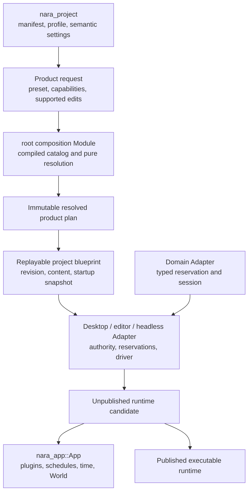
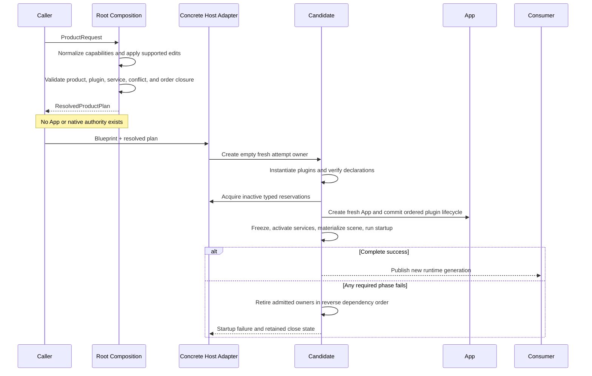

# Runtime Composition Interface Design

**Status**: Design Draft
**Created**: 2026-07-13
**Last Updated**: 2026-07-13
**Owner**: Root product composition, `nara_app`, executable hosts, and the reference game
**Authority**: Non-normative design harness. Accepted ADRs remain authoritative on conflict.
**Related Decisions**: [ADR 0010](adr/0010-plugin-lifecycle-dependencies-and-failure.md),
[ADR 0046](adr/0046-plugin-metadata-and-default-plugin-groups.md),
[ADR 0079](adr/0079-root-product-capabilities-and-placeholder-domain-retirement.md),
[ADR 0082](adr/0082-process-host-authority-and-runtime-construction-topology.md), and
[ADR 0084](adr/0084-executable-runtime-ownership-and-isolation.md)
**Delivery Evidence**: [Reference-Game-Driven Foundation Plan](../plans/2026-07-12-001-refactor-reference-game-driven-foundation-plan.md)
**Upstream Package Design**: [Source Extension Package Interface Design](source-extension-package-interface-design.md)

## Purpose

This document is a scenario-driven workbench for designing Nara's runtime composition Interface.
It translates architecture decisions into caller workflows, failure contracts, and observable test
oracles before public Rust types are frozen.

It is deliberately not another ADR:

- ADRs decide durable ownership and invariants.
- This document compares Interface shapes against concrete scenarios.
- The reference game and fault-injection tests provide admission evidence.
- Stable conclusions flow back into the relevant ADRs and implementation ledger.
- Illustrative type and method names in this document are not compatibility commitments.

Source package discovery, trust, editor/import/build contributions, and package lifecycle are
designed separately. A package runtime contribution becomes one input to this document's resolved
plugin plan; `Plugin` does not become the package abstraction.

Every proposed Interface change should identify the scenarios it serves. A public type that serves
no scenario in this document or an accepted extension should not be added speculatively.

## How To Use This Design Harness

For every candidate Interface:

1. Select the scenario IDs that the candidate claims to support.
2. Write the shortest honest caller sketch for each selected scenario.
3. List every fact the caller must know: types, configuration, ordering, errors, authority, and
   performance constraints.
4. List the behavior hidden inside the Module and apply the deletion test: if deleting the Module
   does not redistribute meaningful complexity, the Module is too shallow.
5. Identify illegal states that the Interface makes unrepresentable and those that still require a
   typed runtime rejection.
6. Test through the same seam as the caller. Do not preserve old tests that reach behind a deepened
   Interface only to observe implementation details.
7. Reject generality that has no second Adapter or named scenario.

Use this compact review record when adding another candidate:

```text
Candidate:
Scenarios served:
Caller must know:
Module hides:
Authority and lifetime:
Ordering and errors:
Performance contract:
Illegal states prevented:
Observable test oracle:
Depth / Locality / Seam verdict:
```

## Problem

The current composition path exposes several separate facts that can drift:

- `apply_project_settings` inserts settings, time resources, diagnostics, and task pools before the
  selected product plan is known to be valid (`src/lib.rs`).
- root plugin groups maintain static plugin-ID arrays separately from their imperative `build`
  methods (`src/lib.rs`).
- `PluginGroupBuilder` directly wraps `&mut App`, so group expansion and committed installation are
  the same operation (`crates/nara_app/src/lib.rs`).
- production plugin `build` methods install hidden prerequisite plugins after App mutation has
  begun (`nara_asset_watch`, `nara_image`, `nara_ui`, `nara_winit`, and render adapters).
- `WinitPlugin::build` selects the process runner from inside runtime plugin installation.
- the reference game and examples repeat product setup knowledge through manual
  `App::new -> group -> game plugin` sequences.

This makes a successful example concise only after callers learn hidden ordering, feature, failure,
and ownership rules. The Module is shallow at the product seam even though `nara_app::App` itself is
a deep execution Module.

## Goals

1. Resolve product capabilities, plugin entries, group membership, service requirements,
   conflicts, supported replacements, disabling, and ordering without mutating an App or acquiring
   native authority.
2. Make one immutable resolved plan the source for inspection and committed installation.
3. Preserve Rust-native custom plugins without introducing a dynamic plugin ABI.
4. Construct product runtimes as fresh unpublished candidates and publish only complete success.
5. Keep direct code-first `App` construction available with honest ADR 0010 poison semantics.
6. Let desktop, editor, headless, server, tests, and future exporters reuse the same composition
   kernel without a public universal host or service locator.
7. Make the Interface testable through observable results rather than internal builder maps.

## Non-Goals

- A dynamic library ABI or package-level binary plugin protocol.
- A universal `EngineHost`, `ServiceHub`, dependency-injection container, or `get<T>()` registry.
- Arbitrary behavioral equivalence between plugins that share metadata.
- Rollback of arbitrary `Plugin::build`, native, thread, filesystem, or process-global effects.
- A generic renderer, platform, task-runtime, or service backend trait.
- Final public names for `RuntimeRecipe`, `RuntimeCandidate`, or `RuntimeInstance` while ADRs 0082
  and 0084 remain Proposed.
- Scene materialization, runtime control, or service shutdown details already owned by other seams.

## Working Decisions

These decisions are the baseline for evaluating Interface sketches in this document. They are not a
claim that Proposed ADRs already have implementation evidence.

1. Product composition does not start from an arbitrary caller-mutated App.
2. Pure admission failure creates no App, lease, thread, watcher, GPU object, or native session.
3. Product startup always uses a fresh unpublished App candidate.
4. A committed plugin hook failure poisons only that candidate and never becomes a rollback claim.
5. A failed candidate is not published and remains owned until admitted cleanup reaches an
   observable terminal result.
6. A direct code-first App remains supported but does not receive product-level atomic publication
   guarantees.
7. Plugin groups describe data before installation. They do not mutate App while declaring
   membership.
8. A committed resolved-plan installation cannot add plugins or groups that were absent from the
   resolved plan.
9. Stable versioned slot identity is distinct from the installed plugin's `PluginId`.
10. Only named slots with concrete conformance evidence are replaceable.
11. Runtime recipes contain reconstructible immutable inputs and repeatable plugin factories, not
    plugin instances, Worlds, active tasks, native handles, or one-shot closures.
12. The process runner/driver is owned by a concrete host Adapter, not selected as a hidden side
    effect of plugin build.

## Module And Seam Placement



Ownership is intentionally split:

| Module | Owns | Must not own |
|---|---|---|
| `nara_project` | Parsing, profile overlay, validated semantic settings | Cargo ceiling, plugin instances, App mutation, filesystem access |
| root composition | Compiled product catalog, normalization, first-party groups/slots, pure closure | World, schedules, native handles, runtime driving |
| `nara_app` | Generic plugin plan mechanics, plugin lifecycle, schedules, time, World | Product presets, project files, platform authority |
| project blueprint | Immutable revision, resolved plan, bounded content/startup inputs | Mutable runtime state, active service session, one-shot factory |
| executable host Adapter | Filesystem/platform authority, reservations, candidate drive and publication | Gameplay schedule, second World authority, composition policy |
| domain Adapter | Typed native reservation/session/close mechanics | Global service lookup, project persistence, product selection |

All composition dependencies before candidate startup are in-process data. They do not justify a
public mock port. Host and native authorities already have concrete typed Adapters; they are inputs
to candidate construction, not members of a generic composition context.

## Interface Vocabulary

The names below describe roles. Exact Rust names remain illustrative.

| Concept | Meaning |
|---|---|
| Product request | Runtime preset, additive requested product capabilities, settings, and supported plan edits |
| Compiled ceiling | Product capabilities compiled into the root binary; read from the root catalog, never asserted by project data |
| Plugin slot | Stable versioned position and conformance contract in a named first-party group |
| Plugin ID | Identity of the concrete plugin installed into an App |
| Plugin registration | Slot/provenance plus one authoritative declaration and a repeatable factory |
| Resolved product plan | Immutable ordered entries after every pure product/plugin/service validation succeeds |
| Project blueprint | Replayable project revision, resolved plan, content snapshots, and startup intent |
| Runtime candidate | Fresh unpublished owner for one attempted generation and every acquired cleanup obligation |
| Runtime | Successfully published executable owner around one App generation |
| Driver | Concrete desktop/editor/headless Adapter that supplies elapsed time, platform events, and control |

## Contract Scenarios

Scenario IDs are stable references for design reviews, implementation tests, ADR evidence, and
future Interface proposals.

### Successful Product Flows

| ID | Caller And Goal | Required Interface Behavior | Primary Oracle |
|---|---|---|---|
| RC-01 | Embedded library creates a minimal code-first App | Direct `App::new` and explicit plugins remain available without project or host objects | Independent compile and one fixed-tick smoke test |
| RC-02 | Headless reference game boots from validated project data | Preset plus capabilities resolve once; caller does not manually reproduce first-party order | Public reference-game boot test |
| RC-03 | Dedicated server boots the same game | Server policy excludes window, renderer, editor, audio device, and raw input regardless of compiled ceiling | Installed-plan snapshot and runtime resource audit |
| RC-04 | Desktop 2D game boots through winit and wgpu | Desktop Adapter accepts only a plan that explicitly requested its capabilities; it never widens the request | Desktop plan test and platform smoke |
| RC-05 | Runtime-UI-only product boots without sprite/tilemap | `runtime-ui` does not imply `runtime-2d`; submitter closure remains valid | Cargo tree, plan snapshot, and smoke test |
| RC-06 | Two runtime generations start from one blueprint | Immutable revision/plan may be shared; World, queues, clocks, task/service/backend epochs are fresh | Generation-isolation integration test |

### Supported Customization

| ID | Caller And Goal | Required Interface Behavior | Primary Oracle |
|---|---|---|---|
| RC-10 | Game configures title and dimensions | Replace the versioned window slot with a conforming configured first-party plugin | Public window-slot conformance suite |
| RC-11 | 2D game does not use tilemaps | Disable the optional tilemap slot before resolution; no tilemap plugin or dependency remains | Resolved and installed snapshots agree |
| RC-12 | Game installs its Rust gameplay plugin | Insert a repeatable factory relative to the supported gameplay slot without editing Nara source | Independent reference-game composition test |
| RC-13 | Tooling explains the selected product | Inspect normalized capabilities, groups, slots, actual plugin IDs, requirements, and order from one plan | Golden plan snapshot |
| RC-14 | Test injects a configured failure plugin | Add a test registration through the same staged plan Interface, without a production-only DI seam | Fault-injection integration test |

### Pre-Mutation Admission Failure

| ID | Failure | Required Result | Retry Oracle |
|---|---|---|---|
| RC-20 | Project requests a capability outside the compiled ceiling | Typed composition rejection before App or native authority exists | Corrected request resolves in the same process |
| RC-21 | A replacement requires a compiled but unrequested product capability | Typed rejection identifies required and requested capability sets | Adding the capability resolves successfully |
| RC-22 | Missing plugin/service requirement, conflict, or dependency cycle | Typed stable-ID error with bounded cycle chain; no partial plan publication | Corrected graph resolves successfully |
| RC-23 | Duplicate, missing, disabled-required, or wrong-version slot | Typed slot error before plugin factory commit | Corrected edit resolves successfully |
| RC-24 | Plugin factory output metadata differs from the resolved declaration | Startup admission rejects before reservation or App creation | Corrected factory can start a fresh attempt |
| RC-25 | Desktop/headless driver does not satisfy the plan | Typed driver mismatch; driver may not add capabilities or plugins | Matching Adapter accepts the same plan |

### Candidate Construction Failure

| ID | Failure Point | Required Result | Cleanup Oracle |
|---|---|---|---|
| RC-30 | Plugin factory, build, or finish fails or unwinds | No runtime publication; first failure is preserved | Every committed cleanup owner attempted once in reverse order |
| RC-31 | Registry freeze, service activation, scene preflight/materialization, or startup fails | No Running runtime; old published runtime remains unchanged | Candidate retires all admitted dependencies |
| RC-32 | Candidate cleanup is pending or times out | Failure retains an observable owner; parent authority cannot disappear or publish a conflicting replacement | Host can poll terminal close state and diagnostics |
| RC-33 | Plugin attempts nested installation during resolved-plan commit | Candidate is rejected/poisoned as a contract violation; resolved plan remains authoritative | No hidden plugin appears in installed snapshot |
| RC-34 | First attempt fails and a second attempt succeeds | Retry constructs a fresh candidate and generation, never reuses the poisoned App | Attempt IDs and mutable authority epochs differ |

### Driver And Workspace Flows

| ID | Caller And Goal | Required Interface Behavior | Primary Oracle |
|---|---|---|---|
| RC-40 | Headless test manually advances time | Concrete Adapter starts the recipe and exposes the runtime drive contract without a universal host trait | Semantic snapshot after exact ticks |
| RC-41 | Editor starts, stops, and restarts Play | Workspace retains blueprint outside World; restart waits for Stop then constructs a fresh candidate | Edit-to-Play restart integration test |
| RC-42 | Winit owns the process event loop | Winit Adapter drives runtime; runtime plugin installation does not silently select a runner | Static boundary test and window smoke |
| RC-43 | Game requests an in-runtime retry | Gameplay resets game-owned run state at a fixed safe point; it does not reconstruct the engine runtime | Same runtime generation, new game-run generation |

## Proposed Interface Shape

### 1. Pure Product Resolution

The root facade should expose one small composition seam. The compiled ceiling is an implementation
input owned by the root catalog, not a value supplied by untrusted project data.

```rust
pub fn resolve_product(
    request: ProductRequest,
) -> Result<ResolvedProductPlan, CompositionError>;
```

`ProductRequest` conceptually contains:

- one execution-policy preset: minimal, local headless, or server;
- additive product capabilities;
- validated semantic settings;
- supported slot replacement/disable/relative-order edits;
- repeatable custom plugin registrations.

Desktop and editor are not mutually exclusive runtime presets. They are capability and Adapter
selections layered over an execution policy.

`ResolvedProductPlan` must be immutable, deterministic, and inspectable. It contains no App,
World, active task, native handle, open event loop, or service session. At minimum its snapshot
exposes:

- compiled, requested, normalized, and required product capability sets;
- ordered plugin entries with slot ID/version, actual Plugin ID, group provenance, and declaration;
- plugin and service requirements/conflicts;
- disabled optional slots;
- a deterministic plan fingerprint.

The product invariant is:

```text
required product capabilities of the resolved plan
    <= normalized project request
    <= compiled product ceiling
```

Plugin/service closure is validated separately from this product subset.

### 2. Data-Only Plugin Groups

`PluginGroupBuilder` should build data rather than wrap `&mut App`:

```rust
pub trait PluginGroup: Send + Sync + 'static {
    fn group_id(&self) -> PluginGroupId;
    fn build(self) -> Result<PluginPlanDraft, PluginPlanError>;
}
```

The exact signature may change, but these invariants may not:

- group expansion performs no App mutation or native acquisition;
- one ordered entry collection is the source for both membership inspection and installation;
- group membership is derived after edits, not copied from a parallel static ID array;
- disable, replace, and relative ordering address stable slot IDs, not vector indexes;
- nested groups preserve provenance while flattening to one deterministic install order;
- unsupported replacement is rejected rather than inferred from matching metadata.

This borrows Bevy's useful idea that a plugin group first produces an ordered builder, while keeping
Nara's stable identities, typed failure, capability validation, and candidate containment.

### 3. Repeatable Plugin Registration

A runtime recipe cannot retain a one-shot plugin instance. It needs a repeatable constructor for
each generation:

```rust
pub trait PluginFactory: Send + Sync + 'static {
    fn create(&self) -> Result<Box<dyn Plugin>, PluginFactoryError>;
}

pub struct PluginRegistration {
    // Illustrative fields only.
    slot: PluginSlotId,
    contract_version: PluginSlotVersion,
    declaration: PluginDeclaration,
    factory: Arc<dyn PluginFactory>,
}
```

The factory contract is intentionally narrow:

- it is repeatable (`Fn` semantics), not one-shot (`FnOnce` semantics);
- each invocation creates a fresh plugin definition for one candidate;
- it receives no App, World, host authority, or generic context;
- it does not start threads, open files, create native sessions, or mutate process-global state;
- candidate construction verifies the fresh plugin metadata against the resolved plan before App
  mutation;
- violation by trusted Rust code is a plugin contract breach, not something Nara claims to sandbox.

Whether the authoritative declaration lives on `Plugin`, `PluginFactory`, or a registration record
remains an open type-level choice. The invariant is one authoritative declaration plus drift
detection, never two unchecked metadata copies.

### 4. Replayable Blueprint And Fresh Candidate

Composition resolution and runtime startup are separate Modules:

```rust
let plan = resolve_product(request)?;
let blueprint = project_revision.with_runtime_plan(plan, startup_snapshot)?;
let runtime = headless::start(&blueprint)?;
```

The exact public types wait for U12 and U5 evidence. The Interface contract is already clear:

- the blueprint contains only immutable, reconstructible, versioned inputs;
- a concrete host Adapter creates an empty attempt owner;
- plugin instances are created and checked before reservation or App creation;
- only then does the host mint one-shot inactive reservations and a fresh App candidate;
- build, finish, registry freeze, service activation, scene materialization, and startup occur inside
  the unpublished candidate;
- success publishes exactly one new runtime generation;
- failure publishes none and retains cleanup ownership until terminal evidence exists.

### 5. Code-First App Path

The low-level embedded path remains intentionally direct:

```rust
let mut app = App::new();
app.add_plugin(MyPlugin)?;
```

This Interface is not a second product composition system. It is an explicit escape hatch for
embedded applications and focused tests:

- callers own ordering and selected plugins;
- preflight rejection may remain retryable while the App is unchanged;
- committed build/finish failure poisons the App under ADR 0010;
- callers do not receive runtime blueprint, fresh-generation, or atomic-publication claims;
- project-facing examples should use the product path once it exists.

### 6. Driver Placement

Composition selects required capabilities and runtime-side integration. It does not select process
driver authority as a plugin build side effect.

```text
composition selects what is required
runtime factory constructs what will run
host Adapter decides who drives it and when
```

Headless, editor, and winit are concrete Adapters over the same runtime drive Interface. A universal
`RuntimeDriver` trait is not required until a second implementation needs the same replaceable seam.
The current `WinitPlugin::build -> App::set_runner` route is transitional for the product path.

## Interface Evaluation

The candidates are evaluated by Interface depth rather than implementation size.

| Candidate | Depth | Locality | Authority Honesty | Common-Caller Cost | Decision |
|---|---|---|---|---|---|
| Current `apply_project_settings(&mut App)` | Low | Low: validation and mutation knowledge is spread across facade, groups, and plugins | Low: predictable rejection may follow mutation | Low on success, high on failure | Reject |
| Pure resolve plus public install into an existing App | Medium | High for composition, low for startup publication | Medium: admission is honest, committed failure still poisons caller state | Medium | Keep only as a possible advanced/internal operation |
| Universal host/builder around project, services, runtime, and driver | Superficially high | Low over time: unrelated authorities converge in one Module | Low: scope and lifetime differences become hidden | Initially low, grows with every domain | Reject |
| Pure resolved plan plus fresh unpublished candidate | High | High: admission, committed lifecycle, and host authority each have one owner | High: publication is atomic without claiming external rollback | Low on product path, explicit on embedding path | Recommend |

The deletion test supports the recommended seams:

- deleting root composition would spread capability normalization, slot validation, conflict
  closure, and ordering into every host;
- deleting the candidate owner would spread publication and cleanup ordering into desktop, editor,
  and headless Adapters;
- deleting a universal host would remove complexity rather than redistribute it, which is evidence
  that such a Module would currently be shallow indirection.

## Ordering And Publication



The resolved plan is closed before committed installation. A plugin cannot extend it from `build`
or `finish`. This removes hidden dependency selection from runtime mutation and makes group
inspection truthful.

## Error Model

Do not force every phase into the current `PluginError` enum.

| Error Class | Owner | Mutation Guarantee | Retry Meaning |
|---|---|---|---|
| Project parse/profile error | `nara_project` | No composition or App state | Correct source/settings and parse again |
| `CompositionError` | root composition | No App, lease, native session, or published plan | Correct the request/edit/factory and resolve again |
| `PluginPlanError` | `nara_app` plan mechanics | No committed App mutation | Correct group/plugin closure and resolve again |
| `PluginError` | committed App plugin lifecycle | Candidate may be mutated and is poisoned on committed failure | Never retry the same App after committed failure |
| `RuntimeStartFailure` | runtime candidate/factory | No runtime publication; external effects require owned cleanup | Build a fresh candidate only after retirement policy permits |
| `RuntimeFault` | published executable runtime | Runtime may be partially mutated; first fault is sticky | Observe, stop, discard generation; never in-place rollback |

This likely requires refining ADR 0079's wording that all composition failures return
`PluginError`. Product capability and slot errors belong to root composition, while plugin hook
failures remain owned by `nara_app`.

Panic containment does not strengthen these guarantees. Under unwind builds, catch may provide a
diagnostic and cleanup opportunity. It does not prove that arbitrary native or process-global
invariants remain valid, and abort builds cannot return an in-process error.

## Performance Contract

- Pure resolution is startup work with expected `O(V + E)` time and `O(V + E)` memory for plugin
  entries and dependency edges.
- Resolution and project-blueprint preparation must not run in a frame or fixed-tick path.
- Stable ordered collections and stable ID tie-breaks make plan output deterministic.
- Resolved plans and immutable project snapshots may be shared with `Arc` across restart attempts.
- Plugin instances, World, schedules, queues, task pools, asset runtime IDs, backend sessions, and
  clocks are recreated for every candidate.
- No composition abstraction adds per-frame dynamic dispatch or lookup.
- Native initialization cost belongs to candidate startup and domain-specific budgets, not pure
  composition resolution.

## Test Oracles

Tests should cross the same Interface as callers. They should not assert internal map layout,
private builder state, or incidental concrete type names.

| Test Layer | Scenarios | Observable Assertions |
|---|---|---|
| Pure composition tests | RC-10 through RC-23 | Structured result, deterministic plan snapshot, zero App/native creation |
| Candidate admission tests | RC-24, RC-25 | Factory/driver mismatch before reservation or App creation |
| `nara_app` lifecycle tests | RC-30, RC-33, RC-34 | Poison after committed failure and reverse once-only cleanup |
| Root integration tests | RC-02 through RC-14 | Requested/required/compiled subset, group-slot-plugin bijection, no hidden dependencies |
| Independent reference game | RC-02, RC-03, RC-10 through RC-13, RC-34 | Public dependency only, no facade edits or manual product ordering |
| Runtime candidate fault matrix | RC-30 through RC-34 | No Running publication, exact cleanup ownership, fresh retry generation |
| Tooling integration | RC-06, RC-32, RC-41 | Blueprint outside World, stop-first restart, failed owner retained |
| Cargo/static boundary checks | RC-03 through RC-05, RC-33, RC-42 | Feature isolation, no production nested installs, driver/composition separation |
| Platform smoke | RC-04, RC-42 | Requested desktop Adapter starts, drives, closes, and releases authority in order |

Recommended fingerprints for the "unchanged" assertion on pure rejection include:

- App lifecycle state;
- installed plugin and group snapshots;
- provided plugin capability set;
- resource type set and selected sentinel values;
- startup/core schedule labels and sentinel system counts;
- runner identity/state where inspectable;
- absence of task threads, watcher handles, surfaces, and service reservations.

The implementation may expose a test-only observation helper, but the production Interface must not
grow getters solely for internal test convenience.

## Alternatives Considered

### Option A: Continue Mutating An Existing App During Resolution

**Pros**: Fewest new types and preserves current examples.

**Cons**: Capability errors can arrive after settings, tasks, or plugins mutate the App; metadata
and installation remain separate truths; product retry semantics are false.

**Decision**: Rejected.

### Option B: Resolve First, Then Install Into A Caller-Owned App

**Pros**: Small Interface, strong pure admission, useful for advanced embedding.

**Cons**: Committed plugin failure still poisons the caller's App; it cannot provide atomic runtime
publication or safe editor restart on its own.

**Decision**: Retained as a possible advanced/internal operation, not the default product path.

### Option C: Journal And Roll Back App Mutation

**Pros**: Superficially preserves an existing App identity after failure.

**Cons**: Arbitrary World/schedule mutations, threads, watchers, GPU objects, native callbacks, and
process-global effects are not generally reversible. A journal would create a misleading contract.

**Decision**: Rejected.

### Option D: Pure Plan Plus Fresh Unpublished Candidate

**Pros**: Separates retryable admission from committed startup, preserves the old runtime, supports
fresh reconstruction, and gives one place to own cleanup and publication.

**Cons**: Requires repeatable plugin factories, explicit candidate ownership, and more startup
fault tests.

**Decision**: Recommended.

### Option E: Public Universal Engine Host

**Pros**: One apparent entry point for project, services, runtime, and drivers.

**Cons**: Freezes speculative authority placement, encourages a service locator, and makes embedded
and platform-specific constraints harder to express honestly.

**Decision**: Rejected until multiple concrete hosts prove a shared replaceable seam.

## Mature Engine Reference

Bevy's data-only `PluginGroupBuilder` is useful prior art: membership and order live together before
`finish` mutates an App (`repo-ref/bevy/crates/bevy_app/src/plugin_group.rs`). Nara should retain
that ergonomics while adding stable IDs, typed errors, capability closure, plan provenance, and
candidate containment. Bevy's group finish and plugin build paths do not roll back partial App
mutation, so their failure semantics are not Nara's product contract.

Godot delays publication of some locally constructed objects, but its main setup is a process-global
staged initialization with manually ordered teardown (`repo-ref/godot/main/main.cpp`). It is not a
replayable multi-generation runtime construction model.

Nara's fresh unpublished candidate is therefore intentionally stronger than both references. The
cost is justified by editor restart, headless/desktop parity, and explicit service lifetime goals.

## Success Metrics

| Metric | Target | Measurement |
|---|---:|---|
| Pure rejection safety | 100% of RC-20 through RC-25 leave App/native fingerprints unchanged | Fault matrix |
| Plan truth | Resolved ordered entries, group snapshot, slot snapshot, and installed plugin IDs form a bijection | Snapshot/integration tests |
| Deterministic resolution | 100 repeated resolutions of identical input produce the same plan fingerprint and order | Property/regression test |
| Hidden dependency removal | No production plugin `build` installs another plugin during resolved-plan commit | Static search and contract test |
| Capability fidelity | Every tested plan satisfies `required <= requested <= compiled` | Feature/composition matrix |
| Candidate publication | Every injected startup failure publishes zero Running runtimes | Runtime factory fault matrix |
| Cleanup ownership | Every committed owner is attempted exactly once in reverse dependency order | Instrumented failure tests |
| Fresh retry | Failed-first/success-second attempts share no mutable runtime generation state | Generation-isolation test |
| Public leverage | Reference game performs window replacement, tilemap disable, and game-plugin placement without Nara source edits | Independent workspace test |
| Host parity | Headless, editor, and desktop consume the same resolved plan/blueprint contract | Cross-host semantic tests |
| Frame overhead | Zero composition resolution, factory construction, or plan lookup in steady-state frames | Profiling and static review |

## Risks And Mitigations

| Risk | Severity | Likelihood | Mitigation |
|---|---|---:|---|
| Factory performs hidden authority-bearing work | High | Medium | Narrow factory Interface, trusted-code contract, creation fault tests, move native work into typed domain reservations |
| Declaration and plugin metadata drift | High | Medium | One authoritative declaration plus pre-App instantiation fingerprint check |
| Slot vocabulary becomes a generic plugin marketplace | High | Medium | Admit only named first-party slots with a real replacement and public conformance suite |
| Direct App and product startup claims are confused | High | Medium | Separate docs/examples and error types; never promise atomic publication for direct App mutation |
| Failed candidate is dropped before cleanup finishes | Critical | Medium | Failure retains owner and parent authority until terminal close evidence |
| Driver silently widens requested capabilities | High | Medium | Driver validates plan compatibility and returns typed mismatch without editing it |
| Plan order depends on hash iteration or registration race | High | Low | Stable IDs, deterministic collections, explicit tie-breaks, fingerprint tests |
| Composition Module becomes a universal host | High | Medium | Keep filesystem, event loop, services, runtime drive, and World outside pure resolver |
| Existing nested plugin convenience is expensive to remove | Medium | High | Migrate first-party groups and metadata in one breaking pre-1.0 slice; keep compile-time migration errors clear |
| Blueprint captures mutable attempt state | High | Medium | Restrict to immutable versioned data and repeatable factories; assert generation isolation |

## Requirements Traceability

| Source | Design Coverage | Evidence Scenarios |
|---|---|---|
| ADR 0010 | Committed hook poison, first-failure retention, reverse cleanup | RC-30, RC-33, RC-34 |
| ADR 0046 | Stable metadata, explicit groups, truthful inspection | RC-12, RC-13, RC-22 |
| ADR 0079 | Compiled/requested/required product subsets and supported slots | RC-03 through RC-05, RC-10 through RC-25 |
| ADRs 0082/0084 | Replayable blueprint, unpublished candidate, runtime publication and fresh restart | RC-06, RC-30 through RC-42 |
| Plan U3 | Compiled capability ceiling and project request normalization | RC-02 through RC-05, RC-20, RC-21 |
| Plan U4 | Configurable plugin slots and complete pure closure | RC-10 through RC-25, RC-33 |
| Plan U12 | Authorized reusable project blueprint | RC-02, RC-04, RC-06, RC-31 |
| Plan U5 | Runtime candidate, publication, fault, close, and restart | RC-06, RC-30 through RC-42 |

## Implementation Sequence

This design does not reorder the reference-game plan. It makes the Interface evidence expected from
each slice explicit:

1. U3 produces truthful compiled capabilities and a normalized project request.
2. U4 introduces the data-only plugin group/slot plan, pure resolution, supported edits, and
   complete pre-mutation validation.
3. U12 combines the resolved plan with authorized immutable project/content inputs in a replayable
   blueprint.
4. U5 consumes the blueprint through a fresh candidate and publishes the first executable runtime
   only after complete startup.
5. Later desktop work proves the winit driver and target lifetime without changing composition
   policy.

## Open Questions

1. Which type owns the single authoritative plugin declaration: `Plugin`, a repeatable factory, or
   the registration record?
2. Should an advanced `ResolvedProductPlan::install_into(App)` operation be public, crate-private,
   or omitted until an embedding consumer proves it?
3. What is the smallest failure-owner shape that can represent pending candidate retirement without
   freezing a universal async runtime?
4. Where should resolved plan snapshots live for runtime/tooling inspection if they must not become
   mutable gameplay resources?
5. Should direct `App::add_plugin` reject all nested installation, or only installation performed
   under a closed resolved plan?
6. Which parts of `App::runner` remain useful for code-first embedding after product drivers move to
   concrete host Adapters?

These questions should be answered by the named scenarios, not by adding generality in advance.

## Document Maintenance

- Add or revise a scenario before expanding a public Interface.
- Link implementation tests to scenario IDs in test names or module documentation.
- Record reference-game evidence in the implementation ledger, not by changing this Draft to an
  ADR status.
- When a type-level choice becomes durable, refine the owning ADR and mark the corresponding open
  question here as decided with a link.
- Delete obsolete sketches rather than retaining pre-1.0 compatibility guidance.
